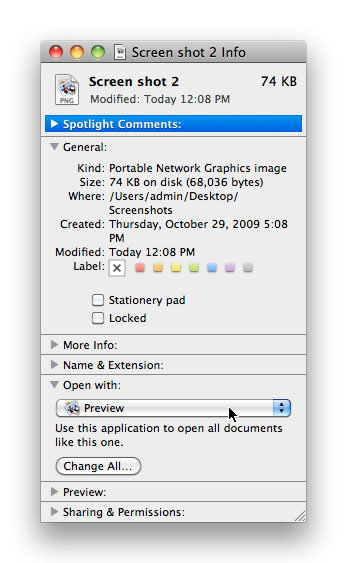
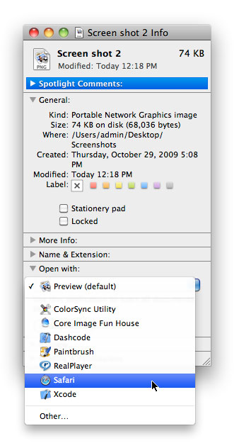
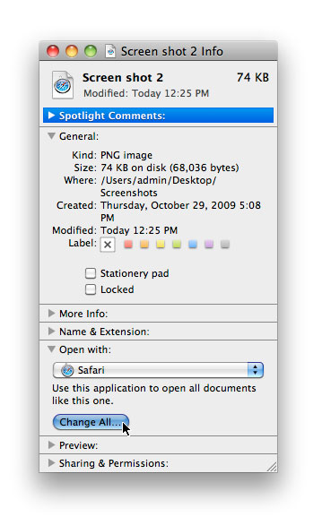
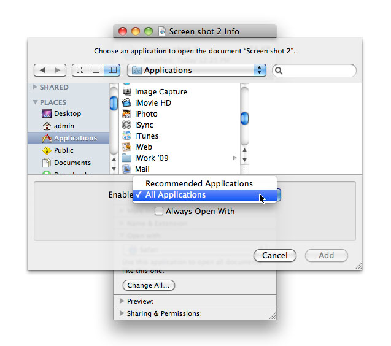

> 导航：[总目录](../../../README.md) · [documentation](../../../_indexes/documentation.md) · [Launch Services Programming Guide](Introduction.md)

[Next](Launch%20Services%20Tasks.md)[Previous](Introduction.md)

# Launch Services Concepts

This chapter introduces both developers and users to basic information about Launch Services and its API.

In general, items to be operated on (such as applications, documents, or folders) can be identified to Launch Services in either of two ways:

- With a file-system reference (`FSRef`) designating a file residing on a local or remote file-system volume
- With a Core Foundation URL reference (`CFURL`) specifying a URL (uniform resource locator), typically (though not necessarily) denoting an item to be accessed via the Internet

Many Launch Services operations are implemented by pairs of related functions, one accepting a file-system reference as a parameter and the other a URL reference: for instance, the preferred application for opening an item can be found with either the `LSGetApplicationForItem` or the `LSGetApplicationForURL` function.

In addition, some Launch Services functions apply not to specific individual items but to families of items defined by certain identifying characteristics. These characteristics can include:

- A four-character _file type_ code
- A four-character _creator signature_
- A filename extension
- A MIME (Multipurpose Internet Mail Extension) type

For instance, the Launch Services function `LSGetApplicationForInfo` finds the preferred application for a family of documents defined by their file type, creator signature, filename extension, or any combination of these characteristics; the `LSCopyApplicationForMIMEType` function finds the preferred application for items with a specified MIME type.

Some Launch Services functions return requested information about an item or family of items. This can include:

- The item’s file type
- The item’s creator signature
- The item’s filename extension
- The item’s _display name:_ the string to be used for displaying its name to the user (such as in the Finder or the Dock)
- The item’s _kind string:_ the string used (in the Finder’s Get Info window or the Kind column of the Finder’s list view, for instance) to characterize its general nature, such as `Application`, `Folder`, `Alias`, `JPEG Picture`, `QuickTime Movie`, or `FrameMaker Document`
- Flags describing various attributes of the item, including the following:

  - Is it a plain file (and not, for example, a directory, volume, or UNIX symbolic link)?
  - Is it an executable application?
  - If an application, can it run natively in OS X?
  - If an application, does it require the Classic emulation environment?
  - If an application that can run either natively or in the Classic environment, does it prefer one environment or the other?
  - Is it a scriptable application?
  - Is it a container (such as a directory, package, or volume)?
  - Is it a packaged directory?
  - Is it the root directory of a volume?
  - Is it an alias?
  - Is it a UNIX symbolic link?
  - Is it invisible (that is, not displayed to the user in the Finder)?
  - Does it have a hidden filename extension?

Launch Services maintains a central data structure, the _Launch Services database,_ in which it records all of the pertinent information about applications and the kinds of document files and URLs they are capable of opening. Whenever a new application becomes known to the system (such as when the user drags it from an installation disk into the Applications folder), the application is _registered_ with Launch Services, which copies the needed information about the application into its database. Launch Services can then use this information to determine the preferred application for opening a given document file or URL.

Launch Services obtains the information it needs about an application from the application’s bundle information property list (`Info.plist`) or, in the case of a single-file application, from a `'plst'` resource in the application’s resource fork. Table 1-1 shows the relevant keys. (See _[Runtime Configuration Guidelines](../../Mac%20OSX/Runtime%20Configuration%20Guidelines/Introduction.md#apple-f4xwc4dqnrsv64tfmyxwi33df52wszbpgeydambqge3ta2i)_ for more detailed information on these and other property-list keys.)

__Table 1-1__  Property-list keys related to Launch Services

| Key | Type | Description |
| `CFBundleDisplayName` | `String` | The application’s display name |
| `CFBundleIconFile` | `String` | The name of the file containing the application’s icon |
| `CFBundleIdentifier` | `String` | The application’s bundle identifier |
| `CFBundleSignature` | `String` | The application’s creator signature |
| `CFBundleDocumentTypes` | `Array` | An array of dictionaries describing the document types the application can open; see [Document Types](#apple-f4xwc4dqnrsv64tfmyxwi33df52wszbpkridgmbqgaydsojzfvbuqmrqgiwugskijbcuor2f) |
| `CFBundleURLTypes` | `Array` | An array of dictionaries describing the URL types the application can open; see [URL Types](#apple-f4xwc4dqnrsv64tfmyxwi33df52wszbpkridgmbqgaydsojzfvbuqmrqgiwugskiizcukqke) |
| `LSRequiresCarbon` | `String` | Must the application run natively in OS X? |
| `LSPrefersCarbon` | `String` | Does the application prefer to run natively in OS X? |
| `LSRequiresClassic` | `String` | Must the application run in the Classic emulation environment? |
| `LSPrefersClassic` | `String` | Does the application prefer to run in the Classic emulation environment? |
| `LSBackgroundOnly` | `String` | Does the application run only in the background? |
| `LSUIElement` | `String` | Is the application a user interface element (that is, has no menu bar and should not appear in the Dock or the Force Quit window)? |

The `CFBundleDisplayName` key specifies the application’s display name; this key can be localized by including it in the `InfoPlist.strings` file of the appropriate `.lproj` subdirectory. `CFBundleIconFile` identifies the file containing the icon image to be used for displaying the application on the screen. `CFBundleIdentifier` defines the application’s _bundle identifier,_ a unique identifying string used to locate its bundle at runtime. `CFBundleSignature` is the application’s _creator signature,_ a four-character code that identifies document files belonging to this application.

The keys `LSRequiresCarbon`, `LSPrefersCarbon`, `LSRequiresClassic`, `LSPrefersClassic`, `LSBackgroundOnly`, and `LSUIElement` specify various aspects of the environment in which the application should be run. A string value of `“1”` for any of these keys declares the corresponding attribute to be true. (In OS X version 10.2 or later, these keys can also take values of type `Boolean` or `Number` rather than `String`, but such values are not supported in earlier system versions.)

The `LSRequiresCarbon`, `LSPrefersCarbon`, `LSRequiresClassic`, and `LSPrefersClassic` keys are mutually exclusive: at most one of them can be set to `"1"`. You can obtain information about the values of these four keys via the `flags` field of the item-information record returned by the Launch Services functions `LSCopyItemInfoForRef` and `LSCopyItemInfoForURL`. `LSRequiresCarbon` specifies that the application must be run natively in OS X and cannot be run in the Classic emulation environment; `LSRequiresClassic` means the reverse. `LSPrefersCarbon` and `LSPrefersClassic` indicate that the application can run in either environment but has a preference for one or the other; the Finder offers the user the choice of which environment to use by displaying a checkbox in the application’s Get Info window labeled “Open in the Classic environment,” initially selected or deselected depending on which key the application itself specifies.

If none of the four keys is set to `"1"`, Launch Services infers the application’s required or preferred environment by other means:

- If the application is bundled, it is assumed to be a native Mac app and is run natively (equivalent to `LSRequiresCarbon`).
- If the application is not bundled and its resource fork contains a `'plst'` or `'carb'` resource, it is assumed to be compatible with either environment but prefer to run natively (equivalent to `LSPrefersCarbon`).
- If the application is not bundled and has no `'plst'` or `'carb'` resource, it is assumed to be a Classic application incapable of running natively (equivalent to `LSRequiresClassic`).

The most important property-list keys, for Launch Services’ purposes, are `CFBundleDocumentTypes` and `CFBundleURLTypes`. The value associated with each of these keys is an array of dictionaries (_type-definition_ and _scheme-definition dictionaries,_ respectively), each of which declares (_claims_) a family of document files or URLs that the application is prepared to handle. Launch Services uses this information in deciding what application to use to open a given document file or URL.

A type-definition dictionary defines a _document type,_ a family of document files that the application can handle. Table 1-2 shows the relevant keys in this dictionary. (See _[Runtime Configuration Guidelines](../../Mac%20OSX/Runtime%20Configuration%20Guidelines/Introduction.md#apple-f4xwc4dqnrsv64tfmyxwi33df52wszbpgeydambqge3ta2i)_ for more detailed information on these and other keys in the type-definition dictionary.)

__Table 1-2__  Keys in a type-definition dictionary

| Key | Type | Description |
| `CFBundleTypeName` | `String` | The abstract name of the document type (also called its kind string) |
| `CFBundleTypeIconFile` | `String` | The name of the icon file for displaying documents of this type |
| `CFBundleTypeOSTypes` | `Array` | An array of four-character file types for documents belonging to this document type |
| `CFBundleTypeExtensions` | `Array` | An array of filename extensions for documents belonging to this document type |
| `CFBundleTypeMIMETypes` | `Array` | An array of MIME types for documents belonging to this document type |
| `CFBundleTypeRole` | `String` | The role the application claims with respect to documents of this type; see [Application Roles](#apple-f4xwc4dqnrsv64tfmyxwi33df52wszbpkridgmbqgaydsojzfvbuqmrqgiwueqkcjjeeir2b) |
| `LSTypeIsPackage` | `Boolean` | Specifies whether the document is distributed as a bundle. |

The `CFBundleTypeName` key specifies the document type’s kind string, a user-visible description used to characterize documents of this type on the screen (such as in the Finder’s Get Info window or in the Kind column of the Finder’s list view). This key can be localized by including it in the `InfoPlist.strings` file of the appropriate `.lproj` subdirectory. `CFBundleTypeIconFile` identifies the file containing the icon image to be used for displaying documents of this type on the screen. `LSTypeIsPackage` specifies whether the document is a packaged bundle (`true`) or a single file (`false`).

Files belonging to a given document type may be characterized by their file types, filename extensions, or MIME types. The `CFBundleTypeOSTypes` key in the type-definition dictionary specifies an array of four-character file type codes that characterize documents of this type; similarly, `CFBundleTypeExtensions` specifies an array of filename extensions and `CFBundleTypeMIMETypes` an array of MIME types. Any of these individual keys can be omitted if the corresponding file characteristic is not relevant, but at least one of them must be present for the file type to be nonempty. To allow an application to accept files of unrestricted file type or extension during drag-and-drop operations, you can use the special wild-card values `'****'` or `'*'` for `CFBundleOSTypes` or `CFBundleTypeExtensions`, respectively. (These are honored only in drag-and-drop operations and not when the user opens a document by double-clicking.) Finally, the `CFBundleTypeRole` key specifies the role that the application claims with respect to documents of the given type, as described under [Application Roles](#apple-f4xwc4dqnrsv64tfmyxwi33df52wszbpkridgmbqgaydsojzfvbuqmrqgiwueqkcjjeeir2b).

A scheme-definition dictionary is similar to a type-definition dictionary, but defines a _URL type_—a family of URLs that the application can handle—rather than a document type. Table 1-3 shows the keys in this type of dictionary. (See _[Runtime Configuration Guidelines](../../Mac%20OSX/Runtime%20Configuration%20Guidelines/Introduction.md#apple-f4xwc4dqnrsv64tfmyxwi33df52wszbpgeydambqge3ta2i)_ for more detailed information on these keys.)

__Table 1-3__  Keys in a scheme-definition dictionary

| Key | Type | Description |
| `CFBundleURLName` | `String` | The abstract name of the URL type (also called its kind string) |
| `CFBundleURLIconFile` | `String` | The name of the icon file for displaying URLs of this type |
| `CFBundleURLSchemes` | `Array` | An array of URL schemes for URLs belonging to this URL type |

The `CFBundleURLName` key specifies the URL type’s kind string, a user-visible description used to characterize URLs of this type on the screen (such as in the Finder’s Get Info window or in the Kind column of the Finder’s list view). This key can be localized by including it in the `InfoPlist.strings` file of the appropriate `.lproj` subdirectory. `CFBundleURLIconFile` identifies the file containing the icon image to be used for displaying URLs of this type on the screen.

URLs belonging to a given URL type are characterized by their scheme components, such as `http`, `ftp`, `mailto`, or `file`. The `CFBundleURLSchemes` key in the scheme-definition dictionary specifies an array of schemes that characterize URLs of this type.

In declaring a document type, an application can claim a particular _role_ with respect to documents of that type, defining the kinds of operations the application is capable of performing on such documents. The role is declared via the `CFBundleTypeRole` key in the application’s type-definition dictionary for the given document type. Launch Services recognizes three such roles:

- `Editor`. The application can read, present, manipulate, and save documents of the given type.
- `Viewer`. The application can read and present documents of the given type, but cannot manipulate or save them.
- `None`. The application cannot operate on documents of the given type. This role is useful for declaring information about document types that the application is incapable of opening, such as their abstract names and icon files.

Launch Services defines a set of bit-mask constants of type `LSRolesMask` denoting the various possible roles. Launch Services functions that find the preferred application for a document or family of documents (`LSGetApplicationForItem`, `LSGetApplicationForURL`, and `LSGetApplicationForInfo`), or that determine whether a given application can open a designated document (`LSCanRefAcceptItem` and `LSCanURLAcceptURL`), take a parameter of this type to specify the application’s desired role with respect to the document.

All applications available on the user’s system must be _registered_ to make them known to Launch Services and copy their document binding and other information into its database. It isn’t ordinarily necessary to perform this task explicitly, since a variety of utilities and services built into the OS X system software take care of it automatically:

- A built-in background tool, run whenever the system is booted or a new user logs in, automatically searches the Applications folders in the system, network, local, and user domains and registers any new applications it finds there. (This operation is analogous to “rebuilding the desktop” in earlier versions of Mac OS.)
- The Finder automatically registers all applications as it becomes aware of them, such as when they are dragged onto the user’s disk or when the user navigates to a folder containing them.
- When the user attempts to open a document for which no preferred application can be found in the Launch Services database, the Finder presents a dialog asking the user to select an application with which to open the document. It then registers that application before launching it.

In spite of these automatic registration utilities, it may sometimes be necessary to register an application explicitly with Launch Services. For example, although developers are encouraged to package their applications so that they can be installed by simply dragging them onto the user’s disk, some applications may require more elaborate custom installer software. In such cases, the installer should call one of the Launch Services registration functions `LSRegisterFSRef` or `LSRegisterURL` to register the application explicitly.

The registration functions take a Boolean parameter, `inUpdate`, which controls the function’s behavior when the application being registered already exists in the Launch Services database. If this parameter is `true`, Launch Services unconditionally reregisters the application, replacing any previous information that may already exist for it in the database; if the parameter is `false`, the application is reregistered only if its current modification time is more recent than that recorded in the database.

After making any significant change in an application’s Launch Services–related information, you should either reregister the application explicitly, by calling `LSRegisterFSRef` or `LSRegisterURL` with `inUpdate` set to `true`, or update the modification time of the application to ensure that it will be updated by the automatic registration utilities described above.

The primary purpose of Launch Services is to open applications, documents, and URLs. Exactly how this is done depends on the kind of item to be opened, as described in the following sections.

When the item to be opened is an application (or a URL with scheme `file` designating an application), Launch Services checks whether the application is already running and proceeds accordingly:

- If the application is not already running, Launch Services starts it up (_launches_ it) and sends it an `'oapp'` (“open application”) Apple event. The application should respond to this event by performing its normal startup processing.
- If the application is already running, Launch Services activates it (brings it to the front of the screen) and sends it an `'rapp'` (“reopen application”) Apple event. This instructs the application to take some additional action, if necessary, to provide visual feedback to the user that it has become active: for example, it might open an empty document window or a document creation dialog if it has no other windows already open.

In either case, Launch Services adds the application to the Recent Items submenu in the Apple menu.

If the item to be opened is a document (or a URL with scheme `file` designating a document file), Launch Services must first determine what application to use to open the item. This is known as the item’s _preferred application._ As described under [User-Specified Binding Preferences](#apple-f4xwc4dqnrsv64tfmyxwi33df52wszbpkridgmbqgaydsojzfvbuqmrqgiwueqkcjjeusr2i), the OS X user interface allows the user to specify an explicit binding between a document and its preferred application. If such an explicit binding has been specified, it takes precedence over any other considerations; if not, Launch Services uses a set of implicit binding criteria to determine the preferred application, as described under [Preferred Applications](#apple-f4xwc4dqnrsv64tfmyxwi33df52wszbpkridgmbqgaydsojzfvbuqmrqgiwueqkcijfeurkg).

Once the preferred application has been determined, Launch Services launches or activates it (depending on whether it is already running) and sends it an `'odoc'` (“open document”) Apple event instructing it to open the specified document. (If the document is to be printed rather than merely opened, a `'pdoc'` (“print document”) Apple event is sent instead of `'odoc'`; in the case of a `file` URL, if the application claims to handle URLs with that scheme, it is sent a `‘GURL'` (“get URL”) Apple event instead.)

Finally, Launch Services adds both the application and the document (or URL) to the Recent Items submenus in the Apple menu.

If the item to be opened is a URL with a scheme other than `file`, it is opened in essentially the same way as a document, but with the following exceptions:

- As described under [Preferred Applications](#apple-f4xwc4dqnrsv64tfmyxwi33df52wszbpkridgmbqgaydsojzfvbuqmrqgiwueqkcijfeurkg), the implicit binding criteria for selecting a preferred application are based on the URL’s scheme component rather than on a creator signature, file type, or filename extension.
- The Apple event sent to the application after launching or activating it is `'GURL'` (“get URL”) rather than `'odoc'` (“open document”).

After the preferred application is launched or activated, Launch Services adds the application to the Recent Items submenu in the Apple menu.

When opening an application (whether by itself or to open one or more documents or URLs), you can specify various _launch options_ to control the manner in which it is launched or activated. These can include:

- Whether to open the documents or URLs (if any) in a specifically designated application or in their own preferred applications
- Whether to print the documents or URLs (if any) or merely open them
- Whether to add the application and the documents (if any) to the Finder’s Recent Items menu or to suppress this action
- Whether to permit the application to open in the background or to fail if it is a background-only application
- Whether to open the application without bringing it to the foreground
- Whether to permit the application to open in the Classic emulation environment or to fail if it is a Classic-only application
- Whether to launch a new instance of the application, even if another instance is already running
- Whether to hide the application after launching it
- Whether to hide all other applications after launching this one
- Whether to launch the application synchronously or asynchronously (see next section)

One of the options you can specify when launching an application is whether to launch it _synchronously_ or _asynchronously:_

- In a synchronous launch, control does not return from the Launch Services function launching the application until the application has completed its launch sequence (indicated visually to the user when the application’s icon stops “bouncing” in the Dock).
- In an asynchronous launch, control returns immediately, while the icon in the Dock is still “bouncing.” When the launch sequence has been completed, your application is notified with a Carbon event of type `kEventAppLaunchNotification`. You can install an event handler callback routine to respond to this event in whatever way is appropriate. In your call to the Launch Services function that launches the application, you can supply an arbitrary 4-byte _reference constant_ that will be passed back to your handler routine as part of the notification event.

Launch Services’ first priority in determining the preferred application for a file or a non-file URL is whether the user has specified an explicit binding preference for that item.

The user can specify a preferred application for a file by selecting the item in the Finder and choosing the Get Info command (see Figure 1-1).

__Figure 1-1__  Choosing Get Info

!

The Open With pane of the Get Info window contains a pop-up menu listing all known applications in the Launch Services database that claim to accept the selected item (see Figure 1-2). The user can then choose an application from the menu to become the item’s preferred application (Figure 1-3).

__Figure 1-2__  Get Info window

__Figure 1-3__  Selecting the preferred application for an item

Clicking the Change All button (Figure 1-4) makes the chosen application the preferred application for all items of the same document or URL type, rather than just for the single item selected.

__Figure 1-4__  Selecting the preferred application for an item type

Occasionally, a user may wish to designate a preferred application that doesn’t claim to accept a given document or URL. (This might be useful, for instance, for opening documents in a text-encoded format, such as HTML, as unencoded text in a text editor.) The Other item in the Open With pane’s pop-up menu opens the dialog shown in Figure 1-5, in which the user can navigate to the desired application. The All Applications item in the pop-up menu labeled Show at the top of the dialog allows any desired application to be selected; Recommended Applications causes those not claiming to accept the item to be dimmed.

__Figure 1-5__  Choose Other Application dialog

There is no system-level user interface for setting non-file URL scheme handlers. However, individual applications can allow users to choose a preferred application for a specific URL scheme. For example:

- The Safari application allows users to set the `http:` handler by choosing a default web browser.
- The Mail application allows users to set the `mailto:` handler by choosing a default email reader.

Launch Services performs a document binding operation when it needs to:

- Compute the best icon to use for a document.
- Compute the kind string for a document, as shown in the Finder list view and some other contexts.
- Open a document.

Launch Services uses a series of prioritized binding criteria to determine the preferred application for opening a given document or URL. These are used by the Launch Services functions that open a document file (`LSOpenFSRef`, `LSOpenFromRefSpec`) or a URL (`LSOpenCFURLRef`, `LSOpenFromURLSpec`), as well as by those that merely locate the preferred application for such an item without actually opening it (`LSGetApplicationForItem`, `LSGetApplicationForURL`). They are also used by the `LSGetApplicationForInfo` function, which locates the preferred application for opening a family of items defined by specified identifying characteristics.

For individual document files (whether specified by a file-system reference or a URL with scheme `file`), the criteria are as follows:

1. If the user has specified an explicit binding for the document (or for the entire document type to which it belongs), the preferred application is the one the user has specified.
2. If the document has a filename extension (or if one has been specified as a parameter to `LSGetApplicationForInfo`), find all applications in the Launch Services database that claim to accept documents with that extension.
3. If the document carries a four-character file type (or if one has been specified as a parameter), find all applications that claim to accept files of that type.
4. If more than one application has been found as a result of steps 2–3, apply the following criteria in the order shown:

   1. If the document carries a four-character creator signature (or if one has been specified as a parameter), give preference to any application that claims to accept documents with that signature (typically the application to which the signature belongs).
   2. Give preference to native OS X applications over those that run in the Classic emulation environment.
   3. Give preference to applications residing on the boot volume over those residing on other file-system volumes.
   4. Give preference to applications residing on a local volume over those residing on a remote volume.
   5. If two or more versions of the same application have been found, give preference to the one with the latest version number as identified by `[CFBundleVersion](../../../../General/Reference/InfoPlistKeyReference/Articles/CoreFoundationKeys.md#apple-f4xwc4dqnrsv64tfmyxwi33df5ygy2ltoqxws3tgn4xugrscovxgi3dfkzsxe43jn5xa)`.

If two or more candidate applications remain after all of the foregoing criteria have been applied, Launch Services chooses one of the remaining applications in an unspecified manner.

The criteria for URLs with schemes other than `file` are similar to those for document files, except that the search is based on the URL’s scheme rather than on file characteristics such as the creator signature, filename extension, and file type:

1. If the user has specified an explicit binding for the URL (or for the entire URL type to which it belongs), the preferred application is the one the user has specified.
2. If no explicit binding has been specified, find all applications in the Launch Services database that claim to accept URLs with the given scheme.
3. If more than one application has been found in step 2, apply the following criteria in the order shown:

   1. Give preference to native OS X applications over those that run in the Classic emulation environment.
   2. Give preference to applications residing on the boot volume over those residing on other file-system volumes.
   3. Give preference to applications residing on a local volume over those residing on a remote volume.
   4. If two or more versions of the same application have been found, give preference to the one with the latest version number.

If two or more candidate applications remain after all of the foregoing criteria have been applied, Launch Services chooses one of the remaining applications in an unspecified manner.

[Next](Launch%20Services%20Tasks.md)[Previous](Introduction.md)

