> 导航：[总目录](../../../README.md) · [documentation](../../../_indexes/documentation.md) · [Managing Fonts: QuickDraw](Introduction%20to%20Managing%20Fonts-%20QuickDraw.md)

[Next](Managing%20Fonts-%20QuickDraw%20Tasks.md)[Previous](Introduction%20to%20Managing%20Fonts-%20QuickDraw.md)

# Managing Fonts: QuickDraw Concepts

This chapter provides an overview of font management on the Macintosh and includes recent changes in how fonts are managed under Carbon. The information in this chapter will help you if you are designing a font or if your application uses different font families or allows the user to choose from a variety of fonts.

If you are new to font management on the Macintosh, you should read the entire chapter. If you are also new to handling text in Mac OS, you should first read “Introduction to Text on the Macintosh.” See

[http://developer.apple.com/documentation/mac/Text/Text-13.html](https://developer.apple.com/documentation/mac/Text/Text-13.html)

General font-related information and programming suggestions are found in the discussion of font handling in that chapter. You should also be familiar with QuickDraw. See

[http://developer.apple.com/documentation/mac/Text/Text-126.html](https://developer.apple.com/documentation/mac/Text/Text-126.html)

If you have already worked with the Font Manager and are familiar with fonts, you should read [Font Support in the Mac OS](#apple-f4xwc4dqnrsv64tfmyxwi33df52wszbpkridgmbqgaydsobsfvkfamzqgaydamrsgewueqkkivdeqrke) and [How the Font Manager Tracks Changes to the Font Database](#apple-f4xwc4dqnrsv64tfmyxwi33df52wszbpkridgmbqgaydsobsfvkfamzqgaydamrsgewueqkkinfeorsb).

If you are writing a font editor, you also need to read the _TrueType Font Format Specification_, and the _OpenType Font Format Specification_. You can find links to these specifications, as well as additional information on TrueType Fonts, on the Apple typography website:

[http://developer.apple.com/fonts/](https://developer.apple.com/fonts/)

This chapter begins with an overview of the terminology used to describe fonts and basic Font Manager concepts, including

- characters, character codes, and glyphs
- bitmapped and outline fonts
- font families, font names, and font IDs
- system and application font usage
- font measurements such as left-side bearing, advance width, base line, leading, and kerning

This chapter then describes

- how font resources are used to store fonts, including information on data–fork and resource–fork fonts
- font and font family references that replace the font ID
- how the Font Manager finds the information your application or QuickDraw requests
- how the Font Manger and QuickDraw work together to create or alter glyph bitmaps for displaying and printing
- how the Font Manager keeps track of changes to the font database

This section describes the terminology used throughout the Font Manager documentation to refer to the individual elements of a font, different types of fonts, and the different functions a font can have. If you are already familiar with font terminology on the Macintosh, you can skip this section.

The smallest element in any character set is a _character_, which is a symbol that represents the concept of, for example, a lowercase “b”, the number “2”, or the arithmetic operation “+”. You do not ever see a character on a display device. What you actually see on a display device is a _glyph_, the visual representation of the character. One glyph can represent one character, such as a lowercase ”b”; more than one character, such as the “fi” ligature, which is a single glyph that could represent two characters; or a nonprinting character, such as the space character.

The Font Manager identifies an individual character by a _character code_ and provides the glyph for that character to QuickDraw. Character codes for most character sets are single byte values between $00 and $FF; however, the character codes for some large character sets, such as the Japanese character set, are two bytes long. A font designer must supply a _missing-character glyph_ for characters that are not included in the font. QuickDraw displays this glyph whenever the user presses a key for a character that is not in the font.

Although most fonts assign the same glyphs to character code values $00 to $7F, there are differences in which glyphs are assigned to the remaining character codes. For example, the glyph assigned to byte value $F0 () in the Apple Standard Roman character set is not typically included in a font defined for a computer that does not use the Mac OS. Different regions of the world require different glyphs for their typography, which make it impossible for any one standard to be complete.

_Character-encoding_ schemes were developed to manage the assignment of different glyphs to character codes in different fonts. An encoding scheme names each character and then maps that name into a character code in each font. PostScript fonts that use an encoding scheme that differs from the standard Apple encoding scheme can specify their glyph assignments in the encoding table of the font family resource described in the style mapping table. See _Inside Macintosh: Text_ located on the Apple developer website:

[http://developer.apple.com/documentation/mac/Text/Text-2.html](https://developer.apple.com/documentation/mac/Text/Text-2.html)

The Font Manager handles two types of glyphs: bitmapped glyphs and glyphs from outline fonts. A _bitmapped glyph_ is a bitmap (a collection of bits arranged in rows and columns) designed at a fixed point size for a particular display device, such as a monitor or a printer. For example, after deciding that a glyph for a screen font should be so many pixels tall and so many pixels wide, a font designer carefully chooses the individual pixels that constitute the bitmapped glyph. A pixel is the smallest dot the screen can display. The font stores the bitmapped glyph as a picture for the display device.

A glyph from an _outline font_ is a model of how a glyph should look. A font designer uses lines and curves rather than pixels to draw the glyph. The outline, a mathematical description of a glyph from an outline font, has no designated point size or display device characteristic (such as the size of a pixel) attached to it. The Font Manager uses the outline as a pattern to create bitmaps at any size for any display device.

Each glyph has some characteristics that distinguish it from other glyphs that represent the same character: for example, the shape of the oval, the design of the stem, or whether or not the glyph has a serif. If all the glyphs for a particular character set share certain characteristics, they form a type face, which is a distinctly designed collection of glyphs. Each typeface has its own name, such as New York, Geneva, or Symbol. The same typeface can be used with different hardware, such as typesetting machines, monitors, or laser printers.

A _style_ is a specific variation in the appearance of a glyph that can be applied consistently to all the glyphs in a typeface. Styles available in the Mac OS include plain, bold, italic, underline, outline, shadow, condensed, and extended. QuickDraw can add styles, such as bold or italic to bitmaps, or a font designer can design a font in a specific style (for instance, Courier Bold).

A _font_ refers to a complete set of glyphs in a specific typeface and style. And, in the case of bitmapped fonts, a specific size. _Bitmapped fonts_ are fonts of the bitmapped font (`'NFNT'`) resource type or `'FONT'` resource type that provide an individual bitmap for each glyph in each size and style. Courier plain 10-point, Courier bold 10-point, and Courier plain 12-point, for example, are considered three different fonts. If the user requests a font that is not available in a particular size, QuickDraw can alter a bitmapped font at a different size to created the required glyphs. However, this generated bitmap often appears to be irregular in some way.

_Outline fonts_ are fonts of the outline font (`'sfnt'`) resource type that consist of glyphs in a particular typeface and style with no size restriction. The Font Manager can generate thousands of point sizes from the same outline font. For example, a single outline Courier font can produce Courier 10-point, Courier 12-point, and Courier 200-point.

When multiple fonts of the same typeface are present in system software, the Font Manager groups them into _font families_. Each font in a font family can be bitmapped or outline. Bitmapped fonts in the same family can be different styles or sizes. For example, an outline plain font for Geneva and two bitmapped fonts for Geneva plain 12-point and Geneva italic 12-point might make up one font family named Geneva, to which a user could subsequently add other sizes or styles.

A font has a _font name_, which is stored as a string such as “Geneva” or “New York”. The font name is usually the same name as the typeface from which it was derived. If a font is not in plain style, its style becomes part of the font’s name and distinguishes it from the plain style of that font: for example “Palatino” and “Palatino Bold”.

A _font family reference_ is a reference to an opaque structure that represents a collection of fonts with the same design characteristics. You can use the font family reference to refer to font families while you application is running. However, if you need to refer a font or font family every time your application launches (that is, across reboots), you should refer to the font or font family by name, and not by the font family reference.

Font designers use specific terms for the measurements of different parts of a glyph, whether outline or bitmapped. Figure 2-1 shows the terms used for the most frequently used measurements.

__Figure 1-1__  Terms for font measurements

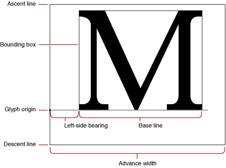

As shown in Figure 2-1, the _bounding box_ of a glyph is the smallest rectangle that entirely encloses the pixels of the glyph. The _glyph origin_ is where QuickDraw begins drawing the glyph. Notice that there is some white space between the glyph origin and the visible beginning of the glyph: this is the _left-side bearing_ of the glyph. The left-side bearing value can be negative, which lessens the spacing between adjacent characters. The _advance width_ is the full horizontal measurement of the glyph as measured from its glyph origin to the glyph origin of the next glyph on the line, including the white space on both sides.

If all of the glyph images in the font were superimposed using a common glyph origin, the smallest rectangle that would enclose the resulting image is the _font rectangle_.

The glyphs of a _fixed-width font_ all have the same advance width. Fixed-width fonts are also know as _monospaced fonts_. In Courier, a fixed-width font, the uppercase “M” has the same width as the lowercase “i”. In a _proportional font_, different glyphs may have different widths, so the uppercase “M” is wider than the lowercase “i”.

Most glyphs in a font appear to sit on the _base line_, an imaginary horizontal line. The _ascent line_ is an imaginary horizontal line chosen by the font’s designer that aligns approximately with the tops of the uppercase letters in the font, because these are the tallest commonly used glyphs in a font. The ascent line is the same distance from the base line for all glyphs in the font. The _descent line_ is an imaginary horizontal line that usually aligns with the bottoms of descenders (the tails on the glyphs such as “p” or “g”), and it is the same distance from the base line for every glyph in the font. The ascent and descent lines are part of the font designer’s recommendations about line spacing as measured from base line to base line. All of these lines are horizontal because Roman text is read from left to right, in a straight horizontal line.

For bitmapped fonts, the ascent line marks the _maximum y-value_ and the descent line marks the _minimum y-value_ used for the font. The y-value is the location on the vertical axis of each indicated line: the minimum y-value is the lowest location on the vertical axis and the maximum y-value is the highest location on the vertical axis. For outline fonts, a font designer can create individual glyphs that extend above the ascent line or below the descent line. The integral sign in Figure 2-2, for example, is much taller than the uppercase “M”. In this case, the maximum y-value is more important than the ascent line for determining the proper line spacing for a line containing both of these glyphs. You can have the Font Manager reduce such oversized glyphs so that they fit between the ascent and descent lines. See [Preserving the Shapes of Glyphs](Managing%20Fonts-%20QuickDraw%20Tasks.md#apple-f4xwc4dqnrsv64tfmyxwi33df52wszbpkridgmbqgaydsobsfvkfamzqgaydamrsgiwueqsdizcesskf) for details.

__Figure 1-2__  The ascent line and maximum y-value

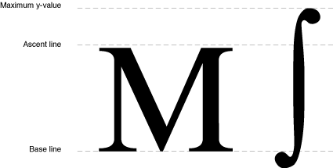

_Font size_ (or point size) indicates the size of a font’s glyphs as measured from the base line of one line of text to the base line of the next line of single-spaced text. In the United States, font size is traditionally measured in _points_, and there are 72.27 traditional points per inch. However, QuickDraw and the PostScript language define 1 point to be 1/72 of an inch, so there are exactly 72 points per inch on the Macintosh.

All bitmaps must fit on the QuickDraw coordinate plane. On a 72-dpi display device, fonts have an upper size limit of 32,767 points.

There is not a strict typographical standard for defining a point size. It is often, but not always, the sum of the ascent, descent, and leading values for a font. Point size is used by a font designer to indicate the size of a font relative to other fonts in the same family. Glyphs from fonts with the same point size are not necessarily of the same height. This means that a 12-point font can exceed the measurement of 12 points from the base line of one line of text to the base line of the next.

_Leading_ (pronounced “LED-ing”) is the amount of blank vertical space between the descent line of one line of text drawn using a font and the ascent line of the next line of single-spaced text drawn in the same font. The Font Manager returns the font’s suggested leading, which is in pixels, in the `FontMetrics` function for both outline and bitmapped fonts. QuickDraw returns similar information in the `GetFontInfo` function. Although the designer specifies a recommended leading value for each font, you can always change that value if you need more or less space between the lines of text in your application. The _line spacing_ for a font can be calculated by adding the value of the leading to the distance from the ascent line to the descent line of a single line of text.

Although each glyph has a specific advance width and left-side bearing measurement assigned to it, you can change the amount of white space that appears between glyphs. _Kerning_ is the process of drawing part of a glyph so that is overlaps another glyph. The period in the top portion of Figure 2-3 stands apart from the uppercase “Y”. In the bottom portion of the figure, the word and the period have been kerned: the period has been moved under the right arm of the “Y” and the glyphs of the word are closer. Kerning data (the distances by which pairs of specified glyphs should be moved closer together) is stored in the kerning tables of the different font resources.

__Figure 1-3__  Unkerned text (top) and kerned text (bottom)

This section describes how TrueType outline fonts are rendered by a font rendering engine. Although PostScript fonts are rendered using different mathematical algorithms, the two rendering methods are similar in that both use mathematical equations to estimate contours. For information on PostScript font rendering, see the _PostScript Language Reference Manual_ by Adobe Systems, Inc., available through Addison-Wesley Publishing Company.

TrueType outline fonts are stored in an outline font (`'sfnt'`) resource as a collection of outline points. (Do not confuse these outline points with the points that determine point size, or the `Point` data type, which specifies a location in the QuickDraw coordinate plane.) A font rendering engine calculates lines and curves between the points, sets the bits that make the bitmap, and then sends the bitmap to QuickDraw for display.

There are two types of outline points: _on-curve points_ define the endpoints of lines and _off-curve points_ determine the curvature of the line between the on-curve points. Two consecutive on-curve points define a straight line. To draw a curve, the font rendering engine needs a third point that is off the curve and between the two on-curve points.

A font rendering engine uses this parametric Bézier equation to draw the curves of the glyph from an outline font:

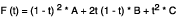

where t ranges between 0 and 1 as the curve moves from point A to point C. A and C are on-curve points; B s an off-curve point.

Figure 2-4 shows two Bézier curves. The positions of on-curve points A and C remain constant, while off-curve point B shifts. The curve changes in relation to the position of point B.

__Figure 1-4__  The effect of an off-curve point on two Bézier curves

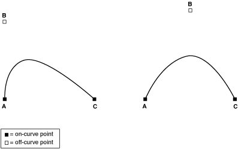

A font designer can use any number of outline points to create a glyph outline. These points must be numbered consecutively along the contours of the glyph, because a font rendering engine draws lines on curves sequentially. This process produces a glyph such as the lower case “b” in Figure 2-5.

__Figure 1-5__  An outline with points on and off the curve

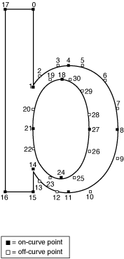

There are several groups of points in Figure 2-5 that include two consecutive off-curve points. For instance, points 2 and 3 are both off-curve. In this case, the font rendering engine interpolates an on-curve point midway between the two off-curve points, thereby defining two Bézier curves, as shown in Figure 2-6. Note that this additional on-curve point is used for creation of the glyph only; the font rendering engine does not alter the outline font resource’s list of points.

__Figure 1-6__  A curve with consecutive off-curve points

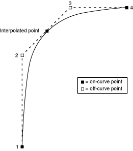

When the font rendering engine has finished drawing a closed loop, it has completed one contour of the outline. The font designer groups the points in the outline font resource into contours. In Figure 2-5, the font rendering engine draws the first contour in the glyph from point 0 to point 17, and the second contour from point 18 to the end, creating the glyph in Figure 2-7.

__Figure 1-7__  A glyph from an outline font

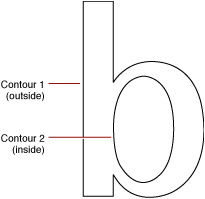

At this stage the glyph does not have a fixed point size. Remember that point size is measured as the distance from the base line of one line of text to the base line of the next line of single-spaced text. The font rendering engine has the measurements of the outline relative to the base line and ascent line, so it can correlate the measurements with the requested point size and calculate how large the outline should be for that point size.

The font rendering engine uses the contours to determine the boundaries of the bitmap for this glyph when it is displayed. For example, the Macintosh computer’s screen is a grid made of pixels. The font rendering engine fits the glyph, scaled for the correct size, to this grid. If the center of one section of this grid (comparable to a pixel or a printer dot) falls on a contour or within two contours, the font rendering engine sets the bit for the bitmap.

Because there are two contours for the glyph in Figure 2-7 the font rendering engine begins with pixels at the boundary marked by contour 1 and stops when it gets to contour 2. Some glyphs need only one contour, such as the uppercase “I” in some fonts. Others, such as the Å glyph, have three or more contours.

If the pixels (or dots) are tiny in proportion to the outline (when resolution is high or the point size of the glyph is large), they fill out the outline smoothly, and any pixels that jut out from the contours are not noticeable. If the display device has a low resolution or the point size is small, the pixels are large in relation to the outline. You can see in Figure 2-8 that the outline has produced an unattractive bitmap. There are gaps and blocky areas that would not be found in the high-resolution version of the same glyph.

__Figure 1-8__  An unmodified glyph from an outline font at a small point size

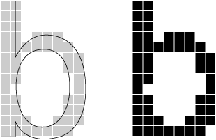

Because the size of the pixels or dots used by the display device cannot change, the outline should adapt in order to produce a better bitmap. To achieve this end, font designers include instructions in the outline font resources that indicate how to change the shape of the outline under various conditions, such as low resolution or small point size. The lowercase “b” outline in Figure 2-9 is the same one depicted in Figure 2-8, except that the font rendering engine has applied the instructions to the figure and produces a better bitmapped glyph. These instructions are equivalent to “move these points here” or “change the angle formed by these points.” A font designer includes programs consisting of these instructions in certain outline font resource tables, where the font rendering engine finds them and executes them under specified conditions. Most applications do not need to use instructions; however, if you want to know more about them, see the _TrueType Font Format Specification_ (available through [http://developer.apple.com/fonts/](https://developer.apple.com/fonts/)).

In the case of the Mac OS, once the Font Manager has produced the outline according to the design and instructions, it creates a bitmap and sends the bitmap to QuickDraw, which draws it on the screen. The Font Manager then saves the bitmapped glyph in memory (caches it) and uses it the next time the user requests this glyph in this font at this point size.

__Figure 1-9__  An instructed glyph from an outline font

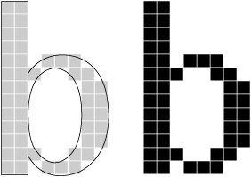

Prior to the release of Mac OS 8.5, the Font Manager supported only bitmapped fonts and TrueType outline fonts whose data were stored only in the resource fork. With the release of Mac OS 8.5, Apple began to provide support for TrueType and OpenType fonts that are stored in data–fork files. As a result, you can use the Font Manager to access both resource–fork and data–fork fonts. There are many new Font Manager functions you can use to assure your application supports both kinds of fonts.

There are currently two types of data–fork fonts: TrueType and OpenType. TrueType data–fork fonts originated on the Windows platform. These fonts store data in an `'sfnt'` structure in a file with the extension `.TTF`. In the past, to use these fonts in the Mac OS, a user would first have to use a utility to convert the font as a resource-based suitcase. Starting with Mac OS 8.5, this is no longer necessary.

TrueType collections, or `.TTC` files, contain several `'sfnt'` font structures organized with a simple directory scheme. This organization allows the individual fonts to share complete tables among each other. Until now, these fonts have also not been usable on the Macintosh. TrueType collections have the file type `'ttcf'`.

OpenType represents new naming and packaging for fonts. Adobe, in conjunction with Microsoft, have defined a data–fork-based, `'sfnt'` structured font file to contain PostScript font data. The `'sfnt'` structure is in a file with the extension `.OTF`. The glyph data itself is stored in a new format called CFF, or Compact Font Format. The structure was designed such that these fonts behave the same as TrueType fonts on the Windows platform. These fonts are also designed to work in the Mac OS.

An OpenType font file contains data, in table format, that comprises either a TrueType or a PostScript outline font. Rasterizers use combinations of data from the tables contained in the font to render the TrueType or PostScript glyph outlines. Some of this supporting data is used no matter which outline format is used; some of the supporting data is specific to either TrueType or PostScript.

The Finder in Mac OS 8.5 was enhanced to support identification and autorouting of data–fork font files. Individual font files (`.TTF` and `.OTF`) and collection files (`.TTC`). are assigned file types `'sfnt'` and `'ttcf'`, respectively, by Internet Config when the fonts are first brought onto the system. When dropped into the System Folder, the Finder assigns appropriate icons to the files and automatically routes them to the Fonts folder.

Currently, there is no support for double-clicking a data–fork font file. They behave most like the individual TrueType files (as opposed to suitcases) and as such, they cannot be renamed or opened.

The Font Manager takes care of the details of how fonts are stored in resources, reading the resource fields when required and building _internal representations_ of the data stored in them.

There are three types of resources associated with resource–fork fonts:

- Bitmapped font (`'NFNT'`) resources describe bitmapped fonts. These bitmapped font resources have an identical structure to the earlier `'FONT'` resources, which they replace, but the bitmapped font resources add a more flexible numbering scheme.
- Outline font (`'sfnt'`) resources describe outline fonts.
- Font family (`'FOND'`) resources describe font families, including information such as which fonts are included in the family and the recommended width for a glyph at a given point size.

There are a variety of font file formats you should be aware of when working with the Font Manager. The font file formats can have different implications for how the fonts are enumerated and font data is accessed in Mac OS X versus in Mac OS 8 and 9. The most important file formats include the following:

- Suitcase. There are resource–fork and data–fork suitcases. If you want to use a suitcase in Mac OS 9, you should package it as a traditional resource–fork suitcase. Data–fork suitcases (`.dfont`) are supported only in Mac OS X.
- Multiple-file resource-based PostScript fonts. Outline data is stored in a separate file from the font suitcase. Mac OS 8 and 9 supports plain and Multiple Master LWFN-class fonts. (CID fonts not packaged in an `'sfnt'` structure, that is, “naked” CID and OCF are not currently supported in Mac OS X.)
- Data–fork fonts. These are fonts that consist of a single data–fork file that contains `'sfnt'` font data structures. Typically, there is only one `'sfnt'` per file, as with OpenType and Windows TrueType fonts, but there may be more, in which case you would have a TrueType collection file. There is no suitcase associated with the font, so there is no `'FOND'` resource or associated bitmapped fonts. This means that in Mac OS 9 (with or without CarbonLib) these fonts do not belong to any font family and cannot be used with the Font Manger and QuickDraw. (See `[“Compatibility Issues”](#apple-f4xwc4dqnrsv64tfmyxwi33df52wszbpkridgmbqgaydsobsfvkfamzqgaydamrsgewueqkkijfesqkj)` for information on associating a `FOND` resource with a data–fork font.) In Mac OS X, the system synthesizes font family information to allow the fonts to be accessible to the entire system.

The font family ID and font ID have been replaced by the font family reference and font reference.

A _font family reference_ (`FMFontFamily`) represents a collection of fonts with the same design characteristics. It replaces the standard QuickDraw font identifier and may be used with all QuickDraw functions, including `GetFontName` and `TextFont`. A font family reference does not imply a particular _script system_, nor is the character encoding of a font family determined by an arithmetic mapping of its value.

A _font family_ is a collection of fonts, each of which is identified by a _font reference_ (`FMFont`) that maps to a single _font object_ registered with the font database.

Each font object maps to one or more combinations of a font family reference and a standard QuickDraw style. This is roughly equivalent to the information stored in the font association table of the `'FOND'` resource handle, with the exception of a descriptor for point size. Since each font object represents the entire array of point sizes for a given font, a font family reference and style together fully specify any given font object. A _font family instance_ (`FMFontFamilyInstance`) is a data structure that contains a font family reference, font style, and font size.

The system software always maps the _system font_ to `sysFont` and the _application font_ to `applFont`. The system software uses the system font for drawing items such as system menus and system dialogs. The application font is the font that your application uses for text unless specified otherwise by you or the user. The fonts assigned as the system and application fonts depend on the Appearance Manager settings as well as the Script Manager variables `smScriptSysFond`, `smScriptAppFond`, `smScriptSysFondSize`, and `smScriptAppFondSize`.

You should read this section only if you need to parse a font association table for a `'FOND'`resource.

The Font Manager cannot make use of any font for which there is no `'FOND'` resource, as that resource forms the basis for accessing and processing fonts. Data–fork fonts do not have a `'FOND'` resource and so are not usable as is by the Font Manager in Mac OS 8 and 9 or the Classic environment, but they are usable in Mac OS X. It is not possible right now for the Font Manager to synthesize a `'FOND`' resource, but there is a work-around the Font Manager uses to connect a `'FOND'` resource to a data fork. It involves the creation of an `'afnt'`, or font alias, resource.

The Font Manager uses the `'FOND'` font association table to choose from among the available bitmap sizes in a font, or to elect to use an outline font. Each entry in the font association table contains a size field to indicate the bitmap size, with the special value of zero denoting an outline font (`'sfnt'` resource). The Font Manager uses the entry's resource ID to access the appropriate type of resource using the Resource Manager.

Starting with Mac OS 8.5, Apple defined the size (-1) to indicate that an outline font is stored in a data fork. The font association table entry’s resource ID is `'afnt'`. An `'afnt'`resource is simply an alias record that has the structure shown in Figure 2-10. For more information on alias records, see the _[Alias Manager Reference](https://developer.apple.com/documentation/coreservices/carbon_core/alias_manager)_ in Carbon File Management Documentation.

__Figure 1-10__  An alias record

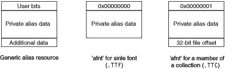

Apple currently reserves all of the user bits and has defined the least significant:

1. A value of all zeros for the user bits indicates a simple, single–font data fork. The alias data can be passed to the Alias Manager for resolution. The target font is then expected to begin at offset zero in the file.
2. If the least significant byte of the user bit word is 1, then an offset into the data–fork file is present following the private alias data in the resource. This is used for targeting a member of a TrueType collection file. Thus, an `'afnt'` resource targets a single font.

Starting with Mac OS 9, a font management utility can activate data for fonts by simply making a `'FOND'` and associated `'afnt'` resources visible to the Font Manager. The data for files themselves can reside outside the Fonts folder. When creating the alias that goes in the `'afnt'` resource, do not make a “minimal” alias. Ideally, the alias should be relative to the temporary file (or the suitcase file, if a suitcase is created). Keeping the data–fork file out of the Fonts folder is efficient since the system opens the data–fork file only when needed. Although you can reference data forks on network volumes, it is not recommended because the network connection could close unexpectedly in midstream. Data–fork files can also be stored on and accessed from CDs.

The Font Manager works in conjunction with QuickDraw. QuickDraw treats the glyphs that make up text as small images that make up a larger, coherent image. It uses size information, such as height and width, the same way it users similar information when arranging an image that does not contain text. The Font Manager, by contrast, keeps track of detailed font information such as the glyphs’ character codes, whether fonts are fixed-width or proportional, and which fonts are related to each other by name. When QuickDraw draws text in a particular font, it sends a request for that font to the Font Manager. The Font Manager finds the font or the closest match to it that is available, and provides QuickDraw with the necessary information to lay out text and implement the appropriate stylistic variations.

When your application calls a QuickDraw function, QuickDraw gets information from the Font Manager about the font specified in the current graphics port and the individual glyphs of that font. The Font Manager performs any necessary calculations and returns the requested information to QuickDraw.

QuickDraw makes its request for font information using a font input structure. This structure contains the font family reference, the size, the style, and the scaling factors of the font request.

QuickDraw makes a font request by filling in a font input structure (`FMInput`) and calling the function `FMSwapFont`. If your application needs to make a font request in the same way that QuickDraw does, you can call `FMSwapFont`. The `FMSwapFont` function has been optimized to return as quickly as possible if the request is for a recently requested font. Building the global width tables, which is described in `[“How the Font Manager Calculates Glyph Widths”](#apple-f4xwc4dqnrsv64tfmyxwi33df52wszbpkridgmbqgaydsobsfvkfamzqgaydamrsgewueqkkijbegqke)`, is one of the more time-consuming tasks in this process, which is why the Font Manager maintains a cache of width tables.

The Font Manager looks for the font family of the requested font and from that determines information about which font it can use to meet the request.

The Font Manager returns information to QuickDraw in a font output structure (`FMOutput`). This structure contains a handle to the font resource that the `FMInput` structure requested, information on how different stylistic variations affect the display of the font’s glyphs, and the scaling factors.

When the Font Manager gets a request for a font in a font input structure, it attempts to find a font family resource for the requested font family. If the font family resource is available, the Font Manager looks in the font family resource for the font family reference of the appropriate font resource to match the request. If a font family resource is not available, the Font Manager takes additional steps until it finds a suitable substitute.

When responding to a font request, the Font Manager first looks for a font family resource of the specified size. It then looks for the stylistic variation that was requested. It does this by assigning weights to the various styles and then choosing the font whose style weight most closely matches the weight of the requested style.

If the Font Manager cannot find the exact font style that QuickDraw has requested, it uses the closest font style that it does find for that font and QuickDraw then applies the correct style to that font. For example, if an italic version of the requested font cannot be found, the Font Manager returns the plain version of the font and QuickDraw slants the characters as it draws them. The _QuickDraw styles_ include the values`bold`, `italic`, `underline`, `outline`, `shadow`, `condense`, and `extend`.

With the additional complication of having both bitmapped and outline fonts available, this process can sometimes produce results other than those that you expect. The Font Manager can be set to favor either outline or bitmapped fonts when both are available to meet a request. (For information on how to do this, see [Favoring Outline or Bitmapped Fonts](Managing%20Fonts-%20QuickDraw%20Tasks.md#apple-f4xwc4dqnrsv64tfmyxwi33df52wszbpkridgmbqgaydsobsfvkfamzqgaydamrsgiwueqsdjbduqr2c)). The following scenario is one example of how the font that is selected can be a surprise:

1. You have specified that bitmapped fonts are to be preferred over outline fonts when both are available in a specific size.
2. The system software on which your application is running has the bitmap font Times 12 and the outline fonts Times, Times Italic, and Times Bold.
3. The user requests Times Bold 12.
4. The Font Manager chooses the bitmapped version of Times 12 and QuickDraw algorithmically smears it to create the bold effect.

There is not much that you can do about such situations except to be aware that setting the Font Manager to prefer one kind of font over another has implications beyond what you might expect.

_Font scaling_ is the process of changing a glyph from one size or shape to another. The Font Manager and QuickDraw can scale bitmapped and outline fonts in three ways: changing a glyph’s point size, modifying the glyph (but not its point size) for display on a different device, and altering the shape of the glyph.

For bitmapped fonts, the Font Manager does not actually perform scaling of the glyph bitmaps. Instead the Font Manager finds an appropriate font and computes the horizontal and vertical scaling factors that QuickDraw must apply to scale the bitmaps. QuickDraw performs all modifications of bitmapped glyph fonts.

The simplest form of scaling occurs when the Font Manager returns scaling factors for QuickDraw to change a glyph from one point size to another on the same display device. If the glyph is bitmapped and the requested font size is not available, there are certain rules the Font Manager follows to create a new bitmapped glyph from an existing one (see `[“The Scaling Process for a Bitmapped Font”](#apple-f4xwc4dqnrsv64tfmyxwi33df52wszbpkridgmbqgaydsobsfvkfamzqgaydamrsgewueqkkijbumssc)`). If the glyph is from an outline font, the Font Manager uses the outline for that glyph to create a bitmap (see `[“The Scaling Process for an Outline Font”](#apple-f4xwc4dqnrsv64tfmyxwi33df52wszbpkridgmbqgaydsobsfvkfamzqgaydamrsgewueqkkinfeor2f)`).

Figure 2-11 shows how the Font Manager and QuickDraw scale a bitmapped font and an outline font from 9 points to 40 points for screen display. The sizes of the bitmapped fonts available to the Font Manager to create all 32 sizes were 9, 10, 12, 14, 18, and 24.

__Figure 1-11__  A comparison of scaled bitmapped and outline fonts

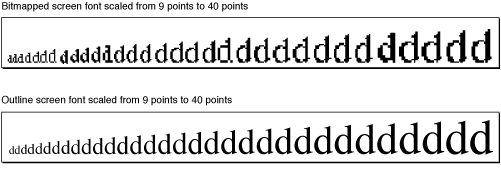

The Font Manager produces better results by scaling glyphs from outline fonts, because it changes the font’s original outline to the new size or shape, and then creates the bitmap. Outlines give better results than bitmaps when scaled, because the outlines are intended for use at all point sizes, whereas bitmaps are not.

The Font Manager also determines that a glyph must be scaled when moving it from one device to another device with a different resolution: for instance, from the screen to a printer. A bitmap that is 72 pixels high on a 72-dpi screen measures one inch, but on a 144-dpi printer it measures a half inch. In order to print a figure the same size as the original screen bitmap, QuickDraw needs a bitmap twice the size of the original. If there are no bitmaps available in twice the point size of the bitmap that appears on the screen, the Font Manager returns the proper scaling factors, and QuickDraw scales the original bitmap to twice its original size in order to draw it on the printer.

With some QuickDraw calls, your application can also use the Font Manager to explicitly scale a glyph by stretching or shrinking it. For example, you can use the Font Manager to scale a glyph that is normally 12 points to one that is 12 points high but stretched to the width of the entire page of text. Your application tells the Font Manager how to scale a glyph using _font scaling factors_, which are represented as proportions or fractions that indicate how the Font Manager should scale the glyph in the vertical and horizontal directions. The ratio given by the font scaling factors determines whether the glyph grows or shrinks. If the ratio is greater than one, the glyph increases in size, and if it is less than one, the glyph decreases in size. If the font scaling factors are 1-to-1 for both horizontal and vertical scaling, the glyph does not change size.

In some circumstances, the Font Manager finds a font and returns different scaling factors to QuickDraw. The scaling factors in a QuickDraw font request tell the Font Manager how much QuickDraw wants to scale the font, and the scaling factors returned by the Font Manager tell QuickDraw how much to actually scale the glyphs before drawing them.

In Figure 2-12, the font scaling factors are 2/1 in the horizontal direction and 1/1 in the vertical direction. The glyph stays the same height, but grows twice as large in width.

__Figure 1-12__  A glyph stretched horizontally

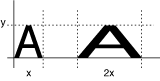

In Figure 2-13, the font scaling factors are 2/1 in the vertical direction and 1/1 in the horizontal direction. The glyph stays the same width, but grows to twice its original height.

__Figure 1-13__  A glyph stretched vertically

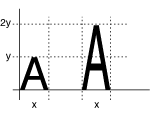

In Figure 2-14, the scaling factors are 1/1 in the vertical direction and 1/2 in the horizontal direction. The glyph stays the same height but retains only half its width.

__Figure 1-14__  A glyph condensed horizontally

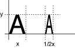

If the font scaling factors are 2/1 in both directions and the font is an outline font, then the Font Manager computes the size of the glyph as twice the specified size and QuickDraw draws the glyph. With bitmapped fonts, QuickDraw first looks for a bitmap at twice the size of the original before redrawing the glyph at the new point size.

Although the Font Manager does not scale the glyph bitmaps of a bitmapped font, it does compute the scaling factors that QuickDraw uses to perform the scaling. The Font Manager computes scaling factors other than 1/1 when the exact point size requested is not available. Font scaling is the default behavior; however you can disable it, as described below. When the Font Manager cannot find the proper bitmapped font that QuickDraw has requested and font scaling is enabled, it uses the following procedure:

1. The Font Manager looks for a font of the same font family that is twice the size of the font requested. If it finds that font, the Font Manager computes and returns to QuickDraw factors to scale it down to the requested size.
2. The Font Manager looks for a font of the same font family that is half the size of the font requested. If it finds that font, the Font Manager computes and returns to QuickDraw factors to scale it up to the requested size.
3. The Font Manager looks for a font of the same font family that is the next larger size of the font requested. If it finds that font, the Font Manager computes and returns to QuickDraw factors to scale it down to the requested size.
4. The Font Manager looks for a font of the same font family that is the next smaller size of the font requested. If it finds that font, the Font Manager computes and returns to QuickDraw factors to scale it down to the requested size.
5. If the Font Manager cannot find any size of that font family, it returns the application font, system font, or a substitute font, as described in `[“How the Font Manager Responds to a Font Request”](#apple-f4xwc4dqnrsv64tfmyxwi33df52wszbpkridgmbqgaydsobsfvkfamzqgaydamrsgewueqkkizeesqsf)`. The Font Manager computes and returns to QuickDraw the factors to scale that font to the requested size.

You can disable the scaling of bitmapped fonts in your applications by calling the function `SetFScaleDisable`. When the Font Manager cannot find the proper bitmapped font that QuickDraw has requested and font scaling is disabled, the Font Manager looks for a different font to substitute instead of scaling.

With scaling disabled, the Font Manager looks for a font with characters with the correct width, which may mean that their height is smaller than the requested size. The Font Manger returns this font and returns the scaling factors of 1/1, so that QuickDraw does not scale the bitmaps. QuickDraw draws the smaller font, the widths of which produce the spacing of the requested font. This is faster than font scaling and accurately mirrors the word spacing and line breaks that the document will have when printed, especially if fractional character widths are used. Disabling and enabling of font scaling are described in [Using Fractional Glyph Widths and Font Scaling](Managing%20Fonts-%20QuickDraw%20Tasks.md#apple-f4xwc4dqnrsv64tfmyxwi33df52wszbpkridgmbqgaydsobsfvkfamzqgaydamrsgiwueqsdjjbuqqsc).

The Font Manager always scales an outline font in order to produce a bitmapped glyph in the requested size, regardless of whether font scaling for bitmapped fonts is enabled or disabled. An outline font is considered to be the model for all possible point sizes, so the Font Manager is not scaling it from one “real” size to a “created” size, the way it does for a bitmapped font. It is drawing the outline in the requested point size, so that it can then create the bitmapped glyph.

Integer glyph widths are measurements of a glyph’s width that are in whole pixels. Fractional glyph widths are measurements that can include fractions of a pixel. For instance, instead of a glyph measuring exactly 5 pixels across, it may be 5.5 pixels across. Fractional glyph widths allow the sizes of glyphs as stored by the Font Manager to be closer in proportion to the original glyphs of the font than integer widths allow. Fractional widths also make it possible for high-resolution printers to print with better spacing.

You can enable or disable the use of fractional glyph widths in your application, as described in [Using Fractional Glyph Widths and Font Scaling](Managing%20Fonts-%20QuickDraw%20Tasks.md#apple-f4xwc4dqnrsv64tfmyxwi33df52wszbpkridgmbqgaydsobsfvkfamzqgaydamrsgiwueqsdjjbuqqsc). As a default, fractional widths are disabled to retain compatibility with older applications.

When using fractional glyph widths, the Font Manager stores the locations of glyphs more accurately than any actual screen can display. Since screen glyphs are made up of whole pixels, QuickDraw cannot draw a glyph that is 5.5 pixels wide. The placement of glyphs on the screen matches the eventual placement of glyphs on a page printed by the high-resolution printer more closely, but the spacing between glyphs and words is uneven as QuickDraw rounds off the fractional parts. The extent of the distortion that is visible on the screen depends on the font point size relative to the resolution of the screen.

The Font Manager communicates fractional glyph widths to QuickDraw through the _global width table_, a data structure that is allocated by the system. The Font Manager fills in this table by accessing data from one of several places:

- Integer glyph widths are taken from the width/offset table of the bitmapped font resource and the horizontal device metrics table of the outline font resource.
- Fractional glyph widths are taken from the glyph-width table in the bitmapped font resource, the horizontal metrics table in the outline font resources, and the family glyph-width table in the font family resource.

The Font Manager looks for width data in the following sequence:

1. For a bitmapped font, it first looks for a font glyph-width table in the font data structure, which is the record used to represent in memory the data in a bitmapped font resource. For an outline font, it first looks for data in the horizontal metrics table. The width table for bitmapped fonts is described in the section “The Bitmapped Font ('NFNT') Resource” while the width table for outline fonts is described in “The Horizontal Device Metrics Table.” Both sections are in _Inside Macintosh: Text_ located on the Apple developer documentation website.
2. It the Font Manger does not find this table, it looks in the font family data structure for a family glyph-width table. The font family record is used to represent in memory the data in a font family resource. This is described in “The Family Glyph-Width Table” in _Inside Macintosh: Text_ located on the Apple developer documentation website.
3. If the Font Manager does not find a family glyph-width table, it derives the global character widths from the integer width contained in the width/offset table in the bitmapped font record as described in “The Bitmapped Font ('NFNT') Resource” in _Inside Macintosh: Text_ located on the Apple developer documentation website.s

To use fractional glyph widths effectively, your application must get accurate widths when laying out text. Your application should obtain glyph widths either from the QuickDraw function `MeasureText` or by looking in the global width table. You can get a handle to the global width table by calling the function `FontMetrics`.

The Font Manager uses a database to keep track of available fonts and provides a simple mechanism to track changes to the font database. Any operation that adds, deletes, or modifies one or more font family or font objects triggers an update of a global generation count. Each font family and font object modified during a transaction is tagged with a copy of the generation count.

You can use Font Manager accessor functions (`FMGetGeneration`, `FMGetFontGeneration`, `FMGetFontFamilyGeneration`) to get the current value of the generation count and the generation tag associated with a font family and font object. Then, you can use these values along with Font Manager enumeration functions to identify the changes in the database.

[Next](Managing%20Fonts-%20QuickDraw%20Tasks.md)[Previous](Introduction%20to%20Managing%20Fonts-%20QuickDraw.md)

