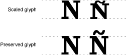

> 导航：[总目录](../../../README.md) · [documentation](../../../_indexes/documentation.md) · [Managing Fonts: QuickDraw](Introduction%20to%20Managing%20Fonts-%20QuickDraw.md)


[Next](Document%20Revision%20History.md)[Previous](Managing%20Fonts-%20QuickDraw%20Concepts.md)

# Managing Fonts: QuickDraw Tasks

This chapter provides instructions and code samples for the most common tasks you can accomplish with the Font Manager such as enumerating fonts, getting font display information, and handling the standard Font menu. It also provides information on making existing applications Carbon-compliant.

Several sections show examples of code that is no longer supported under Carbon and equivalent implementations that use Carbon-compliant font access and data management functions. In particular, see [Enumerating Font Families and Fonts](#apple-f4xwc4dqnrsv64tfmyxwi33df52wszbpkridgmbqgaydsobsfvkfamzqgaydamrsgiwueq2jjjcuircb) and [Handling the Standard Font Menu](#apple-f4xwc4dqnrsv64tfmyxwi33df52wszbpkridgmbqgaydsobsfvkfamzqgaydamrsgiwueqkkjbbuqrci).

The code samples assume you are developing your application in Mac OS using CarbonLib. All code samples are in C.

- [Initializing the Font Manager](#apple-f4xwc4dqnrsv64tfmyxwi33df52wszbpkridgmbqgaydsobsfvkfamzqgaydamrsgiwueqsdinbuorkj)
- [Accessing Font Data](#apple-f4xwc4dqnrsv64tfmyxwi33df52wszbpkridgmbqgaydsobsfvkfamzqgaydamrsgiwueqsdjbdeqr2e)
- [Enumerating Font Families and Fonts](#apple-f4xwc4dqnrsv64tfmyxwi33df52wszbpkridgmbqgaydsobsfvkfamzqgaydamrsgiwueq2jjjcuircb)
- [Converting Between Font and Font Family Data](#apple-f4xwc4dqnrsv64tfmyxwi33df52wszbpkridgmbqgaydsobsfvkfamzqgaydamrsgiwueq2jinbeerch)
- [Handling the Standard Font Menu](#apple-f4xwc4dqnrsv64tfmyxwi33df52wszbpkridgmbqgaydsobsfvkfamzqgaydamrsgiwueqkkjbbuqrci)
- [Adding Font Sizes to the Menu](#apple-f4xwc4dqnrsv64tfmyxwi33df52wszbpkridgmbqgaydsobsfvkfamzqgaydamrsgiwueqsdjfcekskf)
- [Activating and Deactivating Fonts](#apple-f4xwc4dqnrsv64tfmyxwi33df52wszbpkridgmbqgaydsobsfvkfamzqgaydamrsgiwueqsdjffeorcf)
- [Storing a Font Name in a Document](#apple-f4xwc4dqnrsv64tfmyxwi33df52wszbpkridgmbqgaydsobsfvkfamzqgaydamrsgiwueqsdjfeeqq2k)
- [Getting Font Measurement Information](#apple-f4xwc4dqnrsv64tfmyxwi33df52wszbpkridgmbqgaydsobsfvkfamzqgaydamrsgiwueqsdireuusse)
- [Favoring Outline or Bitmapped Fonts](#apple-f4xwc4dqnrsv64tfmyxwi33df52wszbpkridgmbqgaydsobsfvkfamzqgaydamrsgiwueqsdjbduqr2c)
- [Preserving the Shapes of Glyphs](#apple-f4xwc4dqnrsv64tfmyxwi33df52wszbpkridgmbqgaydsobsfvkfamzqgaydamrsgiwueqsdizcesskf)
- [Using Fractional Glyph Widths and Font Scaling](#apple-f4xwc4dqnrsv64tfmyxwi33df52wszbpkridgmbqgaydsobsfvkfamzqgaydamrsgiwueqsdjjbuqqsc)

You do not need to initialize the Font Manager in Carbon. As a result, the function `InitFonts` is not supported in Carbon.

You should no longer use the Resource Manager routines to access the contents of the data stored in the font _suitcase files_ of standard Mac OS resource fork–based fonts, including `'FOND'`, `'FONT'`, `'NFNT'`, `'sfnt'`, and `'typ1'` resources.

To access other font resource data, you should use the function `FMGetFontContainer`. This function gets the location of the file that contains the data. You then pass the file reference or specification to the Resource Manager or File Manager to obtain the information you need. You should not assume that the _resource identifier_ of a font family resource determines the QuickDraw identifier of the font family obtained with `GetResInfo`.

To access the individual `'sfnt'` tables that you need, you should use the function `FMGetFontTable`. This function gets the requested table and copies it into a caller-provided buffer. You may want to first use the function `FMGetFontTableDirectory` to get the `'sfnt'` directory and parse it to determine which tables are available.

There are two categories of iterators available to you: font family iterators and font iterators. A font family iterator enumerates fonts that are associated with a font family. When you enumerate font families, you also use a font family instance iterator to access all instances of a particular font family.

A font iterator enumerates outline fonts without regard to family. You must use a font iterator to enumerate fonts that are not associated with a font family, such as a data–fork font in Mac OS 9. In Mac OS X, every font is a member of at least one font family.

In theory, you can use Font Manager iterators to enumerate all fonts available on the system. In practice, there are a number of issues you need to consider when enumerating fonts and font families.

You cannot use a font iterator to enumerate the bitmapped `'FONT'`/`'NFNT'` font resources traditionally used with QuickDraw-based applications. Instead, you must use a font family instance iterator followed by a font family iterator to obtain each of the outline and bitmapped font resources that comprise the font family. If the font family instance iterator returns an invalid font object, then you can assume the particular style and size for the font family reference is a bitmapped font.

In Mac OS X, the font family iterator and font family instance iterator have been extended to support non–resource–based fonts, such as the Windows TrueType (`'.ttf'`/`'.ttc'`) and OpenType PostScript (`'.otf'`) fonts. Note that in Mac OS 9, you can still gain access to these fonts through a standard font iterator or font object data access function of the Font Manager.

In Mac OS 9 (with or without CarbonLib) data-fork fonts do not belong to any family and the operating system does not synthesize a font family reference, so you cannot enumerate these fonts with a font family iterator.

To enumerate font family data, do the following:

- Set up a filter if you want to restrict iteration to specific criteria. This is optional.
- Create iterators. To access both the font family and individual font data, you need to create a font family iterator and a font instance iterator.
- Get font and font family information.
- Dispose of the iterators.

Listing 3-1 shows a function `MyGetFontInformation` that iterates through the fonts registered with the system. Your application would need to add code that does something with the font information it retrieves. Error-handling code has been omitted to make the sample function more readable. Following this listing is a detailed explanation for each line of code that has a numbered comment.

__Listing 2-1__  Getting font family and font instance information


```
void MyGetFontInformation (WindowRef window, FMGeneration myGeneration)
{
     FMFontFamilyIterator                   myFontFamilyIterator;
     FMFontFamily                           myFontFamily;
     OSStatus                               status1 = 0;
     OSStatus                               status2 = 0;
     FMFontFamilyInstanceIterator           myInstanceIterator;
     FMFont                                 myFont;
     FMFontStyle                            myStyle;
     FMFontSize                             mySize;
     Str255                                 myFontString;
     FMFilter                               myFilter;

     myFilter.format = kFMCurrentFilterFormat;// 1
     myFilter.selector = kFMGenerationFilterSelector;// 2
     myFilter.filter.generationFilter = myGeneration;// 3

    FMCreateFontFamilyIterator (&myFilter, NULL, kFMGlobalIterationScope,
                            &myFontFamilyIterator);// 4
    while (status1 == 0)
    {
        status1 = FMGetNextFontFamily (&myFontFamilyIterator,
                                            &myFontFamily);
        // Your code here.// 5

        FMCreateFontFamilyInstanceIterator (myFontFamily,
                                        &myInstanceIterator);// 6
        while (status2 == 0)
            {
                status2 = FMGetNextFontFamilyInstance (&myInstanceIterator,
                                &myFont, &myStyle, &mySize);
                // Your code here.// 7
            }
        status2 = 0;
        FMDisposeFontFamilyInstanceIterator (&myInstanceIterator);  // 8
    }
    FMDisposeFontFamilyIterator (&myFontFamilyIterator);  // 9
}
```

Here’s what the code does:

1. Sets filter options. You can use filter options to restrict the iteration to specified criteria. If you don’t want to restrict iteration, you don’t need to set filter options. Pass `NULL` instead. The current filter format is the only one you can specify right now.
2. Specifies to use a generation filter.
3. Restricts iteration to fonts of a specified generation.
4. Creates a font family iterator. The global scope options specifies to iterate through all fonts registered with the system. Use `kFMLocalIterationScope` to restrict the iteration only to the fonts accessible to your application.
5. Insert code that does something with the font family information. For example, you can get the string associated with the font family by calling the function `FMGetFontFamilyName (myFontFamily, myFontString);`
6. Creates a font family instance iterator.
7. Insert code that does something with the font family instance information.
8. Disposes of the contents of the iterator before creating another the next time through the loop.
9. Disposes of the font family iterator.

If you want to enumerate outline fonts without regard to family, you can use a font iterator. Listing 3-2 shows a `MyGetFontObjects` function that iterates through fonts accessible to your application, and gets font format information for each font. Error-handling code has been omitted to make the sample function more readable. Following this listing is a detailed explanation for each line of code that has a numbered comment.

__Listing 2-2__  Getting information about a font

```
void MyGetFontObjects()
{
    FMFontIterator                  myFontIterator;
    OSStatus                        status = 0;
    FMFont                          myFont;
    FourCharCode                    myFormat;

    status = FMCreateFontIterator (NULL, NULL, kFMLocalIterationScope,
                                &myFontIterator);// 1
    while (status == noErr)
    {
        status = FMGetNextFont (&myFontIterator, &myFont);
        status = FMGetFontFormat (myFont, &myFormat);   // 2
    }
    status = FMDisposeFontIterator (&myFontIterator);// 3
}
```

Here’s what the code does:

1. Creates a font iterator. The first parameter is `NULL` because we are not filtering font information. The second parameter is `NULL` because we are not using a custom filer function. The constant `kFMLocalIterationScope` specifies to apply the iterator only to those fonts accessible to your application. Pass an uninitialized font iterator.
2. Gets the font format. This is one possible thing you could so with the font information. You could replace this line with code that does something else with the font information.
3. Disposes of the contents of the font iterator.

The following source code is an example of how to rewrite a standard QuickDraw enumeration of font families and fonts using the new Font Manger functions. Listing 3-3 is the old resource-based code and Listing 3-4 is the equivalent implementation using the new font access and data management functions. You can compare the old and new code samples to see how you can make your already-existing applications Carbon-compliant. Following each listing is a detailed explanation for each line of code that has a numbered comment.

__Listing 2-3__  Enumerating font families and fonts using resource-based functions

```swift
SInt16  index;
short   savedResFile;

savedResFile = CurResFile();// 1

index = CountResources (kFONDResourceType);// 2

while (index > 0)
    {
        Handle              fontRecHandle;
        Handle              outlineFontHandle;
        AsscEntry           entry;

        fontRecHandle = (FontRecHdl) GetIndResource('FOND', index);
        while (fontRecHandle)
            {
                GetResInfo ((Handle) fontRecHandle, NULL,
                             NULL, rsrcName);// 3

                count = ((FontAssoc*)(*fontRecHandle +
                                sizeof (FamRec)))->numAssoc + 1;// 4
                entry = (AsscEntry*)(*fontRecHandle + sizeof(FamRec) +
                                sizeof(FamRec) + sizeof(FontAssoc));
                while ( count-- > 0 )
                    {
                    if (entry->fontSize == 0)// 5
                        {
                            UseResFile (HomeResFile((Handle)
                                                    fontRecHandle));// 6
                            fontHandle = Get1Resource('sfnt',
                                                entry->fontID);
                            if (fontHandle != NULL)
                                        ...
                        }
                    entry++;// 7
                }
                fontRecHandle = (FontFamilyRecordHdl)
                                    GetNextFOND((Handle) fontRecHandle);
            }
        index--;
    }

UseResFile (savedResFile);// 8
```

Here’s what the code does:

1. Calls the Resource Manager function `CurResFile` to get the file reference number of the current resource file. You need to save the file reference number so you can restore it later.
2. Calls the Resource Manager function `CountResources` to obtain the number of font families. This is the number of iterations you need to do.
3. Calls the Resource Manager function `GetResInfo` to get the font family identifier.
4. Gets the values needed to walk through the font association table.
5. Checks for an outline font. A font size of 0 represents an outline font.
6. Gets the resource ID. An `'sfnt'` resource ID is unique only within the font file.
7. Increments `entry` so we can get the next entry of the font association table.
8. Calls the Resource Manager function `UseResFile` to restore the original resource file.

__Listing 2-4__  Enumerating font families and fonts using Carbon-compliant functions


```

FMFontFamilyIterator            fontFamilyIterator;
FMFontFamilyInstanceIterator    fontFamilyInstanceIterator;
FMFontFamily                    fontFamily;

status = FMCreateFontFamilyInstanceIterator (0,
                            &fontFamilyInstanceIterator);// 1
status = FMCreateFontFamilyIterator (NULL, NULL, kFMLocalIterationScope,
                                        &fontFamilyIterator);// 2

while ( (status = FMGetNextFontFamily (&fontFamilyIterator, &fontFamily))
                                        == noErr)
    {
        FMFont                          font;
        FMFontStyle                     fontStyle;
        FMFontSize                      fontSize;

        status = FMResetFontFamilyInstanceIterator (fontFamily,
                                &fontFamilyInstanceIterator);// 3
        while ( (status =
                FMGetNextFontFamilyInstance(
                        &fontFamilyInstanceIterator, &font,
                             &fontStyle, &fontSize)) == noErr )
        {
                if ( fontSize == 0 )// 4
                    ...
        }
    }

if (status != noErr && status != kFMIterationCompleted) {// 5
    ...
}

FMDisposeFontFamilyIterator (&fontFamilyIterator);// 6
FMDisposeFontFamilyInstanceIterator (&fontFamilyInstanceIterator);
```

Here’s what the code does:

1. Creates a dummy instance iterator to avoid creating and destroying it in the loop.
2. Creates an iterator to enumerate the font families.
3. Points the instance iterator to the current font family.
4. Checks for a font size of 0. A font size of 0 represents an outline font.
5. Checks to see if there is an error as a result of the iteration. You should add your error-handling code after the `if` statement.
6. Disposes of the iterators.

A _font reference_ is an index to a _font object_, which is a specific outline font without regard to font family. A _font family instance_ is a reference to a font family paired with a QuickDraw style. At times it can be useful to find a font family of which a font object is a member, or to find the font that is associated with a font family and style. To accomplish these conversions, you can use the functions `FMGetFontFamilyInstanceFromFont` and `FMGetFontFromFontFamilyInstance`.

These functions are not inverses of each other, because a font object can be a member of more than one font family. This means if you call the function `FMGetFontFromFontFamilyInstance` and then call the function `FMGetFontFamilyInstanceFromFont`, you will not necessarily get the _font family reference_ you supplied when you called `FMGetFontFromFontFamilyInstance`.

The functions in the Resource Manager for creating a standard Font menu continue to work with CarbonLib and Mac OS X for resource–fork–based fonts, but you should use the new functions in the Menu Manager that support all font formats available through the new Carbon-compliant functions. Table 3-1 lists the functions you should use to replace the resource-based functions.

__Table 2-1__  Replacements for resource-based functions

| Instead of | Use this |
| `AppendResMenu` | `CreateStandardFontMenu` |
| `InsertFontResMenu` | `CreateStandardFontMenu` |
| `InsertIntlResMenu` | `CreateStandardFontMenu` |
| `GetMenuItemText` and `GetFNum` | `GetFontFamilyFromMenuSelection` |

The Menu Manager provides your application with a standard user interface for soliciting font choices from the user. To create a menu that displays font names, you should use the Menu Manager function `CreateStandardFontMenu`. The `CreateStandardFontMenu` function adds the names of all font objects in the font database as items in the Font menu. This ensures that any changes to the font database do not affect your application and that the display of items in the Font menu is not dependent on how fonts are stored in system software.

The Menu Manager function `GetFontFamilyFromMenuSelection` finds the font family reference and style from menu identifier and menu item number returned by the function `MenuSelect`. For more information on the functions `CreateStandardFontMenu`, `UpdateStandardFontMenu`, and `GetFontFamilyFromMenuSelection`, see the Menu Manager documentation.

The following source code is an example of how to rewrite a standard event handler for the Font menu using the Font Manager data structures `FMFontFamily` and `FMFontStyle`. Listing 3-5 is the resource -based code and Listing 3-6 is the equivalent implementation using the Font Manger data structures. 

__Listing 2-5__  A standard event handler for the Font menu using resource-based functions


```swift
MenuHandle      menu;
SInt16          menuID;
SInt16          menuItem;
Str255          menuItemText;
...
menuResult = MenuSelect (theEvent->where);
menuID = HiWord (menuResult);
menuItem = LoWord (menuResult);
if ( menuID == kFontMenuResID )
   {
        menu = GetMenuHandle (menuID);
        GetMenuItemText (menu, menuItem, menuItemText);
        if ( status == noErr )
                TextFont (GetFNum (menuItemText));
    }
```

Compare the resource-based code sample in Listing 3-5 with the code sample in Listing 3-6 to see how to make an existing application Carbon-compliant.

__Listing 2-6__  A standard event handler for the Font menu using Carbon-compliant functions


```swift
MenuRef         menu;
MenuID          menuID;
MenuItemIndex   menuItem;
FMFontFamily    fontFamily;
FMFontStyle     style;
...
menuResult = MenuSelect (theEvent->where);
menuID = HiWord (menuResult);
menuItem = LoWord (menuResult);
if ( menuID == kFontMenuResID )
   {
        menu = GetMenuHandle (menuID);
        status = GetFontFamilyFromMenuSelection (menu, menuItem,
                        &fontFamily, &style);
        if ( status == noErr )
            {
                TextFont (fontFamily);
                TextFace (style);
            }
    }
```


When you use the Menu Manager to add font sizes to a menu, make sure that you construct the menu so that it displays appropriate sizes for both bitmapped and outline fonts. Keep the following guidelines in mind:

- Support all possible font sizes. The maximum point size on the QuickDraw coordinate plane is 32,767 points.
- Provide a short list of the most useful font sizes. For the menu that your application uses to display font sizes, you shouldn't predefine a static list of sizes available to the user or allow the default to be every possible font size, because outline fonts can produce thousands of sizes.
- Provide a method of increasing or decreasing the font size by one point at a time. You can add Larger and Smaller commands, which make choosing slightly different sizes for outline fonts easier for the user. Also, the user should be able to choose any possible point size at any time in a simple manner.
- Place a check next to the current size.
- Display available font sizes in outline style. You can determine which bitmapped fonts are available by using the function `RealFont`. `RealFont` returns `TRUE` if the font is available in the requested point size and `FALSE` if it is not. For outline fonts, the `RealFont` function returns `TRUE` for almost any size. The font designer may set a lower limit to the point sizes at which an outline font looks acceptable. If the size requested is smaller than this lower limit, the `RealFont` function returns `FALSE`.

You use the functions `FMActivateFonts` and `FMDeactivateFonts` to activate or deactivate fonts. Fonts are activated and deactivated in groups defined by their representation in the file system as font suitcase files or other font file formats supported by the Font Manager. In order to activate or deactivate fonts, they must be of a format supported by the Font Manager.

By activating and deactivating fonts, you can control which fonts are available to your users. In a publication environment, font control facilitates handling large sets of fonts. It can minimize font mismatch problems or assure users have access to special fonts needed for their work.

Listing 3-7 shows how to activate and deactivate fonts that are in an application bundle. The code assumes the fonts you want to activate are located in the Resources folder in the application bundle. Following the listing is a detailed explanation for each line of code that has a numbered comment.

__Listing 2-7__  Code to activate and deactivate fonts in an application bundle


```
CFBundleRef     myAppBundle = NULL;
CFURLRef        myAppResourcesURL = NULL;
FSRef           myResourceDirRef;
FSSpec          myResourceDirSpec;

myAppBundle = CFBundleGetMainBundle (myAppBundle);// 1

if (NULL != myAppBundle)
{
    myAppResourcesURL = CFBundleCopyResourcesDirectoryURL (myAppBundle);// 2
    if (NULL != myAppResourcesURL)
    {
        (void) CFURLGetFSRef (myAppResourcesURL, &myResourceDirRef);// 3
        status = FSGetCatalogInfo (&myResourceDirRef, kFSCatInfoNone, NULL,
                                    NULL, &myResourceDirSpec, NULL);// 4
        if ( noErr == status )
        {
            status = FMActivateFonts (&myResourceDirSpec, NULL, NULL,
                                kFMLocalActivationContext);// 5
        }
    }
}
// Your code here to obtain the FSSpec.// 6
status = FMDeactivateFonts (&myResourceDirSpec, NULL, NULL,
                                        kFMDefaultOptions);// 7
```

Here’s what the code does:

1. Calls the Core Foundation Bundle Services function `CFBundleGetMainBundle` to obtain the reference for the application bundle.
2. Calls the Core Foundation Bundle Services function `CFBundleCopyResroucesDirectoryURL` to get the URL of the Resources folder located in the application bundle. The fonts should be stored in this bundle. To activate fonts, you need a pointer to the file specification of the file that contains the font data you want to activate. The next few lines of code covert the URL to an `FSSpec`.
3. Calls the Core Foundation URL Services function `CFURLGetFSRef` to get the file system reference (`FSRef`) associated with the URL of the Resources folder.
4. Calls the File Manager function `FSGetCatalogInfo` to get the `FSRef` associated with the `FSSpec`.
5. Calls the Font Manager function to activate the fonts in the local activation context. This provides the current application with access to the fonts, but other applications do not have access to them. If you want to activate fonts so they are available to other applications, use the constant `kFMGlobalActivationContext` instead of `kFMLocalActivationContext`.
6. Before you can deactivate fonts, you need to obtain the `FSSpec`. You can either follow the steps above to obtain the URL and convert it to an `FSSpec`, or you can write your code so that it caches the `FSSpec` or the URL of the Resources folder located in the application bundle.
7. Calls the Font Manager function `FMDeactivateFonts` to deactivate the fonts. You should deactivate locally activated fonts when you no longer need them. If you’ve activated the fonts globally you may want to leave them active.

When presenting a font to a user, you should always refer to a font by name rather than by font family reference. If you have stored the name of the font in the document, you can find its font family reference by calling the function `FMGetFontFamilyFromName`. However, if the font is not present in the system software when the user opens the document, the function `FMGetFontFamilyFromName` returns `kFMInvalidFontFamilyErr`.

Storing a font name is the most reliable method of finding a font, because the name does not change from one computer system to another. If you want to make sure that the version of the font is the same on different computer systems, you can use the FontSync function `FNSFontReferenceMatch` to compare the two fonts. See the FontSync documentation for more information.

If the font versions are different, you should offer users the option of substituting for the font temporarily (until they can find the proper version of the font) or permanently (with another font that is currently available).

You sometimes need to get font measurement information for the current font in the current graphics port. The Font Manager provides two functions for this purpose: `FontMetrics` and `OutlineMetrics`. In addition, you can get font measurement information by calling the QuickDraw function `GetFontInfo`. You can use this information when arranging the glyphs of one font or several fonts on a line or to calculate adjustments needed when font size or style changes.

The function `FontMetrics` can be used on any kind of font, whether bitmapped or outline. It returns the ascent and descent measurements, the width of the largest glyph in the font, and the leading measurements. The `FontMetrics` function returns these measurements in a font metrics structure, which allows fractional widths. (By contrast, the QuickDraw function `GetFontInfo` returns integer widths.) In addition to these four measurements, the font metrics structure includes a handle to the global width table, which in turn contains a handle to the font family resource for the current text font.

Listing 3-8 shows a sample function `MyGetFontMetrics`. The function `FontMetrics` checks font metrics for the font associated with the current graphics port. Following this listing is a detailed explanation for each line of code that has a numbered comment.

__Listing 2-8__  Getting font metrics for the font in the current graphics port


```
void MyGetFontMetrics ()
{
  FMetricRecPtr     myFontMetrics;
  Fixed             myAscentFixed;
  Fixed             myDescentFixed;
  Fixed             myLeadingFixed;
  Fixed             myMaxWidthFixed;

  FontMetrics (&myFontMetrics);// 1
  myAscentFixed   = myFontMetrics.ascent;
  myDescentFixed  = myFontMetrics.descent;
  myLeadingFixed  = myFontMetrics.leading;
  myMaxWidthFixed = myFontMetrics.widMax;
 // Your code here.// 2
}
```

Here’s what the code does:

1. Gets the metrics for the font associated with the graphics port.
2. Insert you code here to do something with the metrics information.

The function `OutlineMetrics` returns measurements for glyphs to be displayed in an outline font. The function returns an error if the font in the current graphics port is any other kind of font. (You can call the function `IsOutline` to find out whether the Font Manager would choose an outline font for the current graphics port.) These measurements include the _maximum y-value_, _minimum y-value_, _advance width_, _left-side bearing_, and _bounding box_.

For a font of a non-Roman script system that uses an associated font, the font measurements reflect combined values from the current font and the associated font. This is to accommodate the script system’s automatic display of Roman characters in the associated font instead of the current font. 

When a document uses a font that is available as both an outline font and a bitmapped font, the Font Manager must choose which kind of font to use. Its default behavior is to use the bitmapped font when your application opens the document. This behavior avoids problems with documents that were created on a computer system on which outline fonts were not available. See [How the Font Manager Responds to a Font Request](Managing%20Fonts-%20QuickDraw%20Concepts.md#apple-f4xwc4dqnrsv64tfmyxwi33df52wszbpkridgmbqgaydsobsfvkfamzqgaydamrsgewueqkkizeesqsf) for more information.

You can change this default behavior by calling the function `SetOutlinePreferred`. If you call `SetOutlinePreferred` with the `outlinePreferred` parameter set to `TRUE`, the Font Manager chooses outline fonts over bitmapped fonts when both are available.

The `GetOutlinePreferred` function returns a `Boolean` value that indicates which kind of font the Font Manager has been set to favor. You should call this function and save the value that it returns with your documents. Then, when the user opens a document in your application, you can call the function `SetOutlinePreferred` with that value to ensure that the same fonts are used.

If only one kind of font is available, the Font Manager chooses that kind of font to use in the document, no matter which kind of font is favored. You can determine whether the font being used in the current graphics port is an outline font by calling the function `IsOutline`.

Most glyphs in an alphabetic font fit between the _ascent line_ and the _descent line_, which roughly mark (respectively) the tops of the lowercase ascenders and the bottoms of the descenders. Bitmapped fonts always fit between the ascent line and descent line. One aim of outline fonts is to provide glyphs that are more accurate renditions of the original typeface design, and there are glyphs in some typefaces that exceed the ascent or descent line (or both). An example of this type of glyph is an uppercase letter with a diacritical mark: “N” with a tilde produces “Ñ”. Many languages use glyphs that extend beyond the ascent line or descent line.

However, these glyphs may disturb the line spacing in a line or a paragraph. The glyph that exceeds the ascent line on one line may cross the descent line of the line above it, where it may overwrite a glyph that has a descender. You can determine whether glyphs from outline fonts exceed the ascent and descent lines by using the function `OutlineMetrics`. `OutlineMetrics` returns the maximum and minimum y-values for whatever glyphs you choose. You can get the values of the ascent and descent lines using the function `FontMetrics`. If a glyph’s maximum or minimum y-value is greater than, respectively, the ascent or descent line, you can opt for one of two paths of action: you can change the way that your application handles line spacing to accommodate the glyph, or you can change the height of the glyph.

The Font Manager’s default behavior is to change the height of the glyph, providing compatibility with bitmapped fonts, which are scaled between the ascent and descent lines. Figure 3-1 shows the difference between an "Ñ" scaled to fit in the same amount of space as an "N" and a preserved "Ñ". The tilde on the preserved "Ñ" clearly exceeds the ascent line.

__Figure 2-1__  The difference between a scaled glyph and a preserved glyph



You can change this default behavior by calling the function `SetPreserveGlyph`. If you call `SetPreserveGlyph` with the `preserveGlyph` parameter set to `TRUE`, the Font Manager preserves the shape of the glyph intended by the font designer.

The function `GetPreserveGlyph` returns a `Boolean` value that indicates whether or not the Font Manager has been set to preserve the shapes of glyphs from outline fonts. You should call this function and save the value that it returns with your documents. Then, when the user opens a document in your application, you can call `SetPreserveGlyph` with that value to ensure that glyphs are scaled appropriately.

Using fractional glyph widths allows the Font Manager to place glyphs on the screen in a manner that closely matches the eventual placement of glyphs on a page printed by high-resolution printers. (See [How the Font Manager Calculates Glyph Widths](Managing%20Fonts-%20QuickDraw%20Concepts.md#apple-f4xwc4dqnrsv64tfmyxwi33df52wszbpkridgmbqgaydsobsfvkfamzqgaydamrsgewueqkkijbegqke)).

You can enable the use of fractional glyph widths with the function `SetFractEnable`. If you set the parameter `fractEnable` to `TRUE`, the Font Manager uses fractional glyph widths.

When a bitmapped font is not available in a specific size, the Font Manager can compute scaling factors for QuickDraw to use to create a bitmap of the requested size. You can set the Font Manager to compute scaling factors for bitmapped fonts by using the function `SetFScaleDisable`. If you set the `fontScaleDisable` parameter of this function to `TRUE`, the Font Manager disables font scaling.

When font scaling is disabled, the Font Manager responds to a request for a font size that is not available by returning a bitmapped font with the requested widths, which may mean that their height is smaller than the requested size. If you set it to `FALSE`, the Font Manager computes scaling factors for bitmapped fonts and QuickDraw scales the glyph bitmaps. The Font Manager always scales an outline font.

For more information fractional glyph widths and font scaling, see the QuickDraw documentation.

[Next](Document%20Revision%20History.md)[Previous](Managing%20Fonts-%20QuickDraw%20Concepts.md)

