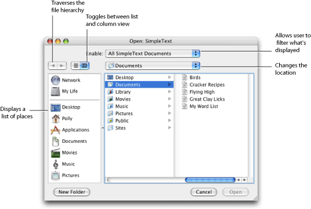
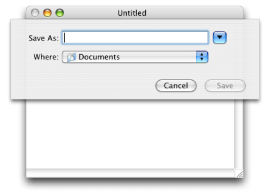
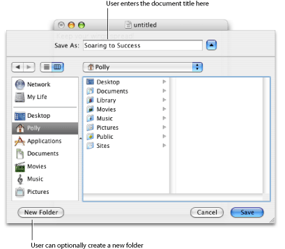
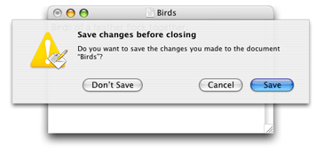
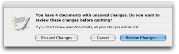

> 导航：[总目录](../../../README.md) · [documentation](../../../_indexes/documentation.md) · [Navigation Services Programming Guide](Introduction%20to%20Navigation%20Services%20Programming%20Guide.md)

[Next](Navigation%20Services%20Tasks.md)[Previous](Introduction%20to%20Navigation%20Services%20Programming%20Guide.md)

# Navigation Services Concepts

Before you start using the Navigation Services API in your application, it’s a good idea to be familiar with the user interface provided by Navigation Services functions and to know how user settings are handled. You also need to have an understanding of the programming model in terms of:

- The tasks you must perform
- The tasks that Navigation Services takes care of for you
- The customization options that are available

After you’ve read through the concepts in this chapter, you’ll be prepared to write code following the instructions and sample code in [Navigation Services Tasks](Navigation%20Services%20Tasks.md#apple-f4xwc4dqnrsv64tfmyxwi33df52wszbpkridgmbqgaytcnbxfvbuqmrqgmwueqkci5eucr2h).

This section describes Navigation Services from the perspective of what the user does. When the user performs any of the following actions, your application can use the Navigation Services API to provide the appropriate dialog to the user:

- Opens a file, folder, or volume
- Saves a new, untitled file
- Saves an existing file under a new name (Save As)
- Closes a file that has unsaved changes
- Quits an application that has one or more files with unsaved changes

When the user chooses Open from the File menu in an application an Open dialog, similar to that shown in Figure 1-1, appears. This dialog allows users to navigate through the file system to a location. The callouts in the figure point to the standard elements—those provided automatically by Navigation Services. The standard elements are:

- Back and forth arrows for traversing the file hierarchy
- A button to toggle between list and column views
- A pop-up menu for changing location
- A sidebar that contains a list of places
- An area that allows users to browse the file system
- The Cancel button
- The Open button, which is dimmed unless an appropriate item is selected; then it becomes the default button

Open dialogs can also optionally have an Enable pop-up menu that allows users to filter what’s shown as active. This particular Open dialog has an Enable menu set to restrict documents to those created by the SimpleText application.

__Figure 1-1__  A full Open dialog

The Open dialog shown in Figure 1-1 is a Choose Object dialog—a user can open one or more files, folders, or volumes. In other words, there aren’t any restrictions placed on what the user can open. Navigation Services has four other dialogs that are used when you want to restrict users to opening just files, or to just a single file, a single folder, or a single volume. These restrictive dialogs display as active only the items that can be opened; other items appeared dimmed and can’t be selected. In addition, the window title changes to indicate what can be opened. For example, a Choose Folder dialog would have the window title Open Folder. Only folders would appear active—files would appear dimmed. See [Create the Dialog](Navigation%20Services%20Tasks.md#apple-f4xwc4dqnrsv64tfmyxwi33df52wszbpkridgmbqgaytcnbxfvbuqmrqgmwuerkji5beir2e) for the functions you use to create each type of dialog.

A user sees a Save dialog when:

- Choosing Save from the File menu for a new document that is untitled
- Choosing Save As from the File menu

In either case, two types of dialogs can appear—a minimal Save dialog and a full Save dialog. The minimal Save dialog, shown in Figure 1-2, is displayed the first time a user saves a document in an application. This dialog provides a text field for the user to enter a filename. Applications can optionally specify a default filename to display. The dialog has a Where pop-up menu that, by default, suggests the Documents folder for the user. The user can open the pop-up menu to choose from locations previously set in the Finder sidebar or a recently-visited location. If none of those locations are acceptable, the user can click the disclosure button to the right of the text field to access the full Save dialog.

__Figure 1-2__  A minimal Save dialog

The full Save dialog, shown in Figure 1-3, contains all of the default elements that appear in the full Open dialog described in [Open Dialogs](#apple-f4xwc4dqnrsv64tfmyxwi33df52wszbpkridgmbqgaytcnbxfvbuqmrqgiwugsceivcegqse). It also contains a Save As field for the user to enter a filename. Note that Save dialogs, except in rare cases, should be sheets.

__Figure 1-3__  A full Save dialog

Close dialogs remind users that the document (or documents) they are about to close has unsaved changes and provide an option for the user to save changes. There are several varieties of the Close dialog. [Figure 1-4](#apple-f4xwc4dqnrsv64tfmyxwi33df52wszbpkridgmbqgaytcnbxfvbuqmrqgiwugsceivaukr2b) shows an Ask Save Changes dialog, appropriate to display when the user attempts to close a file that contains unsaved changes or quit from an application when there is an open document with unsaved changes.

__Figure 1-4__  An Ask Save Changes dialog

[Figure 1-5](#apple-f4xwc4dqnrsv64tfmyxwi33df52wszbpkridgmbqgaytcnbxfvbuqmrqgiwugsceirbumssd) shows an Ask Review Documents dialog, appropriate to display when the user attempts to quit an application that has several open documents with unsaved changes.

__Figure 1-5__  An Ask Review Documents dialog

There is also a dialog that asks the user (when appropriate) if changes should be discarded. This dialog provides the opportunity for a user to revert to a previously saved version of a document. See [Create the Dialog](Navigation%20Services%20Tasks.md#apple-f4xwc4dqnrsv64tfmyxwi33df52wszbpkridgmbqgaytcnbxfvbuqmrqgmwuerkji5beir2e) for the functions you use to create each type of Close dialog.

When an Open or Save dialog is displayed, its display state determines:

- Position. The default position is to display the dialog at the center of the screen. (not relevant for sheets)
- Location. The Documents folder for the user is the default location.
- Whether the Save dialog is minimal (the default) or full. (Open dialogs are always full.)
- Whether the browser shows column view or list view. The default is column view.

If a user makes changes, such as disclosing a minimal dialog or switching column view to list view, Navigation Services automatically keeps track of the user’s settings and uses them the next time it displays an open or save dialog in that application. In most cases, using the previous settings to set the display state for a dialog is a time-saver for the user.

Navigation Services always saves user settings for open and close dialogs so that the display state of open dialogs are independent of the display state of close dialogs. Your application can set up Navigation Services to save user settings for different types of open and close dialogs. For example, you could save user settings for saving template documents separately from the settings used for saving other types of documents. You can save user settings for different dialogs by passing a preferences key to Navigation Services. Navigation Services uses the key as an index into the user settings for that dialog. You’ll see how to use a preferences key to accomplish this task in [Navigation Services Tasks](Navigation%20Services%20Tasks.md#apple-f4xwc4dqnrsv64tfmyxwi33df52wszbpkridgmbqgaytcnbxfvbuqmrqgmwueqkci5eucr2h).

Navigation Services uses a callback model to handle user interaction with an open, save, or close dialog. To use Navigation Services in your application, you need to tell it what dialog you want to use and provide options to create the dialog so it looks the way you want it to look. Then you ask Navigation Services to display the dialog. Navigation Services displays the dialog, and when the user takes an action, it informs your application (by invoking a callback you provide). Your applications in turn responds to the action (in the callback you set up). You must dispose of the dialog when it closes.

At a minimum, you need to write three functions when you use Navigation Services in your application:

- An Open function that processes open commands by setting up an Open dialog and requesting Navigation Services to display the dialog.
- A Save function that processes save commands by setting up a Close or Save dialog and requesting Navigation Services to display the dialog.
- An event callback, which is invoked when the user interacts with a dialog. It’s in this callback that you respond to user actions. Navigation services passes you a reply record that contains everything you need to respond to the action.

You don’t need to perform any design or layout of the actual dialog. By setting up some initial options, and requesting Navigation Services to create and display the dialog, you get a dialog similar to one of the dialogs shown in [Navigation Services Dialogs](#apple-f4xwc4dqnrsv64tfmyxwi33df52wszbpkridgmbqgaytcnbxfvbuqmrqgiwugsceizcekrci). You also don’t need to keep track of what’s happening with the displayed dialog. When the user takes action, your callback is invoked.

The reply record passed to your callback by Navigation Services contains the following information about the user action:

- Whether the user closed the dialog by pressing Return or Enter, or by clicking the default button in an Open or Save dialog
- Whether the user is replacing an existing file, making it necessary for you to remove or rename the existing file
- An Apple event descriptor list (`AEDescList`) that contains references (`typeFSRef`) to items selected by the user. For Open dialogs, the list can contain an array of `FSRef` values.
- The keyboard script system used for the filename.
- For a Save dialog, a string that specifies the name of the file to be saved.
- Whether the file extension should be hidden.

For more details on the reply record, see `NavReplyRecord` in Navigation Services Reference.

If the default settings and built-in behavior of Navigation Services aren’t quite what you need, you have a number of ways to customize navigation dialogs.

- You can add custom items to a dialog, including messages and controls. You specify a rectangle to add to the dialog, and then add controls and text to that item. For an example, see [Figure 2-4](Navigation%20Services%20Tasks.md#apple-f4xwc4dqnrsv64tfmyxwi33df52wszbpkridgmbqgaytcnbxfvbuqmrqgmwueqkcivfemssd).
- You can restrict the items the user can open or save. Navigation Services provides filtering based on uniform type identifiers and `OSType` data types. If you want more sophisticated filtering, you need to write a callback. See [Filtering the Types of Files That Users Can Open](Navigation%20Services%20Tasks.md#apple-f4xwc4dqnrsv64tfmyxwi33df52wszbpkridgmbqgaytcnbxfvbuqmrqgmwuerkjijcucsci) for more information.
- You can provide a preview for custom data. Navigation Services provides a preview for files that contain standard `OSType` data. If your application uses files that contain custom content and you want users to see a preview of that content, you need to write a preview callback. This is optional. If you don’t provide a callback, users see the icon you set up for your documents, or they see a generic document icon.

You can find step-by-step instructions on how to write code using Navigation Services in [Navigation Services Tasks](Navigation%20Services%20Tasks.md#apple-f4xwc4dqnrsv64tfmyxwi33df52wszbpkridgmbqgaytcnbxfvbuqmrqgmwueqkci5eucr2h).

[Next](Navigation%20Services%20Tasks.md)[Previous](Introduction%20to%20Navigation%20Services%20Programming%20Guide.md)

