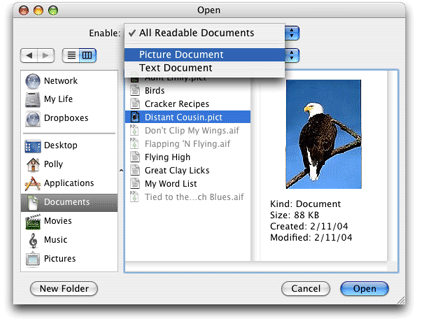
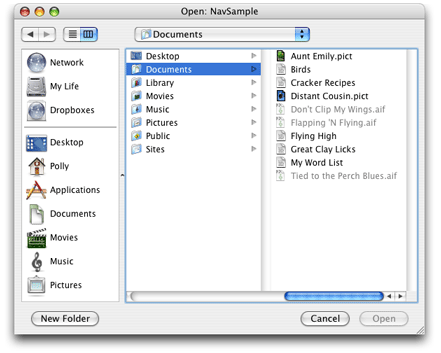
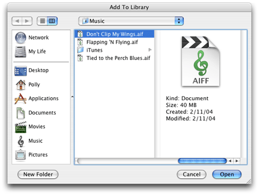
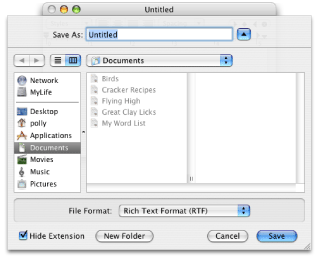
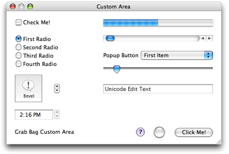
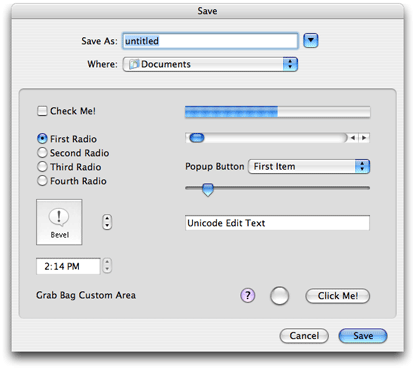

> 导航：[总目录](../../../README.md) · [documentation](../../../_indexes/documentation.md) · [Navigation Services Programming Guide](Introduction%20to%20Navigation%20Services%20Programming%20Guide.md)


[Next](Document%20Revision%20History.md)[Previous](Navigation%20Services%20Concepts.md)

# Navigation Services Tasks

The Navigation Services API is fairly straightforward to use. It contains a modest number of functions and it performs a well-defined set of tasks. This chapter lists some overall guidelines for using the API, shows you how to accomplish the most common tasks, and discusses approaches to take if you need to customize a navigation dialog. The chapter contains these sections:

- [Guidelines for Using Navigation Services](#apple-f4xwc4dqnrsv64tfmyxwi33df52wszbpkridgmbqgaytcnbxfvbuqmrqgmwueqkcjjfeersb). Read this first to get an idea how to best use the Navigation Services API in Mac OS X.
- [Steps for Providing a Navigation Dialog](#apple-f4xwc4dqnrsv64tfmyxwi33df52wszbpkridgmbqgaytcnbxfvbuqmrqgmwueqkcirdueqsb). This section is a must-read because it discusses the five tasks required to display and process a navigation dialog.
- [Writing a Navigation Event-Handling Callback](#apple-f4xwc4dqnrsv64tfmyxwi33df52wszbpkridgmbqgaytcnbxfvbuqmrqgmwuerkjjjfeoscj). This is another required-reading section. If your application doesn’t provide an event-handling callback, it won’t be able to obtain and process actions taken by the user in a navigation dialog.
- [Filtering the Types of Files That Users Can Open](#apple-f4xwc4dqnrsv64tfmyxwi33df52wszbpkridgmbqgaytcnbxfvbuqmrqgmwuerkjijcucsci). Navigation Services can filter on the basis of the `OSType` of a file. You can get more sophisticated filtering by providing your own filtering routine. This section tells you how.
- [Writing a Preview Callback](#apple-f4xwc4dqnrsv64tfmyxwi33df52wszbpkridgmbqgaytcnbxfvbuqmrqgmwuerkjirbekskd). Only those developers who want to customize a preview display need to read this.
- [Controlling Settings in a Navigation Dialog](#apple-f4xwc4dqnrsv64tfmyxwi33df52wszbpkridgmbqgaytcnbxfvbuqmrqgmwueqkcivbeqqki). Read this for information on how to set values for items in a navigation dialog.
- [Adding Custom Items to a Navigation Dialog](#apple-f4xwc4dqnrsv64tfmyxwi33df52wszbpkridgmbqgaytcnbxfvbuqmrqgmwueqkcizeuqrkf). If you want to add custom controls to a dialog, read this.

There are a number of guidelines you should follow to ensure optimal performance and efficient memory use when you use Navigation Services. This section summarizes them.

- Disable the Open menu item when you are processing an Open command. Enable the menu item after you have disposed of the Open dialog. See [Writing a Navigation Event-Handling Callback](#apple-f4xwc4dqnrsv64tfmyxwi33df52wszbpkridgmbqgaytcnbxfvbuqmrqgmwuerkjjjfeoscj) for an example.
- Use `CFStringRef` data types for filenames.
- Whenever possible, use sheets for Save dialogs used for documents.
- Save user settings for different types of Open and Save dialogs. For example, save settings for a dialog that opens a document template independently of those settings used for a dialog that opens user-created documents.
- Use Navigation Services routines—not Dialog Manager, Control Manager, or HIView routines—if you want to handle standard navigation dialog user interface items such as the Open, Save, and Cancel buttons. Although it was possible (but not recommended) to use Dialog Manager routines in the past, their use for standard navigation dialog items is not supported beginning with Mac OS X v. 10.3. Use of Control Manager or HIView routines is discouraged. See [Controlling Settings in a Navigation Dialog](#apple-f4xwc4dqnrsv64tfmyxwi33df52wszbpkridgmbqgaytcnbxfvbuqmrqgmwueqkcivbeqqki) for more information.
- If you customize a navigation dialog avoid erasing behind items and do not explicitly draw your controls in the custom area. Instead, create your custom controls in a nib file and let Navigation Services handle the drawing for you. See [Adding Custom Items to a Navigation Dialog](#apple-f4xwc4dqnrsv64tfmyxwi33df52wszbpkridgmbqgaytcnbxfvbuqmrqgmwueqkcizeuqrkf) for more information.

There are five tasks your application performs to allow users to navigate to items in the file system for the purpose of opening a file, saving a new file, or performing a Save As operation on an existing file:

1. [Obtain Default Values for a Dialog Creation Structure](#apple-f4xwc4dqnrsv64tfmyxwi33df52wszbpkridgmbqgaytcnbxfvbuqmrqgmwuerkji5dekq2b)
2. [Fill the Dialog Creation Structure With Appropriate Values](#apple-f4xwc4dqnrsv64tfmyxwi33df52wszbpkridgmbqgaytcnbxfvbuqmrqgmwuerkjivdusssd)
3. [Create the Dialog](#apple-f4xwc4dqnrsv64tfmyxwi33df52wszbpkridgmbqgaytcnbxfvbuqmrqgmwuerkji5beir2e)
4. [Run the Dialog](#apple-f4xwc4dqnrsv64tfmyxwi33df52wszbpkridgmbqgaytcnbxfvbuqmrqgmwuerkjjbeuuq2f)
5. [Dispose of the Dialog](#apple-f4xwc4dqnrsv64tfmyxwi33df52wszbpkridgmbqgaytcnbxfvbuqmrqgmwuerkjirdumqsc)

Each of these steps is described in detail in the sections that follow.

You use the data structure `NavDialogCreationOptions` to set the options you want Navigation Services to use for a dialog. Before you can fill out the data structure with your options, you must initialize it with default values by calling the function `NavGetDefaultDialogCreationOptions`, as shown in Listing 2-1.

__Listing 2-1__  Initializing a dialog creation structure

```
OSStatus status;
NavDialogCreationOptions myDialogOptions;

status = NavGetDefaultDialogCreationOptions (&myDialogOptions);
```


After you have obtained an initialized dialog creation structure, you can change any of the default settings you’d like. Table 2-1 lists the fields in the dialog creation structure and describes what you’d typically provide. For more details on the fields in the dialog creation structure, see Navigation Services Reference.

__Table 2-1__  Fields in the dialog creation structure

| Field Name | Comments |
| `version` | Keep the default value. |
| `optionFlags` | Supply the dialog configuration options appropriate for your application. There are many options. The default options as well as the values you can set are fully described in “Dialog Configuration Options” in Navigation Services Reference. |
| `Point` | For Open dialogs, you can optionally supply a location for the upper-left corner of the dialog; the default is the center of the primary screen. This field is not relevant to sheets. |
| `clientName` | Provide a string only if you want to identify your application in the title for any dialog and in alert messages for save dialogs. This string is appended to the window title. |
| `windowTitle` | Provide a string only if you want to override the default window title. |
| `actionButtonLabel` | Provide a button label only if you want to override the default action button label (Open, Save, and so forth). |
| `cancelButtonLabel` | Provide a button label only if you want to override the default label for the Cancel button. |
| `saveFileName` | Provide a string to use as the name for a file to save; the default behavior is to display a blank field for the user to fill in. |
| `message` | Provide a string if you want to display a message or prompt above the browser list. |
| `preferenceKey` | Provide this to have Navigation Services save the user settings for different types of Open and Save dialogs. |
| `popupExtension` | Provide this only if you want to assign additional menu items to the Show pop-up menu in an Open dialog or to the Format pop-up menu in a Save dialog. |
| `modality` | Use to specify whether the dialog is a sheet. For a save dialog provide `kWindowModalityWindowModal` because a save dialog in Mac OS X should be a sheet. |
| `parentWindow` | Supply the parent window for a sheet. |
| `reserved` | Ignore this field. |

You can create dialogs for opening or saving existing documents, or for closing documents that have unsaved changes. Table 2-2 lists the functions you can use for opening an item. Table 2-3 lists those you can use when a user tries to close a document that has unsaved changes. Each table provides guidelines for choosing which function to use. When the user issues a command to save a new, untitled document or to save an existing document using a different filename, there is only one function to use—`NavCreatePutFileDialog`.

__Table 2-2__  Functions used to create Open dialogs

| Use this function | When you want a user to choose . . . |
| `NavCreateChooseObjectDialog` | One or more files, folders, or volumes |
| `NavCreateGetFileDialog` | One or more files |
| `NavCreateChooseFileDialog` | A single file |
| `NavCreateChooseFolderDialog` | A single folder |
| `NavCreateChooseVolumeDialog` | A single volume |

__Table 2-3__  Functions used to create Close dialogs

| Use this function | When you want to . . . |
| `NavCreateAskSaveChangesDialog` | Ask the user whether to save changes. Use in response to Close or Quit commands when the file contents have changed since the file was opened or the last save. |
| `NavCreateAskReviewDocumentsDialog` | Notify the user of multiple unsaved documents and provide the option for the user to review them. Use in response to a Quit or Close All command when file contents for at least two of the files have changed. |
| `NavCreateAskDiscardChangesDialog` | Ask the user whether to discard changes. Use to provide the user with an opportunity to revert to a previous version. |

Listing 2-2 shows how to use the function `NavCreateGetFileDialog` to create an open dialog that allows the user to choose one or more files. Although the open-dialog creation functions don’t all take the same parameters, they are similar enough for you to get an idea of how to use all of them by looking at `NavCreateGetFileDialog`. A detailed explanation for each numbered line of code appears following the listing.

__Listing 2-2__  Creating a navigation dialog for opening a file

```
OSStatus status;

status = NavCreateGetFileDialog (&myDialogOptions, // 1
                        myFileList, // 2
                        myNavigationEventCallback, // 3
                        NULL,       // 4
                        NULL,       // 5
                        NULL, // 6
                        &myDialogRef); // 7
```

Here’s what the code does:

1. Passes an initialized dialog options structure that is filled out with options appropriate for your application. This is the structure discussed in [Obtain Default Values for a Dialog Creation Structure](#apple-f4xwc4dqnrsv64tfmyxwi33df52wszbpkridgmbqgaytcnbxfvbuqmrqgmwuerkji5dekq2b) and [Fill the Dialog Creation Structure With Appropriate Values](#apple-f4xwc4dqnrsv64tfmyxwi33df52wszbpkridgmbqgaytcnbxfvbuqmrqgmwuerkjivdusssd).
2. Passes a `NavTypeListHandle` value that points to a `NavTypeList` data structure. You must first declare the storage for this structure, then fill it with:

   - A four-character sequence that specifies an `OSType`
   - The number of file types contained in the following list
   - A list of file types, specified as `OSType` data types, to show in the Open dialog

   In this example, `myFileList` was previously filled out with the appropriate information.
3. Passes a universal procedure pointer to a navigation event callback function (`NavEventUPP` data type). You must supply this callback to handle user events. For details, see [Writing a Navigation Event-Handling Callback](#apple-f4xwc4dqnrsv64tfmyxwi33df52wszbpkridgmbqgaytcnbxfvbuqmrqgmwuerkjjjfeoscj).
4. Passes `NULL`. You can optionally pass a universal procedure pointer to a preview callback function (`NavPreviewUPP` data type). To determine whether or not you’d need to provide this callback, see [Writing a Preview Callback](#apple-f4xwc4dqnrsv64tfmyxwi33df52wszbpkridgmbqgaytcnbxfvbuqmrqgmwuerkjirbekskd).
5. Passes `NULL`. You can optionally pass a universal procedure pointer to a filter callback function (`NavObjectFilterProcPtr`). To determine whether or not you’d need to provide this callback, see [Filtering the Types of Files That Users Can Open](#apple-f4xwc4dqnrsv64tfmyxwi33df52wszbpkridgmbqgaytcnbxfvbuqmrqgmwuerkjijcucsci).
6. Passes `NULL`. You can optionally pass a 32-bit value containing or referring to application-specific data needed by your callback function.
7. Passes a valid pointer to a `NavDialogRef` data type. On return, points to a Navigation Services dialog reference that you later need to run the dialog.

Listing 2-3 shows how to use the function `NavCreatePutFileDialog` to create a dialog that allows the user to save a PDF file. A detailed explanation for each numbered line of code appears following the listing.

__Listing 2-3__  Creating a navigation dialog for saving a file as a PDF

```
#define kFileCreator   'prvw'
#define kFileTypePDF   'PDF '

OSStatus status;

status = NavCreatePutFileDialog (&myDialogOptions, // 1
                        kFileTypePDF, // 2
                        kFileCreator, // 3
                        myNavigationEventCallback, // 4
                        NULL, // 5
                        &myDialogRef); // 6
```

Here’s what the code does:

1. Passes an initialized dialog options structure that is filled out with options appropriate for your application. This is the structure discussed in [Obtain Default Values for a Dialog Creation Structure](#apple-f4xwc4dqnrsv64tfmyxwi33df52wszbpkridgmbqgaytcnbxfvbuqmrqgmwuerkji5dekq2b) and [Fill the Dialog Creation Structure With Appropriate Values](#apple-f4xwc4dqnrsv64tfmyxwi33df52wszbpkridgmbqgaytcnbxfvbuqmrqgmwuerkjivdusssd).
2. Passes an application-defined constant to specify that the file is to be saved as a PDF.
3. Passes an application-defined constant to specify the application that can open the file.
4. Passes a universal procedure pointer to a navigation event callback function (`NavEventUPP`). You must supply this callback to handle user events. For details, see [Writing a Navigation Event-Handling Callback](#apple-f4xwc4dqnrsv64tfmyxwi33df52wszbpkridgmbqgaytcnbxfvbuqmrqgmwuerkjjjfeoscj).
5. Passes `NULL`. You can optionally pass a 32-bit value containing or referring to application-specific data needed by your callback functions.
6. Passes a valid pointer to a `NavDialogRef` data type. On return, points to a Navigation Services dialog reference that you later need to run the dialog.

After you have created a dialog, you pass the Navigation Services dialog reference returned by the creation function to the function `NavDialogRun`, as shown in Listing 2-4.

__Listing 2-4__  Running a previously created dialog

```
OSStatus status;

status = NavDialogRun (myDialogRef);
```

Navigation Services keeps track of the dialog while it is running and invokes your callback to handle user actions such as clicking Open, Save As, or Cancel. Navigation Services handles all the display and browsing activity for you.

After your callback receives a termination notification (`kNavCBTerminate`), the previous call to the function `NavDialogRun` completes. At this time your application must dispose of the Navigation Services dialog reference, by calling the function `NavDialogDispose`, as shown in the following line of code.

```
NavDialogDispose (myDialogRef);
```

You pass the dialog reference you obtained when you called the function to create the dialog.

A navigation event-handling callback function handles events associated with the navigation dialogs you create. You pass Navigation Services a UPP to your event handler whenever you create a dialog. At a minimum, your event handler performs the following tasks:

- It processes these user actions—clicking the Save, Open, and Cancel buttons. Your application obtains the specific action, gets the associated reply record, and processes the action.
- It processes a termination event. Any user action that terminates a dialog results in Navigation Services invoking your callback with the event `kNavCBTerminate`. Your application disposes of the dialog reference you obtained when you created the dialog, cleans up menus, and so forth.

If you customize the dialog by adding your own controls, you also handle their events.

[Listing 2-5](#apple-f4xwc4dqnrsv64tfmyxwi33df52wszbpkridgmbqgaytcnbxfvbuqmrqgmwueqkcinduiskd) shows a navigation event-handling callback. A detailed explanation for each numbered line of code follows the listing.

__Listing 2-5__  A navigation event-handling callback

```swift
void MyNavEventProc (NavEventCallbackMessage callBackSelector, // 1
                    NavCBRecPtr callBackParms,
                    void *callBackUserData )
{
OSStatus status;

switch (callBackSelector) // 2
{
    case kNavCBUserAction: // 3
    {
        NavReplyRecord  reply; // 4
        NavUserAction   userAction = 0; // 5
        if ((status = NavDialogGetReply (callBackParms->context, // 6
                             &reply)) == noErr )
        {
            OSStatus tempErr;
            userAction = NavDialogGetUserAction // 7
                         (callBackParms->context);
            switch (userAction)
            {
                case kNavUserActionSaveAs: // 8
                    // your code to save as
                break;
                case kNavUserActionOpen: // 9
                    // your code to open
                break;
                case kNavUserActionCancel: // 10
                        //..
                break;
                case kNavUserActionNewFolder: // 11
                    //..
                break;
            } // switch userAction
            tempErr = NavDisposeReply (&reply); // 12
            if(!status) // 13
                status = tempErr;
            }
            break;
    } // end case kNavCBUserAction
    break;
    case kNavCBTerminate: // 14
    {
            if(MyDialogRef)
                NavDialogDispose(callBackParms->context ); // 15
            // re-enable open if needed
            EnableMenuCommand (NULL, kHICommandOpen); // 16
    break;
    } // End case kNavCBTerminate
 } // End switch (callBackSelector)
}
```

Here’s what the code does:

1. Takes three parameters passed to your callback from Navigations Services: a callback selector, callback parameters, and user data. The callback selector contains the event that triggered your callback. The callback parameters, contained in a navigation callback record, contain detailed information about the dialog and the event. You’ll use this later to extract the user action associated with the event. The user data is a 32-bit value containing or referring to application-specific data needed by your callback function. This is the value you passed when you created the dialog. It can be `NULL`. See [Create the Dialog](#apple-f4xwc4dqnrsv64tfmyxwi33df52wszbpkridgmbqgaytcnbxfvbuqmrqgmwuerkji5beir2e).
2. Checks the callback selector to see what event triggered the callback.
3. Screens for the callback selector case of a user action.
4. Declares a reply record variable. User actions have an associated reply record that your application retrieves.
5. Declares a user action variable and sets it to a default of `0`. You use this variable to retrieve the specific action taken by the user.
6. Calls the function `NavDialogGetReply` to retrieve the reply record associated with the user action. You need to pass the `context` field of the navigation callback record. The `context` field references an opaque object that identifies the dialog instance. You also need to pass the reply record you declared previously. On return, the `reply` parameter is filled out with information about the reply, including information about the files selected or saved by the user. Typically you pass the reply record to your functions for opening or saving.
7. Calls the function `NavDialogGetUserAction` to obtain the specific action taken by the user. You need to pass the `context` field of the navigation callback record. The function returns the user action in the user action variable you declared previously.
8. If the user clicks the Save As button, the code calls your function to save the file. You pass the reply record to your function.
9. If the user clicks the Open button, the code calls your function to open the file. You pass the reply record to your function.
10. If the user clicks the Cancel button, the code performs any clean up tasks that need to be done. This is optional; typically you don’t need to do anything.
11. If the user clicks the New Folder button, you can optionally perform any tasks you’d like. Typically you don’t need to do anything; Navigation Services shows the New Folder dialog and processes the event.
12. Disposes of the reply record.
13. Checks for errors that may have occurred during the processing of the user action.
14. Screens for the callback selector case of a termination action. This means that the dialog is about to be closed.
15. Disposes of the dialog reference.
16. Enables the Open menu command, just in case you disabled it previously (which is advisable for you to do).

You can restrict what’s displayed as active in the file browser by:

- Choosing one of the restrictive functions (`NavCreateGetFileDialog`, `NavCreateChooseFileDialog`, `NavCreateChooseFolderDialog`, or `NavCreateChooseVolumeDialog`) when you create an Open dialog. Navigation Services automatically dims (makes inactive) any object that is not of the appropriate kind (file, folder, volume). It also changes the dialog title appropriately—Choose a File, Choose a Folder, and so forth.
- Filter based on a list of uniform type identifiers (or UTIs) by calling the `NavDialogSetFilterTypeIdentifiers` function, available in Mac OS X v10.4 and later. You can use this function only when creating an Open dialog using `NavCreateGetFileDialog` or `NavCreateChooseFileDialog`. When you use the `NavDialogSetFilterTypeIdentifiers` function, Navigation Services automatically provides an Enable pop-up menu and populates the menu with a list of the document types you specified. [Figure 2-1](#apple-f4xwc4dqnrsv64tfmyxwi33df52wszbpkridgmbqgaytcnbxfvbuqmrqgmwueqkci5cuqskb) shows an Open dialog that is set up (by providing a list of UTIs) to filter PICT files. Files that are not PICT files are displayed as dimmed. UTIs are discussed later in this section.
- Providing a list of `OSType` data types that specify the document types you want users to open or save. You should choose this option only if you cannot use uniform type identifiers. You pass this list as the `inTypeList`parameter in a dialog creation function. When you use the `inTypeList` parameter, Navigation Services automatically provides an Enable pop-up menu and populates the menu with a list of the document types you specified.
- Writing a filter callback (`NavObjectFilterProcPtr`). When you create a dialog, you supply a UPP to your filter callback. For example, if you want users to open a custom type created by your application, you could supply a filter callback that screens files based on the custom type. [Figure 2-2](#apple-f4xwc4dqnrsv64tfmyxwi33df52wszbpkridgmbqgaytcnbxfvbuqmrqgmwueqkcjjeuuskb) shows the dialog produced when the filter callback is supplied but UTI or `OSType` filtering is not supplied. Note that the dialog does not have an Enable pop-up. [Listing 2-6](#apple-f4xwc4dqnrsv64tfmyxwi33df52wszbpkridgmbqgaytcnbxfvbuqmrqgmwueqkcizfeoscj) shows an example of a filter callback.

__Figure 2-1__  An Open dialog that uses a list to filter PICT files



_Uniform type identifiers_ (or UTIs) are strings that uniquely identify abstract types. They can be used to describe a file format or data type, but can also be used to describe type information for other sorts of entities, such as directories, volumes, or packages. The syntax of a uniform type identifier is similar to a bundle identifier. A UTI has the form of a reversed DNS name, although some special top-level UTI domains are reserved by Apple and are outside the current IANA top-level Internet domain name space.

Some examples include:

- public.jpeg
- public.utf16-plain-text
- com.apple.xml-plist
- com.apple.appleworks.doc

_Public types_ are standard types or are types that are not controlled by an organization. Currently, public types can be declared only by Apple. Types specific to Apple or Mac OS are declared with identifiers in the com.apple domain. Third parties should declare their own uniform type identifiers in their respective registered Internet domain spaces.

For more information on UTIs and the UTI API see _[Uniform Type Identifiers Overview](../../File%20Management/Uniform%20Type%20Identifiers%20Overview/Introduction%20to%20Uniform%20Type%20Identifiers%20Overview.md#apple-f4xwc4dqnrsv64tfmyxwi33df52wszbpkridimbqgaytgmjz)_.

__Figure 2-2__  An Open dialog that uses a filter callback for TEXT and PICT files



To filter files based on uniform type identifiers, you call the `NavDialogSetFilterTypeIdentifiers` function (available in Mac OS X v10.4 and later), passing in a CFArray of the UTIs you want your dialog to display as enabled.

```
OSStatus NavDialogSetFilterTypeIdentifiers(
    NavDialogRef inGetFileDialog, CFArrayRef inTypeIdentifiers);
```

If you need to do more sophisticated filtering, you can write your own custom filtering function. Listing 2-6 shows a filter function that returns `true` for any item that is a folder, or for files whose type conforms to the public.text UTI. Using the public.text UTI ensures that all text files—RTF, plain text, Unicode, and so forth—are available in the navigation dialog, not just those that have an `OSType` value of `TEXT`.

Navigation Services displays as active any item for which your callback returns `true`. If you return `false`, the item appears inactive (dimmed) and the user can’t select it. A detailed explanation for each numbered line of code follows the listing.

__Listing 2-6__  A filter callback that filters out all but text files

```swift
Boolean MyFilterProc (AEDesc *theItem, void *info,
                    void *callBackUD,
                    NavFilterModes filterMode )
{
    OSStatus status;
    Boolean             display = true;
    NavFileOrFolderInfo *theInfo = (NavFileOrFolderInfo*)info;
    FSRef               ref;

    if (theInfo->isFolder == true) // 1
        return true;

    AECoerceDesc (theItem, typeFSRef, theItem); // 2

    if ( AEGetDescData (theItem, &ref, sizeof (FSRef)) == noErr )
    {

        CFStringRef itemUTI = NULL;
        status = LSCopyItemAttribute (&ref, kLSRolesAll,
                                kLSItemContentType, (CFTypeRef*)&itemUTI); // 3

        if (status == noErr)
            {
              display = UTTypeConformsTo (itemUTI, CFSTR("public.text") );// 4
              CFRelease (itemUTI);  // 5
            }

    }
    return display;
}
```

Here’s what the code does:

1. Checks for a folder and returns `true` if the item is a folder. Typically you’d want to allow users to open folders and navigate through the folder contents.
2. Calls the Apple Event Manager function to coerce the `FSRef` value from the item descriptor record. You need this value in order to obtain extension, type, and creator information for a file.
3. Calls the Launch Services function (available in Mac OS X v10.4 and later) to obtain the UTI for the file type. Passing `kLSItemContentType` specifies that you want the uniform type identifier attribute.
4. Tests for a conformance relationship between UTI for the file and the public.text type. Returns true if the types are equal or if the UTI conforms, directly or indirectly, to the second type. If the UTI is any kind of text (RTF, plain text, Unicode, and so forth), the function `UTTypeConformsTo` returns `true`.
5. Releases the UTI, which is specified as a CFString object.

You can provide both a filter callback and a list of file types. If you provide a list of file types (either by calling in `NavDialogSetFilterTypeIdentifiers` or in the `inTypeList` parameter), make sure that your callback doesn't automatically filter out an entire document type in the filtered list. For example, if the filter list allows JPEG files to be visible, your callback should not automatically screen out all JPEG files. Doing so ensures that the user can always see some files when a particular file type is selected from the Enable popup menu. For more information, see `NavObjectFilterProcPtr` in Navigation Services Reference.

Navigation Services automatically shows a preview of the file content for standard image file and text types and for those files that have a `pnot` resource (`PICT` preview resource). For other file types, Navigation Services shows the document icon you specify in your application’s bundle. If your application does not have its own document icon, Navigation Services shows a generic icon. [Figure 2-3](#apple-f4xwc4dqnrsv64tfmyxwi33df52wszbpkridgmbqgaytcnbxfvbuqmrqgmwueqkcjfbucr2c) shows the generic icon supplied by Navigation Services for an AIFF audio file.

__Figure 2-3__  A generic icon for an AIFF audio file



If you want to display a preview other than what Navigation Services provides, perform the following tasks:

- Write a preview callback function.
- Supply a UPP to your preview callback when you call a dialog-creation function for an Open dialog.
- Handle the message `kNavCBAdjustPreview` in your event callback. This message means the user has toggled the preview area on or off. In response, your application adjusts any custom controls it created.

The preview callback function (`NavPreviewProcPtr`) takes two parameters: a pointer to a `NavCBRec` data structure and a pointer to any data your callback needs. The `NavCBRec` provided to your callback by Navigation Services contains a rectangle, in local QuickDraw coordinates, that describes the preview area available to your application. The minimum size is 145 pixels wide by 118 pixels high. If your callback needs data passed to it, you supply this data when you call a dialog creation function such as `NavCreateGetFileDialog`. When Navigation Services calls your preview function, the data is passed back to your application in the `callBackUD` parameter.

Navigation Services invokes your preview-drawing function when the user selects a file. Your preview function, in turn, calls the function `NavCustomControl` to determine if the preview area is visible and, if so, what its dimensions are.

Your preview callback returns a Boolean value. It returns `true` if the callback successfully draws a custom file preview. If your preview callback returns `false`, Navigation Services displays the preview if the file contains a valid `pnot` resource. If your preview function returns `false` and a `pnot` resource is not available, Navigation Services displays a default icon preview.

You create a UPP to your preview callback by calling the function `NewNavPreviewUPP`.

[Listing 2-7](#apple-f4xwc4dqnrsv64tfmyxwi33df52wszbpkridgmbqgaytcnbxfvbuqmrqgmwueqkcijbuqqsi) shows a sample preview callback. A detailed explanation for each numbered line of code appears following the listing.

__Listing 2-7__  A preview callback

```swift
Boolean myPreviewProc (NavCBRecPtr callBackParms,
                        NavCallBackUserData callBackUD )
{

    OSErr       theErr;
    Boolean     previewShowing = false;
    FSSpec      previewFileSpec;
    Boolean     result = false;

    theErr = NavCustomControl(callBackParms->context, // 1
                     kNavCtlIsPreviewShowing,
                     &previewShowing );
    if (theErr == noErr && previewShowing)
    {
        if (( theErr = MyGetFSSpecInfo( // 2
                (AEDesc*)callBackParms->eventData.eventDataParms.param,
                &previewFileSpec )) == noErr )
        {
            FInfo info;
            if ((theErr = FSpGetFInfo(&previewFileSpec,&info)) == noErr) // 3
            {
                Rect previewInfoButtonRect;
                SetRect (&previewInfoButtonRect, // 4
                        callBackParms->previewRect.left + 10,
                        callBackParms->previewRect.bottom - 30,
                        callBackParms->previewRect.right - 10,
                        callBackParms->previewRect.bottom - 10 );
                // Your code here to create the preview // 5
                // Use Quartz to draw the preview // 6

                result = true;// 7
            }
        }
    }
    return result;// 8
}
```

Here’s what the code does:

1. Calls the function `NavCustomControl` to obtain the value for `kNavCtlIsPreviewShowing`. You show a preview only if this value is `true`.
2. Calls the application-defined function `MyGetFSSpec` to obtain the file specification structure (`FSSpec`) for a given `AEDesc` record.
3. Calls the File Manager function `FSpGetFInfo` to obtain the Finder information for the file.
4. Defines a rectangular area to display the preview.
5. This is where your application supplies its code to create and draw the preview into the preview rectangle.
6. When you draw the preview, you should use Quartz, not QuickDraw. See [Drawing With Quartz 2D](../../Graphics%20Imaging/Quartz%202D%20Programming%20Guide/Introduction.md#apple-f4xwc4dqnrsv64tfmyxwi33df52wszbpkridgmbqgaytanrw) for more information.
7. Sets `result` to true, to indicate that in the previous lines of code the preview control and its contents were successfully drawn and displayed.
8. Returns a Boolean value to indicate whether a preview was successfully shown (`true`) or not (`false`). If the function returns `false` and a `pnot` resource is not available, Navigation Services displays a generic icon.

You control various settings of the noncustom controls in an active dialog by calling the function `NavCustomControl` and passing the appropriate control settings in the `selector` parameter and any associated values in the `parms` parameter. You call `NavCustomControl` from within your event-handling callback function or your preview-drawing callback function.

When an event occurs in a dialog, Navigation Services calls your event-handling function, passing an event message in the `param` field of a `NavCBRec` data structure. In response, your application calls the function `NavCustomControl`, but only if Navigation Services has already sent the `kNavCBStart` message to signal that a dialog is ready to be displayed.

When you call the function `NavCustomControl`, pass a reference to the active Navigation Services dialog, a selector of type `NavCustomControlMessage` to specify what you want to set, and a pointer to the value to use as the setting. Not all selectors require a value. See Navigation Services Reference for a complete list of custom control setting constants (`NavCustomControlMessage`).

_Examples:_

To set the file browser list so it sorts by date:

```
theErr = NavCustomControl(myDialogRef,
                        kNavCtlSortBy,
                        &kNavSortDateField);
```

To set the default location in the file browser list:

```
theErr = NavCustomControl(myDialogRef,
                        kNavCtlSetLocation,
                        &locationDesc);
```

To set one of your custom menu items in the Show pop-up menu or the Format pop-up menu as the default selection:

```
theErr = NavCustomControl(myDialogRef,
                        kNavCtlSelectCustomType,
                        &menuItem);
```


[Figure 2-4](#apple-f4xwc4dqnrsv64tfmyxwi33df52wszbpkridgmbqgaytcnbxfvbuqmrqgmwueqkcivfemssd) shows a Save dialog that has a custom item for choosing the file format. Custom items always appear in a rectangle located above the Save/Open, Cancel buttons located in the dialog. You can add one or more custom items to a navigation dialog by performing these tasks:

1. Lay out the controls you want to add to the dialog. See [Using Interface Builder to Lay Out Custom Items](#apple-f4xwc4dqnrsv64tfmyxwi33df52wszbpkridgmbqgaytcnbxfvbuqmrqgmwuerkjiveuoqkb).
2. Set up a Carbon event handler to respond to:

   - The customize event `kNavCBCustomize`, to which your application gets the controls you laid out and negotiates space for them in the dialog. See [Responding to the kNavCBCustomize Event](#apple-f4xwc4dqnrsv64tfmyxwi33df52wszbpkridgmbqgaytcnbxfvbuqmrqgmwuerkjjfduqskk).
   - The start event `kNavCBStart`, to which your application adds the controls to the dialog. See [Responding to the kNavCBStart Event](#apple-f4xwc4dqnrsv64tfmyxwi33df52wszbpkridgmbqgaytcnbxfvbuqmrqgmwuerkjirdegqsi).
   - The adjust event `kNavCBAdjust`, to which your application redraws the controls or handles events beyond moving the controls. Keep in mind that Navigation Services moves controls automatically when the user resizes the dialog.

__Figure 2-4__  A dialog with a custom File Format pop-up menu



The recommended way to create custom controls is for you to use Interface Builder. You create the controls graphically; you don’t need to write code to create them. If you use Xcode to write your application, you can easily launch Interface Builder from within Xcode.

You simply create a window in Interface Builder, drag a User Pane control from the Carbon-Enhanced Controls palette to the window, and then drag whatever controls you want from the palette to the window, making sure you place the controls on the User Pane control. Later, in your application, you’ll add the User Pane control to the navigation dialog. When you add the User Pane control in Interface Builder, you need to assign it a Control ID. From your application you refer to the User Pane control by its Control ID.

[Figure 2-5](#apple-f4xwc4dqnrsv64tfmyxwi33df52wszbpkridgmbqgaytcnbxfvbuqmrqgmwueqkcinbeqske) shows a window that contains controls. Although you can’t see the User Pane control, it is the same size as the window, and all other controls are placed over the User Pane control. The example is to show the variety of controls you can add, not to recommend that you add all these controls to a single navigation dialog. After you create a window with custom controls, you save the window as a nib file. Then access the nib file from within your code, as shown in the `MyHandleCustomizeEvent` function in [Listing 2-8](#apple-f4xwc4dqnrsv64tfmyxwi33df52wszbpkridgmbqgaytcnbxfvbuqmrqgmwueqkcjfbuorsf). (For information on using Interface Builder and XCode, see [Tools Documentation](https://developer.apple.com/library/archive/navigation/redirect.html#//apple_ref/doc/uid/TP30000436).)

__Figure 2-5__  Controls created using Interface Builder



You negotiate space for the controls you want to add to a dialog by responding to the `kNavCBCustomize` message in your event-handling callback. The `kNavCBCustomize` message signals your application to provide layout information in the `NavCBRec` data structure passed to your callback by Navigation Services.

The `customRect` field of the `NavCBRec` data structure passed to your event callback defines a rectangle in the local coordinates of the dialog. The top-left coordinates define the anchor point for a custom rectangle. To customize the dialog, you set a value in the `customRect` field that completes the dimensions of a custom rectangle. [Figure 2-4](#apple-f4xwc4dqnrsv64tfmyxwi33df52wszbpkridgmbqgaytcnbxfvbuqmrqgmwueqkcivfemssd) shows a dialog with a custom control for file format. The custom rectangle specifies the area in which the File Format label and pop-up menu reside. You must ensure that any items you add to a dialog follow the design and layout guidelines discussed in _Apple Human Interface Guidelines_.

After you set the dimensions of the custom rectangle, Navigation Services determines if the requested dimensions result in a dialog that can fit on the screen. If the dimensions are too large, then Navigation Services sets the rectangle to the largest size that the screen can accommodate and sends your event callback another `kNavCBCustomize` message. Your application can continue to negotiate by examining the `customRect` field and requesting a different size until Navigation Services provides an acceptable rectangle value, at which time you create your custom control or item list. The minimum size for the custom area is 400 pixels wide by 40 pixels high.

The `MyHandleCustomizeEvent` function in [Listing 2-8](#apple-f4xwc4dqnrsv64tfmyxwi33df52wszbpkridgmbqgaytcnbxfvbuqmrqgmwueqkcjfbuorsf) is called from within an event callback in response to the `kNavCBCustomize` message. The code shows how to unarchive a window, created in Interface Builder, that contains custom controls to add to a navigation dialog. The function calculates the size of the rectangle needed to accommodate the custom controls, and negotiates with Navigation Services for the space. Navigation Services repeatedly sends the `kNavCBCustomize` message to your event callback until you’ve successfully negotiated a rectangle of an appropriate size. [Figure 2-6](#apple-f4xwc4dqnrsv64tfmyxwi33df52wszbpkridgmbqgaytcnbxfvbuqmrqgmwueqkciveemq2i) shows the dialog that results from adding the custom controls shown in [Figure 2-5](#apple-f4xwc4dqnrsv64tfmyxwi33df52wszbpkridgmbqgaytcnbxfvbuqmrqgmwueqkcinbeqske) using the code in Listing 2-8. A detailed explanation for each numbered line of code appears following the listing.

__Listing 2-8__  Negotiating space for a custom area in a navigation dialog

```swift
void MyHandleCustomizeEvent (NavCBRecPtr callBackParms, CustomData *data)
    {
    OSStatus status;
    SInt16 neededHeight, neededWidth;
    static SInt16 gCarbonEventLastTryHeight;
    static SInt16 gCarbonEventLastTryWidth;

    if (data->nibRef == NULL)// 1
    {
        status = CreateNibReference(CFSTR("AddNibToNav"),
                                 &data->nibRef);// 2
        // Your error checking code here
        status = CreateWindowFromNib (data->nibRef, CFSTR("Custom Area"),
                             &data->windowFromNib);// 3
        // Your error checking code here
        // You dispose of the nib reference after you handle the
        // event kNavCBStart, which is in another function
    }
    Rect windowBounds;
    GetWindowPortBounds(data->windowFromNib, &windowBounds);// 4

    neededHeight = callBackParms->customRect.top + // 5
                        (windowBounds.bottom - windowBounds.top);
    neededWidth = callBackParms->customRect.left + // 6
                        (windowBounds.right - windowBounds.left);

    if ((callBackParms->customRect.right == 0) &&
                     (callBackParms->customRect.bottom == 0))// 7
    {
        callBackParms->customRect.right = neededWidth;
        callBackParms->customRect.bottom = neededHeight;
    }
    else
    {// 8
        if (gCarbonEventLastTryWidth != callBackParms->customRect.right)
            if (callBackParms->customRect.right < neededWidth)
                    // Your code here to respond to situation
        if (gCarbonEventLastTryHeight != callBackParms->customRect.bottom)
                if (callBackParms->customRect.bottom < neededHeight)
                    // Your code here to respond to situation
    }
    gCarbonEventLastTryWidth = callBackParms->customRect.right;// 9
    gCarbonEventLastTryHeight = callBackParms->customRect.bottom;// 10
    }
```

Here’s what the code does:

1. Checks to see if the nib reference is `NULL`. You need to keep track of whether or not the nib reference is created because you only need to create the nib reference once. The customization function can, however, be called many times to negotiate the space needed for your custom controls.
2. Calls the Interface Builder Services function `CreateNibReference` to create a reference to a nib file in the current application bundle. You pass the name of the nib file without the `.nib` extension.
3. Calls the Interface Builder Services function `CreateWindowFromNib` to unarchive the window from the nib file. You pass a reference to the nib file and the window name—Custom Area. This is the window name you specified in Interface Builder when you created the custom controls.
4. Gets the bounds of the window created from the nib file.
5. Sets the needed height to accommodate the bounds of the window created from the nib file.
6. Sets the needed width to accommodate the bounds of the window created from the nib file.
7. Checks to see if this is the first round of negotiations. If the rectangle height and width are each 0, then this is the first round. If it is the first round of negotiations, set the rectangle width and height to what you calculated. Ideally, the width and height you request will be provided by Navigation Services. If it isn’t, your callback is called again, and the `else` clause (see next step) is executed.
8. If this is not the first round of negotiations, checks to see if the width specified by Navigation Services is too small, and responds accordingly. Then checks to see if the height specified by Navigations Services is too small, and responds accordingly.

   How your application responds depends on the strategies you’ve implemented. For example, you could have two layouts for the controls–one that uses small controls and another that uses larger controls. If Navigation Services can’t provide enough space for the large layout, you could substitute the smaller layout. You could also not provide custom controls if there is not enough space. Ideally, when you lay out your controls, you’ll make sure that your controls will always fit into the allotted space. If you add only one control, such as a File Format pop-up, you are likely to obtain a rectangle large enough for the control.
9. Saves the width for the next round of negotiations.
10. Saves the height for the next round of negotiations.

__Figure 2-6__  A navigation dialog with custom controls



After you application successfully negotiates the space it needs for its custom area, Navigation Services sends your event handler the event `kNavCBStart`. In response, you should call your function to add the custom area to the dialog. Listing 2-9 shows a function (`MyHandleCarbonStartEvent`) that adds a User Pane control created in Interface Builder to a navigation dialog. A detailed explanation for each numbered line of code follows the listing.

__Listing 2-9__  Adding custom items to a navigation dialog

```swift
void MyHandleCarbonStartEvent (NavCBRecPtr callBackParms,
                        CustomData *data)
{
    OSStatus status = noErr;
    ControlID userPaneID = {'usrp', 100 };// 1
    HIViewRef userPane;// 2
    status = HIViewFindByID (HIViewGetRoot(data->windowFromNib), // 3
                                    userPaneID,
                                    &userPane);
    // Your error checking code here
    if (GetHIToolboxVersion() < 0x130)// 4
    {
        ControlRef rootControl;
        status = GetRootControl(callBackParms->window, &rootControl);
        // Your error checking code here
        status = EmbedControl(userPane, rootControl);
        // Your error checking code here
    }
    status = NavCustomControl(callBackParms->context, // 5
                        kNavCtlAddControl,
                        userPane);
    // Your error checking code here
    DisposeWindow(data->windowFromNib);// 6
    DisposeNibReference(data->nibRef);// 7
    data->nibRef = NULL;
}
```

Here’s what the code does:

1. Declares a `ControlID` variable for the User Pane control. You use the same `ControlID` values that you used in Interface Builder when you created the layout for your controls.
2. Declares an `HIViewRef` variable to use for the User Pane control.
3. Obtains the User Pane control by calling the HIView function `HIViewGetRoot`, supplying the window that you obtained previously (see[Responding to the kNavCBCustomize Event](#apple-f4xwc4dqnrsv64tfmyxwi33df52wszbpkridgmbqgaytcnbxfvbuqmrqgmwuerkjjfduqskk)and the `ControlID` value.
4. Checks for HIToolbox version. If the version is earlier than Mac OS X v. 10.3, you need to move the User Pane control (which includes the controls you placed in it) from the nib window to the Navigation Services dialog. In Mac OS X v. 10.3 and later you don't need to explicitly move the User Pane control. It’s taken care of automatically in the next step.
5. Calls the function `NavCustomControl` to add the User Pane control (and its embedded controls) to the dialog. You pass the `NavDialogRef` value obtained from the `context` field of the `NavCBRec` structure specified in the `callBackParms` parameter of your event-handling function. The constant `kNavCtlAddControl` specifies to move the User Pane control from the nib window to the Navigation Services dialog.
6. Disposes of the window created from the nib file. You created this in your `MyHandleCustomizeEvent` function. See [Responding to the kNavCBCustomize Event](#apple-f4xwc4dqnrsv64tfmyxwi33df52wszbpkridgmbqgaytcnbxfvbuqmrqgmwuerkjjfduqskk).
7. Disposes of the nib reference. You created this in your `MyHandleCustomizeEvent` function. See [Responding to the kNavCBCustomize Event](#apple-f4xwc4dqnrsv64tfmyxwi33df52wszbpkridgmbqgaytcnbxfvbuqmrqgmwuerkjjfduqskk).

For an example of how to use Navigation Services within a fully-functioning application, see the file `NavServicesHandling.c` in the sample application _[CGDrawPicture](../../../samplecode/CGDrawPicture/CGDrawPicture.md#apple-f4xwc4dqnrsv64tfmyxwi33df52wszbpirkfgmjqgaydanbzga)_

You can download the sample code if you want to experiment with it to see how changing various parameters affect the output.

[Next](Document%20Revision%20History.md)[Previous](Navigation%20Services%20Concepts.md)

