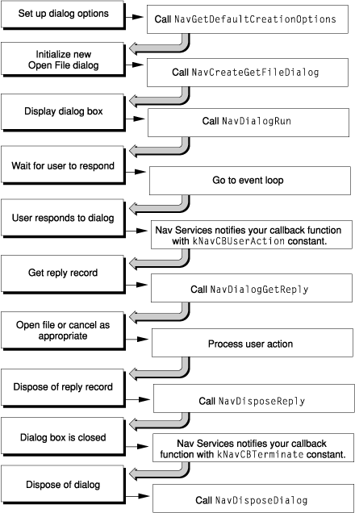

> 导航：[总目录](../../../README.md) · [documentation](../../../_indexes/documentation.md)

[Next](Document%20Revision%20History.md)

# Navigation Services for Carbon

Navigation Services is an application programming interface that allows your application to provide a user interface for navigating, opening, and saving Mac OS file objects. Navigation Services is provided as a Carbon-compliant replacement for and enhancement to the Standard File Package, which was introduced with the original Macintosh System. Navigation Services is available on Mac OS 8.6 and later, including Mac OS X.

The enhanced functionality of Navigation Services is easy to adopt. Functions are simple and flexible; they are designed to help you avoid writing custom code. Navigation Services also provides automatic support for the Appearance Manager’s extended suite of dialogs, alerts, and user controls to ensure a more consistent and comprehensible user interface across applications.

Prior to Navigation Services, Mac OS file browsing was often confusing to users as a result of the differences between Standard File Package dialogs and the Finder’s file interface. Also, users were faced with navigation much larger volumes than those which existed when the Standard File Package was developed. These large data spaces require extended functionality, so Navigation Services provides tools for you to implement a greatly enhanced user experience in the area of document management.

One enhancement is the ability for users to select and open multiple files simultaneously. There are buttons that let users easily select local or remote storage volumes, choose recently opened files and folders, or build their own list of favorite items. You can take advantage of translation services offered by the Translation Manager to give users more ways to open and save files. Navigation Services also lets you opt for deferred translation, which gives your application the ability to save interim changes in a file’s native format and avoid the time-consuming task of translation until the user closes the document.

Navigation Services 3.0, introduced with CarbonLib 1.1, establishes a new model for creating, displaying, and processing dialogs. This new functionality gives you the ability to create truly modeless dialogs and provides support for Unicode and Mac OS X sheets. `[Figure 1-1](#apple-f4xwc4dqnrsv64tfmyxwi33df52wszbpkridimbqgaydsmjsfvbuqmrqgewueqkcincugskb)` shows a flowchart that descries one way to use this model to provide file-opening services.

__Figure 1-1__  Example of using new dialog model to open files

This approach involves five-steps:

1. Create a dialog with the features you need. In the example shown in `[Figure 1-1](#apple-f4xwc4dqnrsv64tfmyxwi33df52wszbpkridimbqgaydsmjsfvbuqmrqgewueqkcincugskb)`, you call the `NavGetDefaultDialogCreationOptions` function to set up default options and the `NavCreateGetFileDialog` function to create the Open File dialog.
2. Display the dialog by calling the `NavDialogRun` function.
3. Respond when Navigation Services supplies an event message constant in the callback record. In `[Figure 1-1](#apple-f4xwc4dqnrsv64tfmyxwi33df52wszbpkridimbqgaydsmjsfvbuqmrqgewueqkcincugskb)`, this is the `kNavCBUserAction` constant. If you implement custom features, you may need to call the `NavCutsomControl` function at this time.
4. After the dialog closes, process the dialog session information from the reply record you obtain by calling the `NavDialogGetReply` function. For example, if you obtain the `kNavUserActionOpen` constant from the reply record, your application opens the appropriate files.
5. Dispose of the dialog reference and the reply record when you have finished using them, by calling the function `NavDialogDispose` and the function `NavDisploseReply`, respectively.

_Navigation Services Reference_ in Carbon User Experience Documentation provides a complete reference for the Navigation Services application programming interface.

Technical Q&A QA1315, “Why Isn't My Edit Text Box in My Navigation Dialog's Custom Area Working on 10.3?”

Technical Q&A QA1152, “Using Navigation Services to Filter QuickTime Files.”

[Next](Document%20Revision%20History.md)

