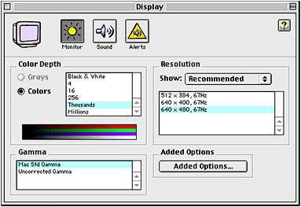
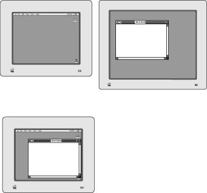
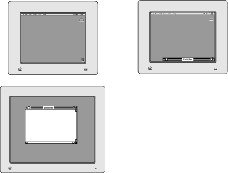
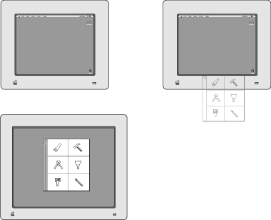
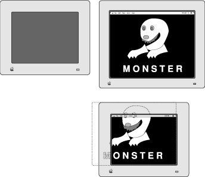
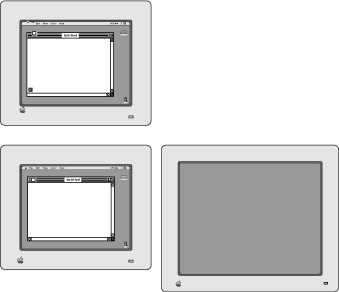
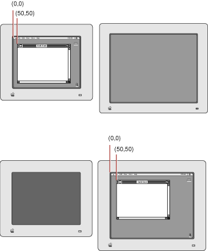
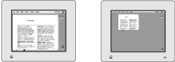

> 导航：[总目录](../../../README.md) · [documentation](../../../_indexes/documentation.md) · [Optimizing Display Modes and Window Arrangement With the Display Manager](Introduction%20to%20Optimizing%20Display%20Modes%20and%20Window%20Arrangement%20With%20the%20Display.md)

[Next](Using%20the%20Display%20Manager.md)[Previous](Introduction%20to%20Optimizing%20Display%20Modes%20and%20Window%20Arrangement%20With%20the%20Display.md)

# About the Display Manager

This chapter explains how the Display Manager allows users to dynamically change the arrangement and display modes of the monitors attached to their computers. For example, users can move their displays, add or remove displays, switch displays to higher or lower screen resolutions, and move the menu bar from one display to another—all without restarting their computers. When the user changes the display environment (as when disconnecting a display, for example), the Display Manager further assists the user by repositioning standard windows so that the user can find them in the new display environment.

This chapter helps you determine whether your application must move its own windows instead of relying on the Display Manager to move them. For example, if your application implements a tool palette that lacks a title bar, and the user disconnects the monitor that displays the tool palette, your application must move your tool palette to the main screen where the user can find it. Because the Display Manager never resizes windows, this chapter helps you determine whether to resize your application’s windows after a display configuration change.

The Display Manager is available on all Power Macintosh computers and on color-capable Macintosh computers running system software version 7.5 and later. Applications that use only the standard window definition functions provided by the Window Manager generally do not need to use the Display Manager.

Users indirectly inform the Display Manager of changes they wish to make to their display environment by using the Monitors control panel or by adding and removing additional displays. The Monitors control panel in turn calls the Display Manager to change the display environment. The Display Manager sends an Apple event—the Display Notice event—to notify applications that it changed the display environment. In addition, the Display Manager generates an update event to notify all current applications to update their windows.

The Display Manager provides your application with functions that obtain `GDevice` structures for the video devices controlling the displays connected to the user’s computer system. When repositioning a window, for example, your application can use the `GDevice` structures stored in the device list to determine which video device supports the largest display area or the greatest pixel depth.

This chapter explains the capabilities of the Display Manager and describes its default behavior when repositioning windows. This chapter helps determine whether your application needs to perform its own window positioning or sizing. If your application needs to perform its own window management in a changing environment, the next chapter, “Using the Display Manager,” discusses how your application can determine if the user changed the display environment and how to manage its windows accordingly.

The Display Manager is a set of system software functions that support dynamic changes to the arrangement and display modes of the displays attached to a user’s computer. (This book uses the term displays to represent output devices—such as video monitors and flat-panel displays—on which applications can show interactive visual information to the user. A video device is the hardware, such as the plug-in video card or the built-in video interface, that controls a display.)

The Monitors control panel mostly uses the Display Manager functions. After opening the Monitors control panel, the user can choose to

- move displays
- switch multiple-resolution displays to use higher or lower screen resolutions
- move the menu bar from one display to another
- select different pixel depths for video devices that support multiple depths

For example, a user can use a PowerBook computer that comes with an external video port to attach a second display. After the user opens the Monitors control panel, the user can move the menu bar from one display to another and the menu bar immediately moves to the user’s desired location without the user restarting the computer.

__Figure 1-1__  The Monitors control panel

The user can also add or remove displays without restarting the computer. For example, a user can attach an external monitor to a sleeping PowerBook computer, wake the computer, and use both the external and built-in displays. If the user puts the PowerBook computer to sleep, detaches the external monitor, then wakes the computer, the Display Manager automatically moves windows that previously appeared on the external monitor onto the PowerBook built-in display.

The next several sections illustrate the default window positioning behaviors of the Display Manager.

When a user removes a display, the Display Manager moves the windows that previously appeared on the disconnected display to the next closest display.

The Display Manager attempts to center the window of an alert or modal dialog box on the next closest display. If the alert or modal dialog box is larger than the screen, the Display Manager aligns its lower-left corner with the lower-left corner of the next closest display, thereby providing access to the area of the alert or modal dialog box with the OK and Cancel buttons.

The Display Manager assumes that any other type of window has a standard title bar. As illustrated in Figure 1-2 and Figure 1-3, the Display Manager then moves the window to the closest display by the shortest distance necessary to show the entire title bar.

__Figure 1-2__  Default window repositioning when the user removes the right display

As shown in Figure 1-3, the content region of the window may still lie offscreen; but in a standard window, the user has access to the drag region of the title bar and to the zoom box. The user can therefore easily move the entire window onto the screen.

If the window is wider than the screen, the Display Manager fits the area in the title bar where the close box should appear onscreen.

__Figure 1-3__  Default window repositioning when the user removes the bottom display

When repositioning any window other than a window of type `dBoxProc`, the Display Manager assumes that the window has a standard title bar and moves the window to the closest display so that the title bar appears to the user. However, if the window does not have a title bar, the Display Manager may move the window to a position where the user cannot see it.

For example, on the left side of Figure 1-4 a window containing a tool palette and a nonstandard drag region appears in the lower display. When the user removes the lower display, as shown in the right side of the figure, the Display Manager moves the tool palette onto the main screen by the shortest distance necessary to display a standard title bar for the window. However, the window does not have a standard title bar, and so no part of the window appears onscreen. Applications that use windows without standard title bars must reposition their own windows as described in the chapter “Using the Display Manager.”

__Figure 1-4__  A problem with repositioning a nonstandard window

The Display Manager makes no attempt to stack or tile windows so that the user can see all of their titles bars simultaneously. Multiple windows repositioned by the Display Manager may obscure each other’s title bars.

The Display Manager never resizes windows. Because of this, fixed size windows can present a problem. If a fixed size window appears on a large display, and the user removes that display, only part of the window appears when the Display Manager repositions it on a smaller display. Figure 1-5 illustrates how the Display Manager might reposition the window of a game that draws into a fixed size window.

__Figure 1-5__  Default repositioning of a fixed-size window

When the user adds a display, the Display Manager does not move any windows to that display. For example, in Figure 1-6 either the user or the application must move the window on the main screen to the display added on the right. If your application works best on the largest available screen or on the one displaying the greatest number of colors, you may want your application to move its windows to the added display.

__Figure 1-6__  Default window positioning when the user adds a display

On a computer with multiple screens, the user can use the Monitors control panel to change the main screen—that is, the one that contains the menu bar. Color QuickDraw maps the (0,0) origin point of the global coordinate system to the main screen’s upper-left corner, and other screens are positioned adjacent to it. The Window Manager automatically maintains window positions according to this global coordinate system.

When the user changes the main screen, the upper-left corner of the new main screen becomes the (0,0) origin point of QuickDraw’s global coordinate system, and all windows initially maintain their position relative to this new origin point. When a user moves the menu bar, the user sees the windows that previously appeared beneath the menu bar on one display moved to the display that now contains the menu bar.

__Figure 1-7__  Default window positioning when the user moves the menu bar

For example, the top of Figure 1-7 shows a window on the left display. The left display is the main screen, and the upper-left corner of the window is at coordinates (50,50) on the global coordinate system. At the bottom of the figure, the user moves the menu bar to the right display. The window retains its upper-left coordinates of (50,50), but because the (0,0) origin of the global coordinate system moved to the right screen, the window now appears in the right display.

If the Display Manager finds that any windows move offscreen after the user moves the menu bar, the Display Manager repositions the windows as previously described—that is, it tries to move the title bar onto the closest screen or it tries to center the alert or modal dialog box on the closest screen.

The Display Manager allows users to choose from the various display modes available on their displays. A display mode is a combination of several interrelated capabilities that you can alter using the Display Manager to affect the display. You can characterize a display mode by

- the screen resolution, which determines the number of pixels that appear on the display screen
- the horizontal and vertical scan timings in use by the display
- the display’s refresh rate

In addition to these capabilities, a display mode may also support multiple pixel depths, which determine the number of colors available on the display. You refer to the pixel depths available for a display mode as depth modes, and in various Display Manager data structures, depth modes are represented by constants or by their values from an enumerated list. A depth mode is also called a video mode.

Single-resolution grayscale or color monitors support multiple pixel depths only. Some multiple-resolution displays support display modes that change only the screen resolution and the pixel depth. For example, by choosing a lower screen resolution, a user with limited RAM can set the display to show a greater number of colors. Multiple-scan displays, however, are also capable of operating at multiple horizontal and vertical scan timings and at different refresh rates.

For example, a multiple-scan display might support display modes with screen resolutions of 640 by 480 pixels and 1152 by 870 pixels. The left side of Figure 1-8 illustrates a multiple-scan display operating at a screen resolution of 640 by 480 pixels. The right side of the figure illustrates the same display after it has been switched to a screen resolution of 1152 by 870 pixels.

__Figure 1-8__  Lower and higher screen resolutions on a multiple-scan monitor

When editing a bitmap image with a paint application, a user might wish to use the lower screen resolution, which, compared to the higher resolution, displays fewer pixels on the screen but displays them at a larger size. When using a spreadsheet application, however, the user might then want to switch to the higher resolution to increase the number of onscreen pixels and thereby view a greater number of cells in a spreadsheet.

To change the screen resolution, the user opens the Monitors control panel and selects the display mode for that resolution. The Display Manager then sends the video device driver a control request to switch the display to the newly selected display mode.

All required display modes appear when the user opens the Monitors control panel. For a particular type of display (for example, a 21-inch video monitor), a required display mode is one that Apple requires the display to support. A multiple-scan display must support several required display modes, one of which is designated to be the default display mode. The default display mode appears the first time a user turns on a display. For example, the first time a user connects and starts a 21-inch video monitor, it should use a mode displaying 1152 by 870 pixels. However, a 21-inch multiple-scan display is also required to support display modes with resolutions of 640 by 480 pixels, 832 by 624 pixels, and 1024 by 768 pixels, which the user can select with the Monitors control panel.

Using Display Manager functions, your application can change the display mode and the pixel depth of any display for the user, but your application should do so only with the consent of the user. The Monitors control panel is the user interface for changing the pixel depth, color capabilities, and positions of video devices. Because the user can control the capabilities of the video devices, your application should be flexible. Although it may have a preferred pixel depth, your application should do its best to accommodate less than ideal conditions.

However, if your application must have a specific pixel depth, or a particular screen resolution, it can display a dialog box that offers the user a choice between changing to that depth or canceling display of the image. This dialog box saves the user the trouble of going to the Monitors control panel before returning to your application. Your application can then use Display Manager functions to change the display mode or pixel depth of a display.

[Next](Using%20the%20Display%20Manager.md)[Previous](Introduction%20to%20Optimizing%20Display%20Modes%20and%20Window%20Arrangement%20With%20the%20Display.md)

