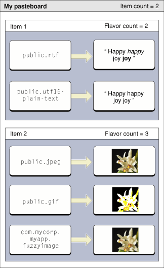

> 导航：[总目录](../../../README.md) · [documentation](../../../_indexes/documentation.md) · [Pasteboard Manager Programming Guide](Introduction%20to%20Pasteboard%20Manager%20Programming%20Guide.md)

[Next](Pasteboard%20Manager%20Tasks.md)[Previous](Introduction%20to%20Pasteboard%20Manager%20Programming%20Guide.md)

# Pasteboard Manager Concepts

This section describes the terminology and concepts that underlie pasteboards.

A pasteboard is a standardized mechanism for exchanging data within applications or between applications. The most familiar use for pasteboards is handling copy and paste operations. When a user selects data in an application and chooses the Copy (or Cut) menu item, the selected data is placed into the Clipboard pasteboard. When the user chooses the Paste menu item (either in the same or a different application), the data in the Clipboard is copied to the current application.

A pasteboard is analogous to a message board or bulletin board, which allows various people to exchange information asynchronously. Some bulletin boards, such as one in a household kitchen, may be accessible only to immediate family members. Others may be available to the public. Similarly, pasteboards may be public or private, and may be used for a variety of purposes.

Pasteboards exist in a special global memory area separate from application processes. Two special pasteboards exist:

- Clipboard. This is the pasteboard used to handle all copy-and-paste operations.
- Find. This is the pasteboard used to hold the current search string in Find operations.

In addition, the Drag Manager and Services Manager use pasteboards:

- When a user begins a drag, the drag data is added to a pasteboard. If the drag ends with a drop action, the receiving application retrieves the drag data from the pasteboard.
- If a translation service is requested, the requesting application places the data to be translated onto a pasteboard. The service retrieves this data, performs the translation, and places the translated data back onto the pasteboard.

The Pasteboard Manager is a more modern and robust replacement for the original Scrap Manager. While the Scrap Manager is currently still supported, you should update your applications to use the Pasteboard Manager instead. Some of the advantages of the Pasteboard Manager include:

- The ability to store multiple items at a time.
- More advanced flavor typing using uniform type identifiers (UTIs).
- Use of the more advanced Core Foundation memory model (rather than using `malloc`).

See [Scrap Manager Versus the Pasteboard Manager](Scrap%20Manager%20Versus%20the%20Pasteboard%20Manager.md#apple-f4xwc4dqnrsv64tfmyxwi33df52wszbpkridimbqgaytimzzfvbuqmrqgmwugsscjbdeqsse) for a listing of Scrap Manager functions and their suggested Pasteboard Manager replacements.

Each piece of data placed onto a pasteboard is considered a pasteboard item. Each item has a unique item ID associated with it. This item ID is arbitrarily determined by the application adding to the pasteboard and can be any value that lets the application keep track of the pasteboard data. For example, an item ID could be the memory address of the data, a hash table key, or simply an index value (0, 1,2 and so on.).

The pasteboard can hold multiple items. Applications can place or retrieve as many items as they wish. For example, say a user selection in a browser window contains both text and a GIF image. The Pasteboard Manager lets you copy the text and the image to the pasteboard as separate items. An application pasting multiple items can choose to take only those that is supports (the text, but not the image, for example).

Each item on the pasteboard can have one or more flavors. A flavor is simply an identifier indicating what type of data is available. For example, a flavor can identify a chunk of data as a JPEG file. Applications retrieving data from the pasteboard use flavors to determine which items they want to support. For example, an image editing program might support pasting of multiple image types (JPEG, TIFF, PICT, and so on) while a command line editor might only allow pasting of text.

The Pasteboard Manager uses uniform type identifiers (UTIs) to specify item flavors. A UTI is simply a Core Foundation string that uniquely identifies a particular data type. For more information, see _[Uniform Type Identifiers Overview](../../File%20Management/Uniform%20Type%20Identifiers%20Overview/Introduction%20to%20Uniform%20Type%20Identifiers%20Overview.md#apple-f4xwc4dqnrsv64tfmyxwi33df52wszbpkridimbqgaytgmjz)_ in Carbon Interapplication Communication documentation and `UTTypes.h` in the Launch Services framework.

Any item on a pasteboard may be represented by multiple flavors, to make it easier for whatever application wants to retrieve it. For example, an application may want to place both plain text and Unicode versions of a text selection on a pasteboard. Each flavor variant is stored with its own data, as shown in [Figure 1-1](#apple-f4xwc4dqnrsv64tfmyxwi33df52wszbpkridimbqgaytimzzfvbuqmrqgqwugsscjbauqrke).

__Figure 1-1__  Pasteboard items and data flavors

Flavors also have flags associated with them that specify additional useful information or properties. Some example flags are as follows:

- Only the application or process that added the flavor can see it. This flag is useful for indicating proprietary information that should only be handled wthin the owning application.
- The flavor is hidden from the public, but may be retrieved if the paste recipient specifically asks for it. A real-world analogy might be a special delicacy that isn’t listed on a restaurant menu. Customers “in the know” can request the dish, but the restaurant does not advertise it.
- The data associated with this flavor is promised. See [Promised Data](#apple-f4xwc4dqnrsv64tfmyxwi33df52wszbpkridimbqgaytimzzfvbuqmrqgqwueq2jijcecscf).
- The flavor is available through a translation service. That is, the flavor data does not currently exist, but an available flavor can be converted to this data type. See [Handling Translations Using Pasteboards](Pasteboard%20Manager%20Tasks.md#apple-f4xwc4dqnrsv64tfmyxwi33df52wszbpkridimbqgaytimzzfvbuqmrqgiwueqsdirbusssj) for more information.

Promised data is handled just like any other data added to the pasteboard, except that you don’t actually put the data there. You specify their flavors and flags as usual, but instead of adding the actual data, you add a promise to deliver the data at a later time.

For a real-world analogy, say you wanted to use a public bulletin board to give away some furniture. Because it is impractical to pin the individual tables, chairs, or sofas, to the board, you would instead post a note with your phone number advertising free furniture. Interested parties could then contact you and arrange for delivery or pickup of the items.

Similarly, you promise data to the pasteboard when placing the actual data is either impractical or time-consuming. For example, say your application places a JPEG image on the pasteboard. For maximum compatibility, it might be useful to add alternate flavors of the image as well (TIFF, GIF, and so on) to support applications that don’t support JPEGs. However, because the alternate data forms do not currently exist, it is more efficient to promise the alternate flavors rather than taking the overhead of generating them on the off chance that some application will want one. If a paste recipient wants the GIF version, your application can generate it after it is requested.

To honor a promise, an application must register a promise keeper callback function. When a paste recipient requests a promised flavor, your callback must then supply the actual data. If you have multiple promised items on the pasteboard, your promise keeper callback must be able to supply the data for any of the indicated promises.

[Next](Pasteboard%20Manager%20Tasks.md)[Previous](Introduction%20to%20Pasteboard%20Manager%20Programming%20Guide.md)

