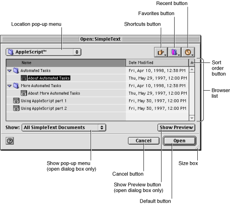
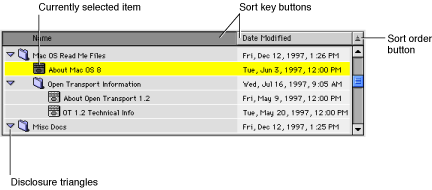
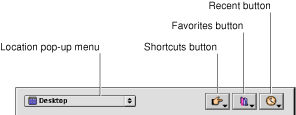
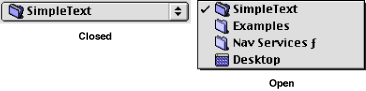
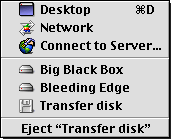
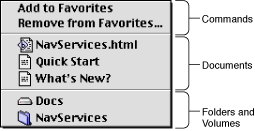
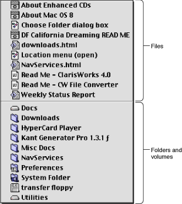

> 导航：[总目录](../../../README.md) · [documentation](../../../_indexes/documentation.md) · [Programming With Navigation Services in Mac OS 9](Introduction%20to%20Programming%20With%20Navigation%20Services%20in%20Mac%20OS%209.md)

[Next](Navigation%20Services%20Tasks.md)[Previous](Introduction%20to%20Programming%20With%20Navigation%20Services%20in%20Mac%20OS%209.md)

# Navigation Services Concepts

This chapter provides an overview of Navigation Services, a new suite of file browsing services for the Mac OS. You should read this chapter if you develop Mac OS applications which open or save files. You will find that Navigation Services is useful in new applications and updates of existing applications.

Navigation Services provides tools for you to implement a greatly enhanced user experience in the area of document management. One enhancement is the ability for users to select and open multiple files simultaneously. There are buttons that let users easily select mounted storage volumes, choose recently opened files and folders, or build their own list of favorite items. You can take advantage of translation services offered by the Translation Manager or opt for deferred translation, which gives your application the ability to save interim changes in a file’s native format and avoid the time-consuming task of translation until the user closes the document.

The enhanced functionality of Navigation Services is easy to adopt. Functions are simple and flexible; they are designed to help you avoid writing custom code. Navigation Services also provides automatic support for the Appearance Manager’s extended suite of dialog boxes and user controls to ensure a more consistent and comprehensible user interface across applications.

Starting with Mac OS 8.5, Navigation Services is built into the Mac OS System file.

Some extended features of Navigation Services require other components, as follows:

- QuickTime for viewing and creating previews of graphic documents. If QuickTime is not installed, the preview option is disabled unless you provide your own preview function.
- AppleGuide or Apple Help for online help.

The Standard File Package is supported in Mac OS 9 and earlier. You will obtain greater functionality and compatibility, however, by using Navigation Services in lieu of the Standard File Package. Using Navigation Services is required for you to make your applications compatible with Mac OS X, which does not support the Standard File Package.

Navigation Services provides an improved user interface for opening and saving documents. This user interface includes a host of easy-to-use features for browsing and managing the file system. Navigation Services dialog boxes include

- Open
- Save
- Choose a File
- Choose a Folder
- Choose a Volume
- Choose a File Object
- Create New Folder

Navigation Services provides two types of alert boxes:

- Save Change
- Discard Changes

All Open, Save, and Choose dialog boxes share some basic user interface elements. These include:

- a browser list
- a Location pop-up menu button
- Shortcuts, Favorites, and Recent bevel buttons
- a default (“action”) button
- a Cancel button
- a sort order button
- a size box

Figure 2-1 shows these elements used in an Open dialog box.

__Figure 1-1__   Standard dialog box elements

Navigation Services provides the browser list as the primary user access to the file system. The browser list contains a list box, sort buttons, and a scrolling list of files and folders in the directory currently being displayed (the current location). The browser list is similar to the Finder’s list view in Mac OS 8, as shown in [Figure 2-2](#apple-f4xwc4dqnrsv64tfmyxwi33df52wszbpkridimbqgaydsmzqfvbuqmrqgewugscdirdumske).

__Figure 1-2__  Browser list

When your application first displays a Navigation Services dialog box, the browser list shows the Desktop location unless you provide a default location. Each type that dialog box is opened afterwards, the browser list defaults (or rebounds) to the directory location in use when that particular dialog box was last closed. If a file or folder was selected when the dialog box was last closed, the selection is shown, if possible. If multiple files were selected when an Open dialog box was last closed, the first file in the selection becomes the default selection when the dialog box is next opened.

In the browser list, either the Name or Date field can be used as sort keys; the user chooses the sort key by clicking the appropriate bevel button in the list header. The sort order (either ascending or descending) can be toggled by clicking the arrow button at the far right of the header. Navigation Services remembers the sort key and sort ordering for each type of dialog box used by each application.

When the user expands the dialog box by using the size box, the browser list expands proportionally. The dates displayed in the browser list provide more information as the browser list expands:

- The smallest size uses the format <MM/DD/YY> (for US systems); for example, 7/16/97.
- If more space is available, the format expands to <DayOfWeek, MMM DD, YY, Time>; for example, Wed, Jul 16, 1997, 9:05 AM.
- The widest format features fully spelled-out names; for example, Wednesday, July 16, 1997, 9:05 AM.

Navigation Services can open multiple files from within the Open dialog box. Users can select multiple files by Shift-clicking within the browser list or using the Select All command. Navigation Services allows multiple selections of files only; folders or volumes are not eligible. If the user tries to extend a selection to include anything but files, Navigation Services treats the attempt as a simple selection; that is, the new object is selected and all previous selections are deselected.

The Location pop-up menu button and the Shortcut, Favorites, and Recent bevel buttons, shown in Figure 2-3, provide quick navigation tools.

__Figure 1-3__  Navigation options

The Location pop-up menu displays the current location and provides a familiar way to navigate the file system hierarchy. [Figure 2-4](#apple-f4xwc4dqnrsv64tfmyxwi33df52wszbpkridimbqgaydsmzqfvbuqmrqgewugscdirbeoq2i) shows the pop-up menu in its open and closed states.

__Figure 1-4__  Location pop-up menu in closed and open states

The Shortcuts bevel button activates a pop-up menu that allows quick navigation to any mounted volume or directly to the desktop. If ejectable volumes are mounted, an Eject command (one for each volume) appears at the bottom of the menu, as shown in [Figure 2-5](#apple-f4xwc4dqnrsv64tfmyxwi33df52wszbpkridimbqgaydsmzqfvbuqmrqgewugscdivbugrcd).

__Figure 1-5__  Shortcuts pop-up menu

Navigation Services 1.1 and later has two network connection options in the Shortcuts menu. The Network command displays all available AppleTalk zones in the browser list. The Connect to Server command displays a dialog box that prompts the user to enter a network address for an AppleShare server. The address can be entered as an IP address (“XXX.XXX.XXX.XXX”) or as a domain name (“sample.apple.com”).

The Favorites bevel button activates a pop-up menu of the user’s favorite documents, folders, and volumes, as shown in [Figure 2-6](#apple-f4xwc4dqnrsv64tfmyxwi33df52wszbpkridimbqgaydsmzqfvbuqmrqgewugscdircecr2f).

__Figure 1-6__  Favorites pop-up menu

The Favorites pop-up menu is divided into three sections. The top section contains two commands:

- Add to Favorites allows the user to add the item or items currently selected in the browser list to the Favorites menu. Items may be files, folders, volumes, servers or AppleTalk zones.
- Remove From Favorites opens a dialog box which allows the user to remove an item from the Favorites menu.

The second section contains a list of favorite documents set by the user. The third section contains a list of user-set favorite folders, volumes, and AppleTalk zones. These lists are available to all applications that use Navigation Services.

In an Open dialog box, Navigation Services displays favorite files and folders, but in a Save dialog box, only folders are displayed.

In an Open dialog box, the user can add an item to the Favorites menu by using the Add to Favorites command or by dragging the file or folder from the browser list or desktop to the Favorites bevel button. Users can remove items from the list with the Remove From Favorites command.

The Recent bevel button activates a pop-up menu of recently accessed documents, folders, and volumes, as shown in [Figure 2-7](#apple-f4xwc4dqnrsv64tfmyxwi33df52wszbpkridimbqgaydsmzqfvbuqmrqgewugscdircucr2k).

__Figure 1-7__  Recent pop-up menu

The Recent menu is divided into two sections; the first displays documents and the second displays folders and volumes. In an Open dialog box, Navigation Services displays favorite files and folders, but in a Save dialog box, only folders are displayed. The number of items in each section of the Recent menu will not exceed the number set in the Remember Recently Used Items section of the Apple Menu Options dialog box.

Navigation Services supports Standard File Package keyboard equivalents, as well as some new ones. Navigation Services keyboard equivalents and the actions they perform are listed below.

- Command-A: Select all (if Edit menu is enabled).
- Command-D or Shift–Command–Up Arrow: Changes current location to desktop.
- Command-N: Creates a new folder.
- Command-O: Opens the selected item.
- Option-Command-O (or press Option while clicking the Open button): Selects the referenced original of an alias item.
- Command-S: Activates Save button if present.
- Up Arrow, Down Arrow: Moves selection up or down in the currently selected scrolling list.
- Shift–Up Arrow and Shift–Down Arrow: Extends the current selection when multiple selection is enabled.
- Command–Up Arrow: Moves to the parent directory of the current location.
- Command–Down Arrow: Opens selected folder or volume.
- Command–Right Arrow: Opens disclosure triangle of selected folder or volume.
- Command–Left Arrow: Closes disclosure triangle of selected folder or volume.
- Option–Left Arrow: Displays previous location in historical sequence; similar to a Web browser’s “Back” command.
- Option–Right Arrow: Displays next location in historical sequence; similar to a Web browser’s “Forward” command.
- Return key, Enter key: Activates the default button (usually Save or Open).
- Tab: Moves to the next keyboard focus item.
- Escape or Command-period: Cancels and closes the dialog box.
- Home: Moves to the top of the scrolling list.
- End: Moves to the bottom of the scrolling list.
- Page-Up: Scrolls the browser list up one screen.
- Page-Down: Scrolls the browser list down one screen.

Persistence is the ability of Navigation Services to store information, such as the last directory location visited and the size and position of dialog boxes. This information is maintained on a per-application basis. For example, this allows the user to set an Open dialog box’s position and size differently for a word-processing application than for a spreadsheet, for example.

Navigation Services separates preferences for Open and Save dialog boxes so that each dialog box’s preferences are unique for each application. This allows a user to open documents from one folder and save new documents in another folder without any added navigation. Dialog boxes also remember the last document opened and makes this the default selection the next time the dialog box is used.

If the user navigates to the parent directory of the default location through the browser list or by using the location pop-up menu, the default location becomes the current selection.

The size, position, sort key, and sort order of dialog boxes are stored for each application. If a dialog box’s position has not been previously set or can’t be shown, the dialog box is displayed in the center of the main screen — that is, the one with the menu bar. Alert boxes do not store default locations or alert box size information.

[Next](Navigation%20Services%20Tasks.md)[Previous](Introduction%20to%20Programming%20With%20Navigation%20Services%20in%20Mac%20OS%209.md)

