> 导航：[总目录](../../../README.md) · [documentation](../../../_indexes/documentation.md) · [Programming With Navigation Services in Mac OS 9](Introduction%20to%20Programming%20With%20Navigation%20Services%20in%20Mac%20OS%209.md)


[Next](Document%20Revision%20History.md)[Previous](Navigation%20Services%20Concepts.md)

# Navigation Services Tasks

This chapter describes how you can use Navigation Services for tasks like opening and saving files and choosing file objects, and how you can implement custom features in Navigation Services dialog boxes. You should read this chapter to learn how to incorporate Navigation Services into your application.

Navigation Services is designed to provide a simple, flexible way for applications to open and save files. The primary way to open files is to call the `NavGetFile` function. The primary way to save files is to call the `NavPutFile` function.

The function `NavGetFile` displays an Open dialog box that prompts the user to select one or more files to open, as shown in Figure 3-1.

__Figure 2-1__  Open dialog box

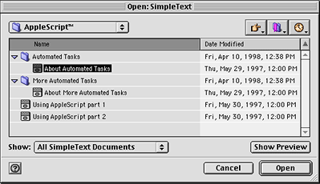

For a description of the elements of an Open dialog box, see [User Interface](Navigation%20Services%20Concepts.md#apple-f4xwc4dqnrsv64tfmyxwi33df52wszbpkridimbqgaydsmzqfvbuqmrqgewugscdircemssg).

The Open dialog box’s Show pop-up menu allows the user to choose the file types displayed by the browser list. The list of available file types is built from information provided by your application when it calls the `NavGetFile` function and by the Translation Manager. If you don’t want the Show pop-up menu button to be displayed, specify the `kNavNoTypePopup` constant in the `dialogOptionFlags` field of a structure of type `NavDialogOptions` when you pass this structure in the `dialogOptions` parameter of a file-opening function such as `NavGetFile`.

Navigation Services uses the Translation Manager to produce a list of file types that your application is capable of translating and displays the list to the user through an expanded Show pop-up menu. Figure 3-2 shows an example of a Show pop-up menu with file translation options.

__Figure 2-2__  A Show pop-up menu with file translation option

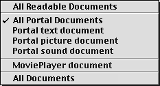

The first section of the Show menu contains an item called “All Readable Documents.” If the user selects this item, the browser list displays all files of the types shown in the second and third sections of the menu.

The second section of the Show menu contains an item called “All <app name> Documents” followed by your application’s “native” file types. Native file types are those types you provide in the `typeList` parameter of the file-opening function. This parameter uses the same format as an `'open'` resource and may be loaded from a resource or passed in as a `NavTypeList` structure created on the fly.

Your application must also contain a `'kind'` resource with entries for each type of file that you want to include in the `typeList` parameter. If you don’t provide an entry for a file type, Navigation Services returns a result of `kNavMissingKindStringErr` (-5699). For more information on `'kind'` resources, see _Inside Macintosh: More Macintosh Toolbox_.

Listing a file type in the `typeList` parameter generally limits you to displaying only those files created by your application. If you specify the `kNavNoTypePopup` constant in the `dialogOptionFlags` field of the `NavDialogOptions` structure you pass in the `dialogOptions` parameter, or if the user selects All Readable Items from the Show menu, Navigation Services will ignore the application signature specified in the `typeList` parameter and display all documents of the specified types. If you choose not to specify file types in the `typeList` parameter, you can show all files of a particular type in the browser list by using an application-defined filter function. Using a filter function would, for example, allow you to show all text files, regardless of which application created them. For more information on filter functions, see [Filtering File Objects](#apple-f4xwc4dqnrsv64tfmyxwi33df52wszbpkridimbqgaydsmzqfvbuqmrqgiwueqskineeissb).

The third section of the expanded Show pop-up menu contains a list of translatable file types provided by the Translation Manager. Typical names for these entries describe an application document type, such as “MoviePlayer document” in [Figure 3-2](#apple-f4xwc4dqnrsv64tfmyxwi33df52wszbpkridimbqgaydsmzqfvbuqmrqgiwueq2hi5eecq2j). Navigation Services automatically opens and translates file types recognized by the Translation Manager unless you supply the `kNavDontAutoTranslate` constant in the `dialogOptionFlags` field of the `NavDialogOptions` structure you pass in the `dialogOptions` parameter.

The last section of the pop-up menu is reserved for the “All Documents” menu item. This item appears if your application supplies the `kNavAllFilesInPopup` constant in the `dialogOptionFlags` field of the `NavDialogOptions` structure you pass in the `dialogOptions` parameter. This option allows the display of all files, regardless of your application’s ability to translate or open them directly. A resource editing application, for example, might take advantage of this option.

If the user selects a file type that is not passed in the `typeList` parameter, the chosen file must be translated. If the user opens a file called “Doc1” that requires translation, Navigation Services creates a new file called “Doc1 (converted)” with the appropriate file type, in the same directory as the original file. The `NavGetFile` function automatically performs the translation before returning. However, you can disable this feature by supplying the `kNavDontAutoTranslate` constant in the `dialogOptionFlags` field of the structure of type `NavDialogOptions` you pass in the `dialogOptions` parameter of the file-opening function. If you disable automatic translation, it is left to your application to call the function `NavTranslateFile` as needed.

You can obtain translation information from the structure of type `NavReplyRecord` that you passed in the `reply` parameter of the file-opening function. When the file-opening function returns, the `fileTranslation` field of the `NavReplyRecord` structure points to an array of translation records. This array contains one translation record for each file selection identified in the `selection` field of the `NavReplyRecord` structure. If you disable automatic translation, you can use the translation records to provide your own translation.

Listing 3-1 shows a sample function illustrating one way to call the function `NavGetFile`. This listing shows how to get default options, modify the options, use an `'open'` resource, and open multiple files.

__Listing 2-1__  A sample file-opening function

```
OSErr MyOpenDocument(const FSSpecPtr defaultLocationfssPtr)
{
    NavDialogOptions    dialogOptions;
    AEDesc              defaultLocation;
    NavEventUPP         eventProc = NewNavEventProc(myEventProc);
    NavObjectFilterUPP  filterProc =
                        NewNavObjectFilterProc(myFilterProc);
    OSErr               anErr = noErr;

    //  Specify default options for dialog box
    anErr = NavGetDefaultDialogOptions(&dialogOptions);
    if (anErr == noErr)
    {
        //  Adjust the options to fit our needs
        //  Set default location option
        dialogOptions.dialogOptionFlags |= kNavSelectDefaultLocation;
        //  Clear preview option
        dialogOptions.dialogOptionFlags ^= kNavAllowPreviews;

        // make descriptor for default location
        anErr = AECreateDesc(typeFSS, defaultLocationfssPtr,
                             sizeof(*defaultLocationfssPtr),
                             &defaultLocation );
        if (anErr == noErr)
        {
            // Get 'open' resource. A nil handle being returned is OK,
            // this simply means no automatic file filtering.
            NavTypeListHandle typeList = (NavTypeListHandle)GetResource(
                                        'open', 128);
            NavReplyRecord reply;

            // Call NavGetFile() with specified options and
            // declare our app-defined functions and type list
            anErr = NavGetFile (&defaultLocation, &reply, &dialogOptions,
                                eventProc, nil, filterProc,
                                typeList, nil);
            if (anErr == noErr && reply.validRecord)
            {
                //  Deal with multiple file selection
                long    count;

                anErr = AECountItems(&(reply.selection), &count);
                // Set up index for file list
                if (anErr == noErr)
                {
                    longindex;

                    for (index = 1; index <= count; index++)
                    {
                        AEKeyword   theKeyword;
                        DescType    actualType;
                        Size        actualSize;
                        FSSpec      documentFSSpec;

                        // Get a pointer to selected file
                        anErr = AEGetNthPtr(&(reply.selection), index,
                                            typeFSS, &theKeyword,
                                            &actualType,&documentFSSpec,
                                            sizeof(documentFSSpec),
                                            &actualSize);
                        if (anErr == noErr)
                        {
                            anErr = DoOpenFile(&documentFSSpec);
                        }
                    }
                }
                //  Dispose of NavReplyRecord, resources, descriptors
                anErr = NavDisposeReply(&reply);
            }
            if (typeList != NULL)
            {
                ReleaseResource( (Handle)typeList);
            }
            (void) AEDisposeDesc(&defaultLocation);
        }
    }
    DisposeRoutineDescriptor(eventProc);
    DisposeRoutineDescriptor(filterProc);
    return anErr;
}
```


Navigation Services provides functions that prompt the user to select file objects (files, folders, or volumes) or create a new folder.

The function `NavChooseFile` displays a dialog box that prompts the user to choose a file for some action other than opening. The file could be a preference file, dictionary, or other specialized file. Figure 3-3shows an example of this dialog box.

__Figure 2-3__  Choose a File dialog box

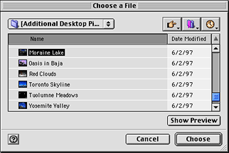

Since this is a simplified function, no built-in translation is available and no Show menu is available. By default, Navigation Services performs no filtering on the files it displays in the browser list. You need to provide file types in the `typeList` parameter or implement an application-defined filter function if you want to affect the file types displayed in the browser list. The `NavChooseFile` function ignores the `componentSignature` field of the `NavTypeList` structure, so all files of the types specified in the `typeList` parameter will be shown, regardless of their application signature. For more information on filtering options, see [Filtering File Objects](#apple-f4xwc4dqnrsv64tfmyxwi33df52wszbpkridimbqgaydsmzqfvbuqmrqgiwueqskineeissb).

You can provide a message or “banner” in the Choose File dialog box by supplying a string in the `message` field of the structure of type `NavDialogOptions` that you pass in the `dialogOptions` parameter of the `NavChooseFile` function. This string is displayed below the browser list. If you do not supply a string, no message is displayed.

The function `NavChooseFolder` displays a dialog box that prompts the user to choose a folder, as shown in Figure 3-4. This could be useful when performing installations, for example.

__Figure 2-4__  Choose a Folder dialog box


The browser list in a Choose a Folder dialog box displays folders and volumes only.

One possible source of confusion to users who wish to use keyboard equivalents in a list-based file system browser is the purpose of the Enter or Return keys: do they select a folder or do they open it? Navigation Services resolves this issue by mapping the Return and Enter keys to the Open button, which is used to navigate into folders. After navigating to the desired location, the user clicks the Choose button to select the folder.

You can provide a message or “banner” in the Choose a Folder dialog box by supplying a string in the `message` field of the structure of type `NavDialogOptions` that you pass in the `dialogOptions` parameter of the `NavChooseFolder` function. This string is displayed below the browser list. In Figure 3-4, for example, the application supplies the string, “Please select a folder.” If you do not supply a string, no message is displayed.

The function `NavChooseVolume` displays a dialog box that prompts the user to choose a volume, as shown in Figure 3-5.

__Figure 2-5__  Choose a Volume dialog box

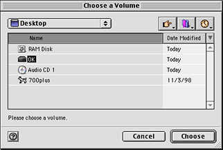

This function is useful when you want the user to select a volume or storage device.

You can provide a message or “banner” in the Choose a Volume dialog box by supplying a string in the `message` field of the structure of type `NavDialogOptions` that you pass in the `dialogOptions` parameter of the `NavChooseVolume` function. This string is displayed below the browser list. For example, a disk repair utility might supply a message like “Please choose a volume to repair.” If you do not supply a string, no message is displayed.

The function `NavChooseObject` displays a dialog box that prompts the user to select a file object, as shown in Figure 3-6.

__Figure 2-6__  Choose Object dialog box

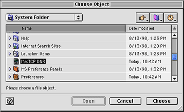

This function is useful when you need the user to select an object that might be one of several different types. If you need to have the user select an object of a specific type, you should use the function appropriate to that type. For example, if you know the object is a file, use the function `NavChooseFile`.

You can provide a message or “banner” in the Choose Object dialog box by supplying a string in the `message` field of the structure of type `NavDialogOptions` that you pass in the `dialogOptions` parameter of the `NavChooseObject` function. This string is displayed below the browser list. In <xRefNoLink>Figure 3-6, for example, the application supplies the string, “Please choose a file object.” If you do not supply a string, no message is displayed.

The function `NavNewFolder` displays a dialog box that prompts the user to create a new folder, as shown in Figure 3-7.

__Figure 2-7__  New Folder dialog box

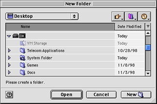

You can provide a message or “banner” in the New Folder dialog box by supplying a string in the `message` field of the structure of type `NavDialogOptions` that you pass in the `dialogOptions` parameter of the `NavNewFolder` function. This string is displayed below the browser list. For example, the Sampler installer might provide a message like “Create a folder to install Sampler.” If you do not supply a string, no message is displayed.

The function `NavPutFile` displays a Save dialog box, as shown in Figure 3-8.

__Figure 2-8__  Save dialog box

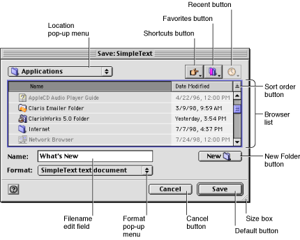

Users can create a new folder for saving a document by using the New Folder button.

When the user selects a folder, the default button title toggles from Save to Open. When the user selects the editable text field (by clicking or keyboard selection), the default button title reverts to Save.

Save dialog boxes display a focus ring to indicate whether the browser list or the editable text field has keyboard focus (that is, the area that receives all keystrokes.) When no filename is displayed in the editable text field, the Save button is disabled.

The `NavPutFile` function provides the Format pop-up menu button to allow users to choose how a new document or a copy of a document is to be saved. Figure 3-9 shows an example of this menu.

__Figure 2-9__  Format pop-up menu

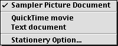

The first item in the Format pop-up menu is defined by the document type specified by your application in the `fileType` and `fileCreator` parameters of the`NavPutFile` function. The name of the menu item is obtained from the Translation Manager. After setting this item, Navigation Services calls the Translation Manager to determine whether to display subsequent menu items describing alternative file types. For more information, see [Translating Files on Save](#apple-f4xwc4dqnrsv64tfmyxwi33df52wszbpkridimbqgaydsmzqfvbuqmrqgiwueqskinceosch).

The last item in the menu is the Stationery Option command. This displays the Stationery Option dialog box, shown in Figure 3-10, which lets the user specify whether a new document or a copy of a document should be saved as a document or as stationery.

__Figure 2-10__  Stationery Option dialog box

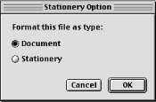

Your application supplies its default file type and creator for saved files to the function `NavPutFile`. Navigation Services uses this information to build a pop-up menu of available translation choices obtained from the Translation Manager. If the user selects an output file type that is different from the native type, Navigation Services prepares a translation specification and supplies a handle to it in the `fileTranslation` field of a structure of type `NavReplyRecord`. If you choose to provide your own translation, Navigation Services informs you that translation is required by setting the translationNeeded field of the `NavReplyRecord`structure to `true`.

When saving a document for the first time, your application should wait until the user closes the document before calling the `NavCompleteSave` function. This allows your application to save the file in a native format as the user works with the file. When saving a copy of a document, your application should call the `NavCompleteSave` function immediately after returning from the `NavPutFile` function.

The `NavCompleteSave` function provides any necessary translation. If you wish to turn off automatic translation during a save operation, set the value of the translationNeeded field of the `NavReplyRecord`structure to `false` before you call the `NavCompleteSave` function.

Once the save is completed, your application must dispose of the `NavReplyRecord` structure by calling the function `NavDisposeReply`.

By default, the `NavPutFile` function saves translations as a copy of the original file. Your application can direct Navigation Services to replace the original with the translation by passing the kNavTranslateInPlace constant, described in Translation Option Constants, in the `howToTranslate` parameter of the `NavCompleteSave` function.

Listing 3-2 illustrates how to save files by using the function `NavPutFile`. The sample listing also shows how to set options and register your event-handling function. Note that this function uses a `DoSafeSave` function to ensure that the save is completed without error before an existing file is deleted.

__Listing 2-2__  A sample file-saving function

```
OSErr MySaveDocument(WindowPtr theDocument)
{
    OSErr                   anErr = noErr;
    NavReplyRecord                  reply;
    NavDialogOptions                    dialogOptions;
    OSType                  fileTypeToSave = 'TEXT';
    OSType                  creatorType = 'xAPP';
    NavEventUPP             eventProc = NewNavEventProc(myEventProc);

    anErr = NavGetDefaultDialogOptions(&dialogOptions);
    if (anErr == noErr)
    {
        //  One way to get the name for the file to be saved.
        GetWTitle(theDocument, dialogOptions.savedFileName);

        anErr = NavPutFile( nil, &reply, &dialogOptions, eventProc,
                            fileTypeToSave, creatorType, nil);
        if (anErr == noErr   &&  reply.validRecord)
        {
            AEKeyword           theKeyword;
            DescType            actualType;
            Size            actualSize;
            FSSpec          documentFSSpec;

            anErr = AEGetNthPtr(&(reply.selection), 1, typeFSS,
                                &theKeyword, &actualType,
                                &documentFSSpec, sizeof(documentFSSpec),
                                &actualSize );
            if (anErr == noErr)
            {
                if (reply.replacing)
                {
                    // Make sure you save a temporary file
                    // so you can check for problems before replacing
                    // an existing file. Once the save is confirmed,
                    // swap the files and delete the original.
                    anErr = DoSafeSave(&documentFSSpec, creatorType,
                                        fileTypeToSave, theDocument);
                }
                else
                {
                    anErr = WriteNewFile(&documentFSSpec, creatorType,
                                         fileTypeToSave, theDocument);
                }

                if ( anErr == noErr)
                {
                    // Always call NavCompleteSave() to complete
                    anErr = NavCompleteSave(&reply,
                                            kNavTranslateInPlace);
                }
            }
            (void) NavDisposeReply(&reply);
        }
        DisposeRoutineDescriptor(eventProc);
    }
    return anErr;
}
```


Navigation Services allows you to display a standard alert box for saving changes or quitting an application, and to customize this alert box for other uses.

To display a standard Save Changes alert box, your application passes its name and the document title to the function `NavAskSaveChanges`, which displays the alert box shown in Figure 3-11.

__Figure 2-11__  Standard Save Changes alert box

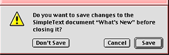

After the user closes the Save Changes alert box, Navigation Services tells your application which button the user clicked by returning one of the `NavAskSaveChangesResult` constants, as described in Save Changes Action Constants.

You can display a customized Save Changes alert box by using the function `NavCustomAskSaveChanges`. Figure 3-12shows an example of a customized Save Changes alert box.

__Figure 2-12__  Custom Save Changes alert box

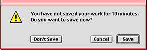

You must provide the message to be displayed in a custom Save Changes alert box by specifying a string in the message field of a `NavDialogOptions` structure.

If your application has a Revert to Saved or similar item in its File menu, Navigation Services provides an alert box to handle this situation, as shown in Figure 3-13. This alert box is created by calling the function `NavAskDiscardChanges`.

__Figure 2-13__  Discard Changes alert box

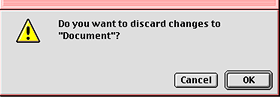

After the user closes the alert box, Navigation Services tells your application which button the user clicked by returning one of the `NavAskDiscardChangesResult` constants, as described in Discard Changes Action Constants.

You can add or change a number of features in Navigation Services dialog boxes.

- You can provide a user prompt or banner, which describes the action performed by the dialog box.
- You can change the action button title.
- You can change the Cancel button title.
- You can preset a dialog box’s location on screen.
- You can change the window title of the dialog box.
- You can provide an application-defined event-handling function (to provide movable and resizable dialog boxes).
- You can provide an application-defined filter function (to determine which file objects are displayed in pop-up menus or the browser list).
- You can provide an application-defined file preview function.

You can set dialog box options by setting values in a structure of type `NavDialogOptions`.

Navigation Services maintains default location information for dialog boxes. The default location is the folder or volume whose contents will be displayed in the browser list when a dialog box is first displayed. You can override the default location and selection of any Navigation Services dialog box by passing a pointer to an Apple event descriptor (`AEDesc`) structure for the new location in the `defaultLocation` parameter of the appropriate function. This `AEDesc` structure is normally of type `'typeFSS'` describing a file, folder, or volume.

To select the default location instead of displaying it, supply the `kNavSelectDefaultLocation` constant in the `dialogOptionFlags` field of the structure of type NavDialogOptions you specify in the `dialogOptions` parameter of a Navigation Services function such as `NavGetFile`. For example, if you pass an `AEDesc` structure describing the System Folder in the `defaultLocation` parameter of the `NavGetFile` function, Navigation Services displays an Open dialog box with the System Folder as the default location. If you pass the same value to the `NavGetFile` function and supply the `kNavSelectDefaultLocation` constant in the `dialogOptionFlags` field of the `NavDialogOptions` structure, the Open dialog box shows the startup volume as the default location with the System Folder selected.

If you pass `NULL` for the `AEDesc` structure, or attempt to pass an invalid `AEDesc` structure, Navigation Services 1.1 and later displays the desktop as the default location.

Several Navigation Services functions return `AEDesc` structures describing objects from the network or the file system. You must not assume that an `AEDesc` structure is of any particular type. If your application requires a particular type of `AEDesc` structure, you should attempt to coerce the structure using the Apple Event Manager function `AECoerceDesc`. For more information on coercing Apple event descriptors, see _Inside Macintosh: Interapplication Communication_.

When Navigation Services passes you an `AEDesc` structure of type `'typeCString'`, the structure describes a network object by using a Uniform Resource Locator (URL). Network objects can be AppleTalk zones, AppleShare servers, or (in Navigation Services 2.0 or later) other network services like FTP or HTTP. For example, an AppleTalk zone called “Building 1 - 3rd floor” would be represented by a URL of `'at://Building 1 - 3rd floor'`. An AppleShare server called “Mac Software” in the same zone would be represented by a URL of `'afp:/at/Mac Software:Building 1 - 3rd floor'`.

If Navigation Services passes you an `AEDesc` structure of descriptor type `'typeFSS'` describing a directory, the directory’s file specification contains an empty `name` field and its `parID` field contains the directory ID. If an `AEDesc` structure of type `'typeFSS'` describes a file, its file specification’s `name` field contains the filename and its `parID` field contains the directory ID of the file’s parent directory. This means you can use the `name` field to determine whether an object is a file or a folder.

If you need to determine the ID of a directory’s parent directory, use the File Manager function `PBGetCatInfo`, described in _Inside Macintosh: Files_.

Mac OS 9 introduces the concept of packages. Packages are file objects that combine an application or document with supporting files in a container. By default, Navigation Services does not display packages in the browser list; if you want your application to recognize packages, specify the `kNavSupportPackages` constant in the `dialogOptionFlags` field of the `NavDialogOptions` structure that you pass in the `dialogOptions` parameter of various Navigation Services functions. If you want your application to be able to navigate packages, specify the `kNavAllowOpenPackages` constant in the same way. Package support is available in Navigation Services 2.0 and later.

The process of choosing which files, folders, and volumes to display in the browser list or the pop-up menus is known as object filtering. If your application needs simple, straightforward object filtering, pass a pointer to a structure of type NavTypeList to the appropriate Navigation Services function. If you desire more specific filtering, Navigation Services lets you implement an application-defined filter function. Filter functions give you more control over what can and can’t be displayed; for example, your function can filter out non-HFS objects. You can use both a NavTypeList structure and a filter function if you wish, but keep in mind that your filter function is directly affected by the `NavTypeList` structure. For example, if the `NavTypeList` structure contains only `'TEXT'` and `'PICT'` types, only files of those types are passed into your filter function. Also, your filter function can filter out file types that are defined in your `NavTypeList` structure. Make sure you don’t accidentally exclude items you wish to display by creating conflicts between your type list and filter function.

Navigation Services tells you which dialog box control was used for each call to your filter function, so you can implement different criteria for each control. You might choose to limit the Desktop button to displaying specific volumes, for example, or to restrict navigation through the Location pop-up menu. The default location and selections can also be filtered. For more information on implementing a filter function, see [Providing Custom Object Filtering](#apple-f4xwc4dqnrsv64tfmyxwi33df52wszbpkridimbqgaydsmzqfvbuqmrqgiwueqskirbeuscf).

The function `NavGetFile` displays a Show pop-up menu that lists your application's native types as well as translatable file types. If the user chooses a translatable file type, Navigation Services ignores your `NavTypeList` structure and responds only to your filter function. For more information on the Show pop-up menu, see [Providing File Opening Options](#apple-f4xwc4dqnrsv64tfmyxwi33df52wszbpkridimbqgaydsmzqfvbuqmrqgiwueqskincucsck).

The function `NavPutFile` displays a Format pop-up menu that displays the save format options, the application’s native types, and the file types that can translated. This pop-up menu selection does not affect filtering of the browser list; it determines the file format used to save the final document.

This section gives some examples to help explain how filtering works in the Show pop-up menu. For purposes of illustration, assume the following:

- The application Sampler can open files of type '`TEXT`' and '`PICT`'.
- Sampler passes to the `NavGetFile` function a structure of type `NavTypeList` that contains these two file types as well as Sampler’s application signature.
- Sampler implements a kind string for each of these native file types.
- Sampler specifies the `kNavDontAddTranslateItems` constant in the `dialogOptions` field in the structure of type `NavDialogOptions` that it passes in the `dialogOptions` parameter of the `NavGetFile` function.

The Show pop-up menu contains the items shown in Figure 3-14. Note that the menu does not contain a translatable file section.

__Figure 2-14__  A Show pop-up menu without a translatable file section

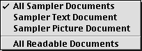

The user can select the All Readable Documents command to display all of Sampler’s native file types at once.

If Sampler specifies the `kNavNoTypePopup` constant in the `dialogOptions` field, no Show pop-up menu appears and Sampler’s `NavTypeList` structure and filter function determine any filtering. If Sampler passes `NULL` to the `NavGetFile` function in place of a reference to the `NavTypeList` structure, the Show pop-up menu does not appear (regardless of the dialog options) and Sampler’s application-defined filter function is the only determining filter. If Sampler doesn’t provide a filter function, all files are displayed.

In the next example, assume the following:

- The application Portal can open files of type '`TEXT`', '`PICT`', and '`MooV`'.
- Portal has a structure of type `NavTypeList` containing these three file types as well as its application signature.
- Portal provides kind strings for each of these native file types.
- Portal supplies the `kNavAllFilesInPopup` constant in the `dialogOptions` field of the `NavDialogOptions` structure. This adds the All Documents item at the bottom of the menu.
- Portal does not supply the `kNavDontAddTranslateItems` constant in the `dialogOptions` field of the `NavDialogOptions` structure.

In this case, the Show pop-up menu appears as shown in <xRefNoLink>Figure 3-15.

__Figure 2-15__  A Show pop-up menu with a translatable files section


The third section of the Show menu shows file types that the Translation Manager can translate into one of Portal’s three native file types.

Under Navigation Services 1.1 or later, if the user chooses the All Readable Documents menu item, Navigation Services displays all native and translatable file types, regardless of which application created them. If the user chooses the All Documents menu item, the browser list shows all file types, regardless of whether Portal has identified them as translatable or not.

If your application needs to refresh the list of file objects in the browser before exiting a function such as `NavGetFile`, follow these steps if you are using a version of Navigation Services earlier than 2.0:

1. Supply the `kNavCtlGetLocation` constant in the `selector` parameter of the function `NavCustomControl` to obtain the current location.
2. Pass the current location in the `parms` parameter of `NavCustomControl` and supply the `kNavCtlSetLocation` constant in the `selector` parameter of `NavCustomControl`.

Getting and setting the current location causes Navigation Services to rebuild the browser list.

Navigation Services 2.0 and later provides the `kNavCtlBrowserRedraw` constant that you can specify in the the `selector` parameter of the function `NavCustomControl` to force the browser list to be refreshed.

Navigation Services provides a preview area in all dialog boxes that open files. This area can be toggled on or off by the user. If the preview area is visible, Navigation Services automatically displays a preview of any file that contains a valid QuickTime component of type `'pnot'`. Under Navigation Services 2.0 or later, you can call the NavCreatePreview function to create a preview. You can request automatic preview display by setting the `kNavAllowPreviews` constant in the `dialogOptionFlags` field of the structure of type NavDialogOptions that you pass in the `dialogOptions` parameter of the file-opening function. (This option is set by default.) You can provide your own preview function and add custom controls to the preview area, as well. For more information on preview functions, see [Drawing Custom Previews](#apple-f4xwc4dqnrsv64tfmyxwi33df52wszbpkridimbqgaydsmzqfvbuqmrqgiwueqskirbuescb). For more information on `'pnot'` resources, see _Inside Macintosh: QuickTime Components_.

The Show pop-up menu displayed in Open dialog boxes and the Format pop-up menu displayed in Save dialog boxed are known collectively as type pop-up menus. If your application needs to add its own menu items to one of the type pop-up menus, use a structure of type `NavMenuItemSpec` to describe each menu item to add. This allows you to add specific document types to be opened or saved, or different ways of saving a file (with or without line breaks, as HTML, and so forth). To set your menu items, add a handle to one or more `NavMenuItemSpec` structures to the `popupExtension` field in the structure of type `NavDialogOptions` that you pass in the `dialogOptions` parameter of the appropriate function. If you provide a `NavMenuItemSpec` structure, you must also provide an event-handling function and an object filtering function. Navigation Services will not handle your custom menu items, so if you do not provide these application-defined functions and attempt to use a `NavMenuItemSpec` structure, Navigation Services functions return a result of `paramErr`(-50). For more information, see [Creating Application-Defined Functions](#apple-f4xwc4dqnrsv64tfmyxwi33df52wszbpkridimbqgaydsmzqfvbuqmrqgiwueqskijbuussk).

You are not required to provide a value in the `menuItemName` field of the `NavMenuItemSpec` structure, but Navigation Services uses this value, if it is available, as a search key. If you choose not to provide a value for this field, make sure to set it to an empty string.

To handle and examine a selected pop-up menu item, respond to the `kNavCBPopupMenuSelect` constant, described in Custom Control Setting Constants, when Navigation Services calls your application’s event-handling function. Navigation Services provides information about the selected menu item in a structure of type `NavCBRec` passed in the `callBackParms` parameter of your event-handling function. The `param` field of the `NavCBRec` structure points to a structure of type NavMenuItemSpec describing the menu item. Your application can respond to a particular menu item by comparing the `type` and `creator` fields, for example.

You can set the Show pop-up menu so that it displays only custom items during a call to a file-opening function such as `NavGetFile`, for instance. The procedure is as follows:

1. Define your custom menu items by using structures of type `NavMenuItemSpec`.
2. Specify a handle to the `NavMenuItemSpec` structures in the `popupExtension` field of the structure of type `NavDialogOptions` that you pass in the `dialogOptions` parameter.
3. Pass `NULL` in the `typeList` parameter. If you pass any file types in the `typeList` parameter, Navigation Services will place its own items in the pop-up menu.
4. Set your filter function to display only your custom items in the pop-up menu.
5. Ensure that your event-handling function takes care of any selection made from the pop-up menu.

If your application tries to extend the Show pop-up menu and does not provide an event-handling function, Navigation Services functions return a result of `paramErr` (-50). If you add menu items that require filtering, you must implement a filter function. For more information, see [Filtering File Objects](#apple-f4xwc4dqnrsv64tfmyxwi33df52wszbpkridimbqgaydsmzqfvbuqmrqgiwueqskineeissb).

You can set the Format pop-up menu so that it displays only custom items during a call to the `NavPutFile` function. The procedure is as follows:

1. Define your custom menu items by using structures of type `NavMenuItemSpec`.
2. Specify a handle to the NavMenuItemSpec structures in the `popupExtension` field of the structure of type NavDialogOptions that you pass in the `dialogOptions` parameter.
3. Set your filter function to display only your custom items in the pop-up menu.
4. Ensure that your event-handling function takes care of any selection made from the pop-up menu.
5. Pass the `kNavGenericSignature` constant in the `fileCreator` parameter of the `NavPutFile` function.
6. If you don’t want the Stationery Option menu item to appear, clear the `kNavAllowStationery` constant in the `dialogOptions` field of the `NavDialogOptions` structure you pass to the `NavPutFile` function.

The Navigation Services programming interface handles most common situations that demand interface customization when using the Standard File Package. If you look through all the features and find that you still need to provide custom controls in a Navigation Services dialog box, perform the following steps:

1. Implement an event-handling function to communicate with Navigation Services while Open or Save dialog boxes are open. For more information, see [Handling Events](#apple-f4xwc4dqnrsv64tfmyxwi33df52wszbpkridimbqgaydsmzqfvbuqmrqgiwueqskinfekqkb).
2. Respond to the `kNavCBCustomize` constant, described in Event Message Constants, which your application can obtain from the `param` field of the structure of type `NavCBRec` pointed to in the `callBackParms` parameter of your event-handling function. The `customRect` field of the `NavCBRec` structure defines a rectangle in the local coordinates of the window; the top-left coordinates define the anchor point for the customization rectangle, which is the area Navigation Services provides for your application to add custom dialog box items. Your application responds by setting the values which complete the dimensions of the customization rectangle you require in the `customRect` field of the `NavCBRec` structure. After your application responds and exits from the event-handling function, Navigation Services inspects the `customRect` field to determine if the requested dimensions result in a dialog window that can fit on the screen. If the resulting window dimensions are too large, then Navigation Services responds by setting the rectangle to the largest size that can be accommodated and notifying your application with the `kNavCBCustomize` constant again. Your application can continue to negotiate with Navigation Services by examining the `customRect` field and requesting a different size until Navigation Services provides an acceptable rectangle value. The minimum dimensions for the customization area are 400 pixels wide by 40 pixels high on a 600 x 400 pixel screen. If you are designing for a minimum screen size of 640 x 480 or larger, you can assume a larger minimum customization area.
3. After a customization rectangle has been established, your application must check for the `kNavCBStart` constant in the `param` field of the NavCBRec structure. This constant indicates that Navigation Services is opening the dialog box. After you obtain this constant, you can add your interface elements to the customization rectangle. The simplest way to do this is to provide a `'DITL'` resource (in local coordinates, relative to the anchor point of the customization rectangle) and pass the `kNavCtlAddControlList` constant in the `selector` parameter of the function `NavCustomControl`. <xRefNoLink>Listing 3-3 illustrates one way to do this.

   __Listing 2-3__  Adding a custom 'DITL' resource

```swift
gDitlList = GetResource ('DITL', kControlListID);
theErr = NavCustomControl(callBackParms->context,
        kNavCtlAddControlList, gDitlList);
```

The advantage of using a `'DITL'` resource is that the Dialog Manager handles all control movement and tracking.

You can also draw a single control by calling the Control Manager function `NewControl` and passing the `kNavCtlAddControl` constant, described in Custom Control Setting Constants, in the `selector` parameter of the function `NavCustomControl`. <xRefNoLink>Listing 3-4 illustrates this approach.

__Listing 2-4__  Adding a single custom control

```swift
gCustomControl = NewControl (callBackParms->window, &itemRect,
                "\pcheckbox", false, 1, 0, 1, checkBoxProc, NULL);
theErr = NavCustomControl (callBackParms->context, kNavCtlAddControl,
                            gCustomControl);
```

If you call `NewControl`, you must track the custom control yourself.

4. Navigation Services supplies the `kNavCBTerminate` constant in the `param` field of the `NavCBRec` structure after the user closes the dialog box. Make sure you check for this constant, which is your signal to dispose of your control or resource.

In Navigation Services 2.0 and later, you can block certain user navigation actions such as file opening and saving by passing the `kNavCtlSetActionState` constant in the selector parameter of the function `NavCustomControl` and one or more of the values defined by the `NavActionState` enumeration (described in Action State Constants) in the `parms` parameter. This is useful when you want to prevent a dialog box from being dismissed until certain conditions are met, for example.

The actions you can block include:

1. Opening files
2. Saving files
3. Choosing file objects
4. Creating new folders

In the following example, the `kNavDontOpenState` constant is used to disable the Open button in an Open dialog box:

```
NavAction newState = kNavDontOpenState;
NavCustomControl( context, kNavCtlSetActionState, &newState );
```

In the next example, the `kNavDontChooseState` constant is used in addition to the `kNavDontOpenState` constant. During a call to the `NavChooseFolder` function, for example, this disables the Open and Choose buttons:

```
NavCustomControl( context, kNavCtlSetActionState, kNavDontOpenState +                 kNavDontChooseState);
```

In the final example, we add the `kNavDontNewFolderState`  constant to disable the Open, Choose, and New Folder buttons during a call to the `NavNewFolder` function:

```
NavCustomControl( context, kNavCtlSetActionState, kNavDontOpenState +                 kNavDontChooseState + kNavDontNewFolderState );
```

If you block a user action by passing one or more of the `NavActionState` constants, make sure you set the `kNavNormalState` constant before exiting in order to restore the default state. If you fail to set the `kNavNormalState` constant, the user may be unable to dismiss the dialog box.

You can implement application-defined functions to intercept and handle events, provide custom view filtering, and draw custom previews.

To respond to events generated by the user and Navigation Services, you can create an event-handling function, described in this document as `MyEventProc`. You register your event-handling function by passing a Universal Procedure Pointer (UPP) in the `eventProc` parameter of a Navigation Services function such as `NavGetFile`. You obtain this UPP by calling the macro `NewNavEventProc` and passing a pointer to your event-handling function. If an event occurs while the Open dialog box is displayed, for example, the `NavGetFile` function will call your event-handling function. In the `callBackParms` parameter of your event-handling function, `NavGetFile` supplies a structure of type `NavCBRec`. This structure contains the information your application needs to respond to the event. For instance, your application can obtain the event record describing the event to be handled from the pointer in the `event` field of the `NavCBRec` structure.

When calling your event-handling function, Navigation Services passes only the update events that apply to your windows and only the mouse-down events that occur in the preview or customization areas.

You are strongly encouraged to provide at least a simple function to handle update events. If you do this, Navigation Services dialog boxes automatically become movable and resizable. <xRefNoLink>Listing 3-5 shows an example of such a function.

__Listing 2-5__  A sample event-handling function

```swift
pascal void myEventProc(NavEventCallbackMessage callBackSelector,
                        NavCBRecPtr callBackParms,
                        NavCallBackUserData callBackUD)
{
    WindowPtr window =
                    (WindowPtr)callBackParms->eventData.event->message;
    switch (callBackSelector)
    {
        case kNavCBEvent:
            switch (((callBackParms->eventData)
                    .eventDataParms).event->what)
            {
                case updateEvt:
                    MyHandleUpdateEvent(window,
                        (EventRecord*)callBackParms->eventData.event);
                    break;
            }
            break;
    }
}
```

In your event-handling function, you can also call the function `NavCustomControl` to control various aspects of dialog boxes. For example, the following line shows how you can determine whether the preview area is currently showing:

```
NavCustomControl(context, kNavCtlIsPreviewShowing, &isShowing);
```

If you extend the type pop-up menus with custom menu items, Navigation Services expects your event-handling function to respond to these items. For more information, see [Customizing Type Pop-up Menus](#apple-f4xwc4dqnrsv64tfmyxwi33df52wszbpkridimbqgaydsmzqfvbuqmrqgiwueqskivbesrke).

Navigation Services notifies you before displaying items in the following areas:

- Location pop-up menu
- browser list
- Favorites menu
- Recent menu
- Shortcuts menu

You can take advantage of this notification process by creating a filter function, described in this document as `MyFilterProc`, to determine which items are displayed. Register your filter function by passing a Universal Procedure Pointer (UPP) in the `filterProc` parameter of a Navigation Services function such as `NavGetFile`. You obtain this UPP by calling the macro `NewNavObjectFilterProc` and passing a pointer to your filter function. When calling your filter function, Navigation Services provides detailed information on HFS files and folders via a structure of type `NavFileOrFolderInfo`. Your filter function specifies which file objects to display to the user by returning `true` for each object you wish to display and `false` for each object you do not wish to display. If your filter function does not recognize an object, it should return `true` and allow the object to be displayed.

<xRefNoLink>Listing 3-6 illustrates a sample filter function that allows only text files to be displayed.

__Listing 2-6__  A sample filter function

```swift
pascal Boolean myFilterProc(AEDesc* theItem, void* info,
                            NavCallBackUserData callBackUD,
                            NavFilterModes filterMode)
{
    OSErr theErr = noErr;
    Boolean display = true;
    NavFileOrFolderInfo* theInfo = (NavFileOrFolderInfo*)info;

    if (theItem->descriptorType == typeFSS)
        if (!theInfo->isFolder)
            if (theInfo->fileAndFolder.fileInfo.finderInfo.fdType
                != 'TEXT')
                display = false;
    return display;
}
```

For more information on object filtering options, see [Filtering File Objects](#apple-f4xwc4dqnrsv64tfmyxwi33df52wszbpkridimbqgaydsmzqfvbuqmrqgiwueqskineeissb).

By default, Navigation Services draws a preview in the Open dialog box when a file selected in the browser list contains a valid `'pnot'` component. To override how previews are drawn and handled, you can create a preview-drawing function, as described in MyPreviewProc. You register your preview-drawing function by passing a Universal Procedure Pointer (UPP) in the `previewProc` parameter of a Navigation Services function such as NavGetFile. You obtain this UPP by calling the macro `NewNavPreviewProc` and passing a pointer to your preview-drawing function. When the user selects a file, Navigation Services calls your preview-drawing function. Before you attempt to create a custom preview, your application should determine whether previews are enabled by specifying the `kNavCtlIsPreviewShowing` constant in the `NavCustomControlMessages` parameter of the function `NavCustomControl`.

Your preview-drawing function obtains information from a structure of type `NavCBRec` specified in the `callBackParms` parameter of your event-handling function. The `NavCBRec` structure contains the following information:

- The `eventData` field contains a structure of type `NavEventData` describing the file to be previewed. This structure provides an Apple event descriptor list (`AEDescList`) that you must be able to coerce into a file specification (`FSSpec)`. If you cannot coerce the `AEDescList` into a valid `FSSpec`, the object is not a file and you should not attempt to create a preview.
- The `previewRect` field describes the preview area, which is the section of the dialog box reserved for preview drawing.
- The `window` field identifies the window to draw in.

Once you have determined that previews are enabled, your preview-drawing function should draw the custom preview in the specified area and return a function result of `true`. If you don’t want to draw a preview for a given file, be sure to return a function result of `false`.

[Next](Document%20Revision%20History.md)[Previous](Navigation%20Services%20Concepts.md)

