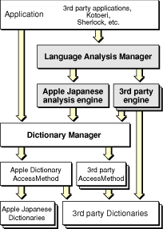
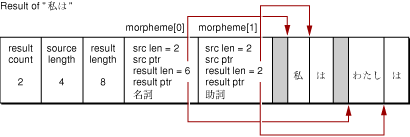
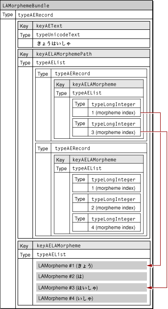
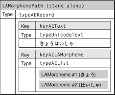
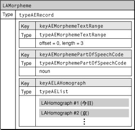
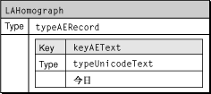

> 导航：[总目录](../../../README.md) · [documentation](../../../_indexes/documentation.md) · [Programming With the Language Analysis Manager](Introduction%20to%20Programming%20With%20the%20Language%20Analysis%20Manager.md)

[Next](Document%20Revision%20History.md)[Previous](Introduction%20to%20Programming%20With%20the%20Language%20Analysis%20Manager.md)

# Concepts

This chapter discusses the concepts you need to understand the Language Analysis Manager and how it operates on text. The Language Analysis Manager provides your application with morphological analysis capability, and is designed to work with a language analysis engine. The Language Analysis Manager application programming interface lets your application manage the analysis engine and create environments and contexts in which morpheme analysis can occur.

Morphological analysis is a process of dividing text into morphemes. Morphemes are the fundamental units of meaning that make up a word. For example, running is made up of two morphemes—_run_ and _ing_. _Run_ is the morpheme that carries the primary meaning of the word while _ing_ is a suffix morpheme that moderates the meaning of the primary morpheme.

Morphological analysis is often a prerequisite to performing operations on text of any language, such as finding a word or sorting text. Software that does optical character recognition or handwriting recognition can take advantage of morphological analysis to improve accuracy. For Japanese text, kana-kanji conversion relies on morphological analysis.

The Language Analysis Manager uses an external module called an analysis engine to perform a morphological analysis. The Language Analysis Manager can manage multiple analysis engines, as shown in Figure 1-1. The appropriate engine is accessed by the application.

__Figure 1-1__  The Language Analysis Manger can manage many analysis engines

In Mac OS 9, analysis engines exist within the Extensions folder, and are implemented as CFM code fragments which have a special prefix in the library name (LAE:). Analysis engines are automatically registered with the Language Analysis Manager at system startup.

This section provides an overview of how the Language Analysis Manger analyzes text. It also describes the analysis results your application receives.

The Language Analysis Manager uses an analysis environment. An _analysis environment_ is an opaque data structure which defines how analysis is carried out on a character string. Examples include an analysis environment to read Japanese text, an analysis environment to carry out kanji conversion, and an analysis environment used to process PinYin.

Analysis environments have dictionaries and environment variables associated with them. Each analysis environment is also linked to an analysis engine that enable the analysis to be carried out. One analysis engine can have multiple analysis environments. Applications specify the target language and the type of analysis by specifying an analysis environment rather than an analysis engine.

Operations carried out on the analysis environment include creating and disposing of environments, obtaining dictionaries available for use in the environment, and opening or closing a dictionary.

The contents of the analysis environment data structure varies for each analysis engine, and is private. It is defined as follows:

`typedef struct OpaqueLAEnvironmentRef* LAEnvironmentRef;`

Environment variables specify the properties of the analysis environment. By changing the environment variables it is possible to change the operation of the analysis engine. It is also possible to read the current status of the engine.

There are environment variables which are specified as standard, and some which are unique to a particular engine. There are also some which can be changed, and some which are read-only. It is impossible to obtain or change environment variables except those which have a dedicated function such as open dictionary.

The actual analysis is carried out after specifying an analysis context. An _analysis context_ keeps track of the current analysis. An analysis context belongs to one analysis environment, and carries out the analysis defined there. It is possible to generate multiple analysis contexts for one analysis environment.

The analysis context data structure varies for each analysis engine, and is private. It is defined as the following reference:

`typedef struct OpaqueLAContextRef* LAContextRef;`

The Language Analysis Manager provide two types of functions: high-level and low-level. You can use high-level analysis functions to analyze stream-format text, and obtain the results as an array of morpheme information used with a high frequency (a character string of analysis results of a format defined by the environment, delimiter information, and parts of speech). You can also convert text encodings.

You can use low-level analysis functions to perform a batch analysis that either

- obtains multiple results
- sequentially analyzes text as streams, obtaining one suitable one analysis result

Results returned by an analysis use the Apple Event data model. This means the results obtained from analyses have a hierarchical structure.

In addition to the morpheme information obtained by the high-level functions, you can also specify to include homonyms, pointers to dictionary entries that link homonyms with morphemes, and pronunciation information, which is additional information unique to the environment.

The low-level analysis functions exclusively use Unicode text for both input and output. When you call these functions from applications that use a text encoding other than Unicode, you must convert offset values and encodings using the Text Encoding Converter. It is the application’s responsibility to perform the conversions.

Analysis results obtained by the high-level analysis functions are returned to the specified buffer as an array that has a structure defined by the `LAMorphemesArray` data type. The morpheme information in the array is contained in the `LAMorphemeRec` data structure.

The source text and analysis results for each morpheme is stored within the same output buffer, after the array of morpheme information. These relationships are shown in Figure 1-2.

__Figure 1-2__  An LAMorphemesArray data structure contains LAMorphemeRec data structures

It is generally possible to regard the results of morpheme analysis as a structure in which particular data contains separate data. Against this background, analysis results from low-level functions have a structure in which four types of nodes include the lower-order node in a hierarchical form.

Morpheme bundles maintain multiple analysis results with different delimiters or parts of speech in an order resembling a morpheme path. Functions capable of returning multiple analysis results return this morpheme bundle.

A morpheme path displays the analysis results for a particular character string as a sequence of morpheme nodes. The morpheme node corresponds to (the delimiter of) one morpheme when a character string is broken down into units called morphemes. It has the corresponding character string and part of speech, and has the homograph nodes in a certain order.

Homograph nodes each have one homograph, and in most cases it is linked to an entry in a morpheme dictionary. Each type of node has attributes defined for each type as well as lower-place nodes. They may be text or parts of speech, for example. There are some attributes which are defined by the system, and have the same meaning extending over different environments, and some which are defined according to the environment (in many cases actually by the engine), and which only have meaning within the context belonging to that environment.

All of these structures are based on the Apple event data types. See _Inside Mac OS X: Apple Event Manager Reference_ for details about Apple event data types.

The analysis results use Apple event data types. Thus the descriptions in this section assume that you are familiar with Apple event data types. The `AERecord` data type forms the basis of all nodes of analysis results. For convenience, each type name and Apple event type name are defined corresponding to the morpheme bundle, morpheme path, morpheme node, and homograph node.

Generally morpheme analysis carried out on a character string can give several possible results. In `LAMorphemeAnalysis`, possible solutions are arranged in the “most likely” order, and the specified number is output from a higher-place. In this way, morpheme bundles are a collection of different solutions to morpheme analysis on one character string. The “different solutions” referred to here means that two solutions have different morpheme delimiters, or the same morpheme delimiters, but the parts of speech are not the same. Morpheme bundles have each of these different solutions in the from of a morpheme path which is discussed later. Morpheme bundles normally have multiple paths in the “most likely” order.

Within morpheme bundles, morpheme paths do not directly include morpheme nodes. Morpheme bundles have a list of morpheme nodes as one of their attributes distinct from the morpheme path, and morpheme paths have an index to that list. In this way, it is possible to share a morpheme node from one or more paths by indirectly indicating the morpheme node. In most cases, multiple paths within one bundle resemble one another to some extent, and multiple paths may be deemed to have the same morpheme node. One morpheme node may include many homograph nodes, making it bigger, so a mechanism such as this which allows sharing is important in maintaining a small data size. Table 1-1 lists the elements of a morpheme bundle.

__Table 1-1__  Elements of a morpheme bundle

| Morpheme bundle element | Key | Type |
| Text character string | `keyAEText` | `typeUnicodeText` |
| List of morpheme paths | `keyAELAMorphemePath` | `typeAEList` |
| List of morpheme nodes used by morpheme paths | `keyAELAMorpheme` | `typeAEList` |

Figure 1-3 shows a morpheme bundle that contains two morpheme paths for a Japanese string.

__Figure 1-3__  A morpheme bundle

A solution to morpheme analysis is called a path. Each solution is a result of morpheme analysis which has an individual morpheme delimiter and part of speech, and comprises an arrangement of morpheme nodes which is discussed later.

There are two types of morpheme paths which have a different way of holding the lower-place morpheme nodes, and in some cases they are used for different purposes. One is the morpheme path within the morpheme bundle mentioned earlier, where the path does not directly include morpheme nodes.

The other form is the morpheme path which can be used alone, and in this case, it is more convenient for it to be closed in that unit. If an application changes the operation of a morpheme node, the morpheme node must not be shared. Therefore, for single morpheme paths, morpheme nodes are directly included in the morpheme path. Table 1-2 lists the elements of a morpheme path.

__Table 1-2__  Elements of a morpheme path

| Morpheme path element | Key | Type |
| Text character string | `keyAEText` | `typeUnicodeText` |
| List of morpheme nodes | `keyAELAMorpheme` | `typeAEList` |

Figure 1-4 shows a morpheme path that contains a list of morpheme nodes for a Japanese string.

__Figure 1-4__  A morpheme path

Morpheme nodes display the language of a specific part of speech for a particular character string, and have a corresponding character string range, part of speech, and homograph nodes within text character strings as attributes. Table 1-3 lists the elements in a morpheme node.

__Table 1-3__  Elements of a morpheme node

| Morpheme set element | Key | Type |
| Character string range within source string | `keyAEMorphemeTextRange` | `typeUnicodeText` |
| Part of speech | `keyAEMorphemePartOfSpeechCode` | `typeAEMorphemePartOfSpeechCode` |
| Homograph node | `keyAELAHomograph` | `typeAEList` |

Figure 1-5 shows a morpheme node for a morpheme set.

__Figure 1-5__  A morpheme node

The homograph node is the minimum unit of analysis, and actually represents individual "languages." Normally this corresponds to one word obtained from the dictionary.

Homograph nodes include the character string which represents this "language," but the content varies according to the type of analysis stipulated in the analysis environment. Depending on the type of environment, a variety of additional information may be included as part of the analysis for a specific language.

A homograph node contains a string which represents this language, and uses a `keyAEText` key and a `typeUnicodeText` data type. Figure 1-6 shows the structure of a homograph node.

__Figure 1-6__  A homograph node

[Next](Document%20Revision%20History.md)[Previous](Introduction%20to%20Programming%20With%20the%20Language%20Analysis%20Manager.md)

