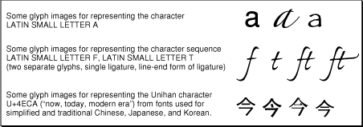
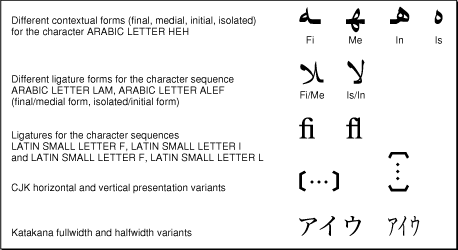
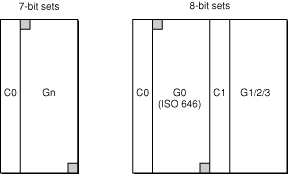
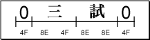
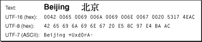
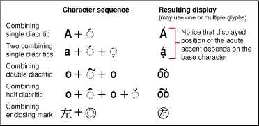
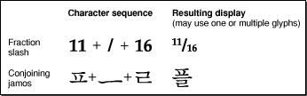
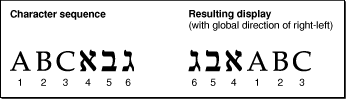
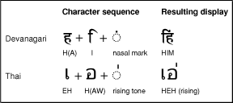

> 导航：[总目录](../../../README.md) · [documentation](../../../_indexes/documentation.md) · [Programming With the Text Encoding Conversion Manager](Introduction%20to%20Programming%20With%20the%20Text%20Encoding%20Conversion%20Manager.md)

[Next](Writing%20Custom%20Plug-Ins.md)[Previous](Introduction%20to%20Programming%20With%20the%20Text%20Encoding%20Conversion%20Manager.md)

# Character Encoding Concepts In-Depth

This document is adapted from a tutorial created by Peter Edberg that was presented at the 11th International Unicode Conference. The original paper is published in the Proceedings of that conference with a notice indicating joint copyright by Apple Computer, Inc. and the Unicode Consortium.

The document explores some aspects of character encodings, including terms used, such as coded character sets, character encoding schemes, characters, glyphs, and related concepts. It discusses existing character encodings, focusing on important Internet encodings and how these encodings relate to the Unicode standard. The document also discusses special features of various character encodings and the use of character data in programming languages.

Many of the terms defined in this section are used informally. They are defined in order to facilitate the discussion in the remainder of this appendix.

A recent meeting on character sets organized by the Internet Architecture Board proposed a 7-layer architectural model for the transmission of text data. The first three layers are required for specifying the content of a transmitted text stream “on the wire”; higher layers specify language, locale, and so forth. As specified in the minutes of that meeting, the first three layers are

- coded character set (CCS), a mapping from a set of abstract characters to a set of integers. Examples include ISO 10646, ASCII, and the ISO 8859 series.
- character encoding scheme (CES), a mapping from one or more CCSs to a set of octets. Examples include ISO 2022 and UTF-8. A given CES is typically associated with a single CCS; for example, UTF-8 applies only to ISO 10646.
- transfer encoding syntax (TES), a transformation applied to character data encoded using a CCS and possibly a CES to allow it to be transmitted by a specific protocol or set of protocols. Examples include base64 and quoted-printable.

Other documents offer slightly different definitions of characteristics of a CCS, for example, a repertoire of abstract characters, range of numbers, and a mapping from numbers to characters (not necessarily invertible). Each of the integers in the set used to represent a CCS is called a code point.

A CES might be more accurately described as a mapping from a sequence of elements in one or more CCSs to a sequence of octets. This definition suggests that the mapping from a single CCS element to its representation in the CES does not fully characterize the CES, which may include additional octets to set or change state information.

A TES is usually used to send 8-bit data through a transport mechanism that is only safe for 7-bit data, and even then may perform special handling for certain 7-bit values.

This appendix frequently uses the shorter term character set to mean coded character set and character encoding or encoding scheme to encompass both character sets and more complex character encoding schemes.

Characters are the atomic units of content for text data; they include letters, digits, punctuation, and symbols. A character is an abstract entity without any particular appearance. A coded character is a character together with its numeric representation in a particular CCS.

A text element is a group of one or more characters that is treated as a single entity for a particular process such as collation, display, or transcoding. The way that characters are grouped into text elements depends on the process; each process may group characters differently.

Glyph images are the visual elements used to represent characters; aspects of text presentation such as font and style apply to glyph images, not to characters. The mapping from a sequence of coded characters to a sequence of glyph images on a display device is complex. In general there is not a one-to-one mapping from character to glyph image; a particular glyph image may correspond to more or less than one character. [Figure 1-1](#apple-f4xwc4dqnrsv64tfmyxwi33df52wszbpkridimbqgaydsmzsfvbuqmrqgiwueq2jjjdemrsj) shows glyphs and their associated characters.

__Figure 1-1__  Some glyph images for representing characters

A script is a collection of related characters, subsets of which are required to write a particular language. Some examples of scripts are Latin, Greek, Hiragana, Katakana, and Han. A writing system consists of a set of characters from one or more scripts that are used to write a particular language and the rules that govern the presentation of those characters. Punctuation, digits, and symbols that are shared across many writing systems can be considered as one or more separate pseudo-scripts. For example, the Japanese writing system includes a Kanji subset of Han characters, plus Hiragana, Katakana, some Latin, and various punctuation and symbols, some of which are specific to CJK—Chinese, Japanese, Korean—or even just to Japanese, and some of which are more general.

The term presentation form is generally used to mean a kind of abstract shape that represents a standard way to display a particular character or group of characters in a particular context as specified by a particular writing system. The term glyph by itself may refer either to presentation forms or to glyph images. This appendix assumes the latter convention. [Figure 1-2](#apple-f4xwc4dqnrsv64tfmyxwi33df52wszbpkridimbqgaydsmzsfvbuqmrqgiwueq2jiraukrsg) shows some examples of presentation forms.

__Figure 1-2__  Presentation forms

The determination of what is a character in a CCS should be based on what is best for implementing the range of text processes for which that CCS will be used. The characters in a CCS need not correspond to what a user or linguist might consider a character. In fact, if the CCS will be used for more than one writing system, this might be impossible to do anyway, since each writing system has its own notion of what constitutes a natural character. Well-designed software should provide users with the behavior they expect or prefer, regardless of the details of the underlying character encoding, and without exposing users to those details.

Some character sets that were intended primarily for display using less sophisticated display software have encoded presentation forms as characters. For example, the DOS Arabic character set (code page 864) encodes Arabic contextual forms and ligatures instead of abstract letters.

Most of these encodings are designed to support one writing system, or a group of writing systems that use the same script. As a result, in some cases certain encodings are treated as implying a particular language, which is information that should be several layers higher in the architectural model described previously in this appendix.

[Character Encodings and Internet Names](Character%20Encodings%20and%20Internet%20Names.md#apple-f4xwc4dqnrsv64tfmyxwi33df52wszbpkridimbqgaydsmzsfvbuqmrqgqwugssci5cucqkd) provides a more complete list of character encodings (but with less explanatory material), grouped by the writing systems they cover.

ISO 2022 and ISO 4873 define a structure for coded character sets using 7-bit or 8-bit values. These coded character sets provide a means of representing both graphic characters and control functions; control functions that can be represented with a single code point are also called control characters.

For character sets using 7-bit values, the range 0x00–0x1F is reserved for a set of 32 control characters, designated C0; another set of 32 control functions, designated C1, may be represented with escape sequences. The range 0x20–0x7F (96 code points) is reserved for up to four sets of graphic characters, designated G0–G3 (in some graphic sets, each code point requires two or three 7-bit values). Most Gn sets use only the 94 code points 0x21–0x7E, in which case 0x20 is reserved for SPACE, and 0x7F is reserved for DELETE. ISO 2022 specifies a protocol for

- assigning real sets of control functions, drawn from another standard, to C0 and possibly C1
- assigning real sets of graphic characters, drawn from another standard, to G0 and possibly G1, G2, and G3
- switching among the Gn sets for use of the range 0x20–0x7F

For 8-bit character sets, the C0 set uses 0x00–0x1F, but the C1 set uses 0x80–0x9F. The G0 set uses 0x21–0x7E (with SPACE and DELETE reserved), but the G1, G2, and G3 sets share the range 0xA0–0xFF (96 code points). [Figure 1-3](#apple-f4xwc4dqnrsv64tfmyxwi33df52wszbpkridimbqgaydsmzsfvbuqmrqgiwueq2jjfeeuq2i) shows these differences.

__Figure 1-3__  Comparison of 7-bit and 8-bit character set structures

The G0 set is typically the ISO 646 international reference version (ASCII). The C0 and C1 control functions are typically from ISO 6429, although other control sets can be used.

All of these use a fixed number of 7-bit or 8-bit values to represent the code point. Here are some examples for different code point sizes.

- One 7-bit value (these can provide a Gn set that adheres to the ISO structure):

  - ASCII, as specified by ANSI X3.4. This is a U.S. national standard, and is the U.S. national variant of ISO 646.
  - ISO 646, an international standard. It is similar to ASCII, except that for ten code points (corresponding to ASCII characters @ [ \ ] ^ ` { | } ~ ) it does not designate a specific character, and for two other code points (corresponding to ASCII characters $ # ) it allows either of two specified characters. National variants are defined by designating some of these code points to represent specific non-ASCII characters needed for a particular language. A sender and receiver can agree on a particular variant; in the absence of such an agreement, ISO specifies an international reference version, which is now the same as ASCII. For example, the Japanese national variant (known as JIS Roman) replaces ASCII \ with ¥ , and replaces ASCII ~ with _ .
  - Some older national and regional standards that are not ISO 646 variants, such as SI 960 for Hebrew and ASMO 449 for Arabic.
- One 8-bit value:

  - ISO 8859-x. This international standard has multiple parts. ISO 8859-1 is well known as Latin-1, the most common encoding on the Web. ISO 8859 includes other Latin parts, such as Latin-5 (ISO 8859-9, used for Turkish), as well as parts for Cyrillic, Greek, Arabic, Hebrew, and other scripts. These adhere to the ISO 8-bit structure: The range 0x00–0x1F is reserved for C0 controls, 0x20 is SPACE, the range 0x21–0x7E is identical to ASCII, x7F is DELETE, the range 0x80–0x9F is reserved for C1 controls, and the range 0xA0–0xFF contains a 96-character G1 set that depends on the 8859 part.
  - ASCII-based vendor character sets for non-East-Asian scripts: DOS code pages such as 437, Windows code pages such as 1252, Mac OS character sets, and so on. These support the ASCII graphic characters directly, but they typically do not follow the full 8-bit structure used for ISO standards; for example, they typically encode graphic characters in the C1 area. Windows 1252, for example, is ISO 8859-1 plus additional characters in the C1 area.
  - National standards such as TIS (Thai Industrial Standard) 620-2533 and JIS (Japanese Industrial Standard) X0201. JIS X0201, for example, combines JIS Roman with a set of Katakana and punctuation characters in the range 0xA1–0xDF.
  - ISO character sets for bibliographic use, such as ISO 5426, which often use nonspacing diacritic characters (in these standards, nonspacing marks precede the base character).
  - EBCDIC character sets used on IBM mainframes and midrange machines. The layout is based on Hollerith card codes, and is quite different from ASCII. The basic Latin letters are in six discontiguous ranges a–i, j–r, s–z, A–I, J–R, S–Z, all with code points above 0x80; control characters are 0x00–0x3F and 0xFF. The original EBCDIC-US had a graphic character repertoire somewhat different from ASCII: it did not include square brackets or a circumflex accent, but did include cent sign, broken bar, not sign, and no-break space; it also had 95 undefined code points scattered about. Fourteen of the original EBCDIC-US code points could be changed for national variants (as with ISO 646). Newer versions of EBCDIC fill in the undefined code points with characters from ISO 8859-1 or other standards.
- Two 7-bit values (Any of these can be used as a Gn set within the ISO framework):

  - Japan: The original Japanese 2-byte national standard was JIS C6226-1978. This was significantly revised as JIS X0208-1983, with a minor update in 1990. It includes punctuation and symbols (some specific to CJK or to Japanese), Hiragana, Katakana, and 6356 Kanji (Han), as well as basic letters for Latin, Greek, and Cyrillic (all in 2-byte form). JIS X0212 (1990) is an add-on set with additional Kanji (5801), additional Latin characters, and so forth. JIS C6226 provided a model for other East Asia national standards.
  - China: GB 2312-1980 is the basic national standard, with 6763 Hanzi (Han), punctuation and symbols, Katakana, Hiragana, basic Latin, Greek, and Cyrillic, plus Bopomofo.
  - Korea: KSC 5601-1987 is the most widely known of the Korean national standards. It includes 2350 composed Hangul syllables, 4620 distinct Hanja (Han), punctuation and symbols, Katakana, Hiragana, basic Latin, Greek, and Cyrillic; some of the Hanja are encoded multiple times, once for each pronunciation. This standard was updated in 1992; the basic standard was not significantly changed, but a new annex defined a complete “Johab” set of the 11,172 possible composed Hangul syllables.
  - Taiwan: CNS 11643-1992 defines a set of 2-byte standards, something like the parts of ISO 8859. Each part is called a plane, and the standard defines 16 planes. Only 7 planes currently have character assignments; altogether they include 48,027 Hanzi and ~700 other characters.
- Three 7-bit values (these are mainly for bibliographic usage):

  - CCCII (Chinese Character Code for Information Interchange): The high-order value specifies the plane; planes are grouped into sets of 6, called layers. The first layer (53,016 code points) contains basic characters; most of the other layers are reserved for variant forms, which are assigned code points that correspond to the position of the equivalent basic character. The remaining layers contain Kana and Hangul (for Japanese and Korean).
  - EACC (East Asia Character Code): This is a U.S. standard (ANSI Z39.64) based on CCCII.

Packing schemes use a sequence of 8-bit values, so they are generally not suitable for mail (although they are often used on the Web). In these schemes, certain characters function as a local shift that controls the interpretation of the next 1–3 bytes.

The most well-known packing scheme is probably Shift-JIS, which was originally developed by Microsoft for use with MS-DOS. It includes the following:

- The characters from JIS X0201, represented as single bytes, with same code points as in JIS X0201: 0x00–0x7F and 0xA1–0xDF.
- The characters from JIS X0208, represented as 2 bytes, with the first byte in the range 0x81–0x9F or 0xE0–0xEF and the second byte in the range 0x40–0x7E or 0x80–0xFC.
- Space for 2444 user-defined characters, represented as 2 bytes, with the first byte in the range 0xF0–0xFC, and the second byte in the range 0x40–0x7E or 0x80–0xFC.

The 2-byte units all begin with byte values that are not used for JIS X0201, so it is possible to distinguish them if the text is processed serially from the beginning of a buffer. However, the second bytes of 2-byte units use values that can be confused either with the first byte of a 2-byte unit or with a single-byte code point from JIS X0201; when pointing into an arbitrary location in the middle of Shift-JIS text, it may be impossible to determine character boundaries. [Figure 1-4](#apple-f4xwc4dqnrsv64tfmyxwi33df52wszbpkridimbqgaydsmzsfvbuqmrqgiwueq2jjjceorcd) shows this with a somewhat pathological Shift-JIS byte sequence using only two different byte values (the corresponding character images are also shown).

__Figure 1-4__  Shift-JIS byte sequence

Moreover, Shift-JIS contains multiple representations of the Katakana and basic Latin repertoires, which are available in 1-byte form via JIS X0201, and in 2-byte form via JIS X0208. Shift-JIS has a well-deserved reputation as a troublesome encoding scheme.

The EUC (Extended UNIX Code) packing schemes were originally developed for UNIX systems; they use units of 1 to 4 bytes.

- EUC-JP (Japanese) combines JIS-Roman, the JIS X0201 Katakana and related punctuation, JIS X0208, and JIS X0212:

| Character Set | Range of Corresponding EUC Sequence |
| --- | --- |
| JIS-Roman | 0x21–0x7E (same as JIS-Roman code point) |
| JIS X0208 | 0xA1A1–0xFEFE (X0208 code point + 0x8080) |
| JIS X0201, Katakana, etc. | 0x8EA1–0x8EDF (0x8E, then X0201 code point) |
| JIS X0212 | 0x8FA1A1–0x8FFEFE (0x8F, then X0212 code point + 0x8080) |
- EUC-CN (simplified Chinese) combines ASCII, GB 2312 (adds 0x8080 to GB code point)
- EUC-KR (Korean) combines ASCII, KSC 5601-1987 (adds 0x8080 to KSC code point)
- EUC-TW (traditional Chinese) combines ASCII and all 16 planes of CNS 11643-1992. The 16 planes are encoded as 0x8E, then the plane number + 0xA0, then the CNS code point + 0x8080. In addition, Plane 1 is redundantly encoded as simply the CNS code point + 0x8080.

The Big 5 encoding is a special case. This is not a national standard, but a de facto encoding used for traditional Chinese. It combines ASCII—represented as 1-byte units—with 2-byte units that represent Hanzi, CJK punctuation and symbols, and other characters. There is no separate specification for the set of characters represented by the 2-byte units, although the Hanzi repertoire matches the CNS 11643 Plane 1 repertoire. For the 2-byte units, the first byte is in the range 0xA1–0xFE, and the second byte is in the range 0x40–0x7E or 0xA1–0xFE.

The acronym MBCS (multi-byte character set) is used for encoding schemes that mix character units of different byte lengths (as in the packing schemes mentioned above), in contrast to SBCS (single-byte character set). The acronym DBCS (double-byte character set) is sometimes used for pure two-byte encodings such as JIS X0208, and sometimes used synonymously with MBCS.

Code-switching schemes generally use a sequence of 7-bit values, so they are suitable for mail. ISO 2022 specifies a general code-switching scheme. In its general 7-bit form, it uses

- escape sequences to specify the character sets currently assigned to G0–G3 and C0–C1
- certain C0 and C1 controls to switch the current character set to be any of G0–G3 (using the character sets previously assigned to G0–G3)
- other C1 controls for a temporary character set switch that applies only to the next character

However, ISO 2022 it is rarely used in this form on the Internet. Instead, for certain languages there are one or more predefined combinations of character sets and protocols for use with ISO 2022: for example, ISO-2022-JP (Japanese), ISO-2022-KR (Korean), and ISO-2022-CN (simplified Chinese). Each of these specifies the character sets to be used, the escape sequences or controls used to switch among them, and necessary defaults and reset behavior (such as initial state and the end-of-line reset).

Another common code-switching scheme is HZ, used for Chinese mail and news. This uses ~} and ~{ for switching between ASCII and GB 2312.

The EBCDIC Host encodings used on IBM mainframes for CJK text are a special case and use a sequence of 8-bit values. These encodings combine a single-byte EBCDIC character set and a double-byte IBM character set with graphic characters in the range 0x41–0xFE. The EBCDIC control character Shift Out (SO, 0x0E) is used to switch to the double-byte character set, and the control character Shift In (SI, 0x0F) is used to switch to the single-byte character set.

Unicode is a universal character set whose goal is to include characters for all of the worlds written languages, plus a large set of technical symbols, math operators, and so on—everything that needs to be encoded in text. It originated in work by Apple and Xerox in 1988, which was in turn based on the Xerox XCCS universal character set. At about the same time, the ISO/IEC joint technical committee JTC1 was developing a separate universal character set. These efforts were merged beginning in 1991 to produce what is essentially a single character set.

There are actually two parallel standards. The Unicode Consortium is responsible for Unicode, while ISO/IEC JTC1 is responsible for ISO 10646. The goal is to keep the character repertoire and code point assignments synchronized. However, beyond that there are some differences.

The Unicode standard specifies character properties and some rendering behavior, and includes conformance criteria. It clarifies character usage and semantics, and provides a set of guidelines for implementing Unicode. Mapping tables for converting other character sets to Unicode are also provided.

ISO/IEC 10646, like most ISO character set standards, does not specify character properties or rendering behavior. On the other hand, it identifies three implementation levels and many subset repertoires to permit software to indicate precisely what it can and cannot support.

Basic Unicode uses 16-bit code points. Two ranges, each consisting of 1024 16-bit code points, are reserved for high-half surrogates and low-half surrogates; these can be combined to function as a 32-bit code point. This scheme, known as UTF-16, adds a million additional code points.

ISO 10646 supports a 16-bit form (including UTF-16), called UCS-2, as well as a full 32-bit form, called UCS-4. In UCS-4, the high-order byte indicates the group and the next highest order byte indicates the plane. UTF-16 can represent UCS-4 code points from group 0, planes 0 through 16, but uses different numeric values for the characters in planes 1 through 16. Characters that can be represented using a single 16-bit code point are said to be on the Base Multilingual Plane (BMP).

All of these forms can use the full range of 16-bit values. No attempt is made to avoid 16-bit values that contain bytes that may be interpreted in special ways on byte-oriented systems. The first 256 Unicode characters parallel ISO 8859-1; but since the Unicode code points are 16 bits, the high-order byte is 0, which might be interpreted as a C-string terminator on a byte-oriented system.

To permit transmission of Unicode over byte-oriented 8-bit and 7-bit channels, two transformation formats have been devised.

UTF-8 is intended for 8-bit protocols (such as the Web). All of the ASCII repertoire maps to single-byte characters using the ASCII code points. Other Unicode BMP characters map to a sequence of 2 or 3 bytes; the initial bytes of these sequences, as well as the following bytes, are all in distinct ranges so they can be distinguished from each other and from the ASCII range. This makes it relatively easy to process (much easier than Shift-JIS, for example).

UTF-7 is intended for 7-bit protocols (such as mail). Certain characters in the ASCII repertoire are preserved intact. Other Unicode characters are mapped using a modified base 64 encoding. The character + is used to switch to modified base 64, and - is used to switch back out.

[Figure 1-5](#apple-f4xwc4dqnrsv64tfmyxwi33df52wszbpkridimbqgaydsmzsfvbuqmrqgiwueq2jizbuissg) shows the same Unicode sequence in UTF-16, UTF-8, and UTF-7.

__Figure 1-5__  Unicode sequence expressed in UTF-16, UTF-8, and UTF-7

Unicode provides a single encoding that can be used to represent multilingual text. Using a single encoding is much easier than supporting the multitude of encodings otherwise required for multilingual text. Unicode is also much easier to process than many of the other encodings.

The use of Unicode does not by itself imply any particular language or group of languages, unlike the use of, say, ISO 2022-JP, which implies Japanese, or EUC-KR, which implies Korean. A Unicode code point represents a character that may be common to several languages. For example,[Figure 1-1](#apple-f4xwc4dqnrsv64tfmyxwi33df52wszbpkridimbqgaydsmzsfvbuqmrqgiwueq2jjjdemrsj) shows a single Unicode Han character that is used in Chinese, Japanese, and Korean. Unicode encodes plain text—that is, the minimum information for preservation of text content and basic text legibility. It does not explicitly encode higher-level information such as language or font. Note, however, that Unicode does distinguish among characters in different scripts that may have the same appearance, such as LATIN CAPITAL LETTER A and GREEK CAPITAL LETTER ALPHA; this is necessary for preservation of text content.

The Unicode repertoire is a superset of the repertoires of a large number of important standards. Thus, it can also serve as a hub for conversion among multiple encoding systems. For a specific set of source standards, Unicode ensures round-trip fidelity: Every character that is distinct in one of those standards is also distinct in Unicode (for this and other reasons, Unicode includes a number of compatibility characters that would not otherwise have been separately encoded). However, for other standards there may not be a one-to-one mapping from their repertoire onto Unicode; the other standards may include multiple characters that all correspond to the same Unicode character, or they may include characters for which there is no corresponding Unicode character. For example, the Adobe symbol set includes separate code points for upper, center, and lower sections of multiline parentheses, square brackets, and curly brackets; there are no corresponding characters in Unicode.

Unicode provides considerable advantages over other encodings, and Unicode is moving into widespread use. This is especially true on the Internet, where the profusion of character encodings has created the most acute problems. Examples of Unicode use include:

- the character encoding for Java
- the document character set for HTML 3.2
- LDAP and other Internet services
- UDF (the Universal Disk Format adopted for DVD)
- the base encoding for Windows NT
- the base encoding for NextStep and Rhapsody text

The notion of character repertoire becomes a bit fuzzy when a single character in one repertoire has a range of interpretations that matches several characters in another repertoire. Consider the following:

- ASCII 0x2D, HYPHEN-MINUS. Unicode has a HYPHEN-MINUS, but also separate HYPHEN and MINUS SIGN characters. In effect the Unicode repertoire has three characters matching the single ASCII character.
- JIS X0208 0x2142, specified as «double vertical line, parallel.» Unicode has separate characters for DOUBLE VERTICAL LINE and PARALLEL TO. There is no single Unicode character that exactly matches the JIS character; each of the Unicode characters matches one interpretation of the JIS character.

Some character encodings explicitly represent presentation forms. All of the forms shown in [Figure 1-2](#apple-f4xwc4dqnrsv64tfmyxwi33df52wszbpkridimbqgaydsmzsfvbuqmrqgiwueq2jiraukrsg), for example, are explicitly encoded in one or another encodings. This also creates a situation where multiple characters in one encoding match a smaller number of characters in another encoding.

Finally, there are many nonstandard additions to various encodings. For example:

- Many vendors have their own versions of Shift-JIS that add characters at various code points that are unused in standard Shift-JIS. These may be treated as separate encodings.
- Users in certain fields, such as law or medicine, may have their own standard set of «gaiji» characters that are added to Shift-JIS using custom fonts. Even without gaiji additions, different fonts on a platform may implement slightly different versions of a character encoding (usually the differences are in less commonly used characters).
- Many encodings permit the addition of user-defined characters in unused code points. A glyph editor may be provided so users can create a custom glyph and assign it to a code point.

The Unicode standard defines a combining character as «a character that graphically combines with a preceding base character» and a nonspacing mark as «a combining character whose positioning in presentation is dependent on its base character». A nonspacing mark generally does not consume space along the visual baseline in and of itself.

Similar nonspacing marks have been used in bibliographic standards for some time. Many of these standards are derived from the USMARC set developed by the Library of Congress in the 1960s. In these standards, nonspacing marks precede the base character so they can be handled by the primitive text layout techniques that were characteristic of the 1960s. The MARC sets and ISO 5426 allow one or two combining marks; these sets support many Latin-script languages and transliteration of several non-Latin-script languages. ISO 6937 allows one combining diacritic before a base character and allows only certain combinations of diacritics and base characters.

In ASMO 449 (Arabic), ISCII-88 and ISCII-91 (Indic), and TIS 620-2529 and TIS 620-2533 (Thai), combining marks for vowels, tones, and so on follow the base character. Unicode adopted this approach and extended it to nonspacing marks for Latin, Greek, and other scripts, so that all combining characters could be handled consistently.

The USMARC and ISO 5426 sets included characters for right and left halves of diacritics that span two base characters (these are used in Tagalog, for example). Unicode included these for compatibility, but also included single characters for the full diacritic.

Unicode also includes a set of combining enclosing marks for symbols, such as COMBINING ENCLOSING CIRCLE. [Figure 1-6](#apple-f4xwc4dqnrsv64tfmyxwi33df52wszbpkridimbqgaydsmzsfvbuqmrqgiwueq2jjbdugq2b) gives an idea of the variety of combining marks present in Unicode:

__Figure 1-6__  Some combining marks present in Unicode

There are other sorts of characters that combine graphically for display, but that—strictly speaking—are not combining characters.

Unicode and some other character sets (such as Mac OS Roman) include a FRACTION SLASH character for composing fractions. A digit (or digit sequence), followed by a fraction slash, followed by another digit (sequence) should be displayed as a single composed fraction.

Unicode also includes a set of conjoining Korean jamos. These constitute the Korean alphabet and are graphically combined into square syllable blocks for display according to well-defined rules (The Unicode standard provides an algorithm for this). This is similar to the process of ligature formation in Arabic or Devanagari (although in those scripts the set of ligatures and the rules are typically more font-dependent); but Unicode also has a set of nonconjoining jamos. [Figure 1-7](#apple-f4xwc4dqnrsv64tfmyxwi33df52wszbpkridimbqgaydsmzsfvbuqmrqgiwueq2jinceiq2g) provides examples of the behavior of fraction slash and conjoining jamos.

__Figure 1-7__  Fraction slash and conjoining jamos

In [Figure 1-6](#apple-f4xwc4dqnrsv64tfmyxwi33df52wszbpkridimbqgaydsmzsfvbuqmrqgiwueq2jjbdugq2b) and [Figure 1-7](#apple-f4xwc4dqnrsv64tfmyxwi33df52wszbpkridimbqgaydsmzsfvbuqmrqgiwueq2jinceiq2g), the character sequences shown on the left side are called decomposed character sequences; they generally correspond to a single displayed text element. Some character encodings may represent that displayed text element with a single character code, in addition to or instead of using the decomposed representation. Single code points for text elements such as the ones on the right side of [Figure 1-6](#apple-f4xwc4dqnrsv64tfmyxwi33df52wszbpkridimbqgaydsmzsfvbuqmrqgiwueq2jjbdugq2b) and [Figure 1-7](#apple-f4xwc4dqnrsv64tfmyxwi33df52wszbpkridimbqgaydsmzsfvbuqmrqgiwueq2jinceiq2g) are called precomposed characters. Unicode includes many precomposed characters as well as combining and conjoining characters that can be used for decomposed sequences; the former accommodate backward compatibility requirements, while the latter are better suited to modern graphics and text processing systems.

As a result, Unicode includes multiple representations (or «multiple spellings») for the same text elements. Multiple representations of the same text elements should generally be treated as equivalent for most text processing purposes. Also, when converting among encodings, there may be multiple representations in Unicode that correspond to a given character in another encoding.

For Arabic and Hebrew, there are three conventions for the order in which text is encoded:

- Implicit or logical order, in which the text is stored in memory in the same order it would be spoken or typed. Characters have an inherent direction attribute, and this attribute is used by a display algorithm to determine the proper (or most likely) display order for the corresponding glyphs. The algorithm may make use of global line direction information if available.
- Explicit order, in which all display ordering is determined by explicit controls.
- Visual order, in which text is stored line-by-line in left-to-right display order (that is, the Arabic and Hebrew non-numeric text is encoded in reverse order). This is typically used for older systems or when no real support for bidirectional text is provided, and requires explicit line breaks.

Unicode uses implicit order, with the addition of optional controls for unusual cases or fine-tuning, and specifies the reordering algorithm for display. The Windows and Mac OS Hebrew and Arabic encodings also assume implicit order. [Figure 1-8](#apple-f4xwc4dqnrsv64tfmyxwi33df52wszbpkridimbqgaydsmzsfvbuqmrqgiwueq2jirbuur2b) gives an example of implicit ordering.

__Figure 1-8__  Implicit ordering

Characters that are otherwise identical in different character encodings may have different direction attributes in the two encodings, and this creates another “fuzzy” problem for matching character repertoires. For example, Unicode has a single PLUS SIGN character, with direction class European Number Terminator; the Mac OS Hebrew and Arabic encodings have two plus sign characters, one with strong left-right direction, and one with strong right-left direction. This is because the Mac OS encodings were designed in 1986 for a reordering model that was less sophisticated than the current Unicode reordering model.

There are also two different ordering conventions for characters in Indic and related Southeast Asian scripts. In these scripts, consonants have an inherent vowel, which is pronounced after the consonant. A vowel mark may be used with the consonant to change the vowel; this vowel mark may be displayed above, below, to the left or to the right of the consonant; it may even surround the consonant or have components that appear on either side.

The scripts of India are generally encoded in logical order, so that any dependent vowel (and other marks related to the consonant) follows the consonant in memory. The consonant, together with any dependent vowel and other marks, constitutes a «consonant cluster». Successive clusters are displayed in left-to-right order, but within a cluster the ordering may be complex. (Clusters may also include vowel-less dead consonants that precede the main consonant.)

Thai consonants have an inherent tone as well as an inherent vowel; tone marks may be added to change the tone, in addition to any vowel signs. Thai is generally encoded in visual order, unlike the scripts of India, so a vowel that modifies a consonant’s inherent vowel may precede or follow that consonant in memory.

Unicode follows the above conventions for encoding Indic and Thai (Lao is related to Thai, and is encoded similarly).

__Figure 1-9__  Character sequence and resulting display

The C `char` type is supposed to be large enough to store any member of the execution character set. If a genuine character from that set is stored in a `char` object, its value is equivalent to the integer code for the character and is non-negative. The `char` type is also equivalent to a single byte and may be signed or unsigned (implementation dependent).

C does not actually define the size of a byte, so in principle a byte could be made large enough so a `char` would accommodate multi-octet characters and Unicode characters. However, in most implementations, bytes and `char` objects are 8 bits, and multi-octet characters require a sequence of `char` objects.

Instead, C provides the wide character or `wchar_t` type. This is really supposed to be large enough to hold the largest character in any extended execution set supported by the implementation ( including MBCS encodings). It permits internal processing using fixed-size characters; C library functions such as `mbstowcs( )` and `wcstombs()` convert between SBCS/MBCS strings and wide character strings. However, the size of `wchar_t` is implementation specific; although it is usually 16 or 32 bits, on some implementations it is equivalent to `char`.

Java takes a different approach: Bytes remain 8 bits, but a Java `char` is a 16-bit unit intended to contain a Unicode character.

Finally, programming languages generally provide some abstraction away from encoding details. For example, the C character constant 'A' may have the value 0x41 for an ASCII-based implementation, but 0xC1 for an EBCDIC-based implementation. Nevertheless, programs may make more subtle assumptions about character encodings, such as assuming that A–Z have sequential contiguous code points (not true in EBCDIC).

[Next](Writing%20Custom%20Plug-Ins.md)[Previous](Introduction%20to%20Programming%20With%20the%20Text%20Encoding%20Conversion%20Manager.md)

