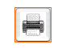
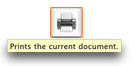
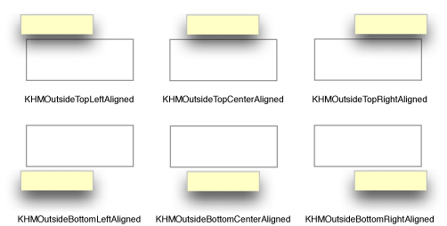
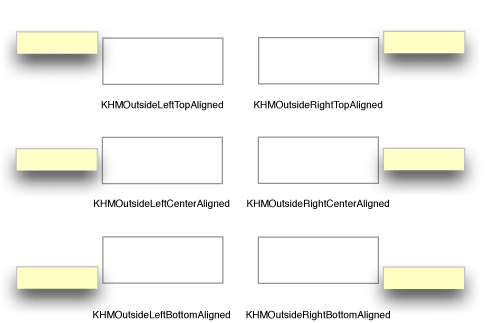
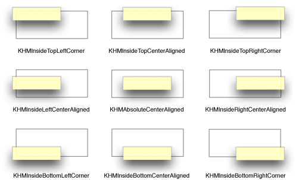
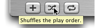
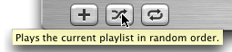

> 导航：[总目录](../../../README.md) · [documentation](../../../_indexes/documentation.md) · [Providing Help Tags in Carbon](Introduction%20to%20Providing%20Help%20Tags%20in%20Carbon.md)

[Next](Carbon%20Help%20Manager%20Tasks%20for%20Adding%20Help%20Tags.md)[Previous](Introduction%20to%20Providing%20Help%20Tags%20in%20Carbon.md)

# Carbon Help Manager Concepts

This chapter gives a brief description of help tags and explains how they are displayed by the Carbon Help Manager. This chapter also provides guidelines for writing effective help tag messages.

A _help tag_ is a small window containing a short help message that is visually associated with an element in an application’s user interface. A help tag is displayed when the user pauses with the pointer over the user interface element with which it is associated. The tag disappears when user input occurs. Help tags are always enabled. Figure 2-1 shows a help tag.

__Figure 1-1__  A help tag

Help tags assist users by identifying your application’s interface elements and their purposes. You can quickly and effectively communicate to more experienced users what they can accomplish in your application without referring them to your full suite of documentation. You can create help tags for controls, windows, menu titles, and menu items. You can also display a help tag directly on the screen without associating the tag with an interface element.

The Carbon Help Manager automatically displays help tags as the user moves the pointer around the screen. When a mouse-moved event occurs, the Carbon Help Manager records the current position of the pointer. If the pointer does not move from that position within the current help tag display time (by default, 1.5 seconds) and no other user input occurs, the Carbon Help Manager examines the user interface element underneath the pointer. If it has help content associated with it, the Carbon Help Manager displays a help tag with that content. When the user moves the pointer, clicks the mouse, presses a key on the keyboard, or uses a mouse scroll wheel, the Carbon Help Manager removes the help tag from the screen.

Your application can disable the Carbon Help Manager’s automatic display of help tags with the `HMSetHelpTagsDisplayed` function, but this function affects help tag display in only _your_ application. Help tag display in other applications is unaffected.

To supply help tag content, your application must

- define a help tag structure to describe the tag
- associate the help content with the appropriate interface element

You can associate help tag content with an interface element in one of two ways:

- attach the help tag content directly to the element
- attach a help tag callback to the element

The Carbon Help Manager tracks the interface element for you; when the pointer pauses over the item, the Carbon Help Manager determines if either help content or a help tag callback is associated with the element. If the content is directly attached to the element, the Carbon Help Manager displays a help tag with the content. If you have installed a callback, the Carbon Help Manager sends a request for the help content to your callback, and then displays the content that your callback returns in a help tag.

A help tag is described by the help tag structure, `HMHelpContentRec`. The help tag structure contains the following information:

- the structure version
- the hot rectangle associated with the help tag
- the display location for the help tag
- the help content

The _hot rectangle_ defines the area on the screen over which the pointer must pause to trigger the display of the help tag. As the user moves the pointer onto and off the hot rectangle, the Carbon Help Manager displays and removes the tag. You can specify an empty hot rectangle—a rectangle with coordinates (0,0,0,0). Before displaying a help tag, the Carbon Help Manager verifies that the current pointer position is within the hot rectangle associated with the tag. If the hot rectangle is empty, the Carbon Help Manager automatically substitutes the current bounds of the interface element with which the tag is associated, before performing this check. Figure 2-2 shows the hot rectangle for a help tag associated with a control.

__Figure 1-2__  The hot rectangle for a help tag associated with a control

The location at which a help tag is displayed is calculated relative to the hot rectangle. By default, help tags are displayed below the hot rectangle, centered horizontally. Figure 2-3 shows a help tag displayed at the default location, relative to the bounds of the control that it describes.

__Figure 1-3__  A help tag displayed at the default location

Your application can change the location at which tags are displayed on a per-tag basis. The Carbon Help Manager provides constants to describe the various locations, relative to the hot rectangle, at which help tags can be displayed. Figure 2-4 shows the positions above and below the hot rectangle at which help tags can be displayed. You can use the constant listed below each example to specify the given help tag location to the Carbon Help Manager.

__Figure 1-4__  Help tag locations above and below the hot rectangle

Figure 2-5 shows the locations to the right and left of the hot rectangle at which you can display help tags.

__Figure 1-5__  Help tag locations to the right and left of the hot rectangle

Help tags can also be displayed inside the bounds of the hot rectangle. Figure 2-6 shows the locations inside of the hot rectangle at which help tags can be displayed.

__Figure 1-6__  Help tag locations inside the hot rectangle

The Carbon Help Manager constants `kHMOutsideTopScriptAligned` and `kHMOutsideBottomScriptAligned` specify locations above and below the hot rectangle, respectively. However, the help tags are aligned with the right or left edges of the hot rectangle based on the orientation of the current system script. If the orientation of the system script is left-to-right (as in the Roman script system), the constants `kHMOutsideTopScriptAligned` and `kHMOutsideBottomScriptAligned` describe the same locations as the constants `kHMOutsideTopLeftAligned` and `kHMOutsideBottomLeftAligned`, respectively. If the orientation of the system script is right-to-left (as in the Hebrew or Arabic script system), `kHMOutsideTopScriptAligned` and `kHMOutsideBottomScriptAligned` describe the same locations as the constants `kHMOutsideTopRightAligned` and `kHMOutsideBottomRightAligned`.

The text of a help tag is described in an `HMHelpContent` structure. Each help tag structure (`HMHelpContentRec`) contains an array of two `HMHelpContent` structures; one for the help tag’s minimum, or default, content and one for its maximum, or expanded, content.

The minimum content is displayed by default when the user moves the pointer over the interface element with which the tag is associated. Figure 2-7 shows a help tag displaying the default content.

__Figure 1-7__  A help tag

Maximum content is displayed when the user presses the Command key as the pointer hovers over the item. Figure 2-8 shows a help tag displaying the expanded content.

__Figure 1-8__  An expanded help tag

When the user moves the pointer onto the item, the Carbon Help Manager displays either the default or expanded content, depending upon whether the Command key is down. If the user presses or releases the Command key after the help tag has been displayed, without moving the mouse off the item, the Carbon Help Manager removes the previous tag and displays a tag with the other content.

Default content is mandatory for a help tag; expanded content is optional. Expanded content should be used sparingly to

- further explain what the item does
- explain why or when the user would want to use the item
- provide additional information about how the user uses the item, if it is not clear from the item itself

The Carbon Help Manager supports a number of formats for the help content. However, help tags display only text; they do not support images, icons, or other graphical data. You can supply help content in any of the following forms:

- a Core Foundation string (`CFString`)
- a Pascal string
- a ’STR#’ resource
- a ’STR ’resource
- a TextEdit handle
- a ’TEXT’ resource

The last two formats are not supported in versions of Mac OS X prior to Mac OS X version 10.2.

In Mac OS X version 10.2 and later, the Carbon Help Manager will retrieve localized help strings stored in a `Localizable.strings` file. When you specify help content of type `kHMCFStringLocalizedContent`, the value in the `content` field of the help content structure should be a CFString key identifying the help tag message. The Carbon Help Manager checks the `Localizable.strings` file in the appropriate language folder and returns the localized help string associated with that key.

Help tags are designed to allow your application to briefly tell users

- what an object is
- what action the user can take with the object
- how to use the object

Because tags appear next to the user interface elements that they describe, information you supply in the tag unambiguously applies to the element. Help tags are therefore a very effective form of communicating short hints to users who already have some idea of what they want to accomplish or have enough knowledge to achieve their goals simply by experimenting with your user interface. Help tags are not designed to

- explain why users should use your application
- teach users how to use your application
- explain complex tasks

_Inside Mac OS X: Aqua Human Interface Guidelines_ offers the following suggestions to help you create effective help tags:

- Use the fewest words possible. Try to keep your tags to a maximum of 60 to 75 characters. Since help tags are always on, it is important to keep your tag text unobtrusive—that is, _short_—and useful. Present one concept per tag and make sure the concept is directly related to the item. Localization lengthens the text by 20 to 30 percent, which is another good reason to keep the tag short.
- Write the main help tag in any of these ways, depending on the interface you’re documenting:

  - Describe what the user will accomplish by using the control. Examples: “Add or remove a language from your list.” “Reduce red tint in the selected area.” Most help tags can use this format.
  - Give extra information to explain the results of the user’s action. This kind of tag is most effective in an interface that already includes some instructional text, because the tag and the interface text work together to describe what the control does and how the user manipulates it.
  - Define terms that may be unknown to the user. This kind of tag should be used only if the interface already contains instructions to the user.
- You can create contextually sensitive help tags but you don’t have to; the same text can appear when an item is selected, dimmed, and so on. By describing what the item accomplishes, you may help the user understand the current state of the control even if the tag is applicable to all situations.
- Use help tags to provide functional information for controls that are unique to your application. Don’t tag window controls, scroll bars, and other parts of the standard Mac OS X interface.
- Don’t put the item’s name in the tag unless the name helps the user and isn’t available onscreen. If an item is referred to by name in the documentation and in the tag, make sure the names match.
- You can use a sentence fragment beginning with a verb, for example, “Restores default settings.” You can also omit articles to limit the size of the tag. If the tag text is a complete sentence, end it with a period.
- Describe only the item the user points to.
- Use help tags primarily to provide necessary information, rather than incidental tips.
- If you implement an expanded tag to add another layer of information, don’t repeat the text in the original tag. An expanded tag should do one of the following:

  - More fully explain or describe the results of the action described in the small help tag.

    _Help tag:_ Shuffles the play order. _Expanded tag:_ Plays the current list of songs in random order.
  - Explain when or why the user would do the action described in the small tag.

    _Help tag:_ Creates a playlist. _Expanded tag:_ Playlists are groups of songs and are used to create CDs.

  If the original tag is an explanation or a definition that helps supplement instructions in the interface, you’re less likely to need an expanded tag.

[Next](Carbon%20Help%20Manager%20Tasks%20for%20Adding%20Help%20Tags.md)[Previous](Introduction%20to%20Providing%20Help%20Tags%20in%20Carbon.md)

