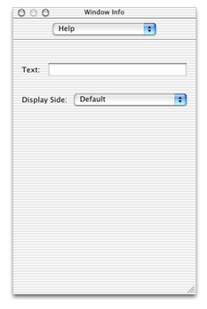
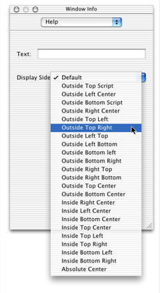
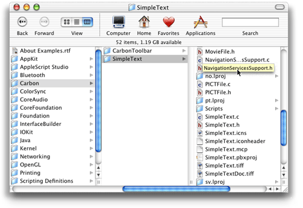

> 导航：[总目录](../../../README.md) · [documentation](../../../_indexes/documentation.md) · [Providing Help Tags in Carbon](Introduction%20to%20Providing%20Help%20Tags%20in%20Carbon.md)


[Next](Document%20Revision%20History.md)[Previous](Carbon%20Help%20Manager%20Concepts.md)

# Carbon Help Manager Tasks for Adding Help Tags

This chapter contains instructions and sample code showing you how to use the Carbon Help Manager to add help tags to your application’s user interface.

The code samples assume you are developing your application on the Mac OS using Carbon. All code samples in this chapter are in C.

You have several options for creating and displaying help tags in your application. You can use any one of the following methods, or any combination of them:

- Specify help tags in Interface Builder, Apple’s graphical interface editor. This is the simplest way to create help tags for your application’s user interface.
- Call Carbon Help Manager functions to attach help content directly to objects in your application’s user interface.
- Install help tag callbacks for objects in your application’s user interface. Use this approach to dynamically determine help content.
- Directly display a help tag. If your application needs to display a help tag that is not associated with a control, window, or menu, you can create a help tag and tell the Carbon Help Manager to display it immediately.

If you are using Interface Builder to create your application’s user interface, you can use the Info window to easily add help tags to interface elements. Interface Builder stores this help tag content in the nib file, along with other information describing the objects in your application’s interface. When you unarchive an object with help content, the help tag is automatically attached to the user interface element using the appropriate Carbon Help Manager `HMSet...Content` call. These functions are described further in the section [Attaching a Help Tag Directly to a User Interface Element](#apple-f4xwc4dqnrsv64tfmyxwi33df52wszbpgiydambrgmzdkljtfvbuqrcfizdeura). For instructions on using Interface Builder to create your application’s user interface, choose Interface Builder Help from the Help menu in Interface Builder.

You cannot specify expanded content for a help tag in Interface Builder. If you wish to create an expanded help tag for a user interface element, you must call the appropriate Carbon Help Manager function to attach the help content to the element, or you must install a help tag callback.

To create a help tag for a user interface element using Interface Builder, perform the following steps:

1. Select the user interface element in the Interface Builder window.
2. Open the Info window by choosing Show Info from the Tools menu, or by pressing Shift-Command-I.
3. Choose Help from the pop-up menu at the top of the Info window. Figure 3-1 shows the Info window after choosing Help.

   __Figure 2-1__  Help in the Info window

   
4. Type the help tag message in the Text field.
5. Choose the location for the help tag from the Display Side pop-up menu. The locations listed in this pop-up menu are relative to the hot rectangle for the help tag. These locations correspond to the locations represented by the display location constants described in more detail in the section [Display Location](Carbon%20Help%20Manager%20Concepts.md#apple-f4xwc4dqnrsv64tfmyxwi33df52wszbpgiydambrgmzdkljsfvkfawcsivddcmbu). Figure 3-2 shows the Info window with the Display Side pop-up menu open.

   __Figure 2-2__  Selecting the help tag location

   

When you attach a help tag directly to a user interface element, the Carbon Help Manager displays and removes the help tag as necessary until you dispose of the interface element. To set the help tag content for a user interface element, you must

- create a help tag structure describing the help tag content for the control, window, or menu item
- attach the help tag to the control, window, or menu item using the appropriate Carbon Help Manager function

The help tag is described by the `HMHelpContentRec` structure. Before attaching the tag to an item in your user interface, you must initialize an `HMHelpContentRec` structure with values for

- the structure version
- the tag’s hot rectangle
- the location, relative to the hot rectangle, at which the tag is displayed
- the help tag content

You can use an empty rectangle for the hot rectangle and the Carbon Help Manager will substitute the current bounds of the interface element for the empty rectangle when the help tag is displayed.

Once you have created the help tag structure, you can attach it to the user interface element. To attach the help tag to a window or control, pass a pointer to your `HMHelpContentRec` structure and a reference to the window or the control to either the `HMSetControlHelpContent` or the `HMSetWindowHelpContent` function, respectively. To attach the tag to a menu item, pass a pointer to your help tag, a reference to the menu containing the item, and the index number of the menu item to the `HMSetMenuItemHelpContent` function. Passing a menu item index of zero to `HMSetMenuItemHelpContent` sets the help content for the menu title.

Listing 3-1 shows a function that creates a help tag structure and then attaches it to a window.

__Listing 2-1__  A function that creates a help tag and attaches it a window

```
pascal OSStatus MyAttachHelpTag(WindowRef window)
{
    OSStatus status;
    HMHelpContentRec helpTag;

    helpTag.version = kMacHelpVersion;// 1
    helpTag.tagSide = kHMDefaultSide;// 2
    SetRect (&helpTag.absHotRect, 0, 0, 0, 0);// 3
    helpTag.content[kHMMinimumContentIndex].contentType = kHMCFStringLocalizedContent;// 4
    helpTag.content[kHMMinimumContentIndex].u.tagCFString = CFSTR("The help tag for the window.");// 5
    helpTag.content[kHMMaximumContentIndex].contentType = kHMNoContent;// 6

    status =  HMSetWindowHelpContent(window, &helpTag);// 7

    return status;
}
```

Here’s what the function does:

1. Sets the `version` field of the help tag structure to the current structure version, represented by the `kMacHelpVersion` constant.
2. Sets the location at which the help tag is displayed. Use one of the display location constants in the `tagSide` field to represent the location of the help tag relative to the window’s absolute hot rectangle. The system default location, represented by the constant `kHMDefaultSide`, is centered horizontally below the hot rectangle.
3. Calls the QuickDraw function `SetRect` to set the hot rectangle for the help tag. The `MyAttachHelpTag` function sets the hot rectangle to an empty rectangle—that is, a rectangle with coordinates (0,0,0,0). The Carbon Help Manager substitutes the current location of the interface element—in this case, the window—for the empty rectangle when it displays the help tag.
4. Specifies the format for the help tag’s default, or minimum, content. All help tags should have minimum content, which is displayed by default when the user moves the pointer over the interface element. The function sets the `contentType` field for the default content to `kHMCFStringLocalizedContent`, indicating that the help tag message is a localized string contained in the `Localizable.strings` file.
5. Specifies the CFString key that the Carbon Help Manager should use when retrieving the localized help message. The Carbon Help Manager searches for this key in the `Localizable.strings` file for the appropriate language. If the key is found, the Carbon Help Manager displays the localized help text associated with the key in a help tag.
6. Specifies the format for the help tag’s expanded content. Expanded content—which is displayed when the user presses the Command key and moves the pointer over the window—is optional. In this case, the window has no expanded help tag content, so the function sets the `contentType` field of the expanded content to `kHMNoContent`.
7. Calls the Carbon Help Manager function `HMSetWindowHelpContent` to attach the help tag to the window.

Help tag callbacks allow your application to provide dynamic help tag content, including content that can be determined only while your application is running and content that may change or vary while your application is running. When you install a help tag callback with a control, window, or menu, you do not supply help tag content for that user interface element until the help tag is about to be displayed to the user. For example, you might use callbacks if your help content is stored in an external database. Rather than reading in all help content at application startup and attaching it directly to elements of the interface, your callback can query the database for help tag content only as it is needed.

You may also use help tag callbacks to create context-sensitive help tags. When the Carbon Help Manager notifies you of a request for help tag content for an interface element, you can check the current state of that element and alter the help content accordingly.

The Carbon Help Manager defines help tag callback types for controls, windows, menu items, and menu titles. These are `HMControlContentProcPtr`, `HMWindowContentProcPtr`, `HMMenuItemContetProcPtr` and `HMMenuTitleContentProcPtr`, respectively. See the _Carbon Help Manager Reference_ for a detailed description of these callback types.

The Carbon Help Manager invokes your help tag callback when the user hovers the pointer over the control, window, or menu to which the callback is attached. When it calls your help tag callback, the Carbon Help Manager passes the following information to your callback:

- a reference to the user interface element for which to provide help tag content
- a pointer, in the `ioHelpContent` parameter, to the help tag structure for the user interface element’s help tag
- a constant, in the `inRequest` parameter, specifying the action that your callback should take

Depending upon the value of the constant in the `inRequest` parameter, your help tag callback must either supply a help tag for the Carbon Help Manager to display, or release any memory used by the help tag content after the Carbon Help Manager has hidden the help tag.

To install your help tag callback, use the Carbon Help Manager functions `HMInstallControlContentCallback`, `HMInstallWindowContentCallback`, `HMInstallMenuItemContentCallback`, and `HMInstallMenuTitleContentCallback`. These functions install a help tag callback with a control, a window, a menu’s items, and a menu’s title, respectively. The installation functions take a universal procedure pointer (UPP) to your help tag callback and a reference to the user interface element—control, window, or menu—to which the callback should be attached. Listing 3-2 shows how to attach a help tag callback, described in the section [Supplying Help Tag Content With Callbacks](#apple-f4xwc4dqnrsv64tfmyxwi33df52wszbpgiydambrgmzdkljtfvbukr2di5dumrq), to a control. For a description of the `HMInstallControlContentCallback`, `HMInstallWindowContentCallback`, `HMInstallMenuItemContentCallback`, and `HMInstallMenuTitleContentCallback` functions, see the _Carbon Help Manager Reference_.

__Listing 2-2__  Installing a help tag callback with a control

```
pascal OSStatus MyInstallHelpTagCallback (WindowRef window)
{
    OSStatus status;
    HMControlContentUPP controlHelpTagCallbackUPP;
    ControlRef theControl;
    ControlID theControlID = {kMyControlSig, kMyControlID};

    status = GetControlByID(window, &theControlID, &theControl);// 1
    controlHelpTagCallbackUPP = NewHMControlContentUPP(MyControlHelpTagCallback);// 2
    status =  HMInstallControlContentCallback(theControl, controlHelpTagCallbackUPP);// 3
    return status;
}
```

Here’s what the code in Listing 3-2 does:

1. Calls the Control Manager function `GetControlByID` to retrieve a reference to the control to which to attach the help tag callback.
2. Calls the `NewHMControlContentUPP` function to create a universal procedure pointer to the help tag callback for the control.
3. Calls the `HMInstallControlContentCallback` function to associate the help tag callback with the control.

You should dispose of any UPPs created by your application once the callback functions they refer to are no longer needed; for example, after your application has disposed of the user interface element associated with the help tag callback.

When the pointer pauses over a user interface element for which you have installed a help tag callback, the Carbon Help Manager calls your callback with the `kHMSupplyContent` request in the `inRequest` parameter. When your help tag callback receives this request, it must do the following:

- set the hot rectangle of the help tag, in the `absHotRect` field of the help tag structure
- set the location, relative to the hot rectangle, of the help tag in the `tagSide` field of the help tag structure
- set the help content for the specified user interface element in the `contents` field of the help tag structure
- set the `outContentProvided` parameter to `kHMContentProvided`
- return `noErr`

After your callback returns, the Carbon Help Manager displays the help tag supplied by your callback. Listing 3-3 shows a help tag callback for a control.

__Listing 2-3__  A help tag callback for a control

```swift
pascal OSErr MyControlHelpTagCallback(ControlRef inControl,
            Point inGlobalMouse, HMContentRequest inRequest,
            HMContentProvidedType *outContentProvided,
            HMHelpContentPtr ioHelpContent)
{
    OSErr status = noErr;

    if (inRequest == kHMSupplyContent) {// 1
        GrafPtr savePort;
        ioHelpContent->version = kMacHelpVersion;
        ioHelpContent->tagSide = kHMDefaultSide;// 2
        if (!QDSwapPort(GetWindowPort(GetControlOwner(inControl)), &savePort)) savePort = NULL;// 3
        GetControlBounds(inControl, &ioHelpContent->absHotRect);// 4
        LocalToGlobal((Point*)&ioHelpContent->absHotRect.top);// 5
        LocalToGlobal((Point*)&ioHelpContent->absHotRect.bottom);// 6
        if (savePort != NULL) SetPort(savePort);// 7
        ioHelpContent->content[kHMMinimumContentIndex].contentType = kHMCFStringContent;// 8
        ioHelpContent->content[kHMMinimumContentIndex].u.tagCFString = CFSTR("Turns help tags on or off.");// 9
        ioHelpContent->content[kHMMaximumContentIndex].contentType = kHMCFStringContent;// 10
        ioHelpContent->content[kHMMaximumContentIndex].u.tagCFString = CFSTR("Click to enable help tags.  This is the maximum content.");// 11
        *outContentProvided = kHMContentProvided;// 12
    }
    else if (inRequest == kHMDisposeContent) {// 13
    }
 return status;
}
```

Here’s what the help tag callback does:

1. Tests for the help content request. If the Carbon Help Manager makes the `kHMSupplyContent` request, then the callback provides help tag content.
2. Sets the location for the help tag. The `tagSide` field of the help tag structure passed to the callback in the `ioHelpContent` parameter identifies the location, relative to the absolute hot rectangle, at which the help tag is displayed.
3. Saves the current port. The Control Manager function `GetControlOwner` returns a reference to the window containing the control; the Window Manager function `GetWindowPort` returns a pointer to the color graphics port of this window. The QuickDraw function `QDSwapPort` sets the current color graphics port (`CGrafPort`) drawing environment to the window’s `CGrafPort` and returns a pointer to the previous `CGrafPort` in the `savePort` variable. If there was no previous `CGrafPort`, `savePort` is set to `NULL` so that it is not restored in step 7.
4. Sets the hot rectangle for the help tag to the current control bounds. The hot rectangle defines the area on screen over which the user must pause the pointer for the Carbon Help Manager to display the help tag. When the callback returns, the Carbon Help Manager verifies that the pointer is actually within the absolute hot rectangle before displaying the help tag.

   In Mac OS X version 10.2 and later, you can provide an empty hot rectangle and the Carbon Help Manager will substitute the control’s current bounds before drawing the help tag. If you supply an empty hot rectangle, steps 3 and 5 through 7 are not necessary.
5. Calls the QuickDraw function `LocalToGlobal` to convert the coordinates of the hot rectangle’s top-left corner into global coordinates.
6. Calls the QuickDraw function `LocalToGlobal` to convert the coordinates of the hot rectangle’s bottom-right corner into global coordinates.
7. If the saved port is valid, restores the current graphics port to its previous state, as recorded in the `savePort` variable in step 3.
8. Sets the format for the help tag’s default, or minimum, content. The help tag content for the control is a `CFString` object, so the callback sets the `contentType` field to `kHMCFStringContent`.
9. Sets the default help tag content. The `CFSTR` macro creates a constant `CFString` containing the help text.
10. Sets the format for the help tag’s expanded, or maximum, content. Again, the content is a `CFString` object, represented by the `kHMCFStringContent` constant.
11. Sets the expanded help tag content.
12. Sets the `outContentProvided` parameter to `kHMContentProvided`. This notifies the Carbon Help Manager that the callback has fulfilled the content request by supplying help tag content.
13. Handles the `kHMDisposeContent` request. Before removing the help tag from the screen, the Carbon Help Manager gives your application the opportunity to perform any necessary cleanup on help tag content provided by your callback, such as releasing memory. Your application would perform this cleanup when it receives the `kHMDisposeContent` request. In this case, the help tag content is constant and there is nothing to clean up.

If your help tag callback is unable to supply help tag content for the specified user interface element, your help tag callback should return `kHMContentNotProvided` or `kHMContentNotProvidedDontPropagate` in the `outContentProvided` parameter. When the Carbon Help Manager receives either of these constants, it ignores the values returned by your callback in all other parameters.

If your help tag callback returns the constant `kHMContentNotProvided`, the Carbon Help Manager next checks whether any help tag content is attached directly to the interface element. If content exists, the Carbon Help Manager displays it in a help tag. If no content is found and the interface element in question is a window, menu item, or menu title, the Carbon Help Manager assumes that no help content is available for that element. If, on the other hand, the object is a control, the Carbon Help Manager searches for help tag content further up the control embedding hierarchy. The Carbon Help Manager requests help content from the next control up the hierarchy, checking first for a help tag callback and then for content directly attached to the control. The Carbon Help Manager continues to propagate the request until it reaches the top of the embedding hierarchy, finds help tag content, or is instructed not to propagate the request. You instruct the Carbon Help Manager not to propagate the request for help tag content by returning the constant `kHMContentNotProvidedDontPropagate` in the `outContentProvided` parameter.

The Carbon Help Manager automatically removes the help tag supplied by your help tag callback from the screen when user input occurs. Before it disposes of the help tag, the Carbon Help Manager calls your help tag callback with the `kHMDisposeContent` request in the `inRequest` parameter. When your help tag callback receives this request, it should release any memory allocated for the help tag in the `ioHelpContent` parameter. See [Listing 3-3](#apple-f4xwc4dqnrsv64tfmyxwi33df52wszbpgiydambrgmzdkljtfvbuqrcfjjcecsq) for an example of a help tag callback for a control.

The Carbon Help Manager also provides the `HMDisplayTag` and `HMHideTag` functions, which allow you to explicitly display and hide help tags. For example, you can use `HMDisplayTag` to display a help tag that is not associated with a control, window, menu item, or menu title. The Finder displays a help tag in this way when the user pauses with the pointer over a truncated filename. Figure 3-3 shows an example of the help tag used by the Finder to display the full filename.

__Figure 2-3__  A help tag explicitly displayed by the Finder



When you display a help tag using `HMDisplayTag`, you are responsible for tracking the mouse and determining when the user has moved the pointer over an object for which it is appropriate to display a help tag. You must initialize the help tag structure with the same information described in [Attaching a Help Tag Directly to a User Interface Element](#apple-f4xwc4dqnrsv64tfmyxwi33df52wszbpgiydambrgmzdkljtfvbuqrcfizdeura). However, you must provide a hot rectangle defining the onscreen area with which the tag is associated; you cannot supply an empty rectangle in the `absHotRect` field of the help tag structure.

You are not required to call `HMHideTag` to hide a tag displayed with `HMDisplayTag`; the Carbon Help Manager automatically removes the help tag from the screen when user input occurs.

In versions of Mac OS X prior to Mac OS X 10.2, the Carbon Help Manager does not display menu title help tags correctly. If you set help tag content for a menu title by calling `HMSetMenuItemHelpContent` with a menu item index of zero and an empty rectangle for the hot rectangle, the Carbon Help Manager does not correctly translate the empty rectangle into the current bounds of the menu title, and no help tag is displayed. To provide menu title help tag content in Mac OS X 10.1.x and earlier, use `HMInstallMenuTitleContentCallback` to register a help tag callback for the menu title.

Because the Carbon Help Manager does not correctly interpret an empty rectangle to mean the current location of the menu title, your callback must supply the correct hot rectangle for the menu title tag. However, there is no function for determining the current bounds of a menu title. As a workaround, you can get the current pointer position and initialize the `absHotRect` field with a rectangle surrounding the current pointer position.

__Listing 2-4__  A help tag callback for a menu title in Mac OS X 10.1.x and earlier

```swift
pascal OSStatus MyMenuTitleContentCallback(
            MenuRef inMenu, HMContentRequest inRequest,
            HMContentProvidedType *outContentProvided,
            HMHelpContentPtr ioHelpContent)
{
    if (inRequest == kHMSupplyContent)
    {
        CFStringRef title;
        Point mouse;

        ioHelpContent->version = kMacHelpVersion;
        ioHelpContent->tagSide = kHMDefaultSide;
        GetGlobalMouse(&mouse);
        SetRect(&ioHelpContent->absHotRect, mouse.h - 5, mouse.v - 5, mouse.h + 5, mouse.v +5);
        CopyMenuTitleAsCFString(inMenu, &title);
        ioHelpContent->content[kHMMinimumContentIndex].contentType = kHMCFStringContent;
        ioHelpContent->content[kHMMinimumContentIndex].u.tagCFString = CFCopyLocalizedString(title, NULL);
        CFRelease(title);
        ioHelpContent->content[kHMMaximumContentIndex].contentType = kHMNoContent;
        *outContentProvided = kHMContentProvided;
    }
    else if (inRequest == kHMDisposeContent)
{
if (ioHelpContent->content[kHMMinimumContentIndex].contentType == kHMCFStringContent)
    CFRelease(ioHelpContent-> content[kHMMinimumContentIndex].u.tagCFString);
if (ioHelpContent->content[kHMMaximumContentIndex].contentType == kHMCFStringContent)
    CFRelease(ioHelpContent-> content[kHMMaximumContentIndex].u.tagCFString);
}
return noErr;
}
```

Here is what the callback does:

1. Tests for the Carbon Help Manager request. To handle the `kHMSupplyContent` request, the callback must supply a help tag for the menu title.
2. Sets the structure version to the current version.
3. Sets the display location for the help tag to the default display location.
4. Calls the Event Manager function `GetGlobalMouse` to get the current location of the pointer in global screen coordinates. This location is used to construct the hot rectangle for the menu title help tag.
5. Calls the QuickDraw function `SetRect` to create the hot rectangle for the help tag. Because there is no function for retrieving the current bounds of a menu title, the callback creates a rectangle around the pointer’s current position.
6. Calls the Menu Manager function `CopyMenuTitleAsCFString` to retrieve the menu title.
7. Sets the format type for the help tag’s default content. In this case, the help tag content is a `CFString` object.
8. Sets the default content for the help tag. The Core Foundation Bundle Services function `CFCopyLocalizedString` retrieves the help string from the `Localizable.strings` file, using the menu title as the key.
9. Calls the Core Foundation Base Services function `CFRelease` to release the memory associated with the `CFString` object containing the menu title.
10. Sets the expanded content for the help tag. In this case, there is no expanded content.
11. Notifies the Carbon Help Manager that help tag content has been supplied.
12. Handles the Carbon Help Manager’s request to dispose of help tag content.
13. Tests for `CFString` content in the help tag structure. If any exists, the callback calls `CFRelease` to release the memory associated with the content.

[Next](Document%20Revision%20History.md)[Previous](Carbon%20Help%20Manager%20Concepts.md)

