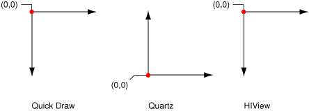
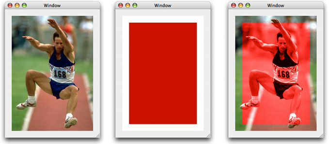
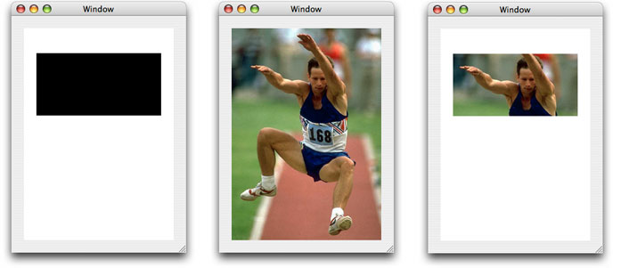
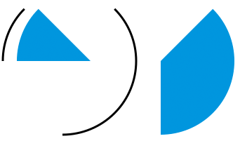
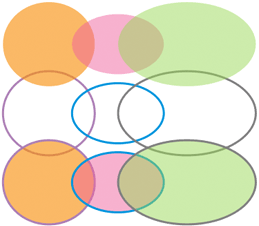
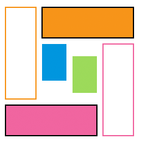
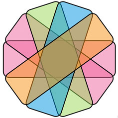
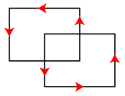
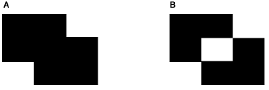
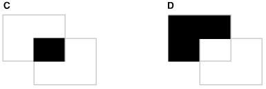

> 导航：[总目录](../../../README.md) · [documentation](../../../_indexes/documentation.md) · [Quartz Programming Guide for QuickDraw Developers](Introduction%20to%20Quartz%20Programming%20Guide%20for%20QuickDraw%20Developers.md)


[Next](Using%20Color.md)[Previous](Strategies.md)

# Basic Drawing

There are some basic similarities between drawing in QuickDraw and Quartz. Drawing, whether in QuickDraw or Quartz, involves obtaining a preconfigured drawing environment, specifying the geometry of shapes, and applying color to shape outlines, interiors, or both. But there are many differences that you will want to be aware of.

One important difference is that QuickDraw does not always make a clear distinction between specifying the geometry of an object and drawing the object. For example, you can’t specify lines, ovals, or rounded rectangles without drawing them. In Quartz, there is a clean separation between constructing an object (operations such as adding a rectangle to a path or creating a shading) and drawing the object (operations such as stroking and filling the path or drawing the shading).

There are many other differences. This chapter discusses basic drawing issues and how to accomplish a variety of drawing tasks using Quartz.

- [Coordinate Space](#apple-f4xwc4dqnrsv64tfmyxwi33df52wszbpkridimbqgaytaojyfvbuqmrsgawugsscjbcucq2j) describes the QuickDraw, Quartz, and HIView coordinate systems, and how to convert between QuickDraw and Quartz coordinates.
- [Drawing Destinations](#apple-f4xwc4dqnrsv64tfmyxwi33df52wszbpkridimbqgaytaojyfvbuqmrsgawugsscizdemrkd) compares QuickDraw and Quartz destinations and provides references to code examples that shows how to obtain graphics contexts.
- [Graphics State and Global Effects](#apple-f4xwc4dqnrsv64tfmyxwi33df52wszbpkridimbqgaytaojyfvbuqmrsgawugsscjjeecrsf) lists the Quartz graphics state parameters.
- [Color Blend Modes](#apple-f4xwc4dqnrsv64tfmyxwi33df52wszbpkridimbqgaytaojyfvbuqmrsgawugssci5dukrke) discusses how paint is composited to a background in Quartz and provides examples of using blend modes to colorize one image and draw a portion of another.
- [Alternatives to QuickDraw Drawing Functions](#apple-f4xwc4dqnrsv64tfmyxwi33df52wszbpkridimbqgaytaojyfvbuqmrsgawugsscjfbuissk) lists many QuickDraw region functions and suggests alternative functions in Quartz.
- [Constructing and Drawing Shapes](#apple-f4xwc4dqnrsv64tfmyxwi33df52wszbpkridimbqgaytaojyfvbuqmrsgawugsscizcemr2b) shows how to construct and draw two-dimensional shapes in Quartz and provides emulation routines for many QuickDraw functions.
- [Converting an Arbitrary QuickDraw Region to a Quartz Path](#apple-f4xwc4dqnrsv64tfmyxwi33df52wszbpkridimbqgaytaojyfvbuqmrsgawugsscivdeoqse) provides a generalized routine for handling region conversions.
- [Anti-aliasing](#apple-f4xwc4dqnrsv64tfmyxwi33df52wszbpkridimbqgaytaojyfvbuqmrsgawugsscjbaukqsh) describes what it is in Quartz and what settings affect it.
- [Clipping](#apple-f4xwc4dqnrsv64tfmyxwi33df52wszbpkridimbqgaytaojyfvbuqmrsgawugsscindeeske) compares QuickDraw and Quartz clipping and shows how to use clipping to draw the intersection and difference of two shapes.

QuickDraw and Quartz coordinate space differ most in the location you draw to and the location of the origin. In Quartz, you draw to user space, which is device-independent and pixel-free. By drawing to user space, you can send the same drawing to any number of destinations—screen, printer, bitmap, PDF—and Quartz converts the user space coordinates to the appropriate device space coordinates. No math required on your part!

When you draw with Quartz, you need only to work in user space. If for some reason your application needs to obtain the affine transform that Quartz uses to convert between user and device space, you can call the function [CGContextGetUserSpaceToDeviceSpaceTransform](https://developer.apple.com/documentation/coregraphics/cgcontext/1455677-userspacetodevicespacetransform), introduced in Mac OS X v10.4. Quartz also adds functions in Mac OS X v10.4 that convert geometries (points, sizes, and rectangles) between device and user space.

The Quartz user space is modeled on the Cartesian plane—coordinates are single-precision, floating-point numbers, and by default, the positive y-axis extends upward. In a new graphics context, the origin corresponds to the lower-left corner of the page, as shown in Figure 2-1. QuickDraw, by comparison, uses integer coordinates whose origin corresponds to the upper-left corner of a page. HIView, uses floating-point coordinates whose origin corresponds to the upper-left corner of a page.

__Figure 2-1__  Comparison of origins for QuickDraw, Quartz, and HIView



You can use Quartz translation and scaling functions to convert between coordinate systems. Listing 2-1 shows how to switch from Quartz coordinates to one whose origin is in the upper-left corner by modifying the context matrix prior to drawing.

__Listing 2-1__  Code that transforms the Quartz origin to be at the upper-left

```
CGContextSaveGState (myContext);
CGContextTranslateCTM (myContext, 0, myOrigin.y + myPortHeight);
CGContextScaleCTM (myContext, 1.0f, -1.0f);
// Your drawing code here.
CGContextRestoreGState (myContext);
```

The function [CGContextTranslateCTM](https://developer.apple.com/documentation/coregraphics/1455286-cgcontexttranslatectm) translates the coordinate system so that the _y_ values are moved toward the top of the HIView by the height of the HIView bounding rectangle. If you were to draw now, your drawing would be outside the HIView, not in a visible area.

The function [CGContextScaleCTM](https://developer.apple.com/documentation/coregraphics/1454659-cgcontextscalectm) code flips the y-coordinates by a factor of –1.0, effectively flipping the coordinates into the HIView. After this operation, the origin is at the lower left of the HIView, with the y values increasing from bottom to top. The x values are unchanged; they still increase from left to right.

If you use HIView in conjunction with Quartz, and draw to a graphics context that you obtain from HIView, that graphics context uses HIView coordinates. HIView places the origin in the upper-left corner of the view, but it uses floating-point values just like Quartz does. HIView uses the upper left to ensure that the coordinates of objects, such as controls, do not change as the user resizes the window. When you want to draw a Quartz image (CGImage) to an HIView, make sure that you use the HIView function `HIViewDrawCGImage`, which orients the image appropriately for the HIView coordinate system.

Keep in mind that text drawing is affected by the coordinate system. Quartz, the HIToolBox, and ATSUI are among the APIs that provide support for drawing text. You need to be aware of the coordinate-system assumptions made by each text drawing function as well as the transformations you’ve performed on the Quartz coordinate system. For example, if you use the default Quartz coordinate system and the Quartz text drawing functions ([CGContextShowText](https://developer.apple.com/documentation/coregraphics/cgcontext/1586507-showtext), [CGContextShowTextAtPoint](https://developer.apple.com/documentation/coregraphics/1586505-cgcontextshowtextatpoint), [CGContextShowGlyphs](https://developer.apple.com/documentation/coregraphics/1586500-cgcontextshowglyphs), and so forth), then text is drawn in the correct orientation. If you use the default Quartz coordinate system and the HIToolbox text drawing functions (such as `HIThemeDrawTextBox`), text appears inverted. In the case of `HIThemeDrawTextBox` you can remedy this by specifying the option `kHIThemeOrientationInverted`.

The details of text drawing and coordinate systems aren’t discussed here. It’s an issue you’ll want to investigate further. However, if you draw text and it either doesn’t appear or it appears inverted, take a close look at the coordinate system, the transformations you’ve performed, and the assumptions of the text drawing function you use. Also keep in mind that Quartz has a text matrix that can be transformed separately from default user space. For more information, see [Text](https://developer.apple.com/library/archive/documentation/GraphicsImaging/Conceptual/drawingwithquartz2d/dq_text/dq_text.html#//apple_ref/doc/uid/TP30001066-CH213) in _[Quartz 2D Programming Guide](../../Graphics%20Imaging/Quartz%202D%20Programming%20Guide/Introduction.md#apple-f4xwc4dqnrsv64tfmyxwi33df52wszbpkridgmbqgaytanrw)_.

In Quartz, all drawing takes place in a drawing environment called a graphics context. You can think of a graphics context as being equivalent to a QuickDraw grafport. Graphics contexts are really drawing destinations that are preconfigured for a specific use, including drawing to a window or printer, creating PDF content, creating a bitmap, drawing to an OpenGL context, or drawing to an offscreen layer. Some graphics contexts are multipaged, such as PDF and printing contexts. Every graphics context has a graphics state stack that you can use to save snapshots of the current drawing state. This allows you to modify the drawing state and then return back to a previous state.

Although graphics contexts are specialized for different drawing destinations, Quartz is designed to make as few assumptions as possible about the output device. For example, the Print Preview feature in Mac OS X redirects your output from a printing context to a PDF document and then to a raster display, with no loss of information or quality. This means that you simply draw to user space and let Quartz convert those coordinates appropriately for the graphics context.

Before you perform any drawing in Quartz, you need to obtain a graphics context because most drawing functions operate on a graphics context; that’s where your drawing is directed. Quartz provides creation functions for bitmap graphics contexts, PDF graphics contexts, OpenGL graphics contexts, and layers (which are derived from a graphics context, described in [CGLayer Drawing](https://developer.apple.com/library/archive/documentation/GraphicsImaging/Conceptual/drawingwithquartz2d/dq_layers/dq_layers.html#//apple_ref/doc/uid/TP30001066-CH219) in _[Quartz 2D Programming Guide](../../Graphics%20Imaging/Quartz%202D%20Programming%20Guide/Introduction.md#apple-f4xwc4dqnrsv64tfmyxwi33df52wszbpkridgmbqgaytanrw)_).

You obtain graphics contexts that are used for drawing to windows or a printer from the appropriate framework. Carbon (HIView) and Cocoa provide window graphics contexts. See [Creating a Window Graphics Context](../../Graphics%20Imaging/Quartz%202D%20Programming%20Guide/Graphics%20Contexts.md#apple-f4xwc4dqnrsv64tfmyxwi33df52wszbpkridgmbqgaytanrwfvbuqmrqgmwugsscirbuqqkd) in _[Quartz 2D Programming Guide](../../Graphics%20Imaging/Quartz%202D%20Programming%20Guide/Introduction.md#apple-f4xwc4dqnrsv64tfmyxwi33df52wszbpkridgmbqgaytanrw)_.

The Printing framework manages printing graphics contexts. In Mac OS X v10.4, you use the printing functions `PMSessionBeginCGDocument` and `PMSessionGetCGGraphicsContext`. Prior to Mac OS X v10.4 you use [PMSessionSetDocumentFormatGeneration](https://developer.apple.com/documentation/applicationservices/core_printing/1805527-pmsessionsetdocumentformatgenera) passing the constant `kPMGraphicsContextCoreGraphics`. See [Obtaining a Graphics Context for Printing](../../Graphics%20Imaging/Quartz%202D%20Programming%20Guide/Graphics%20Contexts.md#apple-f4xwc4dqnrsv64tfmyxwi33df52wszbpkridgmbqgaytanrwfvbuqmrqgmwugsscjjcekrsg) in _[Quartz 2D Programming Guide](../../Graphics%20Imaging/Quartz%202D%20Programming%20Guide/Introduction.md#apple-f4xwc4dqnrsv64tfmyxwi33df52wszbpkridgmbqgaytanrw)_.

In a drawing environment the graphics state defines the global framework within which graphics operations execute. A well-designed graphics state model helps to create a stable, consistent drawing environment and makes it easier to use a graphics API.

Quartz doesn’t maintain any global graphics state as QuickDraw does. Instead, the drawing state is maintained for each graphics context. Graphics contexts have attributes that are fixed at creation time, and parameters that you can modify while drawing. For example, in a bitmap context the pixel data is an attribute and the fill color is a parameter.

Every graphics context has a graphics state stack that you can use to save and restore snapshots of the current drawing state using the functions [CGContextSaveGState](https://developer.apple.com/documentation/coregraphics/1456156-cgcontextsavegstate) and [CGContextRestoreGState](https://developer.apple.com/documentation/coregraphics/1455391-cgcontextrestoregstate). There is no way in Quartz for you to get the current setting for a graphics state parameter. If you want that information, you need to track the settings yourself. Perhaps a better approach is to think in terms of bracketing your code with calls to save and restore the graphics state. Quartz provides “set” functions for changing each graphic state parameter. Graphics state parameters are discussed in detail in various chapters in _[Quartz 2D Programming Guide](../../Graphics%20Imaging/Quartz%202D%20Programming%20Guide/Introduction.md#apple-f4xwc4dqnrsv64tfmyxwi33df52wszbpkridgmbqgaytanrw)_. Start with the Graphics State section in the overview chapter, which includes a cross reference to the chapter that’s appropriate for a particular graphics state parameter.

The graphic state parameters include the following:

- Current transformation matrix (CTM)
- Clipping area
- Line characteristics: width, join, cap, dash, miter limit
- Anti-aliasing setting
- Color: fill and stroke setting
- Global alpha value (transparency)
- Rendering intent
- Color space: fill and stroke settings
- Text settings: font, font size, character spacing, text drawing mode
- Blend mode

`CopyBits` uses transfer modes to combine pixels in a source and destination image in different ways. As stated earlier, Quartz has no replacement for QuickDraw transfer modes. But depending on what you want to achieve, Quartz blend modes might provide the answer. In Quartz, compositing is based on alpha information. A graphics context has a global alpha parameter that determines the opacity of any object that’s drawn, including images. In addition, an image can have its own alpha channel that determines the opacity of each pixel when the image is composited with the background.

In Mac OS X v10.4 and later, Quartz provides an additional compositing parameter, called the _blend mode_, that determines how source and background colors interact. (Quartz blend modes are based on PDF blend modes.) You can use the blend mode to get special compositing effects such as tinting and colorizing when drawing images. The blend mode is a part of the graphics state in a context, and you can change it by passing a constant to the function [CGContextSetBlendMode](https://developer.apple.com/documentation/coregraphics/1455994-cgcontextsetblendmode).

When the blend mode is the default value (`kCGBlendModeNormal`), the blend color is simply the source color. In the normal blend mode Quartz performs alpha blending by combining the components of the source color with the components of the destination color using the formula:

`destination = (alpha * source) + (1 - alpha) * destination`

Other blend modes combine source and background colors in various ways. For example, the darken blend mode selects the darker of the source and background colors. While blend modes and transfer modes are not the same mathematically, there may be some blend modes that could be used as replacements for transfer modes.

Blend modes are described in detail in _[Quartz 2D Programming Guide](../../Graphics%20Imaging/Quartz%202D%20Programming%20Guide/Introduction.md#apple-f4xwc4dqnrsv64tfmyxwi33df52wszbpkridgmbqgaytanrw)_. In the next two sections you’ll see how you can use the color blend mode to colorize an image and the lighten blend mode to show part of an image. But for detailed information about using all the Quartz blend modes, including examples of the sorts of results you can get, see [Setting Blend Modes](../../Graphics%20Imaging/Quartz%202D%20Programming%20Guide/Paths.md#apple-f4xwc4dqnrsv64tfmyxwi33df52wszbpkridgmbqgaytanrwfvbuqmrrgewueq2ji5eugrkg). If you depend heavily on transfer modes for advanced imaging effects, also take a look at the _[Core Image Programming Guide](../../Graphics%20Imaging/Core%20Image%20Programming%20Guide/About%20Core%20Image.md#apple-f4xwc4dqnrsv64tfmyxwi33df52wszbpkridgmbqgaytcobv)_, which describes Core Image blend mode filters.

One way that you can use the color blend mode is to colorize an image. Draw the image you want to colorize. Then set the blend mode by passing the constant `kCGBlendModeColor` to the function [CGContextSetBlendMode](https://developer.apple.com/documentation/coregraphics/1455994-cgcontextsetblendmode). Draw and fill a rectangle (or other shape) using the color you want to use for colorizing the image. The code in Listing 2-2 draws a fully opaque red rectangle (see [Figure 2-2](#apple-f4xwc4dqnrsv64tfmyxwi33df52wszbpkridimbqgaytaojyfvbuqmrsgawugsscjjbuqrse)) over the image of the jumper, to achieve the result shown on the right side of the figure. Note that the entire image of the jumper is not colorized because the red rectangle is smaller than the image.

__Listing 2-2__  Code that uses the color blend mode

```
 CGContextSaveGState (context);
 CGContextDrawImage(context, myRect1, image);
 CGContextSetBlendMode(context, kCGBlendModeColor);
 CGContextSetRGBFillColor (context, 0.8, 0.0, 0.0, 1.0);
 CGContextFillRect (context, myRect2);
 CGContextSaveGState (context);
```


__Figure 2-2__  A jumper, a red rectangle, and the jumper image colorized



Another interesting effect you can achieve by using a blend mode is to show only a portion of an image. Normally you would achieve this effect using clipping. You use the lighten blend mode and an opaque black shape that defines the area of the image that you want to show. As shown in Listing 2-3, you fill a shape (here the code uses a rectangle) with opaque black, set the blend mode to `kCGBlendModeLighten`, and then draw the image. [Figure 2-3](#apple-f4xwc4dqnrsv64tfmyxwi33df52wszbpkridimbqgaytaojyfvbuqmrsgawugsscivdukq2j) shows the rectangle, the original image of a jumper, and the resulting image. The part of the image you can see coincides exactly with the rectangle.

__Listing 2-3__  Code that uses the lighten blend mode to show part of an image

```
 CGContextSaveGState (context);
 CGContextSetRGBFillColor (context, 0.0, 0.0, 0.0, 1.0);
 CGContextFillRect (context, myRect);
 CGContextSetBlendMode (context, kCGBlendModeLighten);
 CGContextDrawImage (context, contextRect, image);
 CGContextRestoreGState (context);
```


__Figure 2-3__  An opaque black rectangle, a jumper, and the resulting image



You define arbitrary two-dimensional shapes in Quartz using graphics paths. If you haven’t already done so, you should read [Paths](https://developer.apple.com/library/archive/documentation/GraphicsImaging/Conceptual/drawingwithquartz2d/dq_paths/dq_paths.html#//apple_ref/doc/uid/TP30001066-CH211) in _[Quartz 2D Programming Guide](../../Graphics%20Imaging/Quartz%202D%20Programming%20Guide/Introduction.md#apple-f4xwc4dqnrsv64tfmyxwi33df52wszbpkridgmbqgaytanrw)_. That chapter describes the rich set of path construction and drawing operations, and also describes how to use a path as a clipping mask.

Quartz provides two sets of functions for drawing paths. One set draws directly to a graphics context. These functions are defined in _[CGContext Reference](https://developer.apple.com/documentation/coregraphics/cgcontext)_ and each use the CGContext prefix. You construct a path in a graphics context by calling functions that add to the path (lines, rectangle, ellipses, and so forth). Then you paint the path (by stroking, filling, or both). After you paint the path, it is no longer accessible; it’s gone from the context.

The other set of functions draws to a CGPath object (`CGPathRef`) data type. These functions are defined in _[CGPath Reference](https://developer.apple.com/documentation/coregraphics/cgpath)_, and each use the CGPath prefix. You call functions that build a path in the CGPath object. Then you paint the path (by stroking, filling, or both). As long as you keep the CGPath object around, you can paint the path whenever you like. For shapes that you plan to reuse, CGPath objects are what you want to use.

Here are a few important differences between paths and regions:

- Paths are designed with device and resolution independence in mind. There’s no notion of adding pixels to a path or converting a bitmap into a path.
- The functions you use to construct a path are entirely separate from the functions you use to draw the path.
- Paths have a direction. The elements in a path—lines, curves, and so on—are sequentially ordered, and this information is retained in the path definition.
- Path operations for adding Bézier curves make it possible to construct shapes with complex, curvilinear contours. QuickDraw has nothing comparable to this feature.
- When a path is filled with color or used for clipping, Quartz uses standard, well-defined fill rules to determine the area inside the path.

The next sections show how to implement functions that are equivalent to the QuickDraw function `PaintArc`, `FrameArc`, `PaintOval`, `FrameOval`, `PaintRect`, and `FrameRect`. You’ll also see how to create rounded rectangles and how to draw the union and symmetric difference of two shapes. Most of the code in the next sections is excerpted from the QuartzShapes sample code project, which you can download from [http://developer.apple.com/samplecode/](https://developer.apple.com/samplecode/).

Figure 2-4 shows examples of arcs that are stroked or filled. In Quartz, the general procedure for drawing a shape is to first construct a path and then to fill it, stroke it, or fill and stroke it. To emulate the QuickDraw functions `FrameArc` and `PaintArc`, you first need to write a function that creates an arc path. [Listing 2-4](#apple-f4xwc4dqnrsv64tfmyxwi33df52wszbpkridimbqgaytaojyfvbuqmrsgawugsscincuqq2f) shows a routine that constructs an arc path.

__Figure 2-4__  Arcs drawn using Quartz



In addition to the graphics context that you want to draw to, the `pathForArc` routine takes the same parameters that you would pass to the `FrameArc` and `PaintArc` functions: a rectangle whose center specifies the origin of the arc you want to draw as well as the x radius and y radius of the arc, the starting angle (in degrees), and the angle (in degrees) of the arc. A detailed explanation for each numbered line of code appears following the listing.

__Listing 2-4__  A routine that constructs an arc path

```
void pathForArc (CGContextRef context, CGRect r,
                    int startAngle, int arcAngle)
{
    float start, end;

    CGContextSaveGState(context);// 1
    CGContextTranslateCTM(context, r.origin.x + r.size.width/2,// 2
                                 r.origin.y + r.size.height/2);,

    CGContextScaleCTM(context, r.size.width/2, r.size.height/2);// 3
    if (arcAngle > 0) {// 4
        start = (90 - startAngle - arcAngle) * M_PI / 180;
        end = (90 - startAngle) * M_PI / 180;
    } else {
        start = (90 - startAngle) * M_PI / 180;
        end = (90 - startAngle - arcAngle) * M_PI / 180;
    }
    CGContextAddArc (context, 0, 0, 1, start, end, false);// 5

    CGContextRestoreGState(context);// 6
}
```

Here’s what the code does:

1. Saves the graphic state. You need to change the current transformation matrix (CTM), so you’ll want to save the graphics state and then restore it later.
2. Translates the CTM by the x origin of the arc plus half the width and the y origin of the arc plus half the height.
3. Scales the CTM by half the width and half the height.
4. Computes the starting and ending angle as measured in radians from the positive x-axis, taking into consideration whether the angle passed to `pathForArc` is positive or negative.
5. Adds the arc path to the current context. This call does not paint the arc. The function [CGContextAddArc](https://developer.apple.com/documentation/coregraphics/1455756-cgcontextaddarc) takes a graphics context, the x- and y- coordinates (in user space) that define the center of the arc. The radius of the arc (in user space coordinates), the angle (in radians) to the starting point of the arc, the angle (in radians) to the ending point of the arc, and a Boolean value that indicates the direction to draw the path.
6. Restores the graphics state.

The `frameArc` routine shown in Listing 2-5, strokes an arc so that its origin is centered in the rectangle that you pass to the function. It calls the `pathForArc` routine to create the arc prior to filling the arc and `CGContextStrokePath` to perform the actual stroking.

__Listing 2-5__  A routine that frames (strokes) an arc

```
void frameArc(CGContextRef context, CGRect r,
    int startAngle, int arcAngle)
{

    CGContextBeginPath (context);
     pathForArc (context,r,startAngle,arcAngle);
    CGContextStrokePath(context);
}
```

The `paintArc` routine shown in Listing 2-6 fills an arc so that its origin is centered in the rectangle that you pass to the function. It calls the `pathForArc` routine to create the arc prior to filling the arc and calls `CGContextFillPath` to perform the fill operation.

__Listing 2-6__  A routine that paints (fills) an arc

```
void paintArc (CGContextRef context, CGRect r,
                        int startAngle, int arcAngle)
{

    CGContextBeginPath (context);
    CGContextMoveToPoint (context, r.origin.x + r.size.width/2,
                            r.origin.y + r.size.height/2);
     pathForArc (context,r,startAngle,arcAngle);
    CGContextClosePath (context);
    CGContextFillPath (context);
}
```


Figure 2-5 shows examples of ovals that are stroked, filled, and both stroked and filled. Prior to Mac OS X v10.4, to emulate the QuickDraw functions `FrameOval` and `PaintOval`, you first need to write a function that creates an oval (or elliptical) shaped path. Starting in Mac OS X v10.4, you can frame ovals using the function `CGContextStrokeEllipseInRect`, which strokes (frames) an ellipse that fits in the specified rectangle. You paint (fill) ovals using the function [CGContextFillEllipseInRect](https://developer.apple.com/documentation/coregraphics/1454371-cgcontextfillellipseinrect), which fills (paints) an ellipse that fits in the specified rectangle.

__Figure 2-5__  Ovals drawn using Quartz



The emulation functions are provided in case you need code that runs on versions of Mac OS X prior to v10.4. Listing 2-7 constructs an oval path. [Listing 2-8](#apple-f4xwc4dqnrsv64tfmyxwi33df52wszbpkridimbqgaytaojyfvbuqmrsgawugsscivauqqsh) paints an oval, and [Listing 2-9](#apple-f4xwc4dqnrsv64tfmyxwi33df52wszbpkridimbqgaytaojyfvbuqmrsgawugsscjbeesrsh) frames one. A detailed explanation for each number line of code in Listing 2-7 follows the listing.

__Listing 2-7__  A routine that constructs an oval path

```
void addOvalToPath(CGContextRef context, CGRect r)
{
    CGContextSaveGState(context);// 1

     CGContextTranslateCTM(context, r.origin.x + r.size.width/2,// 2
                                 r.origin.y + r.size.height/2);
     CGContextScaleCTM(context, r.size.width/2, r.size.height/2);// 3
    CGContextBeginPath(context);// 4
    CGContextAddArc(context, 0, 0, 1, 0, 2*pi, true);// 5

    CGContextRestoreGState(context);// 6
}
```

Here’s what the code does:

1. Saves the graphics state so that you can restore it later.
2. Transforms the origin of the CTM to the center of the bounding rectangle. The center of the bounding rectangle will be the center of the oval.
3. Scales the CTM so that a radius of 1 is equal to the bounds of the rectangle,
4. Creates a new, empty path in the graphics context.
5. Adds a circle to the path in the graphics context. But because the CTM is transformed, the circle is subjected to that transformation. After transformation, the circle becomes an oval that lies just inside the bounding rectangle.
6. Restores the graphics state to what it was prior to transforming the CTM.

The `paintOval` routine shown in Listing 2-8 calls the `addOvalToPath` routine, passing a rectangle to center the oval in, and then fills the path using the Quartz function [CGContextFillPath](https://developer.apple.com/documentation/coregraphics/1456306-cgcontextfillpath).

__Listing 2-8__  A routine that paints (fills) an oval

```
void paintOval(CGContextRef context, CGRect r)
{
    addOvalToPath (context,r);
    CGContextFillPath (context);
}
```

The `frameOval` routine shown in Listing 2-9 calls the `addOvalToPath` routine, passing a rectangle to center the oval in, and then strokes the path using the Quartz function [CGContextStrokePath](https://developer.apple.com/documentation/coregraphics/1454490-cgcontextstrokepath). In QuickDraw, `FrameOval` completely insets the oval in the rectangle. In the `frameOval` routine, the path is inset but the stroke is painted with one-half its thickness on each side of the path.

__Listing 2-9__  A routine that frames (strokes) an oval

```
void frameOval(CGContextRef context, CGRect r)
{
    addOvalToPath(context,r);

    CGContextStrokePath(context);
}
```


Figure 2-6 shows examples of rectangles that are stroked, filled, and both stroked and filled. Quartz provides convenience functions for stroking and painting rectangles. You can simply use the Quartz functions [CGContextStrokeRect](https://developer.apple.com/documentation/coregraphics/cgcontext/1454675-stroke) and [CGContextFillRect](https://developer.apple.com/documentation/coregraphics/1454700-cgcontextfillrect). Keep in mind that in QuickDraw, framing routines completely inset a shape in the specified rectangle. In Quartz, stroking paints a line such that one-half its thickness is on each side of the path.

__Figure 2-6__  Rectangles drawn using Quartz



Figure 2-7 shows a series of rounded rectangles that are stroked with black and filled using a variety of translucent colors. To draw a rounded rectangle, you first need to write a function that creates a rounded rectangle path, and then create functions that stroke and fill the rounded rectangle.

__Figure 2-7__  Rounded rectangles drawn using Quartz



The `addRoundedRectToPath` routine shown in [Listing 2-10](#apple-f4xwc4dqnrsv64tfmyxwi33df52wszbpkridimbqgaytaojyfvbuqmrsgawugssci5deoqkj) constructs a rounded rectangle path by using a series of calls to the function [CGContextAddArcToPoint](https://developer.apple.com/documentation/coregraphics/1456238-cgcontextaddarctopoint). Although you can simply use the code in the listing to construct rounded rectangles, it’s worth taking a moment to understand the [CGContextAddArcToPoint](https://developer.apple.com/documentation/coregraphics/1456238-cgcontextaddarctopoint) function. This function adds the arc of a circle to the current subpath. When you call this function directly, you supply two pairs of coordinates— (_x1_,_y1_) and (_x2_,_y2_)—that define two tangent lines, and a radius that defines the curvature of the arc.

The arc constructed by the function [CGContextAddArcToPoint](https://developer.apple.com/documentation/coregraphics/1456238-cgcontextaddarctopoint) is tangent to two lines: the line from the current point to (_x1_,_y1_), and the line from (_x1_,_y1_) to (_x2_,_y2_). The start and end points of the arc are the tangent points of the lines. If the current point and the first tangent point of the arc (the starting point) are not equal, Quartz appends a straight line segment from the current point to the first tangent point. After adding the arc, the current point is reset to the end point of arc (the second tangent point).

Now take a look at the `addRoundedRectToPath` routine in [Listing 2-10](#apple-f4xwc4dqnrsv64tfmyxwi33df52wszbpkridimbqgaytaojyfvbuqmrsgawugssci5deoqkj). The routine takes a graphics context, a rectangle into which the rounded rectangle must fit, and the width and height of the oval that defines the rounded corners. A detailed explanation for each numbered line of code appears following Listing 2-10.

__Listing 2-10__  A routine that constructs a rounded rectangle path

```
static void addRoundedRectToPath(CGContextRef context, CGRect rect,
                        float ovalWidth,float ovalHeight)

{
    float fw, fh;

    if (ovalWidth == 0 || ovalHeight == 0) {// 1
        CGContextAddRect(context, rect);
        return;
    }

    CGContextSaveGState(context);// 2

    CGContextTranslateCTM (context, CGRectGetMinX(rect),// 3
                         CGRectGetMinY(rect));
    CGContextScaleCTM (context, ovalWidth, ovalHeight);// 4
    fw = CGRectGetWidth (rect) / ovalWidth;// 5
    fh = CGRectGetHeight (rect) / ovalHeight;// 6

    CGContextMoveToPoint(context, fw, fh/2); // 7
    CGContextAddArcToPoint(context, fw, fh, fw/2, fh, 1);// 8
    CGContextAddArcToPoint(context, 0, fh, 0, fh/2, 1);// 9
    CGContextAddArcToPoint(context, 0, 0, fw/2, 0, 1);// 10
    CGContextAddArcToPoint(context, fw, 0, fw, fh/2, 1); // 11
    CGContextClosePath(context);// 12

    CGContextRestoreGState(context);// 13
}
```

Here’s what the code does:

1. If the width or height of the oval is 0, adds a rectangle to the graphics context and returns. In addition, the corner reduces to a right angle, which is simply an ordinary rectangle.
2. Saves the graphics state so that you can restore it later.
3. Translates the origin of the graphics context to the lower-left corner of the rectangle.
4. Normalizes the scale of the graphics context so that the width and height of the arcs are 1.0.
5. Calculates the width of the rectangle in the new coordinate system.
6. Calculates the height of the rectangle in the new coordinate system.
7. Moves to the mid point of the right edge of the rectangle.
8. Adds an arc to the starting point. This is the upper-right corner of the rounded rectangle.
9. Adds an arc that defines the upper-left corner of the rounded rectangle.
10. Adds an arc that defines the lower-left corner of the rounded rectangle.
11. Adds an arc that defines the lower-right corner of the rounded rectangle.
12. Closes the path, which connects the current point to the starting point, and terminates the subpath.
13. Restores the graphics state to what it was previously.

The `strokeRoundedRect` routine, shown in Listing 2-11, calls the `addRoundedRectToPath` routine, passing a rectangle, and the oval width and height to use for rounding. The routine then strokes the path by using the Quartz function [CGContextStrokePath](https://developer.apple.com/documentation/coregraphics/1454490-cgcontextstrokepath).

__Listing 2-11__  A routine that frames (strokes) a rounded rectangle

```
void strokeRoundedRect(CGContextRef context, CGRect rect, float ovalWidth,
                       float ovalHeight)
{
    CGContextBeginPath(context);
    addRoundedRectToPath(context, rect, ovalWidth, ovalHeight);
    CGContextStrokePath(context);
}
```

The `fillRoundedRect` routine shown in Listing 2-12 calls the `addRoundedRectToPath` routine, passing a rectangle, and the oval width and height to use for rounding. The routine then fills the path using the Quartz function [CGContextFillPath](https://developer.apple.com/documentation/coregraphics/1456306-cgcontextfillpath).

__Listing 2-12__  A routine that paints (fills) a rounded rectangle

```
void fillRoundedRect (CGContextRef context, CGRect rect,
                        float ovalWidth, float ovalHeight)

{
    CGContextBeginPath(context);
    addRoundedRectToPath(context, rect, ovalWidth, ovalHeight);
    CGContextFillPath(context);
}
```


QuickDraw provides functions to find the union, intersection, or difference of two regions. Quartz has no comparable set operations for paths. However, it’s possible to mimic these operations when filling areas in a path with overlapping shapes. This example demonstrates how to draw the union and symmetric difference (XOR) of two shapes. Drawing the intersection and difference requires clipping, which is described in [A Basic Clipping Example](#apple-f4xwc4dqnrsv64tfmyxwi33df52wszbpkridimbqgaytaojyfvbuqmrsgawugssci5ceiqsh) in the section [Clipping](#apple-f4xwc4dqnrsv64tfmyxwi33df52wszbpkridimbqgaytaojyfvbuqmrsgawugsscindeeske).

Figure 2-8 shows the path used in this example. The arrows indicate the counterclockwise direction of each shape.

__Figure 2-8__  A path with two overlapping shapes



Figure 2-9 shows a drawing of the union and symmetric difference (XOR) of the two shapes. Their union is drawn using the nonzero winding number fill rule, and their symmetric difference is drawn using the even-odd fill rule. (These rules are described in detail in _[Quartz 2D Programming Guide](../../Graphics%20Imaging/Quartz%202D%20Programming%20Guide/Introduction.md#apple-f4xwc4dqnrsv64tfmyxwi33df52wszbpkridgmbqgaytanrw)_.)

__Figure 2-9__  Drawing the union (A) and symmetric difference (B) of two shapes



Listing 2-13 defines the two shapes and constructs path objects that contain one or both shapes. A detailed explanation for each numbered line of code follows the listing.

__Listing 2-13__  Code that uses fill rules to draw the union and symmetric difference of two shapes

```
const float width = 80.0;
const float height = 60.0;

CGRect rect1 = {{ 0, height/2 }, { width, height }};
CGRect rect2 = {{ width/2, 0 }, { width, height }};
CGRect rects[2] = { rect1, rect2 };

// Shapes 1 and 2 are declared here but used in the clipping example
CGMutablePathRef shape1 = CGPathCreateMutable();
CGMutablePathRef shape2 = CGPathCreateMutable();
CGMutablePathRef shapes = CGPathCreateMutable();

CGPathAddRect (shape1, NULL, rect1);
CGPathAddRect (shape2, NULL, rect2);
CGPathAddRects (shapes, NULL, rects, 2);

CGContextSaveGState (ctx);
CGContextBeginPath (ctx);// 1

// union
CGContextAddPath (ctx, shapes);// 2
CGContextFillPath (ctx);// 3

CGContextTranslateCTM (ctx, width * 3, 0);

// symmetric difference (XOR)
CGContextAddPath (ctx, shapes);// 4
CGContextEOFillPath (ctx);// 5

CGContextRestoreGState (ctx);
// Your code should include calls to CGPathRelease to release each path
```

Here’s what the code does:

1. Replaces the current path (if any) in the context with a new, empty path.
2. Adds the two shapes to the current path.
3. Fills the current path using the nonzero winding number rule. Both shapes have the same direction, so the entire area is filled.
4. Adds the two shapes to the current path again. This is necessary because the fill operation in the previous step consumes the path.
5. Fills the path using the even-odd rule. This time, the area common to both shapes is not filled.

Regions in QuickDraw and paths in Quartz are very different abstractions. Regions are pixel based and don’t retain any information about the contours or boundaries of the shapes they represent. Paths are vector-based representations of the contours of shapes, with no concept of pixels. Converting a region into a path may be inefficient, and the contours of the converted path may not look smooth or scale well. Quartz does not provide a function to convert a region into a path. If at all possible, you will want to replace our use of regions with Quartz abstractions rather than perform this type of conversion. However, if you must, it is possible to write a program to perform the conversion yourself.

This section demonstrates how to write code that converts an arbitrary QuickDraw region into a Quartz path by taking a divide-and-conquer approach. The first step is to describe a region in terms of vectors. Rectangles are ideal for this purpose. It turns out that any region can be decomposed into a sequence of rectangles in top-down or left-right order. QuickDraw provides the function `QDRegionToRects` for exactly this purpose.

On the Quartz side, several functions exist for adding rectangles to graphics paths. The only remaining problem is to convert the rectangles into the floating-point [CGRect](https://developer.apple.com/documentation/coregraphics/cgrect) format used by Quartz, which is easy to do.

The sample code in Listing 2-14 shows how to write two custom functions that work together to perform the conversion. A detailed explanation for each numbered line of code follows the listing.

- `MyConvertRegionToPath` creates a new path, performs the conversion, and returns the path to the caller.
- `MyRegionToRectsCallback` converts a QuickDraw rectangle into a Quartz rectangle and appends it to the new path.

When you use the converted path to draw in a graphics context with a flipped coordinate space, the path will have the same orientation as the region.

__Listing 2-14__  Routines that convert a QuickDraw region into a Quartz path

```
OSStatus MyConvertRegionToPath (RgnHandle region, CGPathRef* outPath)
{
    RegionToRectsUPP proc = NewRegionToRectsUPP (MyRegionToRectsCallback);
    CGPathRef path = CGPathCreateMutable();
    OSStatus err = noErr;

    err = QDRegionToRects (
        region, kQDParseRegionFromTopLeft, proc, (void*)path);// 1

    if (err == noErr) {
        *outPath = path;// 2
    }
    else {
        CGPathRelease (path);
        *outPath = NULL;
    }

    DisposeRegionToRectsUPP (proc);
    return err;
}

OSStatus MyRegionToRectsCallback (
    UInt16 message, RgnHandle region, const Rect *rect, void *data)
{
    if (message == kQDRegionToRectsMsgParse)
    {
        Rect qd = *rect;
        CGRect cg = CGRectMake (
            qd.left, qd.top, qd.right - qd.left, qd.bottom - qd.top);// 3

        CGPathAddRect (
            (CGMutablePathRef)data, NULL, cg);// 4
    }

    return noErr;
}
```

Here’s what the code does:

1. Converts the region into a path.
2. Passes the converted path back to the caller.
3. Converts the QuickDraw rectangle into a Quartz rectangle, using the upper-left point as the origin.
4. Adds the Quartz rectangle to the path being constructed.

Anti-aliasing is used in 2D graphics to smooth and soften the jagged (or aliased) edges you sometimes see when graphical objects such as text, line art, and images are drawn in a bitmap context. Anti-aliased objects are more accurately represented, more appealing to the eye, and more realistic.

Quartz provides a clear advantage over QuickDraw when it comes to anti-aliasing because Quartz uses anti-aliasing to draw shapes as well as text. Quartz also provides several levels of additional text anti-aliasing or text smoothing for LCD displays. QuickDraw supports anti-aliasing for text only, and its algorithm is limited to 16 shades of gray, with glyphs always positioned on pixel boundaries.

Quartz anti-aliasing maintains consistent high-quality rendering at any resolution by finding the best representation for a particular device. In graphics contexts that support anti-aliasing, by default everything drawn is anti-aliased. Images are drawn with anti-aliasing along their borders, causing them to appear to blend smoothly into the adjacent background.

Compared with QuickDraw, Quartz text anti-aliasing is more sophisticated. Quartz anti-aliasing uses a coverage model to compute the degree to which nearby pixels in device space are covered or contained by the drawing primitive. The coverage data determines the opacity of partially covered pixels. Anti-aliasing uses 8-bit opacity, which provides 256 different opacity levels. The opacity depth could increase in the future, as device capabilities and algorithms improve.

You can turn anti-aliasing off for a particular bitmap graphics context by calling the Quartz function [CGContextSetShouldAntialias](https://developer.apple.com/documentation/coregraphics/1455178-cgcontextsetshouldantialias). The anti-aliasing setting is part of the graphics state.

Beginning in Mac OS X v10.4, you can also control whether or not to allow anti-aliasing for a particular bit-oriented graphics context by using the function [CGContextSetAllowsAntialiasing](https://developer.apple.com/documentation/coregraphics/1456310-cgcontextsetallowsantialiasing). Pass `true` to this function to allow anti-aliasing, and `false` not to allow it. This setting is not part of the graphics state. Quartz performs anti-aliasing for a bit-oriented graphics context if you allow anti-aliasing (by passing `true` to [CGContextSetAllowsAntialiasing](https://developer.apple.com/documentation/coregraphics/1456310-cgcontextsetallowsantialiasing)) and you set the anti-aliasing setting graphics state parameter to `true` (by calling [CGContextSetShouldAntialias](https://developer.apple.com/documentation/coregraphics/1455178-cgcontextsetshouldantialias)).

Quartz uses clipping to limit drawing in a graphics context. Quartz functions that clip ([CGContextClip](https://developer.apple.com/documentation/coregraphics/1455262-cgcontextclip), [CGContextEOClip](https://developer.apple.com/documentation/coregraphics/1455944-cgcontexteoclip)) intersect the clip with the current clip, “trimming” the clipping area in a cookie-cutter-like manner. The primary differences between clipping in Quartz and QuickDraw are as follows:

- When your application creates a graphics context or obtains a context that’s created elsewhere, the clipping area in the context is already configured for a specific use. The default clipping area in a new graphics context is typically the entire page or window content area.
- You cannot directly access the clipping area. Instead, Quartz provides clipping functions that modify the clipping area for you. You can save and later restore the current clipping area, along with the entire graphics state, by using the functions [CGContextSaveGState](https://developer.apple.com/documentation/coregraphics/1456156-cgcontextsavegstate) and `CGContextRestoreGState`.
- When you call one of the Quartz clipping functions, the new clipping area is the intersection of the current clipping area with (1) the area inside a filled path or (2) a grayscale image or image mask.
- Because of how intersection works, clipping functions can’t extend the clipping area beyond its current bounds.

Quartz has these functions available for clipping:

- [CGContextClip](https://developer.apple.com/documentation/coregraphics/1455262-cgcontextclip) intersects the current clipping area with the filled area of the current path, using the non zero winding rule.
- [CGContextEOClip](https://developer.apple.com/documentation/coregraphics/1455944-cgcontexteoclip) intersects the current clipping area with the filled area of the current path, using the even-odd rule. Often, you’ll find that `CGContextEOClip` is more convenient to use than the function `CGContextClip`. For QuickDraw-style intersections, even-odd rules match better.
- [CGContextClipToMask](https://developer.apple.com/documentation/coregraphics/1456497-cgcontextcliptomask) , available starting in Mac OS X v10.4, intersects the clipping area in a graphics context with a mask. The mask can be an image mask or a grayscale image. For more information, see [Masking an Image by Clipping the Context](../../Graphics%20Imaging/Quartz%202D%20Programming%20Guide/Bitmap%20Images%20and%20Image%20Masks.md#apple-f4xwc4dqnrsv64tfmyxwi33df52wszbpkridgmbqgaytanrwfvbuqmrrgiwugsscjbceiqsf) in _[Quartz 2D Programming Guide](../../Graphics%20Imaging/Quartz%202D%20Programming%20Guide/Introduction.md#apple-f4xwc4dqnrsv64tfmyxwi33df52wszbpkridgmbqgaytanrw)_.

The _[Quartz 2D Programming Guide](../../Graphics%20Imaging/Quartz%202D%20Programming%20Guide/Introduction.md#apple-f4xwc4dqnrsv64tfmyxwi33df52wszbpkridgmbqgaytanrw)_ describes how clipping works in more detail and discusses the difference between the winding and even-odd rules for determining the inside of a shape.

This example is a continuation of [Drawing the Union and Symmetric Difference of Two Shapes](#apple-f4xwc4dqnrsv64tfmyxwi33df52wszbpkridimbqgaytaojyfvbuqmrsgawugsscinduirse). Quartz does not provide functions that compute the difference or intersection of two paths, but this example demonstrates how to use clipping to achieve a similar effect. That is, to draw the intersection and difference of two shapes in a single path (see [Figure 2-8](#apple-f4xwc4dqnrsv64tfmyxwi33df52wszbpkridimbqgaytaojyfvbuqmrsgawueq2jjfbusskf)).

In Figure 2-10, the intersection of two shapes is drawn by clipping with each shape separately and then filling the shapes. For simplicity, this example uses rectangular paths. Typically you would use this approach with more complex paths. Their difference (shape 1 - shape 2) is drawn by clipping with both shapes using the even-odd rule, and then drawing the first shape.

__Figure 2-10__  Drawing the intersection (C) and difference (D) of two shapes



Listing 2-15 shows how to draw the filled areas in black.

__Listing 2-15__  Code that uses clipping to draw the intersection and difference of two shapes

```
// intersection
CGContextSaveGState (ctx);// 1
CGContextAddPath (ctx, shape1);// 2
CGContextClip (ctx);
CGContextAddPath (ctx, shape2);
CGContextClip (ctx);
CGContextAddPath (ctx, shapes);// 3
CGContextFillPath (ctx);
CGContextRestoreGState (ctx);// 4

CGContextTranslateCTM (ctx, width * 3, 0);

// difference
CGContextSaveGState (ctx);
CGContextAddPath (ctx, shapes);// 5
CGContextEOClip (ctx);
CGContextAddPath (ctx, shape1);// 6
CGContextFillPath (ctx);
CGContextRestoreGState (ctx);
```

Here’s what the code does:

1. Saves the graphics state. This is done because step 2 modifies the clipping area, a part of the graphics state.
2. Intersects the clipping area with each shape individually. This has the effect of removing the area not common to both shapes from the clipping area. As with drawing operations, clipping consumes the current path.
3. Fills the shapes using the clip defined in the step 2.
4. Restores the clipping area to its previous state, saved in step 1.
5. Intersects the clipping area with both shapes using the even-odd rule. This has the effect of removing the area common to both shapes from the clipping area.
6. Constructs and fills a path consisting of the first shape, using the clip defined in step 5.

QuickDraw region functions do not have exact replacements in Quartz, but there are many alternatives in Quartz that work just as well. A good approach is to find an alternative and study how it’s used in code examples such as the CarbonSketch sample application that’s available from the ADC Reference Library. [Table 2-1](#apple-f4xwc4dqnrsv64tfmyxwi33df52wszbpkridimbqgaytaojyfvbuqmrsgawugsscjfeukrsg) lists alternatives to some of the QuickDraw region functions.

See also [Constructing and Drawing Shapes](#apple-f4xwc4dqnrsv64tfmyxwi33df52wszbpkridimbqgaytaojyfvbuqmrsgawugsscizcemr2b), [Converting an Arbitrary QuickDraw Region to a Quartz Path](#apple-f4xwc4dqnrsv64tfmyxwi33df52wszbpkridimbqgaytaojyfvbuqmrsgawugsscivdeoqse), and [Clipping](#apple-f4xwc4dqnrsv64tfmyxwi33df52wszbpkridimbqgaytaojyfvbuqmrsgawugsscindeeske).

__Table 2-1__  Alternatives to region functions

| QuickDraw function | Alternatives |
| `ClipRect` replaces the clipping region with a region that’s a rectangle. | [CGContextClipToRect](https://developer.apple.com/documentation/coregraphics/1454716-cgcontextcliptorect) intersects the current clipping area with a rectangle. |
| `CopyRgn` makes a copy of a region. | [CGPathCreateCopy](https://developer.apple.com/documentation/coregraphics/1411211-cgpathcreatecopy) and [CGPathCreateMutableCopy](https://developer.apple.com/documentation/coregraphics/cgpath/1411196-mutablecopy) make a copy of a path. |
| `DiffRgn` finds the difference of two regions. | There’s no analogue for this function in Quartz. `HIShapeDifference` finds the difference of two shapes. |
| `DisposeRgn` frees the memory allocated for a region. | [CGPathRelease](https://developer.apple.com/documentation/coregraphics/1411148-cgpathrelease) decrements the retain count of a path. |
| `EmptyRgn` determines whether a region is empty. | [CGPathIsEmpty](https://developer.apple.com/documentation/coregraphics/1411149-cgpathisempty) determines whether a path is empty. |
| `EraseRgn` fills a region using the current background pattern. | To erase the area within a path, you simply fill it with opaque color. In a bitmap context, you can use [CGContextClearRect](https://developer.apple.com/documentation/coregraphics/1456457-cgcontextclearrect) to create a transparent background for new drawing. |
| `FillOval` and `PaintOval` fill an oval using a pattern. `FrameOval` draws an outline inside an oval. | `CGContextAddEllipseInRect` adds an ellipse (oval) to the current path. [CGContextFillEllipseInRect](https://developer.apple.com/documentation/coregraphics/1454371-cgcontextfillellipseinrect) fills an ellipse that fits inside the specified rectangle. [CGContextStrokeEllipseInRect](https://developer.apple.com/documentation/coregraphics/cgcontext/1455774-strokeellipse) strokes an ellipse that fits inside the specified rectangle. |
| `FillRgn` and `PaintRgn` fill a region using a pattern. | [CGContextFillPath](https://developer.apple.com/documentation/coregraphics/1456306-cgcontextfillpath) and [CGContextEOFillPath](https://developer.apple.com/documentation/coregraphics/1454865-cgcontexteofillpath) paint the interior of a path with the current fill color. You also can fill a path using a custom pattern—see [Patterns](https://developer.apple.com/library/archive/documentation/GraphicsImaging/Conceptual/drawingwithquartz2d/dq_patterns/dq_patterns.html#//apple_ref/doc/uid/TP30001066-CH206) in _[Quartz 2D Programming Guide](../../Graphics%20Imaging/Quartz%202D%20Programming%20Guide/Introduction.md#apple-f4xwc4dqnrsv64tfmyxwi33df52wszbpkridgmbqgaytanrw)_. |
| `FrameRgn` strokes along the inside of a region’s boundary. | [CGContextStrokePath](https://developer.apple.com/documentation/coregraphics/1454490-cgcontextstrokepath) strokes along the center of a path. [CGContextStrokeLineSegments](https://developer.apple.com/documentation/coregraphics/1454389-cgcontextstrokelinesegments) adds an array of line segments to the current path, and strokes the path. |
| `GetClip` obtains the current clip region. | The clipping area in a graphics context is not accessible. [CGContextGetClipBoundingBox](https://developer.apple.com/documentation/coregraphics/cgcontext/1455387-boundingboxofclippath) finds the smallest rectangle completely enclosing all points in the current clipping area, including any control points. |
| `MapRgn` changes the size of a region. | You can apply a scaling transform in a context before using a path. CGPath functions also allow you to apply a transform during path construction. |
| `NewRgn` creates an empty region. | [CGPathCreateMutable](https://developer.apple.com/documentation/coregraphics/1411209-cgpathcreatemutable) creates an empty path. |
| `OffsetRgn` changes the position of a region in its coordinate space. | CGPath functions allow you to translate a path’s coordinates during path construction. [CGContextTranslateCTM](https://developer.apple.com/documentation/coregraphics/1455286-cgcontexttranslatectm) changes the origin in a context, which affects the current path. |
| `OpenRgn` begins a region definition. `CloseRgn` ends the definition and saves the result. | Analogues for these functions aren’t needed in Quartz, because path construction operations are separate from path drawing operations. |
| `PtInRgn` determines whether a region contains a specified pixel. | [CGPathContainsPoint](https://developer.apple.com/documentation/coregraphics/1411175-cgpathcontainspoint) determines whether a path contains a specified point in user space. |
| `RectRgn` and `SetRectRgn` change the shape of a region into a rectangle. | [CGPathAddRect](https://developer.apple.com/documentation/coregraphics/1411144-cgpathaddrect) adds a rectangle to a path. [CGContextAddRect](https://developer.apple.com/documentation/coregraphics/1456617-cgcontextaddrect) adds a rectangle to the current path in a context. |
| `RectInRgn` determines whether a rectangle intersects a region. | There’s no analogue for this function in Quartz. Instead, consider the function `HIShapeIntersectRect`, which determines whether a rectangle intersects a shape. |
| `SectRgn` finds the intersection of two regions. | There’s no analogue for this function in Quartz. Instead, consider the function [HIShapeIntersect](https://developer.apple.com/documentation/applicationservices/1462645-hishapeintersect), which finds the intersection of two shapes. |
| `SetClip` replaces the current clip region with another region. | [CGContextClip](https://developer.apple.com/documentation/coregraphics/1455262-cgcontextclip) and [CGContextEOClip](https://developer.apple.com/documentation/coregraphics/1455944-cgcontexteoclip) intersect the current clipping area with the area inside the current path. |
| `SetEmptyRgn` sets an existing region to be empty. | [CGContextBeginPath](https://developer.apple.com/documentation/coregraphics/1456635-cgcontextbeginpath) replaces the current path in a context with an empty path. (All drawing and clipping operations also consume the current path.) |
| `UnionRgn` finds the union of two regions. | There’s no analogue for this function in Quartz. Instead, consider the function [HIShapeUnion](https://developer.apple.com/documentation/applicationservices/1459542-hishapeunion), which finds the union of two shapes. |

In _[Quartz 2D Programming Guide](../../Graphics%20Imaging/Quartz%202D%20Programming%20Guide/Introduction.md#apple-f4xwc4dqnrsv64tfmyxwi33df52wszbpkridgmbqgaytanrw)_, see:

- [CGLayer Drawing](https://developer.apple.com/library/archive/documentation/GraphicsImaging/Conceptual/drawingwithquartz2d/dq_layers/dq_layers.html#//apple_ref/doc/uid/TP30001066-CH219)
- [Creating a Window Graphics Context](../../Graphics%20Imaging/Quartz%202D%20Programming%20Guide/Graphics%20Contexts.md#apple-f4xwc4dqnrsv64tfmyxwi33df52wszbpkridgmbqgaytanrwfvbuqmrqgmwugsscirbuqqkd)
- [Masking an Image by Clipping the Context](../../Graphics%20Imaging/Quartz%202D%20Programming%20Guide/Bitmap%20Images%20and%20Image%20Masks.md#apple-f4xwc4dqnrsv64tfmyxwi33df52wszbpkridgmbqgaytanrwfvbuqmrrgiwugsscjbceiqsf)
- [Obtaining a Graphics Context for Printing](../../Graphics%20Imaging/Quartz%202D%20Programming%20Guide/Graphics%20Contexts.md#apple-f4xwc4dqnrsv64tfmyxwi33df52wszbpkridgmbqgaytanrwfvbuqmrqgmwugsscjjcekrsg)
- [Patterns](https://developer.apple.com/library/archive/documentation/GraphicsImaging/Conceptual/drawingwithquartz2d/dq_patterns/dq_patterns.html#//apple_ref/doc/uid/TP30001066-CH206)
- [Paths](https://developer.apple.com/library/archive/documentation/GraphicsImaging/Conceptual/drawingwithquartz2d/dq_paths/dq_paths.html#//apple_ref/doc/uid/TP30001066-CH211)
- [Setting Blend Modes](../../Graphics%20Imaging/Quartz%202D%20Programming%20Guide/Paths.md#apple-f4xwc4dqnrsv64tfmyxwi33df52wszbpkridgmbqgaytanrwfvbuqmrrgewueq2ji5eugrkg)
- [Transforms](https://developer.apple.com/library/archive/documentation/GraphicsImaging/Conceptual/drawingwithquartz2d/dq_affine/dq_affine.html#//apple_ref/doc/uid/TP30001066-CH204)

See these reference documents:

- _[CGAffineTransform Reference](https://developer.apple.com/documentation/coregraphics/cgaffinetransform-rb5)_
- _[CGContext Reference](https://developer.apple.com/documentation/coregraphics/cgcontext)_
- _[CGGeometry Reference](https://developer.apple.com/documentation/coregraphics/cggeometry)_
- _[CGImage Reference](https://developer.apple.com/documentation/coregraphics/cgimage)_
- _[CGLayer Reference](https://developer.apple.com/documentation/coregraphics/cglayer)_
- _[CGPath Reference](https://developer.apple.com/documentation/coregraphics/cgpath)_
- _HIView Reference_
- _HIShape Reference_

For those interested in image processing, see _[Core Image Programming Guide](../../Graphics%20Imaging/Core%20Image%20Programming%20Guide/About%20Core%20Image.md#apple-f4xwc4dqnrsv64tfmyxwi33df52wszbpkridgmbqgaytcobv)_.

[Next](Using%20Color.md)[Previous](Strategies.md)

