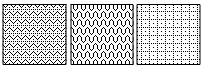
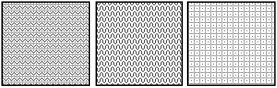
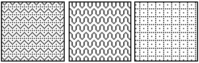

> 导航：[总目录](../../../README.md) · [documentation](../../../_indexes/documentation.md) · [Quartz Programming Guide for QuickDraw Developers](Introduction%20to%20Quartz%20Programming%20Guide%20for%20QuickDraw%20Developers.md)


[Next](Working%20With%20Bitmap%20Image%20Data.md)[Previous](Using%20Color.md)

# Converting PICT Data

The QuickDraw picture (PICT) format is the graphics metafile format in Mac OS 9 and earlier. A picture contains a recorded sequence of QuickDraw imaging operations and associated data, suitable for later playback to a graphics device on any platform that supports the PICT format.

In Mac OS X, the Portable Document Format (PDF) is the native metafile and print-spooling format. PDF provides a convenient, efficient mechanism for viewing and printing digital content across all platforms and operating systems. PDF is better suited than the PICT format to serve as a general-purpose metafile format for digital documents. PDF offers these advantages:

- PDF represents the full range of Quartz graphics. The PICT format cannot be used to record drawing in a Quartz context.
- PDF allows multiple pages. The PICT format can represent only a single drawing space—there’s no concept of multiple pages.
- PDF supports a wide variety of color spaces. The PICT format supports RGB and grayscale color, but lacks support for other types of color spaces such as CMYK, Lab, and DeviceN.
- PDF supports embedded Type 1 and TrueType fonts and font subsets. Embedded fonts aren’t supported in pictures, so text can’t be fully represented.
- PDF supports compression of font, image, and page data streams. PICT supports compression for images, but in many cases the PDF representation of PICT data is more compact.
- PDF supports encryption and authentication. The PICT format has no built-in security features.

As you convert your QuickDraw application to one that uses only Quartz, there are two primary issues you’ll face with respect to PICT data:

- You will need to handle PICT data that you previously shipped with your application. The best approach is to convert is to another format (JPG, PNG, PDF) and use those formats with Quartz.
- You will want to support PICT data in your applications. This includes support for copying and pasting PDF to the pasteboard and opening existing documents.

This chapter provides approaches for handling PICT data and also shows how to handle PDF data from the Clipboard.

This section provides examples of how you can read and write picture data for the purpose of converting it to PDF or another Quartz-compatible format. Some general strategies include the following:

- As you convert data, you may find that some PICTs don’t convert well. In these cases, you’ll want to first convert the PICT to a pixel picture first. See [Avoiding PICT Wrappers for Bitmap Images](#apple-f4xwc4dqnrsv64tfmyxwi33df52wszbpkridimbqgaytaojyfvbuqmrsgewueqsdizeukssc).
- For PICTs that are wrappers for JPEG data, use the function [CGImageCreateWithJPEGDataProvider](https://developer.apple.com/documentation/coregraphics/cgimage/1454920-init) for the JPEG data rather than working with the PICT.
- If your application uses predefined PICT files or resources that are drawn repeatedly, you can convert them into PDF and place them in the Resources folder inside the application bundle. See [Converting QDPict Pictures Into PDF Documents](#apple-f4xwc4dqnrsv64tfmyxwi33df52wszbpkridimbqgaytaojyfvbuqmrsgewueqsdivbesqkf).
- Use Quartz data providers to work with QDPict data. See [Creating a QDPict Picture From Data in Memory](#apple-f4xwc4dqnrsv64tfmyxwi33df52wszbpkridimbqgaytaojyfvbuqmrsgewueqsdirducssh) and [Creating a QDPict Picture From a PICT File](#apple-f4xwc4dqnrsv64tfmyxwi33df52wszbpkridimbqgaytaojyfvbuqmrsgewueqsdineuqr2f).
- If you need to draw PICT data scaled, evaluate which type of scaling is best for your purposes. See [Scaling QDPict Pictures](#apple-f4xwc4dqnrsv64tfmyxwi33df52wszbpkridimbqgaytaojyfvbuqmrsgewueqsdjjceeq2d).

A popular strategy used by QuickDraw developers is to create a PICT wrapper around a bitmap image. With a bitmap image inside a `PICT` container, the picture acts as a transport mechanism for the image. If the bitmap is a JPEG or other image data, it’s best to create a CGImage from that data. For example, you can draw the bitmap to a bitmap graphics context and then create a CGImage by calling the function [CGBitmapContextCreateImage](https://developer.apple.com/documentation/coregraphics/cgcontext/1454225-makeimage) (available starting in Mac OS X v10.4). If the bitmap is JPEG or PNG data, you can use [CGImageCreateWithJPEGDataProvider](https://developer.apple.com/documentation/coregraphics/cgimage/1454920-init) or [CGImageCreateWithPNGDataProvider](https://developer.apple.com/documentation/coregraphics/cgimage/1454993-init) to create a CGImage.

PICT uses a vector-based format. If you use the `CopyBits` function to create a `PICT` representation of a bitmap image by opening a QuickDraw picture, and copying an image onto itself (by specifying the same pixel map as source and destination), then you replace the vector-based format with at bit-based one. In general, the wrapper strategy in QuickDraw is not a good one. As you move your code to Quartz, you’ll want to convert PICTs to PDF documents. There is no need to create PICT wrappers to do so.

PDF is the format used to copy-and-paste between applications in Mac OS X. It’s also the metafile format for Quartz because PDF is resolution independent. Although you can use a PDF wrapper for a bitmap image (just as PICT has been used) if you wrap a PDF with a bitmap image, the bitmap is limited by resolution at which it was created.

To convert existing PICT images to PDF documents, you can use the QuickDraw QDPict API. This API is declared in the interface file `QDPictToCGContext.h` in the Application Services framework. Note that if a QuickDraw picture contains drawing operations such as `CopyBits` that use transfer modes that don’t have an analogue in PDF, the PDF representation may not look exactly the same.

The QDPict API includes these data types and functions:

- `QDPictRef`—An opaque type that represents picture data in the Quartz drawing environment. An instance of this type is called a QDPict picture.
- `QDPictCreateWithProvider` and `QDPictCreateWithURL`,—Functions that create QDPict pictures using picture data supplied with a Quartz data provider or with a PICT file.
- `QDPictDrawToCGContext`—A function that draws a QDPict picture into a Quartz graphics context. If redrawing performance is an issue, draw the PICT into a PDF graphics context, save it as a PDF document, and then use the PDF document with the Quartz routines for drawing PDF data, such as the function [CGContextDrawPDFPage](https://developer.apple.com/documentation/coregraphics/cgcontext/1456255-drawpdfpage).

To create a QDPict picture from picture data in memory, you call `QDPictCreateWithProvider` and supply the data using a Quartz data provider. When you create the provider, you pass it a pointer to the picture data—for example, by dereferencing a locked `PicHandle`.

When using the functions `QDPictCreateWithURL` and `QDPictCreateWithProvider`, the picture data must begin at either the first byte or the 513th byte. The picture bounds must not be an empty rectangle.

Listing 4-1 shows how to implement this method using two custom functions—a creation function, and a release function associated with the data provider. A detailed explanation of each numbered line of code follows the listing.

__Listing 4-1__  Routines that create a QDPict picture from PICT data

```
QDPictRef MyCreateQDPictWithData (void *data, size_t size)
{
    QDPictRef picture = NULL;

    CGDataProviderRef provider =
    CGDataProviderCreateWithData (NULL, data, size, MyReleaseProc);// 1

    if (provider != NULL)
    {
        picture = QDPictCreateWithProvider (provider);// 2
        CFRelease (provider);
    }

    return picture;
}

void MyReleaseProc (void *info, const void *data, size_t size)// 3
{
    if (info != NULL) {
        /* release private information here */
    };

    if (data != NULL) {
        /* release picture data here */
    };
}
```

Here’s what the code does:

1. Creates a Quartz data provider for your picture data. The parameters are private information (not used here), the address of the picture data, the size of the picture data in bytes, and your custom release function.
2. Creates and returns a QDPict picture unless the picture data is not valid.
3. Handles the release of any private resources when the QDPict picture is released. This is a good place to deallocate the picture data, if you’re finished using it.

To create a QDPict picture from picture data in a PICT file, you call `QDPictCreateWithURL` and specify the file location with a Core Foundation URL. Listing 4-2 shows how to implement this method using an opaque `FSRef` file specification.

__Listing 4-2__  A routine that creates a QDPict picture using data in a PICT file

```
QDPictRef MyCreateQDPictWithFSRef (const FSRef *file)
{
    QDPictRef picture = NULL;

    CFURLRef url = CFURLCreateFromFSRef (NULL, file);
    if (url != NULL)
    {
        picture = QDPictCreateWithURL (url);
        CFRelease(url);
    }

    return picture;
}
```


Listing 4-3 shows how to write a function that converts a QDPict picture into a PDF document stored in a file. A detailed explanation of each numbered line of code follows the listing. (Source code to create the URL and the optional PDF auxiliary information dictionary is not included here.)

__Listing 4-3__  Code that converts a picture into a single-page PDF document

```
void MyConvertQDPict (QDPictRef picture, CFURLRef url,
                        CFDictionaryRef dict)
{
    CGContextRef context = NULL;
    CGRect bounds = QDPictGetBounds (picture);
    bounds.origin.x = 0;
    bounds.origin.y = 0;

    context = CGPDFContextCreateWithURL (url, &bounds, dict);// 1
    if (context != NULL)
    {
        CGContextBeginPage (context, &bounds);// 2
        (void) QDPictDrawToCGContext (context, bounds, picture);// 3
        CGContextEndPage (context);// 4
        CGContextRelease (context);// 5
    }
}
```

Here’s what the code does:

1. Creates a PDF graphics context that directs the PDF content stream to a URL. If the URL is a file, the filename should end with the `.pdf` extension. The second parameter uses the picture bounds to specify the media box. The third parameter is an optional PDF auxiliary information dictionary, which contains the title and creator of the PDF document.
2. Begins a new page. In a PDF context, all drawing outside of an explicit page boundary is ignored. Here the page size (or media box) is the picture bounds, but you could specify any page size.
3. Draws the picture. The drawing rectangle is identical to the picture bounds, so there is no change of scale.
4. Ends the current PDF page.
5. Releases the PDF context, which finalizes the PDF content stream and finishes creating the file.

When drawing a picture in a Quartz context, you have two ways to change the horizontal or vertical scale of the picture:

- Create a drawing rectangle by applying the change of scale to the bounds rectangle returned by `QDPictGetBounds` and pass this drawing rectangle to `QDPictDrawToCGContext`. When the picture is rendered, patterns are not scaled along with other graphic elements. This is the same behavior as that of the `DrawPicture` function. For example, compare the original picture in [Figure 4-1](#apple-f4xwc4dqnrsv64tfmyxwi33df52wszbpkridimbqgaytaojyfvbuqmrsgewueqsdirdekrki) with the scaled picture in [Figure 4-2](#apple-f4xwc4dqnrsv64tfmyxwi33df52wszbpkridimbqgaytaojyfvbuqmrsgewueqsdineesqsh).
- Before drawing the picture, apply the appropriate affine transformation—for example, by calling [CGContextScaleCTM](https://developer.apple.com/documentation/coregraphics/1454659-cgcontextscalectm). When the picture is rendered, the entire picture is scaled, including patterns. The effect is equivalent to viewing the picture with the Preview application and clicking the Zoom In button. Compare the original in [Figure 4-1](#apple-f4xwc4dqnrsv64tfmyxwi33df52wszbpkridimbqgaytaojyfvbuqmrsgewueqsdirdekrki) with the scaled picture in [Figure 4-3](#apple-f4xwc4dqnrsv64tfmyxwi33df52wszbpkridimbqgaytaojyfvbuqmrsgewueqsdinbukrcc) to see how this looks.

Listing 4-4 shows how to implement both types of scaling. A detailed explanation of each numbered line of code follows the listing.

__Listing 4-4__  A routine that uses two ways to scale a QDPict picture

```
void MyScaleQDPict (QDPictRef picture, CFURLRef url)
{
    float scaleXY = 2.0;
    CGRect bounds = QDPictGetBounds (picture);// 1
    float w = (bounds.size.width) * scaleXY;
    float h = (bounds.size.height) * scaleXY;
    CGRect scaledBounds = CGRectMake (0, 0, w, h);
    bounds.origin.x = 0;
    bounds.origin.y = 0;

    CGContextRef context = CGPDFContextCreateWithURL (url, NULL, NULL);// 2
    if (context != NULL)
    {
        /* page 1: scale without affecting patterns */
        CGContextBeginPage (context, &scaledBounds);
        (void) QDPictDrawToCGContext (context, scaledBounds, picture);// 3
        CGContextEndPage (context);

        /* page 2: scale everything */
        CGContextBeginPage (context, &scaledBounds);
        CGContextScaleCTM (context, scaleXY, scaleXY);// 4
        (void) QDPictDrawToCGContext (context, bounds, picture);// 5
        CGContextEndPage (context);

        CGContextRelease (context);
    }
}
```

Here’s what the code does:

1. Creates a Quartz rectangle that represents the origin and size of the picture in user space. The resolution is 72 units per inch and the origin is (0,0).
2. Creates a PDF context that renders into a file. The choice of PDF is arbitrary—you can draw QDPict pictures in any type of Quartz graphics context.
3. Draws the picture into a scaled drawing rectangle. Patterns are not scaled along with the other graphic elements in the picture.
4. Applies the scaling transform to the current transformation matrix (CTM) in the graphics context. This scaling affects all subsequent drawing.
5. Draws the picture into a drawing rectangle with the same dimensions. This time the picture is scaled by the CTM, including patterns.

__Figure 4-1__  Original picture



__Figure 4-2__  Scaling with a larger drawing rectangle (patterns not affected)



__Figure 4-3__  Scaling with a matrix transform (patterns affected)



In Mac OS X, the Clipboard supports a rich set of data formats, including PDF. Beginning in Mac OS X version 10.3 (Panther), Carbon applications can use the Pasteboard Manager to exchange PDF data using the Clipboard or any other pasteboard. The Pasteboard Manager provides a robust data transport mechanism for user interface services such as copying, cutting, pasting, and dragging data of various flavors, and for generic interprocess communication.

A pasteboard is a global resource that uses Core Foundation data types to exchange information. Data formats called flavors are specified using uniform type identifiers. Supported flavors include plain text, rich text, PICT, and PDF. For a more detailed description of pasteboards, see _[Pasteboard Manager Programming Guide](../Pasteboard%20Manager%20Programming%20Guide/Introduction%20to%20Pasteboard%20Manager%20Programming%20Guide.md#apple-f4xwc4dqnrsv64tfmyxwi33df52wszbpkridimbqgaytimzz)_. For more information about uniform type identifiers, see _[Uniform Type Identifiers Overview](../../File%20Management/Uniform%20Type%20Identifiers%20Overview/Introduction%20to%20Uniform%20Type%20Identifiers%20Overview.md#apple-f4xwc4dqnrsv64tfmyxwi33df52wszbpkridimbqgaytgmjz)_.

To draw a PDF version of a QuickDraw picture and copy the PDF data to the Clipboard using the Pasteboard Manager, you need to do the following:

1. Create a Quartz data consumer to transfer the rendered output from a PDF context into a CFData object for the Pasteboard Manager.
2. Create a PDF context using your data consumer, draw content in this context, and release the context.
3. Create a [PasteboardRef](https://developer.apple.com/documentation/applicationservices/pasteboardref) representation of the Clipboard, clear the current contents, and write your PDF data to it.

Listing 4-5 shows how to implement this procedure. A detailed explanation of each numbered line of code follows the listing. (To simplify this listing, `OSStatus` result codes are cast to `void`. If you use this sample code in an actual application, you should remove the casts and add the necessary error handling.)

__Listing 4-5__  Code that pastes the PDF representation of a picture to the Clipboard

```
size_t MyPutBytes (void* info, const void* buffer, size_t count)// 1
{
    CFDataAppendBytes ((CFMutableDataRef) info, buffer, count);
    return count;
}

void MyCopyQDPictToClipboard (QDPictRef picture)
{
    static CGDataConsumerCallbacks callbacks = { MyPutBytes, NULL };

    CFDataRef data = CFDataCreateMutable (kCFAllocatorDefault, 0);// 2
    if (data != NULL)
    {
        CGDataConsumerRef consumer = NULL;
        consumer = CGDataConsumerCreate ((void*) data, &callbacks);// 3
        if (consumer != NULL)
        {
            CGContextRef context = NULL;
            CGRect bounds = QDPictGetBounds (picture);
            bounds.origin.x = 0;
            bounds.origin.y = 0;
            context = CGPDFContextCreate (consumer, &bounds, NULL);// 4
            CGDataConsumerRelease (consumer);
            if (context != NULL)
            {
                /* convert PICT to PDF */
                CGContextBeginPage (context, &bounds);
                (void) QDPictDrawToCGContext (context, bounds, picture);// 5
                CGContextEndPage (context);
                CGContextRelease (context);// 6

                /* copy PDF to clipboard */
                PasteboardRef clipboard = NULL;
                (void) PasteboardCreate (kPasteboardClipboard, &clipboard);// 7
                (void) PasteboardClear (clipboard);// 8
                (void) PasteboardPutItemFlavor (clipboard, // 9
                        (PasteboardItemID) 1, kUTTypePDF,
                        data, kPasteboardFlavorNoFlags);
                CFRelease (clipboard);
            }
        }
    CFRelease (data); // You should ensure that data is not NULL.
    }
}
```

Here’s what the code does:

1. Implements a custom callback function to handle the PDF content stream coming from a Quartz PDF context. This function copies the PDF bytes from a Quartz-supplied buffer into a mutable [CFDataRef](https://developer.apple.com/documentation/corefoundation/cfdata) object.
2. Creates a mutable [CFDataRef](https://developer.apple.com/documentation/corefoundation/cfdata) object for the PDF data.
3. Creates a Quartz data consumer that uses the custom callback.
4. Creates a PDF context to draw the picture, using the data consumer.
5. Draws the QDPict picture in the PDF context.
6. Releases the PDF context, which “finalizes” the PDF data.
7. Creates an object of type [PasteboardRef](https://developer.apple.com/documentation/applicationservices/pasteboardref) that serves as a data transport channel for a new or existing pasteboard—in this case, the Clipboard.
8. Clears the Clipboard of its current contents and makes it mutable.
9. Adds the PDF data to the Clipboard. Since there’s only one data item, the item identifier is `1`. The uniform type identifier for PDF is declared in the interface file `UTCoreTypes.h` inside the Application Services framework.

Now that you’ve seen how to copy PICT data to the pasteboard, see Listing 4-6, which contains a routine that you can use to copy any Quartz drawing to the pasteboard. This routine is from the CarbonSketch sample application. The routine `AddWindowContextToPasteboardAsPDF` takes two parameters: a pasteboard reference and an application-defined data type that tracks various attributes of the drawing document, such as its size and content.

__Listing 4-6__  A routine that copies window content to the pasteboard (Clipboard)

```swift
static OSStatus AddWindowContentToPasteboardAsPDF (
                        PasteboardRef pasteboard, const DocStorage *docStP)
{
    OSStatus    err     = noErr;
    CGRect  docRect = CGRectMake (0, 0, docStP->docSize.h,
                                    docStP->docSize.v);
    CFDataRef       pdfData = CFDataCreateMutable (kCFAllocatorDefault, 0);
    CGContextRef            pdfContext;
    CGDataConsumerRef       consumer;
    CGDataConsumerCallbacks cfDataCallbacks = {MyCFDataPutBytes,
                                         MyCFDataRelease };

    err = PasteboardClear (pasteboard);// 1
    require_noerr err, PasteboardClear_FAILED);

    consumer = CGDataConsumerCreate ((void*)pdfData, &cfDataCallbacks);// 2

    pdfContext = CGPDFContextCreate (consumer, &docRect, NULL);// 3
    require(pdfContext != NULL, CGPDFContextCreate_FAILED);

    MyDrawIntoPDFPage (pdfContext, docRect, docStP, 1);// 4
    CGContextRelease (pdfContext);// 5

    err = PasteboardPutItemFlavor( pasteboard, (PasteboardItemID)1,// 6
                        kUTTypePDF, pdfData, kPasteboardFlavorNoFlags );
    require_noerr( err, PasteboardPutItemFlavor_FAILED );

CGPDFContextCreate_FAILED:
PasteboardPutItemFlavor_FAILED:
    CGDataConsumerRelease (consumer);   // 7


PasteboardClear_FAILED:
    return err;
}
```

Here’s what the code does:

1. Clears the pasteboard of its contents so that this application can own it and add its own data.
2. Creates a data consumer to receive the data from the application.
3. Creates a PDF graphics context, providing the data consumer, the rectangle that defines the size and location of the PDF page, and `NULL` for the auxiliary dictionary. The entire PDF page is supplied here, but in your application you restrict the data you paste to the contents of the selection made by the user. In this example, there isn’t any additional information to be used by the PDF context when generating the PDF, so the auxiliary dictionary is `NULL`.
4. Calls an application-defined function to draw the actual data into the PDF graphics context. You need to supply your own drawing function here.
5. Releases the PDF graphics context, which finalizes the PDF data.
6. Puts the PDF data (supplied by the data consumer) on the pasteboard. The [PasteboardPutItemFlavor](https://developer.apple.com/documentation/applicationservices/1463184-pasteboardputitemflavor) function takes the pasteboard cleared earlier, the identifier for the item to add flavor data for, a flavor type, the data to add, and a bit field of flags for the specified flavor.
7. Releases the data consumer.

To bring PDF data back into your application you retrieve the PDF data from the pasteboard, create a Quartz data provider that copies the PDF data into a Quartz buffer, and use the provider to create a [CGPDFDocumentRef](https://developer.apple.com/documentation/coregraphics/cgpdfdocument) object. You can call [CGContextDrawPDFDocument](https://developer.apple.com/documentation/coregraphics/1586508-cgcontextdrawpdfdocument) to draw the PDF version of your picture in any graphics context. The `PasteboardContainsPDF` routine in Listing 4-7 is taken from the CarbonSketch sample application.

The routine checks whether the pasteboard provided to it contains PDF data. If it does, the PDF data is returned as CFData in the `pdfData` parameter. A detailed explanation for each numbered line of code appears following the listing.

__Listing 4-7__  A routine that gets PDF data from the pasteboard (Clipboard)

```
static Boolean PasteboardContainsPDF (PasteboardRef inPasteboard,
                                 CFDataRef* pdfData)
{
    Boolean             gotPDF      = false;
    OSStatus            err         = noErr;
    ItemCount           itemCount;
    UInt32              itemIndex;

    err = PasteboardGetItemCount (inPasteboard, &itemCount);// 1
    require_noerr(err, PasteboardGetItemCount_FAILED);

    for (itemIndex = 1; itemIndex <= itemCount; ++itemIndex)// 2
    {
        PasteboardItemID    itemID;
        CFArrayRef          flavorTypeArray;
        CFIndex             flavorCount;
        CFIndex             flavorIndex;

        err = PasteboardGetItemIdentifier (inPasteboard, // 3
                            itemIndex, &itemID );
        require_noerr( err, PasteboardGetItemIdentifier_FAILED );
        err = PasteboardCopyItemFlavors (inPasteboard, itemID,// 4
                                 &flavorTypeArray );
        require_noerr( err, PasteboardCopyItemFlavors_FAILED );
        flavorCount = CFArrayGetCount( flavorTypeArray );// 5
        for (flavorIndex = 0; flavorIndex < flavorCount; ++flavorIndex)
        {
            CFStringRef             flavorType;
            CFComparisonResult      comparisonResult;

            flavorType = (CFStringRef)CFArrayGetValueAtIndex (// 6
                                         flavorTypeArray, flavorIndex );
            comparisonResult = CFStringCompare(flavorType,// 7
                                        kUTTypePDF, 0);
            if (comparisonResult == kCFCompareEqualTo)
            {
                if (pdfData != NULL)
                {
                    err = PasteboardCopyItemFlavorData( inPasteboard,// 8
                                 itemID, flavorType, pdfData );
                    require_noerr (err,
                            PasteboardCopyItemFlavorData_FAILED );
                }
                gotPDF = true;// 9
                break;
            }

PasteboardCopyItemFlavorData_FAILED:
PasteboardGetItemFlavorFlags_FAILED:
        }
        CFRelease(flavorTypeArray);// 10
PasteboardCopyItemFlavors_FAILED:
PasteboardGetItemIdentifier_FAILED:
        ;
    }
PasteboardGetItemCount_FAILED:
    return gotPDF;// 11
}
```

Here’s what that code does:

1. Gets the number of items on the pasteboard.
2. Iterates through each item on the pasteboard.
3. Gets the unique identifier for this pasteboard item.
4. Copies the flavor types for that item ID into an array. Note that the flavor type array is a `CFArrayType` that you need to release later.
5. Gets a count of the flavor types in the array. You need to iterate through these to find the PDF flavor.
6. Gets the flavor type stored in a specific location in the array.
7. Checks for the PDF flavor type. Note that in Mac OS X v10.4 you should use the universal type `kUTTypePDF`, as shown here, instead of `CFSTR('com.adobe.pdf')`.
8. Copies the PDF data, if any is found.
9. Sets the `gotPDF` flag to `true`.
10. Releases the array.
11. Returns `true` if successful.

After you get the PDF data from the pasteboard, you can draw it in your application, using a routine similar to the `DrawPDFData` routine shown in Listing 4-8. The routine takes a `CFDataRef` data type (which is what you get from the routine in [Listing 4-7](#apple-f4xwc4dqnrsv64tfmyxwi33df52wszbpkridimbqgaytaojyfvbuqmrsgewueqsdiveuuqkh) when you copy data from the pasteboard), a graphics context, and a destination rectangle. A detailed explanation for each numbered line of code appears following the listing.

__Listing 4-8__  A routine that draws PDF data

```
static void MyPDFDataRelease (void *info, const void *data, size_t size)
{
    if(info != NULL)
        CFRelease((CFDataRef)info);
}

static void DrawPDFData (CGContextRef ctx, CFDataRef pdfData,
                            CGRect dstRect)
{
    CGDataProviderRef   provider;
    CGPDFDocumentRef    document;
    CGPDFPageRef        page;
    CGRect              pageSize;

    CFRetain (pdfData);
    provider = CGDataProviderCreateWithData (pdfData, // 1
                        CFDataGetBytePtr(pdfData),
                        CFDataGetLength(pdfData), MyPDFDataRelease);
    document = CGPDFDocumentCreateWithProvider (provider);// 2
    CFRelease(provider);// 3
    page = CGPDFDocumentGetPage (document, 1);// 4
    pageSize = CGPDFPageGetBoxRect (page, kCGPDFMediaBox);// 5

    CGContextSaveGState(ctx);// 6
    MySetupTransform(ctx, pageSize, dstRect); // 7
// Scale pdf page into dstRect, if the pdf is too big
    CGContextDrawPDFPage (ctx, page);// 8
    CGContextRestoreGState(ctx);// 9

    CFRelease(document);// 10
}
```

Here’s what the code does:

1. Creates a data provider to read PDF data provided to your application from a `CGDataRef` data source. Note that you need to supply a release function for Quartz to call when it frees the data provider.
2. Creates a CGPDFDocument object using data supplied by the data provider you just created.
3. Releases the data provider. You should release a data provider immediately after using it to create the CGPDFDocument object.
4. Gets the first page of the newly created document.
5. Gets the media box rectangle for the PDF. You need this to determine how to scale the content later.
6. Saves the graphics state so that you can later restore it.
7. Calls an application-defined routine to set a transform, if necessary. This routine (which you would need to write) determines whether the PDF is too big to fit in the destination rectangle, and transforms the context appropriately.
8. Draws the PDF document into the graphics context that is passed to the `DrawPDFData` routine.
9. Restores the graphics state.
10. Releases the PDF document object.

See these reference documents:

- _[CGContext Reference](https://developer.apple.com/documentation/coregraphics/cgcontext)_
- _[CGImage Reference](https://developer.apple.com/documentation/coregraphics/cgimage)_
- _[CGPDFDocument Reference](https://developer.apple.com/documentation/coregraphics/cgpdfdocument)_
- _Pasteboard Manager Reference_
- _QuickDraw Reference_, describes the `QDPictRef` data type that represents a QuickDraw picture in the Quartz graphics environment.

For comprehensive information about using pasteboards in Carbon applications, see _[Pasteboard Manager Programming Guide](../Pasteboard%20Manager%20Programming%20Guide/Introduction%20to%20Pasteboard%20Manager%20Programming%20Guide.md#apple-f4xwc4dqnrsv64tfmyxwi33df52wszbpkridimbqgaytimzz)_.

For more information about uniform type identifiers, see the document _[Uniform Type Identifiers Overview](../../File%20Management/Uniform%20Type%20Identifiers%20Overview/Introduction%20to%20Uniform%20Type%20Identifiers%20Overview.md#apple-f4xwc4dqnrsv64tfmyxwi33df52wszbpkridimbqgaytgmjz)_.

To learn more about drawing QDPict pictures in a Carbon application, see the project example _[CGDrawPicture](../../../samplecode/CGDrawPicture/CGDrawPicture.md#apple-f4xwc4dqnrsv64tfmyxwi33df52wszbpirkfgmjqgaydanbzga)_ in the [Graphics & Imaging Quartz Sample Code Library](https://developer.apple.com/library/archive/navigation/redirect.html#//apple_ref/doc/uid/TP30000925-TP30000424-TP30000559).

[Next](Working%20With%20Bitmap%20Image%20Data.md)[Previous](Using%20Color.md)

