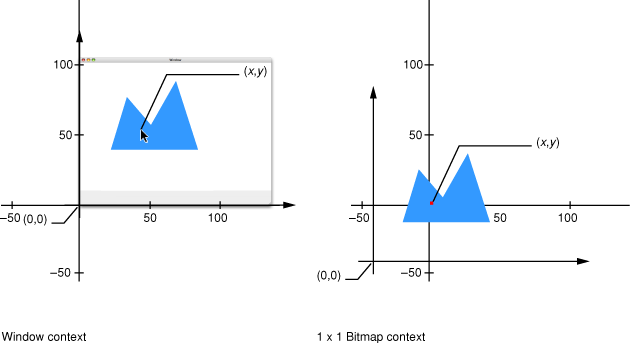

> 导航：[总目录](../../../README.md) · [documentation](../../../_indexes/documentation.md) · [Quartz Programming Guide for QuickDraw Developers](Introduction%20to%20Quartz%20Programming%20Guide%20for%20QuickDraw%20Developers.md)


[Next](Offscreen%20Drawing.md)[Previous](Updating%20Regions.md)

# Hit Testing

Hit testing is a generic term for any procedure that determines whether a mouse click occurs inside a shape or area. Quartz provides two solutions for hit testing:

- A path-oriented solution, which checks to see if the area enclosed by a path contains the hit point. See [Using a Path for Hit Testing](#apple-f4xwc4dqnrsv64tfmyxwi33df52wszbpkridimbqgaytaojyfvbuqmrshewueqsdjjeeeskh).
- A pixel-oriented solution, which involves drawing into a 1x1 bitmap context with the appropriate transform. This solution is used in the CarbonSketch sample application that’s available in `/Developer/Examples/Quartz`. See [Using a 1x1 Bitmap Context for Hit Testing](#apple-f4xwc4dqnrsv64tfmyxwi33df52wszbpkridimbqgaytaojyfvbuqmrshewueqsdijfesrsf).

When you are hit-testing, you may need to know the transform that Quartz uses to map between user and device space. The function [CGContextGetUserSpaceToDeviceSpaceTransform](https://developer.apple.com/documentation/coregraphics/cgcontext/1455677-userspacetodevicespacetransform), introduced in Mac OS X v10.4, returns the affine transform that maps user space to device space in a graphics context. There are other convenience functions for transforming points, sizes, and rectangles between these two coordinate spaces. For example, [CGContextConvertPointToUserSpace](https://developer.apple.com/documentation/coregraphics/cgcontext/1456451-converttouserspace) transforms a point from the device space of a context to its user space.

In Mac OS X v10.4 and later, you can use the function [CGPathContainsPoint](https://developer.apple.com/documentation/coregraphics/1411175-cgpathcontainspoint) to find out if a point is inside a closed path. A direct replacement for `PtInRgn`, this function is useful when you have a corresponding path for each shape being tested. Here’s the prototype:

```
bool CGPathContainsPoint (CGPathRef path, const CGAffineTransform *m,
                            CGPoint point, bool eoFill);
```

[CGPathContainsPoint](https://developer.apple.com/documentation/coregraphics/1411175-cgpathcontainspoint) returns true if the point is inside the area that’s painted when the path is filled using the specified fill rule. You can also specify a transform that’s applied to the point before the test is performed. (Assuming the point is in local view coordinates and the path uses the same coordinate space, a transform is probably not needed.)

Here’s the idea behind the pixel-oriented solution:

1. Create a 1x1 bitmap context that contains a single pixel. (The bitmap you provide for this context consists of a single, unsigned 32-bit integer.) The coordinates of this pixel are (0, 0).
2. Initialize the bitmap to `0`. Effectively, this means the pixel starts out having no color.
3. If necessary, convert the coordinates of the hit point from window space into user space for the Quartz context in which you are drawing.
4. Translate the current transformation matrix (CTM) in the bitmap context such that the hit point and the bitmap have the same coordinates. If the coordinates of the hit point are (_x_, _y_), you would use the function [CGContextTranslateCTM](https://developer.apple.com/documentation/coregraphics/1455286-cgcontexttranslatectm) to translate the origin by (–_x_, –_y_).

   Figure 8-1 illustrates how translation is used to position the hit point in a shape directly over the pixel in a 1x1 bitmap context.
5. Iterate through your list of graphic objects. For each object, draw the object into the bitmap context and check the bitmap to see whether the value of the pixel has changed. If the pixel changes, the hit point is contained in the object.

This solution is very effective but may require some calibration. By default, all drawing in a window or bitmap context is rendered using anti-aliasing. This means the color of pixels located just outside the border of a shape or image may change, and this could affect the accuracy of hit testing. (The path-oriented solution doesn’t have this concern, because it is purely mathematical and doesn’t require any rendering.)

__Figure 8-1__  Positioning the hit point in the bitmap context



For this method to work properly, each graphic object must be drawn at the same location in both the user’s window context and the bitmap context.

Listing 8-1 shows how to write a function that returns a 1x1 bitmap context suitable for hit-testing. In this implementation, the context is created once and cached for later reuse. A detailed explanation for each numbered line of code follows the listing.

__Listing 8-1__  A routine that creates a 1x1 bitmap context

```
CGContextRef My1x1BitmapContext (void)
{
    static CGContextRef context = NULL;
    static UInt32 bitmap[1];// 1

    if (context == NULL)// 2
    {
        CGColorSpaceRef cs = MyGetGenericRGBColorSpace();// 3

        context = CGBitmapContextCreate (// 4
            (void*) bitmap,
            1, 1,   // width & height
            8,      // bits per component
            4,      // bytes per row
            cs,
            kCGImageAlphaPremultipliedFirst
        );
        CGContextSetFillColorSpace (context, cs); // 5
        CGContextSetStrokeColorSpace (context, cs); // 6
    }
    return context;
}
```

Here’s what the code does:

1. Reserves memory for the 1-pixel bitmap.
2. Checks to see if the context exists.
3. Creates a GenericRGB color space for the bitmap context. For more information on creating a GenericRGB color space, see [Creating Color Spaces](Using%20Color.md#apple-f4xwc4dqnrsv64tfmyxwi33df52wszbpkridimbqgaytaojyfvbuqmrsgywugsscjjbuorcg). Note that this is a get routine, which means that you do not release the color space.
4. Creates a 1x1 bitmap context with a 32-bit ARGB pixel format. The context is created once and saved in a static variable.
5. Sets the fill color space to ensure that drawing takes place in the correct, calibrated color space.
6. Sets the stroke color space.

Listing 8-2 shows how to write a simplified hit testing function. Given a hit point with user space coordinates, this function determines if anything drawn in the view contains the point. Additional code would be needed for hit-testing in a view with several graphic objects or control parts.

__Listing 8-2__  A routine that performs hit testing

```swift
ControlPartCode MyContentClick (MyViewData *data, CGPoint pt)
{
    CGContextRef ctx = My1x1BitmapContext();
    UInt32 *baseAddr = (UInt32 *) CGBitmapContextGetData (ctx);// 1
    baseAddr[0] = 0;// 2

    CGContextSaveGState (ctx);// 3
    CGContextTranslateCTM (ctx, -pt.x, -pt.y);// 4
    (*data->proc) (ctx, data->bounds);// 5
    CGContextRestoreGState (ctx);// 6

    if (baseAddr[0] != 0)// 7
        return 1;
    else
        return 0;
}
```

Here’s what the code does:

1. Gets the address of the 1-pixel bitmap used for hit testing.
2. Clears the bitmap.
3. Saves the graphics state in the bitmap context. This is necessary because the context may be used again.
4. Makes the bitmap coordinates equal to the hit-point coordinates.
5. Draws the object being tested into the bitmap context.
6. Restores the graphics state saved in step 3.
7. Checks to see whether the pixel has changed, and returns a part code of 0 or 1 to indicate whether a hit occurred.

Listing 8-3 shows how a handler for the `kEventControlHitTest` event might detect a mouse click inside your drawing in a view that’s embedded inside a composited window. A detailed explanation for each numbered line of code follows the listing.

__Listing 8-3__  A routine that handles a hit-test event in a composited window

```swift
OSStatus MyViewHitTest (EventRef inEvent, MyViewData *data)
{
    ControlPartCode partCode;
    OSStatus err = noErr;
    HIPoint point;

    (void) GetEventParameter (inEvent, kEventParamMouseLocation,
        typeHIPoint, NULL, sizeof(HIPoint), NULL, &point);// 1

    ControlPartCode partCode = MyContentClick (data,
        CGPointMake (point.x, data->bounds.size.height - point.y)); // 2

    (void) SetEventParameter (inEvent, kEventParamControlPart, // 3
        typeControlPartCode, sizeof(ControlPartCode), &partCode);

    return err;
}
```

Here’s what the code does:

1. Gets the hit point in local view coordinates.
2. Checks to see whether the hit point is inside the drawing. A part code of 1 indicates that a hit occurred. The hit-testing function expects a point of type `CGPoint` (y-axis pointing upwards), so this code flips the y-coordinate of the hit point.
3. Sets the part code parameter in the `kEventControlHitTest` event.

See these reference documents:

- _[CGContext Reference](https://developer.apple.com/documentation/coregraphics/cgcontext)_
- _[CGGeometry Reference](https://developer.apple.com/documentation/coregraphics/cggeometry)_

[Next](Offscreen%20Drawing.md)[Previous](Updating%20Regions.md)

