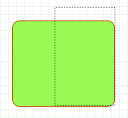
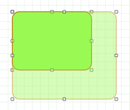

> 导航：[总目录](../../../README.md) · [documentation](../../../_indexes/documentation.md) · [Quartz Programming Guide for QuickDraw Developers](Introduction%20to%20Quartz%20Programming%20Guide%20for%20QuickDraw%20Developers.md)


[Next](Hit%20Testing.md)[Previous](Masking.md)

# Updating Regions

Prior to Mac OS X, the Mac OS Toolbox relied on the concept of invalidating regions that needed updating. When a portion of a window needed updating, the Event Manager sent an update event to your application. Your application responded by calling the Window Manager function `BeginUpdate`, redrawing the region that needed updating and then calling `EndUpdate` to signal that you were finished with the update. By using `BeginUpdate` and `EndUpdate`, the Window Manager tracked the actual areas that needed updating and your drawing was clipped only to the areas that needed updating, thus optimizing performance. To achieve a similar functionality in Mac OS X, you use HIView. See [Updating Windows](#apple-f4xwc4dqnrsv64tfmyxwi33df52wszbpkridimbqgaytaojyfvbuqmrsgiwugsscizeemr2k).

In your QuickDraw application, you might have used region updating in conjunction with XOR to minimize the amount of drawing that needed to be done for animation or editing. Quartz does not support XOR, but it does support transparent windows. You create a transparent window, position it on top of your existing window, and then use the overlay to draw your animation or perform your text editing. When you’re done, you throw away the overlay and update the original window, if necessary. See [Using Overlay Windows](#apple-f4xwc4dqnrsv64tfmyxwi33df52wszbpkridimbqgaytaojyfvbuqmrsgiwugsscireekrse), which describes how to provide a selection rectangle (marching ants) around a user-selected shape and how to provide visual feedback when the user drags a selection.

If you need to handle the content in a scrolling rectangle, use HIView to create a scrolling view (see the function `HIScrollViewCreate`). This provides an easy way to display a scrollable image. You can simply embed an image view within the scroll view and the scroll view automatically handles the scrolling of the image. You don’t need to install handlers for live feedback, adjust scroller positions and sizes, or move pixels. See _[HIView Programming Guide](../HIView%20Programming%20Guide/Introduction%20to%20HIView%20Programming%20Guide.md#apple-f4xwc4dqnrsv64tfmyxwi33df52wszbpkridgmbqgaydsmrt)_ and _HIView Reference_ for more information.

Quartz does not handle window invalidation and repainting. That’s the job of whatever window system is in use—Cocoa or Carbon. Quartz is exactly like QuickDraw in this regard. QuickDraw doesn’t know anything about invalidation and update regions; that’s always been handled by the Window Manager.

To eliminate unnecessary drawing in your application, you can follow one of two approaches— draw the changed areas only, or intersect the changed areas with the context’s clipping area before drawing the window. If the changed area is a complex shape, it may be sufficient to clip using a bounding box that encloses the shape instead of trying to construct a path that represents the shape.

Carbon applications need to use windows in compositing mode, and then, instead of drawing into the window content area, draw into views. An application can invalidate all or part of a view using functions such as

- `HIViewSetNeedsDisplay`, which marks a view as needing to be completely redrawn, or completely valid.
- `HIViewSetNeedsDisplayInRect`, which marks a rectangle contained in a view as needing to be redrawn, or valid. The rectangle that you pass to the function is intersected with the visible portion of the view.
- `HIViewSetNeedsDisplayInShape`, which marks a portion of a view as either needing to be redrawn or valid. The shape that you pass to the function is intersected with the visible portion of the view.

When the application draws in the Quartz context obtained from the Carbon even `kEventControlDraw`, the clipping area is already configured to eliminate unnecessary drawing. For more information, see _[Upgrading to the Mac OS X HIToolbox](../Upgrading%20to%20the%20Mac%20OS%20X%20HIToolbox/Introduction%20to%20Upgrading%20to%20the%20Mac%20OS%20X%20HIToolbox.md#apple-f4xwc4dqnrsv64tfmyxwi33df52wszbpkridgmbqgaytcnbq)_, _[HIView Programming Guide](../HIView%20Programming%20Guide/Introduction%20to%20HIView%20Programming%20Guide.md#apple-f4xwc4dqnrsv64tfmyxwi33df52wszbpkridgmbqgaydsmrt)_, and _HIView Reference_.

If you’re trying to preserve the contents of a window so that you can do quick animation or editing without having to redraw complex window contents, you can use Mac OS X window compositing to your advantage. You can overlay a transparent window on top of an existing window and use the overlay for drawing new content or performing animation.

The performance using overlay windows on Quartz Extreme systems is much better than any caching and blitting scheme using QuickDraw. That’s because Quartz puts the GPU to work for you. Using overlay windows is less CPU-intensive than having either Quartz or QuickDraw perform blending. On systems prior to Quartz Extreme, the performance is still acceptable.

The CarbonSketch application uses overlay windows in two ways: to indicate a user selection with “marching ants,” as shown in [Figure 7-1](#apple-f4xwc4dqnrsv64tfmyxwi33df52wszbpkridimbqgaytaojyfvbuqmrsgiwugsscindekscg), and to provide feedback on dragging and resizing an object, as shown in [Figure 7-2](#apple-f4xwc4dqnrsv64tfmyxwi33df52wszbpkridimbqgaytaojyfvbuqmrsgiwugsscireuur2b). Before continuing, you might want to run CarbonSketch, create a few shapes, and then see how selecting, dragging, and resizing work from the user’s perspective. You can find the application in `/Developer/Examples/Quartz`.

__Figure 7-1__  Using “marching ants” to provide feedback about selected content



You’ll want to study the CarbonSketch application to understand the implementation details, but the general idea of how it works is as follows. When there is a mouse-down event, a mouse-tracking routing creates a rectangle that is the same size as the document that the user is drawing in. Then, it clips the graphics context used for the document (referred to here as the drawing graphics context) and the graphics context used for an overlay window to the document rectangle. The overlay graphics context is now ready for drawing.

Before any drawing takes place in the overlay graphics context, the application simply sets the alpha transparency of the stroke and fill colors to an alpha value that ensures that the original drawing underneath shows through. In addition, the “faded” version of the drawing in the overlay window adds to aesthetics of the dragging effect. The transparency also provides feedback to the user that indicates an action is occurring (dragging, selecting, resizing) but has not yet been completed.

__Figure 7-2__  Using an overlay window to provide feedback on dragging and resizing



Now that you understand the overall approach to using an overlay window, let’s take a look at mouse tracking in Quartz for a simple sketching application. Suppose that this simple sketching application lets a user draw a path in a view by clicking and dragging the pointer. The code in Listing 7-1 shows the routines that are key to handling mouse tracking for this simple sketching application.

The `CanvasViewHandler` routine is a Carbon event handler that processes the `kEventControlTrack` Carbon event. The `ConvertGlobalQDPointtoViewHIPoint` routine converts global Quick Draw points to HIView coordinates, which are local, relative to the HIView. Also shown in the listing is the `CanvasData` structure that keeps track of the HIView object associated with the view, the origin of the view, and the current path that’s drawn in the view. Note that the path is mutable.

The `CanvasViewHandler` routine is incomplete; it handles just the one event. The ellipses indicate where you would insert code to handle other events. The routine first gets the mouse location (provided as global coordinates) and resets the CGPath object by releasing any non null path. Then, as long as the mouse button is down, the routine tracks the mouse location, converting each global coordinate to a view-relative coordinate, adding a line to the path, and updating the display. When the user releases the mouse, the routine sends pat the control part upon which the mouse was released.

__Listing 7-1__  Code that handles mouse tracking for a simple drawing application

```swift
struct CanvasData {
    HIViewRef           theView;
    HIPoint             canvasOrigin;
    CGMutablePathRef    thePath;
};
typedef struct CanvasData   CanvasData;

// --------------------------------------------
static HIPoint  ConvertGlobalQDPointToViewHIPoint (
                            const Point inGlobalPoint,
                            const HIViewRef inDestView )
{
    Point       localPoint = inGlobalPoint;
    HIPoint     viewPoint;
    HIViewRef   contentView;

    QDGlobalToLocalPoint (GetWindowPort(GetControlOwner(inDestView)),
                             &localPoint );

    // convert the QD point to an HIPoint
    viewPoint = CGPointMake(localPoint.h, localPoint.v);

    // get the content view (which is what the local point is relative to)
    HIViewFindByID (HIViewGetRoot(GetControlOwner(inDestView)),
                         kHIViewWindowContentID, &contentView);

    // convert to view coordinates
    HIViewConvertPoint (&viewPoint, contentView, inDestView );
    return viewPoint;
}

// ----------------------------------------------- -
static OSStatus CanvasViewHandler (EventHandlerCallRef inCallRef,
                            EventRef inEvent,
                            void* inUserData )
{
    OSStatus        err = eventNotHandledErr;
    ControlPartCode part;
    UInt32          eventClass = GetEventClass( inEvent );
    UInt32          eventKind = GetEventKind( inEvent );
    CanvasData*     data = (CanvasData*)inUserData;

// (...)
        case kEventControlTrack:
            {
                HIPoint  where;
                MouseTrackingResult mouseResult;
                CGAffineTransform   m = CGAffineTransformMakeTranslation (
                            data->canvasOrigin.x,
                            data->canvasOrigin.y);

                // Extract the mouse location (global coordinates)
                GetEventParameter( inEvent, kEventParamMouseLocation,
                                    typeHIPoint, NULL,
                                    sizeof( HIPoint ),
                                    NULL, &where );

                // Reset the path
                if (data->thePath != NULL)
                    CGPathRelease(data->thePath);

                data->thePath = CGPathCreateMutable();
                CGPathMoveToPoint(data->thePath, &m, where.x, where.y);

                while (true)
                {
                    Point qdPt;

                    // Watch the mouse for change
                    err = TrackMouseLocation ((GrafPtr)-1L, &qdPt,
                                        &mouseResult );

                    // Bail out when the mouse is released
                    if ( mouseResult == kMouseTrackingMouseReleased )
                        break;

                    // Need to convert from global
                    where = ConvertGlobalQDPointToViewHIPoint(qdPt,
                                                data->theView);
                    fprintf(stderr, "track:  (%g, %g)\n", where.x,
                                            where.y);
                    CGPathAddLineToPoint(data->thePath, &m, where.x,
                                            where.y);

                    part = 0;
                    SetEventParameter(inEvent, kEventParamControlPart,
                                    typeControlPartCode,
                                    sizeof(ControlPartCode),
                                    &part);

                    HIViewSetNeedsDisplay(data->theView, true);
                }

                // Send back the part upon which the mouse was released
                part = kControlEntireControl;
                SetEventParameter(inEvent, kEventParamControlPart,
                                    typeControlPartCode,
                                    sizeof(ControlPartCode),
                                    &part);
            }
            break;
// (...)
```


For information on programming with HIView, see:

- _[HIView Programming Guide](../HIView%20Programming%20Guide/Introduction%20to%20HIView%20Programming%20Guide.md#apple-f4xwc4dqnrsv64tfmyxwi33df52wszbpkridgmbqgaydsmrt)_
- _[Upgrading to the Mac OS X HIToolbox](../Upgrading%20to%20the%20Mac%20OS%20X%20HIToolbox/Introduction%20to%20Upgrading%20to%20the%20Mac%20OS%20X%20HIToolbox.md#apple-f4xwc4dqnrsv64tfmyxwi33df52wszbpkridgmbqgaytcnbq)_

See these reference documents:

- _HIView Reference_

[Next](Hit%20Testing.md)[Previous](Masking.md)

