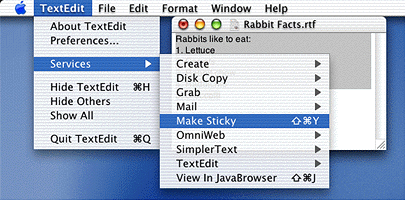
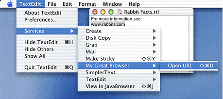
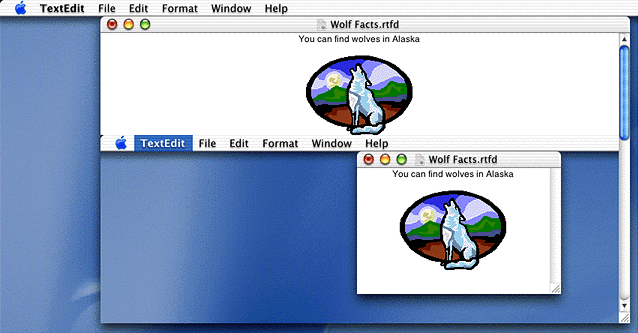
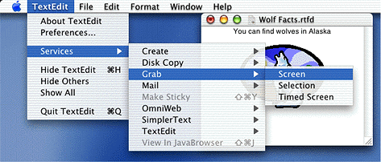
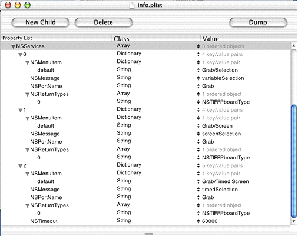

> 导航：[总目录](../../../README.md) · [documentation](../../../_indexes/documentation.md) · [Setting Up Your Carbon Application to Use the Services Menu](Introduction%20to%20Setting%20Up%20Your%20Carbon%20Application%20to%20Use%20the%20Services%20Menu.md)

[Next](Application%20Services%20Tasks.md)[Previous](Introduction%20to%20Setting%20Up%20Your%20Carbon%20Application%20to%20Use%20the%20Services%20Menu.md)

# Application Services Concepts

This chapter provides an overview of the Services menu and describes how application services are provided and accessed. It also shows typical examples of the services available to, or provided by, applications in Mac OS X.

Mac OS X offers two types of services:

- Processor. This type of service acts on data. A processor service acts on the current selection and then sends it to the service. For example, if a user selects an email address in a TextEdit document, and then chooses Mail > Mail To from the Services menu, Mail copies the person’s address, launches the Mail application, and pastes the address into the To field of a new email message.
- Provider. This type of service gives data to the calling application. For example, if a user chooses Grab > Screen from the Services menu, the Grab application opens, takes a screenshot, then returns the screenshot (TIFF data in this case) to the calling application. The calling application (such as TextEdit) is responsible for pasting the data into the active document.

Let’s take a look at a few examples. [Figure 2-1](#apple-f4xwc4dqnrsv64tfmyxwi33df52wszbpkridgmbqgaydsojtfvbuqmrqguwueqkkizauksck) shows the Services menu from the TextEdit application. Make Sticky is an example of a processor service. The Make Sticky command takes the current selection in the TextEdit document, opens a new Stickies document, and then pastes the selection into the Stickies document.

__Figure 1-1__  Make Sticky is a processor service

[Figure 2-2](#apple-f4xwc4dqnrsv64tfmyxwi33df52wszbpkridgmbqgaydsojtfvbuqmrqguwueqkkjjfekqki) shows another example of a processor service. In this case, the Open URL command copies the selected text, launches a Web browser, pastes the selected text into the browser’s location field, and then tries to connect to that location.

__Figure 1-2__  Open URL is a processor service

Grab is a provider service. [Figure 2-3](#apple-f4xwc4dqnrsv64tfmyxwi33df52wszbpkridgmbqgaydsojtfvbuqmrqguwueqkkiveuur2k) shows the Wolf Facts document before Grab > Screen is invoked. [Figure 2-4](#apple-f4xwc4dqnrsv64tfmyxwi33df52wszbpkridgmbqgaydsojtfvbuqmrqguwueqkkjfeuir2f) shows the Wolf Facts document after Grab has taken a shot of the current screen and returned the data to the TextEdit application. Recall that it is TextEdit’s responsibility to do something with the returned data. In this example, TextEdit simply pastes the TIFF into the current document at the active insertion point.

__Figure 1-3__  Grab is a provider service

__Figure 1-4__  The Wolf Facts document after a screenshot has been inserted

A service can be offered as part of an application, such as Mail, or as a standalone service—one without a user interface that is intended for use only in the Services menu. Applications that offer services should be built with the `.app` extension and installed in the `/Applications` folder. A standalone service should be built with the `.service` extension and stored in the `/Library/Services` folder.

When a user logs in, Mac OS X searches the `/Applications` and `/Library/Services` folders in the four file-system domains—System, Network, Local, and User. (See _Inside Mac OS X: System Overview_ for details on file-system domains.) The system examines the information property list for each bundle in these locations and assembles a list of available services (see [Services Properties](#apple-f4xwc4dqnrsv64tfmyxwi33df52wszbpkridgmbqgaydsojtfvbuqmrqguwviucykjcummjqgq)). It uses this information to populate the items in the Services menu.

The Services menu appears automatically as an item in the application menu for Carbon and Cocoa applications. (This is a new feature for Carbon applications, starting with Mac OS X version 10.1.) If an application enables services (see [Using a Service](Application%20Services%20Tasks.md#apple-f4xwc4dqnrsv64tfmyxwi33df52wszbpkridgmbqgaydsojtfvbuqmrqgywugssci5beqqsk)), the appropriate items are available in the Services submenu. Otherwise, items in the Services menu are dimmed.

The items in the Services submenu can be commands or submenus that contain commands. The exact wording of the commands and whether or not there is a submenu is specified by the application. Typically, if an application offers only one service, just the service (stated as a command) is listed in the Services menu. For example, the Stickies application offers only one service—making a new Sticky note—so only the command Make Sticky is listed in the Services menu.

If an application offers more than one service, the application’s name appears in the Services menu, and the services offered by the application appear in a submenu. For example, the Grab application offers three services: taking a screenshot of the entire screen, taking a screenshot of a selected part of the screen, and taking a screenshot of the entire screen after a set amount of time. As you can see in [Figure 2-3](#apple-f4xwc4dqnrsv64tfmyxwi33df52wszbpkridgmbqgaydsojtfvbuqmrqguwueqkkiveuur2k), Grab is an item in the Services menu that has its own submenu listing the commands that invoke Grab’s three services: Screen, Selection, and Timed Screen.

The Services menu for an application is populated with items when the application starts up, but items in the menu aren’t enabled until the user chooses Services from the application menu. Choosing Services causes an event that asks the application to supply the data types it handles. For example, if an application only creates or reads plain text files, it should respond to the event by supplying text as the data type the application can handle. Only those services that provide or act on text will be enabled in the Services menu. The other menu items will be dimmed, unavailable for the user to choose.

Any application that has one or more services to provide must advertise the type of data its services can handle. Services are advertised through the `NSServices` property of the application’s information property list (`Info.plist` file).

`NSServices` is a property whose value is an array of dictionaries that specifies the services provided by the application. Keys for each dictionary entry, are as follows:

- `NSMessage` indicates the name of the service to invoke.
- `NSPortName` is the name of the port to which the application should listen for service requests. Its value depends on how the service provider application is registered. In most cases, this is the application name.
- `NSMenuItem` specifies the text of the Services menu item. You can use a slash to specify a submenu. For example, `Mail/Send Selection` appears in the Services menu as a submenu named Mail with an item named Send Selection. `NSMenuItem` must be unique, as only one is used in the Services menu if there are duplicates.
- `NSKeyEquivalent` is an optional item that specifies the keyboard equivalent that invokes the menu command.
- `NSSendTypes` is an array that contains data type names. Send types are the types sent from the application requesting a service. An applicaton that provides a service must specify an `NSSendType`, an `NSReturnType`, or both.
- `NSReturnTypes` is an array that contains data type names. Return types are the data types returned to the application requesting a service. An applicaton that provides a service must specify an `NSSendType`, an `NSReturnType`, or both.
- `NSUserData` is an optional string that contains a value of your choice. You can use this string to customize the behavior of your service. This entry is useful for applications that provide open-ended services.
- `NSTimeout` is an optional string that indicates the number of milliseconds Services should wait for a response from the application providing a service when a response is required. If wait time exceeds the timeout value, Services displays an error message to the user. If you don’t specify this entry, the timeout value is 30000 milliseconds (30 seconds).

Let’s take a look at the information property list for the Grab application. The `NSServices` property is shown in [Figure 2-5](#apple-f4xwc4dqnrsv64tfmyxwi33df52wszbpkridgmbqgaydsojtfvbuqmrqguwueqkkizcukssc) as it appears in the Property List Editor application.

The `NSServices` property has three entries, one for each service offered by Grab. The first entry is for the menu item Grab > Selection. The slash notation—Grab/Selection—specifies that Selection should be an item in the Grab submenu. (See [Figure 2-3](#apple-f4xwc4dqnrsv64tfmyxwi33df52wszbpkridgmbqgaydsojtfvbuqmrqguwueqkkiveuur2k).)

Note that for each of the three entries, the port name is Grab. As mentioned, the port name is usually the application name.

Each entry has one return type, `NSTIFFPboardType`. An application could have more than one return type per entry, and the return types don’t necessarily need to be the same for each entry.

The entry for Grab/Timed Screen is the only entry that has a specified timeout value. This optional entry is needed in this case so that the Grab application can wait for the user to set up the screen before taking a screenshot.

__Figure 1-5__  The NSServices property for the Grab application

This section provides an overview of what happens when a service is invoked from a Carbon application. We’ll use a fictitious text editing application—BestTextEdit—to illustrate what happens when the user chooses Services from the application menu. In this example, a text document is open and active, and there are several paragraphs of text visible. The user has selected some of the text and wants to mail the selected text to a colleague. Now the user opens the application menu and chooses Services.

As soon as the user chooses Services, the system sends a Carbon event of class `kEventClassService` and kind `kEventServiceGetTypes` to the application. In essence, the system wants to know what types the application (BestTextEdit) can provide (copy data types) or accept (paste data types). When the BestTextEdit application receives the Carbon event, it must determine what types are appropriate for the current state of the application. Recall the user has selected text (`OSType``'TEXT'`), so BestTextEdit should indicate it can provide text data. It should also be able to accept text data, and may be able to accept other types of data (such as TIFF).

The BestTextEdit application provides the data types in the Carbon event parameters `kEventParamServicesCopyTypes` and `kEventParamServicesPasteTypes`. Each parameter is of type `typeCFMutableArrayRef`, so more than one data type can be provided if it’s appropriate.

Once the system knows what data types the BestTextEdit application can handle, it enables the appropriate services. At that point, the user can choose GreatMailApp> Mail To from the Services menu. Figuring out the data types and enabling the appropriate items in the Services menu happens quite rapidly. In fact, to the user, items should appear in the Services menu instantaneously.

When the user chooses GreatMailApp > Mail To from the Services menu, a Carbon event of class `kEventClassService` and kind `kEventServiceCopy` is sent to the BestTextEdit application. The BestTextEdit applicaton must then copy the current text selection to the scrap provided to the application in the services event. Once the data is copied, the Carbon Event Manager sends a Carbon event of class `kEventClassService` and kind `kEventServicePerform` to the GreatMailApp application.

The GreatMailApp application can provide two services: Mail To and Mail Text. Before mail does anything, it must determine which service it needs to provide to the BestTextEdit application. GreatMailApp does this by checking the Carbon event parameter `kEventParamServiceMessageName`. The string provided in this parameter specifies which service was invoked from the Services menu. When GreatMailApp determines Mail To is the service it must provide, the GreatMailApp application gets the text from the scrap provided by the Carbon Event Manager, opens a new message, and pastes the text into the new message.

What if nothing is selected in the document when the user chooses Services? The application can’t provide any data, so BestTextEdit shouldn’t provide any data types for the Carbon event parameter `kEventParameterServiceCopyTypes`. The items in the Services menu are dimmed and not available to the user.

If the user chooses a service that provides data, such as a screen capture service, the BestTextEdit application receives a Carbon event of class `kEventClassService` and kind `kEventServicePaste` after the service has copied the data to the scrap provided to the service by the Carbon Event Manager. The BestTextEdit application responds to the event by copying the data from the scrap and then handling it as appropriate, such as pasting it into the active document at the current insertion point.

[Next](Application%20Services%20Tasks.md)[Previous](Introduction%20to%20Setting%20Up%20Your%20Carbon%20Application%20to%20Use%20the%20Services%20Menu.md)

