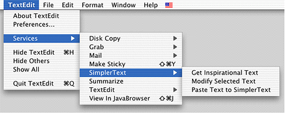
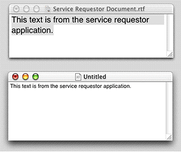
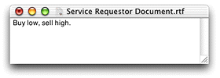
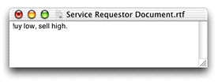

> 导航：[总目录](../../../README.md) · [documentation](../../../_indexes/documentation.md) · [Setting Up Your Carbon Application to Use the Services Menu](Introduction%20to%20Setting%20Up%20Your%20Carbon%20Application%20to%20Use%20the%20Services%20Menu.md)


[Next](Carbon%20Events%20for%20Services.md)[Previous](Application%20Services%20Concepts.md)

# Application Services Tasks

This chapter shows you how add Services functionality to a Carbon application. The tasks covered in this chapter include:

- [Using a Service](#apple-f4xwc4dqnrsv64tfmyxwi33df52wszbpkridgmbqgaydsojtfvbuqmrqgywugssci5beqqsk). Follow the steps in this section if you want to set up your application to use services provided by other applications.
- [Providing a Service](Application%20Services%20Concepts.md#apple-f4xwc4dqnrsv64tfmyxwi33df52wszbpkridgmbqgaydsojtfvbuqmrqguwviucykjcummjqgy). Read this section if you want to set up your application to provide one or more services to other applications.

Mac OS X version 10.1 and later automatically adds a Services item to the application menu of a Carbon application. If you do nothing else, the items in your application’s Services submenu are dimmed and unavailable to users. If you want to enable the Services items appropriate to your application, you’ll need to set up your application to handle the appropriate services-related Carbon events. Specifically, you need to do the tasks described in the following sections:

1. [Declaring Services Events](#apple-f4xwc4dqnrsv64tfmyxwi33df52wszbpkridgmbqgaydsojtfvbuqmrqgywviucykjcummjqgm). You must declare the services-related Carbon events your application handles.
2. [Specifying the Data Types Used by Your Application](Carbon%20Events%20for%20Services.md#apple-f4xwc4dqnrsv64tfmyxwi33df52wszbpkridgmbqgaydsojtfvbuqmrqg4wviucykjcummjqgi).
3. [Handling Copy and Paste Events](#apple-f4xwc4dqnrsv64tfmyxwi33df52wszbpkridgmbqgaydsojtfvbuqmrqgywviucykjcummjqgq). You need to write a Carbon event handler that responds to each services-related Carbon event your application handles.
4. [Installing a Carbon Event Handler](Carbon%20Events%20for%20Services.md#apple-f4xwc4dqnrsv64tfmyxwi33df52wszbpkridgmbqgaydsojtfvbuqmrqg4wviucykjcummjqgu).

Services-related Carbon events are of event class `kEventClassService` and can be one of four event kinds, only three of which are relevant to applications that use, but do not provide, services.

- `kEventServiceGetTypes`. Any application that wants to use a service must respond to this event. When you receive this event, you must provide the data types that can be pasted into or cut from your application. The operating system enables items in the Services menu for those services that operate on, or provide, those data types.
- `kEventServiceCopy`. A service that operates on data supplied by your application (such as the Mail To service provided by the Mail application) sends this kind of event to your application. Your application needs to respond to this event by copying the currently selected data to the scrap provided by the Carbon Event Manager.
- `kEventServicePaste`. A service that provides data to your application (such as the Grab Screen service provided by the Grab application) sends this kind of event to your application. Your application needs to respond to this event by copying the data on the scrap provided by the Carbon Event Manager to your application.

A Carbon event type consists of an event class and an event kind that define an event. You use a structure of type `EventTypeSpec` to declare the Carbon events your application handles. [Listing 3-1](#apple-f4xwc4dqnrsv64tfmyxwi33df52wszbpkridgmbqgaydsojtfvbuqmrqgywugssci5eucqkd) shows how you’d declare an `EventTypeSpec` structure for your application.

__Listing 2-1__  Declaring an EventTypeSpec structure for services events

```
const EventTypeSpec events[] ={
        { kEventClassService, kEventServiceGetTypes },
        { kEventClassService, kEventServiceCopy },
        { kEventClassService, kEventServicePaste }
}
```

It’s more likely that your application will be handling other Carbon events, in which case you’d just add the services-related Carbon event types to the `EventTypeSpec` structure you set up for your entire application, similar to what is shown in [Listing 3-2](#apple-f4xwc4dqnrsv64tfmyxwi33df52wszbpkridgmbqgaydsojtfvbuqmrqgywugsscijcuqqke).

__Listing 2-2__  Declaring an EventTypeSpec structure for a variety of Carbon events

```
const EventTypeSpec events[] ={
        { kEventClassService, kEventServiceGetTypes },
        { kEventClassService, kEventServiceCopy },
        { kEventClassService, kEventServicePaste },
        { kEventClassKeyboard, kEventRawKeyDown },
        { kEventClassWindow, kEventWindowClickContentRgn },
        { kEventClassWindow, kEventWindowFocusAcquired },
        { kEventClassWindow, kEventWindowFocusRelinquish },
        { kEventClassWindow, kEventWindowBoundsChanging },
        { kEventClassWindow, kEventWindowBoundsChanged }
}
```


When the user chooses Services from your application menu, the system sends a Carbon event of class `kEventClassService` and kind `kEventServiceGetTypes` to your application. You need to respond to this event by specifying the data types used by your application. One approach is to declare the data types as items in an array, similar to what’s shown in [Listing 3-3](#apple-f4xwc4dqnrsv64tfmyxwi33df52wszbpkridgmbqgaydsojtfvbuqmrqgywugsscijbesr2f).

__Listing 2-3__  Declaring the data types used in an application

```
static const OSType MyAppsDataTypes[] =
{
    'TEXT',
    'PICT',
    'MooV',
    'AIFF',
    'utxt'
};
```

When your application receives the service event of kind `kEventServiceGetTypes`, you can append the items from the array you declared to the arrays passed to your application in the Carbon event parameters `kEventParamServiceCopyTypes` and `kEventParamServicePasteTypes`. [Listing 3-4](#apple-f4xwc4dqnrsv64tfmyxwi33df52wszbpkridgmbqgaydsojtfvbuqmrqgywugsscinduerce) show how to get the Carbon event parameters provided by the event kind `kEventServiceGetTypes` and then append your application’s data types to each of the arrays. A detailed explanation for each numbered line of code appears following the listing.

__Listing 2-4__  Supplying the data types used by your application

```
Boolean             textSelection = !TXNIsSelectionEmpty (myTextObject);// 1
CFMutableArrayRef   copyTypes, pasteTypes;
short               index, count;
if (textSelection)
{
    GetEventParameter (inEvent,
                        kEventParamServiceCopyTypes,
                        typeCFMutableArrayRef,
                        NULL,
                        sizeof (CFMutableArrayRef),
                        NULL,
                        &copyTypes); // 2
}
GetEventParameter (inEvent,
                    kEventParamServicePasteTypes,
                    typeCFMutableArrayRef,
                    NULL,
                    sizeof (CFMutableArrayRef),
                    NULL,
                    &pasteTypes); // 3
count = sizeof (MyAppsDataTypes) / sizeof (OSType);// 4
for ( index = 0; index < count; index++ )
{
    CFStringRef type =
                CreateTypeStringWithOSType (MyAppsDataTypes [index]);// 5
    if (type)
    {
        if (textSelection) CFArrayAppendValue (copyTypes, type); // 6
        CFArrayAppendValue (pasteTypes, type);// 7
        CFRelease (type); // 8
    }
}
return noErr;// 9
```

Here’s what the code does:

1. Check to see whether there is any text selected. If there isn’t, then you won’t need to provide data types for copying, as there won’t be anything to copy. You can use whatever function is appropriate to check for selected text. The Multilingual Text Engine (MLTE) function `TXNIsSelectionEmpty` returns a Boolean value that indicates whether or not anything is selected in an MLTE text object (`TXNObject`).
2. If text is selected, then use the Carbon Event Manager function `GetEventParameter` to get the array associated with the Carbon event parameter `kEventParamServiceCopyTypes`. You’ll fill this array with the data types the application can give to a service.
3. Use the Carbon Event Manager function `GetEventParameter` to get the array associated with the Carbon event parameter `kEventParamServicePasteTypes`. You’ll fill this array with the data types your application can accept from a service.
4. Recall that the array `MyAppsDataTypes` was declared in [Listing 3-3](#apple-f4xwc4dqnrsv64tfmyxwi33df52wszbpkridgmbqgaydsojtfvbuqmrqgywugsscijbesr2f). This line of code figures out how many data types are in the array.
5. Use the Carbon Event Manager function `CreateTypeStringWithOSType` to create a `CFStringRef` object from the `OSType`.

   Before your application can use services provided by other applications, your application must provide the data types it can handle to the Carbon Event Manager. The copy and paste arrays passed to your application by the Carbon Event Manager are arrays of `CFStringRef` objects. As a result, you must convert the `OSType` data types your application handles to the equivalent `CFStringRef` objects using the function `CreateTypeStringWithOSType`.
6. If text is selected, use the Core Foundation Collection Services function `CFArrayAppendValue` to add the data types that the application uses to the `copyTypes` array. This statement is in a `for` loop, so all the data types are appended by the time the loop is completed.
7. This statement is also in the `for` loop. Again, use the function `CFArrayAppendValue` to add the data types the application uses to the `pasteTypes` array.
8. Call the Core Foundation Base Services function `CFRelease` to release the `type` object.
9. Returns `noErr` to indicate to the event dispatching system that the event has been handled. If you return anything else, the services request does not complete because the system assumes that you are unable to handle this event.

After you’ve specified which data types your application handles, your application can receive the service events of kind `kEventServiceCopy` and `kEventServicePaste`. You need to respond to each event kind appropriately.

This section shows code segments that handle each event kind. The code segments are from a text editing application that uses Multilingual Text Engine (MLTE) to handle Unicode text editing. Your code needs to be tailored for your application.

[Listing 3-5](#apple-f4xwc4dqnrsv64tfmyxwi33df52wszbpkridgmbqgaydsojtfvbuqmrqgywugsscjbcumskg) shows a code segment from an event handler that handles the event kind `kEventServiceCopy`. Before you handle a copy event you should make sure there is data selected. You don’t need to do anything unless some data is selected. A detailed explanation for each numbered line of code follows the listing.

__Listing 2-5__  Handling a copy event

```
case kEventServiceCopy:
{
    OSStatus        status = noErr;
    TXNOffset       startOffset;
    TXNOffset       endOffset;
    ScrapRef        scrap;
    Handle          textHandle;

    check (myTextObject);// 1
    check (!TXNIsSelectionEmpty (myTextObject));// 2

    TXNGetSelection (myTextObject, &startOffset, &endOffset);// 3

    status = TXNGetData (myTextObject,
                        startOffset, endOffset, &textHandle);// 4
    require_noerr (status, CantGetTXNData);// 5
    require (textHandle != NULL, CantGetDataHandle);// 6

    status = GetEventParameter (myEvent,
                                kEventParamScrapRef,
                                typeScrapRef,
                                NULL,
                                sizeof (ScrapRef),
                                NULL,
                                &scrap );// 7
    require_noerr (status, CantGetCopyScrap);// 8
    verify_noerr (ClearScrap (&scrap));// 9
    status = PutScrapFlavor (scrap,
                            kTXNUnicodeTextData,
                            0,
                            GetHandleSize (textHandle),
                            *textHandle );// 10
CantGetCopyScrap:
    DisposeHandle (textHandle);// 11
CantGetDataHandle:
CantGetTXNData:
    result = status;// 12
}
break;
```

Here’s what the code does:

1. Calls the macro `check` to make sure the text object is valid. The variable `myTextObject` is of type `TXNObject`. See the MLTE reference for more information. See Debugging.h for more information on the `check` macro.
2. Calls the MLTE function `TXNIsSelectionEmpty` to make sure there is something in the selection, otherwise it doesn’t make sense to copy.
3. Gets the absolute offsets of the selected text by calling the MLTE function `TXNGetSelection`.
4. Calls the MLTE function `TXNGetData`to copy the selected text to a text handle.
5. Checks to make sure the function `TXNGetData` did not return an error. See Debugging.h for more information on the `require_noerr` macro.
6. Checks to make sure the text handle returned by the function `TXNGetData` is not `NULL`. See Debugging.h for more information on the `require` macro.
7. Calls the Carbon Event Manager function `GetEventParameter` to obtain the scrap associated with the copy event.
8. Calls the macro `require_noerr` to make sure the parameter is obtained without error.
9. Clears the scrap associated with the event, also calling the macro `verify_noerr` to check for errors. Clearing the scrap ensures you can safely copy data to it. See Debugging.h for more information on the `verify_noerr` macro.
10. Calls the Scrap Manager function `PutScrapFlavor` to place the selected text on the scrap.
11. Disposes of the text handle previously allocated by the function `TXNGetData`.
12. Sets `result` to `status`. This code listing does not show the complete event handling routine; only the switch statement that handles a copy event. Note that the event handler must return the `result` value. The value `noErr` indicates to the event dispatching system that the event has been handled. If you return anything else, the services request does not complete because the system assumes that you are unable to handle this event.

[Listing 3-6](#apple-f4xwc4dqnrsv64tfmyxwi33df52wszbpkridgmbqgaydsojtfvbuqmrqgywugssci5feqrce) shows a code segment from an event handler that handles the event kind `kEventServicePaste`. Unlike the copy event, you do not need to check for selected data, as your application is accepting data provided by a service. A detailed explanation for each numbered line of code follows the listing.

__Listing 2-6__  Handling a paste event

```
case kEventServicePaste:
{
    OSStatus    status = noErr;
    Size        unicodeTextSize;
    UniChar*    unicodeText;
    ScrapRef    scrap;
    TXNOffset   startOffset;
    TXNOffset   endOffset;

    check (myTextObject != NULL);

    status = GetEventParameter (myEvent,
                            kEventParamScrapRef,
                            typeScrapRef,
                            NULL,
                            sizeof (ScrapRef),
                            NULL,
                            &scrap);// 1
    require_noerr (status, CantGetPasteScrap );// 2

    status = GetScrapFlavorSize (scrap, kTXNUnicodeTextData,
                                 &unicodeTextSize);// 3
    require_noerr (status, CantGetDataSize);// 4

    unicodeText = (UniChar*) malloc (unicodeTextSize);// 5
    require_action (unicodeText != NULL, CantCreateBuffer,
                                status = memFullErr);// 6

    status = GetScrapFlavorData (scrap, kTXNUnicodeTextData,
                                &unicodeTextSize, unicodeText );// 7
    require_noerr (status, CantGetScrapFlavorData);// 8

    TXNGetSelection (myTextObject, &startOffset, &endOffset);// 9

    status = TXNSetData (myTextObject, kTXNTextData,
                    unicodeText, unicodeTextSize,
                    startOffset, endOffset );// 10

CantGetScrapFlavorData:
    free (unicodeText);// 11

CantCreateBuffer:
CantGetDataSize:
CantGetPasteScrap:
    result = status;// 12
}
```

Here’s what the code does:

1. Calls the Carbon Event Manager function `GetEventParameter` to get the scrap associated with the paste event. This scrap contains data provided by a service.
2. Calls the macro `require` to make sure the parameter contains data. See Debugging.h for more information on the `require` macro.
3. Gets the size of the data on the scrap by calling the Scrap Manager function `GetScrapFlavorSize`.
4. Calls the macro `require_noerr` to make sure the size of the data on the scrap is obtained without error. See Debugging.h for more information on the `require_noerr` macro.
5. Allocates a Unicode text buffer large enough to hold the data on the scrap.
6. Calls the macro `require_action` to make sure the Unicode text buffer is not `NULL`. See Debugging.h for more information on the `require_action` macro.
7. Obtains the data on the scrap by calling the Scrap Manager function `GetScrapFlavorData`.
8. Calls the macro `require_noerr` to make sure the data is obtained without error.
9. Calls the MLTE function `TXNGetSelection` to obtain the starting and ending offsets that define the range into which the data should be pasted.
10. Pastes the data from the scrap to the MLTE text object (`TXNObject`) by calling the MLTE function `TXNSetData`.
11. Frees the memory allocated for the Unicode text buffer.
12. Sets `result` to `status`. This code listing does not show the complete event handling routine; only the switch statement that handles a paste event. Note that the event handler must return the `result` value. The value `noErr` indicates to the event dispatching system that the event has been handled. If you return anything else, the services request does not complete because the system assumes that you are unable to handle this event.

Once you’ve written a handler to take care of the services events, you need to install it by calling the Carbon Event Manager function `InstallEventHandler` with the appropriate event target. You need to get the event target before you call the function `InstallEventHandler`. For the text editing application used in the sample code, the event target is the document window. You can use code similar to the following to get a window event target:

```
myEventTarget = GetWindowEventTarget (myDocumentWindow);
```

To install the event handler, your application should include a call similar to this:

```
InstallEventHandler (myEventTarget,
                        handlerUPP,
                        numTypes,
                        typeList,
                        userData,
                        &handlerRef);
```

where:

- `myEventTarget` is an event target reference.
- `handlerUPP` is a pointer to your handler function.
- `numTypes` is the number of events for which you are registering the handler.
- `typeList` is a pointer to the array of events that contains the services events.
- `userData` is an optional value that is passed to your event handler when the handler is called.
- `handlerRef` is (on return) a value of type `EventHandlerRef`, which you can use later to remove the handler. You can pass `null` if you don’t want the reference. When the target is disposed of, the handler is removed as well.

To provide one or more services for other applications to use, you need to do the tasks described in the following sections

1. [Adding the NSServices Property to the Information Property List](#apple-f4xwc4dqnrsv64tfmyxwi33df52wszbpkridgmbqgaydsojtfvbuqmrqgywugsscinduosch). Your application advertises the services it provides through the `NSServices` property.
2. [Making Sure There’s a Bundle Identifier Property](#apple-f4xwc4dqnrsv64tfmyxwi33df52wszbpkridgmbqgaydsojtfvbuqmrqgywviucykjcummjrgy). The `CFBundleIdentifier` property should already be in your application’s property list. If it isn’t, you need to add it.
3. [Handling the Service Perform Event](#apple-f4xwc4dqnrsv64tfmyxwi33df52wszbpkridgmbqgaydsojtfvbuqmrqgywviucykjcummjrga). You must write code to handle the Carbon event kind `kEventServicePerform`.
4. [Installing a Carbon Event Handler](#apple-f4xwc4dqnrsv64tfmyxwi33df52wszbpkridgmbqgaydsojtfvbuqmrqgywugsscizeukqki). The event target for the handler should be the application.
5. [Registering the Service](#apple-f4xwc4dqnrsv64tfmyxwi33df52wszbpkridgmbqgaydsojtfvbuqmrqgywviucykjcummjrgi). Registration informs the system and other applications know about your service.

Applications must use their information property list to advertise the services they provide. You need to add the `NSServices` property, and it must have one dictionary entry for each service you provide. Each dictionary entry must have these keys: `NSMessage`, `NSPortName`, `NSMenuItem`, `NSSendTypes`, and `NSReturnTypes` and can optionally have these keys: `NSKeyEquivalent`, `NSUserData`, and `NSTimeout`. See [Services Properties](Application%20Services%20Concepts.md#apple-f4xwc4dqnrsv64tfmyxwi33df52wszbpkridgmbqgaydsojtfvbuqmrqguwviucykjcummjqgq) for a description of each key and examples of the `NSServices` property in an information property list.

Services functionality in Mac OS X is implemented using Cocoa. This has implications for the values you assign to the `NSSendTypes` and `NSReturnTypes` arrays. Cocoa applications use `NSPasteboard` objects as interfaces to a pasteboard server that allows you to transfer data between applications, as in copy, cut, and paste operations. As a result, Cocoa applications can recognize only those services whose `NSSendTypes` and `NSReturnTypes` arrays contain `NSPasteboard` types.

Services is implemented to allow Carbon applications to recognize both `OSType` and `NSPasteboard` types. If you assign only `OSType` types to the `NSSendTypes` and `NSReturnTypes` arrays, Cocoa applications aren’t able to access your services.

To add the `NSServices` property to the information property list for a service application or a standalone service do the following:

1. Open your services application or standalone services project in Project Builder.
2. Click the Targets tab, then click the appropriate target in the Targets list.
3. Click the Application Settings tab, then click Expert.
4. Click the New Sibling button.
5. Type `NSServices` in the Property List column.
6. Choose Array from the Class pop-up menu.
7. Click the disclosure triangle next to `NSServices`, then click the New Child button.

   When you click the disclosure triangle, the New Sibling button changes to New Child.
8. Set the array element’s class to Dictionary.
9. Click the disclosure triangle next to the array element, then click the New Child button.
10. Type an `NSServices` keyword in the Property List column, make sure its class is set appropriately, then type or choose a value.

    Click New Sibling to add the other required keywords to this array element.

    See [Services Properties](Application%20Services%20Concepts.md#apple-f4xwc4dqnrsv64tfmyxwi33df52wszbpkridgmbqgaydsojtfvbuqmrqguwviucykjcummjqgq) for a discussion of keywords and their classes.

    For each service you provide, you need to specify a string for the `NSMessage` property. You’ll use this string to determine which service you need to provide.

You need to add an array element to the `NSServices` property for each service your application provides. To add another array element, click `NSServices`, click the New Child button, then follow steps 8 through 10.

The `CFBundleIdentifier` property is a unique identifier string for a bundle (such as an application bundle). All bundles created for Mac OS X should have this property in the information property list, as the system uses the identifier to locate the bundle at runtime and find out information about the bundle, such as what services are provided.

If you haven’t already added a bundle identifier to the information property list, do so now. The value of the `CFBundleIdentifier` property should be a string in the form of a Java-style package name (think of it as a reverse URL). For example, `com.mycompany.myGreatTextEditApp`.

The Carbon Event Manager requests a service by passing your application a services event of kind `kEventServicePerform`. You must do the following to handle this event:

1. Declare an `EventTypeSpec` structure that specifies the Carbon event class `kEventClassService` and event kind `kEventServicePerform`. See [Declaring Services Events](#apple-f4xwc4dqnrsv64tfmyxwi33df52wszbpkridgmbqgaydsojtfvbuqmrqgywviucykjcummjqgm) for information on declaring an `EventTypeSpec` structure.
2. Write code to handle the event. The details for handling the event are in this section.

When your application receives the event kind `kEventServicePerform`, you need to get the Carbon event parameters `kEventParamServiceMessageName`, `kEventParamScrapRef`, and (optionally) `kEventParamUserData` as shown in [Listing 3-7](#apple-f4xwc4dqnrsv64tfmyxwi33df52wszbpkridgmbqgaydsojtfvbuqmrqgywugsscivfesr2g). You also need to set up some variables to receive the event parameters and to handle the scrap used to pass data between the service requestor and your service. A detailed explanation for the code in [Listing 3-7](#apple-f4xwc4dqnrsv64tfmyxwi33df52wszbpkridgmbqgaydsojtfvbuqmrqgywugsscivfesr2g) follows the listing.

__Listing 2-7__  Getting the Carbon event parameter for the event kind kEventServicePerform

```
CFStringRef     message;// 1
CFStringRef     userData;// 2
ScrapRef        specificScrap;// 3
ScrapRef        currentScrap// 4

GetEventParameter (inEvent,
                kEventParamServiceMessageName,
                typeCFStringRef,
                NULL,
                sizeof (CFStringRef),
                NULL,
                &message);// 5
GetEventParameter (inEvent,
                kEventParamScrapRef,
                typeScrapRef,
                NULL,
                sizeof (ScrapRef),
                NULL,
                &specificScrap);// 6
GetEventParameter (inEvent,
                kEventParamUserData,
                typeCFStringRef,
                NULL,
                sizeof (CFStringRef),
                NULL,
                &userData);// 7
```

Here’s what the code does:

1. Declare a variable to hold the `NSMessage` string that gets returned when you call the function `GetEventParameter` to get the Carbon event parameter `kEventParamServiceMessageName`. Recall that `NSMessage` is a property whose value identifies a service provided by your application. You use the string returned in the message `variable` to determine which service to invoke in response to the Carbon event. For example, if the Grab application gets the `timedSelection` string, it would call its function for taking a shot of the screen after a specified amount of time.
2. Declare the variable `userData` only if you’ve added an `NSUserData` property for the services offered by your application.
3. Declare a variable to hold the scrap passed by the Carbon Event Manager. The notion of having specific scraps in Carbon is new with Mac OS X version 10.1. You’ll write code later that moves data from this scrap to the Clipboard or the MLTE private scrap.
4. Declare a variable to hold the current scrap, otherwise known as the Clipboard.
5. Call the Carbon Event Manager function `GetEventParameter` to get the name of the service. It’s the string you assigned to the `NSMessage` property, and the string is returned in the `message` variable.
6. Get the scrap reference from the Carbon Event Manager. If the service requestor is providing data to your service, the scrap contains data. Otherwise, this is the scrap you use to pass data to the service requestor.
7. If you assigned a string to `NSUserData`, you need to call the function `GetEventParameter` to get the `userData` string.

Once you retrieve the values of the `message` and the `scrap` variables, you can invoke the code to handle the service specified by the `message`. Next we’ll take a look at how to implement the code to handle a service.

When you write the code to handle a service, you need to determine how data moves between the application requesting a service and your service. The way data moves has implications for clearing the scrap and moving data between the specific scrap provided by the Carbon Event Manager, the current scrap (that is, the Clipboard), and, in the case of a text editing application, the MLTE private scrap. There are three possible scenarios.

1. Data is given to the service provider by the service requestor, but data is not returned to the service requestor.
2. Data is given to the service requestor by the service provider. The service requestor doesn’t give any data to the service provider.
3. Data is given to the service provider by the service requestor, and the service provider returns data to the service requestor.

[Figure 3-1](#apple-f4xwc4dqnrsv64tfmyxwi33df52wszbpkridgmbqgaydsojtfvbuqmrqgywugsscinfeqq2f) shows three services provided by the SimplerText application, a sample text editing application that uses MLTE. The Paste Text to Simpler Text service illustrates the first scenario. Get Inspirational Text illustrates the second scenario. Modify Selected Text illustrates the third scenario. The code segments in the following sections show how each service is implemented.

__Figure 2-1__  Three services provided by SimplerText



Data is given to the service provider on the scrap and none is returned to the service requestor. The data is extracted from the scrap by the service provider and the provider does something with it. For example, the Stickies application provides a Make Sticky service that takes the current selection from an application, and pastes it into a new Sticky document.

Your application, as the service provider, must call the function `ClearCurrentScrap` to clear the current scrap before putting data on it. Then you need to call the function `GetCurrentScrap` to get a valid scrap reference. [Listing 3-8](#apple-f4xwc4dqnrsv64tfmyxwi33df52wszbpkridgmbqgaydsojtfvbuqmrqgywugsscivdekqsg) show a code segment that implements the Paste Text to Simpler Text service. It gets text data from a service requestor and pastes it into a document. See the detailed explanation that follows the listing for each numbered line of code.

__Listing 2-8__  Getting data from the service requestor

```
ClearCurrentScrap ();// 1
GetCurrentScrap (&currentScrap);// 2
count = sizeof (MyAppsDataTypes) / sizeof (OSType);// 3
for ( index = 0; index < count; index++ )// 4
{
        Size        byteCount;
        OSStatus    err;

        err = GetScrapFlavorSize (specificScrap,
                            MyAppsDataTypes [index],
                            &byteCount);
        if ( err == noErr )
       {
            void*   buffer = malloc (byteCount);

           if (buffer != NULL)
           {
               err = GetScrapFlavorData (specificScrap,
                                    TXNTypes [index],
                                    &byteCount,
                                    buffer);
               if (err == noErr)
               {
                      PutScrapFlavor (currentScrap,
                                TXNTypes [index],
                                0,
                                byteCount,
                                buffer);
               }
               free (buffer);
           }
        }
}
TXNConvertFromPublicScrap ();// 5
if (TXNIsScrapPastable())
            TXNPaste (myTextObject);// 6
```

Here’s what the code does:

1. When your application receives a request to copy text from the service requestor into your application, you must first clear the current scrap using the Scrap Manager function `ClearCurrentScrap`.
2. Get a reference to the current scrap.
3. `MyAppsDataTypes` is an array that contains the `OSTypes` handled by your application. You need to declare this array. See [Listing 3-3](#apple-f4xwc4dqnrsv64tfmyxwi33df52wszbpkridgmbqgaydsojtfvbuqmrqgywugsscijbesr2f) for an example.
4. The `for` loop copies the data from the scrap provided by the Carbon Event Manager. For each data type your application can handle, you call the function `GetScrapFlavorSize` to see if the type of data on the scrap provided by the CEM matches. If it matches, allocate a buffer and get the data from the scrap using the function `GetScrapFlavorData`. Then use the Scrap Manager function `PutScrapFlavor` to copy the data to the Clipboard.
5. MLTE uses a private scrap, so you need to call the MLTE function to convert the current scrap to MLTE’s private scrap.
6. Make sure the data on MLTE’s scrap can be pasted. If so, then paste it into your document.

[Figure 3-2](#apple-f4xwc4dqnrsv64tfmyxwi33df52wszbpkridgmbqgaydsojtfvbuqmrqgywugsscirbucssi) illustrates what the code in [Listing 3-8](#apple-f4xwc4dqnrsv64tfmyxwi33df52wszbpkridgmbqgaydsojtfvbuqmrqgywugsscivdekqsg) does. The text provided by the service requestor is highlighted in the service requestor document window. The service provider gets the text from the scrap and pastes it into an untitled document.

__Figure 2-2__  Text provided by the service requestor



Data is given to the service requestor by the service provider, but the service requestor doesn’t give any data to the service provider. For example, the Grab application provides a Grab Screen service that gives the client an image of the screen.

Your application, as the service provider, must call the Scrap Manager function `ClearScrap` to clear the scrap given to it by the Carbon Event Manager. Then it can put data on the scrap for the service requestor by calling the function `PutScrapFlavor`. [Listing 3-9](#apple-f4xwc4dqnrsv64tfmyxwi33df52wszbpkridgmbqgaydsojtfvbuqmrqgywugssci5deersg) shows a code segment that implements the Get Inspirational Text service. It gives a text string to the service requestor. See the detailed explanation that follows the listing for each numbered line of code.

__Listing 2-9__  Giving data to the service requestor

```
char    string[] = "Buy low, sell high.";// 1

ClearScrap (&specificScrap);// 2
PutScrapFlavor (specificScrap,
            'TEXT',
            0,
            strlen (string),
            string);// 3
```

Here’s what the code does:

1. Declare a string. This is what you’ll give to the service requestor.
2. The function `ClearScrap` is new with Mac OS X version 10.1. Unlike the function `ClearCurrentScrap`, which can only clear the Clipboard, `ClearScrap` can clear any scrap passed to it. In this case, you need to pass a reference to the scrap provided to your application by the Carbon Event Manager in the parameter `kEventParamScrapRef`.
3. After you’ve cleared the scrap, put the string you want to pass to the service requestor on the scrap.

[Figure 3-3](#apple-f4xwc4dqnrsv64tfmyxwi33df52wszbpkridgmbqgaydsojtfvbuqmrqgywugsscjjdeqssi) illustrates what the code in [Listing 3-9](#apple-f4xwc4dqnrsv64tfmyxwi33df52wszbpkridgmbqgaydsojtfvbuqmrqgywugssci5deersg) does. The string defined in the listing is pasted into the service requestor’s document window.

__Figure 2-3__  Giving text to the service requestor



The service requestor gives data to the service provider. The service provider modifies the data and returns the modified data to the service requestor. For example, a spell checker service takes text from the service requestor and returns text with corrected spelling.

Your application, as the service provider, must use the function `GetScrapFlavorData` to take the data from the scrap given by to it by the Carbon Event Manager. Then the scrap must be cleared, by calling the Scrap Manager function `ClearScrap`. Once the data is processed, you put it on the scrap by calling the function `PutScrapFlavor`.

[Listing 3-10](#apple-f4xwc4dqnrsv64tfmyxwi33df52wszbpkridgmbqgaydsojtfvbuqmrqgywugsscjfbeuqkg) shows a code segment that implements the Modify Selected Text service. It gets text data from a service requestor, modifies it, and passes it back to the service requestor. See the detailed explanation that follows the listing for each numbered line of code.

__Listing 2-10__  Modifying data from the service requestor

```
OSStatus    err;// 1
Size        byteCount;

err = GetScrapFlavorSize (specficScrap,
                    'utxt',
                    &byteCount);// 2
if (err == noErr)
{
    UniChar*    buffer = (UniChar*) malloc (byteCount);// 3
    if (buffer != NULL)
    {
        err = GetScrapFlavorData (specificScrap,
                            'utxt',
                            &byteCount,
                            buffer);// 4
        if ( err == noErr && byteCount > 1 )
        {
            buffer[0] = '!';// 5
            ClearScrap (&specficScrap);// 6
            PutScrapFlavor (specificScrap,
                        'utxt',
                        0,
                        byteCount,
                        buffer);// 7
            result = noErr;
        }
        free (buffer);// 8
    }
}
```

Here’s what the code does:

1. Declare variables for error checking and to get the number of bytes on the scrap.
2. Find out the size of the Unicode text data that’s on the scrap provided by the Carbon Event Manager.
3. Allocate a buffer to accommodate the size of the data.
4. Get the data from the scrap.
5. Replace the first character with an exclamation point.
6. Call the Scrap Manager function `ClearScrap` to clear the scrap given to your application by the Carbon Event Manager. Recall that the function `ClearScrap` can clear any scrap passed to it, while the function `ClearCurrentScrap` is limited to clearing the Clipboard.
7. Put the modified data back on the scrap for the Carbon Event Manager.
8. Free the memory allocated for the buffer.

[Figure 3-4](#apple-f4xwc4dqnrsv64tfmyxwi33df52wszbpkridgmbqgaydsojtfvbuqmrqgywugsscijbumqkg) illustrates what the code in [Listing 3-10](#apple-f4xwc4dqnrsv64tfmyxwi33df52wszbpkridgmbqgaydsojtfvbuqmrqgywugsscjfbeuqkg) does. The original text was `Buy low, sell high.` The service provider replaced the first letter of the selected text with an exclamation point.

__Figure 2-4__  Modified text returned to the service requestor



Once you’ve written a handler to take care of the services events, you need to install it by calling the Carbon Event Manager macro `InstallApplicationEventHandler`. You can use this macro rather than the more general function `InstallEventHandler` when the event target is the application itself, which is the case for an application that provides services.

Your application should include a call similar to this:

```
InstallApplicationEventHandler ( handlerUPP,
                        numTypes,
                        typeList,
                        userData,
                        &handlerRef);
```

where:

- `handlerUPP` is a pointer to your handler function.
- `numTypes` is the number of events for which you are registering the handler.
- `typeList` is a pointer to the array of events that contains the services events.
- `userData` is an optional value that is passed to your event handler when the handler is called.
- `&handlerRef` is (on return) a value of type `EventHandlerRef`, which you can use later to remove the handler. You can pass `null` if you don’t want the reference. When the target is disposed of, the handler is removed as well.

If you want to make sure your service gets registered and your code works, you’ll need to do the following.

- Install your application or standalone service in the appropriate location. See [Installation Paths for Services](Application%20Services%20Concepts.md#apple-f4xwc4dqnrsv64tfmyxwi33df52wszbpkridgmbqgaydsojtfvbuqmrqguwueqkki5eeissb).
- Log out and back in. Mac OS X searches for and assembles the list of available services only when a user logs in.

[Next](Carbon%20Events%20for%20Services.md)[Previous](Application%20Services%20Concepts.md)

