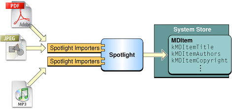
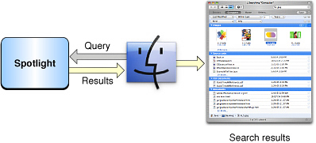

> 导航：[总目录](../../../README.md) · [documentation](../../../_indexes/documentation.md) · [Spotlight Overview](Introduction%20to%20Spotlight.md)

[Next](Spotlight%20Metadata%20Attributes.md)[Previous](What%20is%20Spotlight.md)

# How Does Spotlight Work?

Spotlight provides fast desktop searching by extracting metadata in the background and storing the indexed metadata for future searches. When a query is made, the indexed metadata is searched for matching files.

Every time a file is created, modified or deleted, the kernel notifies the Spotlight engine that it needs to update the system store for changed file. Using Launch Services, Spotlight determines the uniform type identifier of the file and attempts to find an appropriate importer plug-in. If an importer exists and is authorized, it is loaded and passed the path to the file.

__Figure 1__  Extracting Metadata

It is the importer’s responsibility to then read the data file and construct a dictionary that contains the appropriate metadata. When finished extracting the metadata, the dictionary is returned to the Spotlight engine, which then updates the system store.

Spotlight queries are made by client applications, such as the Finder. The application constructs the appropriate query expression for the search, specifies the scope of the search, how the data is to be grouped when it is returned, and then executes the query. The query is passed to the Spotlight engine, which begins the initial result-gathering phase of the search. During this phase the system store is searched for metadata that matches the query, and it returns the search results to the application.

__Figure 2__  Querying Spotlight

If the query is configured to return live-update results, Spotlight notifies the client application when a change to the system store is made that causes the search results to change. Changes to the system store can cause additional files to match the query or cause files that initially matched to no longer match the query. Spotlight notifies the client application of the type of change, and the client application can update its results as appropriate.

[Next](Spotlight%20Metadata%20Attributes.md)[Previous](What%20is%20Spotlight.md)

