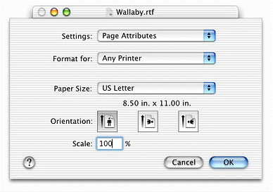
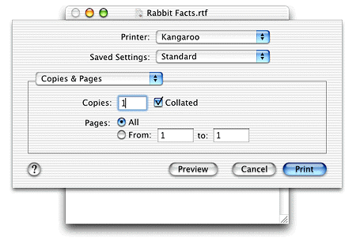
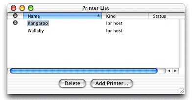
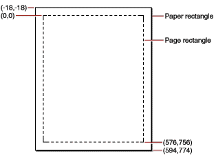
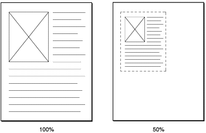

> 导航：[总目录](../../../README.md) · [documentation](../../../_indexes/documentation.md) · [Supporting Printing in Your Carbon Application](Introduction%20to%20Supporting%20Printing%20in%20Your%20Carbon%20Application.md)


[Next](Printing%20Tasks.md)[Previous](Introduction%20to%20Supporting%20Printing%20in%20Your%20Carbon%20Application.md)

# Printing Concepts for Carbon Developers

The Carbon Printing Manager is a collection of system software functions that your application can use to print to any type of supported printer. When printing, your application calls the same Carbon Printing Manager functions regardless of the type of printer selected by the user. An application that uses the Carbon Printing Manager can print in Mac OS 8 and 9 with existing printer drivers and in Mac OS X with new printer drivers.

This chapter provides an overview of the key concepts you need to support printing with the Carbon Printing Manager. It includes the following sections:

- [Overview of Printing Terminology](#apple-f4xwc4dqnrsv64tfmyxwi33df52wszbpkridgmbqgaydsnzyfvkfamzqgaydambuguwugsscjbauursf) defines the more frequently used printing terms.
- [High-Level Printing Tasks](#apple-f4xwc4dqnrsv64tfmyxwi33df52wszbpkridgmbqgaydsnzyfvkfamzqgaydambuguwviucykjcummjv) lists the high-level tasks that a Carbon application must to do support printing.
- [Printing Objects](#apple-f4xwc4dqnrsv64tfmyxwi33df52wszbpkridgmbqgaydsnzyfvkfamzqgaydambuguwviucykjcummjt) provides information about the data types you use to keep track of user selections and other data related to a print job.
- [Printing Functions](#apple-f4xwc4dqnrsv64tfmyxwi33df52wszbpkridgmbqgaydsnzyfvkfamzqgaydambuguwviucykjcummju) gives an overview of the key functions needed by your application to support printing.
- [The Print Loop](#apple-f4xwc4dqnrsv64tfmyxwi33df52wszbpkridgmbqgaydsnzyfvkfamzqgaydambuguwugsscjfcugqkk) describes the code that sends a print job to a printer queue.
- [Sequence, Scope, and Usage](#apple-f4xwc4dqnrsv64tfmyxwi33df52wszbpkridgmbqgaydsnzyfvkfamzqgaydambuguwueqkdjjdueq2e) provides guidelines for using printing functions.
- [Page and Paper Rectangles](#apple-f4xwc4dqnrsv64tfmyxwi33df52wszbpkridgmbqgaydsnzyfvkfamzqgaydambuguwviucykjcummjr) discusses the page and paper boundaries.
- [If You’ve Used the Old Printing Manager](#apple-f4xwc4dqnrsv64tfmyxwi33df52wszbpkridgmbqgaydsnzyfvkfamzqgaydambuguwviucykjcummjw) summarizes the differences between the old Printing Manager and the Carbon Printing Manager.

There are several terms that you’ll see repeatedly in the Carbon Printing Manager documentation: page format, print settings, formatting printer, default printer, and print job.

Page format describes how pages of a document should be printed, and includes such information as paper size and orientation. Although an application can programmatically set up the page format, most applications allow users to set options that control the page format in the Page Setup dialog.

The default page format settings are determined by the formatting printer. The _formatting printer_ is the one that is displayed in the “Format for” pop-up menu in the Page Setup dialog. The default formatting printer is the generic Any Printer, as shown in the Page Setup dialog in Figure 2-1.

__Figure 1-1__  The Page Setup Dialog



_Print settings_ control the execution of a print job on a specific printer, and include such information as the number of copies, which pages to print, and the number of pages per sheet. As with the page format, an application can programmatically set print settings but usually allows users to open the Print dialog and make print settings instead. Figure 2-2 shows the Copies & Pages pane of the Print dialog.

__Figure 1-2__  The Copies & Pages pane of the Print dialog



The default print settings, as well as any constraints on those values, are determined by the printer module for the default printer. Before the Print dialog opens, the _default printer_ in Mac OS X is the printer that is currently selected in Print Center. In Mac OS 9, it is the printer that is currently selected in the Chooser. Figure 2-3 shows Print Center with the default printer set to a printer named Kangaroo.

__Figure 1-3__  Print Center with the default printer set to Kangaroo



A _print job_ consists of two items:

- the drawing commands that describe a document
- the settings that control printing the document and keep track of it once the job has been added to a printer’s queue

The high-level tasks needed to print in a Carbon application are

- setting up the page format
- setting up the print settings
- printing the job

As you’ll see later in this chapter, Carbon Printing Manager data structures and functions are grouped to support these tasks.

The way you implement the high-level printing tasks depends on whether the printing tasks are driven by the Page Setup and Print dialogs. In most document-based applications, such as a text editing or drawing application, high-level printing tasks are driven by user interaction with these dialogs. The user can choose Page Setup and Print from the File menu and change settings. A document prints when the user clicks Print in the Print dialog.

An application can also support printing without requiring a user to open either the Page Setup or Print dialogs. This is common for applications that provide an option for the user to print one copy using default settings. In this case, an application can programmatically set up the page format and print settings, eliminating the need for the user to make settings in either of the printing dialogs. You’ll see how to do this in [Printing One Copy](Printing%20Tasks.md#apple-f4xwc4dqnrsv64tfmyxwi33df52wszbpkridgmbqgaydsnzyfvkfamzqgaydambugywueqkkivbukrkj).

Another situation in which your application could bypass the printing dialogs is to provide support for the user to save a document as a portable document format (PDF) file. The default spool file format in Mac OS X is PDF. As a result, it is straightforward for those applications that support printing in Mac OS X (version 10.1 and later) to also support saving a document as a PDF file. You’ll see how to implement this in [Saving a Document as a PDF File](Printing%20Tasks.md#apple-f4xwc4dqnrsv64tfmyxwi33df52wszbpkridgmbqgaydsnzyfvkfamzqgaydambugywueqkki5cueske).

Let’s take a look at what an application needs to do to implement high-level printing tasks in each situation: printing driven by printing dialogs and printing that does not require a user to interact with the printing dialogs.

If your application lets the user choose Page Setup and Print from the File menu, you need to perform the following to implement each of the high-level printing tasks.

_Setting up the page format._ The user has the option to choose Page Setup from the File menu and make settings in the Page Setup dialog, but the user is not required to do so. Regardless of whether the user opens the Page Setup dialog, your application must make sure that a document has appropriate page format settings by setting default values.

If the user opens the Page Setup dialog, your application sets the page format values to defaults and then displays the Page Setup dialog. When the users closes the Page Setup dialog by clicking the OK button, your application should save the page format settings so it can retrieve the settings when the user prints the document. Your application should be able to retrieve the page format even if the document is not printed until the next time the user launches the application.

If the user opens the Print dialog, your application needs to check for valid page format settings. If there aren’t any, your application sets the page format default values before the Print dialog opens.

_Setting up the print settings._ Your application needs to set default print settings for the current printer before it opens the Print dialog. When the user clicks Print in the Print dialog your application must invoke the next high-level printing task, which is printing the job.

_Printing the job._ Your application must determine the number of pages to print, then draw the pages in the range specified by the user.

[Chapter 3, Printing Tasks,](Printing%20Tasks.md#apple-f4xwc4dqnrsv64tfmyxwi33df52wszbpkridgmbqgaydsnzyfvkfamzqgaydambugywviubz) provides detailed information and sample code that shows how to implement each high-level printing task when your application uses the Page Setup and Print dialogs.

If your application does not require a user to open either the Page Setup or Print dialogs, it performs the high-level printing tasks sequentially, without interruption. The tasks should be implemented as described here.

_Setting up the page format._ Your application must make sure that a document has appropriate page format settings.

_Setting up print settings._ Your application must make sure that a document has appropriate print settings, and that the destination (typically the default printer, but it could be a PDF file or other destination) is set.

_Printing the job._ Your application must determine the number of pages to print and then draw each page so they are sent to the printer queue or PDF file. Creating a PDF requires that your application set the print destination as a PDF file. This feature is available only in Mac OS X, version 10.1 and later.

In some cases when an application doesn’t require printing dialogs, it also doesn’t need the printing system to display a printing status dialog. If you want to suppress the printing status dialog, your application needs to use the “No Status Dialog” versions of four of the Carbon Printing functions. You’ll see what those functions are and how to call them in [Saving a Document as a PDF File](Printing%20Tasks.md#apple-f4xwc4dqnrsv64tfmyxwi33df52wszbpkridgmbqgaydsnzyfvkfamzqgaydambugywueqkki5cueske).

The main Carbon Printing Manager objects used to implement the high-level printing tasks are the page format (`PMPageFormat)`, print settings (`PMPrintSettings`), and printing session (`PMPrintSession`) objects. The Carbon Printing Manager hides the underlying implementation of these objects, so you can’t access the contents directly. Instead, you must use Carbon Printing Manager functions to access the internal data stored in these objects. See [Printing Functions](#apple-f4xwc4dqnrsv64tfmyxwi33df52wszbpkridgmbqgaydsnzyfvkfamzqgaydambuguwviucykjcummju) for information on the functions most commonly used with these objects. See the _Carbon Printing Manager Reference_ for information on all the printing objects available.

The page format object (`PMPageFormat`) stores information about how pages of a document should be formatted, such as paper size and orientation. You use the function `PMCreatePageFormat` to allocate a page format object and the function `PMSessionDefaultPageFormat` to assign default values. Optionally, you can also use the functions `PMSetPageFormatExtendedData` and `PMGetPageFormatExtendedData` to store into and retrieve application-specific data from the page format object.

When the user saves a document, your application should flatten the page format object associated with that document and then save the flattened data with the document. When the user opens the document later, your application can unflatten the page format data and restore it as a page format object. This allows users to resume using their style preferences for printing their documents.

The print settings object (`PMPrintSettings`) stores information from the Print dialog, such as page range and number of copies. You allocate a print settings object by calling the function `PMCreatePrintSettings` and assign default values by calling the function `PMSessionDefaultPrintSettings`.

Apple recommends that you do not reuse this information if the user prints the document again. The information supplied by the user in the Print dialog should pertain to the document only during a single printing of the document, so there is no need to save the print settings object. The next time the user chooses to print the document, your application should create a new print settings object whose values are set to the defaults.

A printing session object (`PMPrintSession`) stores information the printing system uses for a print job. You create a printing session object using the function `PMCreateSession`. A printing session object contains information that’s needed by the page format and print settings objects, such as default page format and print settings values. For this reason, some Carbon Printing Manager functions can be called only after you have created a printing session object. For example, setting defaults for or validating page format and print settings objects can only be done after you have created a printing session object.

In Mac OS X, Carbon applications can create more than one printing session object. This means your application can execute more than one print loop at a time. In Mac OS 8 and 9, you are limited to using one printing session object at any given time.

This section provides an overview of the functions you use to work with the three main printing objects—page format, print settings, and printing session. The _Inside Mac OS X: Carbon Printing Manager Reference_ provides a complete reference for the functions available to support printing in your application.

[Table 2-1](#apple-f4xwc4dqnrsv64tfmyxwi33df52wszbpkridgmbqgaydsnzyfvkfamzqgaydambuguwugsceijcemrkb) shows some of the accessors and other functions available to work with a page format object, which is used to store information displayed in the Page Setup dialog. Applications typically store page format information with a document, and also maintain the information between calls to display the Page Setup dialog, because users expect changes made in the Page Setup dialog to persist with a specific document. The table describes the functions used to create a page format object, set it to default values, validate it against information in the current printing session object, extract information from it, and so on.

__Table 1-1__  Functions for working with a page format object

| Function | Description |
| `PMCreatePageFormat` | Allocates a new page format object. Increments the reference count to 1. |
| `PMRelease` | Decrements the reference count for a printing object (such as an instance of page format data type). When an object’s reference count reaches 0, the object is deallocated. |
| `PMSessionDefaultPageFormat` | Assigns default parameter values to an existing page format object. The default values are obtained from the specified printing session object, and specify the page format for the generic (“Any printer”) printer. |
| `PMSessionValidatePageFormat` | Validates a page format object against the specified printing session object. |
| `PMFlattenPageFormat` | Flattens a page format object for storage in a user document or other location. |
| `PMUnflattenPageFormat` | Creates a page format object from a flattened representation produced previously by `PMFlattenPageFormat`. |
| `PMGetPageFormatExtendedData` | Obtains extended page format data for the application. |
| `PMSetPageFormatExtendedData` | Sets extended page format data for the application. |
| `PMGetAdjustedPageRect` | Obtains the page size, taking into account orientation, application drawing resolution, and scaling settings. Outside of this page rectangle all drawing operations are clipped. |
| `PMGetUnadjustedPageRect` | Obtains the page size, but does not take into account adjustments for orientation, application drawing resolution, and scaling settings. |
| `PMGetAdjustedPaperRect` | Obtains the paper size, taking into account orientation, application drawing resolution, and scaling settings. This is the full sheet of paper, including the margins beyond the page rectangle. |
| `PMGetUnadjustedPaperRect` | Obtains the paper size, but does not take into account orientation, application drawing resolution, and scaling settings. |
| `PMGetScale` | Obtains the scaling factor currently applied to the page and paper rectangles. |
| `PMSetScale` | Sets the scaling factor currently applied to the page and paper rectangles. |
| `PMGetOrientation` | Obtains the current setting for page orientation. |
| `PMSetOrientation` | Sets the current setting for page orientation. |
| `PMSetResolution` | Sets the application drawing resolution. |

[Table 2-2](#apple-f4xwc4dqnrsv64tfmyxwi33df52wszbpkridgmbqgaydsnzyfvkfamzqgaydambuguwugscei5feuscf) shows some of the accessor functions available to work with a print settings object, which is used to store information displayed in the Print dialog. Applications typically don’t store print settings information because users expect the Print dialog to show default values. The table describes functions used to create a print settings object, set it to default values, validate it against information in the current printing session object, extract information from it, and so on.

__Table 1-2__  Functions for working with a print settings object

| Function | Description |
| `PMCreatePrintSettings` | Allocates a new print settings object. Increments the reference count to 1. |
| `PMRelease` | Decrements the reference count for a printing object (such as an instance of print settings data type). When an object’s reference count reaches 0, the object is deallocated. |
| `PMSessionDefaultPrintSettings` | Assigns default parameter values to an existing print settings object. The default values are obtained from the specified printing session object. |
| `PMSessionValidatePrintSettings` | Validates a print settings object against the specified printing session object. |
| `PMFlattenPrintSettings` | Flattens a print settings object for storage in a user document or other location. (Apple recommends that you do not save print settings.) |
| `PMUnflattenPrintSettings` | Creates a print settings object from a flattened representation produced previously by `PMFlattenPrintSettings`. |
| `PMGetPrintSettingsExtendedData` | Obtains extended print settings data for the application. |
| `PMSetPrintSettingsExtendedData` | Sets extended print settings data for the application. |
| `PMGetCopies` | Obtains the number of copies that the user has requested to be printed. |
| `PMSetCopies` | Sets the number of copies that the user has requested to be printed. |
| `PMSetFirstPage` | Sets the default page number of the first page to be printed, as displayed in the Print dialog. |
| `PMGetFirstPage` | Obtains the page number entered by the user in the From field of the Print dialog |
| `PMSetLastPage` | Sets the default page number of the last page to be printed, as displayed in the Print dialog. |
| `PMGetLastPage` | Obtains the page number entered by the user in the To field of the Print dialog |
| `PMSetPageRange` | Sets the valid range of pages that can be printed. In Mac OS X, these values appear as the default values in the To and From fields of the Print dialog. In Mac OS 8 and 9, this function has no effect on the values that appear in the To and From fields. |
| `PMGetPageRange` | Obtains the valid range of pages than can be printed. |

[Table 2-3](#apple-f4xwc4dqnrsv64tfmyxwi33df52wszbpkridgmbqgaydsnzyfvkfamzqgaydambuguwuer2cjjbukrsf) shows some of the accessors and other functions available to work with a printing session object, which contains information the printing system uses for a specific print job. An application typically creates a printing session object as needed (such as before displaying the Page Setup or Print dialog) and releases it when it is no longer needed (such as when the Page Setup dialog is dismissed by the user or when the print loop has completed).

__Table 1-3__  Functions for working with a printing session object

| Function | Description |
| `PMCreateSession` | Allocates a printing session object and initializes with values for the current print job. Increments the reference count to 1. |
| `PMRelease` | Decrements the reference count for a printing object (such as an instance of a printing session object). When an object’s reference count reaches 0, the object is deallocated. |
| `PMSessionBeginDocument` | Begins a print job. |
| `PMSessionEndDocument` | Ends the print job that was started with `PMSessionBeginDocument`. |
| `PMSessionBeginPage` | Informs the printing system that the drawing that follows is part of a new page. |
| `PMSessionEndPage` | Completes drawing the current page. |
| `PMSessionGetCurrentPrinter` | Obtains a reference to the printer object (`PMPrinter`) for the current printer (not the formatting printer). |
| `PMSessionGetDataFromSession` | Obtains the data the application previously stored in a printing session object. |
| `PMSessionSetDataInSession` | Sets the data the application previously stored in a printing session object. |
| `PMSessionGetGraphicsContext` | Obtains the graphics context associated with the current page. |
| `PMSessionPageSetupDialog` | Displays the Page Setup dialog and records the user’s selections in a page format object. |
| `PMSessionPrintDialog` | Displays the Print dialog and records the user’s selections in a print settings object. |
| `PMSessionUseSheets` | Specifies that a printing dialog be displayed as a sheet (that is, attached to the window of the document being printed). Sheets are displayed only in Mac OS X. This function returns the result `kPMNotImplemented` in Mac OS 8 and 9. |

The _print loop_ is your application’s code that calls all the necessary functions to print a selected page range of a document. It is called a print loop because it loops to print each page in the range. The print loop and the Print dialog must use the same printing session object.

The pseudocode in [Listing 2-1](#apple-f4xwc4dqnrsv64tfmyxwi33df52wszbpkridgmbqgaydsnzyfvkfamzqgaydambuguwugsscijfemrsi) shows the calls a typical print loop might make, with the calls divided among Carbon Printing Manager functions, other Carbon functions, and application-defined functions. Not all error handling is shown, but the print loop should check for errors after each call that may return one.

__Listing 1-1__  Pseudocode for a print loop function

```
AppPagesInDoc (application-defined function to verify a valid page range)
PMGetFirstPage (gets the number of the first page to be printed)
PMGetLastPage (gets the number of the last page to be printed)
(now know how many pages to print in the print loop)
PMSetLastPage (sets the last page in the print job; used for status dialog)
PMSessionBeginDocument (begin a new print job)
    (for each page to be printed)
    PMSessionError (check for an error before starting a new page;
                    if error, break out of loop)
    PMSessionBeginPage (prepare to print the current page)
        PMSessionGetGraphicsContext (get the printing port)
        SetPort (set current drawing port to the printing port)
        AppDrawPage (application-defined function to draw one page)
        SetPort (restore saved port)
    PMSessionEndPage (finish printing the current page)
PMSessionEndDocument (end the print job)
AppPostPrintingErrors (application-defined function to display
                                error message, if any, to the user)
PMRelease (release the print settings and printing session objects)
```

You’ll notice that very few of the functions called in the print loop are application-defined functions—most are Carbon Printing Manager functions or other Carbon functions. Your application supplies functions only to determine the maximum number of pages in its document, to draw the pages to be printed, and to display error messages (if any). See [Writing the Print Loop](Printing%20Tasks.md#apple-f4xwc4dqnrsv64tfmyxwi33df52wszbpkridgmbqgaydsnzyfvkfamzqgaydambugywviucykjcummjq) for more information.

The Carbon Printing Manager enforces a sequence of steps in the print loop, and defines a valid scope for each printing function. This means that your application must call certain functions before calling others. Functions used out of sequence return the result code `kPMOutOfScope`.

Here are the basic rules for sequence, scope, and usage:

- If you create an object, you must release it. You can pass any Carbon Printing Manager object to the function `PMRelease` to release it.
- A printing session object is created after a successful call to `PMCreateSession` and is released by calling `PMRelease`. Some Carbon Printing Manager functions must only be called between these two calls.
- Any function whose name begins with `PMSession` can only be called between the creation and release of a printing session object.
- Any function whose name includes `Begin` (such as `PMSessionBeginPage`) must be called before the corresponding `End` function (such as `PMSessionEndPage`).
- An `End` function must be called if the corresponding `Begin` function returns `noErr`, even if errors occur within the scope of the `Begin` and `End` functions.
- You can call the functions `PMSessionBeginPage` and `PMSessionEndPage` only within the scope of calls to `PMSessionBeginDocument` and `PMSessionEndDocument`.
- The function `PMSessionGetGraphicsContext` can be called only with the scope of calls to `PMSessionBeginPage` and `PMSessionEndPage`.
- If you want to use sheets, you must call the function `PMSessionUseSheets` before you call the functions `PMSessionPageSetupDialog` or `PMSessionPrintDialog`. (Sheets are available only in Mac OS X.)

[Listing 2-2](#apple-f4xwc4dqnrsv64tfmyxwi33df52wszbpkridgmbqgaydsnzyfvkfamzqgaydambuguwugsscjjbukrcd) shows a typical calling sequence for code that sets print settings and sends a print job to a printer. The call to `PMRelease` applies to the printing session object created by the function `PMCreateSession`.

In general, functions may be called in any order with respect to other functions at the same or lower scope level (represented in Listing 2-2 by indentation). For example, you can call `PMSessionGetGraphicsContext` only within the scope of a call to `PMSessionBeginPage`, which in turn must be within the scope of a call to `PMSessionBeginDocument`. But within the scope of a call to `PMCreateSession`, you can call `PMSessionDefaultPageFormat` and `PMSessionDefaultPrintSettings` in any order.

__Listing 1-2__  Typical calling sequence for code that adjusts print settings and then prints a document


```
PMCreateSession
    PMSessionDefaultPrintSettings
    PMSessionValidatePrintSettings
    PMSessionDefaultPageFormat
    PMSessionValidatePageFormat
    PMSessionUseSheets
    PMSessionPrintDialog
    PMSessionBeginDocument
        PMSessionBeginPage
            PMSessionGetGraphicsContext
        PMSessionEndPage
    PMSessionEndDocument
PMRelease
```

The following list shows some of the printing functions that do not need to be called between the creation and release of a printing session object. Many of these functions are used in the sample code in [Printing Tasks](Printing%20Tasks.md#apple-f4xwc4dqnrsv64tfmyxwi33df52wszbpkridgmbqgaydsnzyfvkfamzqgaydambugywviubz). Note however, that the functions with an asterisk (\*) must be called before a call to the function `PMSessionBeginDocument` or before you display the Print dialog.

```
PMCreatePageFormat*
PMCreatePrintSettings*
PMFlattenPageFormat*
PMUnflattenPageFormat*
PMGetPageFormatExtendedData*
PMSetPageFormatExtendedData*
PMGetUnadjustedPaperRect
PMGetUnadjustedPageRect
PMGetOrientation
PMSetOrientation*
PMFlattenPrintSettings
PMUnflattenPrintSettings*
PMGetPageRange
PMSetPageRange*
PMGetResolution
PMSetResolution*
```

The functions `PMGetAdjustedPaperRect` and `PMGetAdjustedPageRect` also do not need to be called between the creation and release of a printing session object, but it is currently required that you call `PMSessionValidatePageFormat` before you call either function. Validating a page format object causes the printing system to calculate the adjusted page and paper rectangles.

You can find out more about each function, including when to use it, in the _Inside Mac OS X: Carbon Printing Manager Reference_.

The page and paper rectangles define the paper sheet size and imageable area for your application's printed page. If you are new to Mac OS X, you should read this section. (Mac OS X uses the same definitions for these rectangles as those used for the old Printing Manager in Mac OS 9.) This section provides the information you need to write a function that draws a single page of a document for your application. It describes the page and paper rectangles and the relationship between them, the adjusted page and paper rectangles, and the margins for the imageable area of the sheet.

The page rectangle is the area of the page to which an application can draw. The coordinates for the upper-left corner of the page rectangle are (0,0), as shown in [Figure 2-4](#apple-f4xwc4dqnrsv64tfmyxwi33df52wszbpkridgmbqgaydsnzyfvkfamzqgaydambuguwviucykjcummjx). The coordinates of the lower-right corner specify the maximum page height and width attainable on the given printer for this page format. Anything drawn outside of the page rectangle is clipped.

The width and height of the drawing area are determined by a number of factors—the user’s settings for orientation and scaling as well as the resolution your application sets by calling the function `PMSetResolution`. In all cases, the size of the drawing area is limited by the lower-right corner of the page rectangle. Figure 2-4 shows the page rectangle for generic letter-size paper, at 72 dpi, 100% scaling, and portrait orientation.

__Figure 1-4__  Page and paper rectangles



Your application should always use the page rectangle sizes provided by the printer and should not attempt to change them or add new ones. If your application offers page sizes other than those provided by the printer, you risk compatibility problems.

The paper rectangle gives the paper sheet size, defined relative to the page rectangle, with the same coordinate system. Thus, the upper-left coordinates of the paper rectangle are typically negative, and the lower-right coordinates are greater than those of the page rectangle. [Figure 2-4](#apple-f4xwc4dqnrsv64tfmyxwi33df52wszbpkridgmbqgaydsnzyfvkfamzqgaydambuguwviucykjcummjx) shows the relationship of these two rectangles. The difference between the page and paper rectangles defines the area of the sheet that can't be printed on, sometimes referred to as the _hardware margin_. Assuming a resolution of 72 dpi, the hardware margin in Figure 2-4 is .25” (6.3 mm) in both dimensions.

The adjusted page and paper rectangles are more important to your application than the unadjusted ones, as they define the drawing area after orientation, scaling, and resolution are applied. The printing system interprets your application’s drawing relative to these coordinates, but the unadjusted rectangles also provide a reference for the application in case information (such as a print preview) needs to be displayed to the user.

By default, all rectangles specify the page and paper sizes in dots-per-inch (dpi) with a default resolution of 72 dpi. If there are no orientation or scaling changes, and the application resolution is 72 dpi, the adjusted and unadjusted page and paper rectangles are equal. When scaling, orientation, and resolution are taken into account, the adjusted rectangles can define a drawing area quite different from the original unadjusted rectangles.

Scaling increases the amount of content your application can draw to a page when the user specifies a percentage less than 100% and decreases the amount of content your application can draw to a page when the percentage is greater than 100%. For example, if the user specifies 50% scaling, the page and paper rectangles increase in size by a factor of 2 in each dimension relative to the content, as shown in Figure 2-5. While it may not be intuitive for the page and paper rectangles to increase in size when scaling is decreased, increasing the size of the rectangles effectively shrinks the content. The converse is true. If the user specifies 200% scaling, the page and paper rectangles decrease in size by half in each dimension relative to the content, effectively increasing the content size by 200% in each direction.

__Figure 1-5__  100% scaling compared to 50% scaling



If the user chooses landscape mode, the adjusted page and paper rectangles become, for most paper sizes, wider than they are tall. Because some papers are naturally wider than they are tall (envelopes, for example), it's best not to calculate page orientation based on the difference between the height and width of the page. Instead, use the function `PMGetOrientation`. In most cases your application shouldn’t need the orientation, just the dimensions of the adjusted page and paper rectangles.

When your application sets the drawing resolution to a value other than 72 dpi, the adjusted page and paper rectangles change accordingly. For example, setting the resolution to 600 dpi enlarges both rectangles by a factor of 8.3 in both dimensions—a previous page rectangle width of 576 units changes to 4800 units.

The default margins set by your application don’t need to coincide with the page rectangle. Applications typically provide default margins within the page rectangle. For example, the margins for an application might be as much as 1.5" (38mm) even though the margins for the page rectangle are much smaller, such as .25" (6.3mm). An application may allow the user to specify application margins that allow content to fall outside the printable area for a given printer.

If you’ve previously used the old Printing Manager, you’ll find that the Mac OS X printing architecture and most of the underlying concepts are slightly different from what you’ve used in Mac OS 9 and earlier. This section outlines the main differences. If you have developed applications for Mac OS 9, you should read this section to find out how the old concepts relate to the new ones. If you want to convert an existing Mac OS 9 application to use the Carbon Printing Manager, make sure you also read [Adopting the Carbon Printing Manager](Adopting%20the%20Carbon%20Printing%20Manager.md#apple-f4xwc4dqnrsv64tfmyxwi33df52wszbpkridgmbqgaydsnzyfvkfamzqgaydambug4wviubz). If you are not modifying an existing application, you can skip this section.

A key aspect of the Mac OS X printing system is its robust support for Carbon applications. Because the Carbon Printing Manager is supported in Mac OS 8 and 9 as well as Mac OS X, a Carbon application is able to print as expected in both environments. For example, when running in Mac OS 8 and 9, the application utilizes the traditional user interface and drivers. In Mac OS X, the application automatically takes advantage of the new printing system’s more consistent set of printing dialogs and its flexible printing architecture.

Prior to Mac OS X, printing was supported by the old Printing Manager interface. This interface is not used by Carbon applications. The Carbon Printing Manager interface is defined in the header files `PMApplication.h`, `PMCore.h`, and `PMDefinitions.h`.

If you need to convert existing printing code to use the Carbon Printing Manager, you should be aware of the following changes. You can find more details about converting your code in [Adopting the Carbon Printing Manager](Adopting%20the%20Carbon%20Printing%20Manager.md#apple-f4xwc4dqnrsv64tfmyxwi33df52wszbpkridgmbqgaydsnzyfvkfamzqgaydambug4wviubz).

- The old Printing Manager print record (`TPrint`) is replaced by two opaque objects: a print settings object (`PMPrintSettings`) and a page format object (`PMPageFormat`). You create these objects using the `PMCreatePrintSettings` and `PMCreatePageFormat` functions, each of which returns a reference that you can pass to other Carbon Printing Manager functions to obtain information stored in the objects.
- Your application must not make assumptions about the size or content of the print settings and page format objects. Your application can attach extended data to both objects using Carbon Printing Manager functions, but applications must not assume a specific size when storing or retrieving flattened versions of these objects with documents.
- The Carbon Printing Manager provides functions for flattening and restoring the print settings and page format objects. In most cases, your application should store only the flattened page format object. If older versions of your application store a print record (created by the old Printing Manager) with a saved document, you may continue to do so for backward compatibility. However, some information may be lost when converting a page format object into a old print record (or vice versa), due to limitations of the print record structure in the old Printing Manager.
- In Mac OS X, Carbon applications can create multiple printing session objects and run more than one print loop at a time. Each print loop is independent of other print loops. In Mac OS 8 and 9, applications are limited to a single printing session object, and therefore one print loop at a time.
- The Carbon Printing Manager enforces an order in which some functions should be called. Any function used out of order returns the result code `kPMOutOfScope`.
- The style dialog box is now called the Page Setup dialog, and the job dialog box is now called the Print dialog.
- If your application requires customizing the Page Setup or Print dialogs, you should consider creating a printing dialog extension (PDE). If you want your application’s custom dialog to be displayed as a sheet in Mac OS X, you must create a printing dialog extension. For more information, see _[Extending Printing Dialogs](../../Printing/Extending%20Printing%20Dialogs/Introduction%20to%20Extending%20Printing%20Dialogs.md#apple-f4xwc4dqnrsv64tfmyxwi33df52wszbpkridgmbqgaydsnzz)_.
- Low-level driver functions such as `PrLoadDriver` are not supported.

[Next](Printing%20Tasks.md)[Previous](Introduction%20to%20Supporting%20Printing%20in%20Your%20Carbon%20Application.md)

