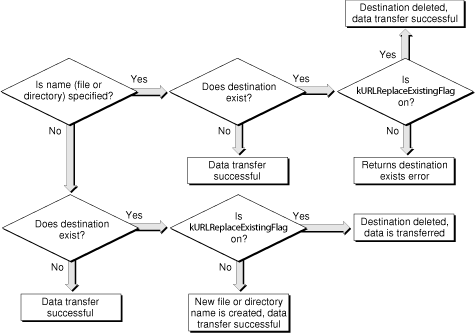

> 导航：[总目录](../../../README.md) · [documentation](../../../_indexes/documentation.md)


[Next](Document%20Revision%20History.md)

# Transferring Data With URL Access Manager

This document describes how to use URL Access Manager to transfer data to and from a network resource specified with a uniform resource locator (URL).

URL Access Manager includes support for:

- Automatic decompression of compressed files
- Automatic file extraction from Stuffit archives (with version 5.0 of Stuffit)
- Firewalls, HTTP proxy servers, and SOCKS gateways

URL Access Manager allows you to use any of the following protocols during download operations: File Transfer Protocol (FTP), Hypertext Transfer Protocol (HTTP), secure Hypertext Transfer Protocol (HTTPS), or the local file protocol (a URL beginning with `file:///` that represents a local file). You could use the local file protocol to test your application on a computer that does not have access to a HTTP or FTP server.

For upload operations, you must use an FTP URL. URL Access Manager allows you to upload data using either anonymous or authenticated FTP sessions and supports both passive and active FTP connections. You can use FTP to download and upload files and directories, as well as to set and obtain URL properties.

If you use HTTP or HTTPS when downloading data, you will be able to perform data transfer with 40-bit RSA encryption, send HTML form information to a URL, and set and obtain URL properties.

URL Access Manager is designed to run in Mac OS 8.6 and later. URL Access Manager is part of Carbon 1.0.2, and is part of the Carbon framework in Mac OS X.

In Mac OS 8 and 9, the implementation of URL Access Manager is stored in a shared library called URL Access. You install it in the Extensions folder in the System Folder. The initial implementation of the data store is a local file.

To use URL Access Manager, you must first make sure that it is installed, and find out which version is installed. Your application can call the functions `URLAccessAvailable` and `URLGetURLAccessVersion` to determine this information.

In order to set and obtain URL properties, you must create a URL reference. To do this, call the function `URLNewReference`. URL Access Manager uses a URL reference to uniquely identify a URL and its associated data to be transferred. When you are finished with a URL, make sure you deallocate its memory by calling the function `URLDisposeReference`.

You can call the functions `URLGetProperty` and `URLSetProperty` to obtain and set information associated with a URL. You must pass the correct data type and size of the property value you wish to set in the `propertyBuffer` parameter of `URLSetProperty`. Before calling these functions, you should call the function `URLGetPropertySize` to determine the size of the buffer to allocate for the property value.

You may wish to call these functions before calling the functions `URLDownload` and `URLUpload` to get and set information associated with the specified URL in the `urlRef` parameter.

Once you have created a URL reference, you can create a function to display the properties of that reference. In [Listing 1-1](#apple-f4xwc4dqnrsv64tfmyxwi33df52wszbpkridimbqgaytanbwfvbuqmrrgawviubsgu), the function `displayProperties` first creates a `propertyList` array of Apple-defined URL properties, obtains the corresponding sizes and values of these properties by calling `URLGetPropertySize` and `URLGetProperty`, respectively, and then displays each property value.

__Listing 1-1__  Displaying the value of each URL property

```
void displayProperties (URLReference urlRef)
{
    OSErr err = noErr;
    int propCount = 0;
    const char* propertyList[21];
    Size propertySize = 0;
    Handle theProperty = NULL;
    propertyList[0]  = kURLURL;
    propertyList[1] = kURLResourceSize;
    propertyList[2] = kURLLastModifiedTime;
    propertyList[3] = kURLMIMEType;
    propertyList[4] = kURLFileType;
    propertyList[5] = kURLFileCreator;
    propertyList[6] = kURLCharacterSet;
    propertyList[7] = kURLResourceName;
    propertyList[8] = kURLHost;
    propertyList[9] = kURLAuthType;
    propertyList[10] = kURLUserName;
    propertyList[11] = kURLPassword;
    propertyList[12] = kURLStatusString;
    propertyList[13] = kURLIsSecure;
    propertyList[14] = kURLCertificate;
    propertyList[15] = kURLTotalItems;
    propertyList[16] = kURLHTTPRequestMethod;
    propertyList[17] = kURLHTTPRequestHeader;
    propertyList[18] = kURLHTTPRequestBody;
    propertyList[19] = kURLHTTPRespHeader;
    propertyList[20] = kURLHTTPUserAgent;

    // Get the size of each property, allocate a handle to store the
    // property’s value, get the property value, and display it.

    for( propCount = 0; propCount < 21; propCount++)
    {
        // Get the size of the property’s value.
        err = URLGetPropertySize (urlRef, propertyList[propCount], &propertySize);
        if(err != noErr)
            printf("Error %d getting property size %s. Size returned was: %d\n", err, propertyList[propCount], propertySize);
        else
            printf("Property size is %d: %s\n", propertySize, propertyList[propCount]);

        // Now get a handle for the property value.
        theProperty = NewHandleClear (propertySize + 1);
        err = MemError();
        if(err != noErr)
            printf("Error %d getting property handle %s\n", err, propertyList[propCount]);
        else
            printf("Got handle for %s\n", propertyList[propCount]);

        // Now get the property’s value.
        err = URLGetProperty (urlRef, propertyList[propCount], *theProperty, propertySize);
        if(err != noErr)
            printf("Error %d getting property %s\n", err, propertyList[propCount]);
        else
            printf("Property %s: %s\n", propertyList[propCount], *theProperty);

        // Clean up.
        DisposeHandle (theProperty);
        printf("\n");
    }
    return;
}
```


URL Access Manager provides four high-level functions for performing simple upload and download operations. These functions are synchronous, meaning that they return control to your application upon completion. If you want more control over the data transfer than these functions afford, see the description of the function `URLOpen` in [Controlling Data Transfer](#apple-f4xwc4dqnrsv64tfmyxwi33df52wszbpkridimbqgaytanbwfvbuqmrrgawviucykjcummjqgq).

To perform simple download operations, you can call the function `URLSimpleDownload` or `URLDownload`. The difference between these functions is that `URLSimpleDownload` takes a character string as the URL, while `URLDownload` takes a URL reference. If you call `URLDownload` and pass a URL reference, you can perform a number of additional operations on the reference, including manipulating and obtaining its properties.

To perform simple upload operations, you can call the function `URLSimpleUpload` or `URLUpload`. Like `URLSimpleDownload`, `URLSimpleUpload` takes a character string as the URL. `URLUpload` takes a URL reference, and like `URLDownload`, allows you to perform additional operations.

You can specify the data transfer options that these functions should use by passing the appropriate bitmask in the openFlags parameter. For upload operations, the options you can specify include whether to replace an existing file, display a progress indicator bar during data transfer operations, display an authentication dialog box if URL Access Manager requires authentication, decode an encoded file and expand it if the Stuffit Engine is installed, specify that URL is a directory, or download a directory listing instead of the contents of a file or directory. For download operations, you can set any of the following masks: `kURLReplaceExistingFlag`, `kURLExpandFileFlag`, `kURLExpandAndVerifyFlag`, `kURLDisplayProgressFlag`, `kURLDisplayAuthFlag`, `kURLIsDirectoryHintFlag`, `kURLDoNotTryAnonymousFlag`, or `kURLDirectoryListingFlag`.

Prior to Mac OS X, if you want update events to be passed to your application while dialog boxes are displayed by any of these functions, you should write your own system event callback function. Pass a pointer to it in the `eventProc` parameter of the appropriate function.

[Figure 1-1](#apple-f4xwc4dqnrsv64tfmyxwi33df52wszbpkridimbqgaytanbwfvbuqmrrgawueq2ginbeqsse) shows a flowchart illustrating the factors that influence the name of your destination file when performing upload and download operations using the functions `URLSimpleDownload`, `URLDownload`, `URLSimpleUpload`, `URLUpload`, and `URLOpen`. These factors include the specification of the name of the destination file or directory, the existence of the destination, and the setting of the `kURLReplaceExistingFlag` mask in the `openFlags` parameter.

For upload operations performed by the functions `URLSimpleUpload`, `URLUpload`, and `URLOpen`, if you want to replace the destination file with the one you passed in the `fileSpec` parameter, set the mask constant `kURLReplaceExistingFlag` in the `openFlags` parameter and do not terminate the destination URL with a “/” character. If you specify a URL that doesn’t end with a “/” character, URL Access Manager assumes that the destination is a file, not a directory.

For downloading, the name of the destination file or directory is considered specified if the name field passed in the `FSSpec` is not empty. For uploading, the name of the destination is considered specified if the path portion of the URL is not terminated by a '/'. If you specify a name that already exists on the server and do not set the mask constant `kURLReplaceExistingFlag`, the function returns the result code `kURLDestinationExistsError`. If you do not specify the name of the destination file, do not set the mask constant `kURLReplaceExistingFlag`, and the destination file already exists on the server, URL Access Manager creates a unique name by appending a number to the original name before the extension, if any. For example, if the URL specifies a file named `file.txt`, `URLOpen` changes the filename to `file1.txt`. If the file exists and the `kURLReplaceExistingFlag` mask is set, then the file being uploaded will replace the contents of the destination file and retain the name of the destination file. For example, if you wanted to upload the file “sari.mov” and replace the contents of the file specified by the URL “ftp://host/path/lisa.mov”, the file “lisa.mov” existed, and that the `kURLReplaceExistingFlag` mask was set, the file “sari.mov” would replace “lisa.mov” and the resulting URL would be “ftp://host/path/lisa.mov”.

__Figure 1-1__  Naming your destination file



URL Access Manager provides the low-level function `URLOpen` for more control over data transfer operations than can be achieved using the high-level functions described in [Performing Simple Data Transfer](#apple-f4xwc4dqnrsv64tfmyxwi33df52wszbpkridimbqgaytanbwfvbuqmrrgawueqkbjjcesr2b). `URLOpen` is an asynchronous function, meaning that it returns control to your application immediately, not upon completion.

When you call `URLOpen` to perform an upload operation, you must specify a valid destination file. For download operations, you do not have to specify a valid destination file.

If you do not specify a valid destination file, there are several functions that you may wish to call to get information about the download operation being performed by `URLOpen`. To retrieve data as it is downloaded, call the function `URLGetBuffer (page 48)`. Note that you cannot retain or modify the retrieved data. You should call `URLGetBuffer` repeatedly until the download is complete. This is marked by a `kURLCompletedEvent` or `kURLErrorOccurredEvent` event, or the state constants `kURLCompletedState` or `kURLErrorOccurredState` returned by the function `URLGetCurrentState`. Between calls to `URLGetBuffer`, you should call the function `URLIdle` to allow time for URL Access Manager to refill its buffers during download operations. After each call to `URLGetBuffer`, you call the function `URLReleaseBuffer)` to prevent URL Access Manager from running out of buffers.

You may wish to call the function `URLGetDataAvailable` to determine the number of bytes remaining to be handed off from URL Access Manager to your application. Calling this function tells you how much data you will obtain by a call to `URLGetBuffer` (that is, how much data is remaining in the buffer of URL Access Manager). This does not include the number of bytes in transit to your buffer, nor does it include the amount of data not yet transferred from URL Access Manager. To calculate the amount of data remaining to be downloaded, pass the name constant `kURLResourceSize` in the `property` parameter of the function `URLGetProperty` and subtract the amount of data copied.

Note that `URLGetBuffer`, `URLReleaseBuffer`, and `URLGetDataAvailable` only provide useful information if you specified an invalid destination file for a download operation performed by `URLOpen`.

You can specify the data transfer options that `URLOpen` should use by passing the appropriate bitmask in the openFlags parameter. For upload operations, the options you can specify to `URLOpen` include whether to replace an existing file, decode an encoded file, specify that URL is a directory, or download a directory listing instead of the contents of a file or directory. For download operations, you can set any of the following masks: `kURLReplaceExistingFlag`, `kURLExpandFileFlag`, `kURLExpandAndVerifyFlag`, `kURLIsDirectoryHintFlag`, `kURLDoNotTryAnonymousFlag`, or `kURLDirectoryListingFlag`.

If you wish to be notified of certain data transfer events, you can write your own data transfer event callback function and pass a pointer to it in the `URLEventMask` parameter of `URLOpen`. The data transfer events that you can receive depend on whether the destination file you specify is valid. In addition, you should pass a bitmask representing the events you wish to be notified of in the `eventRegister` parameter. You can then manipulate the data or write it to the destination of your choice.

The function `URLAbort` terminates a data transfer operation that was started by any function transferring data to or from a URL reference, including `URLDownload`, `URLUpload`, and `URLOpen`. When your application calls `URLAbort`, URL Access Manager changes the state returned by the function `URLGetCurrentState` to `kURLAbortingState` and passes the constant `kURLAbortInitiatedEvent` to your notification callback function. When data transfer is terminated, URL Access Manager changes the state returned by `URLGetCurrentState` to `kURLCompletedState` and passes the constant `kURLCompletedEvent` in the `event` parameter of your notification callback function.

You can use these functions to determine the error code returned when a data transfer operation fails, determine the status of a data transfer operation, yield time so that URL Access Manager can refill its buffers, or get information about a file.

You may want to call the function `URLGetError` when a data transfer operation fails. `URLGetError` passes back the error code associated with the failed transfer, which may be a system error code, a protocol-specific error code, or one of the error codes listed in “URL Access Result Codes”.

If you wish to determine the status of a data transfer operation, you should call the function `URLGetCurrentState`. You may wish to call `URLGetCurrentState` periodically to monitor the status of a download or upload operation.

The function `URLGetFileInfo` obtains the file type and creator codes for a specified filename. The type and creator codes are determined by the Internet configuration mapping table and are based on the filename extension. For example, if you pass the filename `"jane.txt`", `URLGetFileInfo` will return `'TEXT'` in the `type` parameter and `'ttxt'` in the `creator` parameter.

During a call to `URLOpen`, data transfer events are generated after:

- `URLOpen` has been called but the location specified by the URL reference has not yet been accessed.
- The location specified by the URL reference has been accessed and is valid.
- A download operation is in progress.
- A data transfer operation has been aborted.
- All operations associated with a call to `URLOpen` have been completed.
- An error occurred during data transfer.
- Data is available in buffers.
- A download operation is complete because there is no more data to retrieve from buffers.
- An upload operation is in progress.
- A system event has occurred.
- The size of the data being downloaded is known.
- A time interval of approximately one quarter of a second has passed.
- A property such as a filename has become known or changed.

If you want to be notified of data transfer events, pass a Universal Procedure Pointer (UPP) to your notification callback function in the `notifyProc` parameter of `URLOpen`. To create a UPP to your notification callback, you must call the function `NewURLNotifyUPP`. You must also specify which data transfer events you want to receive as a bitmask in the `eventRegister` parameter of `URLOpen`. You can then manipulate the data or write it to the destination of your choice.

Your application’s notification callback function should process the event record passed by URL Access Manager in the `event` parameter and return 0. The only restriction that URL Access Manager imposes on the functionality of your notification callback function is that it should not call the function `URLDisposeReference`. For information on how to write a notification callback, see `URLNotifyProcPtr`.

Prior to Mac OS X, if you want update events to be passed to your application while a dialog box is displayed by the functions `URLSimpleDownload`, `URLDownload`, `URLSimpleUpload`, and `URLUpload`, you should write your own system event callback function. (In Mac OS X, this is not necessary, since all dialog boxes are moveable). In order for these functions to display a dialog box, you must set the mask constant `kURLDisplayProgressFlag` or `kURLDisplayAuthFlag` in the bitmask passed in the `openFlags` parameter. If you write your own callback to handle update events in these dialog boxes, you should pass a Universal Procedure Pointer (UPP) to your callback in the `eventProc` parameter of these functions. Call the function `NewURLSystemEventUPP` to create a UPP to your callback function.

If you do not create a callback function to handle update events when a dialog box is displayed, these functions will display a nonmovable modal dialog box when warranted.

You can use AppleScript to call URL Access Manager functions. If your AppleScript application uses URL Access Manager for operations that may take a substantial amount of time, such as transferring large amounts of data over a low-speed connection, be sure to set the timeout to a large value. Setting the timeout to a large value, such as 60,000 seconds, will avoid unnecessary AppleEvent errors.

For information about the standard scripting addition commands distributed with AppleScript, see the AppleScript section of the Mac OS Help Center, or visit the [AppleScript](http://www.apple.com/applescript) website.

This section describes how the sample application `SamplePost` posts information to an HTTP URL and download the URL’s response using URL Access Manager function `URLDownload`.

[Listing 1-2](#apple-f4xwc4dqnrsv64tfmyxwi33df52wszbpkridimbqgaytanbwfvbuqmrrgawviubrgu) shows the header file for the application, `SamplePost.h`, which contains definitions of the URL from which data is to be downloaded (`kSampleURL`) and the structure `urlDownInfo`, as well as declarations of the function `DoSamplePost`, which calls `URLDownload`, and a system event callback function, `MyURLCallbackProc`, which is a place holder for code that handles system events that occur during the download.

__Listing 1-2__  SamplePost.h

```
#define kSampleURL"http://www.internic.net/cgi-bin/itts/whois"

typedef struct urlDownInfo {
    URLReference urlRef;
    FSSpec * destination;
    Handle destinationHandle;
    URLOpenFlags openFlags;
    URLSystemEventProcPtr eventProc;
    void * userContext;
    Boolean done;
    OSStatus errorCode;
} URLDownloadInfo;

typedef struct urlDownInfo *URLDownInfoPtr;

static void DoSamplePost();
pascal OSStatus MyURLCallbackProc (void*, EventRecord *);
```

SamplePost is a multi-threaded application. As a result, in [Listing 1-3](#apple-f4xwc4dqnrsv64tfmyxwi33df52wszbpkridimbqgaytanbwfvbuqmrrgawviubrgy), SamplePost’s main function calls the Memory Manager functions `MaxApplZone` and `MoreMasters` in its main function. Note that all URL Access Manager functions are threaded with Thread Manager cooperative threads. These threads are nonreentrant on PowerPC.

__Listing 1-3__  SamplePost initialization

```c
#include <stdio.h>
#include <Events.h>
#include <Threads.h>
#include <Processes.h>
#include <Files.h>
#include "URLAccess.h"
#include "SamplePost.h"

int main (void)
{
    OSStatus err = noErr;
    // Call MaxAppleZone() when using the Thread Manager.
    MaxApplZone();
    for (i = 0; i < 20; i++) {
        MoreMasters();
    }
```

[Listing 1-4](#apple-f4xwc4dqnrsv64tfmyxwi33df52wszbpkridimbqgaytanbwfvbuqmrrgawviubrg4) shows `SamplePost` calling the function`URLAccessAvailable` to verify that URL Access Manager is available. If URL Access Manager is available, `DoSamplePost` is called.

__Listing 1-4__  Verifying the availability of URL Access Manager

```
    // Make sure URL Access Manager is available.
    if ( URLAccessAvailable()) {
        DoSamplePost();
    }
    else {
        // Call error handling function.
    }
```

In [Listing 1-5](#apple-f4xwc4dqnrsv64tfmyxwi33df52wszbpkridimbqgaytanbwfvbuqmrrgawviubrha), `DoSamplePost` defines a `URLDownloadInfo` structure named `myRef` that is uses to store information for calling `URLDownload`. The `DoSamplePost` function then calls `NewHandle` to allocate the memory in which the downloaded information will be stored, creates a URL reference, and stores it in `myRef.urlRef`.

__Listing 1-5__  Allocating memory and creating a URL reference

```
OSStatus err = noErr;
static void DoSamplePost (void) {
    ThreadID threadID = 0;
    URLDownloadInfo myRef;
    Handle downloadHandle = NULL;
    long downloadSize = 0;

    downloadHandle = NewHandle(0);
    if ( downloadHandle == NULL) {
        // Call error handling function.
    }
    //  Create a URLReference
    err = URLNewReference( kSampleURL, &myRef.urlRef );
    if ( err != noErr) {
        // Call error handling function.
}
```

As shown in `[Listing 1-6](#apple-f4xwc4dqnrsv64tfmyxwi33df52wszbpkridimbqgaytanbwfvbuqmrrgawueq2gjbbecsck)`, `DoSamplePost` calls the function `URLSetProperty` to set the HTTP request method property value to the 4-byte string `"POST"` and the value of the HTTP request body property value to the 19-byte string `"whois_nic=apple.com"`. When you set the property identified by `kURLHTTPRequestBody`, URL Access Manager automatically adds the length of the value identified by `kURLHTTPRequestHeader` to the request, so you do not need to set the request header explicitly.

__Listing 1-6__  Setting URL properties

```
URLSetProperty (myRef.urlRef, kURLHTTPRequestMethod, "POST", 4);
URLSetProperty (myRef.urlRef, kURLHTTPRequestBody, "whois_nic=apple.com", 19);
```

Next, `DoSamplePost` uses the remaining fields of the `myRef` structure to store values that will be used as parameters for calling `URLDownload`.

- `DoSamplePost` sets `myRef.destination` to `NULL`. When `NULL` is provided as the destination parameter to the `URLDownload`, the calling application indicates that the downloaded data is not going to be written to a file on disk.
- `DoSamplePost` sets `myRef.destinationHandle` to the value of `downloadHandle`, which is the location in memory at which the downloaded data is to be stored.
- `DoSamplePost` sets `myRef.OpenFlags` to `kURLDisplayProgressFlag`. When the value of the `openFlags` parameter to `URLDownload` is `kURLDisplayProgressFlag`, `URLDownload` displays a progress indicator during the download process. You may wish to provide a system event callback function to handle system events that occur.
- `DoSamplePost` sets `myRef.eventProc` to the address of the SamplePost application’s system event callback function. When `DoSamplePost` calls `URLDownload`, it will specify `myRef.eventProc` as the `eventProc` parameter. If a system event occurs while the progress indicator is displayed, URL Access Manager will call the function specified by the `eventProc` parameter and will pass to it the value of the `userContext` parameter, which is described next.
- `DoSamplePost` sets `myRef.userContext` to point to `myref`. When `DoSamplePost` calls `URLDownload`, it will specify `myRef.userContext` as the `userContext` parameter. Your application can use the user context to set up its context when the system event callback function is called.

`[Listing 1-7](#apple-f4xwc4dqnrsv64tfmyxwi33df52wszbpkridimbqgaytanbwfvbuqmrrgawueq2gi5auksce)` illustrates setting these values.

__Listing 1-7__  Setting the URLDownload parameters

```
myRef.destination = NULL;
myRef.destinationHandle = downloadHandle;
myRef.openFlags = kURLDisplayProgressFlag;
myRef.eventProc = &MyURLCallbackProc;
myRef.userContext = &myRef;
myRef.errorCode = 0;
```

Once the URL reference has been created, its properties set, and the parameters for `URLDownload` prepared, `DoSamplePost` is ready to call `URLDownload`, as shown in [Listing 1-8](#apple-f4xwc4dqnrsv64tfmyxwi33df52wszbpkridimbqgaytanbwfvbuqmrrgawviubrhe). If the download is successful, `DoSamplePost` calls the function `URLGetProperty` to obtain the size of the downloaded data using the `downloadSize` parameter.

__Listing 1-8__  Calling the URLDownload function

```
err = URLDownload (
    myRef.urlRef,
    myRef.destination,
    myRef.destinationHandle,
    myRef.openFlags,
    myRef.eventProc,
    myRef.userContext);

myRef.errorCode = err;
if (  myRef.errorCode != noErr) {
    // Call error handling function.
}
else {
    // Successful download. Get the size of the downloaded data.
    err = URLGetProperty(myRef.urlRef, kURLResourceSize, &downloadSize, 4);
if ( err != noErr) {
    // Call error handling function.
}
```

In [Listing 1-9](#apple-f4xwc4dqnrsv64tfmyxwi33df52wszbpkridimbqgaytanbwfvbuqmrrgawviubsga)`DoSamplePost` calls `SetHandleSize` to set the size of `downloadHandle` to `downloadSize + 1` and sets the value of the last byte of downloaded data to `NULL`. DoSamplePost calls `printf` to display the data, and concludes by disposing of the URL reference.

__Listing 1-9__  Displaying the downloaded data

```
downloadSize = GetHandleSize(downloadHandle);
SetHandleSize(downloadHandle, (downloadSize+1));
(*myRef.destinationHandle)[downloadSize] = NULL;
printf( "<•>==================== Downloaded Data ==================\n" );
printf( "%s", *myRef.destinationHandle );
DisposeHandle(downloadHandle);
URLDisposeReference(myref.urlRef);
```

[Listing 1-10](#apple-f4xwc4dqnrsv64tfmyxwi33df52wszbpkridimbqgaytanbwfvbuqmrrgawviubsge) shows a placeholder for SamplePost’s system event callback function. The `userContext` parameter can be used to associate any particular call of `URLDownload` with any particular call of the system event callback function.

__Listing 1-10__  SamplePost’s system event callback function

```
pascal OSStatus MyURLCallbackProc (void *userContext, EventRecord *event)
{
    printf("<•>System callback thread fired! Thread: %u\n", userContext);
    return 0;
}
```


This section describes how the sample application Downloader downloads data from multiple URLs and stores it in multiple files using URL Access Manager function U`RLDownload`. Downloader obtains the URLs to be downloaded by reading a text file in which they have been stored.

[Listing 1-11](#apple-f4xwc4dqnrsv64tfmyxwi33df52wszbpkridimbqgaytanbwfvbuqmrrgawviubsgi) illustrates how Downloader’s main function sets up the main event loop and calls the function `getURL` to obtain a URL from a file of URLs.

__Listing 1-11__  The Downloader application’s main function

```c
#include <Events.h>
#include <stdio.h>
#include "URLAccess.h"
#include "string.h"
#include "Memory.h"

void main (void) {
    OSStatus err = noErr;
    char url[255];
    int count, fileCount = 0;
    EventRecord ev;

    // Call MaxApplZone, MoreMasters.
    // Initialize graphics port, fonts, menus, cursor, and dialogs.
    // Clear the screen.

    while ( url != NULL )
    {
        // Handle Events through each loop
        WaitNextEvent(everyEvent, &ev, 0, NULL);
        eventHandler( NULL, &ev );

        // Obtain a URL from the file of URLs
        result = getURL (url); // getURL function not shown
        if (result == eofErr) { // Handle error condition. }

        // Call Download function.
        result = DoDownload (url);
        if (result != noErr) { // Handle error condition. }
    }
    printf("\n All of the URLs have been downloaded.\n");
}
```

The `DoDownload` function shown in [Listing 1-12](#apple-f4xwc4dqnrsv64tfmyxwi33df52wszbpkridimbqgaytanbwfvbuqmrrgawviubsgm) does the actual work of downloading data from the URL. It creates a file specification for the data that is to be downloaded and a URL reference. It specifies the mask `kURLReplaceExistingFlag` in the `openFlags` parameter to replace an existing file (if any) with the downloaded data and to display a progress indicator during the download. Finally, it calls the function `URLDownload` to download the data.

__Listing 1-12__  Downloader’s `DoDownload` function

```
void DoDownload (void) {
    URLReference urlRef;
    FSSpec dest, *destPtr = NULL;
    destPtr = &dest;
    Handle destHandle = NULL;
    int openFlags = kURLReplaceExistingFlag + kURLDisplayProgressFlag;
    Str255 newFile;

    // Create the file specification for the download.
    sprintf((char*)newFile, "File %d", fileCount);
    c2pstr((char*)newFile);
    fileCount++;
    err = FSMakeFSSpec(0, 0, newFile, &dest);

    // Create the URLReference.
    err = URLNewReference( theURL, &urlRef );
    if (err != noErr) printf("URLNewReference failed\n");

    // Download the data.
    err = URLDownload( urlRef, destPtr, destHandle, openFlags, &eventHandler,
        (void*)&fileCount );
    if (err != noErr) printf("URLDownload failed\n");

    // Clean up.
    err = URLDisposeReference( urlRef );
    if (err != noErr) printf("URLDisposeReference failed\n");
    return err;
}
```

Listing 1-13 illustrates Downloader’s general event handling function `eventHandler`. This function handles system events that might occur during calls to the functions `URLSimpleDownload`, `URLDownload`, `URLSimpleUpload`, and `URLUpload`. The `userContext` parameter can be used to associate any particular call of `URLDownload` with any particular call of the system event callback function. In this context, it is an integer.

__Listing 1-13__  Downloader’s system event callback function

```swift
pascal long eventHandler (void * userContext, EventRecord* eventPtr)
{
    EventRecord* ev;
    int what = 0;
    int context = 0;
    int* intPtr = NULL;

    // Convert the event pointer into an event record.
    ev = (EventRecord*)eventPtr;
    what = ev->what;

    // Convert the void* to an integer.
    intPtr = (int*)userContext;
    context = *intPtr;
    if (context < 0 || context > 99) {
        context = -1; // Unknown context
    }

    switch (what) {
        case 0 : // Null Event
            break;
        case mouseDown:
            printf("Handler: mouseDown  User Context: %d\n", context);
            // Call function to handle event.
            break;
        case updateEvt:
            printf("Handler: updateEvt  User Context: %d\n", context);
            // Call function to handle event.
            break;
        case activateEvt:
            printf("Handler: activateEvt  User Context: %d\n", context);
            // Call function to handle event.
            break;
        case keyDown:
            printf("Handler: keyDown  User Context: %d\n", context);
            // Call function to handle event.
            break;
        default:
            printf("Handler: Default  User Context: %d\n", context);
            break;
    }

    return NULL;
}
```


These documents in the ADC Reference Library contain additional information about URL Access Manager:

- _URL Access Manager Reference_ describes the URL Access Manager API through version 2.0.3, including functions, data types, constants, and result codes.
- The example application _URLAccessSample_ incorporates most of the URL Access Manager API. It demonstrates simple calls like `URLDownload` and `URLUpload`, as well as asynchronous calls using `URLOpen`. It also shows how to POST to a HTTP server.

[Next](Document%20Revision%20History.md)

