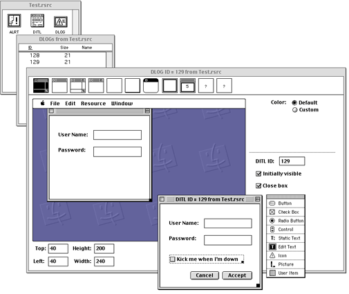
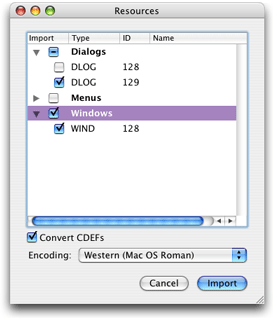
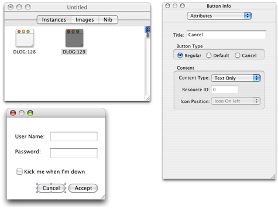
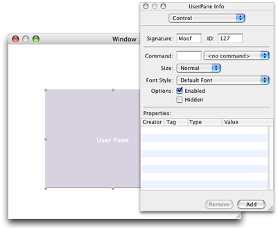
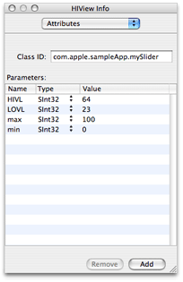

> 导航：[总目录](../../../README.md) · [documentation](../../../_indexes/documentation.md) · [Upgrading to the Mac OS X HIToolbox](Introduction%20to%20Upgrading%20to%20the%20Mac%20OS%20X%20HIToolbox.md)


[Next](A%20Porting%20Example-%20Converting%20a%20User%20Item%20to%20a%20Custom%20View.md)[Previous](The%20Modern%20Advantage.md)

# Porting Steps

This chapter focuses on the steps required to modernize your user interface code, moving your application to views and composited windows. The following sections describe the porting process:

- [Convert Resources to Nibs](#apple-f4xwc4dqnrsv64tfmyxwi33df52wszbpkridgmbqgaytcnbqfvbuqmrqgmwueqkcjbcugr2f): Part of this process is to move away from old Dialog Manager calls.
- [Adopt Carbon Events](#apple-f4xwc4dqnrsv64tfmyxwi33df52wszbpkridgmbqgaytcnbqfvbuqmrqgmwueqkcizauqrcc): If you are still using `WaitNextEvent`, now is the time to move to the more efficient Carbon event model.
- [Put Custom Content Into Views](#apple-f4xwc4dqnrsv64tfmyxwi33df52wszbpkridgmbqgaytcnbqfvbuqmrqgmwueqkcinbueskk): If you have nonstandard controls or content, you may need to implement your own views.
- [Turn On Compositing](#apple-f4xwc4dqnrsv64tfmyxwi33df52wszbpkridgmbqgaytcnbqfvbuqmrqgmwueqkcjjcucr2i): Only composited windows gain the full benefits of using HIViews.
- [Additional Steps](#apple-f4xwc4dqnrsv64tfmyxwi33df52wszbpkridgmbqgaytcnbqfvbuqmrqgmwueqkcirbussch): These steps are miscellaneous changes resulting from moving to HIViews, such as translating graphics coordinates.

Before you begin adopting views, you should be familiar with the contents of _[HIView Programming Guide](../HIView%20Programming%20Guide/Introduction%20to%20HIView%20Programming%20Guide.md#apple-f4xwc4dqnrsv64tfmyxwi33df52wszbpkridgmbqgaydsmrt)_. This document outlines the concepts behind HIView, how the older control, windows, and menus map to the HIView world, and gives examples of implementing views. You should examine all your windows and menus to estimate the changes that would be required to adopt HIView. In most cases, the more you rely on standard user interface elements, the easier the porting process. You can choose to port on a window-by-window basis, as time and resources permit.

If you have custom controls, check to see if their functionality is now available in a standard control or view. For example, in the past combining an editable text field with an integral pop-up menu required custom code; now you can simply create an HIView-based combo box to gain the same functionality. Adopting other views, such as the scroll view, might help to reduce or eliminate large chunks of legacy code.

If you have legacy Mac OS code, many of your windows, controls, and menus are likely stored as resources. Similarly, you may be relying on the Dialog Manager to handle many of your windows. In both cases, in order to prepare your application for views and composited windows, you must move from resource-based interface elements to Interface Builder nibs.

Nibs provide an XML-based description for windows, controls, and menus. You create and manipulate them using the Interface Builder tool in Xcode. Interface Builder provides a simple graphical interface for building user interfaces, in which you can simply drag interface elements around to build menus, dialogs, and so on. If you are not familiar with Interface Builder, the Designing a User Interface section in _[A Tour of Xcode](../../Developer%20Tools/A%20Tour%20of%20Xcode/Introduction.md#apple-f4xwc4dqnrsv64tfmyxwi33df52wszbpkridgmbqgaydqojq)_ is a good introduction.

For Mac OS X v10.3 and later, Interface Builder (version 2.4) allows you to import older compiled resource files (`.rsrc`) files, converting them automatically into nibs. In some ways, Interface Builder is like a more modern, advanced version of the ResEdit resource editor ([Figure 3-1](#apple-f4xwc4dqnrsv64tfmyxwi33df52wszbpkridgmbqgaytcnbqfvbuqmrqgmwugrkdi5demskk)).

__Figure 2-1__  A dialog resource in ResEdit



To import a file, simply choose Import Resource File from the Import submenu of the File menu and choose your file from the resulting dialog window. Selecting a `.rsrc` file brings up a resource selection dialog as shown in [Figure 3-2](#apple-f4xwc4dqnrsv64tfmyxwi33df52wszbpkridgmbqgaytcnbqfvbuqmrqgmwueqkcineecrke).

You can choose to import some or all of the resources contained in your `.rsrc` file. You can import any of the standard `'WIND'`, `'DLOG'`, and `'MENU'` resources. Note that if your `'DLOG'` resource uses an item list (`'DITL'`) resource, Interface Builder automatically imports items in the list into the dialog window.

__Figure 2-2__  The resource selection dialog window



You should check the windows, controls, and menus to make sure that they were imported correctly. Note that in a nib file, dialog resources simply become windows, and any dialog items are translated into controls ([Figure 3-3](#apple-f4xwc4dqnrsv64tfmyxwi33df52wszbpkridgmbqgaytcnbqfvbuqmrqgmwugrkdjjeeqrsb)). Because of this mapping, you will probably need to update any Dialog Manager calls. See [Update Dialog Manager Functions](#apple-f4xwc4dqnrsv64tfmyxwi33df52wszbpkridgmbqgaytcnbqfvbuqmrqgmwugrkdjfduesch) for more information.

__Figure 2-3__  A dialog resource imported into Interface Builder



Some tips:

- The Info window in Interface Builder lets you choose Default and Cancel behavior for simple push buttons. Specifying these behaviors also enables the keyboard shortcuts (that is, Esc for Cancel, and Return or Enter for the default), so you do not need to handle them yourself.
- Be sure to specify the window class and theme brush for each window you import using the Info window. Doing so ensures that your window has the look appropriate to its type.

In addition, you should be aware of the following changes:

- If your resources used custom controls, the nib replaces them with generic custom control placeholders. While the Info window shows that you can use a procedure pointer–based custom definition, you should convert your control to an event-based HIView. Note that if you use HIView-based controls, you need to replace the custom control placeholder with the HIView placeholder.
- All user items are translated into user panes. Depending on what you used the user item for, you probably want to change this to a different control. For example, if you used it to visually group several controls, you should replace it with a group box. For simple static images and drawing, you can simply add `kEventControlDraw` handlers to the user pane that Interface Builder substituted for your item. More complex user items may need to be reimplemented as custom views. See [Put Custom Content Into Views](#apple-f4xwc4dqnrsv64tfmyxwi33df52wszbpkridgmbqgaytcnbqfvbuqmrqgmwueqkcinbueskk) for more information.
- Modern windows and controls are based on a hierarchy, which means that some controls may be embedded in others. If your old resources did not use hierarchies, you should update the resulting nib file appropriately. For example, if you used a user item to group controls, you should replace the user item with a group box and then embed the controls within the group box. In Interface Builder, dragging a control into the bounds of the group box embeds it automatically.

Note that window resources imported into Interface Builder do not automatically become Aqua compliant; if you have not already done so, you will probably have to reposition, resize, or otherwise tweak controls, text, and so on, to conform to _Apple Human Interface Guidelines_. While this may seem like an afterthought, taking the extra time to adjust your windows now pays off in a better overall user experience.

Next, you need to update your application code to load the user interface elements from the nib. Note that you need to place the nib file in the Resources folder of your application’s bundle.

[Listing 3-1](#apple-f4xwc4dqnrsv64tfmyxwi33df52wszbpkridgmbqgaytcnbqfvbuqmrqgmwueq2jijbuirsc) shows how you would load a menu bar from a nib file.

__Listing 2-1__  Creating a menu bar from a nib file

```
OSStatus err;
IBNibRef theNib;

err = CreateNibReference (CFSTR(“MyGuitar”), &theNib); // 1
if (!err)
    {
    SetMenuBarFromNib (theNib, CFSTR(“GuitarMenu”)); // 2
    DisposeNibReference (theNib); // 3
    }
```

Here is what the code does:

1. The Interface Builder Services function `CreateNibReference` creates a nib reference that points to the specified file. In this case, the file is `MyGuitar.nib` (you don’t need to specify the `.nib` extension when calling this function). The `CFSTR` macro converts the string into a Core Foundation string, which is the format that `CreateNibReference` expects.
2. The Interface Builder Services function `SetMenuBarFromNib` uses the nib reference to access a menu bar within the nib file. The name of the menu bar (`GuitarMenu` in this example) is the name you assigned to it in the Instances pane of the nib file window. Like the `CreateNibReference` function, `SetMenuBarFromNib` expects a Core Foundation string for the menu bar name, so it must first be converted using `CFSTR`.

   Note that `SetMenuBarFromNib` automatically sets the menu bar you specified to be visible. If for some reason you want to create a menu bar but don’t want it to be immediately visible, you can call `CreateMenuBarFromNib`. You can then call `SetMenuBar` to make it the main menu bar.

   If you want to load individual menus, you can call the Interface Builder Services function `CreateMenuFromNib` after you create the nib reference.
3. When you no longer need the nib reference, you should call the Interface Builder Services function `DisposeNibReference` to remove it.

Creating a window from a nib file is similar, except that you call `CreateWindowFromNib`, as shown in [Listing 3-2](#apple-f4xwc4dqnrsv64tfmyxwi33df52wszbpkridgmbqgaytcnbqfvbuqmrqgmwugrkdjbcemssh).

__Listing 2-2__  Creating a window from a nib file

```
OSStatus err;
IBNibRef theNib;
WindowRef theWindow;

err = CreateNibReference (CFSTR(“MyGuitar”), &theNib);
if (!err)
    {
    CreateWindowFromNib (theNib, CFSTR(“GuitarPrefs”), &theWindow);
    if (theWindow != NULL) ShowWindow(theWindow);

    DisposeNibReference (theNib);
    }
```

The window is hidden when first created, so you need to call `ShowWindow` to make it visible. Any controls embedded in the window are automatically created and laid out at the same time.

After instantiation, you have a valid window or menu reference that your application can then use to perform other actions (obtain the menu ID, add menu items, and so on). In many cases, your existing code should just work once you’ve created your user interface elements from the nib file.

Most Dialog Manager functions were based on the old resource-based method of creating windows. To ensure compatibility with composited windows, you should replace your Dialog Manager calls with more modern equivalents. If you updated dialog resources to use nibs, you must change some Dialog Manager calls. Here are a few guidelines to keep in mind:

- Calls that manipulate dialogs are typically replaced by Window Manager equivalents. Nib files do not distinguish between windows and dialogs.
- Calls that manipulate dialog items are replaced by their Control Manager or HIView equivalents.
- Event management in dialogs is now handled through Carbon events. Any event filtering callbacks must be replaced by the appropriate Carbon event handlers. See [Event Filtering](#apple-f4xwc4dqnrsv64tfmyxwi33df52wszbpkridgmbqgaytcnbqfvbuqmrqgmwueqkcinbuqrkd) for more infomation.
- If you have simple alert dialogs, you may use `CreateStandardAlert` rather than implement it in a nib file. See [Standard Alerts](#apple-f4xwc4dqnrsv64tfmyxwi33df52wszbpkridgmbqgaytcnbqfvbuqmrqgmwugrkdinauuqsd). You can also programmatically create simple sheets for documents windows, as described in [Sheets](#apple-f4xwc4dqnrsv64tfmyxwi33df52wszbpkridgmbqgaytcnbqfvbuqmrqgmwueqkciveukrkd).

The only Dialog Manager functions still recommended are those that handle standard alerts and sheets.

[Table 3-1](#apple-f4xwc4dqnrsv64tfmyxwi33df52wszbpkridgmbqgaytcnbqfvbuqmrqgmwugrkdjbbekrsb) lists a number of common Dialog Manager calls and their replacements.

__Table 2-1__  HIView-savvy Dialog Manager replacements

| Dialog Manager function | HIView replacement |
| `AppendDITL` or `AppendDialogItemList` | `HIViewAddSubview` |
| `CountDITL` | Control Manager: `CountSubControls` with the root control as parent. |
| `FindDialogItem` | `HIViewFindByID` |
| `GetDialogItem` | `HIViewFindByID`. Note that when importing dialog resources into Interface Builder, dialog items are converted into controls with an ID number corresponding to the item index. For example, dialog item 1 turns into a control with control ID 1. However, the signature field is left blank, so you should set this to be your application’s signature.  If desired, you can also use the Control Manager function `GetIndexedSubControl` |
| `SetDialogItem` | Varies depending on what you want to do.  • If you want to set an application-defined drawing function , you should install a drawing handler on a user pane control. See [Put Custom Content Into Views](#apple-f4xwc4dqnrsv64tfmyxwi33df52wszbpkridgmbqgaytcnbqfvbuqmrqgmwueqkcinbueskk).  • If you want to set control bounds, use `HIViewSetFrame` on the view reference.  •If you want to actually change the control type, you should create one of each type you want to display and enable/disable/show/hide them appropriately. For example, if you used `SetDialogItem` to change an edit text control to a static one , you should create one of each control with the same bounds. To switch, you would disable and hide one while enabling and showing the other. |
| `RemoveDialogItem` and `ShortenDITL` | Control Manager: `DisposeControl` or `HIViewRemoveFromSuperview`. One advantage of using `HIViewRemoveFromSuperview` is that you still retain the view, so you can embed it elsewhere later. |
| `HideDialogItem` or `ShowDialogItem` | `HIViewSetVisible` |
| `InsertDialogItem` | `HIViewAddSubview` |
| `Alert`, `StandardAlert`, `StopAlert`, `NoteAlert`, `CautionAlert`, `GetAlertStage` and `ResetAlertStage` | Convert alerts to use `CreateStandardAlert` instead. See [Standard Alerts](#apple-f4xwc4dqnrsv64tfmyxwi33df52wszbpkridgmbqgaytcnbqfvbuqmrqgmwugrkdinauuqsd). |
| `GetNewDialog` | Interface Builder Services: `CreateWindowFromNib` with appropriate nib file. |
| `NewFeaturesDialog`, `NewDialog`, and `NewColorDialog` | Window Manager: `CreateNewWindow` |
| `CloseDialog` | Not supported in Carbon. Use `DisposeWindow`. |
| `DisposeDialog` | Window Manager: `DisposeWindow` |
| `DrawDialog` and `UpdateDialog` | Draw from within `kEventControlDraw` handlers only. Do not draw from window drawing or window update handlers. |
| `GetDialogItemAsControl` | Control Manager: `GetIndexedSubControl` or `HIViewFindByID`. |
| `GetModalDialogEventMask` and `SetModalDialogEventMask` | No longer needed. Events are filtered by registering for specific Carbon events. |
| `ModalDialog` | Carbon Event Manager: `RunAppModalLoopForWindow` on the window you want to be application modal. See _[Carbon Event Manager Programming Guide](../Carbon%20Event%20Manager%20Programming%20Guide/Introduction%20to%20Carbon%20Event%20Manager%20Programming%20Guide.md#apple-f4xwc4dqnrsv64tfmyxwi33df52wszbpkridgmbqgaydsobz)_ for more details. |
| `New/Invoke/DisposeUserItemUPP` | User items typically replaced by standard or custom views. |
| `New/Invoke/DisposeModalFilterUPP` and `New/Invoke/DisposeModalFilterYUPP` | Event filters not needed in Mac OS X. Use Carbon events instead. See [Event Filtering](#apple-f4xwc4dqnrsv64tfmyxwi33df52wszbpkridgmbqgaytcnbqfvbuqmrqgmwueqkcinbuqrkd) for more information. |
| `DialogSelect` and `IsDialogEvent` | No longer needed. Events are filtered by registering for specific Carbon events. See [Event Filtering](#apple-f4xwc4dqnrsv64tfmyxwi33df52wszbpkridgmbqgaytcnbqfvbuqmrqgmwueqkcinbuqrkd) for more information. |
| `ParamText` and `GetParamText` | Control Manager: `GetControlData` with the `kControlStaticTextCFStringTag` tag. |
| `GetDialogItemText` and `SetDialogItemText` | Control Manager: `GetControlData` or `SetControlData` with the `kControlEditTextCFStringTag` or `kControlStaticTextCFStringTag` tag. |
| `SelectDialogItemText` | Control Manager: `SetControlData` with the `kControlEditTextSelectionTag` tag. |
| `DialogCut`, `DialogCopy`, `DialogPaste`, and `DialogDelete` | No longer needed. The standard window event handler handles these actions for you. |
| `SetDialogCancelItem`, `GetDialogCancelItem`, `SetDialogDefaultItem`, and `GetDialogDefaultItem` | Carbon Event Manager: `GetWindowDefaultButton`, `SetWindowDefaultButton`, `GetWindowCancelButton`, `SetWindowCancelButton`. You can also set Default and Cancel buttons in nib file. In most cases, you should set the command ID for the button to `kHICommandOK` (Default) or `kHICommandCancel` (Cancel) so that you can handle the command event. |
| `GetDialogKeyboardFocusItem` | Control Manager: `GetKeyboardFocus` on the appropriate window. |
| `SetDialogTracksCursor` | The preferred method is to use mouse-tracking regions (as described in _[Carbon Event Manager Programming Guide](../Carbon%20Event%20Manager%20Programming%20Guide/Introduction%20to%20Carbon%20Event%20Manager%20Programming%20Guide.md#apple-f4xwc4dqnrsv64tfmyxwi33df52wszbpkridgmbqgaydsobz)_) and change your cursor based on mouse-entered and mouse-exited events. However, you can also register for the `kEventMouseMoved` event and change the cursor according to its position. |
| `MoveDialogItem` | `HIViewMoveBy` or `HIViewPlaceInSuperviewAt`. |
| `SizeDialogItem` | `HIViewSetFrame`. |
| `AutoSizeDialog` | Control Manager: Use `GetBestControlRect` on text fields that need to be autosized. |
| `GetDialogTimeout` and `SetDialogTimeout` | Use Carbon event timers instead. See _[Carbon Event Manager Programming Guide](../Carbon%20Event%20Manager%20Programming%20Guide/Introduction%20to%20Carbon%20Event%20Manager%20Programming%20Guide.md#apple-f4xwc4dqnrsv64tfmyxwi33df52wszbpkridgmbqgaydsobz)_ for more details. |
| `GetDialogWindow` | Not needed in most cases, because the dialog is now a window. However, `CreateStandardSheet` creates a dialog reference,which you must convert to type `WindowRef` using this function when passing it to `ShowSheetWindow`. |
| `GetDialogPort` | Window Manager: `GetWindowPort`. However, you should consider using Quartz rather than QuickDraw. |
| `GetDialogTextEditHandle` | Control Manager: `GetControlData` with the `kControlEditTextTEHandle` on the focused edit text control. However, TextEdit is not recommended, so in most cases, you should upgrade to the Unicode edit text control. |
| `CreateStandardSheet` | Still supported. See [Sheets](#apple-f4xwc4dqnrsv64tfmyxwi33df52wszbpkridgmbqgaytcnbqfvbuqmrqgmwueqkciveukrkd) for more details. |
| `CreateStandardAlert` | Still supported. See [Standard Alerts](#apple-f4xwc4dqnrsv64tfmyxwi33df52wszbpkridgmbqgaytcnbqfvbuqmrqgmwugrkdinauuqsd) for more details. |

If you have event filters for your dialogs, you should remove them when you convert to nibs. In most cases, any action the user takes on a control (clicking it, entering text, sliding a thumb) invokes Carbon events. Thus, registering to receive particular events and then handling them in the application essentially substitutes for dialog event filtering.

When you want to filter keyboard input to, say, a Unicode edit text field, you should install a control key filter on the control. For example, say you had event filtering–code in your dialog to allow only numbers in an edit text field, as shown in [Listing 3-3](#apple-f4xwc4dqnrsv64tfmyxwi33df52wszbpkridgmbqgaytcnbqfvbuqmrqgmwueqkcivduqrcf).

__Listing 2-3__  Filtering keyboard input from a dialog event filter

```swift
Boolean MyOldDialogFilter(DialogRef theDialog,
                        EventRecord *theEvent, DialogItemIndex *itemHit)
    {
    if ((theEvent->what == keyDown) || (theEvent->what == autoKey))
        {
        char c = (theEvent->message & charCodeMask);

        // return or enter key?
        if ((c == kReturnCharCode) || (c == kEnterCharCode))
            {
            *itemHit = 1;
            return true;
            }

        // tab key or arrow keys?
        if (c == kTabCharCode) return false;
        if (c == kLeftArrowCharCode) return false;
        if (c == kRightArrowCharCode) return false;
        if (c == kUpArrowCharCode) return false;
        if (c == kDownArrowCharCode) return false;

        // digits only for edittext box item #9 ?
        // pre-Carbon, this would have been:
        // ((DialogPeek)theDialog)->editField+1 == 9
        if (GetDialogKeyboardFocusItem(theDialog) == 9)
            {
            if ((c < '0') || (c > '9'))
                {
                SysBeep(1);
                return true;
                }
            }
        }
…
    return false;
    }
```

In Mac OS X (actually, Mac OS 8 and later), you can install a control key filter on your control to do the same thing, as shown in [Listing 3-4](#apple-f4xwc4dqnrsv64tfmyxwi33df52wszbpkridgmbqgaytcnbqfvbuqmrqgmwueqkcjfducqse).

__Listing 2-4__  A control key filter

```
ControlKeyFilterResult MyEditKeyFilter(ControlRef theControl,
            SInt16 *keyCode, SInt16 *charCode, EventModifiers *modifiers)
    {
    // the edit text control can filter keys on its own
    if ((*charCode < '0') || (*charCode > '9'))
        {
        SysBeep(1);
        return kControlKeyFilterBlockKey;
        }
    return kControlKeyFilterPassKey;
    }
```

You install the key filter using the `SetControlData` function, as shown in [Listing 3-5](#apple-f4xwc4dqnrsv64tfmyxwi33df52wszbpkridgmbqgaytcnbqfvbuqmrqgmwueqkcjbceuqkd).

__Listing 2-5__  Installing the control key filter

```
HIViewID hidnst = {0, 9};// 1
HIViewRef numEditText;

HIViewFindByID(HIViewGetRoot(window), hidnst, &numEditText);// 2

ControlKeyFilterUPP keyFilter =
                     NewControlKeyFilterUPP(MyEditKeyFilter);// 3

SetControlData(numEditText, kControlEntireControl,
         kControlEditTextKeyFilterTag, sizeof(keyFilter), &keyFilter);// 4

DisposeControlKeyFilterUPP(keyFilter);
```

Here is how the code works:

1. This example assumes that the edit text control is stored in the nib and has been assigned an HIView ID (essentially the same as a control ID).
2. To obtain a reference to the HIView in the window that contains it, you use the `HIViewFindByID` function, passing in the parent view in which you want to search (in this case, the root view).
3. The key filter is a callback function, so you should pass a universal procedure pointer (UPP) rather than a simple procedure pointer.
4. You specify the key filter for your control by calling `SetControlData` with the `kControlEditTextKeyFilterTag` tag and passing the universal procedure pointer (UPP) of your filter function as the data.

If you have simple alerts in your application, instead of converting them to nibs you can choose to use the Dialog Manager function `CreateStandardAlert` to create them on the fly. These dialogs assume only minimal user interaction (that is, Cancel and Ok). [Listing 3-6](#apple-f4xwc4dqnrsv64tfmyxwi33df52wszbpkridgmbqgaytcnbqfvbuqmrqgmwueq2jindecrsc) shows how to create a simple alert.

__Listing 2-6__  Creating a simple alert

```
DialogRef theAlert;
DialogItemIndex itemIndex;

CreateStandardAlert(kAlertPlainAlert, // 1
                CFSTR(“Be vewy vewy quiet.”), // 2
                CFSTR(“I’m hunting wabbits.”),
                NULL, &theAlert);// 3

RunStandardAlert (theAlert, NULL, &itemIndex); // 4
```

Here is what the code does:

1. When calling `CreateStandardAlert`, passing `kAlertPlainAlert` specifies that you want the application icon to be used. Other possible constants you can pass are `kAlertNoteAlert`, `kAlertCautionAlert`, and `kAlertStopAlert`. Note that in most cases you should simply use the plain alert. See _Apple Human Interface Guidelines_ for more information. Your application icon is automatically added to an alert icon in accordance with the Apple guidelines.
2. The Core Foundation strings (created using `CFSTR`) specify the alert message you want displayed. The second string contains the smaller, informative text.
3. If you have a custom parameter block describing how to create the alert, you would pass it here. Otherwise pass `NULL`. On return, `theAlert` contains a reference to the new alert.
4. `RunStandardAlert` displays the alert and puts the window in an application-modal state. When the user exits the alert (by clicking OK or Cancel), `itemIndex` contains the index of the control the user clicked.

Sometimes you may want to make your alerts document-modal, in which case you should implement them as sheets.

If you want to create a simple alert that appears as a sheet, you can call the function `CreateStandardSheet`. This function is analogous in format to the `CreateStandardAlert` function. However, it includes an additional parameter to specify an event target. When the user dismisses the sheet alert (by clicking OK or Cancel), the system sends a command event (class `kEventClassCommand`, type `kEventCommandProcess`) to the specified event target. You can use this event to determine which control the user clicked.

In most cases, the event target you specify in `CreateStandardSheet` should be the sheet’s parent window. For example, you might want to do the following when you want to display a sheet:

1. Install an event handler on the parent window for the `kEventCommandProcess` event.
2. Call `CreateStandardSheet` and `ShowSheetWindow` to create and display the sheet. Note that `CreateStandardSheet` creates a dialog reference, and `ShowSheetWindow` requires a window reference. To convert the reference appropriately, you need to use the `GetDialogWindow` function as follows:

```
DialogRef theSheet;
CreateStandardSheet (…, &theSheet);
ShowSheetWindow (GetDialogWindow (theSheet));
```
3. When your parent window receives the `kEventCommandProcess` event, process it accordingly, based on the command ID.
4. Remove the event handler from the parent window.

By installing the `kEventCommandProcess` event handler only when the sheet is visible, you ensure that the handler receives events only from the sheet, not from any other controls.

In order to adopt HIViews, your windows must use Carbon events for event processing. You can think of Carbon events as the methods that complement the HIView data store objects. You register for only the Carbon events that you are interested in and implement the event handlers as callback functions.

Because Mac OS X supports both Carbon events and the `WaitNextEvent` event model, you can choose to adopt Carbon events at first only for those windows that will use HIViews. If you are converting Dialog Manager dialog windows, most of the event filtering done in event filters and modal dialogs are replaced by Carbon events.

If you do not plan to implement Carbon events or views immediately throughout your application, you should still consider targeted adoption to improve performance. For example, using Carbon events to eliminate old system-polling code (such as calls to `StillDown`) can significantly improve your application’s responsiveness.

For more details about the Carbon Event Manager, read _[Carbon Event Manager Programming Guide](../Carbon%20Event%20Manager%20Programming%20Guide/Introduction%20to%20Carbon%20Event%20Manager%20Programming%20Guide.md#apple-f4xwc4dqnrsv64tfmyxwi33df52wszbpkridgmbqgaydsobz)_. For an example of how to move from the `WaitNextEvent` event model to Carbon events, see _[Carbon Porting Guide](../Carbon%20Porting%20Guide/Introduction%20to%20Carbon%20Porting%20Guide.md#apple-f4xwc4dqnrsv64tfmyxwi33df52wszbpkridgmbqgaydsojr)_.

The major benefit for Carbon events is the use of standard handlers. That is, the Carbon Event Manager has implemented handlers for common events. For windows and controls, these handlers are installed when you install the standard window handler. For example, the standard window handler includes a routine to drag windows. As a result, your windows can be dragged without your having to write any code. Of course, if you wanted some special dragging behavior for your window, you can override the standard handler with one of your own.

Standard handlers for windows and controls are installed when you set the `kWindowStandardHandlerAttribute` attribute for the window. You can set this from the Info window in Interface Builder or programmatically when you call the Window Manager function `CreateNewWindow`. Note that because this attribute is set on a window-by-window basis, you can choose to use the standard handler in some windows but not others.

Menus and the application itself have the equivalent of standard handlers; these handlers are installed when you call the Carbon Event Manager function `RunApplicationEventLoop`.

Because the standard handlers do so much, you should check your event handling code against the standard hander behavior for those particular events; you may discover that you no longer need to implement certain actions. See information on specific events in _Carbon Event Manager Reference_ to determine their standard handler behavior.

A good rule of thumb for determining standard handler behavior is to test your user interface elements without installing any additional event handlers. Launching the Carbon Simulator application, available from the Test Interface menu item in the Interface Builder File menu, is a simple way to do this. Whatever behavior is present (tracking, keyboard focus, dragging, and so on) is provided by standard event handlers.

To handle the behavior of most simple single-action controls, you should use command events. Doing so requires you to assign a unique command ID to each control, typically from the Interface Builder Info window. When the user activates your control, the Carbon Event Manager sends a `kEventCommandProcess` event containing the control’s command ID to your application. One major advantage of the command event is that you can assign the same command ID to both a menu and a control; you can then handle both cases with a single event handler.

The Carbon Event Manager defines command IDs for many common commands, such as OK, Cancel, Cut, and Paste. You can also define your own for application-specific commands. Your event handler for the `kEventCommandProcess` event can then determine which command ID was sent and take appropriate action.

You assign the command ID to a menu item in the Attributes pane of the Interface Builder Info window. You can also call the Menu Manager function `SetMenuItemCommandID`.

The `kEventCommandProcess` event indicates that your menu item was selected. The actual command ID is stored within an `HICommandExtended` structure in the event reference. You must call the Carbon Event Manager function `GetEventParameter` to retrieve it, as shown in [Listing 3-7](#apple-f4xwc4dqnrsv64tfmyxwi33df52wszbpkridgmbqgaytcnbqfvbuqmrqgmwueq2jivbusrsj).

__Listing 2-7__  Obtaining the command ID from the event reference

```
HICommandExtended commandStruct;
UInt32 the CommandID;

GetEventParameter (event, kEventParamDirectObject, // 1
                    typeHICommand, NULL, sizeof(commandStruct),
                    NULL, &commandStruct);

theCommandID = commandStruct.commandID;// 2
```

Here is what the code does:

1. When calling `GetEventParameter`, you must specify which parameter you want to obtain. For command events, the direct object (`kEventParamDirectObject`) is the `HICommandExtended` structure, which describes the command that occurred.
2. The command ID of the control (or menu) that generated the event is stored in the `commandID` field of the `HICommandExtended` structure.

To respond to events from menus, you should install your command event handler at the window or application level. Doing so also allows you to use the same handler to catch command events coming from controls, if so desired. Also, attaching your handler at the window level makes sense if you have menu items that apply to one type of document window but not to another, because command events are dispatched only to the active window, not to any other window.

After handling a command, your application may need to change the state of a menu item. For example, after saving a document, the Save menu item should be disabled until the document changes. Whenever the status of a command item might be in question, the system makes a note of it. When the user takes an action that may require updating the status (such as pulling down a menu), your application receives a `kEventCommandUpdateStatus` event. To make sure that the states of your menus are properly synchronized, you should install a handler for the `kEventCommandUpdateStatus` event. This handler should check the attributes bit of the command event to determine which items may need updating. Some examples of possible updates include:

- Enabling or disabling menu items
- Changing the text of a menu item (for example, from Show _xxxx_ to Hide _xxxx_).

If the `kHICommandFromMenu` bit in the `attributes` field of the `HICommandExtended` structure (shown in [Listing 3-8](#apple-f4xwc4dqnrsv64tfmyxwi33df52wszbpkridgmbqgaytcnbqfvbuqmrqgmwueqkcjbbusski)) is set, then you should check the menu item in question to see if you need to update it.

__Listing 2-8__  The extended HICommand structure

```
struct HICommandExtended {
   UInt32 attributes
   UInt32 commandID
   union     {
        controlRef;
        windowRef;
        struct         {
            MenuRef menuRef;
            MenuItemIndex menuItemIndex;
        } menu;
    } source;
};
typedef struct HICommandExtended HICommandExtended;
```


The transition to views and composited windows is simpler if you use only the standard Apple-supplied user interface elements. However, in many cases you may have custom content that has no standard equivalent.

One constraint of the compositing drawing model is that all your drawing must occur in a view. In the past, if you wanted to modify a window, you could simply draw to the screen as necessary. The drawback was that drawing was not predictable and could result in unnecessary redraws. For example, you may have used a standard dialog and then added additional images by drawing directly onscreen. This method no longer works in compositing mode, because you can no longer dictate when you can draw to the screen.

If you have custom content, you must draw it in a manner that supports compositing mode. This means that you can no longer draw:

- By calling `DrawControl`, `Draw1Control`, or `UpdateControls`
- During a classic update event or `kEventWindowUpdate` event.
- During a `kEventWindowDrawContent` event

Typically this means you must create a view that handles the `kEventControlDraw` event to draw its content. In addition, you should be aware of the following restrictions:

- Don’t erase behind your view when before drawing.
- Make sure you draw using view-local coordinates (rather than, say global coordinates, or content region–local coordinates).
- If you draw with Quartz, you must draw into the Core Graphics context supplied to you in the draw event.

If you want to update your view content, you must first mark the areas to be redrawn. You do so by calling the `HIViewSetNeedsDisplay` or `HIViewSetNeedsDisplayInRegion` function, and then draw only when the view receives the `kEventControlDraw` event.

If you have only simple drawing needs, you can attach a `kEventControlDraw` handler to a user pane control. Conveniently, Interface Builder converts dialog user items to user panes when importing from resources.

[Listing 3-9](#apple-f4xwc4dqnrsv64tfmyxwi33df52wszbpkridgmbqgaytcnbqfvbuqmrqgmwueqkcijbuisse) shows how you would install a simple, one-event drawing handler onto a user pane.

__Listing 2-9__  Installing a draw ing handler onto a user pane

```
WindowRef window;

HIViewRef       userPane;
static const HIViewID userPaneID = { 'Moof', 127 };// 1

static const EventTypeSpec myEventTypes =// 2
                        { kEventClassControl, kEventControlDraw };

HIViewFindByID (HIViewGetRoot(window), userPaneID, &userPane);// 3
InstallControlEventHandler (userPane, myUserDraw, 1, &myEventTypes,// 4
                            userPane, NULL);
```

Here is what the code does:

1. Identifies a view generated from a nib by specifying its HIView ID, which is identical to a control ID. This must match the application signature and the view/control ID value you set for the user pane in the Info window, as shown in [Figure 3-4](#apple-f4xwc4dqnrsv64tfmyxwi33df52wszbpkridgmbqgaytcnbqfvbuqmrqgmwueqkcjbeuuske).
2. Specify the events you want to register for by inserting them in an array of type `EventTypeSpec`. Each event is defined by its class and kind. In this case, you are only registering for the one control class event, `kEventControlDraw`.
3. Obtains the user pane’s HIView reference. This example specifies the root view (obtained using the `HIViewGetRoot` function) as the parent within which you want to look for the user pane.
4. Calls the Carbon Event Manager macro `InstallControEventHandler` (a macro variant of `InstallEventHandler`) to register `myUserDraw` as the handler for your user pane drawing event. This example also passes a reference to the user pane in the application-defined user data parameter. Doing so eliminates the need to call `GetEventParameter` in the event handler to obtain the user pane reference.

__Figure 2-4__  Specifying the user pane signature and HIView ID in the Info window



[Listing 3-9](#apple-f4xwc4dqnrsv64tfmyxwi33df52wszbpkridgmbqgaytcnbqfvbuqmrqgmwueqkcijbuisse) shows a possible implementation for the `myUserDraw` function. This example draws a 10-unit wide border inside the user pane’s bounds.

__Listing 2-10__  A simple drawing handler for the user pane

```
pascal OSStatus myUserDraw (EventHandlerCallRef nextHandler,
                                EventRef theEvent, void * userData)
{
    OSStatus err;

    CGContextRef theCGContext;
    HIRect paneBounds, myHIRect;

    HIViewRef thePane = (HIViewRef)userData;// 1

    err = GetEventParameter( theEvent, kEventParamCGContextRef,// 2
                         typeCGContextRef, NULL, sizeof( CGContextRef ),
                         NULL, &theCGContext );

    HIViewGetBounds (thePane, &paneBounds);// 3

    myHIRect = CGRectInset (paneBounds, 5.0, 5.0);// 4

    CGContextStrokeRectWithWidth (theCGContext, myHIRect,10.0); // 5

    return err;
}
```

Here is what the code does:

1. Casts the incoming user data (which is a reference to the user pane) to be type `HIViewRef`.
2. Calls the Carbon Event Manager function `GetEventParameter` to obtain the Core Graphics drawing context for the user pane. You need to specify this context whenever you make any Quartz drawing calls.
3. Obtain the bounds of the user pane by calling `HIViewGetBounds`. Note that these bounds are of type `HIRect`, which is structured differently from the old QuickDraw `Rect` type.
4. Lines drawn in Quartz are centered on the line you specify; that is, a line of width 10.0 units extends 5.0 units to either side of the specified drawing line. To keep the line from extending beyond the bounds of the user pane, the code shrinks the drawing rectangle by 5.0 units on each side. The drawing context is clipped to the bounds of the view when you receive it, so anything drawn outside the bounds will not appear. While you could adjust each of the `HIRect` fields individually, the simplest way is to use the `CGRectInset` function.
5. `CGContextStrokeRectWithWidth` draws a rectangle with a line of the specified width (10.0 units in this example).

If you have nonstandard controls or other widgets in your window, you need to implement them as custom HIViews. You can implement a custom view as a subclass of a standard control or as a subclass of the base HIView class.

Because of the object-oriented nature of views, subclassing existing views often reduces the amount of code you need to write. For example, if you have a custom round pushbutton, you can subclass the standard pushbutton view and override only the drawing, hit-testing, and region calculation event handlers. Other functionality, such as mouse tracking, is inherited from the pushbutton view.

However, if you subclass an existing control, there is currently no simple way to set or change its attributes from the nib file. For example, say you create a custom text holder `kHIViewMyWhizzyTextClassID` that is a subclass of the standard static text control (`kHIStaticTextViewClassID`). If you specify `kHIViewMyWhizzyTextClassID` directly in the HIView custom element in Interface Builder, you cannot easily set the base class attributes such as the text size or font. You would have to call `SetControlFontStyle` programmatically within your application.

The alternative is to attach the event handlers that make up your subclass to the instance of the standard control.

For example, for the static text case, you would create a standard text control in the nib file, which lets you set the text, font, size, and so on. After calling `GetWindowFromNib`, you need to obtain the HIView reference for the standard text control, (for example, by using `HIViewFindByID`) then call `InstallControlEventHandler` to install your custom event handlers onto it. These handlers override any existing handlers (that is, your `kEventControlDraw` handler overrides the standard one defined for the control). The net result is a control that behaves as your subclass.

If you choose to create a true subclass of an HIView element, you must write construct and destruct handlers for your view in addition to your usual event handlers. You register your subclass using `HIObjectRegisterSubclass`. For more information about creating view subclasses, see [A Porting Example: Converting a User Item to a Custom View](A%20Porting%20Example-%20Converting%20a%20User%20Item%20to%20a%20Custom%20View.md#apple-f4xwc4dqnrsv64tfmyxwi33df52wszbpkridgmbqgaytcnbqfvbuqmrqgqwueqkcjbbusqkd) and Creating Custom Views in [Introducing HIView](../HIView%20Programming%20Guide/Introduction%20to%20HIView%20Programming%20Guide.md#apple-f4xwc4dqnrsv64tfmyxwi33df52wszbpkridgmbqgaydsmrt).

You’ll find when you use nib files in your application that some of the procedures for creating custom views are slightly different than if you were creating them programmatically. For example, you would not use `HIObjectCreate` to instantiate your view, because that is done for you when you call `CreateWindowFromNib`.

You should use the HIView element in Interface Builder as the placeholder for your custom view rather than the custom control element. One major reason for this is that the HIView element allows you to specify any number of parameters comparable to the ones you would specify in your `kEventHIObjectInitialize` event. These parameters could correspond to initial state, color, title text, and so on. Note that you should set the view’s bounds from the Size tab of the Info window, not as an input parameter.

You specify your input or initialization parameters in the Interface Builder Info window under Attributes, as shown in [Figure 3-5](#apple-f4xwc4dqnrsv64tfmyxwi33df52wszbpkridgmbqgaytcnbqfvbuqmrqgmwueqkcivcuoqsg).

__Figure 2-5__  Specifying input parameters in the Info window



The ClassID is the actual string representing your custom view class. To ensure uniqueness, you should specify this ID in the form _CompanyName.Application.ClassName_

You add parameters by hitting the Add button and then specifying the parameter name, type, and value. The parameter name should be a unique four-character string. Where possible, you should use standard Apple-defined control tags, such as the control collection tag constants, to set common values such as control value, bounds, and so on. You cannot set more complex data, such as pointers to structures, window references, and so on, from the Info window.

An application window does not use the composited drawing model (and therefore can’t gain the full benefits of HIViews) unless you specify the `kWindowCompositingAttribute` attribute. You can set this from the Info window in Interface Builder, or programmatically when you create the window using `CreateNewWindow`. Note that you cannot change this attribute after instantiating the window.

Composited windows keep track of the layering hierarchy of their views, drawing only when necessary and drawing only the visible portions of each view.

Here are some additional things to keep in mind during the porting process:

- Any code that moves or positions items within a window may need to be updated to reflect the new view-relative coordinate system (that is, the local or frame coordinates).
- When importing dialogs into Interface Builder, items in a dialog list are automatically assigned an HIView ID (control ID) equivalent to its item index. That is, the first item in a dialog is given an HIView ID of {0,1}, the second {0.2}, and so on. This assignment may make it easier to update code for specific dialog items. After importing, you should set the signature field for each item to be your application’s signature.
- You may want to consider using some of the `HILayout` functions to automatically position views with respect to the parent window or each other.
- If you need to add custom data to a view, you can use the Info window in Interface Builder to add properties or the `GetControlProperty` and `SetControlProperty` functions .

[Next](A%20Porting%20Example-%20Converting%20a%20User%20Item%20to%20a%20Custom%20View.md)[Previous](The%20Modern%20Advantage.md)

