> 导航：[总目录](../../../README.md) · [documentation](../../../_indexes/documentation.md) · [Using Ink Services in Your Application](Introduction%20to%20Using%20Ink%20Services%20in%20Your%20Application.md)

[Next](Ink%20Services%20Tasks.md)[Previous](Introduction%20to%20Using%20Ink%20Services%20in%20Your%20Application.md)

# Ink Services Concepts

Ink input is available for any application that accepts text input, as long as an Ink input device is connected to the computer and the user turns on handwriting recognition in the Ink pane of System Preferences. An application doesn’t need to perform any tasks to support Ink input. However, there may be special situations for which an application needs to use the Ink Services application programming interface (API) to provide a customized Ink-input solution. After reading this chapter, you should be able to determine whether your application needs to use the Ink Services API.

Ink has four components (shown in Figure 1-1)—Ink input method, framework, server, and user preferences. The Ink input method is the component responsible for collecting Ink, drawing Ink, managing phrase termination, and posting Ink events. The Ink framework provides the application programming interface and services for the other Ink components. The Ink server manages the recognizer (including character and word segmentation), the language model used for recognition, and the Ink window that can be used for Ink input. The user preferences component manages the user settings that control the Ink recognition mode as well as a variety of options that can be set by the user.

__Figure 1-1__  Ink components

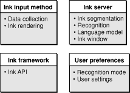

The remainder of this chapter provides an overview of the Ink user interface, describes how Ink technology works in Mac OS X, and discusses the concepts you need to understand the Ink Services API.

Three items make up the Ink user interface: the Ink preferences pane, the Ink window, and Ink writing guides. The Ink preferences pane allows the user to turn handwriting recognition on and off. This preferences pane is only available if the computer detects an Ink input device, such as a tablet. The Ink window provides a writing area as well as controls that allow users to quickly toggle handwriting on or off and to control a number of other aspects of Ink. The Ink window is not available unless handwriting recognition is turned on. The Ink writing guides are visual aids that can help users to enter text horizontally. Each of these user interface items are described in the sections that follow. The user interface described here is available in Mac OS X version 10.3.

Users access the Ink preferences pane by opening System Preferences and clicking the Ink icon shown in Figure 1-2. The Ink icon is visible in System Preferences in Mac OS X version 10.2 and later if there is an Ink input device attached to the computer and an appropriate device driver has been installed.

__Figure 1-2__  The Ink icon in System Preferences

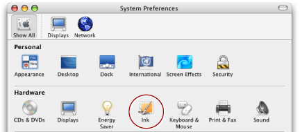

A user can turn handwriting recognition on or off by clicking the appropriate radio button in the Ink preferences pane, as shown in Figure 1-3. The figure also shows that Ink preferences has three panes within it—Settings, Gestures, and Word List. A user can navigate between the panes by clicking the appropriate tab.

__Figure 1-3__  Settings in the Ink preferences pane

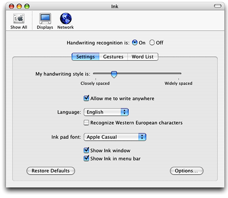

The options available in the Settings pane allow a user to:

- Identify handwriting style as closely or widely spaced
- Specify whether to allow Ink input anywhere or to limit Ink input only to Ink-aware applications. In Mac OS version 10.2, the only Ink-aware application is the Ink window.
- Choose a language (English, French, or German) for the recognizer to use
- Specify whether to recognize Western European characters. Users should turn on this option if they plan to enter ligatures or characters that use diacritical marks.
- Choose a font to use in the Ink window
- Specify whether to show the Ink window
- Specify whether to show the Ink icon in the menu bar

A user who wants to customize Ink further can click the Options button shown in Figure 1-3 to:

- Set how quickly recognition begins after lifting the stylus. A _stylus_ is the hand held instrument used to enter data on a graphics tablet. It is also called a _pen_.
- Specify how far the stylus must move before Ink input begins
- Set how long the stylus must be held still before it can be used as a mouse instead of as a pen
- Specify that a phrase is terminated when the stylus moves away from the tablet
- Hide the pointer that normally appears when writing
- Specify to play a sound while writing

Gestures are pen strokes that specify editing actions. The list of available editing actions appear when the user clicks the Gestures tabs, shown in Figure 1-4. Recognition for all gestures associated with editing actions is on by default; the user can disable an action by clicking the checkbox next to the action. When a user chooses an action, the gesture associated with the action is drawn in the box to the right of the action list. A user can learn how to draw the more complex gestures (such as Select All) by watching the animated drawing of the gesture in the box. The description of the action appears below the gesture.

__Figure 1-4__  Gestures in the Ink preferences pane

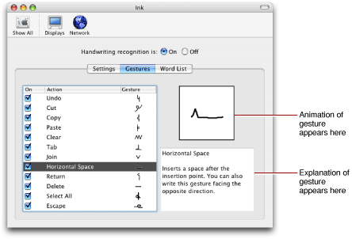

All gestures, except Join (which is described later), can be used in an untargeted manner. _Untargeted gestures_ apply to the current selection, if there is one, or to the insertion point, if there is no selection. Most gestures can also be used in a targeted manner. _Targeted gestures_ apply either to the item under a predefined hot spot or the entire gesture bounds. Not all gestures that can be targeted have a hot spot. An application can use the hot spot location (if available) and gesture bounds to determine the area to which a targeted gesture should apply.

The Gestures pane doesn’t indicate whether a gesture is targeted or not; this information is not available to users and depends, in general, on whether targeted gestures are supported or not in each application. If an application is not specifically set up to handle Ink events (that is, the application is not Ink-aware) the gesture is always treated by the system as an untargeted gesture (except for the Join gesture). An application that is Ink-aware can use the Ink Services API to obtain information about the hot spot. The application can then use that information to apply the editing action specified by the gesture to the appropriate area. See [Supporting Text Editing With Ink Gestures](Ink%20Services%20Tasks.md#apple-f4xwc4dqnrsv64tfmyxwi33df52wszbpkridgmbqgaydqnbufvbecssfincuqqi) for more information.

A targeted gesture can also be tentative. A _tentative gesture_ is Ink that the system treats tentatively as a gesture until your application either confirms the Ink is indeed a gesture or informs the system the Ink is not a gesture. There is only one tentative gesture—the Join gesture, shown in Figure 1-5. Note in the figure that this gesture looks similar to the letter “v.” The Join gesture can only be used in an Ink-aware application, because it is the application that must decide whether the Ink is a gesture or text.

When Ink Services receives Ink input that appears similar to that shown in Figure 1-5, it has no way to determine whether the Ink input should be interpreted as the Join gesture or the letter “v.” Ink Services tentatively interprets the Ink as a gesture and passes the gesture to your application. You application must make the determination as to whether the Ink input is the Join gesture or the letter “v.” If you determine the Ink input is the Join gesture, it is up to your application to apply the gesture to the appropriate text. If you determine the Ink input is not the Join gesture, your application informs Ink Services of this by returning `eventNotHandledErr`, which in turn posts the Ink as the letter “v.” See [Supporting Text Editing With Ink Gestures](Ink%20Services%20Tasks.md#apple-f4xwc4dqnrsv64tfmyxwi33df52wszbpkridgmbqgaydqnbufvbecssfincuqqi) for details on how to handle the Join gesture.

__Figure 1-5__  The Join gesture is indistinguishable from the letter “v”

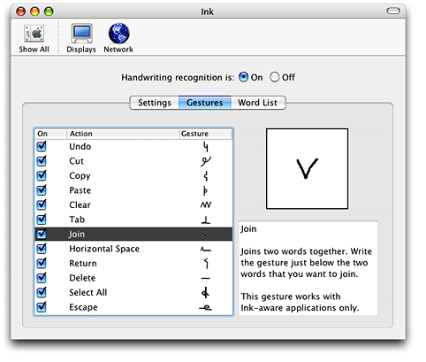

All gestures except the Join gesture fall into the category of non-tentative gestures. Non-tentative gestures are always treated as gestures, regardless of where they are drawn because Ink Services interprets them unambiguously as gestures.

Table 1-1 lists gestures and the categories they can fall into. Notice that some gestures can be targeted or untargeted while others are always untargeted. Join, the only tentative gesture, is always targeted.

__Table 1-1__  Gesture categories

| Gesture | Targeted | Untargeted | Tentative |
| Undo | Never | Always | No |
| Escape | Never | Always | No |
| Select All | Never | Always | No |
| Delete | Never | Always | No |
| Clear | Sometimes | Sometimes | No |
| Cut | Sometimes | Sometimes | No |
| Copy | Sometimes | Sometimes | No |
| Paste | Sometimes | Sometimes | No |
| Horizontal Space | Sometimes | Sometimes | No |
| Tab | Sometimes | Sometimes | No |
| Return | Sometimes | Sometimes | No |
| Join | Always | Never | Yes |

Users can improve handwriting recognition, particularly for unusual words such as technical jargon, by entering words into the Word List, shown in Figure 1-6. When the user clicks Add, a sheet appears that has a text field into which the use can type a word. A user can edit or delete words in the list by clicking the appropriate button.

__Figure 1-6__  A custom word list in the Ink preferences pane

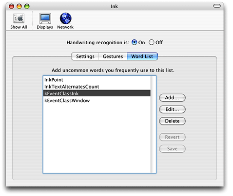

The Ink window has two areas—the Ink toolbar and the Ink pad. When a user turns on handwriting recognition in the Ink preferences pane, the Ink toolbar appears, as shown in Figure 1-7. A user can use the Ink toolbar to:

- Turn recognition on or off. This is handy if the user needs to quickly switch between using the stylus to print and using it to control the pointer.
- Show and hide the Ink pad
- Open Ink Help
- Open the Ink preferences pane
- Activate Command, Shift, Option, and Control

__Figure 1-7__  The Ink toolbar

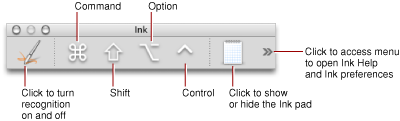

When the users clicks the Ink pad icon, the Ink pad appears as shown in Figure 1-8. The Ink pad provides an area for users to print or sketch and then insert the printed text or drawn art into a document. A user can toggle between entering printed text and graphics by clicking the buttons in the lower-left of the Ink pad. The Clear button erases anything currently displayed while Send pastes the entered text or sketch into the insertion point of the currently active Mac OS X application.

__Figure 1-8__  The Ink window with the Ink pad open

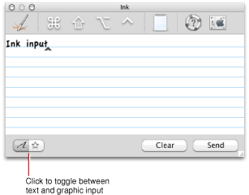

The Ink window provides a list of alternate interpretations for each unit of text (typically a word) entered by the user. The list is in the form of a menu that the user can access by placing the pointer over a word and then pressing the Control key while clicking the mouse. Figure 1-9 shows a contextual menu with a list of alternates. The original Ink is listed as the last item.

Menu items for a set of alternates whose first letter is an alphabetical character always include an alternate whose first letter is the opposite lettercase. Hence the second item shown in the menu in Figure 1-9 is Crash. Menu items for a set of alternates whose first letter is a nonalphabetical character do not include a lettercase alternate.

__Figure 1-9__  A menu with a list of alternate interpretations

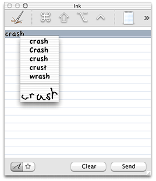

When the user chooses a word from the list, Ink Services automatically reorders the menu items. The text that was first in the list moves to the second or the third position, depending upon whether the first letter is alphabetical or nonalphabetical. For example, for the list of words shown in Figure 1-9, if the user chooses crush, the menu items are reordered as shown in Figure 1-10.

__Figure 1-10__  The reordered list of alternate interpretations

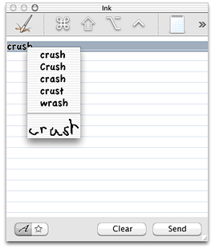

Notice that the list of alternates is kept to a maximum length of five. An uppercase alternate for crush is added to the menu while the uppercase alternate Crash is dropped.

For a nonalphabetic first character, however, such as a number, the original moves to the second position. So for the following items:

1239, 1234, 1289, 1284

If the user chooses 1234, the list is reordered as follows:

1234, 1239, 1289, 1284

An application may provide support for alternate word lists using the Ink Services API. For more information, see [Implementing a Correction Model](Ink%20Services%20Tasks.md#apple-f4xwc4dqnrsv64tfmyxwi33df52wszbpkridgmbqgaydqnbufvbecssfifbemra).

A user can enter pen input directly into any application that accepts text input. Ink Services automatically draws the user’s strokes as Ink, recognizes the text, and sends the recognized text to the application. All the user needs to do is position the stylus and start printing. Ink provides writing guides to facilitate text entry, as shown in Figure 1-11. A user may write almost anywhere on the screen and the recognition results flow to the insertion point in the frontmost application. The only exceptions are specially designated controls and screen areas, such as the Dock, the menu bar, window title bars, and scroll bars.

__Figure 1-11__  Ink writing guides facilitate pen input into an application

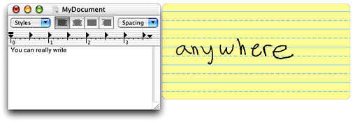

The Ink writing guides looks similar to a translucent piece of yellow, lined, writing paper and is positioned wherever the user writes. The user’s printed input appears in the writing guides until Ink Services applies recognition to the Ink text, at which point the Ink phrase is terminated. After the Ink text is recognized, the text appears in the application window as typed text. It is possible for an application to control whether Ink Services draws the writing guides.

The flow of Ink from stylus and tablet to an application is shown in [Figure 1-12](#apple-f4xwc4dqnrsv64tfmyxwi33df52wszbpkridgmbqgaydqnbtfvbecssiinfeqqi). When the user writes a line of text using a stylus, Ink performs a series of operations, as follows:

- Raw data from the hardware is acquired and processed by the tablet driver, which emits pen events using IOKit and Human Interface Device (HID) Manager calls.
- Pen events are passed to the Core Graphics layer. Unlike ordinary mouse events, pen events are usually routed to the frontmost application, even if the event occurred somewhere other than in that application’s windows. This allows the user to write anywhere on the screen. The exception to this occurs when pen events are located within certain “instant mousing” areas, such as window title bars, scroll bars, the Dock, and the main Menu Bar.

  An _instant-mousing area_ defines an area in which stylus input is interpreted as mouse input; the system “instantly” interprets the stylus as a mouse in these special places and Ink is not generated. For any other location, a user can signal Ink to interpret stylus input as mouse input by pressing and holding the stylus still briefly. It not possible for a user to start Ink input with the stylus placed over an instant-mousing area.
- Pen events (mouse plus tablet data) are then passed to Ink Services, where the various components (see [Figure 1-1](#apple-f4xwc4dqnrsv64tfmyxwi33df52wszbpkridgmbqgaydqnbtfvbecssjijaukrq)) perform the tasks listed in the Ink Input Method box shown in [Figure 1-12](#apple-f4xwc4dqnrsv64tfmyxwi33df52wszbpkridgmbqgaydqnbtfvbecssiinfeqqi).
- The input method component of Ink Services accumulates pen events into strokes and phrases.

  _Strokes_ are collections of points (onscreen locations), spanning the time from which the pen is pressed to the tablet hard enough to generate a mouse-down event until the time at which the pen is lifted from the tablet enough to generate a mouse-up event, and corresponds to the common concept of strokes one might write with paper and pencil.

  _Phrases_ are collections of strokes, spanning the time from when the first stroke is started to the time at which the phrase is terminated due to one of several common events—a timeout following a pen lift (but staying in proximity), a lift that takes the stylus out of tablet proximity (the limited range over which the tablet can sense the stylus), a recognizer-generated break (due to the user introducing an extra large horizontal space or beginning a new line), or a direct request by the application to terminate the phrase. An Ink phrase can represent a letter, word, or longer unit.
- The Ink server hosts the recognizer which processes accumulated phrases. Ink Services is set up by default to recognize both text and editing gestures. See [The Ink Recognizer](#apple-f4xwc4dqnrsv64tfmyxwi33df52wszbpkridgmbqgaydqnbtfvkfawcsivddcmrx) for more information on how the recognizer works.

  If a user toggles the write-anywhere mode off, then pen events are ignored by Ink Services, everywhere except in ink-aware applications. These points are not drawn by Ink Services nor interpreted by the recognizer unless the application calls the Ink Services function `InkSetApplicationWritingMode` with the `iWhere` parameter set to `kInkWriteAnywhereInApp`. As long as Ink is turned on, Ink will always be drawn and recognized if the user writes directly into the Ink pad in the Ink window. Similarly, as long as Ink is turned on, Ink drawing and recognition services will always be provided for your ink-aware application once you enable them by calling `InkSetApplicationWritingMode`, regardless of the user's write-anywhere preference setting.
- When the Ink input is recognized, Ink Services generates one or more Carbon events of class `kEventClassInk` and the appropriate event kind `kEventInkText` or `kEventInkGesture`. Your application can obtain the data it requires to accomplish its goals by installing appropriate handlers for Ink-related Carbon events. When your application is the active application (that is, the one that has keyboard focus) it can receive the Carbon events, extract the relevant event parameters, and process the data accordingly. If your application does not handle the events, then Ink Services handles them.

  For more details, see [Ink-Related Carbon Events](#apple-f4xwc4dqnrsv64tfmyxwi33df52wszbpkridgmbqgaydqnbtfvkfawcsivddcmrr).

__Figure 1-12__  The flow of Ink from stylus to application

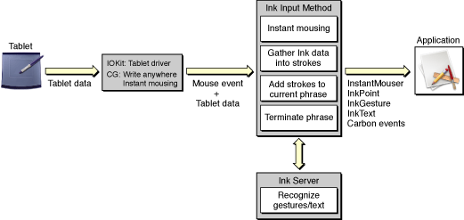

The Ink recognizer is at the heart of Ink Services. It is the algorithmic component of Ink Services that identifies written text and gestures. Built using neural-network technology, the architecture of the recognizer integrates multiple representations of the input data. This design, combined with the training regimen used to build the recognizer, provides robust, accurate character recognition despite individual differences in the writing styles of users.

Three outcomes are possible from the Ink recognizer. The first two outcomes are the ones you are likely to see; the third is a rare event.

- The Ink input is recognized as a gesture.

  When the recognizer determines with a high confidence level that the Ink input is a gesture, Ink Services generates a gesture event.

  Recall that Ink input in the form of the standalone letter “v” is tentatively treated as a gesture. If your application determines the Ink input is not the Join gesture, not handling the gesture (returning `eventNotHandledErr`) notifies Ink Services that the Ink input should be interpreted as text by the recognizer. See [Gestures](#apple-f4xwc4dqnrsv64tfmyxwi33df52wszbpkridgmbqgaydqnbtfvkfawcsivddcnbw) for more information.
- The Ink input is recognized as text.

  The recognizer ranks text interpretations according to a confidence level. Up to five interpretations are returned to an application through the Ink text event (in the `InkTextRef` parameter). If the Ink text event is not handled by the application, then for compatibility with non-ink-aware applications, only the top-choice, highest confidence interpretation is returned in a `kEventTextInputUnicodeForKeyEvent` event. If that event is not handled, then the text is returned to the application receiving the input as raw `keyDown` events.

  Using the Ink Services API, your application can obtain a list of interpretations, in ranked order, from the recognizer, and then use the list to implement a correction model. For more information, see [Implementing a Correction Model](Ink%20Services%20Tasks.md#apple-f4xwc4dqnrsv64tfmyxwi33df52wszbpkridgmbqgaydqnbufvbecssfifbemra).
- The Ink input is not recognized.

  In the rare case that handwritten input cannot be recognized, the recognition system returns a diamond character that indicates the text is not recognized.

  However, in the event of misrecognition it is more often the case that the Ink input is recognized as text, but that the text has no meaning to the user. For example, the Ink input shown in Figure 1-13 would be recognized as “54M^ NG” or some other meaningless text. With a little practice most users improve their printed input to achieve a high recognition rate.

  Note that the Ink input shown in the Figure 1-13 is script, not print. The recognizer is optimized for printed text.

  __Figure 1-13__  Ink input that is difficult to recognize

  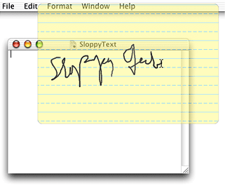

Ink Services notifies your application of Ink-related events by generating Carbon events. The events listed in [Table 1-2](#apple-f4xwc4dqnrsv64tfmyxwi33df52wszbpkridgmbqgaydqnbtfvbecssgircumsi) are generated by the system, in the order listed, until an event in the chain is handled by an event handler provided by your application. Once your application handles one of these events (by returning any result other than the result code `eventNotHandledErr`), the chain is terminated and no further events are generated by Ink Services for that data.

__Table 1-2__  Carbon events generated by Ink input

| Event category | Carbon event | The event is received by your application ... |
| pen | `kEventMouseDown``kEventMouseDragged` | along with tablet coordinates and a pressure value, only when recognition is disabled. |
| instant mousing | `kEventAppIsEventInInstantMouser` | only at the start of a phrase. |
| Ink point | `kEventInkPoint` | during a phrase. |
| gesture | `kEventInkGesture` | only when a gesture is recognized. |
| text | `kEventInkText` | when text is recognized. |
| Unicode text | `kEventTextInputUnicodeForKeyEvent` | when Unicode text is recognized and when `kEventInkText` is not handled. |
| key | `kEventRawKeyDown` | when text is recognized and the previous events are not handled. |

The Ink-specific events most important to any application that uses Ink Services—instant mousing, Ink point, Ink gesture, Ink text —are described in the sections that follow. For more information, see [Obtaining Parameters from Ink Text and Gesture Events](Ink%20Services%20Tasks.md#apple-f4xwc4dqnrsv64tfmyxwi33df52wszbpkridgmbqgaydqnbufvkfawcsivddcnbu).

The event `kEventAppIsEventInInstantMouser` is dispatched only when the stylus is initially pressed to a tablet and before Ink Services determines whether the user is writing or not. Instant mousing areas are those areas where you do not want the tablet to start Inking. Once the user begins to write, Ink input does not generate instant-mousing events until the current phrase is terminated.

Instant mousing in standard Carbon and Cocoa controls, drag regions, and so forth is handled for you automatically. If your application implements its own custom controls that you want to be treated as instant mousing areas, it must provide a handler for this event. The handler must check the location of the pen event and return `noErr` if the pen's location is in a custom instant mousing region, which will force the pen to behave as a mouse. Your handler should return `eventNotHandledErr` outside the custom mousing regions, to allow the user to commence writing in most locations.

Ink Services sends an Ink point event (`kEventInkPoint`) whenever it detects a pen event at the start of or within a phrase (that is, whenever the user is actually entering Ink and not mousing). If the Ink point event is not handled by your application, Ink Services continues to handle the event through the normal recognition path. If the Ink point event is handled by your application, Ink Services drops the current mouse event from further recognition handling. This allows your application to treat certain areas of a window as special, non-inking areas, and provides the option for your application to terminate the Ink input session. It also allows your application to draw its own Ink, while letting Ink Services manage the inking-versus-mousing decision, and even carry out normal recognition services (if your event handler returns `eventNotHandledErr`).

If your application chooses to handle Ink point events, be aware that you can receive mouse events that lie outside your application’s windows. For example, if your application draws its own Ink, it could continue to track the Ink points past the visible bounds of the window, making the out-of-bounds Ink visible if the user scrolls to look at it. Or your application could provide a separate Ink-background window for Ink input for the out-of-bounds Ink, similar to the Ink writing guides provided by Ink Services.

Ink Services dispatches an Ink gesture event (`kEventInkGesture`) only if the Ink is recognized as a gesture with a high degree of confidence. All gestures except the Join gesture can be interpreted unambiguously as a gesture. So for most gestures, whether your application handles a gesture event or not, the event chain is terminated at that point—either your application handles the gesture or it returns `eventNotHandledErr` and Ink Services handles the gesture. However, if the Join gesture (which must be targeted) is not handled by your application, Ink Services performs text recognition on the Ink and posts it as the letter “v.”

If an application does not handle the gesture, then Ink Services posts the command event (`HICommand`) associated with the editing action specified by the gesture. If a command event isn’t defined for the gesture, as in the case of the Escape, Delete, Tab, Horizontal Space, and Return, then Ink Services posts the keyboard equivalent for the gesture. For these gestures, this is simply the key event associated with the gesture (Escape, Delete, Tab, Space, and Return key presses).

Recall that the Join gesture, which is a tentative gesture, must be handled by the application, otherwise Ink Services treats it as the letter “v.” (There is no command event or keyboard equivalent fallback.) As such, the Join gesture is only available in an Ink-aware application. See [Gestures](#apple-f4xwc4dqnrsv64tfmyxwi33df52wszbpkridgmbqgaydqnbtfvkfawcsivddcnbw) for more information.

The Ink text event (`kEventInkText`) is sent when Ink Services recognizes Ink input as text. In Roman languages the Ink text event typically corresponds to an individual word. It contains the original raw Ink and the recognized text and typically includes a list of alternate interpretations that your application can show should you want to provide an easy-to-use correction model. (See [Implementing a Correction Model](Ink%20Services%20Tasks.md#apple-f4xwc4dqnrsv64tfmyxwi33df52wszbpkridgmbqgaydqnbufvbecssfifbemra) for details.)

The parameters associated with an Ink text event are `kEventParamInkTextRef` and `kEventParamInkTextKeyboardShortcut`. The parameter `kEventParamInkTextRef` is a reference to an opaque Ink text object (`InkTextRef`). An _Ink text object_ contains data that describes the recognized text. You can’t access the object directly, but you can use a variety of Ink Services functions to obtain data from the object.

The parameter `kEventParamInkTextKeyboardShortcut` is a Boolean value that indicates whether the Ink text is likely a keyboard equivalent. The value is `true` if the Command or Control key is pressed and the top-choice alternate text is a single character. Checking for this parameter provides an easy way for you to determine if the text associated with an `InkTextRef` is likely to be a keyboard equivalent instead of text. Otherwise, to determine whether the Ink text is a keyboard equivalent, you would need to extract the `kEventParamInkTextRef` parameter, retrieve the `CFStringRef` for the text, determine the length of the string, and then check for modifier keys. In most cases, you don’t need to handle an Ink text event that is a keyboard equivalent, and can immediately return `eventNotHandledErr`.

If the Ink text event is not a keyboard equivalent and you do not handle the event, Ink Services posts a `kEventTextInputUnicodeForKeyEvent` event. If that goes unhandled, Ink Services posts a sequence of raw `keyDown` events corresponding to the top-choice recognition result.

Mouse events, whether generated by a mouse and mouse driver or by a graphics tablet and tablet driver, have the potential of being posted at a faster rate than the system can handle. For example, if an application redraws a window for each `mouseDragged` event generated when a user drags a window, the window could move slowly or lag behind the pointer. To avoid slowing down the application, the Carbon Event Manager coalesces mouse events instead of placing all the mouse events in a queue. _Mouse event coalescing_ is a process that merges `mouseMoved` and `mouseDragged` events by checking to see if one of these events exists in the event queue, and if it does, replacing the previously queued event with the more recently-generated event. Note that `mouseUp` and `mouseDown` events are never coalesced, as they are semantically meaningful.

Since Ink is accumulated predominantly through `mouseDragged` events (that have tablet data associated with them), event coalescing can reduce the fidelity of the data used to draw Ink input and to perform handwriting recognition. Reduced fidelity can produce Ink that appears faceted instead of smooth, and can reduce recognition accuracy.

To avoid fidelity problems, Ink Services temporarily disables event coalescing when a stylus enters proximity of the graphics tablet. Thus Ink data is guaranteed to be smooth, for both rendering and recognition purposes. When the stylus leaves the proximity of the tablet, or when the stylus is pressed down in an instant-mousing region, event coalescing is enabled again. Thus coalescing is active, as usual, during window drags and normal mouse activity.

If your application calls the function `InkSetApplicationWritingMode` to disable Ink Services management of pen events so that your application can accumulate Ink data on its own, your application may need to manage event coalescing. Otherwise, Ink rendering and recognition may suffer from fidelity problems. You can use the Carbon Event Manager function `SetMouseCoalescingEnabled` to manage event coalescing in your application. Make sure that you disable event coalescing only when absolutely necessary. See _Carbon Event Manager Reference_ for more information on event coalescing.

[Next](Ink%20Services%20Tasks.md)[Previous](Introduction%20to%20Using%20Ink%20Services%20in%20Your%20Application.md)

