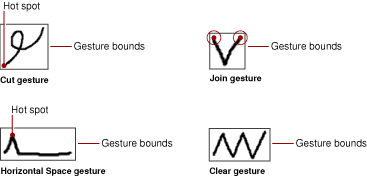
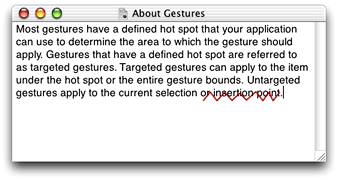
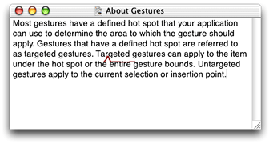

> 导航：[总目录](../../../README.md) · [documentation](../../../_indexes/documentation.md) · [Using Ink Services in Your Application](Introduction%20to%20Using%20Ink%20Services%20in%20Your%20Application.md)


[Next](Document%20Revision%20History.md)[Previous](Ink%20Services%20Concepts.md)

# Ink Services Tasks

This section shows how you can use the Ink Services API to accomplish the following tasks:

- [Obtaining Parameters from Ink Text and Gesture Events](#apple-f4xwc4dqnrsv64tfmyxwi33df52wszbpkridgmbqgaydqnbufvkfawcsivddcnbu), shows how your application can obtain the data associated with Ink input.
- [Handling Phrase Termination](#apple-f4xwc4dqnrsv64tfmyxwi33df52wszbpkridgmbqgaydqnbufvbecsseircumsq), discusses how to override automatic phrase termination and request phrase termination at the appropriate time for your application.
- [Supporting Text Editing With Ink Gestures](#apple-f4xwc4dqnrsv64tfmyxwi33df52wszbpkridgmbqgaydqnbufvbecssfincuqqi), discusses the gestures you must handle and those you can let Ink Services handle for you.
- [Implementing a Correction Model](#apple-f4xwc4dqnrsv64tfmyxwi33df52wszbpkridgmbqgaydqnbufvbecssfifbemra), shows how your application can access a list of alternate interpretations for Ink input and present those alternates in a contextual menu to your users.
- [Implementing Deferred Recognition](#apple-f4xwc4dqnrsv64tfmyxwi33df52wszbpkridgmbqgaydqnbufvbecssiinduirq), describes how to set the recognition state, collect tablet data, accumulate an Ink phrase, and request recognition at the appropriate time.

If you want to perform any of the other tasks described in this chapter, you will need to obtain one or more event parameters from Ink-related Carbon events. This section shows you how to obtain the parameters associated with Ink text and gesture events. Before you read this section, you should be familiar with the events and event parameters discussed in [Ink-Related Carbon Events](Ink%20Services%20Concepts.md#apple-f4xwc4dqnrsv64tfmyxwi33df52wszbpkridgmbqgaydqnbtfvkfawcsivddcmrr).

Ink Services generates Carbon events of class `kEventClassInk`. When Ink Services recognizes a phrase as text, it generates the event `kEventInkText`. You can extract the associated parameters—`kEventParamInkTextRef` and `kEventParamInkTextKeyboardShortcut`—by calling the Carbon Event Manager function `GetEventParameter`, as shown in Listing 2-1. Checking for the `kEventParamInkTextKeyboardShortcut` parameter provides an easy way for you to determine if the `InkTextRef` is likely to be a keyboard equivalent for a command instead of text. If this parameter is `false`, the you can use the function `InkTextCreateCFString` to obtain the recognized text associated with the Ink text object (`InkTextRef`). When you pass `0` to this function, you obtain the most likely interpretation.

__Listing 2-1__  Extracting parameters for the Ink text event

```
OSStatus status = noErr;
InkTextRef myInkTextRef;
Boolean  myKeyboardShorcut;

status = GetEventParameter (myEvent,
                kEventParamInkTextRef,
                typePtr,
                NULL,
                sizeof (Ptr),
                NULL,
                &myInkTextRef);

status = GetEventParameter (myEvent,
                kEventParamInkTextKeyboardShortcut,
                typeBoolean,
                NULL,
                sizeof (Boolean),
                NULL,
                &myKeyboardShortcut);

if (myKeyboardShortcut == false)
        return (eventNotHandledErr);
InkTextCreateCFString (myInkTextRef, 0);
// Your code to insert the text into the application document.
```

When Ink Services recognizes an Ink phrase as a gesture, Ink Services generates the event `kEventInkGesture`. You can extract the associated parameters—`kEventParamInkGestureKind`, `kEventParamInkGestureBounds`, and `kEventParamInkGestureHotspot`—using the code shown in Listing 2-2.

__Listing 2-2__  Extracting parameters for the Ink gesture event

```
OSStatus status = noErr;
UInt32 myGestureKind;
HIRect myGestureBounds;
HIPoint myGestureHotspot;

status = GetEventParameter (myEvent,
                kEventParamInkGestureKind,
                typeUInt32,
                NULL,
                sizeof (UInt32),
                NULL,
                &myGestureKind);

status = GetEventParameter (myEvent,
                kEventParamInkGestureBounds,
                typeHIRect,
                NULL,
                sizeof (HIRect),
                NULL,
                &myGestureBounds);

status = GetEventParameter (myEvent,
                kEventParamInkGestureHotspot,
                typeHIPoint,
                NULL,
                sizeof (HIPoint),
                NULL,
                &myGestureHotspot);
```


The default behavior is for Ink Services to terminate a phrase when one of the following events occur:

- The user removes the stylus from the proximity of the tablet
- A specified period of time elapses in which the stylus is not pressed to the tablet (The user can control the period of time in the Ink preferences pane.)
- The user writes sufficiently far away from the previous Ink—either horizontally, or on a new line

You can use the function `InkSetPhraseTerminationMode` if your application does not want the default behavior or wants complete control over when Ink phrases are terminated. If you turn off automatic phrase termination, you must make sure you manage phrase termination appropriately for your application.

If you want to control phrase termination in your application, you must perform the following tasks:

- Call the function `InkSetPhraseTerminationMode` to turn off automatic phrase termination. You can do so using the following line of code:

  `InkSetPhraseTerminationMode (kInkSourceUser, kInkTerminationNone);`

  The first parameter to this function specifies the source of the Ink data stream. This example shows how to control termination of an Ink phrase that originates from direct user input (`kInkSourceUser)` rather than from the application (`kInkSourceApplication`).
- Write code that monitors Ink input and checks for the termination conditions you define.

  The termination conditions you define determine how you should best carry out this step. For example, if you provide users with a “terminate phrase” button in the user interface, then your application should check for the command issued by the button press.

  In such a case or if your phrase termination criteria depends on such data as where the user is writing, the proximity of the pen to the tablet, whether a modifier key is pressed, or the amount of pressure applied to the pen, you can install a Carbon event handler for the event `kEventInkPoint`, then monitor the location and other relevant parameters returned in this event.

  You may find it useful to call the function `InkIsPhraseInProgress`. The function returns `true` when there is an Ink phrase that can be terminated.
- When your application determines your termination conditions have been met, call the function `InkTerminateCurrentPhrase`.

Listing 2-3 shows an example of a handler for a hypothetical application that provides users with a “terminate phrase” button. The application must first install the handler (which, in this case, handles the event `kEventInkPoint`) and call the function `InkSetPhraseTermination` with the parameter `kInkTerminationNone`. A detailed explanation for each numbered line of code appears following the listing.

__Listing 2-3__  Code that handles phrase termination

```
{

    GetEventParameter (myInkPointEventRef, kEventParamEventRef,
                     typeEventRef, NULL, sizeof (EventRef), NULL,
                     &myMouseEventRef);// 1

    if (GetEventKind (myMouseEventRef) == kEventMouseDown)// 2
    {
        if (MyTestForButtonHit (myMouseEventRef) == true)// 3
        {
            if (InkIsPhraseInProgress() == true)// 4
            {
                InkTerminateCurrentPhrase(kInkSourceUser);// 5
                return (noErr);
            }
        }
    }
    return (eventNotHandledErr);// 6

}
```

Here’s what the code does:

1. Extracts the mouse event reference from the Ink point event.
2. Checks to see if the event is a mouse down event.
3. Checks to see if the mouse down event is in the termination button provided by the application. The `MyTestForButtonHit` function is an application-defined function that determines if the mouse event is within the bounds of the termination button.
4. Checks to see if Ink Services has an Ink phrase in progress; otherwise there is nothing to terminate. Note that the function `InkIsPhraseInProgress` should be called only to check whether a phrase is in progress for an Ink data stream that originate from the user, and not for one that originates from your application. See _Ink Services Reference_ for more information.
5. Terminates the phrase and returns `noErr` to indicate the event has been handled. You must pass the constant `kInkSourceUser` to specify that the function `InkTerminateCurrentPhrase` should be applied to the Ink data stream that originates from direct user input.
6. Returns `eventNotHandledErr` if any of the previous `if` statements are false. If there is an Ink phrase in progress, it is not terminated.

Before you begin to write any code that supports text editing using Ink gestures, you should be thoroughly familiar with the terms “targeted gesture,” “untargeted gesture,” and “tentative gesture,” because you handle each of these gestures differently. These terms are described in [Gestures](Ink%20Services%20Concepts.md#apple-f4xwc4dqnrsv64tfmyxwi33df52wszbpkridgmbqgaydqnbtfvkfawcsivddcnbw). You should also be familiar with the Ink-gesture event and event parameters described in [Ink Gesture Events](Ink%20Services%20Concepts.md#apple-f4xwc4dqnrsv64tfmyxwi33df52wszbpkridgmbqgaydqnbtfvbecsscjbeucri), as gesture information is available to your application through Carbon events.

To support text editing with Ink gestures, your application must write and install an event handler for the Carbon event kind `kEventInkGesture`. The parameters associated with an Ink gesture event are:

- `kEventParamInkGestureKind`—The gesture kind can be any of the constants listed in [Table 2-1](#apple-f4xwc4dqnrsv64tfmyxwi33df52wszbpkridgmbqgaydqnbufvbecssjirdegri). These constants are defined as the `InkGestureKind` enumeration in the Ink Services API. The Horizontal Space and Return gestures are each represented by two constants because the user can write these gestures facing the opposite direction of what’s shown in the Ink pane of System Preferences. The left and right distinction for the Horizontal Space gesture indicates the side on which the long, horizontal tail is drawn. The left and right distinction for the Return gesture indicates the direction the small angle-bracket points.
- `kEventParamInkGestureBounds`—The gesture bounds is the rectangle to which some gestures should apply. You can use this information when your application handles targeted gestures.
- `kEventParamInkGestureHotspot`—The gesture hot spot is the area to which some gestures should apply. Only targeted gestures can have a hot spot. You can use this information when your application handles targeted gestures.

__Table 2-1__  Gesture constants

| Gesture | Gesture kind constant |
| Undo | `kInkGestureUndo` |
| Clear | `kInkGestureClear` |
| Select All | `kInkGestureSelectAll` |
| Escape | `kInkGestureEscape` |
| Cut | `kInkGestureCut` |
| Copy | `kInkGestureCopy` |
| Paste | `kInkGesturePaste` |
| Horizontal Space | `kInkGestureLeftSpace` |
| Horizontal Space | `kInkGestureRightSpace` |
| Tab | `kInkGestureTab` |
| Return | `kInkGestureLeftReturn` |
| Return | `kInkGestureRightReturn` |
| Delete | `kInkGestureDelete` |
| Join | `kInkGestureJoin` |

After your event handler obtains the gesture kind from the event parameter `kEventParamInkGestureKind` (see [Listing 2-2](#apple-f4xwc4dqnrsv64tfmyxwi33df52wszbpkridgmbqgaydqnbufvbecssiiveuiri)), it should handle gestures as follows:

- For gestures that are always untargeted (Undo, Select All, Escape, and Delete), return `eventNotHandledErr`. Because these gestures are always untargeted, you can let Ink Services handle them for you. Ink Services converts the unhandled gesture to the command event (`HICommand`) associated with the editing action specified by the gesture. If a command event isn’t defined for the gesture, as in the case of the Escape and Delete, or if the command goes unhandled, then Ink Services posts the keyboard equivalent for the gesture. Untargeted gestures apply to the current selection or insertion point.

  See [Handling Untargeted Gestures](#apple-f4xwc4dqnrsv64tfmyxwi33df52wszbpkridgmbqgaydqnbufvbecssfiveucra) for more details.
- For the Join gesture (which is a tentative gesture), check to see if the top-left and top-right points of the bounding box defined by the gesture are sufficiently close to the end and beginning of two words (or other editable objects), with a space between the words. If so, then your application should elide the space between the words and return `noErr`. See [Handling Targeted Gestures](#apple-f4xwc4dqnrsv64tfmyxwi33df52wszbpkridgmbqgaydqnbufvbecssejfeuisq) for more details.

  If not, then return `eventNotHandledErr` to signal to Ink Services to process the raw Ink as text and post the recognition results, which should be the letter “v.”

  You must make sure that you return `eventNotHandledErr` when you determine the Ink is not a Join gesture, otherwise the user will never be able to enter the letter “v” as a standalone character.
- For all other gestures, check to see if the gesture’s hot spot (or bounding box, as appropriate) is over a suitable target, such as a word, image, or other object. If so, then apply the gesture to that target. Note that any non-empty selection range is a suitable target, and should be treated as a single editable object for applying targeted gestures. (So if a gesture hot spot is anywhere in the selection, the gesture should be applied to the entire selection.) See [Handling Targeted Gestures](#apple-f4xwc4dqnrsv64tfmyxwi33df52wszbpkridgmbqgaydqnbufvbecssejfeuisq) for more details.

  If the gesture is not over a suitable target, then it should be applied to the current selection, if it is non-empty, else it should be applied to the insertion point, like an untargeted gesture.

  If the gesture is being applied to the selection or the insertion point, whether due to a hot spot in the selection or one that is not over any suitable target, your application may choose to return `eventNotHandledErr` to let Ink Services apply the editing action automatically.

You can use gesture and text relationships to determine the extent of the text modified by the gesture. Most targeted gestures have a defined hot spot that your application can use to determine the area to apply the editing action.

Table 2-2 lists targeted gestures, whether the gesture has a hot spot, and the editing actions you should perform when you handle the gesture.

__Table 2-2__  Targeted gestures, hot spots, and editing actions

| Constant | Has a hot spot | Perform the following action ... |
| `kInkGestureClear` | No, use the gesture bounds | delete the text if the gesture bounds overlaps by 50% or more. |
| `kInkGestureCut` | Yes, the starting point of the gesture | cut the text (a single word in Roman languages) the hot spot overlaps. |
| `kInkGestureCopy` | Yes, the starting point of the gesture | copy the text (a single word in Roman languages) the hot spot overlaps. |
| `kInkGesturePaste` | Yes, the starting point of the gesture | paste the Clipboard contents into the location specified by the hot spot. Paste over a word if the hot spot is on a word. |
| `kInkGestureLeftSpace``kInkGestureRightSpace` | Yes, the topmost point of the gesture | insert a single space character into the location specified by the hot spot. |
| `kInkGestureTab` | Yes, the starting point of the gesture | insert a single tab character into the location specified by the hot spot. |
| `kInkGestureLeftReturn` | Yes, the leftmost point of the gesture | insert a return (new line) character into the location specified by the hot spot. |
| `kInkGestureRightReturn` | Yes, the rightmost point of the gesture | insert a return (new line) character into the location specified by the hot spot. |
| `kInkGestureJoin` | No, you must extract two points from the gesture bounds | delete the space between the words specified by the top-left and top-right points of gesture bounds. |

Figure 2-1 shows gesture bounds for four editing gestures—Cut, Horizontal Space, Clear, and Join. The Cut and Horizontal Space gestures have a hot spot but the Clear gesture does not. Rather, the bounds of the Clear gesture define its targeting area. The Join gesture doesn’t have a hot spot per se; instead it has two points that specify the two words that should be joined. These two points are contained in the gesture bounds, and your application must extract the points from the bounds.

__Figure 2-1__  Gesture bounds and hot spots



To handle the Clear gesture, which does not have a hot spot, your application should apply the editing action to all of the text the gesture overlaps (to a sufficient degree—say, more than 50% of the onscreen area of each word—on a word-by-word basis). For example, the Clear gesture in Figure 2-2 is written over the words “or insertion point” so your application should delete those words. To make that determination you would first obtain the gesture bounds from the event `kInkGestureEvent`, then determine the words the gesture is written over, and delete those words.

__Figure 2-2__  The Clear gesture



For targeted gestures that have a hot spot, only the hot spot is relevant to the editing action your application takes; the gesture bounds aren’t. For example, to handle the Horizontal Space gesture your application must obtain the hot spot from the event `kInkGestureEvent`.The Horizontal Space gesture in Figure 2-3 is positioned between the letters “r” and “g.” To process this gesture, your application would determine the characters on either side of the hot spot, then insert a space in that position.

__Figure 2-3__  The Horizontal Space gesture



If the gesture hot spot is drawn outside your application’s windows or in a location where the gesture would not apply, the gesture should be treated as an untargeted gesture. That is, you should either return `kEventNotHandledErr` and let Ink Services handle the gesture for you, or you should apply the editing action to the current text selection or insertion point (if there is no selection).

Your application does not need to handle untargeted gestures; it can simply return `kEventNotHandledErr` and let Ink Services handle the gesture for you. If for some reason you decide to handle untargeted gestures, you should perform the actions listed in Table 2-3. Note that the editing action for an untargeted gesture can depend on whether or not there is a selection.

__Table 2-3__  Actions specified by untargeted Ink gestures

| Constant | If there is a selection, specifies to ... | If there is no selection, specifies to ... |
| `kInkGestureUndo` | undo the last action. | undo the last action. |
| `kInkGestureClear` | clear the current selection. | do nothing. |
| `kInkGestureSelectAll` | select all items in the window that has user focus. | select all items in the window that has user focus. |
| `kInkGestureEscape` | act as if the Escape key is pressed. | act as if the Escape key is pressed. |
| `kInkGestureCut` | cut the current selection. | do nothing. |
| `kInkGestureCopy` | copy the current selection. | do nothing. |
| `kInkGesturePaste` | paste the Clipboard contents over the current selection. | paste the Clipboard contents into the insertion point. |
| `kInkGestureLeftSpace``kInkGestureRightSpace` | replace the current selection with a single space character. | insert a single space character at the insertion point. |
| `kInkGestureTab` | replace the current selection with a single tab character. | insert a single tab character. |
| `kInkGestureLeftReturn``kInkGestureRightReturn` | replace the current selection with a return (new line) character. | insert a return (new line) character. |
| `kInkGestureDelete` | delete the current selection. | delete the item immediately preceding the insertion point. |

Ink Services communicates events through the Carbon Event Manager. Once Ink Services interprets an Ink phrase, it sends your application the Carbon event kind `kEventInkText` whose associated parameter is a reference to an opaque Ink text object (`InkTextRef`). The Ink text object contains the original Ink entered by the user and a list of interpretations for the Ink in ranked order. Ink Services creates a list of up to five possible interpretations. The most likely interpretation is the first item in the list, with less likely interpretations appearing in rank order after this item. (See [Ink Window](Ink%20Services%20Concepts.md#apple-f4xwc4dqnrsv64tfmyxwi33df52wszbpkridgmbqgaydqnbtfvkfawcsivddcnbt) for details on how Ink orders the interpretations.)

Your application can implement an easy-to-use correction model by performing the following tasks:

- Create a contextual menu.

  Although the menu doesn’t have to be a contextual one, alternate interpretations are typically presented to the user in this way. See [Ink Window](Ink%20Services%20Concepts.md#apple-f4xwc4dqnrsv64tfmyxwi33df52wszbpkridgmbqgaydqnbtfvkfawcsivddcnbt) for an example of what a contextual menu looks like when used for Ink.

  You can create a menu any way you like. For example, you can:

  - Create the menu in Interface Builder and then unarchive the menu using the Interface Builder Services API. For more information, see _Unarchiving Interface Objects With Interface Builder Services_.
  - Use the Menu Manager API. For more information, see _Menu Manger Reference_.

  You can obtain either document from the developer documentation website, accessed through:

  [http://developer.apple.com/](https://developer.apple.com/)
- Insert the list of interpretations into the menu.

  You can call the Ink Services function `InkTextInsertAlternatesInMenu,` supplying the `InkTextRef` and a valid menu reference as parameters, as shown in the following code:

```
alternateItemsCount = InkTextInsertAlternatesInMenu (
                myInkRef, // obtained through your Carbon event handler
                myAlternatesMenu, // a valid menu reference
                0); // location in menu to insert list
```
- Show the contextual menu to the user and obtain the user’s selection, if any.

  Your application should display the menu by calling the Menu Manager function `ContextualMenuSelect` (or other appropriate function, such as `PopUpMenuSelect`).

  You can get the user’s selection by checking the return value of `outUserSelectionType`, as shown in the following code:

```
status = ContextualMenuSelect (myAlternatesMenu,
                myMouseLocation, // the location to display the menu
                false, // reserved for future use
                kCMHelpItemRemoveHelp, // don’t provide a help item
                NULL. // a help string, which is not relevant here
                NULL, // no need for system to examine the selection
                &selectionType, //on output, indicates selection type
                &menuID, // on output, the menu ID of chosen item
                &menuItemIndex); // on output, menu item of chosen item
```
- If the user chooses an item, you should obtain the string associated with the menu item and then call your function to replace the word in the document with the string returned by this function.

  You can obtain the string associated with the user’s choice using one of the following two methods:

  - Call the Ink Services function `InkTextCreateCFString`, supplying `0` as the `iIndex` parameters.

    This will always return the current top-choice interpretation, which will have been automatically altered by the user's selection. Note, however, that if the user selects the original first interpretation, the text may not have changed. Also, if you have placed other, non-Ink items in the menu, the user may have selected one of those instead of having made a selection from amongst the Ink alternates. So if you populate the menu with items unrelated to Ink, you may need to use the second method.
  - Call the Menu Manager function `CopyMenuItemTextAsCFString` supplying the values that were returned in the parameters `outMenuID` and `outMenuItem` when you called the Menu Manager function `ContextualMenuSelect` to display the menu.

    This method will always return the user's selection, whether it is from amongst the Ink alternates or not, though the text interpretation still may or may not have changed, and it is your application's responsibility to determine the proper outcome of the user's selection.
- The next time you need to show the menu, you must rebuild the menu before you insert the list of interpretations.

  Delete items you no longer want in the menu and then reinsert the appropriate menu items, making sure that you map the Ink Services alternates correctly to your menu. Text alternates supplied by Ink Services can be identified by the command ID `'inka'`. You can find out how many text alternates items are in the menu using the following code:

```
alternateItemsCount = CountMenuItemsWithCommandID (myAlternatesMenu,
                                    'inka');
```

  If there are Ink Services items in the menu, you must delete the previous interpretations before you can add the current interpretations. If the Ink Services menu item had been placed at the beginning of the menu, you can do so with the following code:

```
if (alternateItemsCount > 0)
        DeleteMenuItems (myAlternatesMenu, 1, alternateItemsCount);
```

You would also have to remove the single separator item identified by `'inks'` and the Ink data item identified by `'inkd'`. Or you could simply dispose of the old `menuRef` and create and populate a new one.

When a user selects an item from the list of alternates, Ink Services reorders the internal alternates list within the source Ink text object (`InkTextRef`). Thus the user’s choice persists in the system data structures without requiring your application to call any additional functions. If it is important for your application to maintain the original order of alternates, then you must use your own internal data structures to keep track of the original list.

_Deferred recognition_ is the ability to convert pen strokes to text at some time other than when the strokes are first written by the user. If you want to implement deferred recognition, your application must be responsible for collecting Ink input and deciding when recognition occurs. Your application can draw its own Ink by either disabling Ink Services or by requesting that Ink Services doesn’t process events it would otherwise have handled. Your application can then access all relevant data directly from standard mouse events.

To implement deferred recognition, your application must perform the following tasks:

- Inform Ink Services not to handle Ink events.

  You can accomplish with the following call:

  `InkSetApplicationRecognitionMode (kInkWriteNowhereInApp);`
- Install a Carbon event handler to gather tablet data.

  Your handler should handle `mouseDown`, `mouseUp`, and `mouseDragged` events. You should obtain the mouse location, tablet data, and key modifiers from each mouse event your application receives.

  You obtain the mouse location by extracting the event parameter `kEventParamMouseLocation`. You get the tablet data record by extracting the event parameter `kEventParamTabletPointRec`. You obtain the key modifiers (if any) in use by extracting the event parameter `kEventParamKeyModifiers`. The following code shows how to obtain the relevant data from the event parameters:

```
OSStatus = noErr;
HIPoint location;
TabletPointRec tabletPt;
UInt32 modifiers;

// Get the full-resolution, floating point mouse location
status = GetEventParameter (myInEvent,
                    kEventParamMouseLocation,
                    typeHIPoint,
                    NULL, // On output, the actual type
                    sizeof (location),
                    NULL, // On output, the actual size
                    &location);
require_noerr (status, TabletEvent_err); /* macro to handle error */

// Get the tablet data record
status = GetEventParameter (myInEvent,
                    kEventParamTabletPointRec,
                    typeTabletPointRec,
                    NULL,
                    sizeof (TabletPointRec),
                    NULL,
                    (void*) &tabletPt);
require_noerr ( status, TabletEvent_err);

// Get any keyboard modifiers in use
status = GetEventParameter (myInEvent,
                    kEventParamKeyModifiers,
                    typeUInt32,
                    NULL,
                    sizeof (modifiers),
                    NULL,
                    &modifiers);
require_noerr (status, TabletEvent_err);
```

  If it is useful for your application, you can also obtain tablet proximity data. Proximity data defines events which occur when the stylus is near, but not touching, the tablet.
- Store tablet data.

  As your application collects tablet-generated data, it must store the data (`HIPoint`, `TabletPointRec`, and any key modifiers) in any way that makes sense for your application. However, it is advisable not to use an array. The number of points that can be generated by a single stroke is variable, and may be quite large. Using an array would require you to allocate large arrays and to check for an array-bounds overrun.
- Add the stroke to the current Ink phrase.

  When a stroke has been completed (as indicated by the first mouse-up event after a stroke has been initiated), you can add it to the current Ink phrase by building an array of `InkPoint` data structures, and filling the structures with the collected data. (The `InkPoint` data structure holds mouse location (`HIPoint`), tablet data (`TabletPointRec`), and key modifier information (`UInt32`).) The data must be in the chronological order in which it was generated.

  Then, you must call the function `InkAddStrokeToCurrentPhrase` to add the stroke to the current Ink phrase. When you call the function, you must pass the number of structures in the array, as well as the array of `InkPoint` structures, as shown in the following code:

```
UInt32 myPointCount;
InkPoint * myInkPointArray;

InkAddStrokeToCurrentPhrase (myPointCount, myInkPointArray);
```

  It’s best to dynamically assemble and destroy the `InkPoint` array when you need to call this function.
- When your application determines that a phrase is complete and ready to be recognized, it can call the function `InkTerminateCurrentPhrase` with the `iSource` parameter set to `kInkSourceApplication`.

  Calling this function terminates the phrase and triggers the Ink recognizer.
- Handle the Ink event (`kEventInkText` or `kEventInkGesture`) that is generated by the recognizer when recognition is complete for the phrase.

A similar approach may be used to import larger quantities of data, gathered in an offline mode, potentially using a proprietary data format, such as for a digital pen that stores ink written on paper pads. Converting such data into `InkPoint` arrays and invoking the functions `InkAddStrokeToCurrentPhrase` and `InkTerminateCurrentPhrase` would allow such devices to use the recognition services provided by Ink Services.

[Next](Document%20Revision%20History.md)[Previous](Ink%20Services%20Concepts.md)

