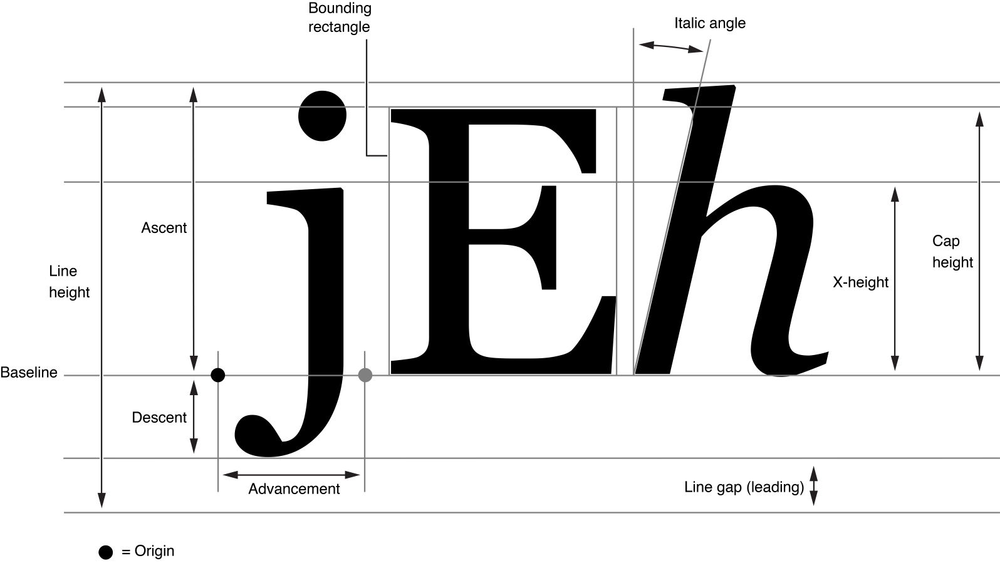

> 导航：[总目录](../../README.md) · [documentation](../../_indexes/documentation.md) · [Cocoa Text Architecture Guide](About%20the%20Cocoa%20Text%20System.md)


[Next](Text%20Editing.md)[Previous](Text%20Attributes.md)

# Font Handling

This chapter explains how the Cocoa text system deals with fonts. It explains how to use the Font panel in your application, how to work directly with font objects, and how to work with the font manager.

The Font panel, also called the _Fonts window_, is a user interface object that displays a list of available font families and styles, letting the user preview them and change the font used to display text. Text objects, such as `NSTextView`, work with `NSFontPanel` and `NSFontManager` objects to implement the AppKit’s font conversion system. By default, a text object keeps the Font panel updated with the first font in its selection, or with its typing attributes. It also changes the font in which it displays text in response to messages from the Font panel and Font menu. Such changes apply to the selected text or typing attributes for a rich text object or to all the text in a plain text object.

`NSFontManager` is the hub for font conversion—that is, changing the traits of a font object, such as its size or typeface. The font manager receives the messages from the Font panel and sends messages up the responder chain for action on the text objects.

Normally, an application’s Font panel displays all the standard fonts available on the system. If this isn’t appropriate for your application—for example, if only fixed-pitch fonts should be used—you can assign a delegate to the `NSFontPanel` object to filter the available fonts. Before the `NSFontPanel` object adds a particular font family or face to its list, the `NSFontPanel` object asks its delegate to confirm the addition by sending the delegate a [fontManager:willIncludeFont:](https://developer.apple.com/documentation/objectivec/nsobject/1462359-fontmanager) message. If the delegate returns `TRUE` (or doesn’t implement this method), the font is added. If the delegate returns `FALSE`, the font isn’t added. This method must be invoked before the loading of the main nib file.

In general, you add the facilities of the Font panel to your application, along with the `NSFontManager` object and the Font menu, through which the user opens the Font panel, using Interface Builder. You do this by dragging a Font or Format menu (which contains a Font submenu) into one of your application’s menus. At runtime, the Font panel object is created and hooked into the font conversion system. You can also create (or access) the Font panel using the [sharedFontPanel](https://developer.apple.com/documentation/appkit/nsfontpanel/1527046-shared) class method.

You can add a custom view object to an `NSFontPanel` object using [setAccessoryView:](https://developer.apple.com/documentation/appkit/nsfontpanel/1535927-accessoryview), allowing you to add custom controls to the Font panel. You can also limit the fonts displayed (by default, all fonts are displayed) by assigning a delegate to the application’s font manager object.

If you want the `NSFontManager` object to instantiate the Font panel from some class other than `NSFontPanel`, use the `NSFontManager` class method [setFontPanelFactory:](https://developer.apple.com/documentation/appkit/nsfontmanager/1462388-setfontpanelfactory). See [Converting Fonts Manually](https://developer.apple.com/library/archive/documentation/Cocoa/Conceptual/FontHandling/Tasks/ConvertingFontsManually.html#//apple_ref/doc/uid/20000442) for more information on using the font conversion system.

You can enable the interaction between a text object and the Font panel using the `NSTextView` (or `NSText`) method [setUsesFontPanel:](https://developer.apple.com/documentation/appkit/nstextview/1449534-usesfontpanel) method. Doing so is recommended for a text view that serves as a field editor, for example.

You can use the Font panel on objects other than standard text fields. The `NSFontManager` method [setAction:](https://developer.apple.com/documentation/appkit/nsfontmanager/1462349-action) sets the action (specified by a selector) that is sent up the first responder chain when a new font is selected. The default selector is [changeFont:](https://developer.apple.com/documentation/appkit/nstext/1531459-changefont). Any object that receives this message from the responder chain should send a [convertFont:](https://developer.apple.com/documentation/appkit/nsfontmanager/1462293-convertfont) message back to the `NSFontManager` to convert the font in a manner the user has specified.

This example assumes there is only one font selected:

```
– (void)changeFont:(id)sender
{
    NSFont *oldFont = [self font];
    NSFont *newFont = [sender convertFont:oldFont];
    [self setFont:newFont];
    return;
}
```

If multiple fonts are selected, `changeFont:` must send conversion messages for each selected font. This is useful for objects such as table views, which do not inherently respond to messages from the Font panel.

A computer font is a data file in a format such as OpenType or TrueType, containing information describing a set of glyphs, as described in [Characters and Glyphs](Typographical%20Concepts.md#apple-f4xwc4dqnrsv64tfmyxwi33df52wszbpkridimbqga4tinjzfvbuqnrngy2dkobv), and various supplementary information used in glyph rendering. The `NSFont` class provides the interface for getting and setting font information. An `NSFont` instance provides access to the font’s characteristics and glyphs. The text system combines character information with font information to choose the glyphs used during text layout. You use font objects by passing them to methods that accept them as a parameter. Font objects are immutable, so it is safe to use them from multiple threads in your app.

You don’t create font objects using the `alloc` and `init` methods; instead, you use methods such as [fontWithName:matrix:](https://developer.apple.com/documentation/appkit/nsfont/1530751-fontwithname) or [fontWithName:size:](https://developer.apple.com/documentation/appkit/nsfont/1525977-fontwithname) to look up an available font and alter its size or matrix to your needs. These methods check for an existing font object with the specified characteristics, returning it if there is one. Otherwise, they look up the font data requested and create the appropriate object. You can also use font descriptors to create fonts. See [Font Descriptors](#apple-f4xwc4dqnrsv64tfmyxwi33df52wszbpkridimbqga4tinjzfvbuqnjnknltona).

`NSFont` also defines a number of methods for specifying standard system fonts, such as [systemFontOfSize:](https://developer.apple.com/documentation/appkit/nsfont/1530094-systemfont), [userFontOfSize:](https://developer.apple.com/documentation/appkit/nsfont/1524559-userfontofsize), and [messageFontOfSize:](https://developer.apple.com/documentation/appkit/nsfont/1525777-messagefontofsize). To request the default size for these standard fonts, pass `0` or a negative number as the font size. The standard system font methods are listed in [Querying Standard Font Variations](#apple-f4xwc4dqnrsv64tfmyxwi33df52wszbpkridimbqga4tinjzfvbuqnjnknltcni).

Font descriptors, instantiated from the `NSFontDescriptor` class, provide a way to describe a font with a dictionary of attributes. The font descriptor can then be used to create or modify an `NSFont` object. In particular, you can make an `NSFont` object from a font descriptor, you can get a descriptor from an `NSFont` object, and you can change a descriptor and use it to make a new font object. You can also use a font descriptor to specify custom fonts provided by an app.

Font descriptors provide a font matching capability by which you can partially describe a font by creating a font descriptor with, for example, just a family name. You can then find all the available fonts on the system with a matching family name using [matchingFontDescriptorsWithMandatoryKeys:](https://developer.apple.com/documentation/appkit/nsfontdescriptor/1469985-matchingfontdescriptorswithmanda).

Font descriptors can be archived, which is preferrable to archiving a font object because a font object is immutable and provides access to a particular font installed on a particular system. A font descriptor, on the other hand, describes a font in terms of its characteristics, its attributes, and provides access at runtime to the fonts currently available that match those attributes.

That is, you can use font descriptors to query the system for available fonts that match particular attributes, and then create instances of `NSFont` matching those attributes, such as names, traits, languages, and other features. For example, you can use a font descriptor to retrieve all the fonts matching a given font family name, using the PostScript family names (as defined by the CSS standard) as shown in Listing 6-1.

__Listing 6-1__  Font family name matching

```
NSFontDescriptor *helveticaNeueFamily =
    [NSFontDescriptor fontDescriptorWithFontAttributes:
        @{ NSFontFamilyAttribute: @"Helvetica Neue" }];
NSArray *matches =
    [helveticaNeueFamily matchingFontDescriptorsWithMandatoryKeys: nil];
```

The [matchingFontDescriptorsWithMandatoryKeys:](https://developer.apple.com/documentation/appkit/nsfontdescriptor/1469985-matchingfontdescriptorswithmanda) method as shown returns an array of font descriptors for all the Helvetica Neue fonts on the system, such as `HelveticaNeue`, `HelveticaNeue-Medium`, `HelveticaNeue-Light`, `HelveticaNeue-Thin`, and so on. (PostScript font and font family names for the fonts available on a given OS X installation are displayed by the Font Book app in the Font Info window.)

`NSFont` defines a number of methods for accessing a font’s metrics information, when that information is available. Methods such as [boundingRectForGlyph:](https://developer.apple.com/documentation/appkit/nsfont/1533748-boundingrectforglyph), [boundingRectForFont](https://developer.apple.com/documentation/appkit/nsfont/1527321-boundingrectforfont), [xHeight](https://developer.apple.com/documentation/appkit/nsfont/1533428-xheight), and so on, all correspond to standard font metrics information. Figure 6-1 shows how the font metrics apply to glyph dimensions, and Table 6-1 lists the method names that correlate with the metrics. See the various method descriptions for more specific information.

__Figure 6-1__  Font metrics



__Table 6-1__  Font metrics and related `NSFont` methods

| Font metric | Methods |
| Advancement | [advancementForGlyph:](https://developer.apple.com/documentation/appkit/nsfont/1531555-advancement), [maximumAdvancement](https://developer.apple.com/documentation/appkit/nsfont/1526023-maximumadvancement) |
| X-height | [xHeight](https://developer.apple.com/documentation/appkit/nsfont/1533428-xheight) |
| Ascent | [ascender](https://developer.apple.com/documentation/appkit/nsfont/1535420-ascender) |
| Bounding rectangle | [boundingRectForFont](https://developer.apple.com/documentation/appkit/nsfont/1527321-boundingrectforfont), [boundingRectForGlyph:](https://developer.apple.com/documentation/appkit/nsfont/1533748-boundingrectforglyph) |
| Cap height | [capHeight](https://developer.apple.com/documentation/appkit/nsfont/1528292-capheight) |
| Line height | `defaultLineHeightForFont`, [pointSize](https://developer.apple.com/documentation/appkit/nsfont/1524511-pointsize), [labelFontSize](https://developer.apple.com/documentation/appkit/nsfont/1534629-labelfontsize), [smallSystemFontSize](https://developer.apple.com/documentation/appkit/nsfont/1535612-smallsystemfontsize), [systemFontSize](https://developer.apple.com/documentation/appkit/nsfont/1531931-systemfontsize), [systemFontSizeForControlSize:](https://developer.apple.com/documentation/appkit/nsfont/1529747-systemfontsize) |
| Descent | [descender](https://developer.apple.com/documentation/appkit/nsfont/1532270-descender) |
| Italic angle | [italicAngle](https://developer.apple.com/documentation/appkit/nsfont/1535194-italicangle) |

Using the methods of `NSFont` listed in Table 6-2, you can query all of the standard font variations. To request the default font size for the standard fonts, you can either explicitly pass in default sizes (obtained from class methods such as `systemFontSize` and `labelFontSize`), or pass in `0` or a negative value.

__Table 6-2__  Standard font methods

| Font | Methods |
| System font | `[NSFont systemFontOfSize:[NSFont systemFontSize]]` |
| Emphasized system font | `[NSFont boldSystemFontOfSize:[NSFont systemFontSize]]` |
| Small system font | `[NSFont systemFontOfSize:[NSFont smallSystemFontSize]]` |
| Emphasized small system font | `[NSFont boldSystemFontOfSize:[NSFont smallSystemFontSize]]` |
| Mini system font | `[NSFont systemFontSizeForControlSize: NSMiniControlSize]` |
| Emphasized mini system font | `[NSFont boldSystemFontOfSize:[NSFont systemFontSizeForControlSize: NSMiniControlSize]]` |
| Application font | `[NSFont userFontOfSize:-1.0]` |
| Application fixed-pitch font | `[NSFont userFixedPitchFontOfSize:-1.0]` |
| Label Font | `[NSFont labelFontOfSize:[NSFont labelFontSize]]` |

Characters are conceptual entities that correspond to units of written language. Generally, a glyph is the concrete, rendered image of a character. ([Typographical Concepts](Typographical%20Concepts.md#apple-f4xwc4dqnrsv64tfmyxwi33df52wszbpkridimbqga4tinjzfvbuqnrnijbegrsbivduk) presents a more detailed discussion of characters and glyphs.)

In English, there’s often a one-to-one mapping between characters and glyphs, but that is not always the case. For example, the glyph “ö” can be the result of two characters, one representing the base character “o” and the other representing the _umlaut_ diacritical mark “¨”. A user of a word processor can press an arrow key one time to move the insertion point from one side of the “ö” glyph to the other; however, the current position in the character stream must be incremented by two to account for the two characters that make up the single glyph.

Thus, the text system must manage two related but different streams of data: the stream of characters (and their attributes) and the stream of glyphs that are derived from these characters. The `NSTextStorage` object stores the attributed characters, and the `NSLayoutManager` object stores the derived glyphs. Finding the correspondence between these two streams is the responsibility of the layout manager. For example, when a user selects a range of text, working with glyphs displayed on screen, the layout manager must determine which range of characters corresponds to the selection.

When characters are deleted, some glyphs may have to be redrawn. For example, if the user deletes the characters “ee” from the word “feel”, then the “f” and “l” are now adjacent and can be represented by the “fl” ligature rather than the two glyphs “f” and “l”. The `NSLayoutManager` object directs a glyph generator object to generate new glyphs as needed. Once the glyphs are regenerated, the text must be laid out and displayed. Working with the `NSTextContainer` object and other objects of the text system, the layout manager determines where each glyph appears in the text view. Finally, the text view renders the text.

Because an `NSLayoutManager` object is central to the operation of the text system, it also serves as the repository of information shared by various components of the system. For more information about `NSLayoutManager`, refer to _[NSLayoutManager Class Reference](https://developer.apple.com/documentation/uikit/nslayoutmanager)_ and to _[Text Layout Programming Guide](../Cocoa/Text%20Layout%20Programming%20Guide/Introduction%20to%20Text%20Layout%20Programming%20Guide.md#apple-f4xwc4dqnrsv64tfmyxwi33df52wszbpgeydambqge2tq2i)_.

Glyph locations are figured relative to the origin of the bounding rectangle of the line fragment in which they are laid out. To get the rectangle of the glyph’s line fragment in its container coordinates, use the `NSLayoutManager` method [lineFragmentRectForGlyphAtIndex:effectiveRange:](https://developer.apple.com/documentation/appkit/nslayoutmanager/1403140-linefragmentrectforglyphatindex). Then add the origin of that rectangle to the location of the glyph returned by [locationForGlyphAtIndex:](https://developer.apple.com/documentation/appkit/nslayoutmanager/1403239-locationforglyphatindex) to get the glyph location in container coordinates.

The following code fragment from the _[CircleView](../../samplecode/CircleView/CircleView.md#apple-f4xwc4dqnrsv64tfmyxwi33df52wszbpirkfgnbqgaydqobygi)_ sample code project illustrates this technique.

```
usedRect = [layoutManager usedRectForTextContainer:textContainer];
NSRect lineFragmentRect = [layoutManager lineFragmentRectForGlyphAtIndex:glyphIndex
                            effectiveRange:NULL];
NSPoint viewLocation, layoutLocation = [layoutManager
                            locationForGlyphAtIndex:glyphIndex];
// Here layoutLocation is the location (in container coordinates) where the glyph was laid out.
layoutLocation.x += lineFragmentRect.origin.x;
layoutLocation.y += lineFragmentRect.origin.y;
```


Any object that records fonts that the user can change should tell the font manager what the font of its selection is whenever it becomes the first responder and whenever its selection changes while it’s the first responder. The object does so by sending the shared font manager a [setSelectedFont:isMultiple:](https://developer.apple.com/documentation/appkit/nsfontmanager/1462398-setselectedfont) message. It should pass in the first font of the selection, along with a flag indicating whether there’s more than one font.

The font manager uses this information to update the Font panel and Font menu to reflect the font in the selection. For example, suppose the font is Helvetica Oblique 12.0 point. In this case, the Font panel selects that font and displays its name; the Font menu adds a check mark before its Italic command; if there’s no Bold variant of Helvetica available, the Bold menu item is disabled; and so on.

You normally set up a font manager and the Font menu using Interface Builder. However, you can also do so programmatically by getting the shared font manager instance and having it create the standard Font menu at runtime, as in this example:

```
NSFontManager *fontManager = [NSFontManager sharedFontManager];
NSMenu *fontMenu = [fontManager fontMenu:YES];
```

You can then add the Font menu to your application’s menus. Once the Font menu is installed, your application automatically gains the functionality of both the Font menu and the Font panel.

The user normally changes the font of the selection by manipulating the Font panel (also called the Fonts window) and the Font menu. These objects initiate the intended change by sending an action message to the font manager. There are four font-changing action methods:

- [addFontTrait:](https://developer.apple.com/documentation/appkit/nsfontmanager/1462320-addfonttrait)
- [removeFontTrait:](https://developer.apple.com/documentation/appkit/nsfontmanager/1462276-removefonttrait)
- [modifyFont:](https://developer.apple.com/documentation/appkit/nsfontmanager/1462353-modifyfont)
- [modifyFontViaPanel:](https://developer.apple.com/documentation/appkit/nsfontmanager/1462355-modifyfontviapanel)

The first three cause the font manager to query the sender of the message in order to determine which trait to add or remove, or how to modify the font. The last causes the font manager to use the settings in the Font panel to modify the font. The font manager records this information and uses it in later requests to convert fonts.

When the font manager receives an `addFontTrait:` or `removeFontTrait:` message, it queries the sender with a [tag](https://developer.apple.com/documentation/appkit/nscontrol/1428910-tag) message, interpreting the return value as a trait mask for use with [convertFont:toHaveTrait:](https://developer.apple.com/documentation/appkit/nsfontmanager/1462345-convertfont) or [convertFont:toNotHaveTrait:](https://developer.apple.com/documentation/appkit/nsfontmanager/1462364-convertfont), as described in [Converting Fonts Manually](#apple-f4xwc4dqnrsv64tfmyxwi33df52wszbpkridimbqga4tinjzfvbuqnjnknltcmq). The Font menu commands Italic and Bold, for example, have trait mask values of [NSItalicFontMask](https://developer.apple.com/documentation/appkit/nsfonttraitmask/1462304-italicfontmask) and [NSBoldFontMask](https://developer.apple.com/documentation/appkit/nsfonttraitmask/nsboldfontmask), respectively. See the Constants section in _[NSFontManager Class Reference](https://developer.apple.com/documentation/appkit/nsfontmanager)_ for a list of trait mask values.

When the font manager receives a [modifyFont:](https://developer.apple.com/documentation/appkit/nsfontmanager/1462353-modifyfont) message, it queries the sender with a `tag` message and interprets the return value as a particular kind of conversion to perform, via the various conversion methods described in [Converting Fonts Manually](#apple-f4xwc4dqnrsv64tfmyxwi33df52wszbpkridimbqga4tinjzfvbuqnjnknltcmq). For example, a button whose tag value is `SizeUpFontAction` causes the font manager’s [convertFont:](https://developer.apple.com/documentation/appkit/nsfontmanager/1462293-convertfont) method to increase the size of the `NSFont` object passed as the parameter. See the `NSFontManager` method [modifyFont:](https://developer.apple.com/documentation/appkit/nsfontmanager/1462353-modifyfont) for a list of conversion tag values.

For [modifyFontViaPanel:](https://developer.apple.com/documentation/appkit/nsfontmanager/1462355-modifyfontviapanel), the font manager sends the application’s Font panel a [panelConvertFont:](https://developer.apple.com/documentation/appkit/nsfontpanel/1535338-convert) message. The Font panel in turn uses the font manager to convert the font provided according to the user’s choices. For example, if the user selects only the font family in the Font panel (perhaps Helvetica), then for whatever fonts are provided to `panelConvertFont:`, only the family is changed: Courier Medium 10.0 point becomes Helvetica Medium 10.0 point, and Times Italic 12.0 point becomes Helvetica Oblique 12.0 point.

The font manager responds to a font-changing action method by sending a [changeFont:](https://developer.apple.com/documentation/appkit/nstext/1531459-changefont) action message up the responder chain. A text-bearing object that receives this message should have the font manager convert the fonts in its selection by invoking [convertFont:](https://developer.apple.com/documentation/appkit/nsfontmanager/1462293-convertfont) for each font and using the `NSFont` object returned. The `convertFont:` method uses the information recorded by the font-changing action method, such as [addFontTrait:](https://developer.apple.com/documentation/appkit/nsfontmanager/1462320-addfonttrait), modifying the font provided appropriately. (There’s no way to explicitly set the font-changing action or trait; instead, you use the methods described in [Converting Fonts Manually](#apple-f4xwc4dqnrsv64tfmyxwi33df52wszbpkridimbqga4tinjzfvbuqnjnknltcmq).)

This simple example assumes there’s only one font in the selection:

```objc
- (void)changeFont:(id)sender
{
    NSFont *oldFont = [self selectionFont];
    NSFont *newFont = [sender convertFont:oldFont];
    [self setSelectionFont:newFont];
    return;
}
```

Most text-bearing objects have to scan the selection for ranges with different fonts and invoke `convertFont:` for each one.

`NSFontManager` defines a number of methods for explicitly converting particular traits and characteristics of a font. Table 6-3 lists these conversion methods.

__Table 6-3__  Font conversion methods

| Methods | Behavior |
| [convertFont:toFace:](https://developer.apple.com/documentation/appkit/nsfontmanager/1462309-convert) | Alters the basic design of the font provided. Requires a fully specified typeface name, such as “Times-Roman” or “Helvetica-BoldOblique”. |
| [convertFont:toFamily:](https://developer.apple.com/documentation/appkit/nsfontmanager/1462318-convertfont) | Alters the basic design of the font provided. Requires only a family name, such as “Times” or “Helvetica”. |
| [convertFont:toHaveTrait:](https://developer.apple.com/documentation/appkit/nsfontmanager/1462345-convertfont) | Uses a trait mask to add a single trait such as Italic, Bold, Condensed, or Extended. |
| [convertFont:toNotHaveTrait:](https://developer.apple.com/documentation/appkit/nsfontmanager/1462364-convertfont) | Uses a trait mask to remove a single trait such as Italic, Bold, Condensed, or Extended. |
| [convertFont:toSize:](https://developer.apple.com/documentation/appkit/nsfontmanager/1462378-convertfont) | Returns a font of the requested size, with all other characteristics the same as those of the original font. |
| [convertWeight:ofFont:](https://developer.apple.com/documentation/appkit/nsfontmanager/1462321-convertweight) | Either increases or decreases the weight of the font provided, according to a Boolean flag. Font weights are typically indicated by a series of names, which can vary from font to font. Some go from Light to Medium to Bold, while others have Book, SemiBold, Bold, and Black. This method offers a uniform way of incrementing and decrementing any font’s weight. |

Each method returns a transformed version of the font provided, or the original font if it can’t be converted.

The default implementation of font conversion is very conservative, making a change only if no other trait or aspect is affected. For example, if you try to convert Helvetica Oblique 12.0 point by adding the Bold trait, and only Helvetica Bold is available, the font isn’t converted. You can create a subclass of `NSFontManager` and override the conversion methods to perform less conservative conversion, perhaps using Helvetica Bold in this case and losing the Oblique trait.

In addition to the font-conversion methods, `NSFontManager` defines [fontWithFamily:traits:weight:size:](https://developer.apple.com/documentation/appkit/nsfontmanager/1462332-font) to construct a font with a given set of characteristics. If you don’t care to make a subclass of `NSFontManager`, you can use this method to perform approximate font conversions yourself.

This section shows how to programmatically set font styles, such as bold or italic, and font attributes, such as underlining, in an attributed string.

Underlining is an attribute that can be easily set on an attributed string, using the `NSUnderlineStyleAttributeName` constant, as explained in _[NSMutableAttributedString Class Reference](https://developer.apple.com/documentation/foundation/nsmutableattributedstring)_. Use the following method:

```objc
- (void)addAttribute:(NSString *)name value:(id)value range:(NSRange)aRange
```

Pass `NSUnderlineStyleAttributeName` for the _name_ parameter with a _value_ of `[NSNumber numberWithInt:1]`.

Unlike underlining, bold and italic are traits of the font, so you need to use a font manager instance to convert the font to have the desired trait, then add the font attribute to the mutable attributed string. For a mutable attributed string named `attributedString`, use the following technique:

```
NSFontManager *fontManager = [NSFontManager sharedFontManager];
unsigned idx = range.location;
NSRange fontRange;
NSFont *font;

while (NSLocationInRange(idx, range)){
    font = [attributedString attribute:NSFontAttributeName atIndex:idx
                            longestEffectiveRange:&fontRange inRange:range];
    fontRange = NSIntersectionRange(fontRange, range);
    [attributedString applyFontTraits:NSBoldFontMask range:fontRange];
    idx = NSMaxRange(fontRange);
}
```

If your mutable attributed string is actually an `NSTextStorage` object, place this code between [beginEditing](https://developer.apple.com/library/archive/documentation/LegacyTechnologies/WebObjects/WebObjects_3.5/Reference/Frameworks/ObjC/Foundation/Classes/NSAttributedStrngClstr/Description.html#//apple_ref/occ/instm/NSMutableAttributedString/beginEditing) and [endEditing](https://developer.apple.com/library/archive/documentation/LegacyTechnologies/WebObjects/WebObjects_3.5/Reference/Frameworks/ObjC/Foundation/Classes/NSAttributedStrngClstr/Description.html#//apple_ref/occ/instm/NSMutableAttributedString/endEditing) calls.

In addition to converting fonts, `NSFontManager` provides information on which fonts are available to the application and on the characteristics of any given font. The [availableFonts](https://developer.apple.com/documentation/appkit/nsfontmanager/1462372-availablefonts) method returns an array of the names of all fonts available. The [availableFontNamesWithTraits:](https://developer.apple.com/documentation/appkit/nsfontmanager/1462329-availablefontnameswithtraits) method filters the available fonts based on a font trait mask.

There are three methods for examining individual fonts. The [fontNamed:hasTraits:](https://developer.apple.com/documentation/appkit/nsfontmanager/1462327-fontnamed) method returns `true` if the font matches the trait mask provided. The [traitsOfFont:](https://developer.apple.com/documentation/appkit/nsfontmanager/1462374-traits) method returns a trait mask for a given font. The [weightOfFont:](https://developer.apple.com/documentation/appkit/nsfontmanager/1462351-weight) method returns an approximate ranking of a font’s weight on a scale of 0–15, where 0 is the lightest possible weight, 5 is Normal or Book weight, 9 is the equivalent of Bold, and 15 is the heaviest possible (often called Black or Ultra Black).

If you need to customize the font conversion system by creating subclasses of `NSFontManager` or `NSFontPanel`, you must inform the `NSFontManager` class of this change with a [setFontManagerFactory:](https://developer.apple.com/documentation/appkit/nsfontmanager/1462402-setfontmanagerfactory) or [setFontPanelFactory:](https://developer.apple.com/documentation/appkit/nsfontmanager/1462388-setfontpanelfactory) message, before either the shared font manager or shared Font panel is created. These methods record your class as the one to instantiate the first time the font manager or Font panel is requested. You may be able to avoid using subclasses if all you need is to add some custom controls to the Font panel. In this case, you can invoke the `NSFontPanel` method [setAccessoryView:](https://developer.apple.com/documentation/appkit/nsfontpanel/1535927-accessoryview) to add an `NSView` object below its font browser.

If you provide your own Font menu, you should register it with the font manager using the [setFontMenu:](https://developer.apple.com/documentation/appkit/nsfontmanager/1462381-setfontmenu) method. The font manager is responsible for validating Font menu items and changing their titles and tags according to the selected font. For example, when the selected font is Italic, the font manager adds a check mark to the Italic Font menu item and changes its tag to `UnitalicMask`. Your Font menu’s items should use the appropriate action methods and tags, as shown in Table 6-4.

__Table 6-4__  Font menu item actions and tags

| Font menu item | Action | Tag |
| Italic | [addFontTrait:](https://developer.apple.com/documentation/appkit/nsfontmanager/1462320-addfonttrait) | `ItalicMask` |
| Bold | [addFontTrait:](https://developer.apple.com/documentation/appkit/nsfontmanager/1462320-addfonttrait) | `BoldMask` |
| Heavier | [modifyFont:](https://developer.apple.com/documentation/appkit/nsfontmanager/1462353-modifyfont) | `HeavierFontAction` |
| Larger | [modifyFont:](https://developer.apple.com/documentation/appkit/nsfontmanager/1462353-modifyfont) | `SizeUpFontAction` |

See also the following documents: _[Attributed String Programming Guide](../Cocoa/Attributed%20String%20Programming%20Guide/Introduction%20to%20Attributed%20String%20Programming%20Guide.md#apple-f4xwc4dqnrsv64tfmyxwi33df52wszbpgeydambqgaztm2i)_ describes `NSAttributedString` objects, which manage sets of attributes, such as font and kerning, that are associated with character strings or individual characters. _[Text Layout Programming Guide](../Cocoa/Text%20Layout%20Programming%20Guide/Introduction%20to%20Text%20Layout%20Programming%20Guide.md#apple-f4xwc4dqnrsv64tfmyxwi33df52wszbpgeydambqge2tq2i)_ describes how the Cocoa text system converts strings of text characters, font information, and page specifications into lines of glyphs placed at specific locations on a page, suitable for display and printing.

[Next](Text%20Editing.md)[Previous](Text%20Attributes.md)

