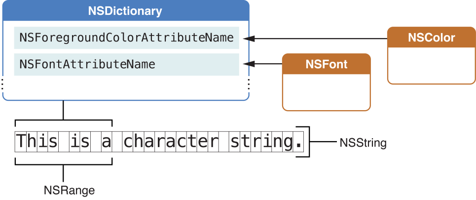

> 导航：[总目录](../../README.md) · [documentation](../../_indexes/documentation.md) · [Cocoa Text Architecture Guide](About%20the%20Cocoa%20Text%20System.md)

[Next](Font%20Handling.md)[Previous](Text%20Fields%2C%20Text%20Views%2C%20and%20the%20Field%20Editor.md)

# Text Attributes

The Cocoa text system handles five kinds of text attributes: character attributes, temporary attributes, paragraph attributes, glyph attributes, and document attributes. Character attributes include traits such as font, color, and subscript, which can be associated with an individual character or a range of characters. Temporary attributes are character attributes that apply only to a particular layout and are not persistent. Paragraph attributes are traits such as indentation, tabs, and line spacing. Glyph attributes affect the way the layout manager renders glyphs and include traits such as overstriking the previous glyph. Document attributes include document-wide traits such as paper size, margins, and view zoom percentage.

This chapter provides a brief introduction to the various types of text attributes with cross-references to more detailed documentation.

The text system stores character attributes persistently in attributed strings along with the characters to which they apply. The text system’s predefined character attributes control the appearance of characters (font, foreground color, background color, and ligature handling) and their placement (superscript, baseline offset, and kerning).

Two special character attributes pertain to links and attachments. A link attribute points to a URL (encapsulated in an `NSURL` object) or any other object of your choice. An attachment attribute is associated with a special attachment character and points to an `NSFileWrapper` object containing the attached file or in-memory data.

The predefined character attribute [NSCharacterShapeAttributeName](https://developer.apple.com/documentation/appkit/nscharactershapeattributename) enables you to set a value for the character shape feature used in font rendering by Apple Type Services. This feature is currently used to specify traditional shapes in Chinese and Japanese scripts, but font developers could use it for other scripts as well.

The predefined character attribute [NSGlyphInfoAttributeName](https://developer.apple.com/documentation/appkit/nsglyphinfoattributename) points to an `NSGlyphInfo` object that provides a means to override the standard glyph generation process and substitute a specified glyph over the attribute’s range.

An attributed string stores character attributes as key-value pairs in `NSDictionary` objects. The key is an attribute name, represented by an identifier (an `NSString` constant) such as `NSFontAttributeName`. Figure 5-1 shows an attributed string with an attribute dictionary applied to a range within the string.

__Figure 5-1__  The composition of an NSAttributedString object including its attributes dictionary

Conceptually, each character in an attributed string has an associated dictionary of attributes. Typically, however, an attribute dictionary applies to a longer range of characters. The `NSAttributedString` class provides methods that take a character index and return the associated attribute dictionary and the range to which its attribute values apply. See [Accessing Attributes](https://developer.apple.com/library/archive/documentation/Cocoa/Conceptual/TextAttributes/AccessingAttrs.html#//apple_ref/doc/uid/20000161) for more information about using these methods.

In addition to the predefined attributes, you can assign any attribute key-value pair you wish to a range of characters. You add the attributes to the appropriate character range in the `NSTextStorage` object using the `NSMutableAttributedString` method [addAttribute:value:range:](https://developer.apple.com/library/archive/documentation/LegacyTechnologies/WebObjects/WebObjects_3.5/Reference/Frameworks/ObjC/Foundation/Classes/NSAttributedStrngClstr/Description.html#//apple_ref/occ/instm/NSMutableAttributedString/addAttribute:value:range:). You can also create an `NSDictionary` object containing the names and values of a set of custom attributes and add them to the character range in a single step using the [addAttributes:range:](https://developer.apple.com/library/archive/documentation/LegacyTechnologies/WebObjects/WebObjects_3.5/Reference/Frameworks/ObjC/Foundation/Classes/NSAttributedStrngClstr/Description.html#//apple_ref/occ/instm/NSMutableAttributedString/addAttributes:range:) method. To make use of your custom attributes, you need a custom subclass of `NSLayoutManager` that understands what to do with them. Your subclass should override the [drawGlyphsForGlyphRange:atPoint:](https://developer.apple.com/documentation/appkit/nslayoutmanager/1403158-drawglyphsforglyphrange) method first to call the superclass to draw the glyph range, then draw your own attributes on top, or else draw the glyphs entirely your own way.

Editing attributed strings can cause inconsistencies that must be cleaned up by _attribute fixing_. The AppKit extensions to `NSMutableAttributedString` define `fix...` methods to fix inconsistencies among attachment, font, and paragraph attributes. These methods ensure that attachments don’t remain after their attachment characters are deleted, that font attributes apply only to characters available in that font, and that paragraph attributes are consistent throughout paragraphs.

See _[Attributed String Programming Guide](../Cocoa/Attributed%20String%20Programming%20Guide/Introduction%20to%20Attributed%20String%20Programming%20Guide.md#apple-f4xwc4dqnrsv64tfmyxwi33df52wszbpgeydambqgaztm2i)_ for more details about character attributes and attribute fixing.

Temporary attributes are character attributes that are not stored with an attributed string. Rather, the layout manager assigns temporary attributes during the layout process and uses them only when drawing the text. For example, you can use temporary attributes to underline misspelled words or color key words in a programming language.

Temporary attributes affect only the appearance of text, not the way in which it is laid out. You store temporary attributes in an `NSDictionary` object using the same keys as regular character attributes, or using custom attribute names (if you have an `NSLayoutManager` subclass that can handle them). Then you add the attributes using an `NSLayoutManager` method such as [addTemporaryAttributes:forCharacterRange:](https://developer.apple.com/documentation/appkit/nslayoutmanager/1403250-addtemporaryattributes). By default, the only temporary attributes recognized are those affecting color and underlines. During layout, temporary attributes supersede regular character attributes. So, for example, if a character has a stored `NSForegroundColorAttributeName` value specifying blue and a temporary attribute of the same identifier specifying red, then the character is rendered in red.

For more information on temporary attributes, see _[NSLayoutManager Class Reference](https://developer.apple.com/documentation/uikit/nslayoutmanager)_.

Paragraph attributes affect the way the layout manager arranges lines of text into paragraphs on a page. The text system encapsulates paragraph attributes in objects of the `NSParagraphStyle` class. The value of one of the predefined character attributes, `NSParagraphStyleAttributeName`, points to an `NSParagraphStyle` object containing the paragraph attributes for that character range. Attribute fixing ensures that only one `NSParagraphStyle` object pertains to the characters throughout each paragraph.

Paragraph attributes include traits such as alignment, tab stops, line-breaking mode, and line spacing (also known as leading). Users of text applications control paragraph attributes through ruler views, defined by the `NSRulerView` class.

See _[Ruler and Paragraph Style Programming Topics](../Cocoa/Ruler%20and%20Paragraph%20Style%20Programming%20Topics/Introduction%20to%20Rulers%20and%20Paragraph%20Styles.md#apple-f4xwc4dqnrsv64tfmyxwi33df52wszbpgeydambqga4ds2i)_ for more details about paragraph attributes.

Glyphs are the concrete representations of characters that the text system actually draws on a display. Glyph attributes are not complex data structures like character attributes but are simply integer values that the layout manager uses to denote special handling for particular glyphs during rendering.

The text system uses glyph attributes rarely, and applications should have little reason to be concerned with them. Nonetheless, `NSLayoutManager` provides public methods that handle glyph attributes, so you can use subclasses to extend the mechanism to handle custom glyph attributes if necessary.

The glyph generator sets built-in glyph attributes as required on glyphs during typesetting. They are maintained in the layout manager’s glyph cache during that process, but they are not stored persistently. Two examples of glyph attributes are the elastic attribute for spaces, used to lay out fully justified text, and the attribute [NSGlyphAttributeInscribe](https://developer.apple.com/documentation/appkit/1403100-glyph_attributes/nsglyphattributeinscribe), which is used for situations such as drawing an umlaut over a character when the font does not include a built-in character-with-umlaut.

For more information about glyph attributes, see the description of the [setIntAttribute:value:forGlyphAtIndex:](https://developer.apple.com/documentation/appkit/nslayoutmanager/1403237-setintattribute) method in _[NSLayoutManager Class Reference](https://developer.apple.com/documentation/uikit/nslayoutmanager)_.

Document attributes pertain to a document as a whole. Document attributes include traits such as paper size, margins, and view zoom percentage. Although the text system has no built-in mechanism to store document attributes, initialization methods such as [initWithRTF:documentAttributes:](https://developer.apple.com/documentation/foundation/nsattributedstring/1532912-init) can populate an `NSDictionary` object that you provide with document attributes derived from a stream of RTF or HTML data. Conversely, methods that write RTF data, such as [RTFFromRange:documentAttributes:](https://developer.apple.com/documentation/foundation/nsattributedstring/1535158-rtffromrange), write document attributes if you pass a reference to an `NSDictionary` object containing them with the message.

See [RTF Files and Attributed Strings](https://developer.apple.com/library/archive/documentation/Cocoa/Conceptual/TextAttributes/RTFAndAttrStrings.html#//apple_ref/doc/uid/20000164) and _NSAttributedString Application Kit Additions Reference_ for more information.

[Next](Font%20Handling.md)[Previous](Text%20Fields%2C%20Text%20Views%2C%20and%20the%20Field%20Editor.md)

