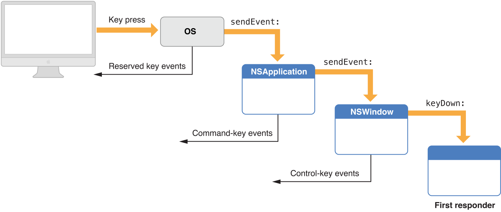
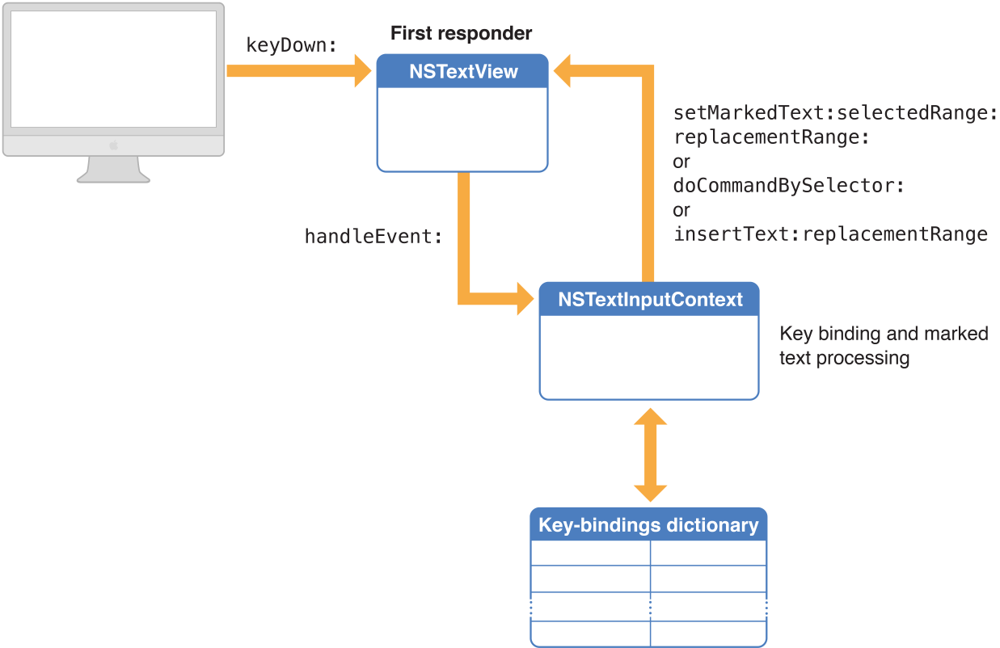
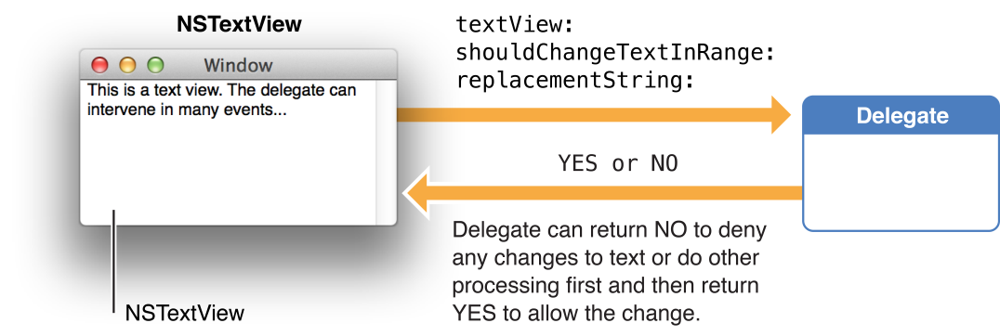

> 导航：[总目录](../../README.md) · [documentation](../../_indexes/documentation.md) · [Cocoa Text Architecture Guide](About%20the%20Cocoa%20Text%20System.md)


[Next](Document%20Revision%20History.md)[Previous](Font%20Handling.md)

# Text Editing

This chapter describes ways in which you can control the behavior of the Cocoa text system as it performs text editing. Text editing is the modification of text characters or attributes by interacting with text objects. Usually, editing is performed by direct user action with a text view, but it can also be accomplished by programmatic interaction with a text storage object. This document also discusses the text input system that translates keyboard events into commands and text input.

The Cocoa text system implements a sophisticated editing mechanism that enables input and modification of complex text character and style information. It is important to understand this mechanism if your code needs to hook into it to modify that behavior.

The text system provides a number of control points where you can customize the editing behavior:

- Text system classes provide methods to control many of the ways in which they perform editing.
- You can implement more control through the Cocoa mechanisms of notification and delegation.
- In extreme cases where the capabilities of the text system are not suitable, you can replace the text view with a custom subclass.

Text editing is performed by a text view object. Typically, a text view is an instance of `NSTextView` or a subclass. A text view provides the front end to the text system. It displays the text, handles the user events that edit the text, and coordinates changes to the stored text required by the editing process. `NSTextView` implements methods that perform editing, manage the selection, and handle formatting attributes affecting the layout and display of the text.

`NSTextView` has a number of methods that control the editing behavior available to the user. For example, `NSTextView` allows you to grant or deny the user the ability to select or edit its text, using the [setSelectable:](https://developer.apple.com/documentation/appkit/nstextview/1449297-isselectable) and [setEditable:](https://developer.apple.com/documentation/appkit/nstextview/1449345-iseditable) methods. `NSTextView` also implements the distinction between plain and rich text defined by `NSText` with its [setRichText:](https://developer.apple.com/documentation/appkit/nstextview/1449538-richtext) and [setImportsGraphics:](https://developer.apple.com/documentation/appkit/nstextview/1449266-importsgraphics) methods. See _[Text System User Interface Layer Programming Guide](../Cocoa/Text%20System%20User%20Interface%20Layer%20Programming%20Guide/Introduction%20to%20Text%20System%20User%20Interface%20Layer.md#apple-f4xwc4dqnrsv64tfmyxwi33df52wszbpgeydambqga4ta2i)_, _[NSTextView Class Reference](https://developer.apple.com/documentation/appkit/nstextview)_, and _[NSText Class Reference](https://developer.apple.com/documentation/appkit/nstext)_ for more information.

An editable text view can operate in either of two distinct editing modes: as a normal text editor or as a field editor. A field editor is a single text view instance shared by many text fields belonging to a window in an application. This sharing results in a performance gain. When a text field becomes the first responder, the window inserts the field editor in its place in the responder chain. A normal text editor accepts Tab and Return characters as input, whereas a field editor interprets Tab and Return as cues to end editing. The `NSTextView` method [setFieldEditor:](https://developer.apple.com/documentation/appkit/nstextview/1449156-fieldeditor) controls this behavior.

See [Working with the Field Editor](#apple-f4xwc4dqnrsv64tfmyxwi33df52wszbpkridimbqga4tinjzfvbuqmznknlteoi) for more information about the field editor.

When you want to modify the way in which Cocoa edits text, it’s helpful to understand the message sequence that defines the editing mechanism, so you can select the most appropriate point at which to add your custom behavior.

The message sequence invoked when a text view receives key events involves four methods declared by `NSResponder`. When the user presses a key, the operating system handles certain reserved key events and sends others to the `NSApplication` object, which handles Command-key events as key equivalents. The key events not handled are sent by the application object to the key window, which processes key events mapped to keyboard navigation actions (such as Tab moving focus on the next view) and sends other key events to the first responder. Figure 7-1 illustrates this sequence.

__Figure 7-1__  Key-event processing



If the first responder is a text view, the key event enters the text system. The key window sends the text view a [keyDown:](https://developer.apple.com/documentation/appkit/nsresponder/1525805-keydown) message with the event as its argument. The `keyDown:` method passes the event to [handleEvent:](https://developer.apple.com/documentation/appkit/nstextinputcontext/1528602-handleevent), which sends the character input to the input context for key binding and interpretation. In response, the input context sends either [insertText:replacementRange:](https://developer.apple.com/documentation/appkit/nstextinputclient/1438258-inserttext), [setMarkedText:selectedRange:replacementRange:](https://developer.apple.com/documentation/appkit/nstextinputclient/1438246-setmarkedtext), or [doCommandBySelector:](https://developer.apple.com/documentation/appkit/nstextinputclient/1438256-docommand) to the text view. Figure 7-2 illustrates the sequence of text-input event processing.

__Figure 7-2__  Input context key binding and interpretation



The text input system uses a dictionary property list, called a _key-bindings dictionary_, to interpret keyboard events before passing them to the Input Method Kit framework for mapping to characters.

During the processing of a keyboard event, the event passes through the `NSMenu` object, then to the first responder via the [keyDown:](https://developer.apple.com/documentation/appkit/nsresponder/1525805-keydown) method. The default implementation of the method provided by the `NSResponder` class propagates the message up the responder chain until an overridden `keyDown:` implementation stops the propagation. Typically, an `NSResponder` subclass can choose to process certain keys and ignore others (for example, in a game) or to send the [handleEvent:](https://developer.apple.com/documentation/appkit/nstextinputcontext/1528602-handleevent) message to its input context.

The input context checks the event to see if it matches any of the keystrokes in the user’s key-bindings dictionary. A key-bindings dictionary maps a keystroke (including its modifier keys) to a method name. For example, the default key-bindings dictionary maps `^d` (Control-D) to the method name `deleteForward:`. If the keyboard event is in the dictionary, then the input context calls the text view’s [doCommandBySelector:](https://developer.apple.com/documentation/appkit/nstextinputclient/1438256-docommand) method with the selector associated with the dictionary entry.

If the input context cannot match the keyboard event to an entry in the key-bindings dictionary, it passes the event to the Input Method Kit for mapping to characters.

The standard key-bindings dictionary is in the file `/System/Library/Frameworks/AppKit.framework/Resources/StandardKeyBinding.dict`.
You can override the standard dictionary entirely by providing a dictionary file at the path `~/Library/KeyBindings/DefaultKeyBinding.dict`. However, defining custom key bindings dynamically (that is, while the application is running) is not supported.

For more information about text-input key event processing, see “[Text System Defaults and Key Bindings](https://developer.apple.com/library/archive/documentation/Cocoa/Conceptual/EventOverview/TextDefaultsBindings/TextDefaultsBindings.html#//apple_ref/doc/uid/20000468)” in _[Cocoa Event Handling Guide](../Cocoa/Cocoa%20Event%20Handling%20Guide/Introduction.md#apple-f4xwc4dqnrsv64tfmyxwi33df52wszbpgeydambqga3da2i)_.

When the text view has enough information to specify an actual change to its text, it sends an editing message to its `NSTextStorage` object to effect the change. The methods that change character and attribute information in the text storage object are declared in the `NSTextStorage` superclass `NSMutableAttributedString`, and they depend on the two primitive methods [replaceCharactersInRange:withString:](https://developer.apple.com/library/archive/documentation/LegacyTechnologies/WebObjects/WebObjects_3.5/Reference/Frameworks/ObjC/Foundation/Classes/NSAttributedStrngClstr/Description.html#//apple_ref/occ/instm/NSMutableAttributedString/replaceCharactersInRange:withString:) and [setAttributes:range:](https://developer.apple.com/library/archive/documentation/LegacyTechnologies/WebObjects/WebObjects_3.5/Reference/Frameworks/ObjC/Foundation/Classes/NSAttributedStrngClstr/Description.html#//apple_ref/occ/instm/NSMutableAttributedString/setAttributes:range:). The text storage object then informs its layout managers of the change to initiate glyph generation and layout when necessary, and it posts notifications and sends delegate messages before and after processing the edits. For more information about the interaction of text view, text storage, and layout manager objects, see _[Text Layout Programming Guide](../Cocoa/Text%20Layout%20Programming%20Guide/Introduction%20to%20Text%20Layout%20Programming%20Guide.md#apple-f4xwc4dqnrsv64tfmyxwi33df52wszbpgeydambqge2tq2i)_.

This section explains how to catch key events received by a text view so that you can modify the result. It also explains the message sequence that occurs when a text view receives a key event.

You need to intercept key events, for example, if you want users to be able to insert a line-break character in a text field. By default, text fields hold only one line of text. Pressing either Enter or Return causes the text field to end editing and send its action message to its target, so you would need to modify the behavior.

You may also wish to intercept key events in a text view to do something different from simply entering characters in the text being displayed by the view, such as changing the contents of an in-memory buffer.

In both circumstances you need to deal with the text view object, which is obvious for the text view case but less so for a text field. Editing in a text field is performed by an `NSTextView` object, called the _field editor_, shared by all the text fields belonging to a window.

When a text view receives a key event, it sends the character input to the input context for key binding and interpretation. In response, the input context sends either [insertText:replacementRange:](https://developer.apple.com/documentation/appkit/nstextinputclient/1438258-inserttext) or [doCommandBySelector:](https://developer.apple.com/documentation/appkit/nstextinputclient/1438256-docommand) to the text view, depending on whether the key event represents text to be inserted or a command to perform. The input context can also send the [setMarkedText:selectedRange:replacementRange:](https://developer.apple.com/documentation/appkit/nstextinputclient/1438246-setmarkedtext) message to set the marked text in the text view’s associated text storage object. The message sequence invoked when a text view receives key events is described in more detail in [The Key-Input Message Sequence](#apple-f4xwc4dqnrsv64tfmyxwi33df52wszbpgiydambqhezdsljvga2dsni).

With the standard key bindings, an Enter or Return character causes the text view to receive `doCommandBySelector:` with a selector of `insertNewline:`, which can have one of two results. If the text view is not a field editor, the text view’s `insertText:replacementRange:` method inserts a line-break character. If the text view is a field editor, as when the user is editing a text field, the text view ends editing instead. You can cause a text view to behave in either way by calling [setFieldEditor:](https://developer.apple.com/documentation/appkit/nstextview/1449156-fieldeditor).

Although you could alter the text view’s behavior by subclassing the text view and overriding `insertText:replacementRange:` and `doCommandBySelector:`, a better solution is to handle the event in the text view’s delegate. The delegate can take control over user changes to text by implementing the [textView:shouldChangeTextInRange:replacementString:](https://developer.apple.com/documentation/appkit/nstextviewdelegate/1449325-textview) method.

To handle keystrokes that don’t insert text, the delegate can implement the [textView:doCommandBySelector:](https://developer.apple.com/documentation/appkit/nstextviewdelegate/1449419-textview) method.

To distinguish between Enter and Return, for example, the delegate can test the selector passed with `doCommandBySelector:`. If it is `@selector(insertNewline:)`, you can send [currentEvent](https://developer.apple.com/documentation/appkit/nsapplication/1428668-currentevent) to the `NSApp` object to make sure the event is a key event and, if so, which key was pressed.

Delegation provides a powerful mechanism for modifying editing behavior because you can implement methods in the delegate that can then perform editing commands in place of the text view, a technique called _delegation of implementation_. `NSTextView` gives its delegate this opportunity to handle a command by sending it a `textView:doCommandBySelector:` message whenever it receives a `doCommandBySelector:` message from the input context. If the delegate implements this method and returns `YES`, the text view does nothing further; if the delegate returns `NO`, the text view must try to perform the command itself.

Before a text view makes any change to its text, it sends its delegate a [textView:shouldChangeTextInRange:replacementString:](https://developer.apple.com/documentation/appkit/nstextviewdelegate/1449325-textview) message, which returns a Boolean value. (As with all delegate messages, it sends the message only if the delegate implements the method.) This mechanism provides the delegate with an opportunity to control all editing of the character and attribute data in the text storage object associated with the text view.

An `NSTextView` object can have a delegate that it informs of certain actions or pending changes to the state of the text. The delegate can be any object you choose, and one delegate can control multiple `NSTextView` objects (or multiple series of connected `NSTextView` objects). Figure 7-3 illustrates the activity of the delegate of an `NSTextView` object receiving the delegate message [textView:shouldChangeTextInRange:replacementString:](https://developer.apple.com/documentation/appkit/nstextviewdelegate/1449325-textview).

__Figure 7-3__  Delegate of an NSTextView object



_[NSTextDelegate Protocol Reference](https://developer.apple.com/documentation/appkit/nstextdelegate)_ and _[NSTextViewDelegate Protocol Reference](https://developer.apple.com/documentation/appkit/nstextviewdelegate)_ describe the delegate messages the delegate can receive. The delegating object sends a message only if the delegate implements the method.

All `NSTextView` objects attached to the same `NSLayoutManager` share the same delegate. Setting the delegate of one such text view sets the delegate for all the others. Delegate messages pass the `id` of the sender as an argument.

The notifications posted by `NSTextView` are:

- [NSTextDidBeginEditingNotification](https://developer.apple.com/documentation/appkit/nstext/1534839-didbegineditingnotification)
- [NSTextDidEndEditingNotification](https://developer.apple.com/documentation/appkit/nstextdidendeditingnotification)
- [NSTextDidChangeNotification](https://developer.apple.com/documentation/appkit/nstextdidchangenotification)
- [NSTextViewDidChangeSelectionNotification](https://developer.apple.com/documentation/appkit/nstextview/1449275-didchangeselectionnotification)
- [NSTextViewWillChangeNotifyingTextViewNotification](https://developer.apple.com/documentation/appkit/nstextviewwillchangenotifyingtextviewnotification)

It is particularly important for observers to register for the last of these notifications. If a new `NSTextView` object is added at the beginning of a series of connected `NSTextView` objects, it becomes the new notifying text view. It doesn’t have access to which objects are observing its group of text objects, so it posts an `NSTextViewWillChangeNotifyingTextViewNotification`, which allows all those observers to unregister themselves from the old notifying text view and reregister themselves with the new one. For more information, see the description for this notification in _[NSTextView Class Reference](https://developer.apple.com/documentation/appkit/nstextview)_.

Text fields (that is, instances of `NSTextField`, as opposed to instances of `NSTextView`) can also use delegation to control their editing behavior. One way in which this is done is for the text field itself to designate a delegate. Typically, you do this in Interface Builder by Control-dragging from the text field object to the delegate object, but you can also do it at run time by sending the text field a [setDelegate:](https://developer.apple.com/documentation/appkit/nstextfield/1399437-delegate) message, for example, in an [awakeFromNib](https://developer.apple.com/documentation/objectivec/nsobject/1402907-awakefromnib) method. The delegate must respond to the messages defined by the `NSTextFieldDelegate` protocol (which adopts the `NSControlTextEditingDelegate` protocol). In addition to the methods defined by the `NSControlTextEditingDelegate` protocol, a text field delegate can respond to the delegate methods of `NSControl`.

As an example of how a text field’s delegate can control its editing behavior, you can disable text completion in a text field by having its delegate implement the delegate method [control:textView:completions:forPartialWordRange:indexOfSelectedItem:](https://developer.apple.com/documentation/appkit/nscontroltexteditingdelegate/1428925-control) simply to return `nil`.

Another way in which you can customize editing behavior in a text field by delegation involves the field editor, an `NSTextView` object that handles the actual editing, in turn, for all the text fields in a window. The field editor automatically designates any text field it is editing as its delegate, so you can encapsulate special editing behavior for a text field with the text field itself by implementing the delegate methods defined by `NSTextDelegate` and `NSTextViewDelegate` protocols. For information about controlling the editing behavior of text fields through delegate messages and notifications sent by the field editor, see [Using Delegation and Notification with the Field Editor](#apple-f4xwc4dqnrsv64tfmyxwi33df52wszbpgiydambrhaytkljrgmytcnrv).

The editing process involves careful synchronization of the complex interaction of various objects. The text system coordinates event processing, data modification, responder chain management, glyph generation, and layout to maintain consistency in the text data model.

The system provides a rich set of notifications to delegates and observers to enable your code to interact with this logic, as described in [Text View Delegate Messages and Notifications](#apple-f4xwc4dqnrsv64tfmyxwi33df52wszbpkridimbqga4tinjzfvbuqmznknltq).

If your code needs to modify the text backing store directly, you should use batch-editing mode; that is, bracket the changes between the `NSMutableAttributedString` methods [beginEditing](https://developer.apple.com/library/archive/documentation/LegacyTechnologies/WebObjects/WebObjects_3.5/Reference/Frameworks/ObjC/Foundation/Classes/NSAttributedStrngClstr/Description.html#//apple_ref/occ/instm/NSMutableAttributedString/beginEditing) and [endEditing](https://developer.apple.com/library/archive/documentation/LegacyTechnologies/WebObjects/WebObjects_3.5/Reference/Frameworks/ObjC/Foundation/Classes/NSAttributedStrngClstr/Description.html#//apple_ref/occ/instm/NSMutableAttributedString/endEditing). Although this bracketing is not strictly necessary, it’s good practice, and it’s important for efficiency if you’re making multiple changes in succession. `NSTextView` uses the `beginEditing` and `endEditing` methods to synchronize its editing activity, and you can use the methods directly to control the timing of notifications to delegates, observers, and associated layout managers. When the `NSTextStorage` object is in batch-editing mode, it refrains from informing its layout managers of any editing changes until it receives the `endEditing` message.

The “beginning of editing” means that a series of modifications to the text backing store (`NSTextStorage` for text views and cell values for cells) is about to occur. Bracketing editing between `beginEditing` and `endEditing` locks down the text storage to ensure that text modifications are atomic transactions.

The “end of editing” means that the backing store is in a consistent state after modification. In cells (such as `NSTextFieldCell` objects, which control text editing in text fields), the end of editing coincides with the field editor resigning first responder status, which triggers synchronization of the contents of the field editor and its parent cell.

In addition, the text view sends `NSTextDidEndEditingNotification` when it completes modifying its backing store, regardless of its first responder status. For example, it sends out this notification when the Replace All button is clicked in the Find window, even if the text view is not the first responder.

Listing 7-1 illustrates a situation in which the `NSText` method [scrollRangeToVisible:](https://developer.apple.com/documentation/appkit/nstext/1529884-scrollrangetovisible) forces layout to occur and raises an exception.

__Listing 7-1__  Forcing layout

```
[[myTextView textStorage] beginEditing];
[[myTextView textStorage] replaceCharactersInRange:NSMakeRange(0,0)
        withString:@"Hello to you!"];
[myTextView scrollRangeToVisible:NSMakeRange(0,13)]; //BOOM
[[myTextView textStorage] endEditing];
```

Scrolling a character range into visibility requires layout to be complete through that range so the text view can know where the range is located. But in Listing 7-1, the text storage is in batch-editing mode. It is in an inconsistent state, so the layout manager has no way to do layout at this time. Moving the `scrollRangeToVisible:` call after `endEditing` would solve the problem.

There are additional actions that you should take if you implement new user actions in a text view, such as a menu action or key binding method that changes the text. For example, you can modify the selected range of characters using the `NSTextView` method [setSelectedRange:](https://developer.apple.com/documentation/appkit/nstextview/1449256-setselectedrange), depending on the type of change performed by the command, using the results of the `NSTextView` methods [rangeForUserTextChange](https://developer.apple.com/documentation/appkit/nstextview/1449315-rangeforusertextchange), [rangeForUserCharacterAttributeChange](https://developer.apple.com/documentation/appkit/nstextview/1449392-rangeforusercharacterattributech), or [rangeForUserParagraphAttributeChange](https://developer.apple.com/documentation/appkit/nstextview/1449252-rangeforuserparagraphattributech). For example, `rangeForUserParagraphAttributeChange` returns the entire paragraph containing the original selection—that is the range affected if your action modifies paragraph attributes. Also, you should call [textView:shouldChangeTextInRange:replacementString:](https://developer.apple.com/documentation/appkit/nstextviewdelegate/1449325-textview) before you make the change and [didChangeText](https://developer.apple.com/documentation/appkit/nstextview/1449296-didchangetext) afterwards. These actions ensure that the correct text gets changed and the system sends the correct notifications and delegate messages to the text view’s delegate. See [Subclassing NSTextView](#apple-f4xwc4dqnrsv64tfmyxwi33df52wszbpkridimbqga4tinjzfvbuqmznknltcnq) for more information.

There may be situations in which you need to force the text system to end editing programmatically so you can take some action dependent on notifications being sent. In such a case, you don’t need to modify the editing mechanism but simply stimulate its normal behavior.

To force the end of editing in a text view, which subsequently sends a [textDidEndEditing:](https://developer.apple.com/documentation/appkit/nstextdelegate/1529016-textdidendediting) message to its delegate, you can observe the window’s [NSWindowDidResignKeyNotification](https://developer.apple.com/documentation/appkit/nswindow/1419281-didresignkeynotification) notification. Then, in the observer method, send [makeFirstResponder:](https://developer.apple.com/documentation/appkit/nswindow/1419366-makefirstresponder) to the window to finish any editing in progress while the window was active. Otherwise, the control that is currently being edited remains the first responder of the window and does not end editing.

Listing 7-2 presents an implementation of the `textDidEndEditing:` delegate method that ends editing in an `NSTableView` subclass. By default, when the user is editing a cell in a table view and presses Tab or Return, the field editor ends editing in the current cell and begins editing the next cell. In this case, you want to end editing altogether if the user presses Return. This method distinguishes which key the user pressed; for Tab it does the normal behavior, and for Return it forces the end of editing completely by making the window first responder.

__Listing 7-2__  Forcing the end of editing

```objc
- (void)textDidEndEditing:(NSNotification *)notification {
    if([[[notification userInfo] valueForKey:@"NSTextMovement"] intValue] ==
                        NSReturnTextMovement) {
        NSMutableDictionary *newUserInfo;
        newUserInfo = [[NSMutableDictionary alloc]
                            initWithDictionary:[notification userInfo]];
        [newUserInfo setObject:[NSNumber numberWithInt:NSIllegalTextMovement]
                                forKey:@"NSTextMovement"];
        notification = [NSNotification notificationWithName:[notification name]
                                object:[notification object]
                                userInfo:newUserInfo];
        [super textDidEndEditing:notification];
        [[self window] makeFirstResponder:self];
    } else {
        [super textDidEndEditing:notification];
    }
}
```


Usually the user clicks a view object in a window to set the focus, or first responder status, so that subsequent keyboard events go to that object initially. Likewise, the user usually creates a selection by dragging the mouse in a view. However, you can set both the focus and the selection programmatically.

For example, if you have a window that contains a text view, and you want that text view to become the first responder with the insertion point located at the beginning of any text currently in the text view, you need a reference to the window and the text view. If those references are `theWindow` and `theTextView`, respectively, you can use the following code to set the focus and the insertion point, which is simply a zero-length selection range:

```
[theWindow makeFirstResponder: theTextView];
[theTextView setSelectedRange: NSMakeRange(0,0)];
```

When an object conforming to the `NSTextInputClient` protocol becomes the first responder in the key window, its `NSTextInputContext` object becomes active and bound to the active text input sources, such as character palette, keyboards, and input methods.

Whether the selection was set programmatically or by the user, you can get the range of characters currently selected using the [selectedRange](https://developer.apple.com/documentation/appkit/nstext/1526227-selectedrange) method. `NSTextView` indicates its selection by applying a special set of attributes to it. The [selectedTextAttributes](https://developer.apple.com/documentation/appkit/nstextview/1449270-selectedtextattributes) method returns these attributes, and [setSelectedTextAttributes:](https://developer.apple.com/documentation/appkit/nstextview/1449270-selectedtextattributes) sets them.

While changing the selection in response to user input, an `NSTextView` object invokes its own [setSelectedRange:affinity:stillSelecting:](https://developer.apple.com/documentation/appkit/nstextview/1449462-setselectedrange) method. The first parameter is the range to select. The second, called the selection affinity, determines which glyph the insertion point displays near when the two glyphs defining the selected range are not adjacent. It’s typically used where the selected lines wrap to place the insertion point at the end of one line or the beginning of the following line. You can get the selection affinity currently in effect using the [selectionAffinity](https://developer.apple.com/documentation/appkit/nstextview/1449291-selectionaffinity) method. The last parameter indicates whether the selection is still in the process of changing; the delegate and any observers aren’t notified of the change in the selection until the method is invoked with `NO` for this argument.

Another factor affecting selection behavior is the selection granularity: whether characters, words, or whole paragraphs are being selected. This is usually determined by the number of initial mouse clicks; for example, a double click initiates word-level selection. `NSTextView` decides how much to change the selection during input tracking using its [selectionRangeForProposedRange:granularity:](https://developer.apple.com/documentation/appkit/nstextview/1449188-selectionrangeforproposedrange) method.

An additional aspect of selection, related to input management, is the range of marked text. As the input context interprets keyboard input, it can mark incomplete input in a special way. The text view displays this marked text differently from the selection, using temporary attributes that affect only display, not layout or storage. For example, `NSTextView` uses marked text to display a combination key, such as Option-E, which places an acute accent character above the character entered next. When the user types Option-E, the text view displays an acute accent in a yellow highlight box, indicating that it is marked text, rather than final input. When the user types the next character, the text view displays it as a single accented character, and the marked text highlight disappears. The [markedRange](https://developer.apple.com/documentation/appkit/nstextinputclient/1438250-markedrange) method returns the range of any marked text, and [markedTextAttributes](https://developer.apple.com/documentation/appkit/nstextview/1449179-markedtextattributes) returns the attributes used to highlight the marked text. You can change these attributes using [setMarkedTextAttributes:](https://developer.apple.com/documentation/appkit/nstextview/1449179-markedtextattributes).

Using `NSTextView` directly is the easiest way to interact with the text system, and its delegate mechanism provides an extremely flexible way to modify its behavior. In cases where delegation does not provide required behavior, you can subclass `NSTextView`.

The text system requires `NSTextView` subclasses to abide by certain rules of behavior, and `NSTextView` provides many methods to help subclasses do so. Some of these methods are meant to be overridden to add information and behavior into the basic infrastructure. Some are meant to be invoked as part of that infrastructure when the subclass defines its own behavior.

`NSTextView` automatically updates the Fonts window and ruler as its selection changes. If you add any new font or paragraph attributes to your subclass of `NSTextView`, you’ll need to override the methods that perform this updating to account for the added information. The [updateFontPanel](https://developer.apple.com/documentation/appkit/nstextview/1449401-updatefontpanel) method makes the Fonts window display the font of the first character in the selection. You could override this method to update the display of an accessory view in the Fonts window. Similarly, [updateRuler](https://developer.apple.com/documentation/appkit/nstextview/1449323-updateruler) causes the ruler to display the paragraph attributes for the first paragraph in the selection. You can also override this method to customize display of items in the ruler. Be sure to invoke the `super` implementation in your override to have the basic updating performed as well.

`NSTextView` supports pasteboard operations and the dragging of files and colors into its text. If you customize the ability of your subclass to handle pasteboard operations for new data types, you should override the [readablePasteboardTypes](https://developer.apple.com/documentation/appkit/nstextview/1449361-readablepasteboardtypes) and [writablePasteboardTypes](https://developer.apple.com/documentation/appkit/nstextview/1449222-writablepasteboardtypes) methods to reflect those types. Similarly, to support new types of data for dragging operations, you should override the [acceptableDragTypes](https://developer.apple.com/documentation/appkit/nstextview/1449234-acceptabledragtypes) method. Your implementation of these methods should invoke the superclass implementation, add the new data types to the array returned from `super`, and return the modified array.

To read and write custom pasteboard types, you must override the [readSelectionFromPasteboard:type:](https://developer.apple.com/documentation/appkit/nstextview/1449190-readselectionfrompasteboard) and [writeSelectionToPasteboard:type:](https://developer.apple.com/documentation/appkit/nstextview/1449187-writeselectiontopasteboard) methods. In your implementation of these methods, you should read the new data types your subclass supports and let the superclass handle any other types.

For dragging operations, if your subclass’s ability to accept your custom dragging types varies over time, you can override [updateDragTypeRegistration](https://developer.apple.com/documentation/appkit/nstextview/1449181-updatedragtyperegistration) to register or unregister the custom types according to the text view’s current status. By default this method enables dragging of all acceptable types if the receiver is editable and a rich text view.

Your subclass of `NSTextView` can customize the way selections are made for the various granularities (such as character, word, and paragraph) described in[Setting Focus and Selection Programmatically](#apple-f4xwc4dqnrsv64tfmyxwi33df52wszbpkridimbqga4tinjzfvbuqmznknlteoa). While tracking user changes to the selection, an `NSTextView` object repeatedly invokes [selectionRangeForProposedRange:granularity:](https://developer.apple.com/documentation/appkit/nstextview/1449188-selectionrangeforproposedrange) to determine what range to actually select. When finished tracking changes, it sends the delegate a [textView:willChangeSelectionFromCharacterRange:toCharacterRange:](https://developer.apple.com/documentation/appkit/nstextviewdelegate/1449227-textview) message. By overriding the `NSTextView` method or implementing the delegate method, you can alter the way the selection is extended or reduced. For example, in a code editor you can provide a delegate that extends a double click on a brace or parenthesis character to its matching delimiter.

These mechanisms aren’t meant for changing language word definitions (such as what’s selected by a double click). That detail of selection is handled at a lower (and currently private) level of the text system.

If you create a subclass of `NSTextView` to add new capabilities that will change the text in response to user actions, you may need to modify the range selected by the user before actually applying the change. For example, if the user is making a change to the ruler, the change must apply to whole paragraphs, so the selection may have to be extended to paragraph boundaries. Three methods calculate the range to which certain kinds of change should apply. The [rangeForUserTextChange](https://developer.apple.com/documentation/appkit/nstextview/1449315-rangeforusertextchange) method returns the range to which any change to characters themselves—insertions and deletions—should apply. The [rangeForUserCharacterAttributeChange](https://developer.apple.com/documentation/appkit/nstextview/1449392-rangeforusercharacterattributech) method returns the range to which a character attribute change, such as a new font or color, should apply. Finally, [rangeForUserParagraphAttributeChange](https://developer.apple.com/documentation/appkit/nstextview/1449252-rangeforuserparagraphattributech) returns the range for a paragraph-level change, such as a new or moved tab stop or indent. These methods all return a range whose location is `NSNotFound` if a change isn’t possible; you should check the returned range and abandon the change in this case.

In actually making changes to the text, you must ensure that the changes are properly performed and recorded by different parts of the text system. You do this by bracketing each batch of potential changes with [shouldChangeTextInRange:replacementString:](https://developer.apple.com/documentation/appkit/nstextview/1449532-shouldchangetext) and [didChangeText](https://developer.apple.com/documentation/appkit/nstextview/1449296-didchangetext) messages. These methods ensure that the appropriate delegate messages are sent and notifications posted. The first method asks the delegate for permission to begin editing with a [textShouldBeginEditing:](https://developer.apple.com/documentation/appkit/nstextdelegate/1533298-textshouldbeginediting) message. If the delegate returns `NO`, `shouldChangeTextInRange:replacementString:` in turn returns `NO`, in which case your subclass should disallow the change. If the delegate returns `YES`, the text view posts an [NSTextDidBeginEditingNotification](https://developer.apple.com/documentation/appkit/nstext/1534839-didbegineditingnotification), and `shouldChangeTextInRange:replacementString:` in turn returns `YES`. In this case you can make your changes to the text, and follow up by invoking [didChangeText](https://developer.apple.com/documentation/appkit/nstextview/1449296-didchangetext). This method concludes the changes by posting an [NSTextDidChangeNotification](https://developer.apple.com/documentation/appkit/nstextdidchangenotification), which results in the delegate receiving a [textDidChange:](https://developer.apple.com/documentation/appkit/nstextdelegate/1526982-textdidchange) message.

The `textShouldBeginEditing:` and [textDidBeginEditing:](https://developer.apple.com/documentation/appkit/nstextdelegate/1535575-textdidbeginediting) messages are sent only once during an editing session. More precisely, they’re sent upon the first user input since the `NSTextView` became the first responder. Thereafter, these messages—and the `NSTextDidBeginEditingNotification`—are skipped in the sequence. The `textView:shouldChangeTextInRange:replacementString:` method, however, must be invoked for each individual change.

`NSTextView` defines several methods to aid in “smart” insertion and deletion of text, so that spacing and punctuation are preserved after a change. Smart insertion and deletion typically applies when the user has selected whole words or other significant units of text. A smart deletion of a word before a comma, for example, also deletes the space that would otherwise be left before the comma (though not placing it on the pasteboard in a Cut operation). A smart insertion of a word between another word and a comma adds a space between the two words to protect that boundary. `NSTextView` automatically uses smart insertion and deletion by default; you can turn this behavior off using [setSmartInsertDeleteEnabled:](https://developer.apple.com/documentation/appkit/nstextview/1449236-smartinsertdeleteenabled). Doing so causes only the selected text to be deleted, and inserted text to be added, with no addition of white space.

If your subclass of `NSTextView` defines any methods that insert or delete text, you can make them smart by taking advantage of two `NSTextView` methods. The [smartDeleteRangeForProposedRange:](https://developer.apple.com/documentation/appkit/nstextview/1449428-smartdeleterange) method expands a proposed deletion range to include any white space that should also be deleted. If you need to save the deleted text, however, it’s typically best to save only the text from the original range. For smart insertion, [smartInsertForString:replacingRange:beforeString:afterString:](https://developer.apple.com/documentation/appkit/nstextview/1449544-smartinsert) returns by reference two strings that you can insert before and after a given string to preserve spacing and punctuation. See the method descriptions for more information.

A strategy even more complicated than subclassing `NSTextView` is to create your own custom text view object. If you need more sophisticated text handling than `NSTextView` provides, for example in a word processing application, it is possible to create a text view by subclassing `NSView`, implementing the `NSTextInputClient` protocol, and interacting directly with the input management system.

Custom Cocoa views can provide varying levels of support for the text input system. There are essentially three levels of support to choose from:

1. Override the [keyDown:](https://developer.apple.com/documentation/appkit/nsresponder/1525805-keydown) method.
2. 

   Override `keyDown:` and use [handleEvent:](https://developer.apple.com/documentation/appkit/nstextinputcontext/1528602-handleevent) to support key bindings.
3. 

   Also implement the full `NSTextInputClient` protocol.

In the first level of support, the [keyDown:](https://developer.apple.com/documentation/appkit/nsresponder/1525805-keydown) method recognizes a limited set of events and ignores others. This level of support is typical of games. (When overriding [keyDown:](https://developer.apple.com/documentation/appkit/nsresponder/1525805-keydown), you must also override [acceptsFirstResponder](https://developer.apple.com/documentation/appkit/nsresponder/1528708-acceptsfirstresponder) to make your custom view respond to key events, as described in “[Event Handling Basics](https://developer.apple.com/library/archive/documentation/Cocoa/Conceptual/EventOverview/EventHandlingBasics/EventHandlingBasics.html#//apple_ref/doc/uid/10000060i-CH5)” in _[Cocoa Event Handling Guide](../Cocoa/Cocoa%20Event%20Handling%20Guide/Introduction.md#apple-f4xwc4dqnrsv64tfmyxwi33df52wszbpgeydambqga3da2i)_.)

In the second level of support, you can override [keyDown:](https://developer.apple.com/documentation/appkit/nsresponder/1525805-keydown) and use the [handleEvent:](https://developer.apple.com/documentation/appkit/nstextinputcontext/1528602-handleevent) method to receive key-binding support without implementing the `NSTextInputClient` protocol. Because the `NSView` method `inputContext` does not instantiate `NSTextInputContext` automatically if the view does not conform to `NSTextInputClient`, the custom view must instantiate it manually. You then implement the standard key-binding methods that your view wants to support, such as `moveForward:` or `deleteForward:`. (The full list of key-binding methods can be found in `NSResponder.h`.)

If you are writing your own text view from scratch, you should use the third level of support and implement the `NSTextInputClient` protocol in addition to overriding [keyDown:](https://developer.apple.com/documentation/appkit/nsresponder/1525805-keydown) and using [handleEvent:](https://developer.apple.com/documentation/appkit/nstextinputcontext/1528602-handleevent). `NSTextView` and its subclasses are the only classes provided in Cocoa that implement `NSTextInputClient`, and if your application needs more complex behavior than `NSTextView` can provide, as a word processor might, you may need to implement a text view from the ground up. To do this, you must subclass `NSView` and implement the `NSTextInputClient` protocol. (A class implementing this protocol—by inheriting from `NSTextView` or by implementing the protocol directly—is called a _text view_.)

If you are implementing the `NSTextInputClient` protocol, your view needs to manage marked text and communicate with the text input context to support the text input system. These tasks are described in the next two sections.

One of the primary things that a text view must do to cooperate with an input context is to maintain a (possibly empty) range of _marked text_ within its text storage. The text view should highlight text in this range in a distinctive way, and it should allow selection within the marked text. A text view must also maintain an _insertion point_, which is usually at the end of the marked text, but the user can place it within the marked text. The text view also maintains a (possibly empty) _selection_ range within its text storage, and if there is any marked text, the selection must be entirely within the marked text.

A common example of marked text appears when a user enters a character with multiple keystrokes, such as “é”, in an `NSTextView` object. To enter this character, the user needs to type Option-E followed by the E key. After pressing Option-E, the accent mark appears in a highlighted box, indicating that the text is marked (not final). After the final E is pressed, the “é” character appears and the highlight disappears.

A text view and a text input context must cooperate so that the input context can implement its user interface. The `NSTextInputContext` class represents the interface to the text input system, that is, a state or context unique to its client object such as the key binding state, input method communication session, and so on. Most of the `NSTextInputClient` protocol methods are called by an input context to manipulate text within the text view for the input context’s user-interface purposes.

Each `NSTextInputClient`-compliant object (typically an `NSView` subclass) has its own `NSTextInputContext` instance. The default implementation of the `NSView` method `inputContext` manages an `NSTextInputContext` instance automatically if the view subclass conforms to the `NSTextInputClient` protocol.

A text view must inform the current input manager when a mouse or keyboard event happens by sending the [handleEvent:](https://developer.apple.com/documentation/appkit/nstextinputcontext/1528602-handleevent) message to the current input context. When its marked text range is no longer needed, the text view sends a [discardMarkedText](https://developer.apple.com/documentation/appkit/nstextinputcontext/1528752-discardmarkedtext) message to the current input context.

In addition, a text view must tell the input context when position information for a character range changes, such as when the text view scrolls, by sending the [invalidateCharacterCoordinates](https://developer.apple.com/documentation/appkit/nstextinputcontext/1535165-invalidatecharactercoordinates) message to the input context. The input context can then update information previously queried via methods like [firstRectForCharacterRange:actualRange:](https://developer.apple.com/documentation/appkit/nstextinputclient/1438240-firstrect) when, for example, it wants to show a selection pop-up menu for marked text (as with a Japanese input method). There is an optional method, [drawsVerticallyForCharacterAtIndex:](https://developer.apple.com/documentation/appkit/nstextinputclient/1438252-drawsverticallyforcharacteratind), that can inform the text input system whether the protocol-conforming client renders the character at the given index vertically.

The input context generally uses all of the methods in the `NSTextInputClient` protocol. You can also register to receive a notification from the input context when the keyboard layout changes.

For more information, refer to _[NSText Class Reference](https://developer.apple.com/documentation/appkit/nstext)_, _[NSTextView Class Reference](https://developer.apple.com/documentation/appkit/nstextview)_, _[NSView Class Reference](https://developer.apple.com/documentation/appkit/nsview)_, _[NSTextInputContext Class Reference](https://developer.apple.com/documentation/appkit/nstextinputcontext)_, and _[NSTextInputClient Protocol Reference](https://developer.apple.com/documentation/appkit/nstextinputclient)_.

This section explains how the Cocoa text system uses the field editor and how you can modify that behavior. In most cases, you don’t need to be concerned about the field editor because Cocoa handles its operation automatically, behind the scenes. However, it’s good to know of its existence, and it’s possible that in some circumstances you could want to change its behavior.

The text system automatically instantiates the field editor from the `NSTextView` class when the user begins editing text of an `NSControl` object such as a text field. While it is editing, the system inserts the field editor into the responder chain as first responder, so it receives keystroke events in place of the text field or other control object. When the focus shifts to another text field, the field editor attaches itself to that field instead. The field editor designates the current text field as its delegate, which enables the text field to control changes to its contents. This mechanism can be confusing if you’re not familiar with the workings of the field editor, because the `NSWindow` method [firstResponder](https://developer.apple.com/documentation/appkit/nswindow/1419440-firstresponder) returns the field editor, which is not visible, rather than the onscreen object that currently has keyboard focus.

Among its other duties, the field editor maintains the selection for the text fields it edits. Therefore, a text field that's not being edited does not have a selection (unless you cache it).

A field editor is defined by its treatment of certain characters during text input, which is different from an ordinary text view. An ordinary text view inserts a newline when the user presses Return or Enter, it inserts a tab character when the user presses Tab, and it ignores a Shift-Tab. In contrast, a field editor interprets these characters as cues to end editing and resign first responder status, shifting focus to the next object in the key-view loop (or in the case of Shift-Tab, the previous key view).

The end of editing triggers synchronization of the contents of the field editor and the `NSTextFieldCell` object that controls editing in the text field. At that point Cocoa detaches the field editor from the text field and reveals the text field at the top of the view hierarchy.

One of the ways you can control the editing behavior of text fields is by interacting with the field editor through delegation and notification. Because the field editor automatically designates any text field it is editing as its delegate, you can often encapsulate special editing behavior for a text field with the text field itself.

It’s straightforward to change the default behavior of the field editor by implementing delegate methods. For example, the delegate can change the behavior that occurs when the user presses Return while editing a text view. By default, that action ends editing and selects the next control in the key view loop. If, for example, you want pressing Return to end editing but not select the next control, you can implement the [textDidEndEditing:](https://developer.apple.com/documentation/appkit/nstextdelegate/1529016-textdidendediting) delegate method in the text field. The field editor automatically calls this method if the delegate implements it, and passes [NSTextDidEndEditingNotification](https://developer.apple.com/documentation/appkit/nstextdidendeditingnotification). The implementation can examine this notification to discover the event that ended editing and respond appropriately.

Users can easily put newline characters into a text field by pressing Option-Return or Option-Enter. However, there may be situations in which you want to allow users to enter newlines without taking any special action, and you can do so by implementing a delegate method.

The easiest approach is to call `setFieldEditor:NO` on the window's field editor. But, of course, this approach changes the behavior of the field editor for all controls. Another approach is to use the `NSControl` delegate message [control:textShouldBeginEditing:](https://developer.apple.com/documentation/appkit/nscontroltexteditingdelegate/1428865-control), which is sent to a text view’s delegate when the user enters a character into the text field. Because it passes references to both the text view and the field editor, you could test to see if the text view is one into which you want to enter newlines, then simply send `setFieldEditor:NO` to the field editor. However, this method is not called until after the user has entered one character into the text field, and if that character is a newline, it is rejected.

A better method is to implement another `NSControl` delegate method, [control:textView:doCommandBySelector:](https://developer.apple.com/documentation/appkit/nscontroltexteditingdelegate/1428898-control), which enables the text field’s delegate to check whether the user is attempting to insert a newline character and, if so, force to field editor to insert it. The implementation could appear as shown in Listing 7-3.

__Listing 7-3__  Forcing the field editor to enter a newline character

```objc
- (BOOL)control:(NSControl *)control textView:(NSTextView *)fieldEditor
                                    doCommandBySelector:(SEL)commandSelector {
     BOOL retval = NO;
     if (commandSelector == @selector(insertNewline:)) {
         retval = YES;
         [fieldEditor insertNewlineIgnoringFieldEditor:nil];
     }
     return retval;
}
```

This method returns `YES` to indicate that it handles this particular command and `NO` for other commands that it doesn’t handle. This approach has the advantage that it doesn’t change the setup of the field editor but handles just the special case of interest. Because the delegate message includes a reference to the control being edited, you could add a check to restrict the behavior to a particular class, such as `NSTextField`, or an individual subclass.

To customize behavior in ways that go beyond what the delegate can do, you need to define a subclass of `NSTextView` that incorporates your specialized behavior and substitute it for the window’s default field editor.

It’s not necessary to use a custom field editor if you simply need to validate, interpret, format, or even edit the contents of text fields as the user types. You can attach an `NSFormatter`, such as `NSNumberFormatter`, `NSDateFormatter`, or a custom formatter, for that purpose. See _[Data Formatting Guide](../Cocoa/Data%20Formatting%20Guide/Introduction%20to%20Data%20Formatting%20Programming%20Guide%20For%20Cocoa.md#apple-f4xwc4dqnrsv64tfmyxwi33df52wszbpgeydambqgazds2i)_ for more information about using formatters. Delegation and notification also provide many opportunities for you to intervene, as described in [Using Delegation and Notification with the Field Editor](#apple-f4xwc4dqnrsv64tfmyxwi33df52wszbpgiydambrhaytkljrgmytcnrv).

A secure text field is an example of truly specialized handling of data that goes beyond what can be reasonably handled by formatters or delegates. A secure text field must accept text data entered by the user and validate the entries, which are easily done with a regular text field and a formatter. But it must display some bogus characters to keep the real data secret while it preserves the real data for an authentication process or other purpose. Moreover, a secure text field must keep its data safe from unauthorized access by disabling features, such as copy and cut, and possibly encrypting the data. To implement these specialized requirements, it is easiest to deploy a custom field editor. In fact, Cocoa implements a custom field editor in the `NSSecureTextField` class.

Any situation requiring unusual processing of data entered into a text field, or other individualized behavior not available through the standard Cocoa mechanisms, is a good candidate for a custom field editor.

You can substitute your custom field editor in place of the window’s default version by implementing the `NSWindow` delegate method [windowWillReturnFieldEditor:toObject:](https://developer.apple.com/documentation/appkit/nswindowdelegate/1419416-windowwillreturnfieldeditor). You implement this method in the window’s delegate, which could be, for example, the window controller object. The window sends this message to its delegate with itself and the object requesting the field editor as parameters. So, you can test the object and make substitution of your custom field editor dependent on the result. The window continues to use its default field editor for other controls.

For example, the implementation shown in Listing 7-4 tests whether or not the requesting object is instantiated from a custom text field class named `CustomTextField`, and, if it is, returns a custom field editor.

__Listing 7-4__  Substituting a custom field editor

```objc
- (id)windowWillReturnFieldEditor:(NSWindow *)sender toObject:(id)anObject
{
    if ([anObject isKindOfClass:[CustomTextField class]])
    {
        if (!myCustomFieldEditor) {
        myCustomFieldEditor = [[CustomFieldEditor alloc] init];
        [myCustomFieldEditor setFieldEditor:YES];
        }
        return myCustomFieldEditor;
    }
    return nil;
}
```

If the requesting object is not a custom text field or subclass, the delegate method returns `nil` and the window uses its default field editor. This arrangement has the advantage that it does not instantiate the custom field editor unless it is needed.

In OS X v10.6 and later, another way of providing a custom field editor is to override the `NSCell` method [fieldEditorForView:](https://developer.apple.com/documentation/appkit/nscell/1532763-fieldeditor). This method, rather than the window delegate method, is more suitable for custom cell subclasses.

You can find more information about subclassing `NSTextView` in [Subclassing NSTextView](#apple-f4xwc4dqnrsv64tfmyxwi33df52wszbpkridimbqga4tinjzfvbuqmznknltcnq).

This section lists the AppKit methods most directly related to the field editor. You can peruse these tables to understand where Cocoa provides opportunities for you to interact with the field editor. Refer to _[Application Kit Framework Reference](https://developer.apple.com/documentation/appkit)_ for details. The `NSWindow` methods related to the field editor are listed in Table 7-1.

__Table 7-1__  `NSWindow` field editor–related methods

| Method | Description |
| [fieldEditor:forObject:](https://developer.apple.com/documentation/appkit/nswindow/1419647-fieldeditor) | Returns the receiver’s field editor, creating it if needed. |
| [endEditingFor:](https://developer.apple.com/documentation/appkit/nswindow/1419469-endediting) | Forces the field editor to give up its first responder status and prepares it for its next assignment. |
| [windowWillReturnFieldEditor:toObject:](https://developer.apple.com/documentation/appkit/nswindowdelegate/1419416-windowwillreturnfieldeditor) | Delegate method invoked when the field editor of sender is requested by an object. If the delegate’s implementation of this method returns an object other than `nil`, `NSWindow` substitutes it for the field editor. |

The `NSTextFieldCell` method related to the field editor is listed in Table 7-2.

__Table 7-2__  `NSTextFieldCell` field editor–related method

| Method | Description |
| [setUpFieldEditorAttributes:](https://developer.apple.com/documentation/appkit/nstextfieldcell/1447157-setupfieldeditorattributes) | You never invoke this method directly; by overriding it, however, you can customize the field editor. |

The `NSCell` methods related to the field editor are listed in Table 7-3.

__Table 7-3__  `NSCell` field editor–related methods

| Method | Description |
| [fieldEditorForView:](https://developer.apple.com/documentation/appkit/nscell/1532763-fieldeditor) | The primary way to substitute a custom field editor in OS X v10.6 and later. |
| [selectWithFrame:inView:editor:delegate:start:length:](https://developer.apple.com/documentation/appkit/nscell/1527438-selectwithframe) | Uses the field editor passed with the message to select text in a range. |
| [editWithFrame:inView:editor:delegate:event:](https://developer.apple.com/documentation/appkit/nscell/1533600-editwithframe) | Begins editing of the receiver’s text using the field editor passed with the message. |
| [endEditing:](https://developer.apple.com/documentation/appkit/nscell/1535574-endediting) | Ends any editing of text, using the field editor passed with the message, begun with either of the other two `NSCell` field editor–related methods. |

The `NSControl` methods related to the field editor are listed in Table 7-4. The `NSControl` delegate methods listed in Table 7-4 are control-specific versions of the delegate methods and notifications defined by `NSText`. The field editor, derived from `NSText`, initiates sending the delegate messages and notifications through its editing actions.

__Table 7-4__  `NSControl` field editor–related methods

| Method | Description |
| [abortEditing](https://developer.apple.com/documentation/appkit/nscontrol/1428867-abortediting) | Terminates and discards any editing of text displayed by the receiver and removes the field editor’s delegate. |
| [currentEditor](https://developer.apple.com/documentation/appkit/nscontrol/1428980-currenteditor) | If the receiver is being edited, this method returns the field editor; otherwise, it returns `nil`. |
| [validateEditing](https://developer.apple.com/documentation/appkit/nscontrol/1428855-validateediting) | Sets the object value of the text in a cell of the receiving control to the current contents of the cell’s field editor. |
| [control:textShouldBeginEditing:](https://developer.apple.com/documentation/appkit/nscontroltexteditingdelegate/1428865-control) | Sent directly to the delegate when the user tries to enter a character in a cell of the control passed with the message. |
| [control:textShouldEndEditing:](https://developer.apple.com/documentation/appkit/nscontroltexteditingdelegate/1428984-control) | Sent directly to the delegate when the insertion point tries to leave a cell of the control that has been edited. |
| [controlTextDidBeginEditing:](https://developer.apple.com/documentation/objectivec/nsobject/1428934-controltextdidbeginediting) | Sent by the default notification center to the delegate (and all observers of the notification) when a control begins editing text, passing `NSControlTextDidBeginEditingNotification`. |
| [controlTextDidChange:](https://developer.apple.com/documentation/objectivec/nsobject/1428982-controltextdidchange) | Sent by the default notification center to the delegate and observers when the text in the receiving control changes, passing `NSControlTextDidChangeNotification`. |
| [controlTextDidEndEditing:](https://developer.apple.com/documentation/objectivec/nsobject/1428847-controltextdidendediting) | Sent by the default notification center to the delegate and observers when a control ends editing text, passing `NSControlTextDidEndEditingNotification`. |

The `NSResponder` methods related to the field editor are listed in Table 7-5.

__Table 7-5__  `NSResponder` field editor–related methods

| Method | Description |
| `insertBacktab:` | Implemented by subclasses to handle a “backward tab.” |
| `insertNewlineIgnoringFieldEditor:` | Implemented by subclasses to insert a line-break character at the insertion point or selection. |
| `insertTabIgnoringFieldEditor:` | Implemented by subclasses to insert a tab character at the insertion point or selection. |

The `NSText` and `NSTextDelegate` methods related to the field editor are listed in Table 7-6.

__Table 7-6__  `NSText` field editor–related methods

| Method | Description |
| [isFieldEditor](https://developer.apple.com/documentation/appkit/nstext/1533080-isfieldeditor) | Returns `YES` if the receiver interprets Tab, Shift-Tab, and Return (Enter) as cues to end editing and possibly to change the first responder; `NO` if it accepts them as text input. |
| [setFieldEditor:](https://developer.apple.com/documentation/appkit/nstext/1533080-isfieldeditor) | Controls whether the receiver interprets Tab, Shift-Tab, and Return (Enter) as cues to end editing and possibly to change the first responder. |
| [textDidBeginEditing:](https://developer.apple.com/documentation/appkit/nstextdelegate/1535575-textdidbeginediting) | Informs the delegate that the user has begun changing text, passing `NSTextDidBeginEditingNotification`. |
| [textDidChange:](https://developer.apple.com/documentation/appkit/nstextdelegate/1526982-textdidchange) | Informs the delegate that the text object has changed its characters or formatting attributes, passing `NSTextDidChangeNotification`. |
| [textDidEndEditing:](https://developer.apple.com/documentation/appkit/nstextdelegate/1529016-textdidendediting) | Informs the delegate that the text object has finished editing (that it has resigned first responder status), passing `NSTextDidEndEditingNotification`. |
| [textShouldBeginEditing:](https://developer.apple.com/documentation/appkit/nstextdelegate/1533298-textshouldbeginediting) | Invoked from a text object’s implementation of `becomeFirstResponder`, this method requests permission to begin editing. |
| [textShouldEndEditing:](https://developer.apple.com/documentation/appkit/nstextdelegate/1525992-textshouldendediting) | Invoked from a text object’s implementation of `resignFirstResponder`, this method requests permission to end editing. |

[Next](Document%20Revision%20History.md)[Previous](Font%20Handling.md)

