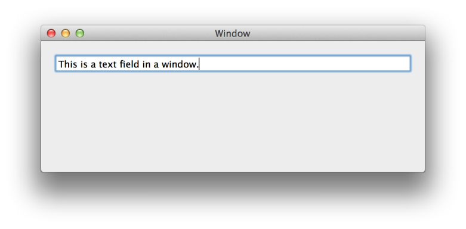
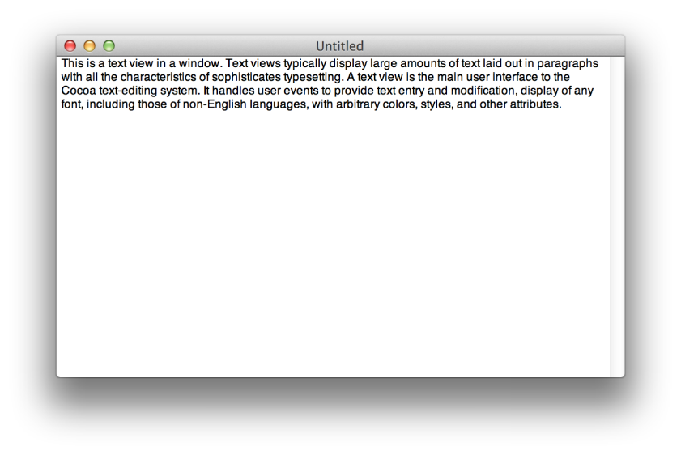
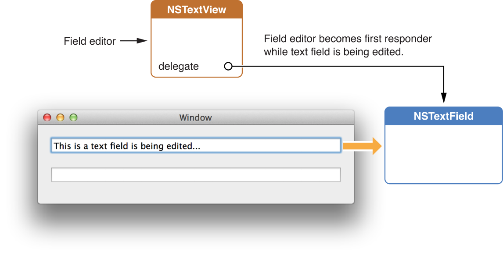

> 导航：[总目录](../../README.md) · [documentation](../../_indexes/documentation.md) · [Cocoa Text Architecture Guide](About%20the%20Cocoa%20Text%20System.md)

[Next](Text%20Attributes.md)[Previous](Text%20System%20Organization.md)

# Text Fields, Text Views, and the Field Editor

Text fields, text views, and the field editor are important objects in the Cocoa text system because they are central to the user’s interaction with the system. They provide text entry, manipulation, and display. If your application deals in any way with user-entered text, you should understand these objects.

A text field is a user interface control object instantiated from the `NSTextField` class. Figure 4-1 shows a text field. Text fields display small amounts of text, typically (although not necessarily) a single line. Text fields provide places for users to enter text responses, such as search parameters. Like all controls, a text field has a target and an action, and it performs validation on its value when edited. If the value isn’t valid, it sends a special error action message to its target.

__Figure 4-1__  A text field

A text field is implemented by two classes: `NSTextFieldCell`, the cell which does most of the work, and `NSTextField`, the control that contains that cell. Every method in `NSTextFieldCell` has a cover in `NSTextField`. (A cover is a method of the same name that calls the original method.) An `NSTextField` object can have a delegate that responds to such delegate methods as [textShouldEndEditing:](https://developer.apple.com/documentation/appkit/nstextfield/1399434-textshouldendediting).

By default, text fields send their action message when editing ends—that is, when the user presses Return or moves focus to another control. You can control a text field’s shape and layout, the font and color of its text, background color, whether the text is editable or read-only, whether it is selectable or not (if read-only), and whether the text scrolls or wraps when the text exceeds the text field’s visible area.

To create a secure text field for password entry, use `NSSecureTextField`, a subclass of `NSTextField`. Secure text fields display bullets in place of characters entered by the user, and they do not allow cutting or copying of their contents. You can get the text field’s value using the [stringValue](https://developer.apple.com/documentation/appkit/nscontrol/1428950-stringvalue) method, but users have no access to the value. See [Why Use a Custom Field Editor?](Text%20Editing.md#apple-f4xwc4dqnrsv64tfmyxwi33df52wszbpkridimbqga4tinjzfvbuqmznknltgnq) for information about the implementation of secure text fields.

The usual way to instantiate a text field is to drag an `NSTextField` or `NSSecureTextField` object from the Interface Builder objects library and place it in a window of your application’s user interface. You can link text fields together in their window’s key view loop by setting each field’s `nextKeyView` outlet in the Connections pane of the Inspector window, so that users can press Tab to move keyboard focus from one field to the next in the order you specify.

Text views are user interface objects instantiated from the `NSTextView` class. Figure 4-2 shows a text view. Text views typically display multiple lines of text laid out in paragraphs with all the characteristics of sophisticated typesetting. A text view is the main user interface to the Cocoa text-editing system. It handles user events to provide text entry and modification, and to display any font, including those of non-English languages, with arbitrary colors, styles, and other attributes.

__Figure 4-2__  A text view

The Cocoa text system supports text views with many other underlying objects providing text storage, layout, font and attribute manipulation, spell checking, undo and redo, copy and paste, drag and drop, saving of text to files, and other features. `NSTextView` is a subclass of `NSText`, which is a separate class for historical reasons. You don’t instantiate `NSText`, although it declares many of the methods you use with `NSTextView`. When you put an `NSTextView` object in an `NSWindow` object, you have a full-featured text editor whose capabilities are provided “for free” by the Cocoa text system.

The field editor is a single `NSTextView` object that is shared among all the controls, including text fields, in a window. This text view object inserts itself into the view hierarchy to provide text entry and editing services for the currently active text field. When the user shifts focus to a text field, the field editor begins handling keystroke events and display for that field. Figure 4-3 illustrates the field editor in relation to the text field it is editing.

__Figure 4-3__  The field editor

Because only one of the text fields in a window can be active at a time, the system needs only one `NSTextView` instance per window to be the field editor. However, you can substitute custom field editors, in which case there could be more than one field editor. Among its other duties, the field editor maintains the selection. Therefore, a text field that's not being edited typically does not have a selection at all.

For more information about the field editor, see [Working with the Field Editor](Text%20Editing.md#apple-f4xwc4dqnrsv64tfmyxwi33df52wszbpkridimbqga4tinjzfvbuqmznknlteoi).

[Next](Text%20Attributes.md)[Previous](Text%20System%20Organization.md)

