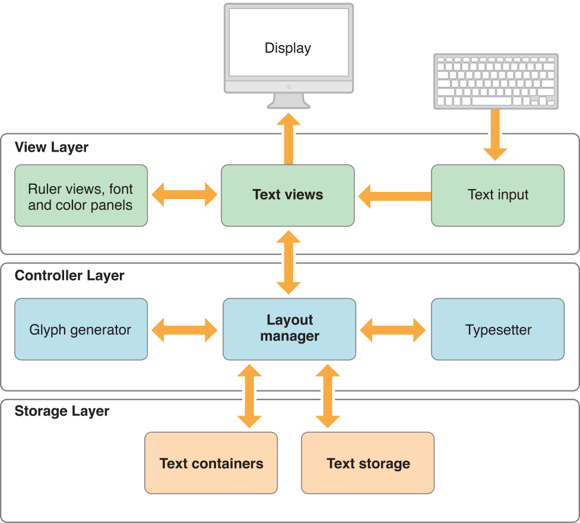
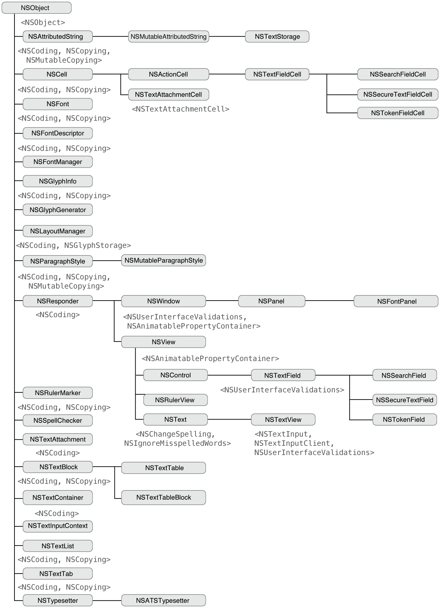
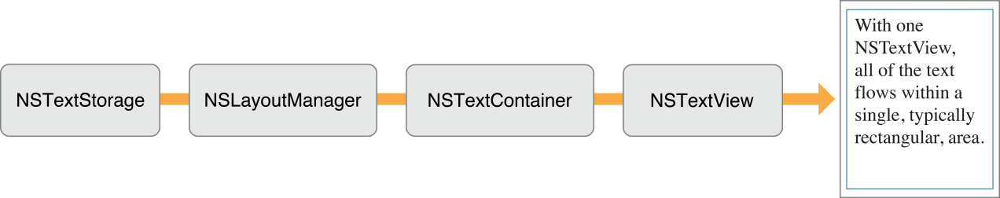
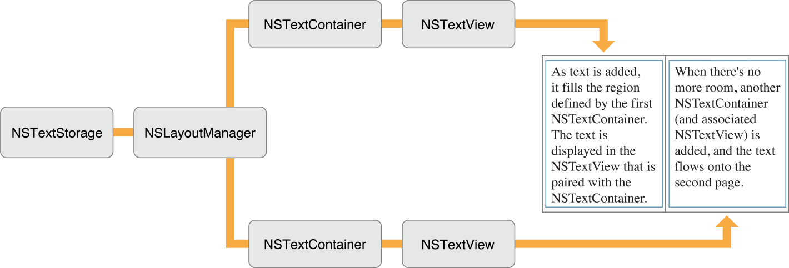
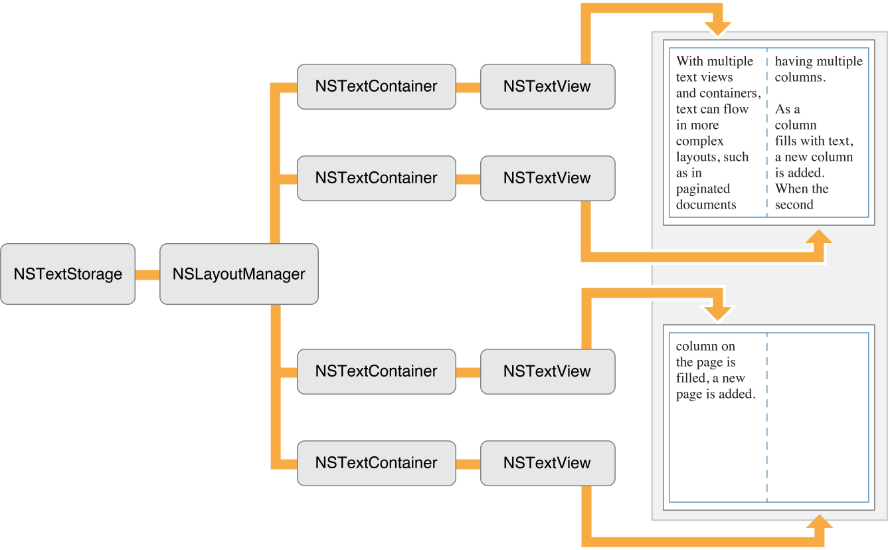
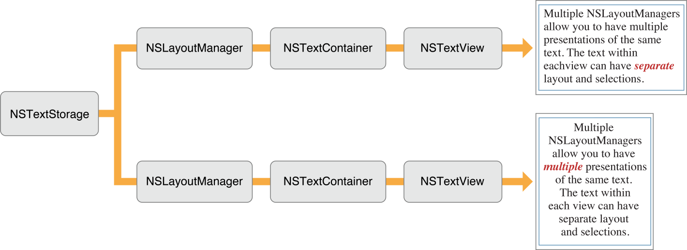
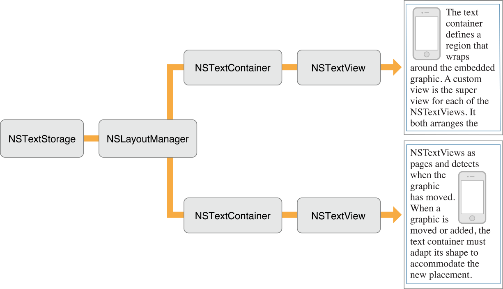

> 导航：[总目录](../../README.md) · [documentation](../../_indexes/documentation.md) · [Cocoa Text Architecture Guide](About%20the%20Cocoa%20Text%20System.md)


[Next](Text%20Fields%2C%20Text%20Views%2C%20and%20the%20Field%20Editor.md)[Previous](Typographical%20Concepts.md)

# Text System Organization

The Cocoa text system is abstracted into a set of classes that interact to provide all of the text-handling features of the system. The classes represent specific functional areas with well-defined interfaces that enable application programs to modify the behavior of the system or even to replace parts with custom subclasses. The Cocoa text system is designed so that you don’t need to learn about or interact with more of the system than is necessary to meet the needs of your application.

For most developers, the general-purpose programmatic interface of the `NSTextView` class is all you need to learn. `NSTextView` provides the user interface to the text system. See _[NSTextView Class Reference](https://developer.apple.com/documentation/appkit/nstextview)_ for detailed information about `NSTextView`.

If you need more flexible, programmatic access to the text, you’ll need to learn about the storage layer and the `NSTextStorage` class. And, of course, to access all the available features, you can interact with any of the classes that support the text system.

Figure 3-1 shows the major functional areas of the text system with the user interface layer on top, the storage layer on the bottom, and, in the middle region, the components that lay out the text for display. These layers represent view, controller, and model concepts, respectively, as described in [MVC and the Text System](#apple-f4xwc4dqnrsv64tfmyxwi33df52wszbpkridimbqga4tinjzfvbuqnznknltg).

__Figure 3-1__  Major functional areas of the Cocoa text system



The text classes exceed most other classes in the AppKit in the richness and complexity of their interface. One of their design goals is to provide a comprehensive set of text-handling features so that you rarely need to create a subclass. Among other things, a text object such as `NSTextView` can:

- Control whether the user can select or edit text.
- Control the font and layout characteristics of its text by working with the Font menu and Font panel (also called the _Fonts window_).
- Let the user control the format of paragraphs by manipulating a ruler.
- Control the color of its text and background.
- Wrap text on a word or character basis.
- Display graphic images within its text.
- Write text to or read text from files in the form of RTFD—Rich Text Format files that contain TIFF or EPS images, or attached files.
- Let another object, the delegate, dynamically control its properties.
- Let the user copy and paste text within and between applications.
- Let the user copy and paste font and format information between `NSTextView` objects.
- Let the user check the spelling of words in its text.

Graphical user-interface building tools (such as Interface Builder) may give you access to text objects in several different configurations, such as those found in the `NSTextField`, `NSForm`, and `NSScrollView` objects. These classes configure a text object for their own specific purposes. Additionally, all `NSTextField`, `NSForm`, or `NSButton` objects within the same window—in short, all objects that access a text object through associated cells—share the same text object, called the _field editor_. Thus, it’s generally best to use one of these classes whenever it meets your needs, rather than create text objects yourself. But if one of these classes doesn’t provide enough flexibility for your purposes, you can create text objects programmatically.

Text objects typically work closely with various other objects. Some of these—such as the delegate or an embedded graphic object—require some programming on your part. Others—such as the Font panel, spell checker, or ruler—take no effort other than deciding whether the service should be enabled or disabled.

To control layout of text on the screen or printed page, you work with the objects that link the `NSTextStorage` repository to the `NSTextView` that displays its contents. These objects are of the `NSLayoutManager` and `NSTextContainer` classes.

An `NSTextContainer` object defines a region where text can be laid out. Typically, a text container defines a rectangular area, but by creating a subclass of `NSTextContainer` you can create other shapes: circles, pentagons, or irregular shapes, for example. `NSTextContainer` isn’t a user-interface object, so it can’t display anything or receive events from the keyboard or mouse. It simply describes an area that can be filled with text, and it’s not tied to any particular coordinate system. Nor does an `NSTextContainer` object store text—that’s the job of an `NSTextStorage` object.

A layout manager object, of the `NSLayoutManager` class, orchestrates the operation of the other text handling objects. It intercedes in operations that convert the data in an `NSTextStorage` object to rendered text in an `NSTextView` object’s display. It also oversees the layout of text within the areas defined by `NSTextContainer` objects.

In addition to the four principal classes in the text system—`NSTextStorage`, `NSLayoutManager`, `NSTextContainer`, `NSTextView`—there are a number of auxiliary classes and protocols. Figure 3-2 provides a more complete picture of the text system. Names between angle brackets, such as `<NSCopying>`, are protocols.

__Figure 3-2__  Cocoa Text System Class Hierarchy



The Cocoa text system’s architecture is both modular and layered to enhance its ease of use and flexibility. Its modular design reflects the Model-View-Controller paradigm (originating with Smalltalk-80) where the data, its visual representation, and the logic that links the two are represented by separate objects. In the case of the text system, `NSTextStorage` holds the model’s text data, `NSTextContainer` models the geometry of the layout area, `NSTextView` presents the view, and `NSLayoutManager` intercedes as the controller to make sure that the data and its representation onscreen stay in agreement.

This factoring of responsibilities makes each component less dependent on the implementation of the others and makes it easier to replace individual components with improved versions without having to redesign the entire system. To illustrate the independence of the text-handling components, consider some of the operations that are possible using different subsets of the text system:

- Using only an `NSTextStorage` object, you can search text for specific characters, strings, paragraph styles, and so on.
- Using only an `NSTextStorage` object, you can programmatically operate on the text without incurring the overhead of laying it out for display.
- Using all the components of the text system except for an `NSTextView` object, you can calculate layout information, determine where line breaks occur, figure the total number of pages, and so forth.

The layering of the text system reduces the amount you have to learn to accomplish common text-handling tasks. In fact, many applications interact with the system solely through the API of the `NSTextView` class.

There are two standard ways to create an object web of the four principal classes of the text system to handle text editing, layout, and display: in one case, the text view creates and owns the other objects; in the other case, you create all the objects explicitly and the text storage owns them.

You create and maintain a reference to an `NSTextView` object which automatically creates, interconnects, and owns the other text system objects. The majority of Cocoa apps use this technique and interact with the text system at a high level through `NSTextView`. You can create a text view and have it create the other text objects using Interface Builder, the graphical interface editor of Xcode, or you can do the same thing programmatically.

To create the text view object in Interface Builder, drag a Text View from the Object library onto your app window. When your app launches and its nib file is loaded, it instantiates an `NSTextView` object and embeds it in a scroll view. Behind the scenes, the text view object automatically instantiates and manages `NSTextContainer`, `NSLayoutManager`, and `NSTextStorage` objects.

To create the text view object programmatically and let it create and own the other objects, use the `NSTextView` initialization method [initWithFrame:](https://developer.apple.com/documentation/appkit/nstextview/1449262-init).

The text view ownership technique is the easiest and cleanest way to set up the text system object web. However, it creates a single flow of text which does not support pagination or complex layouts, as described in [Common Configurations](#apple-f4xwc4dqnrsv64tfmyxwi33df52wszbpkridimbqga4tinjzfvbuqnznknlti). For other configurations you must create the objects explicitly.

You create all four text objects explicitly and connect them together, maintaining a reference only to the `NSTextStorage` object. The text storage object then owns and manages the other text objects in the web.

To create the text system objects explicitly and connect them together, use the steps shown in this section. This code could reside in the implementation of the [applicationDidFinishLaunching:](https://developer.apple.com/documentation/appkit/nsapplicationdelegate/1428385-applicationdidfinishlaunching) notification method of the app delegate, for example. It assumes that `textStorage` is an instance variable of the delegate object. It also assumes that `window` and `windowView` are properties of the app delegate representing outlets to the app’s main window and its content view.

1. Create an `NSTextStorage` object in the normal way using the `alloc` and `init…` messages.

   When you create the text system explicitly, you need to keep a reference only to this `NSTextStorage` object. The other objects of the system are owned by the text storage object, and they are released automatically by the system.

```
textStorage = [[NSTextStorage alloc]
              initWithString:@"Here's to the ones who see things different."];
```
2. Create an `NSLayoutManager` object and connect it to the text storage object.

   The layout manager needs a number of supporting objects—such as those that help it generate glyphs or position text within a text container—for its operation. It automatically creates these objects (or connects to existing ones) upon initialization.

```
NSLayoutManager *layoutManager;
layoutManager = [[NSLayoutManager alloc] init];
[textStorage addLayoutManager:layoutManager];
```
3. Create an `NSTextContainer` object, initialize it with a size, and connect it to the layout manager.

   The size of the text container is the size of the view in which it is displayed—in this case `self.windowView` is the content view of the app’s main window. Once you’ve created the text container, you add it to the list of containers that the layout manager owns. If your app has multiple text containers, you can create them and add them in this step, or you can create them lazily as needed.

```
NSTextContainer *textContainer;
textContainer = [[NSTextContainer alloc]
                initWithContainerSize:self.windowView.frame.size];
[layoutManager addTextContainer:textContainer];
```
4. Create an `NSTextView` object, initialize it with a frame, and connect it to the text container.

   When you create the text system’s object web explicitly, you must use the [initWithFrame:textContainer:](https://developer.apple.com/documentation/appkit/nstextview/1449347-init) method to initialize the text view. This initialization method does nothing more than initialize the receiver and set its text container (unlike [initWithFrame:](https://developer.apple.com/documentation/appkit/nstextview/1449262-init), which not only initializes the receiver, but automatically creates and interconnects its own web of text system objects). Each text view in the system is connected to its own text container.

```
NSTextView *textView;
textView = [[NSTextView alloc]
           initWithFrame:self.windowView.frame
           textContainer:textContainer];
```

   Once the `NSTextView` object has been initialized, you make it the content view of the window, which is then displayed. The [makeFirstResponder:](https://developer.apple.com/documentation/appkit/nswindow/1419366-makefirstresponder) message makes the text view key, so that it accepts keystroke events.

```
[self.window setContentView:textView];
[self.window makeKeyAndOrderFront:nil];
[self.window makeFirstResponder:textView];
```

   For simplicity, this code puts the text view directly into the window’s content view. More commonly, text views are placed inside scroll views, as described in [Putting an NSTextView Object in an NSScrollView](https://developer.apple.com/library/archive/documentation/Cocoa/Conceptual/TextUILayer/Tasks/TextInScrollView.html#//apple_ref/doc/uid/20000938).

The following diagrams give you an idea of how you can configure objects of the four primary text system classes—`NSTextStorage`, `NSLayoutManager`, `NSTextContainer`, and `NSTextView`—to accomplish different text-handling goals.

To display a single flow of text, arrange the objects as shown in Figure 3-3.

__Figure 3-3__  Text object configuration for a single flow of text



The `NSTextView` object provides the view that displays the glyphs, and the `NSTextContainer` object defines an area within that view where the glyphs are laid out. Typically in this configuration, the `NSTextContainer` object’s vertical dimension is declared to be some extremely large value so that the container can accommodate any amount of text, while the `NSTextView` object is set to size itself around the text using the [setVerticallyResizable:](https://developer.apple.com/documentation/appkit/nstext/1535082-isverticallyresizable) method defined by `NSText`, and given a maximum height equal to the `NSTextContainer` object’s height. Then, with the text view embedded in an `NSScrollView` object, the user can scroll to see any portion of this text.

If the text container’s area is inset from the text view’s bounds, a margin appears around the text. The `NSLayoutManager` object, and other objects not pictured here, work together to generate glyphs from the `NSTextStorage` object’s data and lay them out within the area defined by the `NSTextContainer` object.

This configuration is limited by having only one `NSTextContainer`-`NSTextView` pair. In such an arrangement, the text flows uninterrupted within the area defined by the `NSTextContainer`. Page breaks, multicolumn layout, and more complex layouts can’t be accommodated by this arrangement.

By using multiple `NSTextContainer`-`NSTextView` pairs, more complex layout arrangements are possible. For example, to support page breaks, an application can configure the text objects as shown in Figure 3-4.

__Figure 3-4__  Text object configuration for paginated text



Each `NSTextContainer`-`NSTextView` pair corresponds to a page of the document. The blue rectangle in Figure 3-4 represents a custom view object that your application provides as a background for the `NSTextView` objects. This custom view can be embedded in an `NSScrollView` object to enable the user to scroll through the document’s pages.

A multicolumn document uses a similar configuration, as shown in Figure 3-5.

__Figure 3-5__  Text object configuration for a multicolumn document



Instead of having one `NSTextView`-`NSTextContainer` pair correspond to a single page, there are now two pairs—one for each column on the page. Each `NSTextContainer`-`NSTextView` pair controls a portion of the document. As the text is displayed, glyphs are first laid out in the top-left view. When there is no more room in that view, the `NSLayoutManager` object informs its delegate that it has finished filling the container. The delegate can check whether there’s more text that needs to be laid out and add another `NSTextContainer` and `NSTextView` if necessary. The `NSLayoutManager` object proceeds to lay out text in the next container, notifies the delegate when finished, and so on. Again, a custom view (depicted as a blue rectangle) provides a canvas for these text columns.

Not only can you have multiple `NSTextContainer`-`NSTextView` pairs, you can also have multiple `NSLayoutManager` objects accessing the same text storage. Figure 3-6 illustrates the simplest arrangement with multiple layout managers.

__Figure 3-6__  Text object configuration for multiple views of the same text



The effect of this arrangement is to give multiple views on the same text. If the user alters the text in the top view, the change is immediately reflected in the bottom view (assuming the location of the change is within the bottom view’s bounds).

Finally, complex page layout requirements, such as permitting text to wrap around embedded graphics, can be achieved by a configuration that uses a custom subclass of `NSTextContainer`. This subclass defines a region that adapts its shape to accommodate the graphic image and uses the object configuration shown in Figure 3-7.

__Figure 3-7__  Text object configuration with custom text containers



See _[Text Layout Programming Guide](../Cocoa/Text%20Layout%20Programming%20Guide/Introduction%20to%20Text%20Layout%20Programming%20Guide.md#apple-f4xwc4dqnrsv64tfmyxwi33df52wszbpgeydambqge2tq2i)_ for information about how the text system lays out text.

[Next](Text%20Fields%2C%20Text%20Views%2C%20and%20the%20Field%20Editor.md)[Previous](Typographical%20Concepts.md)

