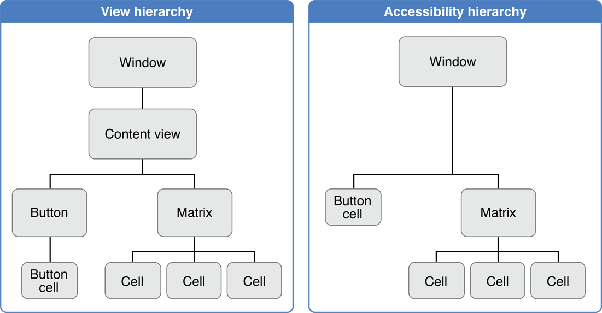

> 导航：[总目录](../../../README.md) · [documentation](../../../_indexes/documentation.md) · [Accessibility Programming Guidelines for Mac](Introduction%20to%20Accessibility%20Programming%20Guidelines%20for%20Cocoa.md)

[Next](Hit-Testing%20and%20Keyboard%20Focus.md)[Previous](Introduction%20to%20Accessibility%20Programming%20Guidelines%20for%20Cocoa.md)

# Accessibility Objects and the Accessibility Hierarchy

At the heart of OS X accessibility is the accessibility object. This object represents a user-accessible element in your application, such as a button or a menu item, regardless of the application framework on which your application depends. An assistive application uses an accessibility object to make the user interface element it represents accessible to users and to manage the user’s interaction with that element.

This article describes the accessibility object as it is implemented by the Application Kit. It describes the components of accessibility objects and the hierarchy in which they are arranged. It also describes the methods to which accessibility objects can respond.

Accessibility objects are described by a set of attributes. These attributes include the type of object, the object’s place in the accessibility hierarchy (described in [The Accessibility Hierarchy](#apple-f4xwc4dqnrsv64tfmyxwi33df52wszbpgiydambrga2toljxge3dgoa)), its value, its size and position on the display screen, and so on. In Cocoa, attributes are identified by [NSString](https://developer.apple.com/library/archive/documentation/LegacyTechnologies/WebObjects/WebObjects_3.5/Reference/Frameworks/ObjC/Foundation/Classes/NSStringClassCluster/Description.html#//apple_ref/occ/cl/NSString) values, such as `NSAccessibilityWindowAttribute` and `NSAccessibilityZoomButtonAttribute` (see _[NSAccessibility Protocol Reference](https://developer.apple.com/documentation/appkit/accessibility/nsaccessibility)_ for the complete list of attribute names).

Each attribute has a value that provides an assistive application with information about the user interface element the accessibility object represents. For example, the value of a button’s role attribute is `NSAccessibilityButtonRole` and the value of its enabled attribute might be `YES` (if the button is enabled). In addition, many accessibility objects include a value attribute (`NSAccessibilityValueAttribute`) that contains the current value of a user interface object. For example, the value of a text field object is the contents of the text field and the value of a selected radio button is `true`.

Attribute values are always handled as objects. They must be either objects that conform to the `NSAccessibility` protocol or one of the following types of objects:

- `NSArray`
- `NSAttributedString`
- `NSData`
- `NSDate`
- `NSDictionary`
- `NSNumber` (for Boolean, integer, and floating point values)
- `NSString`
- `NSURL`
- `NSValue` (for point, size, rectangle, and range values)

The `NSValue` objects must be created with the appropriate convenience methods, such as `valueWithPoint:`, to be properly recognized and transmitted to an assistive application. An attribute value can also be `nil`, although this causes a “No Value” error to be seen by an assistive application.

An assistive application needs to know which attributes a given accessibility object supports to be able to accurately represent the user interface object to the user. This is because an assistive application uses the values of supported attributes to manipulate the object and give the user information about it. An accessibility object returns a list of its supported attributes in the `accessibilityAttributeNames` method. When an assistive application needs to get the value of a specific attribute, an accessibility object returns it in the `accessibilityAttributeValue:` method.

Some attributes are read-only, such as the role, but others, such as a slider’s value, can be modified by the assistive application. An attribute whose value is modifiable by an assistive application is called settable. The modification of attribute values is one way an assistive application can manipulate the user interface of another application (the other way is through actions, described in [Actions](#apple-f4xwc4dqnrsv64tfmyxwi33df52wszbpgiydambrga2toljxgeztcoi)).

An accessibility object indicates that a specific attribute’s value can be modified by an assistive application by returning `YES` from the `accessibilityIsAttributeSettable:` method. An assistive application modifies the value of a specific attribute using the `accessibilitySetValue:forAttribute:` method.

In `NSAccessibility.h`, Cocoa defines a large number of constants for standard attributes, many of which are relevant to only a few classes. For example, there are a large set of attributes that are for use with objects that handle text. A few of the attributes, however, are required for every accessibility object. If you must create an accessibility object to represent a custom user interface element, you should at a minimum implement the following attributes. (See [Make Custom Classes and Subclasses Accessible](Access%20Enabling%20a%20Cocoa%20Application.md#apple-f4xwc4dqnrsv64tfmyxwi33df52wszbpgiydambrga2tsljyhe2dsnq) for details.)

- `NSAccessibilityRoleAttribute`. This required attribute identifies the type of the accessibility object. Cocoa defines a large number of role values, such as `NSAccessibilityApplicationRole`, `NSAccessibilityRadioButtonRole`, and `NSAccessibilityScrollAreaRole`. The value of the role attribute is for programmatic identification purposes only (an assistive application will never present the value of the role attribute to a user) and therefore does not need to be localized. See the `NSAccessibility` protocol description for a list of all the roles defined in Cocoa.
- `NSAccessibilityRoleDescriptionAttribute`. This attribute holds a localized string describing the object’s role. It is intended to be readable by (or speakable to) the user. For example, the role description string attribute for a button should be “button”. This allows an assistive application accurately to identify the object’s type to the user.
- `NSAccessibilityTitleAttribute`. This attribute is required for any user interface object that displays a visible text title as part of its visual interface. For example, the display of a Cancel button includes the title “Cancel”. Therefore, the accessibility object representing this button must include the title attribute with the string value `cancel`. This enables an assistive application accurately to convey the purpose of the object to the user. If, for example, the Cancel button does not include the title attribute, an assistive application may be able to describe it to the user only as “button”.

  Note that the title attribute is not intended to contain static text that serves as the title for a user interface element, but that is not part of its visual interface. For objects that are accompanied by separate static text titles and descriptions, use the `NSAccessibilityTitleUIElementAttribute` and `NSAccessibilityServesAsTitleForUIElementsAttribute` attributes (described in [Provide Descriptive Information for All Elements](Access%20Enabling%20a%20Cocoa%20Application.md#apple-f4xwc4dqnrsv64tfmyxwi33df52wszbpgiydambrga2tsljyhe2dmni)).
- `NSAccessibilityDescriptionAttribute`. Available in OS X version 10.4 and later, this attribute contains a localized string that describes the object’s purpose. All user interface objects that do not display a text title (and therefore do not include the title attribute) should include the description attribute to allow an assistive application to describe the purpose of the object to the user. For example, an OK button does not have to include the description attribute because it already includes the title attribute with the string value `ok`. A print button that displays a printer icon instead of the title “Print”, however, must include the description attribute with a string value, such as `print`. If such a button does not include the description attribute, an assistive application will be able to describe it to the user only as “button”.
- `NSAccessibilityParentAttribute`. This attribute is required for all accessibility objects except the application-level object. The value of this attribute is the accessibility object that contains this one. For example, the value of the parent attribute in a button cell’s accessibility object is the accessibility object that represents the button’s control object. Frequently, the parent of an accessibility object is the ancestor of the user interface object it represents. Sometimes, however, the ancestor of an object might not be interesting to an assistive application. An example of this is the NSButton that contains an NSButtonCell. In such cases, the uninteresting parent object may be marked as “ignored”, which makes it invisible to an assistive application. For more information about how the accessibility hierarchy can differ from the inheritance hierarchy, see [The Accessibility Hierarchy](#apple-f4xwc4dqnrsv64tfmyxwi33df52wszbpgiydambrga2toljxge3dgoa).

  When returning an object’s parent, respect the ignored state of objects by using the `NSAccessibilityUnignoredAncestor` function to return the first unignored parent for the object. For more information on this function, see [Manipulating the Accessibility Hierarchy](Manipulating%20the%20Accessibility%20Hierarchy.md#apple-f4xwc4dqnrsv64tfmyxwi33df52wszbpgiydambrga3dilkcineuosscinda).
- `NSAccessibilityChildrenAttribute`. This optional attribute identifies accessibility objects contained within this one. For example, the value of the children attribute in a control’s accessibility object contains the control’s cells. Similarly, the children attribute in an accessibility object representing a view contains the view’s subviews. As with the parent attribute, not all children of an object are interesting to an assistive application and some may be marked as “ignored” in the accessibility hierarchy. For more information on this, see [The Accessibility Hierarchy](#apple-f4xwc4dqnrsv64tfmyxwi33df52wszbpgiydambrga2toljxge3dgoa).

  When returning an object’s children, respect the ignored state of objects by using the `NSAccessibilityUnignoredChildren` function to return the unignored children for the object. For more information on this function, see [Manipulating the Accessibility Hierarchy](Manipulating%20the%20Accessibility%20Hierarchy.md#apple-f4xwc4dqnrsv64tfmyxwi33df52wszbpgiydambrga3dilkcineuosscinda).
- `NSAccessibilitySizeAttribute`. This required attribute contains an NSValue object giving the size of the user interface object in pixels. This attribute is required so that assistive applications can do such things as display a focus ring around a user interface object.
- `NSAccessibilityHelpAttribute`. This optional attribute is a localized string that describes the purpose of the object. The string should be a short phrase that provides a hint to the user for how to handle the object. For NSView objects, the default implementation returns the view’s help tag (tool tip) string.

For more information on the required and optional attributes associated with each role, see the appendix “Roles and Associated Attributes” in _[Accessibility Programming Guide for OS X](https://developer.apple.com/library/archive/documentation/Accessibility/Conceptual/AccessibilityMacOSX/index.html#//apple_ref/doc/uid/TP40001078)_.

Accessibility objects can have actions associated with them. These actions are the generic actions a user can take on the user interface object the accessibility object represents. This means that accessibility actions are not context-specific. Because an assistive application is driving the user interface of your application, actions typically correspond to a single mouse click or key press. For example, a Print button supports the generic press action, not a context-specific print action. Actions are identified by NSString values, such as `NSAccessibilityPressAction`.

An accessibility object returns a list of its supported actions in the `accessibilityActionNames` method. When an assistive application needs to cause your application to perform a specific action, it sends the `accessibilityPerformAction:` message. When your application receives the `accessibilityPerformAction:` message, it performs the requested action in the same way it does when the request comes directly from the mouse or keyboard.

In `NSAccessibility.h`, Cocoa defines a small number of constants for standard actions. If you are creating (or extending) an accessibility object, you must restrict yourself to these actions. If you do not, an assistive application is likely to be unable to handle your custom action.

- `NSAccessibilityConfirmAction`. This action simulates pressing the Enter key, such as in a text field.
- `NSAccessibilityDecrementAction`. This action decrements the value of an object, such as a slider.
- `NSAccessibilityIncrementAction`. This action increments the value of an object, such as a slider.
- `NSAccessibilityPickAction`. This action selects a menu item.
- `NSAccessibilityPressAction`. This action simulates a single mouse click, such as on a button.
- `NSAccessibilityCancelAction`. This action simulates pressing a Cancel button.
- `NSAccessibilityRaiseAction`. This action makes the application window frontmost (behind, perhaps, any floating or system-modal windows that are currently displayed).
- `NSAccessibilityDeleteAction`. Simulates a delete action for items that must otherwise be dragged to a destination (such as Trash) to be deleted.
- `NSAccessibilityShowMenuAction`. This action opens a contextual menu in the element represented by this accessibility object. (This action can also be used to display a menu that is pre-associated with an element, such as the menu that displays when a user clicks Safari’s back button slowly.)

See [Supporting Actions](Supporting%20Actions.md#apple-f4xwc4dqnrsv64tfmyxwi33df52wszbpgiydambrga3dglkcijbusrkiivaq) for details on implementing an action.

Accessibility objects are arranged into a hierarchy that represents your application’s user interface. The application-level accessibility object (representing the NSApplication object) is at the top of the hierarchy and its first-order children are the accessibility objects that represent the main application windows and the menu bar. An assistive application can traverse the hierarchy using various attributes, primarily `NSAccessibilityParentAttribute` and `NSAccessibilityChildrenAttribute` (see [Attributes](#apple-f4xwc4dqnrsv64tfmyxwi33df52wszbpgiydambrga2toljxgi2tsni) for more information on specific attributes).

Assistive applications can also move through the hierarchy using attributes that lead to accessibility objects not related by containment. If, for example, an application displays a list of documents in one view and the contents of a selected document in another view, the application can use the `NSAccessibilityLinkedUIElementsAttribute` attribute to link these two views. Using the value of this attribute, an assistive application can allow a user to jump easily between the related views. Other attributes, such as `NSAccessibilityMenuBarAttribute` and `NSAccessibilityTopLevelUIElementAttribute`, provide direct, convenient access to specific objects in the application’s user interface.

The accessibility hierarchy is built into the object hierarchy that already exists in a Cocoa application. For example, the top-level NSApplication object manages a collection of windows. An assistive application accesses these windows by asking the accessibility object representing the NSApplication object for the value of its `NSAccessibilityWindowsAttribute` attribute. (The windows can also be obtained by requesting the value of the children attribute, but the menu bar is included in this value.) Each of these windows contains a view hierarchy wherein the window’s top view, the content view, contains any number of subviews, each of which can contain even more subviews, and so on. This hierarchy can be traversed by asking for the value of each object’s `NSAccessibilityChildrenAttribute`. At the bottom of the hierarchy are the objects with which the user usually interacts, such as buttons and text fields.

In some cases, however, an object needed in the Cocoa object hierarchy is not interesting to an assistive application. For example, the top-level view inside a window (the content view) is just a container for other views, which are the real objects that make up the user interface. Because a user never interacts directly with the content view itself, this implementation detail is hidden from the assistive application by marking the accessibility object representing the view as “ignored”. Therefore, when a window is asked for its children, instead of returning its content view, the window should return the content view’s children.

NSControl objects are also often hidden. An NSControl usually has a one-to-one relationship to an NSCell object, which implements the majority of the control’s behavior. In these cases, the NSControl object is ignored and the accessibility hierarchy jumps from the view that contains the control to the control’s cell. Controls that can represent more than one cell, however, such as NSMatrix or NSTableView, are not ignored.

It’s important to note that ignored accessibility objects are not excised from an application’s accessibility hierarchy; rather, they are not reported to an assistive application. An ignored object must remain in its place in the accessibility hierarchy to provide a bridge between its surrounding objects and to implement the functions and attributes needed by its children.

[Figure 1](#apple-f4xwc4dqnrsv64tfmyxwi33df52wszbpgiydambrga2tolkcijbugsshirda) compares the view hierarchy for a window and the accessibility hierarchy for the same window. The content view and the button control (an NSButton) are ignored objects, which are in the view hierarchy but not the accessibility hierarchy. The accessibility hierarchy skips the content view and goes directly to its children and the button is replaced by the button’s cell (an NSButtonCell).

__Figure 1__  View hierarchy versus accessibility hierarchy

Objects indicate that they should be ignored by implementing the `accessibilityIsIgnored` method and returning `YES`. In fact, the default NSView implementation returns `YES`. To make themselves visible to an assistive application, therefore, NSView subclasses must override the `accessibilityIsIgnored` method and return `NO`. For details on working with ignored objects, see [Manipulating the Accessibility Hierarchy](Manipulating%20the%20Accessibility%20Hierarchy.md#apple-f4xwc4dqnrsv64tfmyxwi33df52wszbpgiydambrga3dilkcineuosscinda).

[Next](Hit-Testing%20and%20Keyboard%20Focus.md)[Previous](Introduction%20to%20Accessibility%20Programming%20Guidelines%20for%20Cocoa.md)

