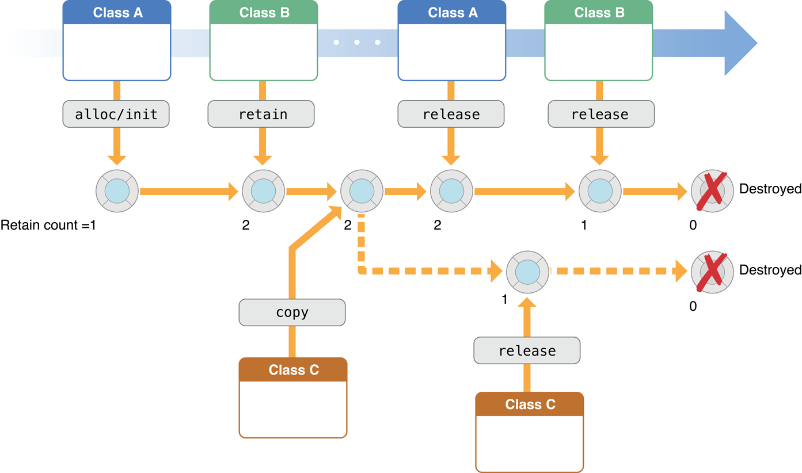

> 导航：[总目录](../../../README.md) · [文档](../../../_indexes/documentation.md)

[下一页](Memory%20Management%20Policy.md)

# 关于内存管理

应用程序的内存管理（memory management）指的是在程序运行期间分配内存、使用内存，并在用完之后释放内存的整个过程。写得好的程序会尽可能少占用内存。在 Objective-C 中，内存管理也可以看作是在众多数据和代码之间分配有限内存资源的所有权（ownership）的一种方式。读完本指南之后，你将掌握所需的知识，能够通过显式管理对象的生命周期、在对象不再需要时将其释放，来管理应用程序的内存。

虽然内存管理通常是针对单个对象来考虑的，但你的实际目标是管理[对象图](https://developer.apple.com/library/archive/documentation/General/Conceptual/DevPedia-CocoaCore/ObjectGraph.html#//apple_ref/doc/uid/TP40008195-CH54)（object graph）。你要确保内存中不存在多于实际所需的对象。

Objective-C 提供了两种应用程序内存管理方式。

1. 本指南所描述的方式称为“手动保留-释放”（manual retain-release），即 _MRR_。在这种方式下，你通过跟踪自己拥有的对象来显式管理内存。它是基于一种称为引用计数（reference counting）的模型实现的，该模型由 Foundation 类 [NSObject](https://developer.apple.com/library/archive/documentation/LegacyTechnologies/WebObjects/WebObjects_3.5/Reference/Frameworks/ObjC/Foundation/Classes/NSObject/Description.html#//apple_ref/occ/cl/NSObject) 与运行时环境共同提供。
2. 在自动引用计数（Automatic Reference Counting），即 _ARC_ 中，系统使用与 MRR 相同的引用计数机制，但会在编译期替你插入恰当的内存管理方法调用。强烈建议你在新项目中使用 ARC。如果你使用 ARC，通常不需要理解本文所描述的底层实现，尽管在某些情况下了解它会有所帮助。关于 ARC 的更多内容，请参阅 _[过渡到 ARC 发布说明](../../../releasenotes/Objective%20C/Transitioning%20to%20ARC%20Release%20Notes.md#apple-f4xwc4dqnrsv64tfmyxwi33df52wszbpkridimbqgeytemrw)_。

### 良好的实践可以避免与内存相关的问题

不正确的内存管理主要会导致两类问题：

- 释放或覆盖仍在使用中的数据

  这会造成内存损坏，通常会导致应用程序崩溃，更糟的情况是导致用户数据损坏。
- 不释放不再使用的数据会造成内存泄漏

  内存泄漏（leak）指的是已分配的内存虽然再也不会被使用，却没有被释放。泄漏会让应用程序占用的内存不断增长，进而可能导致系统性能下降，或者应用程序被终止。

不过，如果从引用计数的角度来思考内存管理，往往会适得其反，因为这会让你把注意力放在实现细节上，而不是放在你真正的目标上。相反，你应该从对象所有权和[对象图](https://developer.apple.com/library/archive/documentation/General/Conceptual/DevPedia-CocoaCore/ObjectGraph.html#//apple_ref/doc/uid/TP40008195-CH54)的角度来思考内存管理。

Cocoa 采用一套简单明了的命名约定，用来表明方法返回的对象是否归你所有。

请参阅[内存管理策略](Memory%20Management%20Policy.md#apple-f4xwc4dqnrsv64tfmyxwi33df52wszbpgiydambqhe4tilkciffeqrsci5ea)。

虽然基本策略很简单，但仍有一些实用的做法可以让内存管理更轻松，并帮助你在把资源需求降到最低的同时，确保程序保持可靠、健壮。

请参阅[内存管理实践](Practical%20Memory%20Management.md#apple-f4xwc4dqnrsv64tfmyxwi33df52wszbpkridimbqga2dinbxfvjvomi)。

自动释放池块（autorelease pool block）提供了一种机制，让你可以向对象发送一条“延迟的” `release` 消息。当你想放弃某个对象的所有权，又要避免它被立即释放时（例如从方法中返回一个对象时），这种机制很有用。在某些场合下，你可能需要使用自己的自动释放池块。

请参阅[使用自动释放池块](Using%20Autorelease%20Pool%20Blocks.md#apple-f4xwc4dqnrsv64tfmyxwi33df52wszbpgiydambqga2dolkdjjbemqsfireq)。

### 使用分析工具调试内存问题

要在编译期发现代码中的问题，可以使用 Xcode 内置的 Clang 静态分析器。

如果内存管理问题仍然出现，还有其他工具和技术可以用来定位和诊断这些问题。

- 技术说明 TN2239 _[iOS Debugging Magic](https://developer.apple.com/library/archive/technotes/tn2239/_index.html#//apple_ref/doc/uid/DTS40010638)_ 中介绍了其中许多工具和技术，尤其是使用 `NSZombie` 来帮助查找被过度释放的对象。
- 你可以使用 Instruments 跟踪引用计数事件并查找内存泄漏。请参阅 [Collecting Data on Your App](https://developer.apple.com/library/archive/documentation/DeveloperTools/Conceptual/InstrumentsUserGuide/TheInstrumentsWorkflow.html#//apple_ref/doc/uid/TP40004652-CH5)。

[下一页](Memory%20Management%20Policy.md)

