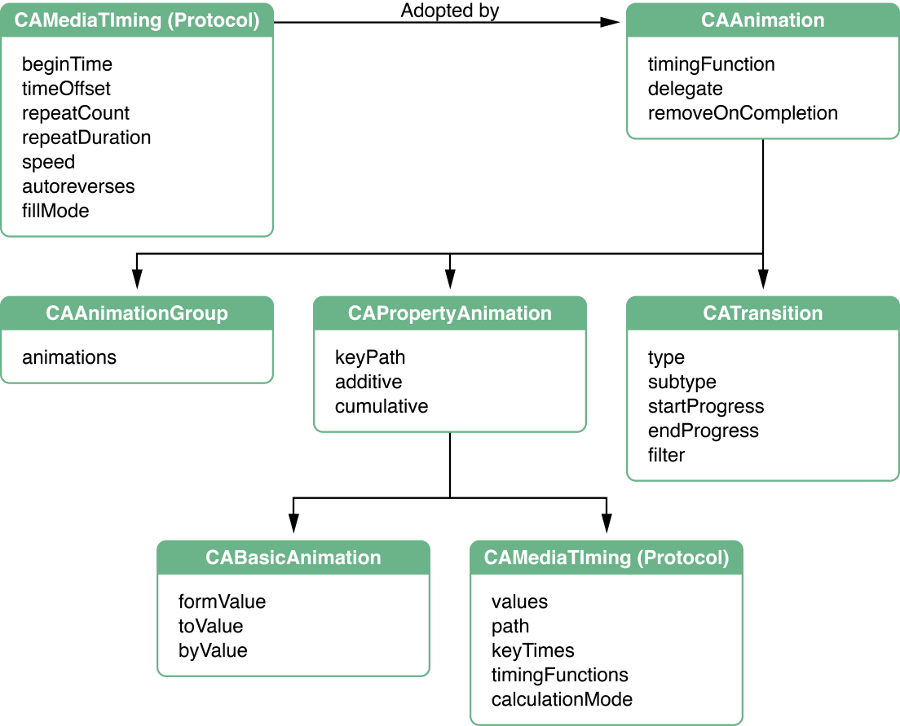

> 导航：[总目录](../../../README.md) · [文档](../../../_indexes/documentation.md) · [动画类型与时间控制编程指南](Introduction%20to%20Animation%20Types%20and%20Timing%20Programming%20Guide.md)

[下一页](Timing%2C%20Timespaces%2C%20and%20CAAnimation.md)[上一页](Introduction%20to%20Animation%20Types%20and%20Timing%20Programming%20Guide.md)

# 动画类路线图

Core Animation 提供了一组表达力很强的动画类，供你在应用程序中使用：

- `CAAnimation` 是所有动画的抽象基类。`CAAnimation` 采用了 `CAMediaTiming` 协议，该协议为动画提供了简单的时长、速度和重复次数。`CAAnimation` 还采用了 `CAAction` 协议。这个协议提供了一种标准化的方式，用于响应由图层触发的动作而启动一个动画。

  `CAAnimation` 类还把动画的时间控制定义为 `CAMediaTimingFunction` 的一个实例。时间函数（timing function）用一条简单的贝塞尔曲线来描述动画的节奏。线性时间函数表示动画在整个时长内节奏均匀，而缓入（ease-in）时间函数会让动画在接近其时长终点时逐渐加速。
- `CAPropertyAnimation` 是 `CAAnimation` 的抽象子类，它支持对由键路径指定的某个图层属性进行动画。
- `CABasicAnimation` 是 `CAPropertyAnimation` 的子类，它为图层属性提供简单的插值（interpolation）。
- `CAKeyframeAnimation`（`CAPropertyAnimation` 的子类）支持关键帧（keyframe）动画。你指定要做动画的图层属性的键路径、一个表示动画各阶段取值的数组，以及关键帧时刻和时间函数的数组。动画运行时，会按照指定的插值方式依次设置每一个值。
- `CATransition` 提供影响整个图层内容的过渡（transition）效果。它在做动画时会淡入淡出、推入或显露图层内容。在 OS X 上，你可以提供自定义的 Core Image 滤镜来扩展系统内置的过渡效果。
- `CAAnimationGroup` 允许把一组动画对象组合在一起并发运行。

图 1 展示了动画类的层次结构，同时也总结了通过继承可以获得的各个属性。

__图 1__  Core Animation 的类与协议

[下一页](Timing%2C%20Timespaces%2C%20and%20CAAnimation.md)[上一页](Introduction%20to%20Animation%20Types%20and%20Timing%20Programming%20Guide.md)

