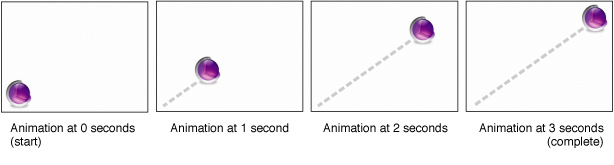
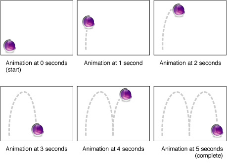

> 导航：[总目录](../../../README.md) · [文档](../../../_indexes/documentation.md) · [动画类型与时间控制编程指南](Introduction%20to%20Animation%20Types%20and%20Timing%20Programming%20Guide.md)


[下一页](Transition%20Animation.md)[上一页](Timing%2C%20Timespaces%2C%20and%20CAAnimation.md)

# 基于属性的动画

基于属性的动画，是指对图层（layer）某一个特性的取值进行插值（interpolation）的动画，例如位置、背景色、边界等。

本章讨论 Core Animation 如何抽象属性动画，以及它提供了哪些类来支持对图层属性做基本动画和多关键帧（keyframe）动画。

`CAPropertyAnimation` 类是 `CAAnimation` 的抽象子类，它为对图层的某个特定属性做动画提供了基础功能。所有能在数学上进行插值的值类型都支持基于属性的动画，包括：

- 整数和 double
- `CGRect`、`CGPoint`、`CGSize` 和 `CGAffineTransform` 结构体
- `CATransform3D` 数据结构
- `CGColor` 和 `CGImage` 引用

与所有动画一样，属性动画必须与一个图层关联。要做动画的属性使用相对于该图层的键值编码键路径来指定。例如，要对 “layerA” 的 `position` 属性的 x 分量做动画，你需要用键路径 “position.x” 创建一个动画，并把该动画添加到 “layerA” 上。

你永远不需要直接实例化 `CAPropertyAnimation`。相反，你应该创建它某个子类的实例：`CABasicAnimation` 或 `CAKeyframeAnimation`。同样，你也永远不该为 `CAPropertyAnimation` 派生子类；要添加功能或存储额外的属性，应该为 `CABasicAnimation` 或 `CAKeyframeAnimation` 派生子类。

`CABasicAnimation` 类为图层属性提供基本的单关键帧动画能力。你使用继承来的 [animationWithKeyPath:](https://developer.apple.com/documentation/quartzcore/capropertyanimation/1412534-init) 方法创建 `CABasicAnimation` 实例，并指定要做动画的图层属性的键路径。_[Core Animation Programming Guide](../Core%20Animation%20Programming%20Guide/About%20Core%20Animation.md#apple-f4xwc4dqnrsv64tfmyxwi33df52wszbpkridimbqga2dkmju)_ 中的 Animatable Properties 一节总结了 `CALayer` 及其滤镜属性中可做动画的属性。

图 1 展示了一个 3 秒的动画，它把图层的 position 属性从 (74.0,74.0) 动画到最终位置 (566.0,406.0)。这里假设父图层的 bounds 为 (0.0,0.0,640.0,480.0)。

__图 1__  对图层 position 属性做 3 秒基本动画



`CABasicAnimation` 类的 [fromValue](https://developer.apple.com/documentation/quartzcore/cabasicanimation/1412519-fromvalue)、[byValue](https://developer.apple.com/documentation/quartzcore/cabasicanimation/1412445-byvalue) 和 [toValue](https://developer.apple.com/documentation/quartzcore/cabasicanimation/1412523-tovalue) 属性定义了插值所依据的取值。它们都是可选的，并且其中最多只应有两个不为 `nil`。这些属性所设置的对象类型应与被做动画的属性的类型一致。

这些插值取值的使用规则如下：

- [fromValue](https://developer.apple.com/documentation/quartzcore/cabasicanimation/1412519-fromvalue) 和 [toValue](https://developer.apple.com/documentation/quartzcore/cabasicanimation/1412523-tovalue) 都不为 `nil`。在 [fromValue](https://developer.apple.com/documentation/quartzcore/cabasicanimation/1412519-fromvalue) 和 [toValue](https://developer.apple.com/documentation/quartzcore/cabasicanimation/1412523-tovalue) 之间插值。
- [fromValue](https://developer.apple.com/documentation/quartzcore/cabasicanimation/1412519-fromvalue) 和 [byValue](https://developer.apple.com/documentation/quartzcore/cabasicanimation/1412445-byvalue) 不为 `nil`。在 [fromValue](https://developer.apple.com/documentation/quartzcore/cabasicanimation/1412519-fromvalue) 和（[fromValue](https://developer.apple.com/documentation/quartzcore/cabasicanimation/1412519-fromvalue) + [byValue](https://developer.apple.com/documentation/quartzcore/cabasicanimation/1412445-byvalue)）之间插值。
- [byValue](https://developer.apple.com/documentation/quartzcore/cabasicanimation/1412445-byvalue) 和 [toValue](https://developer.apple.com/documentation/quartzcore/cabasicanimation/1412523-tovalue) 不为 `nil`。在（[toValue](https://developer.apple.com/documentation/quartzcore/cabasicanimation/1412523-tovalue) - [byValue](https://developer.apple.com/documentation/quartzcore/cabasicanimation/1412445-byvalue)）和 [toValue](https://developer.apple.com/documentation/quartzcore/cabasicanimation/1412523-tovalue) 之间插值。
- 只有 [fromValue](https://developer.apple.com/documentation/quartzcore/cabasicanimation/1412519-fromvalue) 不为 `nil`。在 [fromValue](https://developer.apple.com/documentation/quartzcore/cabasicanimation/1412519-fromvalue) 和该属性当前的呈现值之间插值。
- 只有 [toValue](https://developer.apple.com/documentation/quartzcore/cabasicanimation/1412523-tovalue) 不为 `nil`。在目标图层的呈现图层中 `keyPath` 的当前值和 [toValue](https://developer.apple.com/documentation/quartzcore/cabasicanimation/1412523-tovalue) 之间插值。
- 只有 [byValue](https://developer.apple.com/documentation/quartzcore/cabasicanimation/1412445-byvalue) 不为 `nil`。在目标图层的呈现图层中 `keyPath` 的当前值和该值加上 [byValue](https://developer.apple.com/documentation/quartzcore/cabasicanimation/1412445-byvalue) 之间插值。
- 所有属性都为 `nil`。在目标图层的呈现图层中 `keyPath` 的上一个值和当前值之间插值。

清单 1 展示了一段代码片段，它实现的显式动画等价于图 1 中的动画。

__清单 1__  CABasicAnimation 代码片段

```objc
CABasicAnimation *theAnimation;

// 创建动画对象，并把 position 属性指定为键路径
// 键路径是相对于目标动画对象的（本例中是一个 CALayer）
theAnimation=[CABasicAnimation animationWithKeyPath:@"position"];

// 把 fromValue 和 toValue 设为相应的点
theAnimation.fromValue=[NSValue valueWithPoint:NSMakePoint(74.0,74.0)];
theAnimation.toValue=[NSValue valueWithPoint:NSMakePoint(566.0,406.0)];

// 把时长设为 3.0 秒
theAnimation.duration=3.0;

// 设置一个自定义的时间函数
theAnimation.timingFunction=[CAMediaTimingFunction functionWithControlPoints:0.25f :0.1f :0.25f :1.0f];
```


关键帧动画在 Core Animation 中由 `CAKeyframeAnimation` 类支持，它与基本动画类似；不同之处在于，它允许你指定一个目标值数组。这些目标值会在动画的整个时长内依次被插值。

图 2 展示了一个 5 秒的动画，它使用一个 CGPathRef 作为关键帧取值，对图层的 position 属性做动画。

__图 2__  对图层 position 属性做 5 秒关键帧动画



关键帧取值通过以下两个属性之一来指定：一个 Core Graphics 路径（`path` 属性），或者一个对象数组（`values` 属性）。

Core Graphics 路径适合用来对图层的 `anchorPoint` 或 `position` 属性做动画，也就是那些类型为 `CGPoints` 的属性。除 `moveto` 点之外，路径中的每一个点都定义了一个关键帧片段，用于时间控制和插值。如果指定了 `path` 属性，`values` 属性将被忽略。

默认情况下，图层沿 CGPath 做动画时会保持它已被设定的旋转角度。把 `rotationMode` 属性设为 [kCAAnimationRotateAuto](https://developer.apple.com/documentation/quartzcore/kcaanimationrotateauto) 或 [kCAAnimationRotateAutoReverse](https://developer.apple.com/documentation/quartzcore/caanimationrotationmode/1412471-rotateautoreverse)，会让图层旋转以贴合路径的切线方向。

为 `values` 属性提供一个对象数组，可以让你对任意类型的图层属性做动画。例如：

- 提供一个 `CGImage` 对象数组，并把动画的键路径设为图层的 `content` 属性。这会让图层的内容在所提供的这些图像之间做动画。
- 提供一个 `CGRects` 数组（包装成对象），并把动画的键路径设为图层的 `frame` 属性。这会让图层的 frame 依次遍历所提供的这些矩形。
- 提供一个 `CATransform3D` 矩阵数组（同样包装成对象），并把 `animation` 的键路径设为 `transform` 属性。这会让每个变换矩阵依次应用到图层的 `transform` 属性上。

关键帧动画需要比基本动画更复杂的时间控制与节奏模型。

继承来的 `timingFunction` 属性会被忽略。取而代之，你可以通过 `timingFunctions` 属性传入一个可选的 `CAMediaTimingFunction` 实例数组。每个时间函数描述从一个关键帧到下一个关键帧这段片段的节奏。

虽然继承来的 duration 属性对 `CAKeyframeAnimation` 依然有效，但你可以使用 `keyTimes` 属性获得更精细的时间控制。

`keyTimes` 属性指定一个 `NSNumber` 对象数组，用于定义每个关键帧片段的时长。数组中的每个值都是 0.0 到 1.0 之间的浮点数，并与 `values` 数组中的一个元素相对应。`keyTimes` 数组中的每个元素以占动画总时长的比例的形式，定义了对应关键帧取值的时长。每个元素的值必须大于或等于前一个值。

`keyTimes` 数组中合适的取值取决于 `calculationMode` 属性。

- 如果 `calculationMode` 设为 `kCAAnimationLinear`，数组中的第一个值必须是 0.0，最后一个值必须是 1.0。各个值会在指定的关键时刻之间进行插值。
- 如果 `calculationMode` 设为 `kCAAnimationDiscrete`，数组中的第一个值必须是 0.0。
- 如果 calculationMode 设为 kCAAnimationPaced，keyTimes 数组会被忽略。

清单 2 展示了一段代码片段，它实现的显式动画等价于图 2 中的动画。

__清单 2__  CAKeyframeAnimation 代码片段

```objc
// 创建一条实现两段弧线（一次弹跳）的 CGPath
CGMutablePathRef thePath = CGPathCreateMutable();
CGPathMoveToPoint(thePath,NULL,74.0,74.0);
CGPathAddCurveToPoint(thePath,NULL,74.0,500.0,
                                   320.0,500.0,
                                   320.0,74.0);
CGPathAddCurveToPoint(thePath,NULL,320.0,500.0,
                                   566.0,500.0,
                                   566.0,74.0);

CAKeyframeAnimation * theAnimation;

// 创建动画对象，并把 position 属性指定为键路径
// 键路径是相对于目标动画对象的（本例中是一个 CALayer）
theAnimation=[CAKeyframeAnimation animationWithKeyPath:@"position"];
theAnimation.path=thePath;

// 把时长设为 5.0 秒
theAnimation.duration=5.0;


// 释放该路径
CFRelease(thePath);
```

[下一页](Transition%20Animation.md)[上一页](Timing%2C%20Timespaces%2C%20and%20CAAnimation.md)

