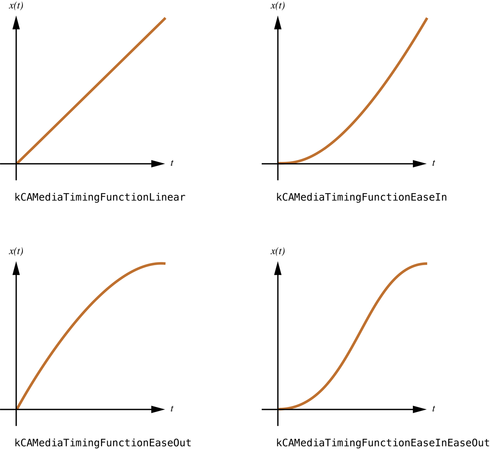

> 导航：[总目录](../../../README.md) · [文档](../../../_indexes/documentation.md) · [动画类型与时间控制编程指南](Introduction%20to%20Animation%20Types%20and%20Timing%20Programming%20Guide.md)


[下一页](Property-Based%20Animations.md)[上一页](Animation%20Class%20Roadmap.md)

# 时间控制、时间空间与 CAAnimation

用最简单的说法来定义，动画（animation）就是某个值随时间发生变化。Core Animation 为动画和图层（layer）都提供了基础的时间控制功能，从而带来了强大的时间轴能力。

本章讨论时间控制协议，以及所有动画子类共有的基本动画支持。

Core Animation 的时间控制模型由 `CAMediaTiming` 协议描述，并由 `CAAnimation` 类及其子类采用。该时间控制模型规定了动画的时间偏移、时长、速度和重复行为。

`CAMediaTiming` 协议同样被 `CALayer` 类采用，这使得一个图层可以定义相对于其超图层的时间空间（timespace）；这与描述一个相对坐标空间的方式类似。图层树时间空间这一概念提供了一条可缩放的时间轴，它从根图层开始，一直贯穿其所有后代图层。由于动画必须与某个图层关联才能显示出来，所以动画的时间控制会被缩放到该图层所定义的时间空间中。

动画或图层的 `speed` 属性指定了这个缩放系数。举例来说，一个 10 秒的动画被附加到某个图层上，而该图层的时间空间 speed 值为 2，那么这个动画只需 5 秒就能显示完（速度是原来的两倍）。如果该图层的某个子图层也定义了 2 的速度系数，那么它上面的动画将在 1/4 的时间内显示完（超图层的速度 \* 子图层的速度）。

类似地，图层的时间空间也会影响动态图层媒体（例如 Quartz Composer 合成）的播放。把 `QCCompositionLayer` 的速度加倍，会让该合成的播放速度变为两倍，同时也会把附加到该图层上的所有动画速度加倍。同样，这种效果是分层传递的，因此 `QCCompositionLayers` 的任何子图层也会以提升后的速度显示其内容。

动画使用 `CAMediaTiming` 协议的 `duration` 属性来定义动画的单次迭代需要多少秒才能显示完。`CAAnimation` 子类的 duration 默认值为 0 秒，这表示该动画应使用其所在事务（transaction）中指定的时长；若事务未指定时长，则使用 0.25 秒。

时间控制协议通过 `beginTime` 和 `timeOffset` 这两个属性，提供了让动画从其时长中某个秒数处开始播放的手段。`beginTime` 指定动画应从其时长的第几秒开始，并且会被缩放到该动画所属图层的时间空间中。`timeOffset` 指定一个额外的偏移量，但它是以本地活动时间（local active time）表示的。两个值会被合并起来，共同决定最终的起始偏移。

动画的重复行为同样由 `CAMediaTiming` 协议的 `repeatCount` 和 `repeatDuration` 属性决定。`repeatCount` 指定动画应重复的次数，可以是小数。对于一个 10 秒的动画，把 `repeatCount` 设为 2.5 会让该动画总共运行 25 秒，并在第三次迭代进行到一半时结束。把 repeatCount 设为 `1e100f` 会让动画一直重复，直到它被从图层上移除。

`repeatDuration` 与 `repeatCount` 类似，只不过它是以秒而不是以迭代次数来指定的。`repeatDuration` 同样可以是小数值。

动画的 `autoreverses` 属性决定动画在正向播放结束后是否倒着播放一遍；前提是指定了多次重复。

时间控制协议的 `fillMode` 属性定义了动画在其活动时长之外将如何显示。动画可以被冻结在起始位置、结束位置、两者都冻结，或者完全从显示中移除。默认行为是动画完成后就把它从显示中移除。

动画的节奏决定了插值出来的各个值如何分布在动画的整个时长上。为特定视觉效果选用合适的节奏，可以大大增强它对用户的感染力。

动画的节奏由一个时间函数表示，该函数以三次贝塞尔曲线的形式表达。这个函数把动画单个周期的时长（归一化到 [0.0,1.0] 区间）映射到输出时间（同样归一化到该区间）。

`CAAnimation` 类的 timingFunction 属性指定一个 `CAMediaTimingFunction` 实例，该类负责封装时间控制功能。

`CAMediaTimingFunction` 提供了两种指定映射函数的方式：用于常见节奏曲线的常量，以及通过指定两个控制点来创建自定义函数的方法。

向 `CAMediaTimingFunction` 的类方法 `functionWithName:` 传入以下常量之一，即可获得预定义的时间函数：

- `kCAMediaTimingFunctionLinear` 指定线性节奏。线性节奏会让动画在其整个时长内均匀地进行。
- `kCAMediaTimingFunctionEaseIn` 指定缓入（ease-in）节奏。缓入节奏会让动画开始时较慢，随着进行逐渐加速。
- `kCAMediaTimingFunctionEaseOut` 指定缓出（ease-out）节奏。缓出节奏会让动画开始时较快，接近完成时逐渐减慢。
- `kCAMediaTimingFunctionEaseInEaseOut` 指定缓入缓出节奏。缓入缓出的动画开始时较慢，在时长中段加速，然后在完成前再次减慢。

图 1 以三次贝塞尔时间曲线的形式展示了这些预定义的时间函数。

__图 1__  预定义时间函数的三次贝塞尔曲线表示



自定义时间函数通过类方法 `functionWithControlPoints::::` 或实例方法 `initWithControlPoints::::` 创建。贝塞尔曲线的两个端点会自动设为 (0.0,0.0) 和 (1.0,1.0)，创建方法期望的参数是 `c1x`、`c1y`、`c2x` 和 `c2y`。最终定义这条贝塞尔曲线的控制点为：`[(0.0,0.0), (c1x,c1y), (c2x,c2y), (1.0,1.0)]`。

清单 1 展示了一个示例代码片段，它使用控制点 `[(0.0,0.0), (0.25,0.1), (0.25,0.1), (1.0,1.0)]` 创建了一个自定义时间函数。

__清单 1__  自定义 CAMediaTimingFunction 的代码片段

```objc
CAMediaTimingFunction *customTimingFunction;
customTimingFunction=[CAMediaTimingFunction functionWithControlPoints:0.25f :0.1f :0.25f :1.0f];
```


`CAAnimation` 类提供了在动画开始和停止时通知某个委托（delegate）对象的手段。

如果一个动画指定了委托，那么该委托会收到 `animationDidStart:` 消息，其中传入已开始的那个动画实例。当动画停止时，委托会收到 `animationDidStop:finished:` 消息，其中传入已停止的动画实例，以及一个布尔值，表示该动画是成功走完了它的时长，还是被手动停止的。

[下一页](Property-Based%20Animations.md)[上一页](Animation%20Class%20Roadmap.md)

