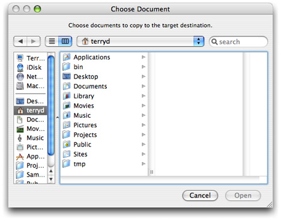

> 导航：[总目录](../../../README.md) · [documentation](../../../_indexes/documentation.md) · [Application File Management](Introduction%20to%20Application%20File%20Management.md)


[Next](Managing%20Accessory%20Views.md)[Previous](Filtering%20Out%20Browser%20Items.md)

# Configuring a Choose Dialog

The Choose dialog, according to _Apple Human Interface Guidelines_, “lets a user select an item as the target of a task.“ The item is a file-system item, such as a file or a directory. But unlike an Open panel, a Choose dialog allows users to select files or directories without necessarily opening them. If you need to display a Choose dialog in your application, you can do so with a specially configured Open panel. A Choose dialog is an Open panel that:

- Has a title of “Choose _ObjectOrAction_”, where _ObjectOrAction_ identifies the type of items or signifies the task to be performed on the items

  Ideally, the title of a Choose dialog and the title of the menu item or control initiating the command should match (for example, “Choose Picture”). Also, it is helpful to include some instructional text in the panel, such as “Choose a picture to display in the background.“
- Restricts the selection of items to a particular type or types
- Starts browsing at the user’s home directory
- Allows multiple selection of items (if appropriate)
- Can have an accessory view (see [Managing Accessory Views](Managing%20Accessory%20Views.md#apple-f4xwc4dqnrsv64tfmyxwi33df52wszbpkridimbqga2dsmrrfvjvomi)) with a Show pop-up menu to filter the types of files that are selectable

Some requirements of a Choose dialog are supported by `NSOpenPanel` by default, such as document preview and the ability to resize the dialog.

Listing 1 shows you might configure, run, and manage a Choose dialog.

__Listing 1__  Configuring and running a Choose dialog

```objc
- (IBAction)copyFiles:(id)sender
{
    int result;
    NSArray *fileTypes = [NSArray arrayWithObjects:@"txt", @"rtf", @"doc", nil];
    NSOpenPanel *oPanel = [NSOpenPanel openPanel];

    [oPanel setAllowsMultipleSelection:YES];
    [oPanel setTitle:@"Choose Document"];
    [oPanel setMessage:@"Choose documents to copy to the target destination."];
    [oPanel setDelegate:self];
    result = [oPanel runModalForDirectory:NSHomeDirectory() file:nil types:fileTypes];
    if (result == NSOKButton) {
        NSArray *filesToCopy = [oPanel filenames];
        int i, count = [filesToCopy count];
        NSFileManager *fm = [NSFileManager defaultManager];
        for (i=0; i<count; i++ ) {
            NSString *filePath = [filesToCopy objectAtIndex:i];
            NSString *destPath = [[self destinationPath] stringByAppendingPathComponent:[filePath lastPathComponent]];
            [fm copyPath:filePath toPath:destPath handler:self];
        }
    }
}
```

This code displays a Choose dialog similar to the one depicted in the following screen shot:


[Next](Managing%20Accessory%20Views.md)[Previous](Filtering%20Out%20Browser%20Items.md)

