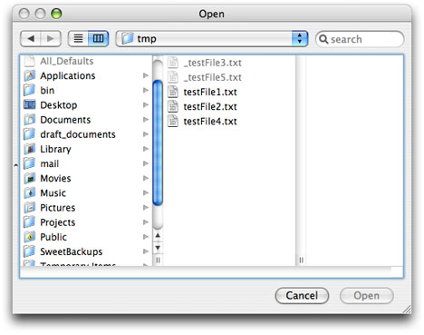

> 导航：[总目录](../../../README.md) · [documentation](../../../_indexes/documentation.md) · [Application File Management](Introduction%20to%20Application%20File%20Management.md)


[Next](Configuring%20a%20Choose%20Dialog.md)[Previous](Getting%20the%20Current%20Selection.md)

# Filtering Out Browser Items

Suppose you want to prevent certain files in an [NSOpenPanel](https://developer.apple.com/documentation/appkit/nsopenpanel) object from being selected by the user. You don’t want to filter them out by their extension—other files with the same extension are valid selections—but by some other characteristic. The files could be temporary files or files that contain data you don’t want users to have access to. You can filter files from being selectable in a browser by implementing the delegation method [panel:shouldShowFilename:](https://developer.apple.com/documentation/objectivec/nsobject/1539030-panel).

Let’s assume that the convention of an initial underscore for a filename marks it as a private file, and you don’t want users to open these files in your application. There are two of these files in a certain directory:

```
testFile1.txt
testFile2.txt
_testFile3.txt
testFile4.txt
_testFile5.txt
```

When you configure an `NSOpenPanel` object, set a delegate for it; then implement the `panel:shouldShowFilename:`method as illustrated in Listing 1. This method is called for each filename to be displayed in the panel’s browser; return `NO` if the file should not be selectable.

__Listing 1__  Implementing the `panel:shouldShowFilename:` method

```objc
- (BOOL)panel:(id)sender shouldShowFilename:(NSString *)filename {
    NSString *lpc = [filename lastPathComponent];
    if ([lpc characterAtIndex:0] == '_')
        return NO;
    return YES;
}
```

When you next run the open panel and select the directory containing these files, you’ll find that he files with the underscore prefixes are now grayed out and are not selectable.


[Next](Configuring%20a%20Choose%20Dialog.md)[Previous](Getting%20the%20Current%20Selection.md)

