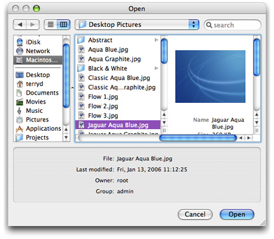

> 导航：[总目录](../../../README.md) · [documentation](../../../_indexes/documentation.md) · [Application File Management](Introduction%20to%20Application%20File%20Management.md)


[Next](Filtering%20Out%20Browser%20Items.md)[Previous](Using%20an%20Open%20Panel.md)

# Getting the Current Selection

You can get the currently selected item in the browser of an [NSSavePanel](https://developer.apple.com/documentation/appkit/nssavepanel) or [NSOpenPanel](https://developer.apple.com/documentation/appkit/nsopenpanel) object by having the delegate of the panel object implement the [panelSelectionDidChange:](https://developer.apple.com/documentation/appkit/nsopensavepaneldelegate/1533556-panelselectiondidchange) delegation method. The delegate then can perform some operation based on the user’s selection, such as displaying metadata about a chosen file in an accessory view, as illustrated in Figure 1.

__Figure 1__  Displaying information about the current selection



In its implementation of `panelSelectionDidChange:`, the delegate sends a message back to the `NSOpenPanel` or `NSSavePanel` object (_sender_) to get the current filename. For `NSSavePanel`, this message is [filename](https://developer.apple.com/documentation/appkit/nssavepanel/1539019-filename); for `NSOpenPanel`, send [filenames](https://developer.apple.com/documentation/appkit/nsopenpanel/1584362-filenames) and then get the first item in the array. Listing 1 shows how you might implement the method to display in the information in the accessory view in Figure 1.

__Listing 1__  Getting the selection in the panel browser

```objc
- (void)panelSelectionDidChange:(id)sender {
    NSArray *curFiles = [sender filenames];
    if ([curFiles count] == 1) { // ignore multiple selections
        NSString *curPath = [curFiles objectAtIndex:0];
        if (curPath != nil) {
            NSDictionary *fAttrs = [[NSFileManager defaultManager] fileAttributesAtPath:curPath traverseLink:YES];
            if (fAttrs != nil) {
                [infoFile setStringValue: [curPath lastPathComponent]];
                [infoMod setStringValue: [[fAttrs objectForKey:NSFileModificationDate] descriptionWithCalendarFormat:@"%a, %b %d, %Y %H:%M:%S" timeZone:nil locale:nil]];
                [infoOwner setStringValue: [fAttrs objectForKey: NSFileOwnerAccountName]];
                [infoGroup setStringValue: [fAttrs objectForKey: NSFileGroupOwnerAccountName]];
            }
        }
    }
}
```

In this code example, the delegate uses the `NSFileManager` method [fileAttributesAtPath:traverseLink:](https://developer.apple.com/documentation/foundation/nsfilemanager/1557004-fileattributesatpath) to fetch information about the currently selected file. It then sets the string value of various text fields in the accessory view.

[Next](Filtering%20Out%20Browser%20Items.md)[Previous](Using%20an%20Open%20Panel.md)

