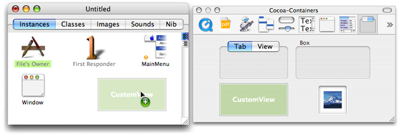
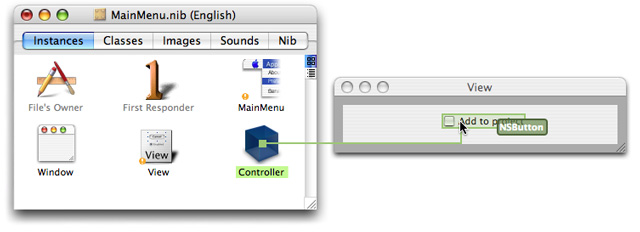
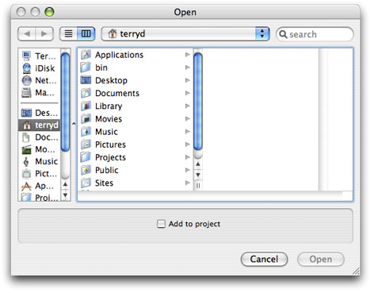

> 导航：[总目录](../../../README.md) · [documentation](../../../_indexes/documentation.md) · [Application File Management](Introduction%20to%20Application%20File%20Management.md)


[Next](Document%20Revision%20History.md)[Previous](Configuring%20a%20Choose%20Dialog.md)

# Managing Accessory Views

An accessory view is a view containing controls and other views that you can add to an existing Cocoa panel. The controls affect in some way the item (or items) chosen in the panel, and the views may display an image or other data related to the selected item. Many Cocoa classes allow you to add an accessory view to their objects via the [setAccessoryView:](https://developer.apple.com/documentation/appkit/nssavepanel/1525544-accessoryview) method. These include [NSSavePanel](https://developer.apple.com/documentation/appkit/nssavepanel), and its subclass [NSOpenPanel](https://developer.apple.com/documentation/appkit/nsopenpanel)), [NSFontPanel](https://developer.apple.com/documentation/appkit/nsfontpanel), [NSColorPanel](https://developer.apple.com/documentation/appkit/nscolorpanel), [NSPrintPanel](https://developer.apple.com/documentation/appkit/nsprintpanel), [NSPageLayout](https://developer.apple.com/documentation/appkit/nspagelayout), [NSSpellChecker](https://developer.apple.com/documentation/appkit/nsspellchecker) (in its spelling-correction panel), [NSAlert](https://developer.apple.com/documentation/appkit/nsalert), and [NSRulerView](https://developer.apple.com/documentation/appkit/nsrulerview). The location of the accessory view varies from object to object. However, the procedure for creating, adding, and accessing an accessory (summarized in the sections below) is essentially similar for all of these classes.

To create an accessory view in Interface Builder, start by dragging a CustomView object from the Containers palette to a nib file window.

__Figure 1__  Adding a view to the top level of a nib file



Change the size of the view to generally fit the width of the panel it’s going to be added to. Add all required controls, text fields, image views, and other palette objects to the accessory view.

You next need to specify outlets from some controller object to both the accessory view and its individual controls and connect those outlets. Instead of outlets, you could also define attributes in a controller or model object and then establish bindings between the controls of the accessory view and those attributes. Figure 2 shows the former approach.

__Figure 2__  Connecting an outlet



Save the nib file. The remainder of the procedure takes place in the Xcode application.

In your application’s method that responds to the action message requesting the opening of a file, get the shared instance of `NSOpenPanel` and configure it appropriately, as described in [Using an Open Panel](Using%20an%20Open%20Panel.md#apple-f4xwc4dqnrsv64tfmyxwi33df52wszbpgiydambqg43tolkciffemqsbifea). As part of panel configuration, send the [setAccessoryView:](https://developer.apple.com/documentation/appkit/nssavepanel/1525544-accessoryview) message to the panel object, passing in the outlet to the accessory view. Then run the Open panel and, when the user clicks the OK button, check the state of the controls on the accessory view (via outlets or bindings). Process the selected files accordingly.

Listing 1 illustrates how you might do this.

__Listing 1__  Adding an accessory view and accessing its control

```objc
- (IBAction)openFile:(id)sender
{
    int result;
    NSArray *fileTypes = [NSArray arrayWithObject:@"xml"];
    NSOpenPanel *oPanel = [NSOpenPanel openPanel];

    [oPanel setAllowsMultipleSelection:YES];
    [oPanel setAccessoryView:accessView]; // add the accessory view to the open panel
    result = [oPanel runModalForDirectory:NSHomeDirectory() file:nil types:fileTypes];
    if (result == NSOKButton) {
        NSArray *filesToOpen = [oPanel filenames];
        int i, count = [filesToOpen count];
        for (i=0; i<count; i++ ) {
            NSString *aFile = [filesToOpen objectAtIndex:i];
            if ([addToProj state] > 0) {   // is check box in accessory view checked?
                [self addToProject:aFile];
            }
            [[NSWorkspace sharedWorkspace] openFile:aFile withApplication:@"Sweet.app"];
        }
    }
}
```

This code causes an Open panel similar to the following to be displayed



[Next](Document%20Revision%20History.md)[Previous](Configuring%20a%20Choose%20Dialog.md)

