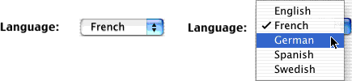
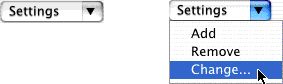

> 导航：[总目录](../../../README.md) · [documentation](../../../_indexes/documentation.md) · [Application Menu and Pop-up List Programming Topics](Introduction%20to%20Application%20Menus%20and%20Pop-up%20Lists.md)


[Next](Displaying%20a%20Contextual%20Menu.md)[Previous](Setting%20a%20Menu%20Item%E2%80%99s%20Key%20Equivalent.md)

# Managing Pop-Up Buttons and Pull-Down Lists

Pop-up buttons and pull-down lists are both implemented by the `NSPopUpButton` class. You can choose from a pop-up list or a pull-down list, with the [setPullsDown:](https://developer.apple.com/documentation/appkit/nspopupbutton/1532070-pullsdown) method. A pop-up list lets the user choose one option among several and generally displays the option that was last selected. A pull-down list is generally used for selecting commands in a specific context.

A pop-up button displays several options and generally displays the option that was last selected. The following illustration shows a pop-up button before and while its menu is displayed. (Note that “Language:” isn’t part of the pop-up button.)



When the pop-up menu is displayed, the pop-up button’s cell displays the list on top of the popup button. The currently selected choice appears in the same location as the popup button with the other items arranged above or below the current selection according to the order of the cell’s menu. When the popup list is dismissed, the title of the popup button changes to match the title of the currently selected item.

You generally use a pull-down for selecting commands in a specific context. The following illustration shows a pull-down list before and while its menu is displayed.



You can think of a pull-down list as a compact form of menu. A pull-down list’s display isn’t affected by the user’s actions, and a pull-down list usually displays the first item in the list. When the commands only make sense in the context of a particular display, you can use a pull-down list in that display to keep the related actions nearby and to keep them out of the way when that display isn’t visible.

Pulldown lists typically display themselves adjacent to the popup button in the same way a submenu is displayed next to its parent item. Unlike popup lists, the title of a popup button displaying a pulldown list is not based on the currently selected item and thus remains fixed unless you change using the cell’s `setTitle:` method.

While popup lists are displayed right over their button, the location of the pulldown list depends on the preferred edge, set through the cell’s `setPreferredEdge:` method. By default, the list appears under the cell. When drawing the list, the cell does its best to honor the preferred edge if there is enough space on the user’s screen. If there is not enough space, the cell positions the list somewhere else.

Note that in a pull-down list, the first item is stored at index 1, not index 0 as is the case with pop-up lists or ordinary menus. This is done so that the pull-down list’s title can be stored at index 0 if necessary. Even when the title is stored at index 0, always change the buttons title with the `setTitle:` method.

In many cases, it is easiest to populate a pop-up button using Cocoa bindings (see _[Cocoa Bindings Programming Topics](../Cocoa%20Bindings%20Programming%20Topics/Introduction%20to%20Cocoa%20Bindings%20Programming%20Topics.md#apple-f4xwc4dqnrsv64tfmyxwi33df52wszbpgeydambqge3do2i)_). You typically bind the `contentObjects` value of the button to the `arrangedObjects` of an array controller, and the `contentValues` value of the button to the same path but adding as the final path component the key of the attribute you want to use as the button title. For more details, see [NSPopUpButton Bindings](https://developer.apple.com/library/archive/documentation/Cocoa/Reference/CocoaBindingsRef/BindingsText/NSPopUpButton.html#//apple_ref/doc/uid/NSPopUpButton).

You can also modify a pop-up button programmatically. To add items to a pop-up button cell’s list, use the methods `addItemWithTitle:`, `addItemsWithTitles:`, and `insertItemWithTitle:atIndex:`. These methods create or replace a menu item with the given title and assign it a default action and key equivalent. Once the item is added to the list, use `NSMenuItem` methods to modify the attributes of the item. To remove one or more items, use the `removeItemWithTitle:`, `removeItemAtIndex:`, or `removeAllItems` method.

There are two ways to assign an action method to a pop-up button. You can assign actions to each menu item in the pop-up. Or you can assign an action directly to the pop-up button, and it’s invoked whenever the user selects any menu item that doesn’t have its own action. The second way is especially useful with pop-up lists.

Here’s a sample action for a pop-up menu. It’s part of a controller object that sets an instance variable named `language` to a constant corresponding to the item the user has chosen. You use Interface Builder to create the `NSPopUpButton` object, configure it as a pop-up list, and add items to it—setting the tags of the menu items to equal the corresponding value in the `enum`. The code you write might look like this:

```objc
typedef enum : NSUInteger
{
    English = 1, French, German, Spanish, Swedish
} LanguageValue;

- (void)setLanguageFrom:(id)sender
{
    [self setLanguage:[[sender selectedItem] tag]];
}
```

[Next](Displaying%20a%20Contextual%20Menu.md)[Previous](Setting%20a%20Menu%20Item%E2%80%99s%20Key%20Equivalent.md)

