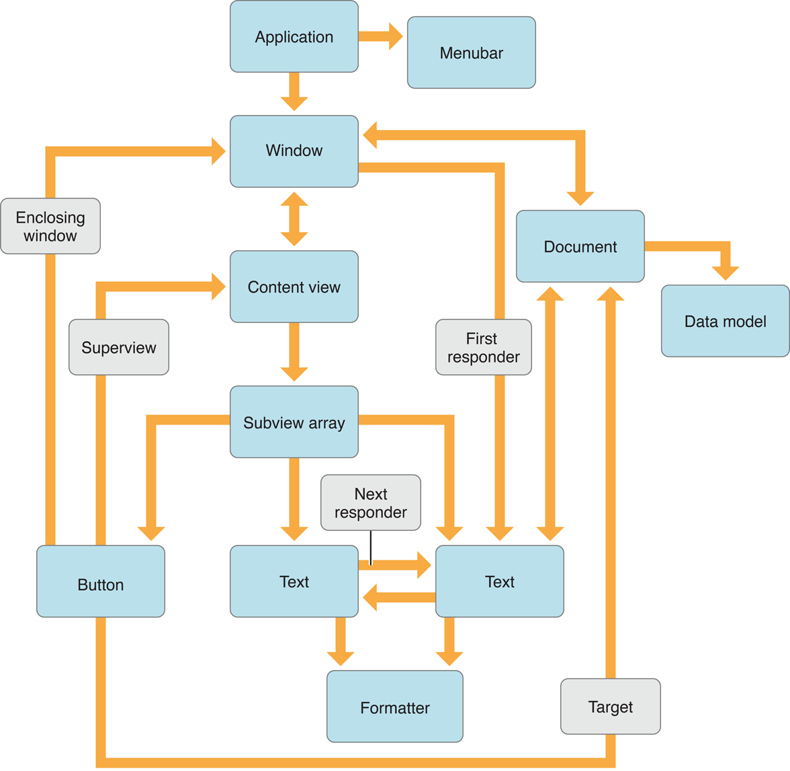

> 导航：[总目录](../../../README.md) · [documentation](../../../_indexes/documentation.md) · [归档与序列化编程指南](Introduction.md)

[下一页](Archives.md)[上一页](Introduction.md)

# 对象图

面向对象的应用程序包含由相互关联的对象组成的复杂网络。对象之间通过一个对象拥有或包含另一个对象、或持有对另一个对象的引用并向其发送消息而彼此关联。这种对象之间的网络被称为对象图。

即使只有极少数对象，应用程序的对象图也会因为循环引用和对单个对象的多重链接而变得非常错综复杂。[Figure 1](#apple-f4xwc4dqnrsv64tfmyxwi33df52wszbpgiydambrgi4tgljrgeytonbsfvbeeq2eijdegqi) 展示了 OS X 中一个简单 Cocoa 应用程序的不完整对象图（图中所示的连接远少于实际数量）。以窗口的视图层次结构部分为例：这一层次结构通过每个视图包含其所有直接子视图的列表来描述。然而，视图之间也存在链接，用来描述响应链和键盘焦点循环。视图还会链接到应用程序中的其他对象，用于目标-动作消息、上下文菜单等诸多用途。

__图 1__  应用程序的部分对象图

在某些情况下，你可能希望将一个对象图（通常只是应用程序完整对象图中的一部分）转换为可以保存到文件、或传输到另一个进程或机器、然后再重新构建的形式。在 OS X 中，nib 文件和属性列表就是将对象图保存到文件的两个示例。nib 文件是表示用户界面中复杂关系（例如窗口的视图层次结构）的归档。属性列表则是存储基本值对象的简单层次关系的序列化。有关归档和序列化的更多细节以及使用方法，将在以下小节中描述。

一个归档可以存储任意复杂的对象图。归档会保留图中每个对象的身份标识，以及它与图中所有其他对象之间的全部关系。解档时，重建出的对象图除少数例外情况外，应与原始对象图完全一致。

你的应用程序可以将归档用作数据模型的存储介质。你无需设计（并维护）专门的数据文件格式，而是可以利用 Cocoa 的归档基础设施，将对象直接存储到归档中。

要支持归档，对象必须采纳 [NSCoding](https://developer.apple.com/library/archive/documentation/LegacyTechnologies/WebObjects/WebObjects_3.5/Reference/Frameworks/ObjC/Foundation/Protocols/NSCoding/Description.html#//apple_ref/occ/intf/NSCoding) [协议](https://developer.apple.com/library/archive/documentation/General/Conceptual/DevPedia-CocoaCore/Protocol.html#//apple_ref/doc/uid/TP40008195-CH45)，该协议由两个方法组成：一个方法将对象的重要实例变量编码到归档中，另一个方法从归档中解码并恢复这些实例变量。

所有 Foundation 的[值对象](https://developer.apple.com/library/archive/documentation/General/Conceptual/DevPedia-CocoaCore/ValueObject.html#//apple_ref/doc/uid/TP40008195-CH51)（`NSString`、`NSArray`、`NSNumber` 等）以及大多数 Application Kit 和 UIKit 的用户界面对象都采纳了 `NSCoding`，因此可以放入归档中。每个类的参考文档都会说明该类是否采纳了 `NSCoding`。

序列化存储值对象的简单层次结构，例如字典、数组、字符串和二进制数据。序列化只保留对象的值及其在层次结构中的位置。对同一个值对象的多次引用，在反序列化时可能会产生多个对象。对象的可变性也不会被保留。

[属性列表](https://developer.apple.com/library/archive/documentation/General/Conceptual/DevPedia-CocoaCore/PropertyList.html#//apple_ref/doc/uid/TP40008195-CH44)就是序列化的例子。应用程序属性（`Info.plist` 文件）和用户偏好设置都以属性列表的形式存储。

[下一页](Archives.md)[上一页](Introduction.md)
