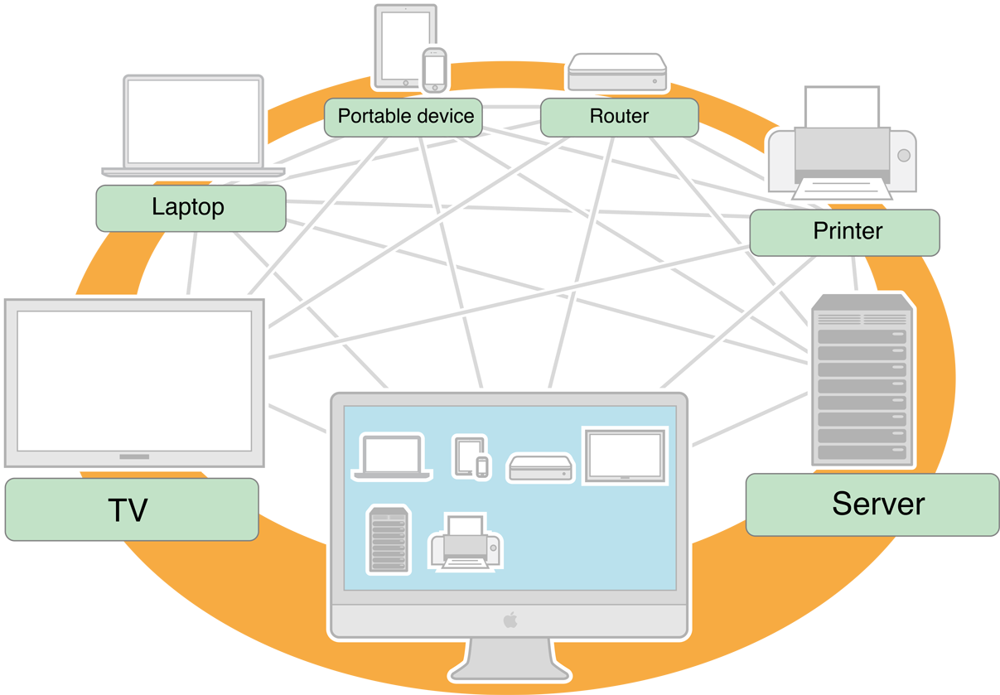

> 导航：[总目录](../../../README.md) · [文档](../../../_indexes/documentation.md)

[下一页](Bonjour%20Concepts.md)

# 关于 Bonjour

Bonjour 零配置联网（zero configuration networking）架构支持在局域网或广域网上发布和发现基于 TCP/IP 的服务。本文档从较高层面介绍 Bonjour 架构，并简要说明有哪些 Bonjour API 可供使用。

Bonjour 是 Apple 对一整套零配置联网协议的实现，其设计目标是让用户更轻松地完成网络配置。

举例来说，有了 Bonjour，你把打印机接入网络时既不需要为它指定特定的 IP 地址，也不需要在每台电脑上手动录入该地址。借助零配置联网，附近的电脑可以发现这台打印机的存在，并自动确定它的 IP 地址。而且，如果这个地址是动态分配的、之后发生了变化，它们日后也能自动发现新地址。

应用程序同样可以利用 Bonjour 自动探测网络上该应用的其他实例（或其他服务）。例如，两位用户运行同一款 iOS 照片分享应用时，可以通过蓝牙个人局域网互传照片，而无需在任何一台设备上手动配置 IP 地址。

### Bonjour 提供高效的服务发现

Bonjour 协议使用多播 DNS（multicast DNS，mDNS），并在需要时结合链路本地（link-local）编址，以高效而健壮的方式支持服务的通告与发现。

### Bonjour 将 .local 域保留给通过 mDNS 通告的服务

Bonjour 的主机名和服务名是按一套特定规则构造出来的。

### Bonjour 使用 SRV、TXT 和 PTR 记录来查找服务

Bonjour 使用与服务相关的记录来通告服务的存在。`PTR` 记录让你能发现某个域中的所有服务；`SRV` 记录把服务的实例名、类型和域转换成主机名和端口；`A` 和 `AAAA` 记录把主机名转换成 IP 地址；`TXT` 记录则提供关于服务的附加信息。

### Bonjour 在 OS X 和 iOS 中提供多个层次的 API

在 OS X 和 iOS 中，Bonjour 通过 Foundation、Core Foundation 和 C API 提供通告与发现服务的能力。在 OS X 中，Bonjour 还提供 Java API。在 Windows、Linux 等其他平台上，Bonjour 提供 C API。

本文档假定你已经熟悉 _[Networking Overview](../../Networking%20Internet%20Web/Networking%20Overview/About%20Networking.md#apple-f4xwc4dqnrsv64tfmyxwi33df52wszbpkridimbqgeydemrq)_ 和 _[Networking Concepts](../../Networking%20Internet/Networking%20Concepts/Introduction.md#apple-f4xwc4dqnrsv64tfmyxwi33df52wszbpkridimbqgezdiobx)_ 中介绍的联网概念。

- _[DNS Service Discovery Programming Guide](../../Networking/DNS%20Service%20Discovery%20Programming%20Guide/Introduction%20to%20DNS%20Service%20Discovery.md#apple-f4xwc4dqnrsv64tfmyxwi33df52wszbpkridgmbqgaydsnru)_ 介绍适合 Darwin 和 Windows 程序员及开发者使用的 Bonjour API。
- _[NSNetServices and CFNetServices Programming Guide](../../Networking/NSNetServices%20and%20CFNetServices%20Programming%20Guide/About%20NSNetServices%20and%20CFNetServices.md#apple-f4xwc4dqnrsv64tfmyxwi33df52wszbpkridimbqgazdomzw)_ 介绍适合 Cocoa 程序员，以及 OS X 和 iOS 上的 C、C++ 程序员使用的 Bonjour API。
[下一页](Bonjour%20Concepts.md)

