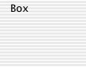
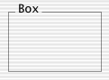
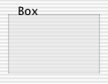

> 导航：[总目录](../../../README.md) · [documentation](../../../_indexes/documentation.md) · [Box Programming Topics](Introduction%20to%20Boxes.md)

[Next](Setting%20a%20Box%E2%80%99s%20Subviews.md)[Previous](Setting%20a%20Box%E2%80%99s%20Title.md)

# Setting a Box’s Border Appearance

The appearance of an NSBox is set using a combination of the methods `setBoxType:` and `setBorderType:`. By default an NSBox instance is set to use the `NSBoxPrimary` box type and the `NSGrooveBorder` border type.

The appearance in Figure 1 is achieved by calling the method `setBorderType:` and specifying `NSNoBorder` as the box type.

__Figure 1__  NSBox with no visible border

The appearance in Figure 2 is achieved by calling the method `setBorderType:` and specifying `NSGrooveBorder` as the border type, and calling `setBoxType:` and specifying `NSBoxPrimary` as the box type.

__Figure 2__  NSBox displaying primary appearance

The appearance in Figure 3 is achieved by calling the method `setBorderType:` and specifying `NSGrooveBorder` as the border type, and calling `setBoxType:` and specifying `NSBoxSecondary` as the box type.

__Figure 3__  NSBox displaying secondary appearance

Note that the border appears inside the box and can reduce the amount of space available to the content rectangle.

[Next](Setting%20a%20Box%E2%80%99s%20Subviews.md)[Previous](Setting%20a%20Box%E2%80%99s%20Title.md)

