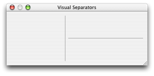

> 导航：[总目录](../../../README.md) · [documentation](../../../_indexes/documentation.md) · [Box Programming Topics](Introduction%20to%20Boxes.md)


[Next](Document%20Revision%20History.md)[Previous](Setting%20a%20Box%E2%80%99s%20Subviews.md)

# Using a Box to Create a Separator

An NSBox instance can be used to create a visual separator between controls, as shown in Figure 1. This is the Cocoa equivalent of the Carbon theme separator.

__Figure 1__  Examples of vertical and horizontal separators



Calling the method `setBoxType:` and specifying `NSBoxSeparator` as the box type will configure the receiving `NSBox` instance to display as a separator.

The separator will be drawn centered in the view, and oriented along the longest axis of the view. If the bounds of the `NSBox` are equal, then the separator is drawn in a horizontal orientation.

The example code in Listing 1 demonstrates how to create visual separators.

__Listing 1__  Example code to create visual separators

```
// create a horizontally oriented separator
NSBox *horizontalSeparator=[[NSBox alloc] initWithFrame:NSMakeRect(15.0,250.0,250.0,1.0)];
[horizontalSeparator setBoxType:NSBoxSeparator];

// create a vertically oriented separator
NSBox *verticalSeparator=[[NSBox alloc] initWithFrame:NSMakeRect(250.0,15.0,1.0,250.0)];
[verticalSeparator setBoxType:NSBoxSeparator];
```

[Next](Document%20Revision%20History.md)[Previous](Setting%20a%20Box%E2%80%99s%20Subviews.md)

