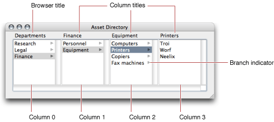

> 导航：[总目录](../../../README.md) · [documentation](../../../_indexes/documentation.md) · [Browser Programming Topics](Introduction%20to%20Browsers.md)

[Next](Using%20a%20Browser%20Delegate.md)[Previous](About%20Browsers.md)

# Browser Interface Features

The user interface features of an NSBrowser can be changed in a number of ways. The NSBrowser may or may not have a horizontal scroller. (The NSBrowser’s columns, by contrast, always have vertical scrollers—although a scroller’s buttons and knob might be invisible if the column doesn’t contain many entries.) You generally shouldn’t create an NSBrowser without a horizontal scroller; if you do, you must make sure the bounds rectangle of the NSBrowser is wide enough that all the columns can be displayed. An NSBrowser’s columns may be bordered and titled, bordered and untitled, or unbordered and untitled. A column’s title may be taken from the selected entry in the column to its left, or may be provided explicitly by the NSBrowser or its delegate.

Figure 1 shows an example of a an NSBrowser.

__Figure 1__  Browser example

These are some aspects of the user interface shown in Figure 1:

- _Browser title:_ You set the NSBrowser’s title through its Title attribute in Interface Builder.
- _Column titles:_ You can change the title of each column through the `setTitle:ofColumn:` instance method of NSBrowser. Note that if you set the browser’s Title attribute in Interface Builder, it’s displayed in place of Column 0’s title.
- _Branch indicator:_ This indicator appears based on the response from the corresponding NSBrowserCell to the `isLeaf` message. The presence of the indicator tells users that when they click the cell, the column to its right displays information that is hierarchically associated under that cell.

[Next](Using%20a%20Browser%20Delegate.md)[Previous](About%20Browsers.md)

