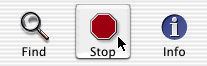

> 导航：[总目录](../../../README.md) · [documentation](../../../_indexes/documentation.md) · [Button Programming Topics](Introduction%20to%20Buttons.md)

[Next](Making%20a%20Button%20the%20Default%20Button.md)[Previous](Setting%20a%20Button%E2%80%99s%20Image.md)

# Hiding a Button

There are two ways to hide a button from view: It can be completely transparent, or it can display its border only when the mouse is over it.

- To make a button transparent, use `setTransparent:`. A transparent button tracks the mouse and sends its action, but doesn’t draw itself. This is useful for sensitizing an area on the screen so that an action gets sent to a target when the area receives a mouse click.
- To have a button display its border only if it’s active and the mouse is over it, use `setShowsBorderOnlyWhileMouseInside:`. The rest of the button’s components are always drawn. Here’s a example of some buttons that show their borders only when the mouse is over them:

  

[Next](Making%20a%20Button%20the%20Default%20Button.md)[Previous](Setting%20a%20Button%E2%80%99s%20Image.md)

