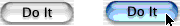
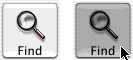
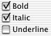
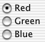

> 导航：[总目录](../../../README.md) · [documentation](../../../_indexes/documentation.md) · [Button Programming Topics](Introduction%20to%20Buttons.md)

[Next](Using%20Push%20Buttons.md)[Previous](How%20Buttons%20Work.md)

# Types of Button

The button type determines how the button acts: how it highlights when pressed and whether it shows its state. The button types fall into three categories:

- [Push Buttons](#apple-f4xwc4dqnrsv64tfmyxwi33df52wszbpgiydambqga4dkljxhe2tsoi)
- [Sticky Buttons](#apple-f4xwc4dqnrsv64tfmyxwi33df52wszbpgiydambqga4dkljxhe4tana)
- [Radio Buttons and Checkboxes](#apple-f4xwc4dqnrsv64tfmyxwi33df52wszbpgiydambqga4dkljygaydmnq)

You set the button type with `setButtonType:`.

These buttons are most useful for triggering actions, since they don’t show their state. They change their appearance when the mouse button is held down and return to their original appearance when the mouse button is released.

- To let [NSButton](https://developer.apple.com/documentation/appkit/nsbutton) control the appearance of a button being pressed, use [NSMomentaryPushInButton](https://developer.apple.com/documentation/appkit/nsmomentarypushinbutton) (called “Momentary Push” in Interface Builder’s Button Inspector). When the mouse button is down, the button appears to be pushed in.

  Here’s an example of a `NSMomentaryPushInButton` button with a bezel style of [NSRoundedBezelStyle](https://developer.apple.com/documentation/appkit/nsroundedbezelstyle) , in both the normal and the pushed-in appearance:

  

  And here’s a sample of a [NSMomentaryPushInButton](https://developer.apple.com/documentation/appkit/nsmomentarypushinbutton) button with a bezel style of [NSThickerSquareBezelStyle](https://developer.apple.com/documentation/appkit/nsthickersquarebezelstyle). The bezel styles [NSRegularSquareBezelStyle](https://developer.apple.com/documentation/appkit/nsregularsquarebezelstyle) and [NSThickSquareBezelStyle](https://developer.apple.com/documentation/appkit/nsthicksquarebezelstyle) are similar.

  
- To control the appearance of a button being pressed yourself, use [NSMomentaryChangeButton](https://developer.apple.com/documentation/appkit/nsmomentarychangebutton) (called “Momentary Change” in Interface Builder’s Button Inspector). When the mouse button is down, it displays the alternate image and alternate title. When the mouse button is released, it displays the normal image and title. If you haven’t set an alternate image or name for the button, its appearance doesn’t change.

These buttons show their state and appear to stick when pressed. After you click one, it appears to stay pressed until you click it again.

- To let [NSButton](https://developer.apple.com/documentation/appkit/nsbutton) control the appearance of a pressed button, use [NSPushOnPushOffButton](https://developer.apple.com/documentation/appkit/nspushonpushoffbutton) (called “Push On/Push Off” in Interface Builder’s Button Inspector). After being clicked once, the button appears to be pushed in. After being clicked again, the button appears to pop back up. The popped-up appearance is for the off state ([NSOffState](https://developer.apple.com/documentation/appkit/nsoffstate)), and the pressed-in appearance is for the on and mixed states ([NSOnState](https://developer.apple.com/documentation/appkit/nsonstate) and [NSMixedState](https://developer.apple.com/documentation/appkit/nsmixedstate)). This is useful for a button that displays the state of something in your application (for example, a button that displays whether the selected text is in boldface).
- To control the appearance of a button being pressed, use [NSToggleButton](https://developer.apple.com/documentation/appkit/nstogglebutton) (called “Toggle” in Interface Builder’s Button Inspector). After being clicked once, the button displays its alternate image and title. After being clicked again, the button displays its normal image and title. If there’s no alternate image or title, the button’s appearance doesn’t change. The normal image and title are for the off state ([NSOffState](https://developer.apple.com/documentation/appkit/nsoffstate)), and the alternate image and title are for the on and mixed states ([NSOnState](https://developer.apple.com/documentation/appkit/nsonstate) and [NSMixedState](https://developer.apple.com/documentation/appkit/nsmixedstate)). This is useful for a button that toggles between two actions (for example, Stop and Start).

If you want a button to display different appearances for all three states, you must subclass [NSButton](https://developer.apple.com/documentation/appkit/nsbutton).

These buttons display the state of something in your application. They’re specialized versions of [NSToggleButton](https://developer.apple.com/documentation/appkit/nstogglebutton) that have system-defined images.

- To choose between two choices, use [NSSwitchButton](https://developer.apple.com/documentation/appkit/nsswitchbutton), which looks like a check box. This type of button is available as a separate palette item in Interface Builder.

  
- To choose among more than two choices, use a matrix of [NSRadioButton](https://developer.apple.com/documentation/appkit/nsradiobutton) buttons. The matrix and the radio buttons work together to make sure that only one button is on at a time. This type of button is available as a separate palette item in Interface Builder.

  

Changing the images used for these buttons could lead to unpredictable results. If you want a switch or radio button with a customized appearance, either customize a toggle button or subclass [NSButton](https://developer.apple.com/documentation/appkit/nsbutton).

Although checkboxes and radio buttons can display different images for all three states, other types of buttons cannot.

[Next](Using%20Push%20Buttons.md)[Previous](How%20Buttons%20Work.md)

