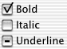

> 导航：[总目录](../../../README.md) · [documentation](../../../_indexes/documentation.md) · [Button Programming Topics](Introduction%20to%20Buttons.md)

[Next](Using%20Radio%20Buttons.md)[Previous](Using%20Push%20Buttons.md)

# Using Checkboxes

A checkbox displays the setting of something in your application. Another name for a checkbox is switch button. A checkbox is identified square with a line of text.

You use the [NSButton](https://developer.apple.com/documentation/appkit/nsbutton) property `state` to set the state of a checkbox. The possible states are [NSOnState](https://developer.apple.com/documentation/appkit/nsonstate), [NSOffState](https://developer.apple.com/documentation/appkit/nsoffstate), and [NSMixedState](https://developer.apple.com/documentation/appkit/nsmixedstate). If the button is off, the box is empty. If the button is on, the box has a checkmark in it. If the button is mixed-state, the box has a dash in it.

It’s easiest to create a checkbox in Interface Builder. You can also create one programmatically by creating an instance of `NSButton` with a type of `NSSwitchButton`.

Unlike a group of radio buttons, more than one item can be on in a group of checkboxes. This group of buttons displays that all of the selected characters are bold, none are italic, and some are underlined:

You can also have a checkbox that’s an icon button; that is, one that’s primarily identified by its icon and has little or no text. If the button’s off, it appears to be sticking out. If the button’s on, it appears to be pressed in. (An icon button cannot display the mixed state.)

You can create an icon checkbox in either Interface Builder or programmatically. If you use Interface Builder, start with a push button. If you create it programmatically, create an instance of `NSButton`. Then change it by setting its type to `NSPushOnPushOffButton`, its image position to `NSImageOnly`, its bezel type to a square bezel type. Then set the image to what you want.

[Next](Using%20Radio%20Buttons.md)[Previous](Using%20Push%20Buttons.md)

