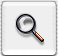

> 导航：[总目录](../../../README.md) · [documentation](../../../_indexes/documentation.md) · [Button Programming Topics](Introduction%20to%20Buttons.md)

[Next](Using%20Checkboxes.md)[Previous](Types%20of%20Button.md)

# Using Push Buttons

A push button performs the action described by the button’s name. Generally, it’s a rounded rectangle that contains its name inside. For example, this button might appear in a dialog box that finds text in a document:

It’s easiest to create a push button in Interface Builder. You can also create one programmatically by creating an `NSButton` instance with a type of `NSMomentaryPushInButton`, an image position of `NSNoImage`, and a border of `NSRoundedBezelStyle`.

You can also have a push button that’s an icon button; that is, one that’s primarily identified by its icon and has little or no text. It’s rectangular, like this:

You can create an icon push button in either Interface Builder or programmatically. If you use Interface Builder, start with a regular push button. If you create it programmatically, create an `NSButton` instance, then set its type to `NSMomentaryPushInButton`, its image position to `NSImageOnly`, its bezel type to a square bezel type. Finally, set the image to what you want.

You can also have a push button that toggles between two states, with each state having its own title and image. For example, a button could toggle between Start and Stop. You can create one in the same way you create a regular push button with either Interface Builder or programmatically. Just change the button type to `NSToggleButton`. Then give the button an alternate title and image as well as a regular title and image. The button displays the regular title and image at first, then displays the alternate title and image after the user clicks it.

[Next](Using%20Checkboxes.md)[Previous](Types%20of%20Button.md)

